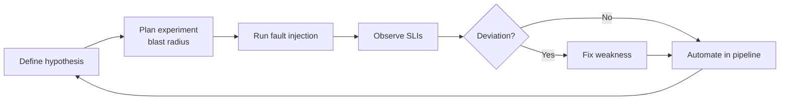
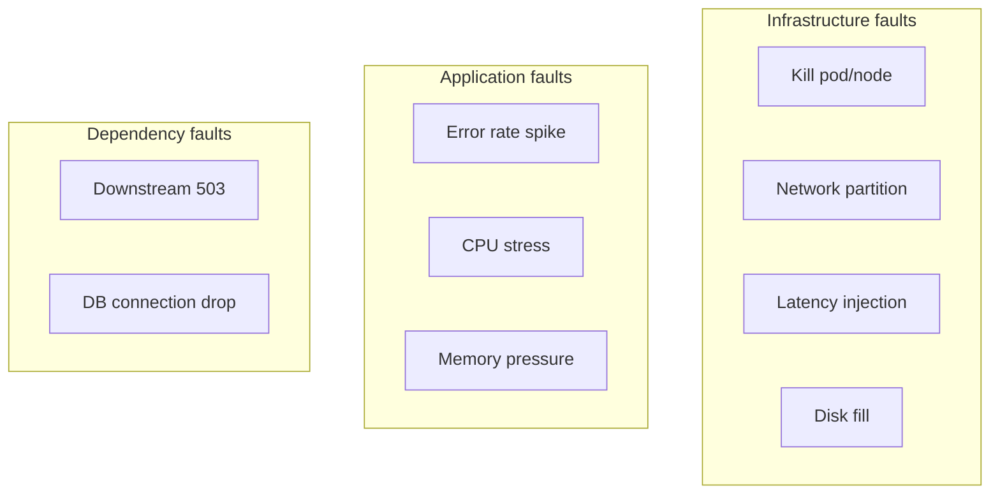
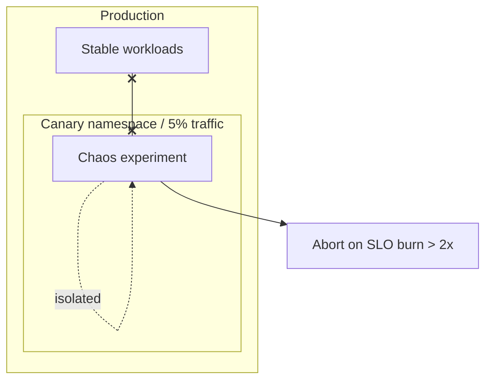
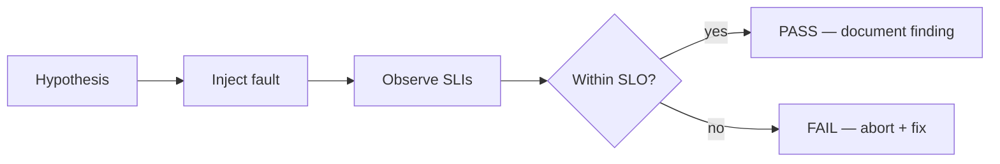

# Chaos Engineering

## 1. Executive Summary

**Chaos engineering** is the discipline of experimenting on production or production-like systems by injecting **controlled faults** to build confidence that systems withstand turbulent conditions. Originating at Netflix with **Chaos Monkey**, it operationalizes the reality that **distributed systems fail**—and untested failure modes hurt more than injected ones.

Chaos experiments follow a scientific method: define **steady-state hypothesis**, inject **blast-radius-limited** faults, observe deviations, fix weaknesses, automate. It complements **unit tests** (code correctness) and **load tests** (capacity) by validating **resilience assumptions**—timeouts, fallbacks, circuit breakers, and runbooks.

Principal architects establish **governance**: when experiments run, approval workflows, abort conditions, and integration with **SLO error budgets**—not "randomly break prod Friday."

## 2. Why This Topic Matters

Reliability interviews increasingly ask:

- Difference between **chaos engineering** and **testing**.
- How to start without causing outages.
- **Blast radius** control and **abort conditions**.
- Relationship to **SRE** and **game days**.
- Examples of faults to inject (latency, packet loss, pod kill).

Weak answers treat chaos as reckless or confuse it with unplanned outages.

## 3. Problems Being Solved

| Problem | Chaos engineering response |
|---------|---------------------------|
| Unknown failure modes | Discover before customers do |
| Resilience code never exercised | Breakers/timeouts validated under fault |
| False confidence from happy-path tests | Steady-state metrics under stress |
| Runbook untested | Game days with injected faults |
| Over-engineered resilience | Prove necessity with experiments |
| Organizational fear of failure | Controlled learning culture |

Chaos does **not** replace: code review, security testing, capacity planning, or DR testing (though it complements DR game days).

## 4. Assumptions and System Model

| Assumption | Implication |
|------------|-------------|
| **Production-like behavior matters** | Staging chaos valuable; prod chaos highest signal |
| **Steady state is measurable** | SLIs required for hypothesis |
| **Blast radius can be bounded** | Start small: one AZ, one canary, one service |
| **Abort path exists** | Auto-rollback on SLO breach |
| **Team on-call aware** | No surprise experiments during sensitive periods |

**Experiment model:** Hypothesis → Method (fault) → Rollback → Results → Fix → Automate in pipeline.

## 5. Essential Terminology

| Term | Definition |
|------|------------|
| **Steady-state hypothesis** | Expected normal behavior metrics during experiment |
| **Blast radius** | Scope of fault impact (pods, AZ, region) |
| **Fault injection** | Latency, error, CPU, network partition, kill |
| **Game day** | Planned reliability exercise often with chaos |
| **Chaos Monkey** | Random instance termination (Netflix origin) |
| **Litmus / Chaos Mesh** | K8s chaos engineering frameworks |
| **Gremlin** | Commercial chaos platform |
| **Abort condition** | Auto-stop if error budget burns too fast |
| **Failure injection** | Synonym for controlled fault |
| **Antifragile** | Systems improving from stress—aspirational goal |

## 6. Core Mechanism

### Chaos experiment workflow



*Figure 1: Scientific method loop—hypothesis, experiment, learn, harden.*

### Fault injection types



*Figure 2: Layered fault catalog—infrastructure, application, and dependency targets.*

### Blast radius containment



*Figure 3: Start chaos in canary scope with automatic abort on error budget burn.*

## 7. Step-by-Step Walkthrough

**Scenario:** Validate payment service circuit breaker under downstream latency.

| Step | Action |
|------|--------|
| 1 | Hypothesis: p99 checkout < 2s; error rate < 0.1% when payment +200ms |
| 2 | Scope: staging with prod-like traffic shadow OR 5% canary |
| 3 | Tool: Litmus network chaos on payment-service pod |
| 4 | Inject: 200ms latency on 50% requests for 10 minutes |
| 5 | Observe: breaker opens? checkout degrades gracefully? |
| 6 | Result: breaker threshold too high—tune from 50% to 30% errors |
| 7 | Automate: weekly staging experiment in CI pipeline |
| 8 | Document: runbook update for payment latency incident |

**Chaos maturity model:**

| Level | Practice | Org readiness |
|-------|----------|---------------|
| 0 | No fault injection | Reactive only |
| 1 | Ad-hoc staging experiments | Learning |
| 2 | Automated staging in CI | Regression detection |
| 3 | Quarterly game days | Cross-team coordination |
| 4 | Prod canary experiments with abort | High SRE maturity |
| 5 | Continuous prod chaos with governance | Netflix-tier (**rare**) |

Most organizations should target **Level 2–3** within 12 months—not Level 5 immediately.

**Experiment documentation template:**

```
Title: Payment latency +200ms
Hypothesis: Checkout p99 < 2s, errors < 0.1%
Blast radius: staging / payment namespace
Fault: network delay 200ms 50% packets
Duration: 10 minutes
Abort: error rate > 0.5% for 2 min
Owner: @team-payments
Results: [filled post-run]
Action items: [filled post-run]
```

## 8. Invariants and Guarantees

| Property | Type | Statement |
|----------|------|-----------|
| **Controlled scope** | Safety | Blast radius defined before start |
| **Abort on SLO breach** | Safety | Experiment stops if hypothesis violated severely |
| **No unapproved prod chaos** | Policy | Governance prevents rogue experiments |
| **Zero customer impact** | **Not guaranteed** | Goal is bounded risk, not zero risk |
| **Find all bugs** | **Not guaranteed** | Sampling of failure space |

## 9. Failure Scenarios

### Scenario 1: Unbounded prod experiment

**Setup:** Kill random pods cluster-wide without notice.

**Effect:** Real outage; organizational ban on chaos.

**Mitigation:** Approval workflow; namespace limits; business hours policy.

### Scenario 2: Missing abort condition

**Setup:** Latency injection continues through error budget exhaustion.

**Effect:** SLO breach; customer impact extended.

**Mitigation:** Auto-abort on burn rate; manual kill switch.

### Scenario 3: Staging not representative

**Setup:** Chaos passes staging; prod fails differently (10× scale).

**Effect:** False confidence.

**Mitigation:** Prod-like load; canary prod experiments; traffic shadowing.

### Scenario 4: Chaos during black Friday freeze

**Setup:** Experiment runs during peak sales.

**Effect:** Amplified revenue impact.

**Mitigation:** Change freeze calendar; experiment blackout periods.

### Scenario 5: Fixes regress

**Setup:** Resilience fix from chaos experiment (tuned timeout) reverted in unrelated refactor.

**Effect:** Same failure mode rediscovered in production outage.

**Mitigation:** Automated chaos regression in CI; ADR links experiment to code change; config tests.

### Scenario 6: Experiment during dependency maintenance window

**Setup:** Chaos latency injection on DB same night as DBA maintenance—on-call cannot distinguish root cause.

**Effect:** Extended incident; wasted investigation time.

**Mitigation:** Shared change calendar; experiment tags in metrics; halt chaos when maintenance scheduled.

## 10. Performance Characteristics

| Fault type | Observable effect |
|------------|-------------------|
| Latency injection | Tail SLI increase; timeout triggers |
| Packet loss | Retry amplification; TCP backoff |
| Pod kill | Brief error spike; recovery time measurement |
| CPU stress | HPA scale; neighbor noise on node |
| DB failover | RPO/RTO validation under load |

Experiments should measure **recovery time** and **steady-state return**—not just failure detection.

## 11. Scalability Limits

- Org-wide chaos requires centralized platform (Gremlin, Litmus operator).
- Prod experiment frequency limited by error budget appetite.
- Manual game days don't scale—automate in CI/CD.
- Multi-region chaos needs coordination to avoid correlated failures.

Chaos programs hitting **more than ~20 concurrent experiments** across a large fleet require dedicated tooling and experiment scheduling to prevent accidental correlation—treat the experiment scheduler as a tier-2 platform component with its own on-call rotation.

**Failure mode:** Teams run chaos once, find issues, fix them, and never repeat—resilience decays as code and config change. Continuous automated staging experiments prevent this regression pattern.

Chaos engineering without **SLO-linked abort conditions** is indistinguishable from reckless production testing in the eyes of executive stakeholders.

Principles of Chaos Engineering (principlesofchaos.org) define the scientific method—cite hypothesis, blast radius, and steady state in every experiment proposal.

Netflix's Chaos Kong (region-level failure) is the maturity endgame—most organizations should master pod and dependency faults years before attempting regional chaos.

Integrate chaos experiment results into **architecture review** feedback loops—recurring findings on the same dependency indicate systemic design debt, not isolated tuning gaps.

Game days and chaos experiments complement each other: game days test **human runbooks and coordination**; chaos tests **automated resilience** under fault—both are necessary.

Schedule chaos experiments in **low-traffic windows** initially even in staging—build organizational confidence before expanding blast radius to production canaries.

Publish experiment results internally—transparency builds trust that chaos is engineering discipline, not random production vandalism.

Link every chaos finding to a tracked remediation ticket with owner and SLO priority—unowned findings become trivia, not reliability improvements.

Principal architects champion chaos as **continuous validation** of resilience investments—not a one-time audit before a compliance deadline.

Start with dependency latency injection on your highest-revenue path—it yields the highest ROI for early chaos programs and builds executive sponsorship with measurable production risk reduction over time in distributed systems.

## 12. Operational Considerations

- **Chaos calendar** with stakeholder notification.
- **Experiment registry** documenting hypothesis, scope, results.
- Integration with **incident management**—clear experiment tags in metrics.
- On-call **runbook** section for active experiments.
- **Blameless** post-experiment reviews.
- Start **staging-only** maturity model before prod canary.

**Experiment registry fields (required):**

| Field | Purpose |
|-------|---------|
| `experiment_id` | Unique identifier in metrics |
| `hypothesis` | Steady-state SLI expectations |
| `blast_radius` | Namespace, %, AZ scope |
| `fault_spec` | Latency, kill %, duration |
| `abort_conditions` | SLO burn, manual kill |
| `owner` | Accountable engineer |
| `results` | Pass/fail + findings |
| `follow_up_tickets` | Linked remediation work |

Quarterly review of registry surfaces **recurring weaknesses**—same dependency failing three experiments needs architectural fix, not more tuning.

## 13. Security Considerations

- Chaos tools are **privileged**—RBAC strictly limited.
- Fault injection APIs are attack surface if exposed.
- Prod experiments require security review for data exposure risk.
- Audit log all experiment starts/stops.

## 14. Cost Considerations

- Experiment-induced scale-up (HPA) temporary cost.
- Commercial tools (Gremlin) licensing.
- Engineer time for game days—ROI via prevented outages (**qualitative** often).
- Outage cost avoided hard to measure—use error budget framing.

## 15. Production Implementations

### Netflix

Chaos Monkey, Simian Army—origin story; regional failure tools (Chaos Kong).

### Amazon

GameDay culture; internal fault injection—**anecdotal** from AWS leadership talks.

### Kubernetes ecosystems

Chaos Mesh (CNCF), LitmusChaos—pod/network stress CRDs.

### Gremlin

Enterprise chaos platform with blast radius controls.

**Chaos tool selection matrix:**

| Tool | Deployment | Best for |
|------|------------|----------|
| Chaos Mesh | K8s CRDs | Pod/network faults on K8s |
| LitmusChaos | K8s + CI | GitOps-friendly experiments |
| Gremlin | SaaS/on-prem | Enterprise governance, support |
| AWS FIS | AWS-native | EC2, RDS, AZ fault injection |
| Toxiproxy | Library/sidecar | Integration test latency |

**Netflix Simian Army evolution:** Chaos Kong (region failure) is the principal-level extension of instance-level Chaos Monkey—organizations should progress maturity before attempting regional fault injection. Skipping levels causes organizational trauma that sets back reliability culture for years.

## 16. Alternatives and Tradeoffs

| Approach | Strength | Weakness |
|----------|----------|----------|
| **Chaos engineering** | Realistic failure discovery | Risk if poorly governed |
| **Integration fault tests** | Automated in CI | Less realistic environment |
| **Game days (manual)** | Team learning | Infrequent |
| **Formal verification** | Strong guarantees | Limited to modeled systems |
| **Do nothing** | Zero experiment risk | Outages discover failures |

Mature orgs combine **automated staging chaos** + **quarterly prod game days**.

## 17. Common Misconceptions

| Misconception | Reality |
|---------------|---------|
| "Chaos = breaking prod randomly" | Controlled, hypothesized experiments |
| "Only Netflix can do this" | Start small in staging any org can |
| "Chaos replaces tests" | Complements unit, integration, load |
| "Zero risk possible" | Bounded risk with abort conditions |
| "One experiment proves resilience" | Continuous process |

## 18. Principal Architect Perspective

1. **Maturity model:** staging automation → canary prod → broader prod.
2. **Tie to SLOs**—abort on burn rate, not gut feel.
3. **Platform provides safe defaults**—teams don't hand-roll iptables faults.
4. **Culture:** blameless learning from experiment findings.
5. **Document fixes** as ADRs and automated regression experiments.

**Integrating chaos with incident response:**

| Scenario | Chaos team action |
|----------|-------------------|
| Active SEV-1 incident | Halt all experiments immediately |
| Error budget <10% remaining | No prod experiments until recovery |
| Change freeze (Black Friday) | Blackout calendar enforced in tooling |
| New service launch week | Staging only for that service |

Tag all metrics during experiments (`chaos_experiment_id` label) so on-call engineers do not confuse injected faults with real outages.

**Cultural prerequisite:** Blameless postmortems for experiment findings—if engineers fear punishment for discovered weaknesses, they will hide results and chaos program dies.

Start with **one** high-value experiment on your most critical tier-1 path—breadth before depth fails chaos programs culturally and technically.

## 19. Architecture Review Exercise

**Scenario:** Team wants Chaos Monkey on all prod instances 24/7 with no hypothesis documented.

**Review prompts:**

1. Blast radius?
2. On-call impact?
3. Maturity path recommendation?

**Expected findings:** Block; require hypothesis, staging phase, canary scope, abort on SLO, calendar blackouts.

## 20. Whiteboard Explanation

**90-second version:**

> "Chaos engineering tests resilience by injecting controlled faults—killed pods, latency, network partitions—and verifying steady-state metrics hold. We define a hypothesis first: e.g., checkout error rate stays under 0.1% if payment is slow. Limit blast radius to canary or one AZ. Abort automatically if error budget burns too fast. It's not random breakage—it's scientific experiments that find weak timeouts, missing breakers, and bad runbooks before customers do. Start in staging, automate weekly, graduate to small prod canary experiments. Complements DR game days and load testing. Netflix pioneered with Chaos Monkey; today K8s uses Chaos Mesh or Litmus."

**Extended principal addendum:** Contrast chaos with **testing** explicitly—unit tests verify code paths; chaos verifies production configuration and operational assumptions under real orchestration and networking.

## 21. Interview Questions

1. **Chaos engineering definition?**
   - *Signals:* Controlled fault injection; steady-state hypothesis.

2. **vs traditional testing?**
   - *Signals:* Production-like failure modes; resilience not correctness only.

3. **Steady-state hypothesis example?**
   - *Signals:* SLI thresholds during fault.

4. **Blast radius control?**
   - *Signals:* Canary, namespace, single AZ, traffic %.

5. **Abort conditions?**
   - *Signals:* Error budget burn, manual kill, auto-rollback.

6. **Chaos Monkey does what?**
   - *Signals:* Random instance termination—teaches redundancy.

7. **When NOT run prod chaos?**
   - *Signals:* Freeze periods, untested hypothesis, no abort.

8. **K8s chaos tools?**
   - *Signals:* Chaos Mesh, LitmusChaos.

9. **Game day vs chaos?**
   - *Signals:* Game day broader exercise; chaos is fault injection method.

10. **How start immature org?**
    - *Signals:* Staging, one service, document results, leadership buy-in.

11. **Metric proving experiment success?**
    - *Signals:* Hypothesis held OR weakness found and fixed.

12. **Organizational benefit?**
    - *Signals:* Confidence, culture, fewer surprise outages.

13. **Chaos in CI pipeline?**
    - *Signals:* Staging fault injection post-deploy; gate on SLO.

14. **Who approves prod chaos?**
    - *Signals:* SRE lead + service owner; error budget check.

15. **Difference from load testing?**
    - *Signals:* Load tests capacity; chaos tests failure response under load or normal.

**Scoring rubric:**

| Dimension | Strong | Weak |
|-----------|--------|------|
| Method | Hypothesis, blast radius, abort | "Break things" |
| Safety | SLO-linked governance | Prod random kills |
| Maturity | Staging → canary path | All-or-nothing |

## 22. Interview Follow-Ups

1. **Chaos in multi-tenant platform?**
   - *Signals:* Namespace isolation; no noisy neighbor fault bleed.

2. **Prove ROI to executives?**
   - *Signals:* Incidents prevented, faster MTTR, experiment findings catalog.

3. **Chaos for databases?**
   - *Signals:* Failover timing, replication lag under load—coordinate with DBAs.

4. **How measure chaos program ROI?**
   - *Signals:* Incidents prevented (qualitative), MTTR trend, experiment findings closed, resilience regressions caught in CI.

5. **Chaos during blue-green deploy?**
   - *Signals:* Inject fault on green only; validate rollback; abort deploy on hypothesis fail.

## 23. Strong Answer Example

**Question:** "Introduce chaos engineering to 200-service org."

> "Phase 0: platform installs Litmus in non-prod; template experiment CRDs. Phase 1: each tier-1 service runs weekly staging experiment—pod kill and 500ms downstream latency—in CI after deploy. Hypothesis tied to existing SLO dashboards. Phase 2: quarterly game day cross-team with DR failover plus chaos. Phase 3: prod canary experiments at 5% traffic with auto-abort if 5-min error rate doubles. Experiment registry in Backstage; blackout during change freezes. Executive metric: count of resilience fixes from experiments and MTTR trend. No unapproved prod chaos—platform team operates runbook."

## 24. Weak Answer Example

**Question:** "Introduce chaos engineering."

> "Deploy Chaos Monkey in production to kill servers randomly."

**Why weak:** No hypothesis, governance, blast radius, or maturity path.

### Additional strong answer

**Question:** "Leadership asks if chaos engineering is worth investment—your business case?"

> "Reference recent incident where untested timeout caused 2-hour outage—chaos would have found it in staging for $0 customer impact. Propose Level 2 maturity: automated staging experiments in CI, quarterly game days. Metrics: count of resilience fixes from experiments, MTTR trend, duplicate incidents avoided. Cost: Litmus open-source on existing K8s, 0.5 FTE platform engineer for governance. Risk: bounded with abort on error budget burn—start no prod chaos year one. Compare to cost of one SEV-1 outage—usually chaos program pays for itself after first prevented cascading failure. **Qualitative ROI**—avoid inventing specific dollar savings without your incident data."

## 25. Hands-On Exercise

**Lab:** `labs/lab-013-chaos-testing/` — fault injection + SLO gates on **`:8103`**

### Concept in simple terms (for students)

**Chaos engineering** is deliberate, controlled failure injection — not random production breakage. You:

1. Define **steady state** (what “healthy” looks like — success rate, latency).
2. State a **hypothesis** (“if Redis is slow, the API degrades gracefully”).
3. Inject a **fault** with a limited **blast radius** (one instance, staging only).
4. **Observe** — did the system behave as expected?
5. **Abort** if error budget burns too fast.



Pairs with [Netflix Cascading Failure](/docs/real-world-scenarios/netflix-cascading-failure).

```bash
cd labs/lab-013-chaos-testing
go test ./... -v
docker compose -p lab013 -f docker/docker-compose.yml up --build -d
curl http://localhost:8103/health
chmod +x scripts/demo_chaos.sh && ./scripts/demo_chaos.sh
```

**Swagger:** http://localhost:8103/docs · **Landing page:** http://localhost:8103/

**Reset for a clean demo:**

```bash
docker compose -p lab013 -f docker/docker-compose.yml restart
```

### Step-by-step demo walkthrough (~10 min)

Run each step in Swagger or copy the curls below. Narrate the **hypothesis** before each experiment — that is what separates chaos engineering from “breaking things.”

#### Step 0 — Confirm steady state (baseline)

```bash
curl http://localhost:8103/health
```

**Expected (fresh start):**

```json
{
  "status": "ok",
  "stats": {
    "fault_enabled": false,
    "experiments_run": 0,
    "experiments_pass": 0,
    "experiments_fail": 0
  }
}
```

| Field | What to explain |
|-------|-----------------|
| `fault_enabled: false` | No active fault — system in steady state |
| `experiments_*` | Counters for game-day scorecard |

**Say:** "Before injecting anything, we establish baseline metrics and confirm no faults are active."

#### Step 1 — Enable fault injection (latency)

```bash
curl -X POST http://localhost:8103/v1/faults/enable \
  -H "Content-Type: application/json" \
  -d '{"fault_type": "latency", "latency_ms": 100, "target": "api-1"}'
```

**Expected:**

```json
{
  "enabled": true,
  "fault": {
    "Type": "latency",
    "LatencyMs": 100,
    "ErrorRate": 0,
    "Target": "api-1"
  }
}
```

| Field | What to explain |
|-------|-----------------|
| `fault_type: latency` | Simulates slow dependency or network |
| `latency_ms: 100` | Adds 100ms delay to targeted instance |
| `target: api-1` | **Blast radius** — only `api-1` is faulted, not the whole fleet |

**Say:** "We scope faults to one instance. In Kubernetes this maps to a single pod label selector."

#### Step 2 — Run experiment: latency should PASS

```bash
curl -X POST http://localhost:8103/v1/experiments/run \
  -H "Content-Type: application/json" \
  -d '{
    "name": "dep-slow",
    "fault_type": "latency",
    "latency_ms": 50,
    "target": "api-1",
    "hypothesis": "p99 stable under 50ms added latency"
  }'
```

**Expected:**

```json
{
  "report": {
    "name": "dep-slow",
    "hypothesis": "p99 stable under 50ms added latency",
    "passed": true,
    "summary": "delay=50ms err=<nil>"
  }
}
```

**Explain:** The experiment runner applies the fault, probes the target, and checks whether steady state holds. **50ms latency** → no error injected → `passed: true`.

**Interview line:** "Hypothesis first, then fault. A passing experiment still teaches you — you confirmed resilience bounds."

#### Step 3 — Disable faults (teardown)

```bash
curl -X POST http://localhost:8103/v1/faults/disable
```

**Expected:**

```json
{
  "enabled": false,
  "message": "faults disabled"
}
```

**Say:** "Every experiment needs a teardown step. Leaving faults enabled is how game days become real incidents."

#### Step 4 — Run experiment: SLO breach should FAIL

```bash
curl -X POST http://localhost:8103/v1/experiments/run \
  -H "Content-Type: application/json" \
  -d '{
    "name": "slo-breach",
    "fault_type": "error_rate",
    "error_rate": 1.0,
    "target": "api-1",
    "slo_breach": 0.10,
    "hypothesis": "100% errors breach 10% SLO threshold"
  }'
```

**Expected:**

```json
{
  "report": {
    "name": "slo-breach",
    "hypothesis": "100% errors breach 10% SLO threshold",
    "passed": false,
    "summary": "delay=0s err=injected error"
  }
}
```

| Field | What to explain |
|-------|-----------------|
| `fault_type: error_rate` | Simulates dependency failures or 5xx spikes |
| `error_rate: 1.0` | 100% of requests to target fail |
| `slo_breach: 0.10` | Abort threshold — breach exceeds 10% error budget |
| `passed: false` | Experiment correctly **detected** SLO violation |

**Say:** "A failed experiment is a **success** for the chaos program — we found a boundary before customers did. Abort gates prevent runaway error budget burn."

#### Step 5 — Review experiment scorecard

```bash
curl http://localhost:8103/health
```

**Expected (after full demo):**

```json
{
  "status": "ok",
  "stats": {
    "fault_enabled": false,
    "experiments_run": 2,
    "experiments_pass": 1,
    "experiments_fail": 1
  }
}
```

**Explain:** Game-day artifact — 1 pass (latency tolerated), 1 fail (error budget breached). File findings and open tickets for the fail case.

### Understanding the demo script output

Running `./scripts/demo_chaos.sh` executes a **mini game day** in order: baseline → arm fault → passing experiment → teardown → failing experiment → scorecard. Below is what each block means and what happened inside the lab.

#### The story in one paragraph

You ran controlled chaos on a single service instance (`api-1`). First you proved the system **survives added latency** without errors. Then you tore down the global fault. Finally you simulated **total dependency failure** (100% error rate) and showed the **SLO abort gate** correctly marking the experiment as failed. That is the core chaos loop: **hypothesis → inject → observe → pass or fail → document**.

#### Step-by-step: what exactly happened

**Health (before)** — `fault_enabled: false`, all experiment counters at `0`.

The API restarted clean. No faults are active. This is **steady-state baseline** — you never inject faults without knowing what “healthy” looks like first.

**`POST /v1/faults/enable`** — arms the global fault injector.

| Setting | What it does |
|---------|----------------|
| `fault_type: latency` | Adds artificial delay to matching requests |
| `latency_ms: 100` | 100ms delay |
| `target: api-1` | **Blast radius** — only `api-1`, not the whole fleet |

In production this maps to “Redis on pod `api-1` is slow” or “latency to one AZ.” This step **arms** the injector; experiments can also carry their own fault config in the same run.

**`POST /v1/experiments/run` (`dep-slow`)** — `passed: true`, `summary: "delay=50ms err=<nil>"`.

Internally the **experiment runner**:

1. Creates a temporary fault: 50ms latency on `api-1`
2. **Probes** the target (applies fault in simulation)
3. Sees delay but **no error**
4. Checks SLO gate — not breached → **`passed: true`**

**Meaning:** Hypothesis “p99 stable under modest latency” holds. A **passing** experiment still teaches you — you learned a latency tolerance bound.

**`POST /v1/faults/disable`** — `enabled: false`.

Global fault injector turned off. The 100ms delay from Step 1 is cleared. **Teardown is mandatory** — leaving faults on after a game day causes real incidents.

**`POST /v1/experiments/run` (`slo-breach`)** — `passed: false`, `summary: "delay=0s err=injected error"`.

Internally:

1. Fault: `error_rate: 1.0` → 100% of requests to `api-1` fail
2. Runner applies fault → gets `injected error` (simulated dependency failure / 5xx)
3. `slo_breach: 0.10` → threshold says “fail if error budget exceeds 10%”
4. With 100% errors, SLO gate trips → **`passed: false`**

**Meaning:** The experiment **correctly detected** an SLO violation. `passed: false` is **expected** in this demo — a failed experiment is a **finding**, not a broken lab. In production: file a ticket, fix resilience, re-run in CI.

**Health (after)** — `experiments_run: 2`, `experiments_pass: 1`, `experiments_fail: 1`.

| Counter | Value | Meaning |
|---------|-------|---------|
| `experiments_run` | 2 | Both experiments executed |
| `experiments_pass` | 1 | `dep-slow` — latency tolerated |
| `experiments_fail` | 1 | `slo-breach` — SLO violated |
| `fault_enabled` | false | Clean state after run |

#### What this lab simulates vs production

| Lab behavior | Production equivalent |
|--------------|----------------------|
| `POST /v1/faults/enable` | Chaos Mesh `NetworkChaos`, Litmus experiment, AWS FIS |
| `hypothesis` field | Game day doc: “We expect p99 &lt; 200ms under fault X” |
| `target: api-1` | K8s label selector: one pod / one AZ |
| `slo_breach` | Error budget burn alert → auto-abort experiment |
| `passed: false` | Finding → ticket → fix → automate in staging CI |

This lab runs **in-process** — it models the **control plane** (injector + runner + SLO gate), not real container kills. The discipline is identical; the blast radius tooling scales up in Kubernetes.

#### What this lab does *not* do

- Does not kill real Docker containers (simulation only)
- Does not call a live Redis or multi-service fleet
- Does not replace load testing — chaos tests **failure response**; load tests **capacity**

### Demo flow summary

| Step | Endpoint | What happens |
|------|----------|--------------|
| 0 | `GET /health` | Baseline — no faults, zero experiments |
| 1 | `POST /v1/faults/enable` | Inject latency on `api-1` (blast radius) |
| 2 | `POST /v1/experiments/run` | `dep-slow` — latency experiment **passes** |
| 3 | `POST /v1/faults/disable` | Teardown active fault |
| 4 | `POST /v1/experiments/run` | `slo-breach` — error injection **fails** SLO gate |
| 5 | `GET /health` | Scorecard: 1 pass, 1 fail |

### Fault types reference

| `fault_type` | Effect | Demo use |
|--------------|--------|----------|
| `latency` | Adds `latency_ms` delay | Slow dependency / network |
| `error_rate` | Injects errors at `error_rate` (1.0 = 100%) | Dependency down, 5xx spike |
| `dependency_down` | Always errors | Hard failure mode |

### 5-minute interview recap

| Topic | One-liner |
|-------|-----------|
| Steady state | Define SLIs before breaking anything |
| Hypothesis | "We expect X metric to stay within Y under fault Z" |
| Blast radius | Fault one instance/zone — not the whole fleet |
| Abort gate | Stop experiment when error budget burns past threshold |
| Failed experiment | Finding, not failure — fix before production |
| vs load test | Chaos tests **failure response**; load tests **capacity** |
| Production | Start in staging; governance + rollback required |

### Engineer guide: how the local stack works

1. **Steady-state hypothesis** — define SLI (success rate, p99 latency) before injecting faults.
2. **Fault injector** — toggles `latency_ms`, `error_rate`, dependency timeout on demo service.
3. **Experiment runner** — probes `/api/work` under fault; compares metrics to abort thresholds.
4. **Abort gates** — error budget burn stops experiment (production chaos prerequisite).
5. **Report output** — hypothesis, observations, findings — game-day artifact template.

Pairs with [Netflix Cascading Failure](/docs/real-world-scenarios/netflix-cascading-failure).

### Build-from-scratch exercise (optional)

1. Install Chaos Mesh or Litmus on kind cluster.
2. Define steady-state hypothesis for sample HTTP service.
3. Run pod-kill experiment; measure recovery time.
4. Inject 300ms network latency; observe client timeouts.
5. Configure abort when error rate > 5%; write post-experiment report.

## 26. Knowledge Check

1. First chaos step? *(Define steady-state hypothesis.)*
2. Blast radius? *(Scope limit of fault impact.)*
3. Chaos Monkey action? *(Terminate random instances.)*
4. Abort trigger example? *(Error budget burn threshold.)*
5. Staging-only benefit? *(Lower risk while learning.)*
6. Steady-state hypothesis? *(Expected SLIs during experiment.)*
7. Blast radius limits? *(Scope of fault impact.)*
8. Prod chaos requires? *(Governance, abort, error budget check.)*
9. Chaos vs load test? *(Failure response vs capacity.)*
10. Experiment registry stores? *(Hypothesis, results, follow-ups.)*

## 27. Flashcards

| # | Front | Back |
|---|-------|------|
| 1 | Chaos engineering | Controlled fault injection experiments. |
| 2 | Steady-state hypothesis | Expected metrics during normal + fault. |
| 3 | Blast radius | Limited scope of experiment impact. |
| 4 | Chaos Monkey | Random instance termination tool. |
| 5 | Game day | Planned reliability exercise. |
| 6 | Fault injection | Introduced failure (latency, kill, partition). |
| 7 | Abort condition | Auto-stop on SLO violation. |
| 8 | Chaos Mesh | Kubernetes chaos engineering framework. |
| 9 | LitmusChaos | CNCF chaos experimentation project. |
| 10 | Antifragile | Systems improving from stress (aspirational). |

## 28. Cheat Sheet

```
PROCESS
  Hypothesis → Plan scope → Inject → Observe → Fix → Automate

FAULT TYPES
  Kill pod/node
  Network latency / partition / loss
  CPU / memory stress
  Dependency errors

SAFETY
  Canary / namespace scope
  Abort on error budget burn
  Blackout during freezes
  On-call notified

MATURITY
  1. Staging automated
  2. Game days
  3. Prod canary experiments

TOOLS
  Chaos Mesh, Litmus, Gremlin
```

## 29. Related Concepts

- [Resilience Patterns](/docs/microservices/resilience-patterns) — what chaos validates
- [SLOs, SLIs, and Error Budgets](/docs/reliability-and-resilience/slo-sli-error-budgets) — abort conditions
- [Partial Failure](/docs/distributed-systems-foundations/partial-failure) — theoretical foundation
- [Disaster Recovery and Multi-Region](/docs/reliability-and-resilience/disaster-recovery-and-multi-region) — game day overlap
- [Kubernetes Architecture](/docs/kubernetes-and-platform-engineering/kubernetes-architecture) — pod failure domain
- [Observability Fundamentals](/docs/observability/observability-fundamentals) — experiment observability

Chaos engineering validates resilience patterns, SLO abort policies, and DR runbooks under controlled conditions—integrate experiments into the broader reliability program rather than treating chaos as a standalone activity.

## 30. References

### Primary sources

- Basiri, A., et al. (2016). "Chaos Engineering." *IEEE Software* — Netflix practice paper.
- Rosenthal, M. (2020). *Chaos Monkeys in Litmus Suite* — O'Reilly (**verify edition**).

### Engineering blogs

- Netflix Technology Blog — Chaos Engineering principles.
- Principles of Chaos Engineering — [principlesofchaos.org](https://principlesofchaos.org/).

### Distinction

| Claim type | Source |
|------------|--------|
| Chaos methodology | Principles of Chaos; Basiri et al. |
| Tool behavior | Chaos Mesh, Litmus, Gremlin docs |
| ROI claims | Organization-specific—avoid invented metrics |
