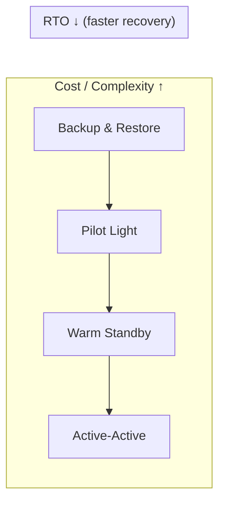
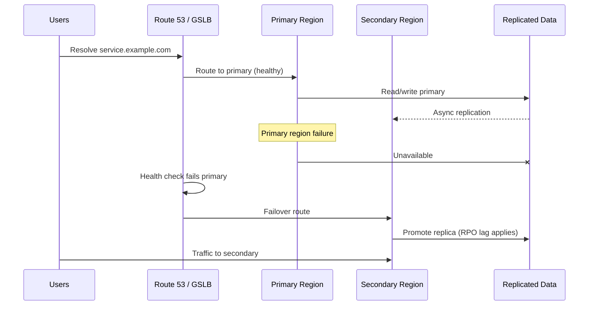
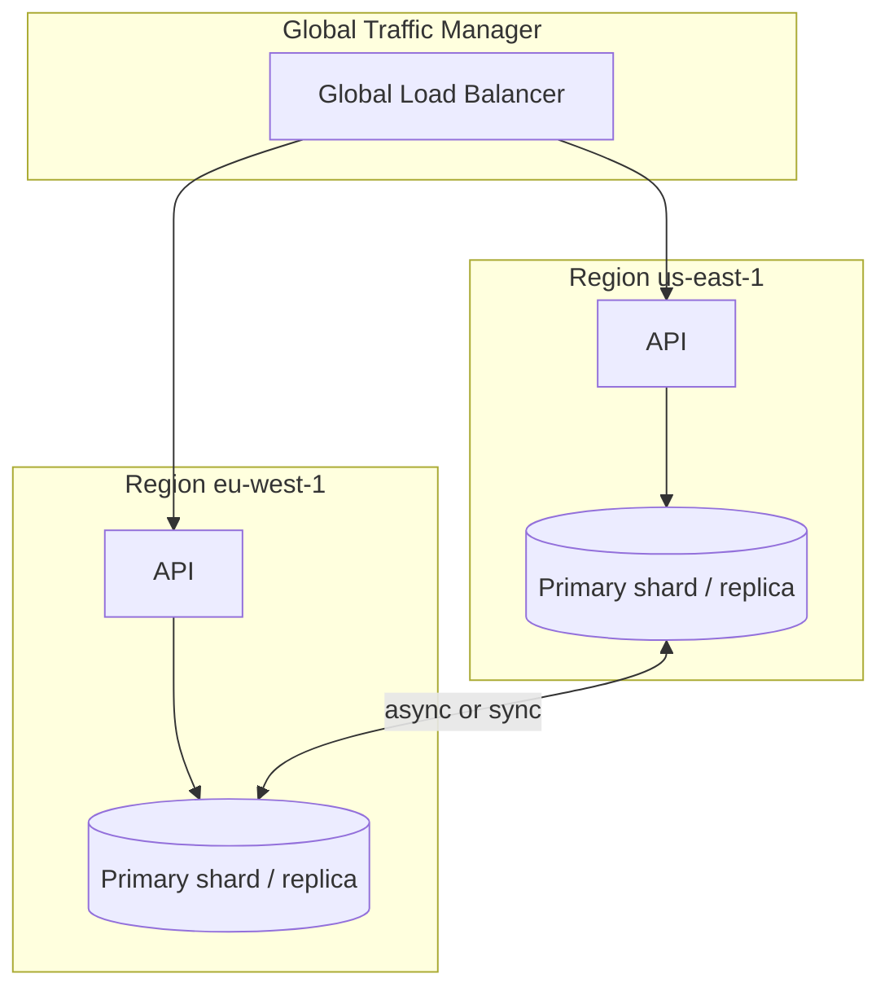

# Disaster Recovery and Multi-Region

## 1. Executive Summary

**Disaster recovery (DR)** is the capability to restore critical systems after regional failures, data corruption, or catastrophic outages. **Multi-region architecture** distributes workloads across geographic locations for **availability**, **latency**, and **regulatory** requirements. The defining metrics are **RTO** (Recovery Time Objective—how fast you recover) and **RPO** (Recovery Point Objective—how much data loss is acceptable).

DR is not backup alone—it encompasses **runbooks**, **tested failover**, **data replication topology**, **DNS/traffic shifting**, and **organizational readiness**. Principal architects align DR tiers to **business impact analysis (BIA)**—not every system needs active-active multi-master across three continents.

This chapter covers DR patterns (backup-restore, pilot light, warm standby, active-active), replication tradeoffs, failover mechanics, split-brain risks, testing discipline, and cost implications.

## 2. Why This Topic Matters

Principal interviews frequently include:

- "Design multi-region for 99.99% availability."
- Difference between **active-passive** and **active-active**.
- How to choose **RPO/RTO** for payment vs analytics.
- **DNS failover** limitations and TTL.
- **Split-brain** in database failover.

Weak answers claim "we're multi-AZ so we're fine" without regional or data consistency depth.

## 3. Problems Being Solved

| Problem | DR / multi-region response |
|---------|---------------------------|
| Regional cloud outage | Failover to secondary region |
| Data center fire | Off-site backups and replication |
| Ransomware / corruption | Point-in-time recovery, immutable backups |
| Latency to global users | Read replicas or active endpoints nearby |
| Regulatory data residency | Region-specific deployments |
| Cascading failure across regions | Blast radius isolation, bulkheads |

DR does **not** guarantee zero downtime without **significant cost and complexity**—tradeoffs must be explicit.

## 4. Assumptions and System Model

| Assumption | Implication |
|------------|-------------|
| **Regional failures happen** | AWS/GCP/Azure region outages are documented history |
| **Replication lag exists** | RPO > 0 unless synchronous cross-region |
| **Failover is manual or automated** | Automation must be tested—untested = RTO ∞ |
| **Clients use DNS or anycast** | Traffic shift takes time (TTL, propagation) |
| **Not all systems same tier** | Tier-1 payments vs tier-3 internal tools |

**Failure domains:** AZ < Region < Cloud account < Organization—design blast radius consciously.

## 5. Essential Terminology

| Term | Definition |
|------|------------|
| **RTO** | Max acceptable downtime to restore service |
| **RPO** | Max acceptable data loss measured in time |
| **BIA** | Business Impact Analysis prioritizing systems |
| **Active-passive** | Secondary idle until failover |
| **Active-active** | Multiple regions serve traffic concurrently |
| **Pilot light** | Minimal core running in DR region |
| **Warm standby** | Scaled-down but functional DR environment |
| **Split-brain** | Two primaries accepting writes—data divergence |
| **Global load balancer** | Routes users to healthy region (Route 53, GSLB) |
| **Immutable backup** | WORM storage resistant to ransomware overwrite |

## 6. Core Mechanism

### DR pattern spectrum



*Figure 1: Higher DR maturity increases cost and operational complexity while reducing RTO.*

### Active-passive failover



*Figure 2: Health-checked DNS failover with database promotion—RPO equals replication lag at failure moment.*

### Multi-region active-active (read path)



*Figure 3: Active-active requires conflict resolution strategy—often partition by tenant/region or CRDT/eventual consistency.*

## 7. Step-by-Step Walkthrough

**Scenario:** Tier-1 payment API—RTO 15 min, RPO 5 min.

| Component | Design choice |
|-----------|---------------|
| Compute | Warm standby ASG in secondary region (min 2 instances) |
| Database | RDS cross-region read replica; automated promotion runbook |
| DNS | Route 53 health checks; failover routing policy |
| Secrets | Replicated Secrets Manager / multi-region KMS |
| Queues | SQS with cross-region DLQ strategy or global service |
| Testing | Quarterly game day failover drill |

**Failover runbook steps:**

| Step | Action |
|------|--------|
| 1 | Confirm primary region unhealthy (not transient blip) |
| 2 | Stop writes to primary if split-brain risk |
| 3 | Promote read replica; verify replication caught up or accept RPO |
| 4 | Update DNS / GSLB weights |
| 5 | Scale warm standby to production capacity |
| 6 | Validate synthetic transactions |
| 7 | Communicate status; monitor error budget |

**DR tier classification template:**

| Tier | RTO | RPO | Pattern | Example systems |
|------|-----|-----|---------|-----------------|
| Tier-1 | <15 min | <1 min | Warm standby + sync/async repl | Payments, auth |
| Tier-2 | <4 hours | <15 min | Pilot light + async repl | Order management |
| Tier-3 | <24 hours | <4 hours | Backup-restore | Internal analytics |
| Tier-4 | Best effort | 24h+ | Backup only | Dev sandboxes |

Align tiers with **business impact analysis** dollar figures—not uniform gold plating.

**Failover testing checklist (game day):**

- [ ] Replication lag measured at start
- [ ] Synthetic transactions defined (success criteria)
- [ ] DNS TTL documented; propagation time observed
- [ ] Runbook followed without heroics
- [ ] Rollback procedure tested
- [ ] Postmortem scheduled regardless of outcome
- [ ] RTO/RPO actual vs target recorded

Untested items on this checklist represent **unknown risk**.

## 8. Invariants and Guarantees

| Property | Type | Statement |
|----------|------|-----------|
| **RPO bound** | Safety | Async replication: RPO ≥ lag at failure |
| **RTO bound** | Liveness | Only if runbook tested and automation works |
| **Active-active consistency** | **Often eventual** | Cross-region sync rarely linearizable |
| **Zero data loss** | **Requires sync replication** | Latency and availability tradeoff (CAP) |
| **DNS instant failover** | **Not guaranteed** | TTL and resolver caching delay |

## 9. Failure Scenarios

### Scenario 1: Split-brain after network partition

**Setup:** Primary and secondary both think they are primary.

**Effect:** Divergent writes; reconciliation nightmare.

**Mitigation:** STONITH, quorum-based failover (etcd, RDS failover mechanism), fencing tokens.

### Scenario 2: Failover during replication lag

**Setup:** Promote replica 30 minutes behind.

**Effect:** RPO violation; lost transactions.

**Mitigation:** Monitor lag; delay promotion; synchronous replication for critical data (**latency cost**).

### Scenario 3: Untested DR

**Setup:** Runbook exists; last test 3 years ago; secrets expired.

**Effect:** RTO hours to days during real incident.

**Mitigation:** Quarterly game days; automated DR tests; immutable runbooks in Git.

### Scenario 4: DNS TTL too high

**Setup:** TTL 3600s; primary fails.

**Effect:** Users hit dead region for an hour.

**Mitigation:** Lower TTL for failover records; use anycast or health-checked GSLB.

### Scenario 5: Active-active write conflict

**Setup:** Same user updates profile in two regions simultaneously.

**Effect:** Last-write-wins loses data.

**Mitigation:** Route user to home region; CRDTs; conflict resolution policies.

### Scenario 6: Failback complexity ignored

**Setup:** Successful failover to secondary; primary recovers; team routes traffic back without data reconciliation.

**Effect:** Split datasets; orders exist only in secondary DB.

**Mitigation:** Failback runbook with bi-directional replication catch-up or read-only primary until sync verified.

## 10. Performance Characteristics

| Topology | Write latency | Read latency | Consistency |
|----------|--------------|--------------|-------------|
| Single region | Lowest | Regional | Strongest |
| Active-passive async | Low (primary) | Low primary | RPO lag on failover |
| Cross-region sync replicate | High (+RTT) | Regional reads | Tighter RPO |
| Active-active | Variable | Global low | Eventual / conflict handling |

Cross-region sync replication adds **RTT per write**—measure before committing.

## 11. Scalability Limits

- Cross-region bandwidth costs scale with replication volume.
- Global active-active databases have vendor-specific limits (Spanner, DynamoDB global tables).
- Operational complexity of N regions grows non-linearly.
- Game day coordination across timezones.

Organizations with **global user bases** may require **active-active in multiple regions** regardless of DR minimums—latency SLOs drive architecture as much as outage recovery, and the cost model differs from pure DR tiering.

**DNS tip:** Lower TTL on failover records to 60s or below during migration periods—higher TTLs are fine for steady state but extend failover time during incidents.

Always document **failback** procedure alongside failover—teams that only practice one direction discover data divergence during recovery.

RPO at failover equals **replication lag at failure moment** for async replication—state this explicitly in every DR architecture review.

Multi-AZ protects against availability zone failure; only **cross-region** design protects against regional disasters—do not conflate the two in interviews or architecture documents.

## 12. Operational Considerations

- **Tiered DR** per service classification (tier-1/2/3).
- **Runbooks** in Git; linked from service catalog.
- **Automated failover** with manual approval for data promotion.
- **Backup verification**—restore tests, not just backup success alerts.
- **Configuration parity** between regions (Infrastructure as Code).
- **Incident comms** templates for regional failover.

**Replication lag monitoring (alert before failover need):**

| Lag threshold | Severity | Action |
|---------------|----------|--------|
| <30s | Normal | None |
| 30s–5min | Warning | Investigate network, DB load |
| >5min | Critical | Pause promotions; prepare manual failover decision |
| >RPO target | Emergency | Executive decision on promote vs wait |

Lag dashboards must be visible during **game days**—teams practice reading lag under synthetic load, not only during real disasters.

## 13. Security Considerations

- **KMS keys** multi-region or replicate carefully.
- **IAM roles** per region; break-glass access audited.
- **Immutable backups** isolated from production credentials.
- **Data residency** compliance—no failover crossing legal boundaries.
- **DDoS** during failover when DNS flapping—rate limits.

## 14. Cost Considerations

| Pattern | Cost driver |
|---------|-------------|
| Backup-restore | Storage only; highest RTO |
| Pilot light | Minimal always-on resources |
| Warm standby | ~30–50% prod capacity idle—**estimate per workload** |
| Active-active | ~2× compute + replication egress + conflict tooling |

FinOps must align DR spend to **revenue impact** of downtime—not uniform gold plating.

## 15. Production Implementations

### AWS multi-region

Route 53 failover, S3 cross-region replication, RDS cross-region replicas, Aurora global database.

### Google Cloud

Cloud Spanner multi-region for strong consistency globally—**specific product guarantees**.

### Azure

Paired regions, Traffic Manager, geo-redundant storage.

### Financial services

Often active-passive with sync replication to nearby DR site—regulatory RPO near zero.

**AWS DR service mapping (reference):**

| Component | AWS service | DR pattern |
|-----------|-------------|------------|
| DNS failover | Route 53 health checks | Active-passive |
| Compute | ASG warm standby second region | Pilot light / warm |
| Database | Aurora global, RDS cross-region replica | Async/sync options |
| Object storage | S3 CRR | Replication lag = RPO |
| Queues | SQS (regional) | Dual-region pattern needed |
| Secrets | Secrets Manager replication | Multi-region keys |

**Route 53 health check nuance:** Health checks probe endpoint every 30s (configurable); failover detection adds DNS TTL propagation delay. Total failover time = detection + TTL + application warm-up—often **underestimated** in RTO planning.

## 16. Alternatives and Tradeoffs

| Strategy | When |
|----------|------|
| Multi-AZ only | RTO minutes acceptable; regional risk accepted |
| Active-passive cross-region | Regional DR with moderate RTO/RPO |
| Active-active | Global low latency; can accept eventual consistency |
| Backup to glacier | Archival; RTO hours-days |

**Decision criteria:** BIA dollar impact per minute downtime vs DR infrastructure cost.

## 17. Common Misconceptions

| Misconception | Reality |
|---------------|---------|
| "Multi-AZ = DR" | AZ failure covered; region failure is not |
| "Backups = DR" | Restore time may violate RTO |
| "Active-active is always better" | Conflict resolution and cost are hard |
| "Zero RPO is free" | Sync cross-region replication costs latency |
| "Failover is automatic magic" | Requires engineering and testing |

## 18. Principal Architect Perspective

1. **Tier services**—not everything gets 15-minute RTO.
2. **Game days are mandatory**—untested DR is wishful thinking.
3. **Measure replication lag** as leading indicator of RPO risk.
4. **Document CAP tradeoff** explicitly for cross-region writes.
5. **FinOps partnership** on warm standby sizing.

**Active-active conflict resolution strategies:**

| Strategy | Mechanism | Best for |
|----------|-----------|----------|
| Home region routing | User always writes to assigned region | User-scoped data |
| Last-write-wins | Timestamp comparison | Low-conflict profiles |
| CRDTs | Merge without coordination | Counters, sets |
| Application merge | Business logic resolves | Shopping cart, docs |
| Single writer per entity | Leader election per key | Financial ledger |

Interview answers must name **which strategy** applies—active-active without conflict plan is incomplete.

**Compliance note:** GDPR and data residency may **prohibit** failover to specific regions—DR design must be reviewed with legal before engineering implementation. Mark region constraints explicitly in BIA documentation.

## 19. Architecture Review Exercise

**Scenario:** Single region; nightly backups to S3; RTO/RPO "best effort"; no runbook; claims 99.99% SLA to customers.

**Review prompts:**

1. SLA credibility?
2. Real RTO for database restore?
3. Remediation roadmap and cost?

**Expected findings:** BIA, tiered DR, cross-region replica, quarterly tests, SLA revision or investment.

## 20. Whiteboard Explanation

**90-second version:**

> "DR is defined by RTO—how fast we recover—and RPO—how much data we can lose. I tier systems by business impact. Backup-restore is cheapest but slowest RTO. Warm standby in a second region reduces RTO with idle cost. Active-passive uses async replication; failover promotes replica accepting RPO equals lag. Active-active serves multiple regions but needs conflict handling. DNS health checks shift traffic; TTL affects cutover speed. Split-brain is prevented with quorum promotion and fencing. DR must be tested quarterly—game days—not slide deck only. Multi-AZ handles AZ failure; regional DR needs explicit cross-region design and FinOps alignment."

**Extended principal addendum:** Always state **assumptions**—"assuming async replication with 30s lag, RPO is 30s at failover moment." Precision separates principal answers from hand-waving about "high availability."

## 21. Interview Questions

1. **RTO vs RPO?**
   - *Signals:* Time to recover vs data loss window.

2. **Multi-AZ vs multi-region?**
   - *Signals:* AZ redundancy vs regional disaster.

3. **Active-passive vs active-active?**
   - *Signals:* Idle DR vs concurrent traffic; consistency.

4. **Split-brain prevention?**
   - *Signals:* Quorum, STONITH, fencing tokens.

5. **DNS failover limitations?**
   - *Signals:* TTL, caching, propagation delay.

6. **Pilot light vs warm standby?**
   - *Signals:* Core only vs scaled-down full stack.

7. **How choose RPO for payments?**
   - *Signals:* BIA, sync repl cost, regulatory requirements.

8. **Game day purpose?**
   - *Signals:* Validate runbooks, RTO, team readiness.

9. **S3 backup enough for DR?**
   - *Signals:* RTO for restore; need compute path too.

10. **Global database options?**
    - *Signals:* Spanner, DynamoDB global tables, Cockroach—tradeoffs.

11. **CAP in cross-region writes?**
    - *Signals:* Sync = partition sensitivity; async = RPO.

12. **Immutable backup why?**
    - *Signals:* Ransomware resistance.

13. **RPO vs replication lag relationship?**
    - *Signals:* At failover, RPO equals lag if async; sync tightens at latency cost.

14. **Brownout vs blackout failover?**
    - *Signals:* Gradual degradation may need traffic shift before full region dead.

15. **DR cost tiering example?**
    - *Signals:* Payments warm standby; analytics backup-only.

**Scoring rubric:**

| Dimension | Strong | Weak |
|-----------|--------|------|
| Metrics | RTO/RPO tied to BIA | Vague "high availability" |
| Failover | Promotion, DNS, split-brain | "Failover button" |
| Testing | Game days, automation | Backups only |
| Cost | Tiered DR | Gold plate everything |

## 22. Interview Follow-Ups

1. **Aurora global database RPO?**
   - *Signals:* Sub-second typical—verify AWS docs for current SLA.

2. **Active-active for shopping cart?**
   - *Signals:* Session affinity or home region; conflict on inventory.

3. **DR during regional degradation (not full outage)?**
   - *Signals:* Gradual traffic shift; brownout handling.

4. **How test backup restore without prod risk?**
   - *Signals:* Isolated restore environment; quarterly timed restore drill; verify data integrity checksums.

5. **Compliance blocking cross-region failover?**
   - *Signals:* Data residency; fail within legal region only; document in BIA.

## 23. Strong Answer Example

**Question:** "Design DR for fintech API—15 min RTO, 1 min RPO."

> "Tier-1 classification. Primary us-east-1, warm standby us-west-2 with ASG min 2 instances pre-warmed. Aurora global database or cross-region sync replica targeting <1s lag—monitor lag alerting at 30s. Route 53 latency + failover routing with 60s TTL on API records. Secrets and IAM replicated. SQS messages replicated via dual-publish or accept 1 min RPO on async only. Runbook: automated replica promotion with manual approval gate; synthetic payment test post-failover. Quarterly game day with full DNS flip. RPO violation risk documented for async webhook delivery—separate tier. Cost review with FinOps on warm standby rightsizing."

## 24. Weak Answer Example

**Question:** "Design DR for fintech API."

> "Enable multi-AZ and daily backups."

**Why weak:** No regional DR, RTO/RPO, failover, or testing.

### Additional strong answer

**Question:** "How do you justify warm standby DR cost to CFO?"

> "BIA shows tier-1 outage costs $X per minute based on revenue at risk during peak. Warm standby adds $Y monthly—breakeven if prevents one outage exceeding Y/X minutes annually. Present tiered model: not gold-plating analytics same as payments. Warm standby RTO 15 min vs backup-restore RTO 8 hours—quantify customer SLA penalty and brand risk for 8-hour window. Include game day proof that runbook works—untested backup is not DR. FinOps tags DR spend to reliability OKR, not hidden in engineering overhead."

## 25. Hands-On Exercise

**Lab:** `labs/lab-012-multi-region-aws/` — BIA + failover dry-run on **`:8102`**

```bash
cd labs/lab-012-multi-region-aws
python3 -m venv .venv && source .venv/bin/activate
pip install -r requirements.txt
pytest tests/ -v
docker compose -p lab012 -f docker/docker-compose.yml up --build -d
chmod +x scripts/demo_multiregion.sh && ./scripts/demo_multiregion.sh
```

| Step | Endpoint | What happens |
|------|----------|--------------|
| 1 | `POST /v1/config/validate` | Tier services with RTO/RPO targets |
| 2 | `POST /v1/failover/simulate` | Timed failover with replication lag |
| 3 | Output | RPO from lag, RTO from runbook steps |
| 4 | Dry-run mode | No AWS resources required |
| 5 | Game-day prep | Export checklist for tabletop exercise |

**Swagger:** http://localhost:8102/docs

### Engineer guide: how the local stack works

1. **BIA inputs** — service tier, peak revenue at risk, and acceptable data loss drive RTO/RPO.
2. **Replication lag model** — async CRR lag at failure instant = minimum RPO.
3. **DNS failover cost** — TTL + resolver caching adds minutes to measured RTO.
4. **Runbook validation** — simulator outputs ordered steps; time each in game day.
5. **Cost controls** — plan-only Terraform; never leave DR stacks running without alarms.

Architecture deep-dive: [Multi-Region Architecture](/docs/cloud-architecture/multi-region-architecture#25-hands-on-exercise).

### Build-from-scratch exercise (optional)

1. Document BIA for 5 fictional services with RTO/RPO.
2. Draw active-passive architecture with replication lag annotation.
3. Write failover runbook outline (10 steps).
4. Calculate RPO if replica lag is 45s at failure.
5. Plan game day success criteria and rollback.

## 26. Knowledge Check

1. RPO definition? *(Max acceptable data loss duration.)*
2. Multi-AZ covers? *(Availability zone failure.)*
3. Split-brain? *(Two writers diverging.)*
4. Warm standby? *(Scaled-down DR environment ready to scale.)*
5. Untested DR RTO? *(Effectively unknown/infinite.)*
6. Warm standby characteristic? *(Partial capacity ready to scale.)*
7. Game day validates? *(Runbooks, RTO/RPO, team readiness.)*
8. S3 backup alone sufficient? *(Not if RTO requires compute path.)*
9. Failback risk? *(Data divergence if not reconciled.)*
10. Route 53 failover delay includes? *(Health check interval + DNS TTL.)*

## 27. Flashcards

| # | Front | Back |
|---|-------|------|
| 1 | RTO | Recovery Time Objective—max downtime. |
| 2 | RPO | Recovery Point Objective—max data loss. |
| 3 | Active-passive | Secondary idle until failover. |
| 4 | Active-active | Multiple regions serve concurrently. |
| 5 | Pilot light | Minimal DR region core running. |
| 6 | Split-brain | Dual primary write divergence. |
| 7 | Game day | Scheduled DR failover exercise. |
| 8 | Warm standby | Partial capacity DR environment. |
| 9 | BIA | Business Impact Analysis prioritization. |
| 10 | Immutable backup | WORM storage against ransomware. |

## 28. Cheat Sheet

```
METRICS
  RTO — time to restore service
  RPO — data loss window

PATTERNS (cost ↑, RTO ↓)
  Backup-restore → Pilot light → Warm standby → Active-active

FAILOVER
  Health check → stop split-brain → promote DB → shift DNS → validate

MULTI-AZ ≠ MULTI-REGION

TEST
  Quarterly game days
  Restore drills, not backup-only

TIER
  Tier-1: strict RTO/RPO
  Tier-3: backup acceptable
```

## 29. Related Concepts

- [Multi-Region Architecture](/docs/cloud-architecture/multi-region-architecture) — cloud topology
- [SLOs, SLIs, and Error Budgets](/docs/reliability-and-resilience/slo-sli-error-budgets) — availability targets
- [Primary-Secondary Replication](/docs/replication/primary-secondary-replication) — replica promotion
- [Fencing Tokens](/docs/consensus/fencing-tokens) — split-brain prevention
- [Chaos Engineering](/docs/reliability-and-resilience/chaos-engineering) — failure injection testing
- [Cloud Cost Optimization](/docs/cost-and-finops/cloud-cost-optimization) — DR cost tradeoffs

DR and multi-region design must align with SLO error budgets, chaos experiment findings, and FinOps tiering—reliability is a system property spanning architecture, operations, and organizational process.

## 30. References

### Primary sources

- AWS Well-Architected Framework — Reliability Pillar — [DR strategies](https://docs.aws.amazon.com/wellarchitected/latest/reliability-pillar/disaster-recovery.html).
- Google SRE Book — Chapter on managing incidents and capacity (**DR culture context**).

### Engineering blogs

- AWS Architecture Blog — backup and restore vs pilot light vs warm standby diagrams.
- Azure Reliability documentation — paired regions.

### Distinction

| Claim type | Source |
|------------|--------|
| DR pattern definitions | AWS Well-Architected |
| Product-specific RPO | Vendor SLAs—verify current docs |
| RTO estimates | Organization and workload dependent |
