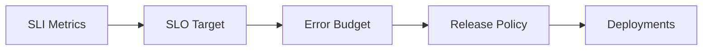

# Reliability and Resilience

SLOs, disaster recovery, chaos engineering, and graceful degradation.

*Figure: Reliability engineering loop — SLIs, SLOs, and error budgets.*

## Chapters

| Chapter | Focus |
|---------|-------|
| SLOs, SLIs, and Error Budgets | [SLOs, SLIs, and Error Budgets](/docs/reliability-and-resilience/slo-sli-error-budgets) |
| Disaster Recovery and Multi-Region | [Disaster Recovery and Multi-Region](/docs/reliability-and-resilience/disaster-recovery-and-multi-region) |
| Chaos Engineering | [Chaos Engineering](/docs/reliability-and-resilience/chaos-engineering) |

## Learning Path

1. Begin with **SLOs, SLIs, and Error Budgets** to define reliability targets.
2. Study **Disaster Recovery and Multi-Region** for RTO/RPO and failover patterns.
3. Finish with **Chaos Engineering** for controlled failure injection and resilience validation.

## Interview Prep

| Resource | Topic |
|----------|-------|
| [Netflix Cascading Failure](/docs/real-world-scenarios/netflix-cascading-failure) | Circuit breakers, retry storms |
| [AWS S3 Multi-Region DR](/docs/real-world-scenarios/aws-s3-multi-region-dr) | RPO/RTO, failover |
| [Lab 012 multi-region](/docs/cloud-architecture/multi-region-architecture#25-hands-on-exercise) | DR simulator on `:8102` |
| [Lab 013 chaos testing](/docs/reliability-and-resilience/chaos-engineering#25-hands-on-exercise) | Fault injection on `:8103` |

## Related Domains

- [Observability](/docs/observability/overview)
- [Production Failures](/docs/production-failures/overview)

Return to the [Curriculum Overview](/docs/start-here/curriculum-overview) to see how this domain fits the learning path.
