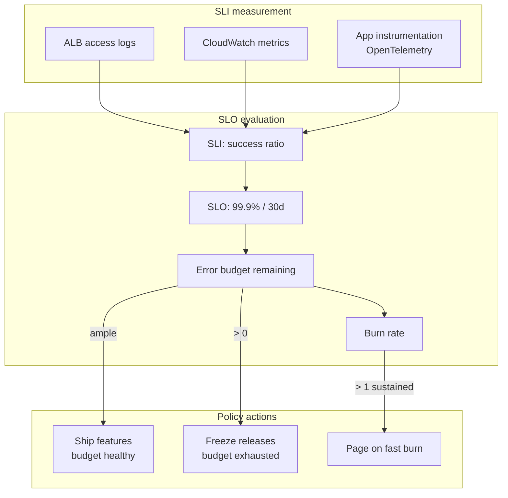
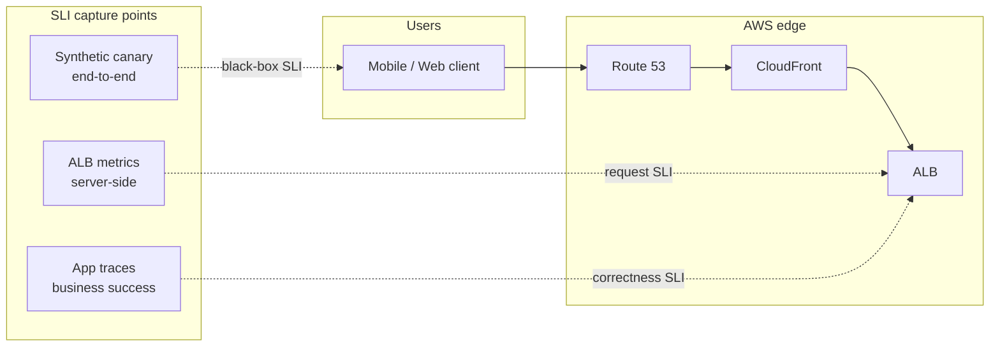
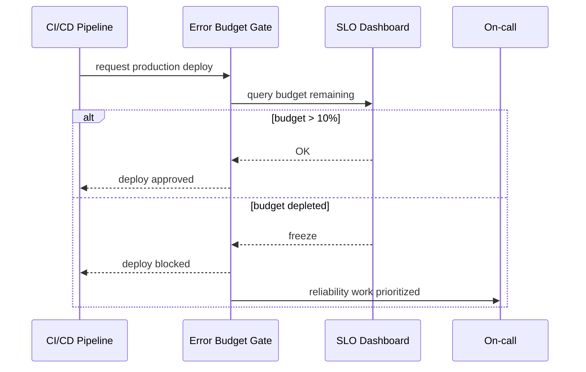

# SLOs, SLIs, and Error Budgets

## 1. Executive Summary

**Service Level Indicators (SLIs)**, **Service Level Objectives (SLOs)**, and **error budgets** form the quantitative backbone of modern reliability engineering. An **SLI** is a measured signal of service behavior (availability, latency, correctness). An **SLO** is a target threshold over a window (e.g., 99.9% of requests succeed in 30 days). The **error budget** is the complement—the acceptable unreliability before the SLO is breached.

This framework—popularized by Google SRE—translates vague "five nines" aspirations into **actionable policies**: when budget remains, teams ship features; when budget burns, they prioritize stability, defer launches, and investigate. On AWS, SLIs are derived from **CloudWatch**, **ALB access logs**, **X-Ray**, **Synthetics canaries**, and application instrumentation.

Principal architects must connect SLOs to **architecture decisions** (redundancy cost), **incident response** (burn-rate alerts), and **organizational negotiation** (product vs reliability tradeoffs)—not treat SLOs as metrics dashboard decoration.

## 2. Why This Topic Matters

Reliability is a defining principal-level competency. Interviewers expect:

- Precise definitions of SLI, SLO, SLA, SLAs vs internal SLOs.
- How to **choose SLIs** aligned with user experience.
- **Error budget policies** and their effect on release cadence.
- **Multi-window burn-rate alerting** (Google SRE Workbook).
- Distinguishing **availability** from **correctness** and **latency**.
- Connecting SLO miss to **postmortem** and architectural remediation.

Teams without SLOs debate outages emotionally; teams with SLOs debate **data**.

## 3. Problems Being Solved

| Problem | SLO framework response |
|---------|------------------------|
| **Subjective reliability** | Measurable SLIs and agreed SLOs |
| **Feature vs stability conflict** | Error budget as negotiated currency |
| **Alert fatigue** | Alert on SLO burn rate, not every blip |
| **Misaligned monitoring** | Measure what users experience |
| **Over-engineering** | SLO tiering matches investment to risk |
| **Customer communication** | SLAs external; SLOs internal often stricter |

SLOs do not replace **capacity planning**, **security**, or **DR**—they prioritize among them.

## 4. Assumptions and System Model

| Assumption | Implication |
|------------|-------------|
| **User-perceived reliability is partial** | SLIs must proxy user experience |
| **100% is impossible** | SLO < 100%; budget is finite |
| **Measurement has error** | Instrumentation gaps create false confidence |
| **SLOs are team commitments** | Not individual engineer KPIs in isolation |
| **Window matters** | Monthly vs quarterly changes budget math |

**Client model:** Users experience composite reliability across DNS, CDN, API, database, and third parties—SLO scope must define **dependency boundaries**.

## 5. Essential Terminology

| Term | Definition |
|------|------------|
| **SLI** | Quantitative measure of service aspect (e.g., success rate) |
| **SLO** | Target value/range for SLI over time window |
| **SLA** | Contract with customer consequences (credits, penalties) |
| **Error budget** | 1 − SLO target (allowed bad events) |
| **Burn rate** | Rate of budget consumption vs steady state |
| **Multi-window alert** | Fast burn (1h) + slow burn (6h) pages |
| **Availability** | Proportion of successful requests or uptime |
| **Latency SLI** | Fraction of requests faster than threshold |
| **Good event / valid event** | Numerator/denominator definitions for SLI |
| **Tier-1 / Tier-2 service** | Criticality classification driving SLO strictness |

## 6. Core Mechanism

### 6.1 SLI selection

Common SLI types:

| Type | Example | User proxy quality |
|------|---------|-------------------|
| **Availability** | HTTP 5xx rate, health check success | High if measured at edge |
| **Latency** | % requests < 300ms at p99 | High with correct percentile |
| **Correctness** | Business transaction success rate | Highest when domain-specific |
| **Freshness** | Data age for pipelines | Critical for analytics/search |
| **Durability** | Objects not lost (S3-style) | Storage systems |

**Rule:** SLI should be **simple**, **measurable**, and **user-centric**. Avoid infra-only metrics (CPU) as primary SLIs unless they directly predict user pain.

### 6.2 SLO formulation

Example: **99.9% availability** over rolling 30 days.

- Valid events: all `GET/POST /api/*` excluding client 4xx.
- Good events: responses not 5xx and not timeout.
- Budget: 0.1% = ~43.2 minutes downtime equivalent per 30 days (if uniformly spread—burn is often spiky).

**Latency SLO example:** 99% of checkout requests complete in < 500ms (server-side), measured at ALB.

### 6.3 Error budget math

For availability SLO target `T` over window with `N` valid events:

`\text{bad events allowed} = N \times (1 - T)`

**Burn rate** at time t:

`\text{burn rate} = \frac{\text{error rate}}{\text{budget error rate}}`

Burn rate = 1 → consuming budget at exactly sustainable pace. Burn rate = 10 → budget exhausted 10× faster than sustainable.



*Figure 1: SLO feedback loop—measurement feeds budget; policy gates releases and alerting.*

### 6.4 Burn-rate alerting (multi-window)

Google SRE Workbook recommends alerting on **burn rate** across windows:

| Window | Purpose |
|--------|---------|
| **5–10 min** | Critical fast burn (major outage) |
| **1 hour** | Confirm sustained impact |
| **6 hour** | Moderate burn |
| **3 day** | Slow leak detection |

Example policy for 99.9% SLO: page if **14.4× burn** over 1h **and** 6× burn over 6h (constants from SRE workbook for that target).

This reduces pages on single blips while catching real outages.

### 6.5 AWS instrumentation for SLIs

| Source | SLI use |
|--------|---------|
| **ALB** `HTTPCode_Target_5XX_Count`, `TargetResponseTime` | Availability and latency at load balancer |
| **API Gateway** `5XXError`, `Latency` | Serverless API tier |
| **CloudWatch Synthetics** | Canary success rate (synthetic availability) |
| **Route 53 health checks** | DNS-level reachability |
| **Custom metrics** | Business correctness SLIs |
| **X-Ray** | Latency breakdown; not primary SLI alone |

**Amazon CloudWatch Application Signals** (evolving) and third-party tools (Datadog, Honeycomb) provide SLO dashboards with burn-rate alerts.



*Figure 2: Layered SLIs—synthetic (user-like), load balancer (service), application (business truth).*

### 6.7 SLI anti-patterns on AWS

| Anti-pattern | Why it fails | Better approach |
|--------------|--------------|-----------------|
| **EC2 CPU < 80%** as SLO proxy | CPU idle during user-facing outage | ALB 5xx + synthetics |
| **Pingdom only** | Misses partial API failures | Layer server + journey SLIs |
| **Including 401 in error SLI** | Client auth mistakes penalize service | Exclude expected client faults |
| **Monthly manual spreadsheet** | Stale; no burn alerting | Automated rolling window |
| **Per-engineer SLO** | Gaming metrics; no system view | Service/journey level |

## 7. Step-by-Step Walkthrough

### Walkthrough A: Define SLO for REST API on ALB

1. **Choose SLI:** `(valid_requests - 5xx - timeouts) / valid_requests`.
2. **Exclude** 4xx client errors from denominator if not service fault.
3. **Set SLO:** 99.95% over 30 rolling days (tier-1 payment adjacency).
4. **Compute budget:** 0.05% ≈ 21.6 min/month equivalent.
5. **Dashboard:** CloudWatch metric math or Grafana/Datadog SLO widget.
6. **Alerts:** 14.4× burn 1h + 6× burn 6h → PagerDuty.

### Walkthrough B: Latency SLO with percentiles

1. SLI: proportion of requests with `TargetResponseTime < 0.5s`.
2. SLO: 99% of requests under 500ms monthly.
3. Use **histogram** metrics (not average—averages lie).
4. Track **multi-region** SLIs separately if latency differs.

### Walkthrough C: Error budget policy meeting

1. Week 4: budget 60% consumed after bad deploy.
2. Policy: >50% burn before mid-month → freeze non-critical releases.
3. Team runs rollback, adds integration tests, resumes launches when burn stabilizes.
4. Postmortem action items tracked against reliability backlog.

### Walkthrough D: Composite dependency SLO

1. Checkout depends on Payment API (99.9%) and Inventory (99.5%).
2. **Don't multiply naively** for planning—use joint incident history.
3. Define **user journey SLI** via synthetic checkout canary (black box).
4. Internal SLOs per team; journey SLO for leadership.

### Walkthrough E: SLO miss postmortem

1. Incident: 45 min partial outage → 99.9% monthly SLO breached.
2. Calculate **actual bad events** vs budget.
3. Root cause: RDS failover untested; connection pool stale.
4. Remediation: pool retry logic, game day, tighten burn alerts.
5. **Blameless** review; SLO miss is system signal not individual fault.

### Walkthrough F: Implementing SLOs with Amazon Managed Grafana and AMP

For teams standardizing on AWS observability without a third-party vendor:

1. **Instrument** services with ADOT exporting histogram metrics to **Amazon Managed Prometheus (AMP)**.
2. Define recording rules or PromQL queries for availability: `sum(rate(http_requests_total{status!~"5.."}[5m])) / sum(rate(http_requests_total[5m]))`.
3. Create **Amazon Managed Grafana (AMG)** dashboard with 30-day rolling SLO panel.
4. Configure **Alertmanager** (or CloudWatch alarms on exported metrics) for burn-rate thresholds.
5. Document SLI spec in `slo/order-api.yaml` using **OpenSLO** or **Sloth** format for GitOps review.

This pattern keeps SLO definitions version-controlled while leveraging AWS-managed backends—tradeoff is PromQL learning curve vs vendor SLO wizards.

### Walkthrough G: Tiering SLOs across service portfolio

| Tier | Example services | Availability SLO | Latency SLO | On-call |
|------|------------------|-------------------|-------------|---------|
| **Tier-1** | Checkout, auth | 99.95% | 99% < 300ms | 24×7 page |
| **Tier-2** | Search, recommendations | 99.9% | 99% < 1s | Business hours + best effort |
| **Tier-3** | Internal admin, batch reports | 99.5% | Best effort | Next business day |

Principal architects facilitate **portfolio negotiation**—not every microservice warrants four-nines. Align tier to **revenue at risk** and **dependency graph** (tier-1 journey may include tier-2 services—journey SLO still applies).

### SLO communication with leadership

Translate technical SLOs into business language:

- **99.9% monthly** ≈ 43 minutes of allowed bad events per 30 days.
- **Error budget consumed** = reliability debt—defer feature risk or invest in hardening.
- **SLO miss** without postmortem action = organizational learning failure.

Executive dashboards should show **budget remaining** and **top burn contributors** (deploy, dependency, capacity)—not raw metric dumps.

**Interview tip:** When asked "what SLO would you set?", always respond with questions: **Who is the user?** **What action matters?** **What is the revenue or safety impact of failure?** Then propose an SLI, justify the target from current baseline plus headroom, and describe the error budget policy—not a round number picked from industry folklore.

## 8. Invariants and Guarantees

| Property | Statement |
|----------|-----------|
| **Budget exhaustion** | Mathematically certain if error rate sustained above SLO |
| **SLI definition stability** | Changing SLI definition resets historical comparability |
| **Synthetic ⊂ real** | Canaries may miss edge cases; complement with server metrics |
| **SLO ⊂ SLA** typically | Internal target stricter than contractual SLA |

SLOs are **organizational commitments**, not physical laws—enforcement is cultural and procedural.

## 9. Failure Scenarios

| Failure | Impact | Mitigation |
|---------|--------|------------|
| **SLI blind spot** | False green dashboard during user outage | Layer synthetic + edge + business metrics |
| **Bad denominator** | Includes health-check noise or bot traffic | Filter valid events carefully |
| **Alert on mean latency** | Misses tail violations | Percentile/histogram SLIs |
| **Budget ignored** | SLO theater | Executive-backed freeze policy |
| **Too many SLOs** | Diluted focus | 2–3 per service |
| **Third-party dependency** | External API breaks your SLO | Dependency SLOs, timeouts, fallbacks |
| **Metric loss** | CloudWatch gap | Dual export to vendor, local buffering |

## 10. Performance Characteristics

SLO evaluation itself is cheap; **instrumentation cost** matters:

- High-cardinality custom metrics expensive in CloudWatch.
- Log-based SLIs (ELB → S3 → Athena) higher latency for alerting—use metrics path for pages.
- **Sampling** in tracing must not distort tail latency SLIs.

## 11. Scalability Limits

- **Cardinality explosion** when SLI labels include unbounded `user_id`.
- **Multi-tenant SLOs** per customer—operational burden scales linearly.
- **Global SLO aggregation** hides regional brownouts—use slice by region/AZ.

## 12. Operational Considerations

- **SLO review quarterly** with product and leadership.
- **Document SLI spec** in repo (YAML/JSON) — version controlled.
- **Runbooks** linked from burn-rate alerts.
- **Error budget report** in weekly ops review.
- **Chaos experiments** validate SLO measurement (inject failure, confirm alert fires).
- **AWS Well-Architected Reliability** lens aligns with SLO practice.



*Figure 3: Error budget gate—optional CI/CD integration blocks deploy when budget exhausted.*

## 13. Security Considerations

- SLI data may expose **traffic patterns**—restrict dashboard access.
- **Synthetic canaries** need credentials—rotate; scope minimally.
- Don't log **PII** in SLI pipelines (access logs retention policies).

## 14. Cost Considerations

| Item | Tradeoff |
|------|----------|
| Higher SLO (99.99%) | More redundancy, multi-region, on-call cost |
| Custom metrics | CloudWatch charges per metric/alarm |
| Third-party SLO tools | License vs engineering time |
| Synthetics canaries | Per-run pricing |

**FinOps link:** Reliability spend should correlate with error budget headroom and revenue at risk.

## 15. Production Implementations

| Organization pattern | Implementation |
|---------------------|----------------|
| **Google SRE style** | Multi-window burn, blameless postmortems |
| **AWS native** | CloudWatch alarms on ALB + composite metrics |
| **Vendor SLO** | Datadog/Honeycomb/New Relic SLO widgets |
| **GitOps SLO** | Sloth/OpenSLO definitions in Git |

Netflix, Google, and major SaaS vendors publish reliability culture essays—adapt patterns, don't copy numbers.

## 16. Alternatives and Tradeoffs

| Alternative | When |
|-------------|------|
| **Uptime monitoring only** | Simple sites; insufficient for tail latency |
| **SLA-only (external)** | Reactive; no internal leading indicators |
| **OKRs on uptime** | OKRs drift; SLOs are continuous |
| **Mean time between failures** | Lagging; doesn't guide daily tradeoffs |

SLOs win when **continuous delivery** needs a **stability throttle**.

## 17. Common Misconceptions

| Misconception | Reality |
|---------------|---------|
| "Five nines always" | Expensive; most services need tiering |
| "SLO = SLA" | SLA is contractual; SLO is internal target |
| "100% - uptime = error budget" | Must define valid events precisely |
| "Alerts on CPU" | Infra metric ≠ user SLI |
| "One outage won't matter" | Burn rate math may exhaust monthly budget in minutes |

## 18. Principal Architect Perspective

- **Negotiate SLOs with revenue impact**—show cost of 99.99% vs 99.9%.
- **User journey SLOs** align orgs better than per-microservice vanity metrics.
- **Error budget policy** must have **executive air cover** or it's ignored.
- **Architect for measurability**—if you can't measure it, you can't SLO it.
- **Postmortems consume budget narrative**—focus on learning velocity.

## 19. Architecture Review Exercise

**Scenario:** Team sets 99.99% SLO but runs single-AZ RDS, no autoscaling, on-call only business hours.

**Finding:** Architecture cannot sustain four-nines; SLO is aspirational fiction.

**Recommendation:** Either lower SLO to match architecture (99.9% + multi-AZ) or fund multi-AZ, autoscaling, 24×7 on-call, and chaos program.

## 20. Whiteboard Explanation

"We measure SLIs—signals like successful requests over valid requests. Our SLO is 99.9% over 30 days, leaving 0.1% error budget—about 43 minutes of bad events per month if spread evenly. We alert on burn rate: how fast we're consuming that budget. Fast burn pages on-call via multi-window rules from the SRE workbook. When budget is exhausted, we freeze risky launches and fix reliability. SLIs come from ALB metrics and synthetic canaries that mimic checkout. This turns reliability from opinion into a product tradeoff we manage explicitly."

## 21. Interview Questions

1. **Difference between SLI, SLO, SLA?** — Measure, target, contract.
2. **How calculate error budget?** — 1 − SLO over window.
3. **What is burn rate?** — Consumption rate vs sustainable error rate.
4. **Why multi-window alerts?** — Reduce false positives, catch fast outages.
5. **Good vs valid events?** — Denominator/numerator definition.
6. **Why not alert on CPU?** — Not user-centric.
7. **Latency SLO: mean or percentile?** — Percentile/histogram.
8. **Error budget policy examples?** — Freeze releases, require review.
9. **How tier services?** — By business criticality and revenue.
10. **Composite microservice SLO?** — User journey / black-box preferred.
11. **AWS metrics for availability SLI?** — ALB 5xx, API Gateway errors.
12. **What happens after SLO miss?** — Postmortem, prioritize reliability work.

## 22. Interview Follow-Ups

1. **Derive 43.2 minutes for 99.9% monthly.** — 30×24×60×0.001.
2. **Design SLO for async pipeline freshness.** — Age of latest successful batch.
3. **Customer-facing SLA credit calculation.** — Separate from internal SLO.
4. **Implement burn alert without vendor tool.** — CloudWatch metric math anomaly.
5. **SLO for multi-region active-active.** — Per-region and global journey SLIs.

## 23. Strong Answer Example

**Question:** "How would you introduce SLOs to a team that only monitors CPU?"

**Strong outline:** "I'd start with one user-critical journey—checkout—and define a black-box SLI using a CloudWatch Synthetics canary: success if checkout completes under 3 seconds. Pair with server-side ALB availability SLI. Set initial SLO at current measured performance minus headroom—say 99.5% if we're at 99.7% today—then tighten quarterly. Introduce 30-day error budget and agree with product that exhausting budget freezes non-critical deploys. Replace CPU alerts with burn-rate alerts on availability. Document SLI spec in Git. Run a game day to validate alerts fire. This shifts culture from machine health to user experience while keeping the first iteration achievable."

## 24. Weak Answer Example

**Weak:** "Set 99.9% uptime and monitor CloudWatch."

**Red flags:** No SLI definition, confuses uptime with availability, no error budget policy, no burn rate.

## 25. Hands-On Exercise

1. Enable ALB access logs to S3; compute weekly availability with Athena.
2. Create CloudWatch dashboard: `HTTPCode_Target_5XX_Count` / request count.
3. Set SLO 99.9%; calculate remaining budget manually.
4. Configure burn-rate alarm (use workbook multipliers).
5. Inject fault (scale service to 0 in staging); verify alert latency.
6. Write one-page error budget policy for fictional product team.

## 26. Knowledge Check

1. Define SLI, SLO, error budget.
2. Why exclude 4xx from availability SLI?
3. What burn rate means budget exhausted in 1 hour?
4. Name two AWS data sources for SLIs.
5. Why use percentiles for latency SLOs?
6. Difference between rolling 30-day and calendar month window?
7. What is a synthetic SLI?
8. How many SLOs per service is reasonable?
9. What policy when budget is 0?
10. Why SLI spec should be version controlled?
11. How does SLO relate to chaos engineering?
12. Can SLO be > SLA?

## 27. Flashcards

| Front | Back |
|-------|------|
| SLI | Measured indicator of service behavior |
| SLO | Target threshold for SLI over time window |
| SLA | External contract with remedies |
| Error budget | Allowed unreliability: 1 − SLO |
| Burn rate | Speed of budget consumption vs sustainable rate |
| Valid event | Request counted in SLI denominator |
| Good event | Request counted in SLI numerator |
| Multi-window alert | Fast + slow burn detection |
| Synthetic monitoring | Scripted user journey probes |
| Tier-1 service | Highest criticality; strictest SLO |
| Blameless postmortem | Learn from SLO miss without punishment |
| Histogram SLI | Latency distribution for percentile SLOs |

## 28. Cheat Sheet

```
DEFINITIONS
  SLI = measure (what happened)
  SLO = target (what we promise internally)
  SLA = contract (what customer sees)
  error budget = 1 - SLO target

AVAILABILITY SLI
  good / valid requests
  exclude client errors if not service fault
  measure at load balancer or synthetic

LATENCY SLI
  % requests < threshold (p99 common)
  use histograms, not averages

ALERTING
  burn rate = error_rate / budget_error_rate
  multi-window: 1h + 6h (see SRE workbook)

POLICY
  budget healthy → ship
  budget low → caution
  budget zero → freeze + fix

AWS
  ALB/API GW metrics, Synthetics, Route 53 health
```

## 29. Related Concepts

- [Observability Fundamentals](/docs/observability/observability-fundamentals) — metrics and traces feeding SLIs
- [AWS Fundamentals](/docs/cloud-architecture/aws-fundamentals) — CloudWatch and ALB instrumentation
- [Multi-Region Architecture](/docs/cloud-architecture/multi-region-architecture) — regional SLO slicing
- [Safety and Liveness](/docs/distributed-systems-foundations/safety-and-liveness) — formal reliability properties
- [Partial Failure](/docs/distributed-systems-foundations/partial-failure) — why 100% SLO is impossible
- [Reliability and Resilience](/docs/reliability-and-resilience/overview) — DR and chaos engineering

## 30. References

### Primary sources

- Beyer, B., et al. (2016). *Site Reliability Engineering.* O'Reilly. [Chapters on SLIs, SLOs, error budgets]
- Beyer, B., et al. (2018). *The Site Reliability Workbook.* O'Reilly. [Multi-window burn-rate alerting, implementation]
- Google. *Service Level Objectives* — https://sre.google/sre-book/service-level-objectives/
- Amazon Web Services. *AWS Well-Architected Reliability Pillar.* https://docs.aws.amazon.com/wellarchitected/latest/reliability-pillar/

### Papers and talks

- Jones, C., et al. (2019). *The Calculus of Service Availability.* USENIX ;login:.

### Distinction

- **SRE book formulas** — Industry standard burn-rate guidance.
- **Organization SLO targets** — Business-specific; do not copy hyperscaler numbers blindly.
