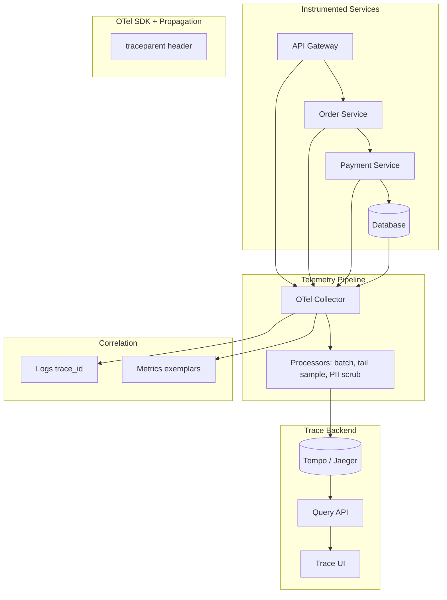
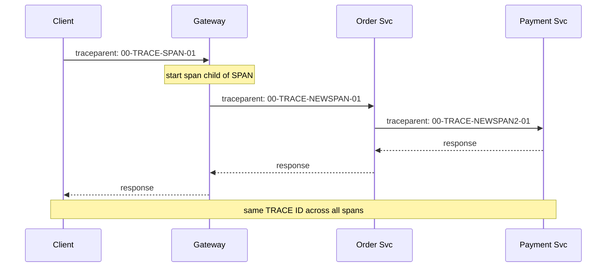
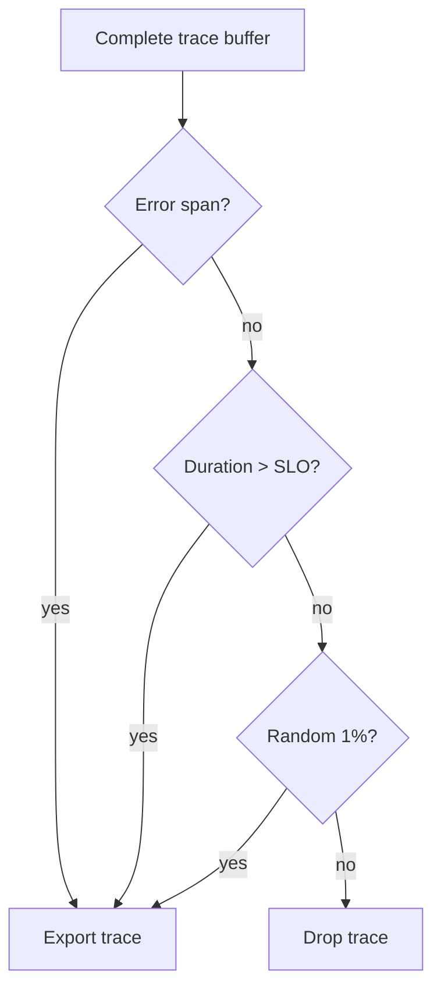

# Distributed Tracing

## 1. Executive Summary

**Distributed tracing** records the end-to-end path of a request as it traverses microservices, queues, databases, and external APIs—producing a **trace** composed of **spans** with timing, metadata, and causal parent-child relationships. While metrics show *that* latency increased and logs show *what* a single service logged, traces show *where* time was spent across the distributed call graph.

**OpenTelemetry (OTel)** is the vendor-neutral standard for instrumentation, context propagation, and export to backends (Jaeger, Tempo, Zipkin, Honeycomb, Datadog). Principal architects design tracing platforms for **high-cardinality debuggability** at controlled cost via **head sampling**, **tail sampling**, and **attribute discipline**—while ensuring critical paths (errors, high latency, payment flows) are always captured.

This chapter covers trace data model, propagation (W3C `traceparent`), instrumentation strategies, sampling architecture, correlation with logs and metrics, and operational use in [Failure Analysis Methodology](/docs/production-failures/failure-analysis-methodology)—not "install Jaeger and hope."

## 2. Why This Topic Matters

Without tracing, microservice incidents devolve into log archaeology:

- **P99 latency** spikes with no obvious culprit service.
- **Cascading retries** amplify load invisibly in per-service metrics.
- **Async paths** (Kafka, SNS) break request-scoped debugging.
- **LLM and agent platforms** need per-tool-call spans for cost and safety audit.

Principal interviews ask: explain span context propagation, head vs tail sampling tradeoffs, baggage risks, and how traces integrate with SLOs. Follow-ups on trace storage cost at 100K RPS separate platform architects from developers who only used auto-instrumentation once.

## 3. Problems Being Solved

| Problem | Tracing approach |
|---------|------------------|
| **Unknown slow service** | Waterfall span timing |
| **Hidden serial calls** | Trace graph reveals N+1 |
| **Missing cross-service correlation** | Shared trace_id |
| **Async causality** | Span links across messages |
| **Regression after deploy** | Compare trace structure |
| **Vendor lock-in** | OpenTelemetry standard |
| **Storage cost explosion** | Sampling strategies |
| **Agent/tool audit** | Spans per tool invocation |

## 4. Assumptions and System Model

### Data model (OpenTelemetry)

| Concept | Definition |
|---------|------------|
| **Trace** | End-to-end request story |
| **Span** | Single operation with start/end time |
| **Trace ID** | 128-bit identifier shared across services |
| **Span ID** | 64-bit identifier per span |
| **Parent span** | Upstream caller span |
| **Attributes** | Key-value metadata (http.method, db.statement redacted) |
| **Events** | Timestamped annotations on span |
| **Baggage** | Propagated key-value (use sparingly) |
| **Span link** | Associate spans without parent-child (async) |

### Non-functional targets

- Propagation overhead &lt; 1 ms per hop.
- Collector availability 99.9%.
- Trace query p99 &lt; 3 s for recent data.
- Retention: 7 days full fidelity for sampled traces; error traces 30 days.

| Assumption | Implication |
|------------|-------------|
| **All services instrumented** | Critical path 100% coverage goal |
| **Context propagates over HTTP/gRPC** | W3C traceparent standard |
| **Async breaks parent chain** | Span links required |
| **PII in attributes forbidden** | Redaction pipeline |
| **100% trace capture too expensive** | Sampling mandatory at scale |

## 5. Essential Terminology

| Term | Definition |
|------|------------|
| **OpenTelemetry** | CNCF observability framework |
| **OTel SDK** | Language instrumentation library |
| **Collector** | Receive, process, export telemetry |
| **Exporter** | Sends spans to backend |
| **traceparent** | W3C header carrying trace context |
| **Head sampling** | Decide at trace start |
| **Tail sampling** | Decide after trace completes |
| **Probabilistic sampling** | Random fraction (e.g., 1%) |
| **Cardinality** | Unique attribute combination count |
| **Service map** | Derived graph of dependencies |
| **Exemplar** | Link metric sample to trace ID |
| **Instrumentation scope** | Manual vs auto instrumentation boundary |

## 6. Core Mechanism

### 6.1 Tracing architecture



*Figure 1: Distributed tracing pipeline—instrumentation, collector processing, storage, correlation with logs and metrics.*

### 6.2 Context propagation



*Figure 2: W3C traceparent propagates trace ID; each service creates child span.*

### 6.3 Tail sampling decision



*Figure 3: Tail sampling—keep errors and slow traces; probabilistic sample remainder.*

### 6.4 Deep dives

**Instrumentation layers:**

| Layer | Coverage | Effort |
|-------|----------|--------|
| **Auto-instrumentation** | HTTP, gRPC, DB drivers | Low |
| **Manual spans** | Business logic, cache keys | Medium |
| **Platform sidecar** | Mesh generates spans | Low per service |

**Async messaging:**

- Producer injects trace context in message headers.
- Consumer creates span **linked** to producer span (not child if batch consumer).
- Kafka headers: `traceparent` preserved across partitions.

**Attribute discipline:**

- **Low cardinality:** `http.route=/v1/orders/{id}` template not raw URL.
- **Never:** passwords, PAN, full prompt text in LLM spans—use hash attributes.
- **High value:** `tenant_id`, `payment_id`, `agent.run_id`.

**Cost model (illustrative—verify for your stack):**

```
100K RPS × 5 spans/trace × 1KB = 500 MB/s raw
1% head sample → 5 MB/s ingest
Tail sampling keeps ~3% effective → adjust storage plan
```

## 7. Step-by-Step Walkthrough

### 7.1 Debugging P99 latency regression

1. SLO dashboard shows checkout p99 up 400ms.
2. Filter traces &gt; 2s in last hour—tail sampling ensured capture.
3. Waterfall shows payment service 350ms but DB span only 20ms—network?
4. Discover new serial call to fraud service not in previous release.
5. Action: parallelize fraud check; add span alert on new dependency depth.

### 7.2 Incident trace evidence

1. SEV2: intermittent 500 errors on order API.
2. Search traces with `http.status_code=500`.
3. Common pattern: timeout calling inventory gRPC; upstream retry storm visible.
4. Postmortem timeline corroborated with span timestamps UTC.
5. Link [Failure Analysis Methodology](/docs/production-failures/failure-analysis-methodology).

### 7.3 LLM gateway trace

1. Agent run span parent; child spans per LLM call and tool invocation.
2. Attributes: `llm.model`, `llm.input_tokens`, `llm.output_tokens`, `tool.name`.
3. Finance chargeback from span metrics export.

### 7.4 Missing propagation gap

1. Legacy monolith not instrumented—trace breaks at boundary.
2. Appears as orphan spans or disconnected traces.
3. Action: inject traceparent at monolith edge adapter; prioritize in roadmap.

### 7.5 Agent platform trace audit

1. Compliance requests all `issue_refund` tool spans for Q2.
2. Filter trace backend by `tool.name` and date range; join HITL approval IDs.
3. Verify 100% high-risk tools have parent `agent.run` span—gaps indicate instrumentation bypass.
4. Action: block tool execution if `traceparent` missing—policy in tool gateway.
5. **Principal:** [Agentic AI Platform Design](/docs/system-design/agentic-ai-platform-design) and tracing are jointly designed for auditability.

## 7A. Sampling Decision Record Template

| Field | Example |
|-------|---------|
| Date | 2026-07-25 |
| RPS | 100,000 |
| Head rate | 0.5% |
| Tail rules | errors, &gt;2s, payment |
| Effective rate | ~3% |
| Monthly storage | 38 TB |
| Review date | 2026-10-25 |

## 8. Invariants and Guarantees

| Property | Type | Mechanism |
|----------|------|-----------|
| **Trace ID continuity** | Safety | Propagation standard enforced |
| **Clock skew tolerance** | Liveness | Relative span durations valid |
| **PII not in spans** | Safety | Scrub processor + lint rules |
| **Error trace retention** | Safety | Tail sampling keep rules |
| **Sampling decision consistency** | Safety | Head sample flag propagated |

## 9. Failure Scenarios

| Scenario | Mitigation |
|----------|------------|
| Collector overload | Horizontal scale; backpressure |
| Broken propagation | Orphan spans; CI test for headers |
| Baggage bloat | Disable or allowlist keys |
| Storage full | Retention reduction; aggressive sample |
| High-cardinality attribute | Drop attribute; alert on cardinality |
| Trace UI slow | Index by trace_id; time partition |
| Auto-instrumentation gap | Manual span for critical path |
| Sampling misses rare bug | Always-sample flag for canary users |

## 10. Performance Characteristics

```
Propagation: ~microseconds per inject/extract
Span export batch: async non-blocking
Collector batch processor: 1-5s delay typical
Backend query by trace_id: O(1) with index
Service map rebuild: periodic aggregate job
Overhead target: &lt;3% CPU with SDK at 1% sample
```

| Scale | Approach |
|-------|----------|
| 1K RPS | 10-100% sample feasible |
| 50K RPS | 0.1-1% head + tail keep errors |
| 500K RPS | Dedicated collector tier; aggressive tail rules |

## 11. Scalability Limits

| Limit | Mitigation |
|-------|------------|
| Trace storage cost | Sampling; shorter retention |
| Cardinality explosion | Template routes; avoid user IDs as metric labels in derived metrics |
| Collector single point | Regional collectors |
| Large trace (1000+ spans) | Span limits; deep agent loop concern |
| Cross-region latency | Export to regional backend |
| Query fanout | Trace ID direct lookup only |

## 12. Operational Considerations

- SLO on collector pipeline lag &lt; 30s.
- Dashboards: spans/sec, sample rate, orphan span rate, collector errors.
- Runbooks: backend down—SDK buffer drop policy documented.
- Lint CI: block merge if custom spans include banned attributes.
- On-call: tracing not blocking incident mitigation—have metrics fallback.

## 13. Security Considerations

- Traces may leak business logic timing—access RBAC on trace UI.
- Scrub SQL statements; parameterize attributes.
- LLM prompts: log hash only unless debug session with approval.
- Tenant isolation in multi-tenant backend—filter by `tenant_id` claim.
- Align retention with compliance—GDPR erasure requests on trace data.

## 14. Cost Considerations

Trace storage is largest observability bill at scale after logging. Tail sampling ROI: keep 100% of errors with &lt;5% storage. Managed vendors charge per span ingested—model before 100% mandate. Open-source Tempo on object storage cheaper than indexed Jaeger at high volume—query tradeoffs.

## 15. Production Implementations

| Backend | Pattern |
|---------|---------|
| **Grafana Tempo** | Object storage; trace ID query |
| **Jaeger** | CNCF; Kubernetes common |
| **Honeycomb** | High-cardinality analysis SaaS |
| **AWS X-Ray** | AWS-native integration |
| **Datadog APM** | Commercial full stack |

## 16. Alternatives and Tradeoffs

| Decision | Tradeoff |
|----------|----------|
| Head vs tail sampling | Simplicity vs capture errors |
| Auto vs manual instrumentation | Coverage vs business context |
| Sidecar vs in-process SDK | Uniformity vs resource cost |
| Central vs per-service collector | Ops simplicity vs blast radius |
| Long vs short retention | Debuggability vs cost |
| Baggage propagation | Context vs header bloat risk |

## 17. Common Misconceptions

| Misconception | Reality |
|---------------|---------|
| "100% tracing always" | Cost prohibitive at scale |
| "Metrics replace traces" | Different questions answered |
| "Auto-instrumentation enough" | Business spans needed for debug |
| "Logs sufficient with trace_id" | Logs without propagation still siloed |
| "Tracing is free with SaaS" | Per-span billing adds up |
| "Same trace_id = parent-child" | Async needs span links |

## 18. Principal Architect Perspective

- **Tracing is incident multipliers**—invest in propagation standards day one.
- **Sampling is architecture decision**, not ops afterthought.
- **Attribute schema governance** prevents cardinality and PII incidents.
- **Correlate three pillars**: exemplars link metrics → traces → logs.
- **Agent/LLM platforms require trace-first design** for audit.
- Mandate OpenTelemetry—avoid vendor SDK lock-in per service.

## 19. Architecture Review Exercise

**Scenario:** Each team runs separate Jaeger with incompatible instrumentation; traces break at every handoff.

**Review:** Mandate W3C traceparent; central OTel collector; shared attribute conventions document; CI propagation test.

## 20. Whiteboard Explanation

"Every service uses OpenTelemetry SDK with W3C traceparent propagation on HTTP and gRPC. Gateway starts root span; downstream creates child spans. Async Kafka messages inject context with span links on consume. Spans export to regional collectors with tail sampling—keep all errors and SLO violations plus one percent random. Backend Tempo on S3; query by trace_id from logs. Attributes use low-cardinality route templates—no PII. Metrics histograms include exemplars pointing to trace IDs for slow requests. Agent platform adds spans per tool call for audit and cost."

## 21. Interview Questions

1. **Design tracing for 50K RPS.** — *Signals:* sampling, collector scale, cost. *Red flags:* 100% capture.
2. **Head vs tail sampling?** — *Signals:* error capture, latency. *Follow-up:* implementation.
3. **Explain traceparent header.** — *Signals:* trace ID, span ID, flags.
4. **Async Kafka tracing?** — *Signals:* inject context, span links.
5. **Orphan spans cause?** — *Signals:* broken propagation. *Red flags:* "random glitch."
6. **Cardinality in attributes?** — *Signals:* template routes, PII avoid.
7. **Trace vs log vs metric?** — *Signals:* questions each answers.
8. **Debug P99 with traces?** — *Signals:* tail keep slow, waterfall analysis.
9. **OpenTelemetry benefit?** — *Signals:* vendor neutral, standard propagation.
10. **LLM span attributes?** — *Signals:* tokens, model, no raw prompt.
11. **Baggage risks?** — *Signals:* header size, PII leakage.
12. **Exemplar link to metrics?** — *Signals:* metric → trace drilldown.

## 22. Interview Follow-Ups

1. **Collector down during incident.** — SDK buffer policy; metrics still work; fix collector P1.
2. **Trace shows wrong parent timing.** — Clock skew; use relative durations.
3. **Regulatory request to delete user data in traces.** — Retention + erase by user_id attribute.

## 23. Strong Answer Example

**Q:** How sample traces at scale without losing incidents?

**Outline:** Head sample 0.5% with `sampled` flag propagated so downstream consistent. Collector tail sampling buffer completes traces: always keep if any span error or duration &gt; SLO threshold or `priority=payment` attribute. Random 1% of remainder. Export to object storage backend. Dashboard shows effective sample rate and storage growth. Adjust rules quarterly from incident debug success rate—metric: % SEV2 with trace evidence available.

## 24. Weak Answer Example

**Weak:** "We log trace IDs sometimes and use grep across logs."

**Red flags:** No propagation standard, no spans, no sampling strategy, no waterfall debug.

## 25. Hands-On Exercise

1. Instrument two local services with OTel; verify single trace in Jaeger/Tempo.
2. Break propagation intentionally; observe orphan spans.
3. Configure collector tail sampling keep on error.
4. Add manual span around business operation with attributes.
5. **Extension:** Kafka producer/consumer span link.
6. **Extension:** Grafana exemplar from metric to trace.

## 26. Knowledge Check

1. Trace vs span?
2. traceparent components?
3. Head sampling timing?
4. Tail sampling benefit?
5. Span link vs parent-child?
6. Why low-cardinality attributes?
7. OpenTelemetry collector role?
8. Exemplar purpose?
9. Orphan span meaning?
10. PII in spans policy?
11. Agent tool audit via traces?
12. Storage cost driver?

## 26A. Extended Knowledge Check

13. What is tracestate header used for?
14. When use span events vs child spans?
15. How do exemplars connect metrics to traces?
16. What causes orphan spans in production?
17. Agent run trace—minimum span set for audit?
18. Sampling decision record—why document effective rate?

## 27. Flashcards

| Front | Back |
|-------|------|
| Span | Single timed operation |
| Trace ID | 128-bit request identifier |
| traceparent | W3C propagation header |
| OpenTelemetry | CNCF telemetry standard |
| Head sampling | Decide at trace start |
| Tail sampling | Decide after complete trace |
| Span link | Async causal association |
| Collector | Telemetry processing pipeline |
| Exemplar | Metric sample linked to trace |
| Cardinality | Unique label combinations |
| Baggage | Propagated context key-values |
| Waterfall | Span duration visualization |

## 28. Cheat Sheet

```
MODEL: trace = spans tree + optional links
PROPAGATE: W3C traceparent HTTP/gRPC/messaging headers
INSTRUMENT: OTel auto + manual business spans
PIPELINE: SDK → collector → process/scrub/sample → backend
SAMPLE: head low % + tail keep errors/SLO violations/key flows
ATTRIBUTES: low cardinality; no PII; template routes
ASYNC: inject headers; span links on consume
CORRELATE: logs include trace_id; metrics exemplars
COST: sampling + retention + cardinality discipline
DEBUG: waterfall find slow span; compare deploy traces
```

## 28A. Principal Interview Deep Dive

### Semantic conventions discipline

OpenTelemetry semantic conventions evolve—principal architects publish **org attribute schema**:

| Attribute | Required | Cardinality |
|-----------|----------|-------------|
| `service.name` | Yes | Low |
| `http.route` | Yes (templated) | Low |
| `tenant.id` | If multi-tenant | Medium—don't metric label |
| `enduser.id` | Avoid in spans | High—use hash |
| `db.system` | Yes for DB spans | Low |
| `llm.model` | For AI paths | Low |

CI linter rejects non-schema attributes on merge.

### Tail sampling collector config (conceptual)

```yaml
processors:
  tail_sampling:
    policies:
      - name: errors
        type: status_code
        status_code: ERROR
      - name: slow
        type: latency
        threshold_ms: 2000
      - name: payment
        type: string_attribute
        key: business.critical
        values: [payment]
      - name: probabilistic
        type: probabilistic
        sampling_percentage: 1
```

Order matters—evaluate error and slow before probabilistic drop.

### Debugging playbook: P99 latency

1. Metrics: histogram p99 by `service` + exemplar trace_id.
2. Trace: waterfall—identify longest span.
3. If DB span long: check query, lock waits, missing index.
4. If HTTP client span long: downstream dependency—open child trace.
5. If gap between spans: thread pool queueing or CPU throttle.
6. Compare trace structure pre/post deploy—new serial call?

Document finding in incident channel with trace link—not screenshot only.

### Propagation test in CI

```python
def test_traceparent_propagated():
    resp = client.get("/api/orders", headers={"traceparent": "00-abc-def-01"})
    assert resp.headers["traceparent"].startswith("00-abc-")
    # verify downstream mock received same trace id
```

Prevents regression when new middleware strips headers.

### Cost projection worksheet

```
RPS: 100,000
Spans per trace: 8
Bytes per span: 800
Sample rate: 1% head × tail keep 3% effective ≈ 0.03
Ingest: 100K × 8 × 800 × 0.0003 ≈ 192 MB/s
Storage 7d: ~116 TB raw—compress ~3× → ~39 TB
$ per TB-month: vendor-specific—model before mandate
```

Numbers illustrative—force FinOps conversation before 100% sampling requests.

## 29. Related Concepts

- [Observability Fundamentals](/docs/observability/observability-fundamentals)
- [Partial Failure](/docs/distributed-systems-foundations/partial-failure)
- [Failure Analysis Methodology](/docs/production-failures/failure-analysis-methodology)
- [SLO, SLI, and Error Budgets](/docs/reliability-and-resilience/slo-sli-error-budgets)
- [Service Mesh and Sidecars](/docs/microservices/service-mesh-and-sidecars)
- [LLM Gateway](/docs/system-design/llm-gateway)
- [Agentic AI Platform Design](/docs/system-design/agentic-ai-platform-design)
- [API Platform](/docs/system-design/api-platform)

## 19A. Extended Review Scenario

**Scenario B:** Each team runs different tracing vendor; traces break at every service boundary.

**Review:** Mandate W3C traceparent propagation and OpenTelemetry SDK—backend can remain heterogeneous short term but context must be universal. Central collector fan-in to single query UI for incidents. CI propagation test on every service PR. Sunset duplicate vendor agents to reduce pod overhead. Principal architects treat propagation as **protocol standard**, not optional SDK feature.

## 23A. Additional Strong Answer

**Q:** Debug N+1 query pattern with traces.

**Outline:** Filter checkout traces &gt;1s. Waterfall shows 50 sequential `db.query` spans each ~10ms under single HTTP handler span—classic N+1. Compare to golden trace with one `db.query` batch span. Root cause: ORM lazy load in loop. Fix: eager load or DataLoader batching. Add lint rule detecting &gt;10 child DB spans per request in CI on sample traffic. Document in service README. Trace made invisible ORM problem visible—metrics showed only "DB slow aggregate."

## 28B. Extended BOE Walkthrough (Interview Script)

**Interviewer:** "Design tracing for 100K RPS microservices."

**Strong candidate:**

"100K RPS × 8 spans × 800 bytes = 640 GB/s raw—impossible to store 100%.

OpenTelemetry everywhere; W3C traceparent mandatory—CI propagation test.

Head sample 0.5% with consistent downstream flag.

Collector tail sampling: keep all errors, duration &gt;SLO, `business.critical=payment`, then 1% random.

Backend: Tempo on object storage—query by trace_id from logs via exemplars.

Attributes: templated `http.route` not raw URL; no PII; `tenant_id` ok in spans not metric labels.

Async Kafka: span links on consume—not parent child.

Cost dashboard: spans ingested per day; adjust sampling quarterly.

Incident: filter slow checkout traces—waterfall finds new serial fraud call post-deploy.

Orphan spans metric alerts broken propagation—fix before next incident."

## 30. References

- OpenTelemetry specification — traces, propagation, semantic conventions (standard).
- W3C Trace Context — traceparent/tracestate (standard).
- Dapper paper (Google) — foundational distributed tracing research.
- Grafana Tempo documentation — object-storage trace backend (implementation).
- OpenTelemetry Collector configuration — processors and exporters.

**Distinction:** Dapper model is conceptual foundation; OTel semantic conventions evolve; backend query capabilities vary significantly between Jaeger, Tempo, and SaaS vendors.

### 30A. Further reading paths

Instrument a sample app per OpenTelemetry quickstart; break and fix propagation. Study [Observability Fundamentals](/docs/observability/observability-fundamentals) three-pillar correlation and [Failure Analysis Methodology](/docs/production-failures/failure-analysis-methodology) for incident trace usage. Review semantic conventions for HTTP, gRPC, and database spans before defining org attribute schema.

**Exercise:** Configure tail sampling to keep 100% of errors and 1% of success; measure storage delta over 24 hours. **Interview drill:** whiteboard head vs tail sampling architecture with collector buffers, policy rules, and cost tradeoff—interviewer may push on "what if rare bug only hits 0.001% of traces?"
