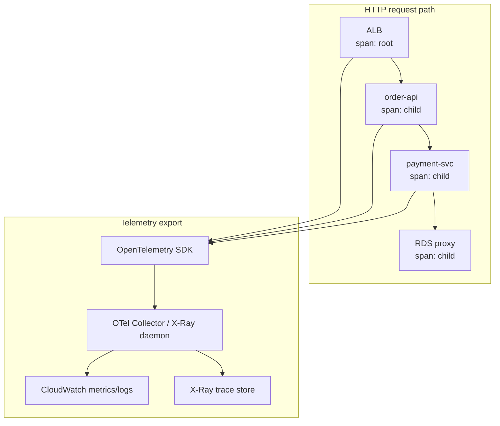
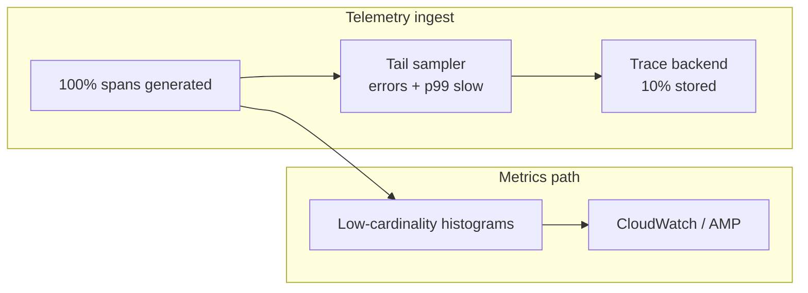
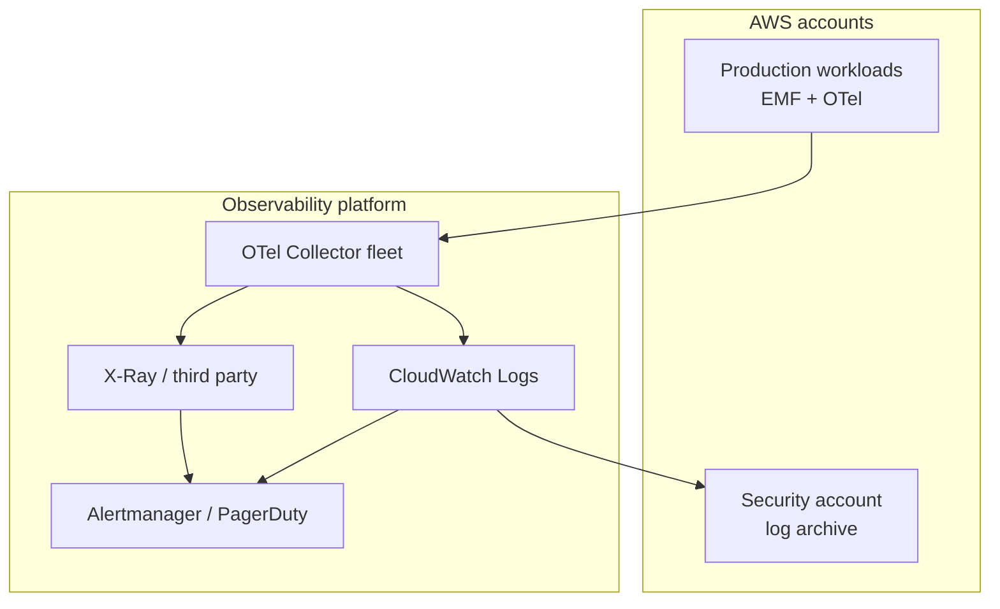

# Observability Fundamentals

## 1. Executive Summary

**Observability** is the ability to understand a system's internal state from its **external outputs**—primarily **metrics**, **logs**, and **distributed traces**—to answer novel questions during incidents and performance work without redeploying code. Unlike traditional **monitoring** (known failure modes with predefined dashboards), observability supports **exploratory debugging** in complex distributed systems where failures emerge from interaction, not single components.

This chapter covers the **three pillars**, **OpenTelemetry** as the vendor-neutral instrumentation standard, **cardinality** and **sampling** tradeoffs, correlation via **trace context**, and AWS production tooling: **CloudWatch**, **X-Ray**, **CloudWatch Logs Insights**, and integration with **SLO**-driven alerting.

Principal architects must design observability as **first-class infrastructure**: consistent schemas, cost controls, security of telemetry data, and alignment with **reliability targets**—not as an afterthought bolted on after launch.

## 2. Why This Topic Matters

You cannot operate what you cannot see. Distributed systems interviews at principal level assume:

- Fluency in metrics vs logs vs traces and when each applies.
- **High-cardinality** pitfalls and cost explosions on CloudWatch/Datadog.
- **Distributed tracing** across microservices, queues, and Lambdas.
- **Structured logging** with correlation IDs.
- Connecting observability to **SLIs**, **incident response**, and **capacity planning**.
- **OpenTelemetry** migration strategy vs vendor lock-in.

Production outages without adequate telemetry become **multi-hour mysteries**; with observability, mean time to resolution (MTTR) collapses.

## 3. Problems Being Solved

| Problem | Observability response |
|---------|------------------------|
| **Unknown unknown failures** | Exploratory queries across dimensions |
| **Cross-service causality** | Trace spans linking hops |
| **Latency tail debugging** | Percentile metrics and trace exemplars |
| **Audit and forensics** | Immutable logs with retention |
| **Capacity signals** | Saturation metrics (CPU, queue depth, throttles) |
| **Release validation** | Canary metrics and trace comparison |
| **SLO measurement** | SLI derivation from metrics/logs |

Observability does not replace **testing** or **chaos engineering**—it informs them.

## 4. Assumptions and System Model

| Assumption | Implication |
|------------|-------------|
| **Partial failure is normal** | Need per-hop visibility |
| **Clock skew exists** | Trace timestamps approximate; use span relationships |
| **Telemetry has cost** | Sample, aggregate, retain strategically |
| **PII may appear in logs** | Scrubbing and access control required |
| **Async boundaries break stacks** | Propagate context through queues |

**Client model:** Requests generate telemetry at edge (ALB), service, and data layers; async workers continue trace context if propagated.

## 5. Essential Terminology

| Term | Definition |
|------|------------|
| **Metric** | Numeric time-series measurement (counter, gauge, histogram) |
| **Log** | Discrete timestamped event record |
| **Trace** | End-to-end request path; tree of **spans** |
| **Span** | Single operation with timing, attributes, status |
| **Cardinality** | Number of unique time-series label combinations |
| **Histogram** | Distribution bucket counts for latency/size |
| **Exemplar** | Link from metric bucket to example trace |
| **OpenTelemetry (OTel)** | CNCF standard for traces, metrics, logs |
| **Collector** | Agent/gateway receiving, processing, exporting telemetry |
| **Instrumentation** | Code/library emitting telemetry |
| **Structured log** | JSON/key-value logs for queryability |
| **Correlation ID** | Identifier tying logs/traces to one request |
| **Sampling** | Recording subset of traces to control cost |
| **RED method** | Rate, Errors, Duration for services |
| **USE method** | Utilization, Saturation, Errors for resources |

## 6. Core Mechanism

### 6.1 Three pillars

| Pillar | Strength | Weakness |
|--------|----------|----------|
| **Metrics** | Cheap aggregation, alerting, dashboards | Low cardinality; loses individual request detail |
| **Logs** | Rich context, audit trail | Expensive at volume; hard to correlate without structure |
| **Traces** | Latency breakdown, dependency map | Costly; requires propagation discipline |

**Unified observability** correlates all three: exemplars from histogram → trace ID → structured logs with same `trace_id`.

### 6.2 Metrics deep dive

**Counter:** monotonically increasing (requests total). **Gauge:** point-in-time (queue depth). **Histogram:** latency distribution for percentile computation.

**RED** for request-driven services:
- **Rate** — requests/sec
- **Errors** — failed requests/sec
- **Duration** — latency distribution

**USE** for infrastructure:
- **Utilization** — % busy
- **Saturation** — queue length / throttle
- **Errors** — device/service errors

On AWS, **CloudWatch** provides standard metrics for EC2, RDS, Lambda, ALB; **custom metrics** via `PutMetricData` or EMF (Embedded Metric Format) from logs.

### 6.3 Structured logging

Unstructured logs resist query at scale. **JSON structured logs** with stable fields:

```json
{
  "timestamp": "2026-07-24T18:00:00Z",
  "level": "ERROR",
  "service": "order-api",
  "trace_id": "4bf92f3577b34da6a3ce929d0e0e4736",
  "span_id": "00f067aa0ba902b7",
  "order_id": "ord_123",
  "message": "payment declined",
  "error_code": "CARD_DECLINED"
}
```

**CloudWatch Logs Insights** queries: `fields @timestamp, order_id | filter error_code = "CARD_DECLINED"`.

**Log groups** per service/environment; retention policies balance cost vs compliance.

### 6.4 Distributed tracing

**W3C Trace Context** (`traceparent` header) propagates across HTTP calls. Each service creates **child spans**; collector assembles the **trace**.

AWS **X-Ray** integrates with Lambda, API Gateway, ECS, ALB (with configuration). **ADOT (AWS Distro for OpenTelemetry)** exports to X-Ray, CloudWatch, or third parties.



*Figure 1: Distributed trace—spans follow request path; collector exports to AWS backends.*

### 6.5 OpenTelemetry architecture

1. **Instrumentation** — auto (Java agent) or manual spans.
2. **SDK** — batching, sampling decisions.
3. **Exporter** — OTLP to collector.
4. **Collector** — processors (batch, filter, attributes), exporters to vendors.
5. **Backend** — storage, query UI, alerting.

**Vendor-neutral** instrumentation reduces lock-in; backends remain swappable.

### 6.6 Cardinality and sampling

**Cardinality explosion example:** `http_requests{user_id="..."}` with millions of users → unsustainable time-series count.

**Mitigations:**
- Bound label values (status class not status code; route template not raw URL).
- Aggregate high-cardinality dimensions in traces/logs, not metrics.
- **Tail sampling** — keep errors and slow traces always; sample happy path.



*Figure 2: Sampling strategy—metrics aggregated with low cardinality; traces tail-sampled.*

### 6.7 AWS production observability checklist

| Control | AWS service | Principal note |
|---------|-------------|----------------|
| API audit | CloudTrail org trail | Immutable S3 + Object Lock for regulated tiers |
| Request SLIs | ALB/API Gateway metrics | Foundation for SLO dashboards |
| Distributed traces | X-Ray + ADOT | Propagate through SQS/SNS/EventBridge |
| Synthetic journeys | CloudWatch Synthetics | Black-box SLI for critical paths |
| Log search | Logs Insights / OpenSearch | Structure logs day one |
| Anomaly detection | CloudWatch Anomaly Detection | Supplement, not replace SLO burn alerts |
| Container insights | Container Insights for ECS/EKS | Pod-level saturation alongside RED |

## 7. Step-by-Step Walkthrough

### Walkthrough A: Instrument ECS service with OpenTelemetry

1. Add ADOT sidecar or Java agent to task definition.
2. Configure OTLP exporter to **X-Ray** and **CloudWatch**.
3. Propagate `traceparent` on outbound HTTP to downstream services.
4. Verify service map in X-Ray console shows order → payment edges.
5. Create CloudWatch alarm on `Fault` rate derived from spans.

### Walkthrough B: ALB access logs to SLI

1. Enable ALB access logs to S3.
2. Athena table over logs; daily scheduled query for 5xx ratio.
3. Publish result as custom CloudWatch metric via Lambda.
4. Dashboard + burn-rate alarm tied to SLO.

### Walkthrough C: Lambda tracing

1. Enable **Active tracing** on Lambda (X-Ray).
2. Lambda service map shows API Gateway → Lambda → DynamoDB.
3. Add custom subsegments for business logic blocks.
4. Watch cold start duration in trace timeline.

### Walkthrough D: Incident debug with three pillars

1. **Alert:** error rate burn on `order-api`.
2. **Metrics:** spike in `HTTP 500` on `/checkout`.
3. **Traces:** filter `status=error`, find `payment-svc` timeout spans.
4. **Logs:** Logs Insights query on `trace_id` from slow trace—see `upstream_timeout`.
5. **Root cause:** payment dependency raised timeout; fix circuit breaker threshold.

### Walkthrough E: Cost control review

1. CloudWatch bill spike from custom metrics cardinality.
2. Audit labels—remove `customer_id` from metric dimensions.
3. Move per-customer debug to sampled traces.
4. Reduce log retention from 90 to 30 days for non-audit tiers.
5. Enable **S3 Intelligent-Tiering** for log archive buckets.

### Walkthrough F: Cross-account observability on AWS

Large enterprises use **AWS Organizations** with centralized security and observability accounts:

1. **Producer accounts** emit logs to subscription filters forwarding to central **Kinesis Data Firehose** → S3 data lake.
2. **OTel Collectors** in each account export traces to a shared **X-Ray** group or third-party backend via PrivateLink.
3. **IAM roles** in observability account assume **read-only** roles in workload accounts for incident debugging.
4. **CloudWatch cross-account observability** (where enabled) unifies dashboards without duplicating metric storage.

Principal architects define **data residency** boundaries—EU accounts may not forward logs to US-central SIEM without legal review.

### Walkthrough G: Observability-driven capacity planning

1. **Saturation metrics**: RDS `FreeStorageSpace`, Lambda `ConcurrentExecutions`, SQS `ApproximateAgeOfOldestMessage`.
2. Correlate saturation with **RED duration** increases before user-visible SLO breach.
3. **Forecast** with CloudWatch anomaly detection or vendor ML on seasonal traffic (retail peaks).
4. **Autoscaling policies** tuned from trace-derived p99 latency, not CPU alone.

Observability closes the loop: traces find bottlenecks; metrics prove fix effectiveness post-deploy.

### Production logging standards (AWS)

Define a **mandatory schema** for all services:

| Field | Purpose |
|-------|---------|
| `service.name` | Service identity in service map |
| `deployment.environment` | `prod` / `staging` separation |
| `trace_id` / `span_id` | Cross-pillar correlation |
| `aws.request_id` | ALB/Lambda request correlation |
| `error.type` / `error.message` | Structured exception capture |

Reject PRs that add unstructured `println` in production code paths—use structured logger with level guards (`INFO` vs `DEBUG`).

**Interview tip:** When comparing observability tools, emphasize **data model** (metrics cardinality, trace propagation, log schema) and **operational cost** at your scale—not feature checklists. Principal answers connect observability design to **MTTR reduction** and **SLO measurement**, with AWS-specific examples (ALB metrics, X-Ray service map, Logs Insights queries).

## 8. Invariants and Guarantees

| Property | Statement |
|----------|-----------|
| **Trace context propagation** | If headers preserved, spans connect across sync hops |
| **Metric aggregation** | Loses per-request detail—by design |
| **Log immutability** | CloudWatch Logs streams append-only (with retention expiry) |
| **Sampling bias** | Head sampling may miss rare errors—prefer tail sampling |

Observability provides **evidence**, not **correctness proofs**.

## 9. Failure Scenarios

| Failure | Symptom | Mitigation |
|---------|---------|------------|
| **Broken trace propagation** | Disjoint traces per hop | Middleware injects W3C headers; SQS message attributes |
| **Log flood** | Ingest cost, query slowness | Rate limit debug logs; dynamic log levels |
| **Metric cardinality blowup** | API throttling, bill shock | Label governance, EMF review |
| **Clock skew** | Impossible span parent timing | Rely on span relationships; NTP on hosts |
| **Telemetry backend outage** | Blind during incident | Local buffering, dual export |
| **PII in logs** | Compliance breach | Scrubbers, field allowlists |
| **Dashboard theater** | Green metrics, angry users | User-journey synthetics, SLO SLIs |
| **Missing async context** | Broken traces through SQS | Message attribute `traceparent` injection standard |

Treat **missing instrumentation** as a **defect** with severity tied to service tier—tier-1 services without RED metrics should not reach production.

## 10. Performance Characteristics

| Aspect | Behavior |
|--------|----------|
| **Instrumentation overhead** | Typically low single-digit % CPU with batching |
| **OTel batch export** | Adds latency to telemetry visibility (seconds) |
| **CloudWatch PutMetricData** | API limits; prefer EMF embedded in logs |
| **X-Ray trace ingestion** | Sampling reduces load |
| **Logs Insights queries** | Scan cost scales with data scanned |

Instrument **hot paths** carefully—synchronous logging in tight loops hurts latency.

## 11. Scalability Limits

- CloudWatch **custom metric** limits per region.
- **Log ingestion** TPS per account.
- **Trace retention** (X-Ray default 30 days).
- **Query concurrency** on analytics backends.
- **Service map** complexity at thousands of microservices without grouping.

## 12. Operational Considerations

- **Observability standards doc**: required fields (`service`, `env`, `trace_id`, `version`).
- **Dashboards as code** (Terraform/CDK, Grafana JSON in Git).
- **On-call runbooks** linked from alerts with Logs Insights queries prefilled.
- **Ownership**: each team owns service dashboards and SLO alerts.
- **Central platform team** provides collectors, retention policies, cost reports.
- **AWS Organizations** — observability account for centralized security analytics.



*Figure 3: Multi-account observability—central collection, security archive, unified alerting.*

## 13. Security Considerations

- **IAM** least privilege for `logs:PutLogEvents`, `xray:PutTraceSegments`.
- **Encryption** at rest (KMS) for log groups and S3 log archives.
- **No secrets in logs** — redact tokens, PAN, passwords.
- **VPC endpoints** for telemetry export from private subnets.
- **Access auditing** — who can read production logs (high sensitivity).

## 14. Cost Considerations

| Driver | Control |
|--------|---------|
| **Log volume** | Retention, sampling, log level |
| **Custom metrics** | Cardinality limits, standard metrics first |
| **Trace storage** | Aggressive sampling of success paths |
| **Cross-AZ log shipping** | Regional collectors |
| **Vendor SaaS** | Ingest vs storage pricing models differ |

Observability cost should be **budgeted** like compute—FinOps reviews monthly.

## 15. Production Implementations

| Stack | Components |
|-------|------------|
| **AWS-native** | CloudWatch, X-Ray, Synthetics, Logs Insights |
| **Hybrid OTel** | ADOT → AMP (Managed Prometheus) + AMG (Managed Grafana) |
| **Enterprise vendor** | Datadog/New Relic with OTel ingest |
| **High-volume logs** | S3 + Athena + OpenSearch for search-heavy forensics |

Amazon **Builder's Library** and **Well-Architected Operational Excellence** pillar emphasize actionable telemetry.

## 16. Alternatives and Tradeoffs

| Alternative | When |
|-------------|------|
| **Metrics-only** | Simple batch jobs; insufficient for microservices |
| **Logs-only** | Small deployments; costly at scale |
| **APM proprietary agents** | Fast onboarding; lock-in risk |
| **eBPF-based (Cilium, Pixie)** | Kernel-level without code change; infra focus |

OpenTelemetry is the **direction of industry convergence** for instrumentation portability.

## 17. Common Misconceptions

| Misconception | Reality |
|---------------|---------|
| "Monitoring = observability" | Monitoring is subset; observability enables novel queries |
| "100% tracing" | Prohibitively expensive; sample intelligently |
| "More logs = better" | Signal-to-noise degrades; structure matters |
| "Average latency sufficient" | Tails drive user pain—use histograms |
| "X-Ray alone is enough" | Custom spans and business metrics still required |

## 18. Principal Architect Perspective

- **Mandate correlation IDs** across sync and async boundaries in architecture standards.
- **Platform golden paths** — approved OTel libraries, not per-team snowflakes.
- **SLO-driven alerting** over static thresholds where possible.
- **Observability in design reviews** — "How will we debug this?"
- **Game days** validate telemetry catches injected failures.
- **Budget observability spend** in architecture phase—high-cardinality custom metrics on CloudWatch can exceed compute cost for chatty services; platform teams should publish cost-per-telemetry guidelines.

## 19. Architecture Review Exercise

**Scenario:** Microservices use printf debugging; no trace propagation through SQS; 500 GB/day logs with 7-day retention; on-call cannot find root cause in under 2 hours.

**Recommendations:**
1. Adopt OpenTelemetry with SQS trace context injection.
2. Structured JSON logs with `trace_id`.
3. RED metrics per service; drop debug log volume in prod.
4. Tail sampling on traces; 30-day retention tiering (hot/cold S3).
5. SLO burn alerts on user journey synthetics.

## 20. Whiteboard Explanation

"Observability is metrics, logs, and traces. Metrics give cheap aggregates for alerting—request rate, errors, duration. Logs give event detail when we know what to search—structured JSON with trace IDs. Traces show the path and latency across services for one request. We instrument with OpenTelemetry, export to CloudWatch and X-Ray, and control cost with sampling and cardinality limits. During incidents we start from SLO burn alerts, narrow with metrics, find exemplar traces, then pull logs by trace ID. This beats guessing which service failed."

## 21. Interview Questions

1. **Three pillars of observability?** — Metrics, logs, traces.
2. **Metrics vs logs?** — Aggregated time-series vs discrete events.
3. **What is a span?** — Single operation unit in a trace.
4. **Cardinality problem?** — Label explosion and cost.
5. **RED vs USE?** — Service vs resource methodology.
6. **OpenTelemetry role?** — Vendor-neutral instrumentation and export.
7. **How propagate context async?** — Message attributes, baggage.
8. **Tail vs head sampling?** — Keep interesting traces after request completes.
9. **AWS tools for tracing?** — X-Ray, ADOT.
10. **Structured logging benefits?** — Queryability, parsing.
11. **Exemplars?** — Metric-to-trace linkage.
12. **Connect observability to SLOs?** — SLI derivation from metrics/synthetics.

## 22. Interview Follow-Ups

1. **Design observability for 500 microservices.** — Platform collector, naming standards, service graph grouping.
2. **Debug 99th percentile regression after deploy.** — Compare trace histograms canary vs prod.
3. **Lambda + API Gateway tracing gaps?** — Active tracing, custom subsegments, downstream HTTP propagation.
4. **Log PII compliance.** — Field filtering, tokenization, restricted access.
5. **When not to use high-cardinality labels?** — Always for metrics; use traces for dimensions.

## 23. Strong Answer Example

**Question:** "How would you debug elevated latency in a microservices checkout flow on AWS?"

**Strong outline:** "I'd start from the SLO dashboard—confirm latency SLI breach and whether errors correlate. Check ALB `TargetResponseTime` p99 and compare to last deploy. Open X-Ray service map filtered to checkout time window—is payment or inventory downstream slower? Pull exemplar traces for slow requests; compare span durations. If payment spans dominate, drill into payment service logs using `trace_id` from the exemplar—look for timeout messages or DB slow queries. Check RDS Performance Insights if database-bound. If trace breaks at SQS, propagation is broken—fix message attribute injection. Meanwhile verify no regional issue via cross-AZ metrics. Document finding in postmortem and add a metric on payment client timeout rate to catch recurrence."

## 24. Weak Answer Example

**Weak:** "Check CloudWatch CPU and grep logs for errors."

**Red flags:** No distributed tracing, no percentile analysis, no cross-service path, no SLO framing.

## 25. Hands-On Exercise

**Lab:** `labs/lab-014-observability/` — RED metrics + traces on **`:8104`**

```bash
cd labs/lab-014-observability
python3 -m venv .venv && source .venv/bin/activate
pip install -r requirements.txt
pytest tests/ -v
docker compose -p lab014 -f docker/docker-compose.yml up --build -d
chmod +x scripts/demo_observability.sh && ./scripts/demo_observability.sh
```

| Step | Endpoint | What happens |
|------|----------|--------------|
| 1 | `POST /v1/requests/simulate` | Generate instrumented HTTP traffic |
| 2 | `GET /metrics` | Prometheus text (rate, errors, duration) |
| 3 | `GET /v1/traces` | Correlated spans + structured logs |
| 4 | `POST /v1/chaos/inject` | Error/latency spike for triage drill |
| 5 | Trace timeline | Locate slow downstream in span tree |

**Swagger:** http://localhost:8104/docs

### Engineer guide: how the local stack works

1. **RED metrics** — request rate, error ratio, duration histograms exposed at `/metrics`.
2. **Structured logs** — `trace_id`, `span_id`, `service`, `route` for log-trace correlation.
3. **In-process tracer** — W3C `traceparent` propagation across simulated microservices.
4. **Chaos inject** — spike errors/latency to practice alert → trace → log workflow.
5. **Cardinality discipline** — route labels bounded; avoid high-cardinality user IDs in metrics.

### Build-from-scratch exercise (optional)

1. Deploy sample app (AWS observability workshop or OTel demo).
2. Generate load; introduce artificial delay in one service.
3. Locate delay via trace timeline.
4. Write Logs Insights query correlating error logs.
5. Create dashboard: RED metrics; configure tail sampling keeping errors 100%.

## 26. Knowledge Check

1. Define observability vs monitoring.
2. Name three metric types.
3. What fields should structured logs include?
4. How does W3C traceparent work?
5. What causes cardinality explosion?
6. Purpose of OpenTelemetry Collector?
7. RED method three letters?
8. AWS service for distributed traces?
9. What is EMF?
10. Why tail sampling?
11. How link metrics to traces?
12. Log retention tradeoff?

## 27. Flashcards

| Front | Back |
|-------|------|
| Three pillars | Metrics, logs, traces |
| Span | Single timed operation in a trace |
| Trace context | W3C traceparent propagation headers |
| Cardinality | Unique time-series from label combinations |
| RED | Rate, Errors, Duration |
| USE | Utilization, Saturation, Errors |
| OpenTelemetry | CNCF telemetry standard (OTel) |
| Tail sampling | Keep interesting traces after request completes |
| Structured log | Machine-parseable key-value/JSON logs |
| X-Ray | AWS distributed tracing service |
| ADOT | AWS Distro for OpenTelemetry |
| Exemplar | Metric sample linking to trace ID |

## 28. Cheat Sheet

```
PILLARS
  metrics: alert + aggregate (low cardinality)
  logs: events + audit (structure + trace_id)
  traces: latency path (sample + propagate)

INSTRUMENTATION
  OpenTelemetry SDK → Collector → backend
  AWS: ADOT, X-Ray, CloudWatch EMF

SERVICE HEALTH (RED)
  Rate, Errors, Duration

RESOURCE HEALTH (USE)
  Utilization, Saturation, Errors

COST CONTROL
  bound metric labels
  tail sample traces
  log retention tiers
  avoid debug printf in hot path

INCIDENT FLOW
  SLO burn → metrics narrow → trace exemplar → logs by trace_id
```

## 29. Related Concepts

- [SLOs, SLIs, and Error Budgets](/docs/reliability-and-resilience/slo-sli-error-budgets) — SLI sources
- [AWS Fundamentals](/docs/cloud-architecture/aws-fundamentals) — CloudWatch, X-Ray services
- [Partial Failure](/docs/distributed-systems-foundations/partial-failure) — why cross-service visibility matters
- [Microservices](/docs/microservices/overview) — distributed debugging complexity
- [Security Architecture Fundamentals](/docs/security/security-architecture-fundamentals) — telemetry access control
- [Multi-Region Architecture](/docs/cloud-architecture/multi-region-architecture) — cross-region trace correlation

## 30. References

### Primary sources

- Majors, C., Fong-Jones, H., & Miranda, G. (2022). *Observability Engineering.* O'Reilly.
- OpenTelemetry. *Documentation.* https://opentelemetry.io/docs/
- Amazon Web Services. *CloudWatch User Guide* — https://docs.aws.amazon.com/AmazonCloudWatch/
- Amazon Web Services. *AWS X-Ray Developer Guide* — https://docs.aws.amazon.com/xray/
- Amazon Web Services. *AWS Distro for OpenTelemetry* — https://aws-otel.github.io/

### Books

- Beyer, B., et al. (2016). *Site Reliability Engineering.* O'Reilly. [Monitoring distributed systems chapter]

### Distinction

- **OTel specification** — Evolving standard; verify version compatibility.
- **AWS service limits** — Quotas change; check current documentation.
