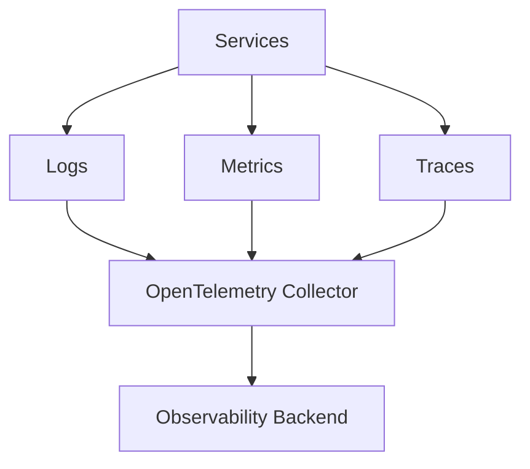

# Observability

Logs, metrics, traces, OpenTelemetry, SLIs, SLOs, and alerting.

*Figure: Three pillars of observability unified via OpenTelemetry.*

## Chapters

| Chapter | Focus |
|---------|-------|
| Observability Fundamentals | [Observability Fundamentals](/docs/observability/observability-fundamentals) |
| Distributed Tracing | [Distributed Tracing](/docs/observability/distributed-tracing) |

## Learning Path

1. Start with **Observability Fundamentals** for metrics, logs, traces, and the three pillars.
2. Finish with **Distributed Tracing** for context propagation, sampling, and tail-based analysis.

## Interview Prep

| Resource | Topic |
|----------|-------|
| [Lab 014 observability](/docs/observability/observability-fundamentals#25-hands-on-exercise) | RED metrics + traces on `:8104` |

## Related Domains

- [Reliability and Resilience](/docs/reliability-and-resilience/overview)
- [System Design](/docs/system-design/overview)

Return to the [Curriculum Overview](/docs/start-here/curriculum-overview) to see how this domain fits the learning path.
