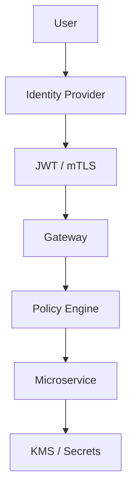

# Security Architecture

Zero trust, OAuth, mTLS, encryption, threat modeling, and STRIDE.

*Figure: Zero-trust request flow — authenticate, authorize, encrypt.*

## Chapters

| Chapter | Focus |
|---------|-------|
| Security Architecture Fundamentals | [Security Architecture Fundamentals](/docs/security/security-architecture-fundamentals) |
| Zero Trust Architecture | [Zero Trust Architecture](/docs/security/zero-trust-architecture) |

## Learning Path

1. Start with **Security Architecture Fundamentals** for threat modeling, defense in depth, and IAM.
2. Finish with **Zero Trust Architecture** for identity-centric perimeter design and micro-segmentation.

## Related Domains

- [Microservices](/docs/microservices/overview)
- [Cloud Architecture](/docs/cloud-architecture/overview)

Return to the [Curriculum Overview](/docs/start-here/curriculum-overview) to see how this domain fits the learning path.
