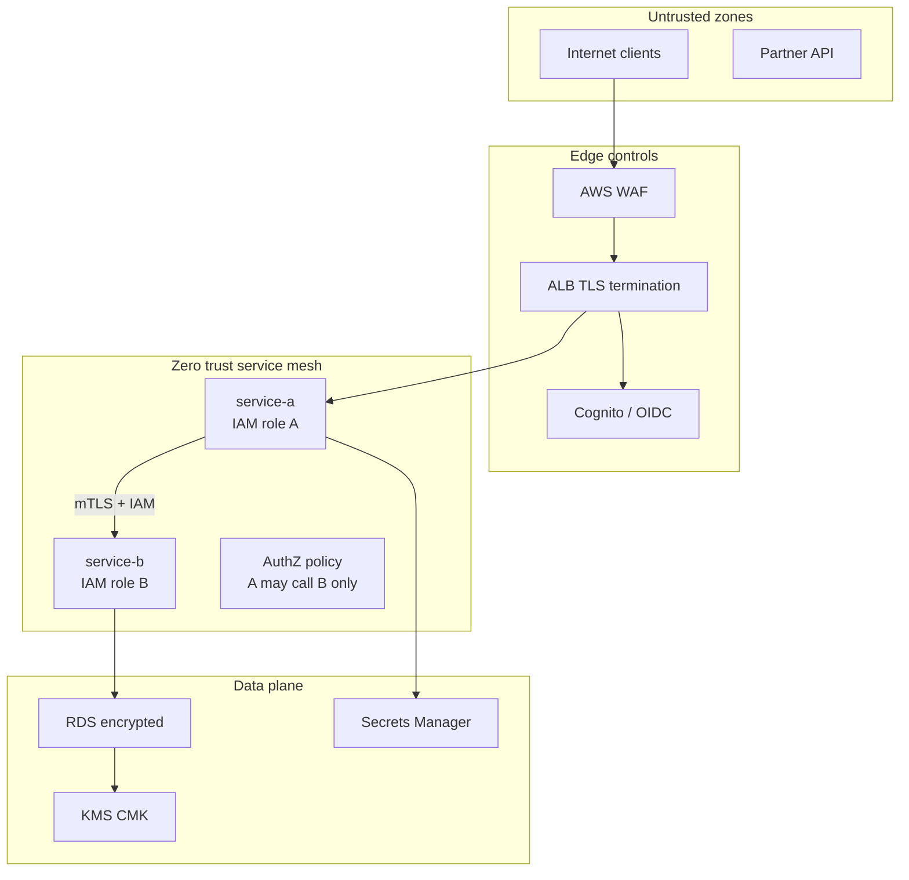
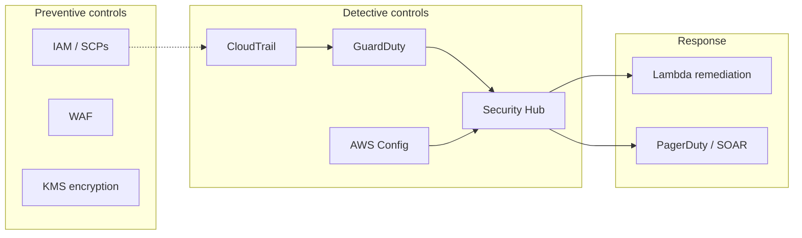
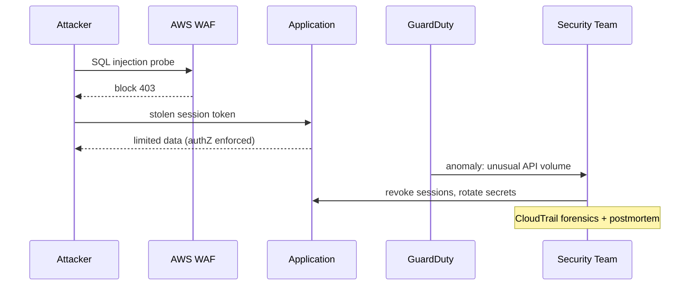

# Security Architecture Fundamentals

## 1. Executive Summary

**Security architecture** defines how a system protects **confidentiality**, **integrity**, and **availability** against intentional and accidental threats across people, processes, and technology. At principal level, security is not a checklist of tools—it is a **design discipline** integrating **identity**, **network segmentation**, **encryption**, **supply chain controls**, and **detective response** into every architecture decision.

This chapter covers **defense in depth**, the **zero trust** model ("never trust, always verify"), **threat modeling** with **STRIDE**, encryption in transit and at rest, **AWS IAM** and **KMS** as control planes, and production patterns: **WAF**, **Secrets Manager**, **GuardDuty**, **Security Hub**, and **audit logging** via **CloudTrail**.

Principal architects balance **security vs velocity** with explicit risk acceptance, measurable controls, and alignment to compliance frameworks—not security theater that blocks delivery without reducing real risk.

## 2. Why This Topic Matters

Security failures end careers and companies. Interviewers expect:

- **STRIDE** threat categorization on a whiteboard design.
- **Zero trust** principles applied to cloud microservices.
- **IAM least privilege** and **blast radius** of compromised credentials.
- **Encryption** key management (KMS, rotation, MRKs for DR).
- **mTLS** vs TLS termination at load balancer tradeoffs.
- **Shared responsibility** on AWS—what you must still own.
- **Incident response** integration: detection, containment, recovery.

Security architecture is **distributed systems security**: boundaries, trust, and failure modes under attack.

## 3. Problems Being Solved

| Problem | Security architecture response |
|---------|-------------------------------|
| **Unauthorized access** | IAM, MFA, RBAC, policy boundaries |
| **Data exfiltration** | Encryption, DLP, network egress controls |
| **Lateral movement** | Segmentation, zero trust, short-lived credentials |
| **Supply chain compromise** | Signed artifacts, dependency scanning, IaC review |
| **Insider threat** | Least privilege, audit logs, separation of duties |
| **DDoS / abuse** | WAF, Shield, rate limiting |
| **Compliance** | Config rules, evidence from CloudTrail |
| **Key compromise** | Rotation, HSM, MRK, revocation procedures |

Security does not guarantee **zero incidents**—it reduces likelihood and impact with **detectable, recoverable** posture.

## 4. Assumptions and System Model

| Assumption | Implication |
|------------|-------------|
| **Breach will occur** | Design detection and containment, not only prevention |
| **Insiders and bugs exist** | Least privilege; no single god-role |
| **Dependencies are untrusted** | Verify signatures, scan CVEs |
| **Network perimeter is insufficient** | Zero trust inside VPC |
| **Crypto keys are high-value targets** | KMS, HSM, rotation |
| **Auditability required** | Immutable logs, retention policies |

**Threat model:** Rational adversaries with varying capability—script kiddies to nation-states; design for **credential theft** and **misconfiguration** as most common AWS risks.

## 5. Essential Terminology

| Term | Definition |
|------|------------|
| **CIA triad** | Confidentiality, Integrity, Availability |
| **Authentication** | Proving identity (who) |
| **Authorization** | Permitting action (what) |
| **Zero trust** | Verify every request; no implicit network trust |
| **Defense in depth** | Layered controls |
| **STRIDE** | Spoofing, Tampering, Repudiation, Info disclosure, DoS, Elevation |
| **mTLS** | Mutual TLS—client and server certificates |
| **KMS** | AWS Key Management Service for encryption keys |
| **CMK** | Customer Master Key |
| **HSM** | Hardware Security Module (CloudHSM, KMS custom key store) |
| **WAF** | Web Application Firewall |
| **SCP** | Service Control Policy in AWS Organizations |
| **SBOM** | Software Bill of Materials |
| **CSPM** | Cloud Security Posture Management |
| **MTTD / MTTR** | Mean time to detect / respond |

## 6. Core Mechanism

### 6.1 Defense in depth layers

1. **Identity** — IAM, SSO, MFA, role assumption.
2. **Perimeter** — WAF, Shield, CloudFront, API throttling.
3. **Network** — VPC segmentation, security groups, PrivateLink.
4. **Compute** — Hardened AMIs, IMDSv2, patch management.
5. **Application** — Input validation, OWASP mitigations, authZ.
6. **Data** — Encryption at rest (KMS), in transit (TLS), tokenization.
7. **Detection** — GuardDuty, Security Hub, CloudTrail anomalies.
8. **Response** — Runbooks, IR teams, automated containment (Lambda).

Failure of one layer should not imply total compromise.

### 6.2 Zero trust on AWS

Traditional: "Inside VPC = trusted." **Zero trust:** Every API call and connection is authenticated and authorized regardless of network location.

Practices:
- **IAM roles** for workloads; no long-lived keys.
- **Service-to-service mTLS** or **IAM SigV4** for AWS APIs.
- **Security groups** as micro-segmentation—not flat `10.0.0.0/16` access.
- **VPC Lattice / App Mesh** for service identity policies.
- **Conditional access** — MFA for humans; `aws:SourceVpc` in policies.



*Figure 1: Zero trust layers—edge authentication, service-level authorization, encrypted data with KMS.*

### 6.3 Threat modeling with STRIDE

Apply STRIDE per **component** or **data flow**:

| Threat | Example | Mitigation |
|--------|---------|------------|
| **Spoofing** | Fake service calling API | mTLS, IAM, JWT validation |
| **Tampering** | Modify S3 object in transit | TLS, signed URLs, checksums |
| **Repudiation** | Deny placing order | CloudTrail, signed audit logs |
| **Information disclosure** | S3 bucket public | Block Public Access, SCPs, encryption |
| **Denial of service** | Flood ALB | Shield, WAF rate limits, autoscaling |
| **Elevation of privilege** | Compromised role gains admin | Least privilege, permission boundaries |

**Process:** Diagram data flows → identify assets → STRIDE per flow → prioritize mitigations → verify in tests.

### 6.4 Encryption architecture

**In transit:** TLS 1.2+ everywhere; **ACM** for public certs; internal **mTLS** for service mesh where needed.

**At rest:**
- **S3** SSE-S3, SSE-KMS, or SSE-C.
- **EBS/RDS** KMS encryption.
- **Secrets Manager** encryption with CMK.

**Key management:**
- **CMK rotation** annual automatic (AWS-managed) or manual for customer keys.
- **Multi-Region Keys (MRK)** for DR decrypt in secondary region.
- **Key policies** + IAM policies both must allow—dual authorization.
- **CloudHSM** when FIPS 140-2 Level 3 or contractual HSM required.

**Principal rule:** Encryption without **access control** is incomplete; KMS policies are authorization layer.

### 6.5 AWS security services map

| Service | Role |
|---------|------|
| **IAM / SSO** | Identity and access |
| **KMS** | Key management |
| **WAF + Shield** | Application DDoS and OWASP rules |
| **GuardDuty** | Threat detection (ML on VPC Flow, DNS, CloudTrail) |
| **Security Hub** | Findings aggregation (CIS, PCI) |
| **Inspector** | Vulnerability scanning for EC2/ECR/Lambda |
| **Macie** | Sensitive data discovery in S3 |
| **Config** | Configuration compliance rules |
| **CloudTrail** | API audit trail |
| **Secrets Manager** | Secret rotation |
| **Network Firewall** | IDS/IPS at VPC edge |



*Figure 2: AWS security control plane—preventive IAM/encryption; detective aggregation in Security Hub.*

### 6.6 Compliance mapping (informative)

Security architecture often maps to frameworks without being identical:

| Framework | AWS-aligned controls (examples) |
|-----------|--------------------------------|
| **CIS AWS Foundations** | Security Hub benchmark, Config rules |
| **PCI DSS** | Network segmentation, encryption, logging (scope reduction via tokenization) |
| **SOC 2** | Access control evidence from CloudTrail, change management via IaC |
| **GDPR** | Data residency, encryption, breach notification procedures |
| **HIPAA** | BAA with AWS, KMS, access logging (not automatic compliance—architecture required) |

**Distinction:** Compliance attestation is **organizational**; technical controls enable but do not guarantee audit success.

## 7. Step-by-Step Walkthrough

### Walkthrough A: Threat model a public API

1. Draw: Client → CloudFront → WAF → ALB → ECS → RDS.
2. **STRIDE** on client→ALB: spoofing (JWT), tampering (TLS), DoS (WAF).
3. **STRIDE** on ECS→RDS: info disclosure (SG rules), elevation (DB creds in env—use Secrets Manager).
4. Prioritize: public S3 risk, SQL injection, IAM overpermission.
5. Document mitigations in ADR; track in Security Hub.

### Walkthrough B: IAM least privilege for Lambda

1. Start with **AWS managed policy** for prototyping only.
2. Replace with **inline policy** listing specific ARNs: one DynamoDB table, one SQS queue.
3. Add **permission boundary** on role max permissions.
4. Enable **IAM Access Analyzer** — remove unused permissions quarterly.
5. **CloudTrail** alerts on `AttachUserPolicy` with `AdministratorAccess`.

### Walkthrough C: Encrypt data path end-to-end

1. ACM cert on ALB (TLS 1.3 policy).
2. ALB → targets over TLS or within private VPC (threat model dependent).
3. RDS storage encryption with CMK; `rds:Encrypted` in Config rule.
4. S3 bucket policy denies `aws:SecureTransport=false`.
5. KMS key policy allows only app role and backup role.

### Walkthrough D: Respond to leaked access key

1. **Disable** key immediately in IAM.
2. **CloudTrail** `LookupEvents` for key ID—scope API calls made.
3. **Rotate** affected secrets; review S3/EC2 creations.
4. **GuardDuty** findings for exfiltration patterns.
5. Postmortem: key was in Git—implement **git-secrets**, **OIDC for CI**, no long-lived keys.

### Walkthrough E: Organization guardrails

1. AWS Organizations with **SCP**: deny `s3:PutBucketPublicAccessBlock` disable, deny unapproved regions.
2. **Control Tower** landing zone — centralized logging account.
3. **Config aggregator** across accounts.
4. **Security Hub** enabled org-wide with CIS benchmark.
5. **Security Hub custom insights** route critical findings to ticketing with SLA by severity.

### Walkthrough F: OAuth 2.0 / OIDC for API security on AWS

Public APIs commonly use **Amazon Cognito** or external IdP (Okta, Auth0) with **OAuth 2.0 authorization code flow** + **PKCE** for mobile/SPA:

1. Client obtains authorization code from IdP.
2. Exchanges code for **access token** (short-lived) and **refresh token** (restricted storage).
3. **API Gateway JWT authorizer** or application middleware validates signature, `aud`, `exp`, scopes.
4. **Fine-grained authorization** at service layer—JWT scopes are coarse; map to RBAC/ABAC internally.
5. **Token revocation** via short TTL + refresh rotation; Cognito global sign-out for compromise response.

**mTLS** complements OAuth for **service-to-service** calls where no human IdP exists—common in mesh architectures.

### Walkthrough G: Encryption key lifecycle and DR

1. Create **customer-managed CMK** in primary region with automatic annual rotation enabled.
2. Define **key administrators** (security team) separate from **key users** (application roles)—separation of duties.
3. For multi-region DR, use **Multi-Region Keys (MRK)** so ciphertext from primary decrypts in DR region after failover.
4. **Key deletion** requires waiting period—document break-glass if key compromise requires disable-not-delete first.
5. **CloudTrail** logs all `kms:Decrypt` calls—alert on anomalous principals.

Key lifecycle is architecture, not a one-time setup task.

## 8. Invariants and Guarantees

| Property | Statement |
|----------|-----------|
| **IAM explicit Deny** | Overrides Allow |
| **KMS dual policy** | Key policy + IAM must both permit |
| **TLS correct implementation** | Protects confidentiality on wire—not endpoint auth alone |
| **CloudTrail immutability** | With log file validation and restricted delete IAM |

Cryptography provides **computational** guarantees; **operational** errors bypass crypto.

## 9. Failure Scenarios

| Failure | Impact | Mitigation |
|---------|--------|------------|
| **Public S3 bucket** | Mass data leak | Block Public Access, Macie, SCPs |
| **Overprivileged role** | Lateral movement | Least privilege, Access Analyzer |
| **Stale CVE in container** | RCE | ECR scanning, patch pipeline |
| **SSRF to IMDS** | Credential theft | IMDSv2, hop limit 1, no public IPs |
| **KMS key deletion** | Data unrecoverable | Waiting period, MRK, backups |
| **WAF bypass** | Application-layer attack | App validation, rate limits |
| **Audit log gap** | No forensics | Org trail, log validation, S3 Object Lock |
| **Supply chain poison** | Malicious dependency | SBOM, signed images, provenance |

## 10. Performance Characteristics

| Control | Overhead |
|---------|----------|
| **TLS** | CPU on handshake; session resumption mitigates |
| **KMS encrypt/decrypt** | API latency; data key caching in SDK |
| **mTLS mesh** | Connection setup; cert rotation automation |
| **WAF inspection** | Latency ms-level; rule complexity matters |
| **GuardDuty** | No inline traffic inspection—API analysis |

Security controls add latency—**budget** in performance requirements.

## 11. Scalability Limits

- **IAM policy size** limits—use permission sets and ABAC patterns.
- **KMS request quotas**—request increases for high-throughput encrypt.
- **WAF ACL rule limits**—prioritize rules; use rule groups.
- **CloudTrail volume**—management events only vs data events cost.
- **Centralized security account** as bottleneck—automate with event-driven response.

## 12. Operational Considerations

- **Security champions** embedded in product teams.
- **Threat model** per major feature at design review.
- **Vulnerability management SLA** by severity (CVSS).
- **Penetration testing** annual + after major changes.
- **Break-glass accounts** in vault with MFA and logging.
- **Patch cadence** for AMIs, EKS versions, Lambda runtimes.
- **Disaster recovery** for KMS keys and certificate expiry calendars.



*Figure 3: Layered response—WAF blocks obvious attacks; authZ limits blast radius; GuardDuty triggers IR.*

## 13. Security Considerations

This section is meta—**security of security tools**:

- Restrict Security Hub / GuardDuty admin to security account.
- **CloudTrail log bucket** — deny delete except break-glass; MFA delete on S3.
- **Secrets rotation** without downtime—dual-secret pattern.
- **Third-party SaaS** — OAuth scopes, data processing agreements.

## 14. Cost Considerations

| Item | Notes |
|------|-------|
| **GuardDuty / Security Hub** | Per-account or volume pricing |
| **KMS API calls** | High-throughput apps—cache data keys |
| **WAF** | Per rule + request charges |
| **CloudTrail data events** | Expensive—scope S3 object-level selectively |
| **Macie** | Sensitive data scanning at scale |

Security spend is **risk insurance**—justify with threat model priorities.

## 15. Production Implementations

| Pattern | AWS implementation |
|---------|-------------------|
| **Landing zone** | Control Tower, SCPs, centralized logging |
| **Microservice zero trust** | App Mesh mTLS, IAM roles per task |
| **Data lake security** | Lake Formation, column-level permissions |
| **CI/CD security** | OIDC to AWS, signed containers, CodePipeline scans |
| **Hybrid identity** | IAM Identity Center + SAML to corporate IdP |

Reference: [AWS Security Reference Architecture](https://docs.aws.amazon.com/prescriptive-guidance/latest/security-reference-architecture/).

## 16. Alternatives and Tradeoffs

| Alternative | When |
|-------------|------|
| **VPN perimeter trust** | Legacy; insufficient alone for cloud |
| **Hardware HSM on-prem** | Regulatory; higher ops burden vs CloudHSM |
| **Third-party CNAPP** | Multi-cloud unified posture |
| **Mutual TLS everywhere** | High security microservices; ops complexity |
| **Network ACL only** | Insufficient—stateless, coarse |

Balance **pragmatic layered controls** vs **perfect zero trust** timeline.

## 17. Common Misconceptions

| Misconception | Reality |
|---------------|---------|
| "VPC = secure" | Misconfigured SGs, IAM, public resources |
| "Encryption = secure" | Keys and access policies matter |
| "Compliance = security" | Checkbox vs threat-informed design |
| "Security team owns all security" | Builders own secure code; platform enables |
| "WAF stops all attacks" | App-layer logic flaws remain |

## 18. Principal Architect Perspective

- **Embed threat modeling** in architecture review gate—not optional for tier-1.
- **Identity is the perimeter** in cloud—design roles per workload function.
- **Automate guardrails** (SCPs, Config) over policy documents alone.
- **Measure MTTD** for critical findings—not just vulnerability count.
- **Align with business risk**—don't encrypt public marketing site with HSM.

## 19. Architecture Review Exercise

**Scenario:** Team stores DB password in Terraform state plaintext, uses `AdministratorAccess` for CI role, disables CloudTrail to save cost, allows SSH from `0.0.0.0/0` on bastion.

**Findings:** Critical—state secrets, god CI role, no audit, open SSH.

**Remediation:** Remote state with encryption + locking; OIDC CI with least privilege; org CloudTrail; SSM Session Manager replacing SSH; Secrets Manager for DB creds referenced at runtime.

## 20. Whiteboard Explanation

"Security architecture layers controls: identity with IAM roles and MFA, network segmentation in VPC, encryption with KMS for data at rest and TLS in transit, edge protection with WAF and Shield, and detection with GuardDuty and CloudTrail feeding Security Hub. We assume breach—zero trust means every service call is authenticated and authorized, not trusted because it's inside the VPC. Threat modeling with STRIDE on each data flow finds gaps before build. On AWS, shared responsibility means we own IAM config, encryption choices, and application security; AWS owns the hypervisor."

## 21. Interview Questions

1. **CIA triad?** — Confidentiality, integrity, availability.
2. **Zero trust principles?** — Verify explicitly, least privilege, assume breach.
3. **STRIDE categories?** — Six threat types.
4. **IAM role vs user?** — Workloads use roles; humans use SSO.
5. **KMS key policy vs IAM?** — Both must allow decrypt.
6. **mTLS vs TLS at ALB?** — Mutual auth vs server-only.
7. **How detect credential leak?** — CloudTrail anomalies, GuardDuty.
8. **S3 public access prevention?** — Block Public Access, bucket policies, SCPs.
9. **Shared responsibility on EC2?** — AWS: host; customer: OS, app, data.
10. **WAF vs Security Group?** — L7 app rules vs L4 stateful firewall.
11. **Why IMDSv2?** — SSRF credential theft mitigation.
12. **Defense in depth example?** — Multiple independent layers.

## 22. Interview Follow-Ups

1. **Design security for multi-tenant SaaS on AWS.** — Row-level security, tenant IAM namespaces, encryption per tenant keys.
2. **MRK for DR encryption?** — Replicate keys; decrypt in secondary region.
3. **OAuth vs SAML vs Cognito?** — Protocol and use-case fit.
4. **Container escape mitigation?** — Minimal images, read-only root, seccomp, EKS hardening.
5. **Balance security and developer velocity?** — Platform golden paths, automated scans in CI.

## 23. Strong Answer Example

**Question:** "How would you secure a public-facing REST API on AWS handling PII?"

**Strong outline:** "Edge: CloudFront with WAF OWASP rules and rate limiting; TLS 1.3 via ACM on ALB. Authentication via Cognito OIDC with short-lived JWTs; authorization at app layer with attribute checks, not just network location. API in private subnets—no public IPs; egress via NAT or endpoints only. PII in RDS encrypted with customer-managed KMS key; credentials in Secrets Manager with rotation. IAM task roles per ECS service with least privilege—DynamoDB table-scoped policies. Enable CloudTrail org trail and GuardDuty; Security Hub CIS benchmark. Threat model STRIDE on login and data export flows. Macie on S3 exports. Incident runbook for token revocation. SCPs deny public S3 and unapproved regions. Regular pen test and dependency scanning in CI."

## 24. Weak Answer Example

**Weak:** "Use HTTPS, IAM, and enable encryption."

**Red flags:** No threat model, no authZ detail, no detection, no secret management, no zero trust.

## 25. Hands-On Exercise

1. Deploy vulnerable-by-design app (e.g., AWS security workshop).
2. Run STRIDE threat model; document mitigations.
3. Enable GuardDuty and trigger test finding.
4. Fix public S3 finding with Block Public Access.
5. Implement IAM role least privilege; verify Access Analyzer clean.
6. Enable CloudTrail log file validation.

## 26. Knowledge Check

1. Name STRIDE threats.
2. What is zero trust?
3. Difference authentication vs authorization?
4. KMS CMK vs data key?
5. Purpose of SCP?
6. IMDSv2 benefit?
7. CloudTrail vs Config?
8. WAF layer in OSI model?
9. Shared responsibility for Lambda?
10. Why permission boundaries?
11. MRK use case?
12. Defense in depth example?

## 27. Flashcards

| Front | Back |
|-------|------|
| CIA triad | Confidentiality, Integrity, Availability |
| Zero trust | Never trust network location; verify every request |
| STRIDE | Spoofing, Tampering, Repudiation, Info disclosure, DoS, Elevation |
| Least privilege | Minimum permissions required for function |
| mTLS | Both client and server present certificates |
| KMS CMK | Customer Master Key wrapping data keys |
| SCP | Organization policy guardrail on all accounts |
| GuardDuty | AWS threat detection service |
| CloudTrail | API audit logging |
| IMDSv2 | Session-oriented EC2 metadata access |
| WAF | Web Application Firewall at L7 |
| Defense in depth | Multiple independent security layers |

## 28. Cheat Sheet

```
PRINCIPLES
  zero trust: verify every call
  least privilege IAM
  defense in depth
  assume breach → detect + contain

AWS IDENTITY
  humans: SSO + MFA
  workloads: IAM roles (no long-lived keys)
  SCPs: org guardrails

ENCRYPTION
  transit: TLS 1.2+ (ACM)
  rest: KMS (S3, EBS, RDS)
  keys: rotation, MRK for DR

DETECTION
  CloudTrail (audit)
  GuardDuty (threats)
  Security Hub (aggregate)
  Config (compliance)

THREAT MODEL
  diagram flows → STRIDE each → prioritize mitigations

COMMON FAILURES
  public S3, open SG, admin CI role, secrets in code
```

## 29. Related Concepts

- [AWS Fundamentals](/docs/cloud-architecture/aws-fundamentals) — IAM, VPC, shared responsibility
- [Networking](/docs/networking/overview) — TLS, DNS, segmentation foundations
- [Observability Fundamentals](/docs/observability/observability-fundamentals) — security logging and audit
- [Multi-Region Architecture](/docs/cloud-architecture/multi-region-architecture) — MRK, cross-region policies
- [Idempotency](/docs/distributed-systems-foundations/idempotency) — secure retry design
- [Production Failures](/docs/production-failures/overview) — security incident case studies

## 30. References

### Primary sources

- Microsoft. *STRIDE Threat Modeling.* https://learn.microsoft.com/en-us/azure/security/develop/threat-modeling-tool-threats
- NIST. *Zero Trust Architecture* SP 800-207. https://csrc.nist.gov/publications/detail/sp/800-207/final
- Amazon Web Services. *AWS Security Reference Architecture.* https://docs.aws.amazon.com/prescriptive-guidance/latest/security-reference-architecture/
- Amazon Web Services. *IAM Best Practices.* https://docs.aws.amazon.com/IAM/latest/UserGuide/best-practices.html
- Amazon Web Services. *AWS KMS Developer Guide.* https://docs.aws.amazon.com/kms/
- OWASP. *Top Ten Web Application Security Risks.* https://owasp.org/www-project-top-ten/

### Books

- Shostack, A. (2014). *Threat Modeling: Designing for Security.* Wiley.
- Allen, E. (2020). *AWS Security.* O'Reilly.

### Distinction

- **Compliance frameworks (PCI, SOC2)** — Audit requirements; map to technical controls.
- **AWS service capabilities** — Verify current feature sets and regions.
