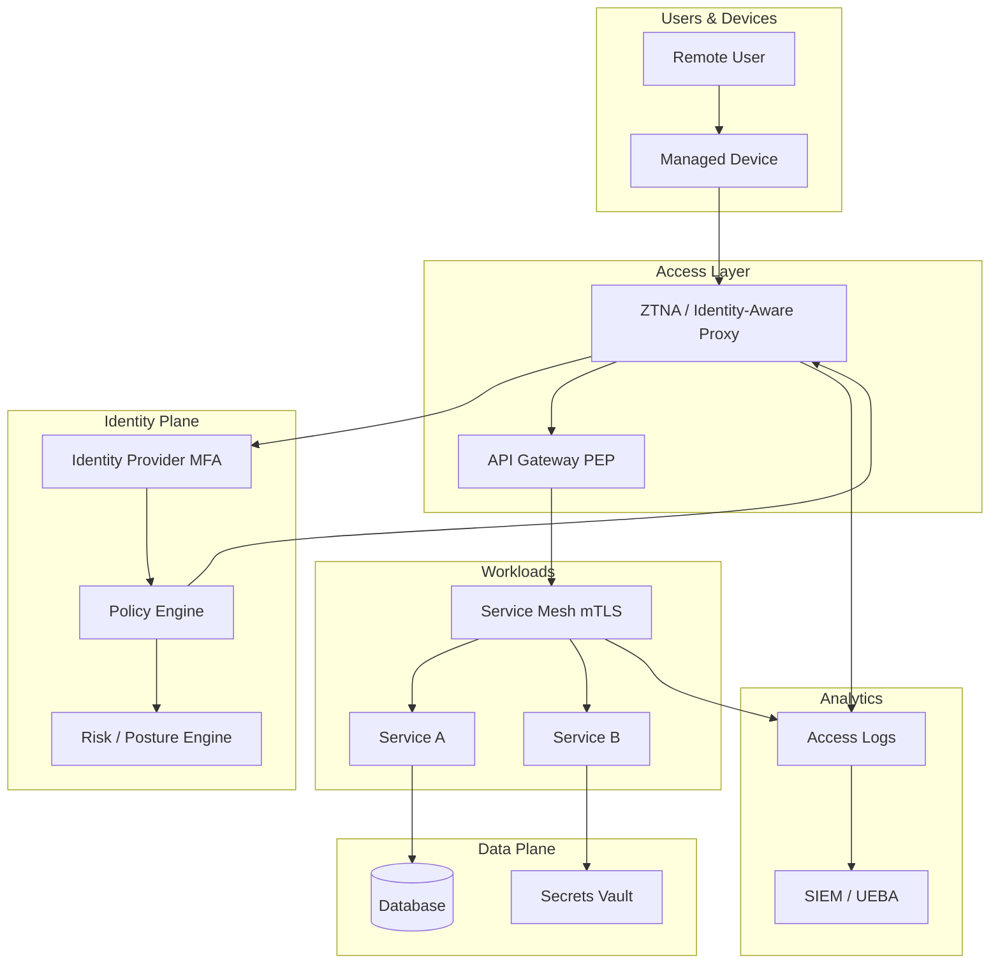
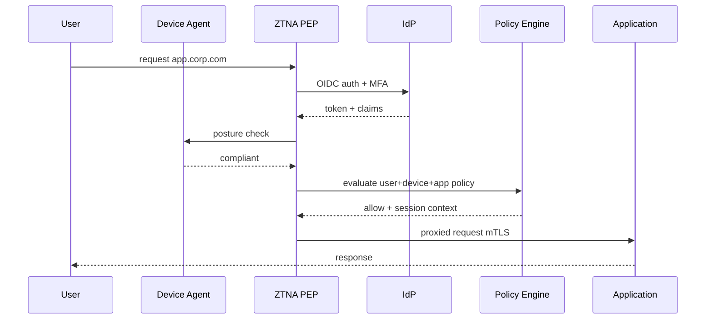
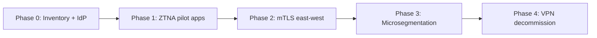

# Zero Trust Architecture

## 1. Executive Summary

**Zero trust architecture (ZTA)** is a security model that eliminates implicit trust based on network location—"inside the corporate VPN"—and instead requires **continuous verification** of identity, device posture, and authorization for every access request. The mantra **"never trust, always verify"** means every transaction is authenticated, authorized, encrypted, and logged regardless of whether it originates from headquarters, a coffee shop, or a compromised subnet.

NIST SP 800-207 defines zero trust as a **cybersecurity paradigm** combining identity-centric access, microsegmentation, policy enforcement points, and analytics—not a single product. Principal architects implement zero trust through [Identity Platform](/docs/system-design/identity-platform) integration, **mTLS** service mesh, **ZTNA** (Zero Trust Network Access) replacing flat VPN, **least-privilege** IAM, and **continuous risk assessment**.

This chapter designs a reference zero-trust posture for a hybrid cloud organization: 8K workloads, remote workforce, multi-cloud SaaS—mapping to NIST logical components without claiming any vendor delivers "zero trust in a box."

## 2. Why This Topic Matters

Perimeter security failed in practice:

- **VPN compromise** grants lateral movement across flat networks.
- **Insider threats** and stolen credentials bypass castle-and-moat models.
- **Cloud migration** dissolves traditional network boundaries.
- **Regulators and customers** increasingly expect zero-trust-aligned controls.

Principal interviews test mTLS vs VPN, policy enforcement points, device trust signals, and phased migration—not buzzword slides. Follow-ups on break-glass access and developer experience separate architects who understand tradeoffs from checkbox compliance.

## 3. Problems Being Solved

| Problem | Zero trust approach |
|---------|---------------------|
| **Flat internal network** | Microsegmentation; default deny |
| **Implicit LAN trust** | Authenticate every request |
| **Stolen credentials** | MFA, short-lived tokens, risk scoring |
| **Unmanaged devices** | Posture checks before access |
| **Shadow IT access** | ZTNA with app catalog |
| **Lateral movement** | Service-level authZ; east-west mTLS |
| **Audit gaps** | Log every access decision |
| **VPN scalability** | Identity-aware proxy per application |

## 4. Assumptions and System Model

### NIST SP 800-207 logical components

| Component | Role |
|-----------|------|
| **Policy Engine (PE)** | Makes access decision |
| **Policy Administrator (PA)** | Establishes communication path |
| **Policy Enforcement Point (PEP)** | Allows/denies/monitors request |

### Deployment assumptions

- Every user and workload has strong identity.
- All traffic encrypted in transit (TLS 1.2+; mTLS internal).
- Devices report posture where applicable (MDM, EDR signals).
- Legacy apps may require phased strangler migration.
- Zero trust is **journey**, not weekend cutover.

| Assumption | Implication |
|------------|-------------|
| **Identity is perimeter** | Invest in IdP and workload identity |
| **Network still matters** | Segmentation limits blast radius |
| **UX affects adoption** | Seamless SSO + device trust |
| **Legacy exists** | Exception ADRs with compensating controls |
| **Monitoring is control** | SIEM analytics on access logs |

## 5. Essential Terminology

| Term | Definition |
|------|------------|
| **ZTA** | Zero Trust Architecture |
| **ZTNA** | Zero Trust Network Access—app-level access |
| **PEP** | Policy Enforcement Point |
| **mTLS** | Mutual TLS—both sides present certificates |
| **Microsegmentation** | Fine-grained network/policy isolation |
| **Device posture** | Health signals (patch level, encryption) |
| **BeyondCorp** | Google's zero-trust implementation model |
| **Least privilege** | Minimum access required for task |
| **East-west traffic** | Service-to-service internal traffic |
| **North-south traffic** | Client-to-service edge traffic |
| **Continuous authorization** | Re-evaluate risk during session |
| **Implicit trust zone** | Legacy pattern zero trust removes |

## 6. Core Mechanism

### 6.1 Zero trust reference architecture



*Figure 1: Zero trust—identity and policy at edge; mTLS east-west; continuous logging to analytics.*

### 6.2 Access decision flow



*Figure 2: Every access request evaluated—no VPN implicit trust.*

### 6.3 Migration phases



*Figure 3: Phased migration—multi-year realistic timeline for enterprises.*

### 6.4 Deep dives

**VPN vs ZTNA:**

| Aspect | VPN | ZTNA |
|--------|-----|------|
| Trust model | Network admission | Per-application |
| Blast radius | Broad LAN access | Least privilege |
| Visibility | Limited per-app | Per-session logs |
| Legacy apps | Often easier | May need app connector |

**Service mesh as PEP:**

- Sidecar or eBPF dataplane enforces mTLS and authorization policies.
- SPIFFE identities in certificates—see [Service Mesh and Sidecars](/docs/microservices/service-mesh-and-sidecars).
- Authorization policies: `payments` may call `ledger`; not `marketing`.

**Device posture signals (examples):**

- Disk encryption enabled.
- OS patch within N days.
- EDR agent running.
- Jailbreak/root detection for mobile.

**Break-glass:**

- Documented emergency access with extra logging.
- Time-bound; not permanent VPN backdoor.

## 7. Step-by-Step Walkthrough

### 7.1 Employee accesses internal admin tool

1. User on laptop opens `admin.corp.com`—no VPN connected.
2. ZTNA redirects to IdP; WebAuthn MFA completes.
3. Device agent reports compliant posture.
4. Policy allows `admin` role + compliant device.
5. Session proxied to admin service over mTLS; logged to SIEM.

### 7.2 Service-to-service call

1. Order service calls payment service with SPIFFE cert.
2. Mesh PEP verifies cert and authorization policy.
3. Payment validates JWT audience from gateway layer.
4. No trust based on source IP in `10.0.0.0/8`.

### 7.3 Compromised credential attempt

1. Attacker has password; no MFA device.
2. IdP blocks; risk engine elevates account lockout.
3. SIEM alert correlates geo anomaly.
4. Session not established—zero trust contains blast.

### 7.4 Legacy app during migration

1. Mainframe app cannot support OIDC.
2. Exception ADR: app connector in DMZ; network ACL; session recording.
3. Sunset date 12 months; tracked in governance dashboard.

### 7.5 Contractor zero-trust onboarding

1. Contractor hired for 90-day integration project.
2. JIT identity: scoped app list in ZTNA; no full employee app catalog.
3. Auto-expire access day 91; manager renewal requires ticket.
4. Session recorded for admin paths; device posture relaxed but network segmented.
5. **Principal:** zero trust enables least privilege for non-employee identities—not binary allow/deny.

## 7A. Control Mapping Starter

| Zero trust capability | SOC2 CC reference (illustrative) |
|-----------------------|----------------------------------|
| MFA on all users | CC6.1 logical access |
| Per-app ZTNA | CC6.3 network restrictions |
| mTLS east-west | CC6.7 transmission |
| SIEM access logs | CC7.2 monitoring |

Verify mapping with compliance team—architecture supports evidence, does not replace audit.

## 8. Invariants and Guarantees

| Property | Type | Mechanism |
|----------|------|-----------|
| **Default deny** | Safety | Explicit policy grants |
| **Encryption in transit** | Safety | TLS/mTLS everywhere |
| **Authenticated identity** | Safety | No anonymous internal |
| **Authorization per request** | Safety | PEP evaluation |
| **Audit trail** | Safety | Immutable access logs |
| **Session establishment** | Liveness | IdP HA; cached policies |

## 9. Failure Scenarios

| Scenario | Mitigation |
|----------|------------|
| IdP outage | Cached session; read-only degrade policy |
| Policy engine slow | Local PEP cache; timeout deny |
| mTLS cert expiry | Auto-rotation; alert 30d prior |
| Posture false negative | Appeal process; graded access |
| Mesh misconfiguration | Canary policies; CI validation |
| Break-glass abuse | SIEM alerting; quarterly review |
| Developer local dev friction | Dev environment exception with segmentation |
| ZTNA single point of failure | Multi-region PEP deployment |

## 10. Performance Characteristics

```
ZTNA adds ~20-50ms latency vs direct (varies by vendor/topology)
mTLS handshake: session resumption critical at scale
Policy evaluation: target &lt;10ms p99 with local cache
IdP auth: dominated by MFA user interaction
Mesh overhead: ~1-3ms per hop (implementation dependent)
SIEM ingestion: async; don't block access path
```

## 11. Scalability Limits

| Limit | Mitigation |
|-------|------------|
| IdP auth RPS | Regional replicas; rate limit brute force |
| Mesh control plane | Shard by cluster |
| Policy complexity | Policy as code review; modular bundles |
| Certificate volume | Short-lived certs; automated rotation |
| Legacy app connectors | Pool connectors; capacity plan |
| VPN stragglers | Migration metrics; executive sponsorship |

## 12. Operational Considerations

- Zero-trust program office with cross-functional steering.
- Monthly migration dashboard: % apps on ZTNA, % mTLS coverage.
- Runbooks: IdP failover, cert rotation failure, policy rollback.
- Game day: IdP down; verify degrade mode documented.
- Developer experience feedback loop—friction kills adoption.

## 13. Security Considerations

- Zero trust complements—not replaces—secure SDLC, secrets management, data encryption at rest.
- Supply chain: verify device agents and mesh binaries.
- Admin paths are highest risk—strongest MFA and PAM.
- Integrate [Secrets Management Platform](/docs/system-design/secrets-management-platform) for signing keys.
- Threat model: stolen device with valid session—continuous re-auth for sensitive actions.

## 14. Cost Considerations

ZTNA and mesh licensing plus engineering migration effort. VPN decommission saves appliance cost. Reduced breach risk is primary ROI—quantify for executives with risk register. Phased approach spreads spend across fiscal years.

## 15. Production Implementations

| Model | Reference |
|-------|-----------|
| **Google BeyondCorp** | Identity-aware access pioneer |
| **Microsoft Zero Trust** | Entra ID + Defender integration |
| **Zscaler / Cloudflare ZTNA** | SSE vendors |
| **Istio/Linkerd mTLS** | East-west enforcement |
| **AWS Verified Access** | Cloud-native ZTNA pattern |

## 16. Alternatives and Tradeoffs

| Decision | Tradeoff |
|----------|----------|
| ZTNA vs VPN extended | Security vs migration pain |
| Mesh vs library mTLS | Uniformity vs overhead |
| Device posture strict vs lenient | Security vs remote worker friction |
| Continuous re-auth vs session length | UX vs risk |
| Build vs buy ZTNA | Control vs time-to-value |
| Network microsegmentation vs identity-only | Defense depth vs complexity |

## 17. Common Misconceptions

| Misconception | Reality |
|---------------|---------|
| "Zero trust = no network security" | Segmentation still valuable |
| "Buy one product, done" | Architecture spans IdP, PEP, analytics |
| "Internal traffic is safe" | East-west is major attack path |
| "VPN plus MFA = zero trust" | Per-app authorization missing |
| "Impossible for legacy" | Phased exceptions with sunset |
| "Developers will revolt" | Golden path DX investment required |

## 18. Principal Architect Perspective

- **Zero trust is strategy**, not SKU—map to NIST components.
- **Identity platform is foundation**—sequence before mesh mandate.
- **Measure coverage**—% workloads with mTLS, apps on ZTNA.
- **Developer experience is security**—bad DX drives bypass tunnels.
- **Break-glass is necessary evil**—audit aggressively.
- Influence adoption via [Influencing Without Authority](/docs/architecture-leadership/influencing-without-authority).

## 19. Architecture Review Exercise

**Scenario:** "We have zero trust—we deployed Okta and require MFA on VPN."

**Review:** Still flat network post-VPN; no per-service authZ; no east-west mTLS. Propose phased ZTNA pilot and mesh on critical payment path.

## 20. Whiteboard Explanation

"We assume breach—no trust by network location. Every user authenticates with MFA via our identity platform; device posture must be compliant for sensitive apps. ZTNA proxies per-application access with policy engine decisions logged to SIEM. East-west traffic uses service mesh mTLS with SPIFFE identities and authorization policies. Secrets never in env vars—vault dynamic creds. VPN phases out as apps migrate. Legacy gets time-bound exceptions with compensating controls. Default deny everywhere."

## 21. Interview Questions

1. **Define zero trust vs VPN.** — *Signals:* per-request verify, microsegmentation. *Red flags:* MFA on VPN only.
2. **NIST ZTA components?** — *Signals:* PE, PA, PEP. *Follow-up:* mapping to products.
3. **mTLS east-west why?** — *Signals:* lateral movement, identity. *Red flags:* IP trust.
4. **ZTNA access flow?** — *Signals:* IdP, posture, policy.
5. **Device posture examples?** — *Signals:* encryption, patch, EDR.
6. **Phase migration plan?** — *Signals:* inventory, pilot, mesh, VPN sunset.
7. **Break-glass design?** — *Signals:* time-bound, audited. *Red flags:* permanent VPN.
8. **Mesh vs ZTNA boundary?** — *Signals:* user vs service traffic.
9. **Legacy app exception?** — *Signals:* ADR, compensating controls, sunset.
10. **Zero trust metrics?** — *Signals:* coverage %, not buzzword checklist.
11. **IdP outage degrade?** — *Signals:* cached session policy. *Red flags:* open access.
12. **Developer local dev friction?** — *Signals:* dev PEP, documented exceptions.

## 22. Interview Follow-Ups

1. **Contractor needs temporary access.** — JIT provisioning; auto-expire; scoped apps.
2. **Acquisition different IdP.** — Federation bridge; convergence roadmap.
3. **Performance complaint from mesh.** — Profile hot paths; optional bypass with policy for specific low-risk internal reads—document tradeoff.

## 23. Strong Answer Example

**Q:** How migrate 500 apps from VPN to zero trust?

**Outline:** Phase 0: inventory apps, owners, sensitivity. Strengthen IdP MFA and device MDM. Phase 1: ZTNA pilot 10 SaaS and internal web apps—measure latency and support tickets. Phase 2: service mesh on payment and PII paths with mTLS. Phase 3: expand ZTNA 50 apps/quarter; network microsegments for legacy. Phase 4: VPN read-only then decommission. Executive OKR on coverage %. Exception ADR for apps that can't migrate with sunset dates.

## 24. Weak Answer Example

**Weak:** "Zero trust means we block all external access and use firewall rules."

**Red flags:** Perimeter thinking, no identity, no internal segmentation, misunderstands paradigm.

## 25. Hands-On Exercise

1. Map NIST PE/PA/PEP to your org's tools (table).
2. Draw east-west mTLS policy for 3 microservices.
3. Write exception ADR for legacy app with compensating controls.
4. Define 5 device posture rules and graded access outcomes.
5. **Extension:** ZTNA pilot success metrics dashboard mock.
6. **Extension:** Threat model STRIDE for stolen laptop scenario.

## 26. Knowledge Check

1. Zero trust core principle?
2. PEP role?
3. ZTNA vs VPN difference?
4. East-west vs north-south?
5. mTLS purpose internal?
6. BeyondCorp association?
7. Device posture signal examples?
8. Default deny meaning?
9. Break-glass requirements?
10. Phased migration first step?
11. SPIFFE in zero trust context?
12. SIEM role in ZTA?

## 26A. Extended Knowledge Check

13. What is policy administrator vs policy engine in NIST model?
14. When is network microsegmentation still required with ZTNA?
15. How measure VPN decommission progress credibly?
16. Developer dev-environment exception risks?
17. Break-glass quarterly review participants?
18. How does mTLS relate to zero trust vs replace it?

Principal architects clarify in every review: zero trust is an **identity-centric access model**; mTLS is one enforcement mechanism for east-west traffic—not a synonym for the full program.

## 27. Flashcards

| Front | Back |
|-------|------|
| Zero trust | Never trust always verify |
| ZTNA | App-level zero trust access |
| PEP | Policy enforcement point |
| mTLS | Mutual certificate authentication |
| Microsegmentation | Fine-grained isolation |
| Device posture | Endpoint health signals |
| East-west | Service-to-service traffic |
| BeyondCorp | Google ZTA model |
| Least privilege | Minimum necessary access |
| Implicit trust | Legacy LAN assumption removed |
| Policy Engine | Makes access decisions |
| Continuous auth | Re-evaluate risk in session |

## 28. Cheat Sheet

```
PRINCIPLE: verify every request—no location trust
COMPONENTS: Policy Engine, Administrator, Enforcement Point (NIST)
USER PATH: ZTNA → IdP MFA → posture → policy → app
SERVICE PATH: mesh mTLS + SPIFFE + authZ policy
MIGRATE: inventory → ZTNA pilot → east-west mTLS → segment → VPN sunset
LEGACY: exception ADR + compensating controls + sunset
METRICS: % ZTNA apps, % mTLS workloads, VPN traffic down
INTEGRATE: identity platform, secrets vault, SIEM analytics
AVOID: VPN+MFA = done, single product, neglect developer UX
```

## 28A. Principal Interview Deep Dive

### NIST component mapping exercise

| NIST logical component | Example implementation |
|------------------------|------------------------|
| Policy Engine | OPA, vendor ZTNA policy service |
| Policy Administrator | ZTNA controller establishing sessions |
| Policy Enforcement Point | ZTNA proxy, API gateway, mesh sidecar |
| Identity Manager | Corporate IdP (Okta, Entra) |
| Device Manager | MDM (Intune, Jamf) |
| SIEM | Splunk, Sentinel analytics |

Interviewers ask mapping—not product names alone. Principal explains **which function** each product serves.

### Coverage metrics executive dashboard

| Metric | Target (example) |
|--------|------------------|
| % workforce apps on ZTNA | 90% by EOY |
| % east-west traffic mTLS | 80% critical paths |
| VPN traffic as % total access | &lt;10% and declining |
| Mean time to revoke access | &lt;15 min |
| Break-glass uses per quarter | &lt;5 with review |

Targets set with risk team—not arbitrary 100% day one.

### Developer experience patterns

| Friction | Zero-trust compatible fix |
|----------|----------------------------|
| Local service calls | Dev mesh or signed dev certs |
| CI pipeline access | OIDC federation short-lived tokens |
| Database admin | JIT bastion through ZTNA with recording |
| Third-party contractor | Scoped app list; auto-expire |

DX failures drive VPN circumvention tunnels—security and platform teams co-own developer golden path.

### STRIDE on stolen laptop scenario

| Threat | Mitigation |
|--------|------------|
| Spoofing | MFA + device binding |
| Tampering | Disk encryption; remote wipe |
| Repudiation | Session logging |
| Information disclosure | ZTNA per-app; no full tunnel |
| Denial of service | Account lockout policies |
| Elevation | No standing admin; PAM JIT |

Demonstrates threat modeling integration—not checkbox "we have ZTNA."

### Compliance mapping note

SOC2 CC6 (logical access), ISO 27001 A.8, PCI DSS network segmentation requirements—zero trust **supports** evidence collection but does not automatically satisfy audits. Principal coordinates with compliance on control narrative.

## 29. Related Concepts

- [Security Architecture Fundamentals](/docs/security/security-architecture-fundamentals)
- [Identity Platform](/docs/system-design/identity-platform)
- [Secrets Management Platform](/docs/system-design/secrets-management-platform)
- [Service Mesh and Sidecars](/docs/microservices/service-mesh-and-sidecars)
- [HTTP, TLS, and QUIC](/docs/networking/http-tls-and-quic)
- [API Platform](/docs/system-design/api-platform)
- [Architecture Governance](/docs/architecture-leadership/architecture-governance)

## 19A. Extended Review Scenario

**Scenario B:** Security mandates full device posture for all apps; remote contractors in emerging markets fail compliance and cannot work.

**Review:** Graded access—low sensitivity apps with basic auth; high sensitivity requires full posture. Contractor-specific policy with virtual desktop option. Measure business impact of blanket policy. Zero trust is risk-based, not one-size-fits-all deny. ADR documents exception with compensating monitoring.

## 23A. Additional Strong Answer

**Q:** How phase out VPN without locking out legacy apps?

**Outline:** Inventory apps with VPN-only access. Categorize: (A) can move to ZTNA in 90 days, (B) needs app connector, (C) requires network extension temporarily. Parallel run VPN and ZTNA 6 months with usage metrics. Communicate VPN sunset per wave. Legacy group C gets microsegmented network extension with session recording—not indefinite VPN. Executive dashboard shows VPN traffic declining monthly. Celebrate wave completions—change management is adoption.

## 28B. Extended BOE Walkthrough (Interview Script)

**Interviewer:** "Migrate 500-person company from VPN to zero trust."

**Strong candidate:**

"Multi-year program—not weekend cutover.

Phase 0: inventory apps, sensitivity, owners; strengthen IdP MFA and MDM posture.

Phase 1: ZTNA pilot 10 high-value internal web apps—measure latency and support tickets.

Phase 2: [Identity Platform](/docs/system-design/identity-platform) integration; per-app policies; SIEM logging all decisions.

Phase 3: service mesh mTLS on payment and PII paths—SPIFFE identities.

Phase 4: expand ZTNA 50 apps per quarter; microsegment legacy.

Phase 5: VPN read-only → decommission when &lt;10% traffic.

Legacy exceptions: ADR with compensating controls and sunset—app connector in DMZ.

Metrics exec dashboard: ZTNA coverage %, mTLS %, VPN traffic down, break-glass uses reviewed quarterly.

Developer golden path for local dev—friction drives VPN circumvention tunnels."

## 30. References

- NIST SP 800-207 — Zero Trust Architecture (formal definition).
- NIST SP 800-207A — ZTA for cloud (companion).
- Google BeyondCorp papers — implementation experience (primary source blog/paper).
- Forrester Zero Trust eXtended model — market framework (analyst).
- CISA Zero Trust Maturity Model — federal guidance (implementation guide).

**Distinction:** NIST defines logical architecture; vendor products implement subsets; maturity timelines are organizational not technical constants.

### 30A. Further reading paths

Read NIST SP 800-207 executive summary and map one initiative from [Technical Strategy and Roadmaps](/docs/architecture-leadership/technical-strategy-and-roadmaps) to zero-trust coverage metrics. Pair with [Service Mesh and Sidecars](/docs/microservices/service-mesh-and-sidecars) for east-west mTLS implementation and [Identity Platform](/docs/system-design/identity-platform) as prerequisite.

**Exercise:** Create 18-month ZTNA migration checklist for 50 apps with pilot, expansion, and VPN decommission gates. **Interview drill:** explain to a developer why VPN + MFA is insufficient—use concrete lateral movement scenario and how ZTNA + mesh contain blast radius without insulting their current setup.
