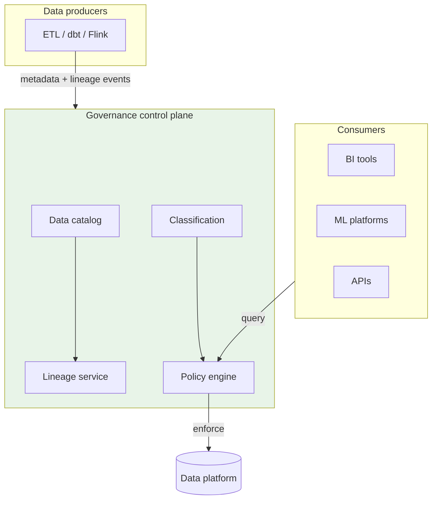
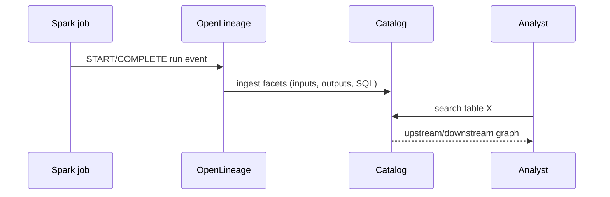
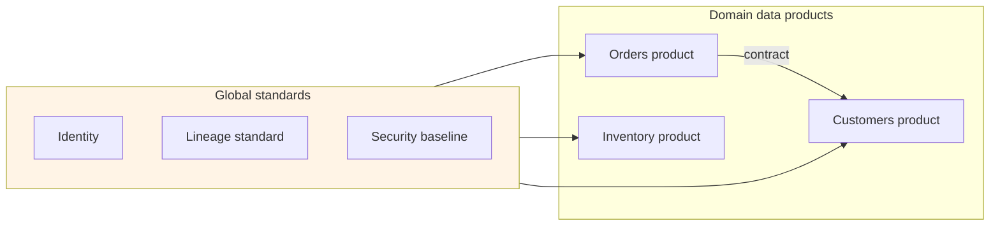

# Data Governance and Lineage

## 1. Executive Summary

**Data governance** defines who can access what data, under which policies, with auditable accountability. **Data lineage** traces how data flows from sources through transformations to consumption—enabling impact analysis, debugging, and regulatory evidence. Together they form the **control plane** of modern data platforms, without which lakehouses devolve into unsearchable swamps that fail GDPR, SOX, and internal risk reviews.

Principal architects implement governance through **data catalogs** (Collibra, Alation, DataHub, Unity Catalog), **policy engines** (attribute-based access control, row/column masks), **classification** (PII, PCI, confidential), and **lineage standards** (OpenLineage, Apache Atlas). The shift from centralized IT gatekeeping to **federated data mesh** governance does not eliminate policies—it distributes ownership while enforcing global interoperability standards.

This chapter explains mechanisms, guarantees, failure modes, and how to defend governance architecture in principal interviews—where panels ask how you would trace a bad metric to its source or prove deletion compliance.

## 2. Why This Topic Matters

Regulatory fines, executive dashboards with wrong numbers, and breach incidents all trace to weak governance. Interview scenarios include:

- **Impact analysis:** upstream table schema change—who breaks?
- **Right to erasure:** delete user data across 40 pipelines.
- **PII discovery:** find all tables containing email addresses.
- **Mesh vs central:** how domain teams ship fast without chaos.
- **Lineage accuracy:** automatic vs manual; trust boundaries.

"We'll add governance later" is a principal-level red flag—retrofit costs exceed proactive design.

## 3. Problems Being Solved

| Problem | Governance/lineage approach |
|---------|----------------------------|
| **Unknown data locations** | Central catalog with search and ownership |
| **Unauthorized access** | RBAC/ABAC, column masks, row filters |
| **Regulatory audit** | Lineage graphs + access logs |
| **Breaking schema changes** | Impact analysis from lineage |
| **Data quality distrust** | Certified datasets, SLA metadata |
| **Siloed domain knowledge** | Data products with contracts |

### Workload fit matrix

| Capability | Catalog | Lineage | Policy engine |
|------------|---------|---------|---------------|
| Analyst discovery | ✓ | | |
| Compliance audit | ✓ | ✓ | ✓ |
| Incident root cause | | ✓ | |
| Access enforcement | | | ✓ |
| Cost chargeback | ✓ | | |

## 4. Assumptions and System Model

| Assumption | Implication |
|------------|-------------|
| **Every asset has an owner** | Steward accountable for quality and access |
| **Engines emit lineage** | Spark/Flink/dbt integrations required |
| **Policies enforced at query time** | Not just documentation |
| **Classification is ongoing** | New columns may introduce PII |
| **Mesh domains publish contracts** | Breaking changes are versioned |

**Safety:** Deny-by-default access; policy changes propagate. **Liveness:** Catalog staleness does not block queries but degrades trust—sync jobs required.

## 5. Essential Terminology

| Term | Definition |
|------|------------|
| **Data catalog** | Searchable inventory of datasets and metadata |
| **Lineage** | Directed graph of data dependencies |
| **Data steward** | Role accountable for domain data quality |
| **ABAC** | Attribute-based access control |
| **Column mask** | Dynamic redaction (e.g., hash email) |
| **Row filter** | Predicate limiting visible rows per role |
| **OpenLineage** | Open standard for lineage event emission |
| **Data contract** | Schema, SLA, and semantic guarantees |
| **Data product** | Owned, documented, consumable dataset |
| **Certification** | Human/automated approval for production use |

## 6. Core Mechanism

### 6.1 Governance stack



*Figure 1: Producers emit metadata; policy engine enforces at query boundary; catalog indexes for discovery.*

### 6.2 Lineage capture flow



*Figure 2: Job completion emits standardized lineage; catalog materializes graph for impact analysis.*

### 6.3 Federated governance (data mesh)



*Figure 3: Domains own products; global plane enforces interoperability—not a single team bottleneck.*

## 7. Step-by-Step Walkthrough

### Walkthrough A: Onboard new gold table

1. Engineer creates dbt model `gold.daily_revenue`.
2. dbt emits lineage to OpenLineage → DataHub ingestion.
3. Steward assigns owner, classification `internal`, SLA freshness 6h.
4. Policy: finance role full access; engineering masked on `customer_email` if joined.
5. Certification workflow: data quality tests pass → marked production-ready.

### Walkthrough B: Schema change impact analysis

1. Analyst plans to drop column `legacy_sku` from silver table.
2. Catalog lineage shows 12 downstream models and 3 Looker explores.
3. Impact report generated; owners notified via ticketing integration.
4. Coordinated migration: version contract v2, deprecate v1 with sunset date.

### Walkthrough C: GDPR erasure request

1. Request received for `user_id=U123`.
2. Lineage identifies all tables storing PII for users.
3. Orchestrated deletion: operational DB, lake bronze/silver/gold partitions, search indexes.
4. Audit log records actions; verification query confirms absence.

### Walkthrough D: Incident—metric mismatch

1. CEO dashboard revenue off by 8% vs finance ledger.
2. Lineage walk: `gold.revenue` ← `silver.orders` ← `bronze.payments`.
3. Discover bronze duplicate ingest on 2025-07-01 partition.
4. Fix pipeline; backfill silver/gold; postmortem updates data contract test.

### Walkthrough E: Data contract CI gate

1. dbt model `gold.monthly_active_users` declares contract: schema, `not_null` on `user_id`, freshness &lt; 6h.
2. CI runs `dbt test` + OpenLineage emit on merge to main.
3. Breaking change (rename column) fails CI; developer bumps contract version.
4. Downstream consumers pinned to `contract_v2` in catalog; migration ticket auto-created.
5. Architecture board reviews exceptions for emergency hotfixes with retroactive contract update.

### Walkthrough F: Cross-border data residency

1. EU customer data tagged `region=EU` at bronze ingest.
2. Policy engine blocks replication jobs targeting US-only buckets for EU-tagged assets.
3. Lineage graph proves EU gold tables sourced only from EU bronze paths.
4. Auditor samples queries; row filters enforced in Trino and Snowflake from same policy service.
5. Annual control test documented with evidence package from catalog exports.

### Data mesh governance operating model

| Role | Responsibility |
|------|----------------|
| **Domain data product owner** | Schema, SLA, quality, access requests |
| **Platform team** | Catalog, lineage infra, policy engine |
| **Enterprise architect** | Global standards, interoperability |
| **Security** | Classification standards, access reviews |
| **Legal/compliance** | Retention, erasure, regulatory mapping |

Mesh succeeds when domains own outcomes but cannot opt out of global identity, lineage, and security baselines.

## 8. Invariants and Guarantees

| Property | Governance guarantee |
|----------|---------------------|
| **Least privilege** | Default deny; grants explicit |
| **Auditability** | Access and policy changes logged |
| **Lineage completeness** | Best-effort; gaps must be documented |
| **Policy consistency** | Same rules across supported engines |
| **Ownership** | Every production asset has steward |

Lineage is **not** a formal proof of data correctness—it documents dependencies, not semantic equivalence.

## 9. Failure Scenarios

| Failure | Behavior | Mitigation |
|---------|----------|------------|
| **Stale catalog** | Wrong ownership, missing tables | Automated sync; CI registration |
| **Incomplete lineage** | Blind impact analysis | Mandate emitter on all prod jobs |
| **Policy bypass** | Direct S3 access | Bucket policies + network controls |
| **Over-classification** | Blocks legitimate use | Tiered classification review |
| **Manual lineage drift** | Docs lie | Prefer automated extraction |
| **Cross-region replication** | Policy not replicated | Global policy sync |
| **Mesh contract violation** | Silent breaking changes | Contract CI gates |

## 10. Performance Characteristics

| Dimension | Behavior |
|-----------|----------|
| Catalog search | Milliseconds–seconds at enterprise scale |
| Lineage graph traversal | Depends on graph size; pre-index |
| Policy evaluation | Per-query overhead; cache decisions |
| Metadata ingestion | Async; lag minutes acceptable |
| Full platform scan (PII) | Hours; schedule off-peak |

## 11. Scalability Limits

- **Lineage graph size**—millions of edges need graph DB or partitioned storage.
- **Fine-grained column policies**—complexity grows with table width.
- **Manual stewardship**—does not scale; automate certification where possible.
- **Multi-cloud catalogs**—federation complexity.

## 12. Operational Considerations

- **Onboarding checklist**: register asset, owner, classification, lineage emitter, tests.
- **Quarterly access reviews** for sensitive datasets.
- **Lineage coverage KPI**: % prod jobs emitting OpenLineage.
- **Break-glass procedures** for emergency access with audit.
- **Deprecation policy** for tables and contract versions.
- Integrate catalog with **incident management** and **Slack** ownership lookup.
- **Publish governance scorecard** monthly: lineage coverage by tier, open access review items, contract violations blocked in CI.
- **Data literacy program** for domain engineers: 2-hour workshop on catalog registration and contract basics.
- **Escalation path** when domain bypasses platform: architecture review board within 5 business days.

## 13. Security Considerations

- **Separation of duties**: stewards cannot unilaterally grant own access.
- **Encrypt** catalog credentials and lineage payloads with secrets.
- **Tamper-evident audit logs** for compliance.
- **Data minimization**: collect only necessary metadata in lineage facets.
- **Zero-trust** to data plane: authenticate every query path.

## 14. Cost Considerations

- **Commercial catalog licenses** per user or asset.
- **Engineering** to instrument pipelines—amortize via templates.
- **Incident cost** of weak governance exceeds tool spend.
- **Storage** for lineage history—retention policies.

### Stewardship cadence and RACI

Effective governance requires recurring rituals, not one-time catalog deployment. A practical enterprise cadence: **weekly** stale-asset review (tables without queries in 90 days), **monthly** access certification for PII datasets, **quarterly** lineage coverage audit, and **annual** retention policy alignment with legal. RACI should name a single **accountable** steward per gold table—multiple co-owners create diffusion of responsibility that fails audits.

### Lineage gap remediation playbook

When automated lineage coverage falls below target (e.g., 80%): (1) inventory prod jobs without OpenLineage emitter; (2) prioritize financial and PII paths first; (3) add scheduler listener middleware—lowest effort highest coverage; (4) for legacy SQL clients, enable query log ingestion to infer edges with confidence scores; (5) mark low-confidence edges visually in catalog UI. Principal architects report **coverage by risk tier**, not vanity global percentage.

### Business glossary linkage

Technical metadata alone fails business users. Link `gold.monthly_revenue` to glossary term **Net Revenue (GAAP)** with definition owner from finance. Discrepancies between BI metric names and glossary trigger data quality incidents. This semantic layer is governance—not optional documentation—for principal-level data mesh implementations.

## 15. Production Implementations

### Case study: Enterprise catalog rollout (illustrative)

#### Business context

10,000 tables across lake and warehouse; SOX audit finding on untracked critical reports.

#### Architecture

DataHub with OpenLineage from Airflow, Spark, dbt. Unity Catalog enforces row filters on warehouse. Collibra for business glossary linkage.

#### Metrics

Lineage coverage 85% in 6 months; mean time to impact analysis dropped from days to hours.

#### Extended operations narrative

Year-two audit required demonstrating **erasure within 72 hours** for departed EU employees. Lineage graph identified 47 downstream tables; automated playbook deleted bronze partitions and issued MERGE tombstones in silver/gold. Two manual gaps—ad hoc Excel exports on shared drives—surfaced from interview process, not lineage. Remediation: block unregistered exports via DLP. Stewardship council instituted **risk-tiered coverage SLAs**: 100% lineage on tier-1 financial paths, 80% global acceptable. Principal lesson: governance metrics must tie to **regulatory paths**, not aggregate percentages.

#### Tradeoffs

| Choice | Tradeoff |
|--------|----------|
| DataHub OSS | Custom ops vs vendor SaaS |
| Automated lineage only | Gaps on ad hoc SQL |
| Central stewards per domain | Federated accountability |

## 16. Alternatives and Tradeoffs

| Approach | Pros | Cons |
|----------|------|------|
| **Central IT governance** | Consistency | Bottleneck |
| **Data mesh federated** | Domain speed | Requires discipline |
| **Docs-only** | Cheap | Fails audit |
| **Warehouse-native governance** | Tight integration | Multi-engine gaps |

## 17. Common Misconceptions

| Misconception | Reality |
|---------------|---------|
| "Lineage = data quality" | Dependency map only |
| "Catalog is optional search" | Must drive policies and ops |
| "Mesh means no central rules" | Interoperability standards remain |
| "PII scan once is enough" | Continuous classification |
| "IAM on bucket is sufficient" | Column-level needs engine support |

## 18. Principal Architect Perspective

1. **Governance in day-one architecture**, not phase 3.
2. **Automate lineage** from schedulers and transformation frameworks.
3. **Data contracts** with CI breaking-change detection.
4. **Measure coverage**—uninstrumented jobs are liabilities.
5. **Align legal, security, and data platform** on erasure playbooks.

Governance programs fail when treated as compliance checkbox work. The principal architect's job is to make **correct data easier than bypassing the catalog**—embed registration in CI, enforce query-time policy, and measure coverage on regulatory paths—not vanity global percentages. Present **risk-tiered scorecards** to leadership monthly, not one-time catalog launch announcements.

### Operating playbook (first 90 days)

**Days 1–30:** Stand up catalog with mandatory fields: owner, classification, environment. Block CI deploy of new gold tables without catalog registration.

**Days 31–60:** Enable OpenLineage on orchestrator and dbt; publish lineage coverage KPI by risk tier. Run first quarterly access review on PII-tagged assets.

**Days 61–90:** Launch data contract CI for top ten gold tables. Conduct tabletop exercise: GDPR erasure request using lineage graph—measure hours to complete.

Governance succeeds when **platform enforces** standards domains cannot bypass via direct bucket access.

## 19. Architecture Review Exercise

**Scenario:** Domains publish tables to shared bucket with no catalog registration; access via shared service account.

**Findings:** No lineage, no least privilege, audit failure. Mandate: per-domain SA, catalog registration gate in CI, OpenLineage emitter.

## 20. Whiteboard Explanation

"Governance answers who owns data, who can read it, and whether it's trustworthy. A catalog indexes tables with business and technical metadata. Lineage captures job runs—what inputs produced what outputs—via OpenLineage events from Spark or dbt. When an analyst changes a column, impact analysis walks the graph downstream. Policy engines apply row filters and column masks at query time in Trino or Unity Catalog, not just documented in Confluence. In a data mesh, each domain ships data products with contracts, but global standards for identity, lineage, and security still apply."

**Principal addendum:** Emphasize **enforcement vs documentation**. Auditors ask for proof of access control, not wiki pages. Lineage without automated emitters is vanity metrics. Mesh without contracts is just rebranded silos.

## 21. Interview Questions

1. **Data governance vs data management?** — Policies/accountability vs technical execution.
2. **Lineage use cases?** — Impact analysis, debugging, compliance.
3. **OpenLineage purpose?** — Standard lineage event format.
4. **Row vs column security?** — Predicate filter vs mask/hash.
5. **Data mesh governance?** — Federated ownership + global standards.
6. **Certified dataset meaning?** — Quality-tested, approved for production.
7. **GDPR erasure challenge?** — Find all copies via lineage + ops DBs.
8. **ABAC example?** — Region=EU → deny US analyst.
9. **Catalog staleness risk?** — Wrong decisions on outdated metadata.
10. **Manual vs auto lineage?** — Auto scales; manual drifts.
11. **Data contract contents?** — Schema, SLA, semantics, versioning.
12. **Break-glass access?** — Emergency grant with audit trail.
13. **PII discovery methods?** — Sampling, regex, ML classifiers.
14. **SOX relevance?** — Change control and access audit on financial data.

### Scoring rubric (principal)

| Dimension | Strong | Weak |
|-----------|--------|------|
| Lineage | OpenLineage, impact analysis | "We have a wiki" |
| Enforcement | Query-time policy | Bucket IAM only |
| Mesh | Contracts + federation | "No central team" |
| Compliance | Erasure playbook | Hand-wave GDPR |

### Extended scoring notes

**Principal bar:** Describes enforcement at query time with catalog integration. Explains mesh as federated ownership with global standards—not anarchy. **Weak hire:** Conflates lineage with data quality guarantees.

15. **Data catalog vs data lake?** — Metadata index vs storage.
16. **Column mask vs encryption?** — Dynamic redaction vs at-rest crypto.
17. **Contract CI failure workflow?** — Block deploy; notify consumers.

## 22. Interview Follow-Ups

1. **Design erasure for user in lakehouse.** — Lineage scan, partition deletes, compaction, verify.
2. **80% lineage coverage—good enough?** — Risk-based; 100% on critical financial paths.
3. **Domain breaks contract—response?** — Versioning, consumer notification, CI blocks.
4. **Multi-engine policy consistency.** — Central policy service or catalog-native enforcement.
5. **Cost justify DataHub vs spreadsheet.** — Audit incident MTTR and access review labor.

### Additional principal scenarios

**Scenario:** Domain refuses catalog registration citing velocity. **Answer:** Non-negotiable for production gold assets—offer lightweight registration API in CI under 5 minutes. Sandbox exempt with auto-expiry.

**Scenario:** Legal requests proof no US employee accessed EU-only dataset. **Answer:** Export audit logs filtered by `resource_id` and `actor_region`; demonstrate ABAC policy in policy engine version deployed at query time.

**Scenario:** Catalog shows 95% lineage coverage but finance still cannot trace metric. **Answer:** Coverage metric is vanity—trace specific `gold.revenue` path; fix gaps on that critical path first; report risk-tier coverage not global percent.

## 23. Strong Answer Example

**Question:** "How would you trace impact of changing a column in a shared dimension table?"

**Strong outline:** "I'd query the data catalog's lineage graph for downstream dependencies—dbt models, Airflow DAGs, dashboards, and ML features. OpenLineage facets from production jobs give automated edges; I'd flag gaps where manual SQL consumers exist via query log analysis. Generate an impact report listing owners from catalog stewardship metadata. Coordinate a migration: ship dimension v2 with parallel run period, update consumers, deprecate v1 on contract sunset date. Run data quality tests comparing old vs new metrics during dual-write. Document in ADR and attach to change ticket for SOX if financial."

## 24. Weak Answer Example

**Weak:** "We'd email teams and check Confluence documentation for dependencies."

**Red flags:** No automated lineage; no ownership system; not scalable.

## 25. Hands-On Exercise

1. Deploy DataHub or Marquez locally; ingest sample OpenLineage JSON.
2. Register dbt project with lineage plugin.
3. Model row-access policy for two roles on sample dataset.
4. Simulate schema change; list downstream from graph API.
5. Draft data contract YAML for a sample gold table.

## 26. Knowledge Check

1. OpenLineage is? *(Lineage event standard.)*
2. Data steward role? *(Accountable owner.)*
3. Column mask example? *(Hash or null PII.)*
4. Lineage enables impact? *(Yes—dependency traversal.)*
5. ABAC uses? *(Attributes for decisions.)*
6. Data product in mesh? *(Owned consumable dataset.)*
7. Catalog without enforcement gap? *(Policy bypass via direct access.)*
8. Certification purpose? *(Trust signal for consumers.)*
9. Erasure needs? *(Lineage + orchestrated delete.)*
10. Contract versioning why? *(Non-breaking evolution.)*
11. Data mesh vs catalog? *(Org model vs technical inventory.)*
12. Break-glass purpose? *(Emergency audited access.)*
13. PII discovery ongoing why? *(New columns introduce risk.)*

## 27. Flashcards

| Front | Back |
|-------|------|
| Data catalog | Searchable metadata inventory |
| Data lineage | Dependency graph of data flows |
| OpenLineage | Open lineage event standard |
| Data steward | Accountable data owner |
| ABAC | Attribute-based access control |
| Column mask | Dynamic redaction at query time |
| Data contract | Schema + SLA + semantics |
| Data mesh | Federated domain-oriented architecture |
| PII classification | Sensitive data labeling |
| Impact analysis | Downstream effect of changes |

## 28. Cheat Sheet

```
GOVERNANCE STACK
  Catalog + lineage + policy + classification

LINEAGE
  OpenLineage from Spark/dbt/Airflow → graph DB

ENFORCEMENT
  Query-time row/column policies; deny direct bucket access

MESH
  Domain products + global standards + contracts

COMPLIANCE
  Audit logs, erasure playbooks, access reviews

PRINCIPAL ANCHORS
  Enforcement beats documentation
  Lineage coverage by risk tier
  Contracts with CI gates
  Steward single accountable owner
  Erasure is orchestrated workflow
  Mesh = federated + standards
  Break-glass audited
  Business glossary linked to gold
```

## 29. Related Concepts

- [Data Lakehouse Architecture](/docs/data-platforms/data-lakehouse-architecture) — governed storage layer
- [Security Architecture Fundamentals](/docs/security/security-architecture-fundamentals) — identity and access
- [Stream and Batch Processing](/docs/data-platforms/stream-and-batch-processing) — lineage emitters
- [Architecture Decision Records](/docs/architecture-leadership/architecture-decision-records) — governance decisions

## 30. References

### Primary sources

- Dehghani, Z. (2022). *Data Mesh* — federated governance principles.
- OpenLineage project documentation — event specification.
- NIST, GDPR official texts — compliance requirements (verify current).

### Related

- Apache Atlas, DataHub, Unity Catalog documentation — implementation choices.
- SOX IT general controls guidance — audit expectations.

### Principal study path

Pair this chapter with [Data Lakehouse Architecture](/docs/data-platforms/data-lakehouse-architecture) for storage governance, [Security Architecture Fundamentals](/docs/security/security-architecture-fundamentals) for access control patterns, [Stream and Batch Processing](/docs/data-platforms/stream-and-batch-processing) for lineage emitters, and [Architecture Decision Records](/docs/architecture-leadership/architecture-decision-records) for documenting policy tradeoffs. Interview panels often connect governance incidents to missing lineage on financial metrics. Review SOX control mappings annually with internal audit partners.

### Distinction

| Claim | Type |
|-------|------|
| OpenLineage schema | Formal spec |
| Mesh principles | Architectural framework |
| Tool-specific policy features | Vendor implementation |
