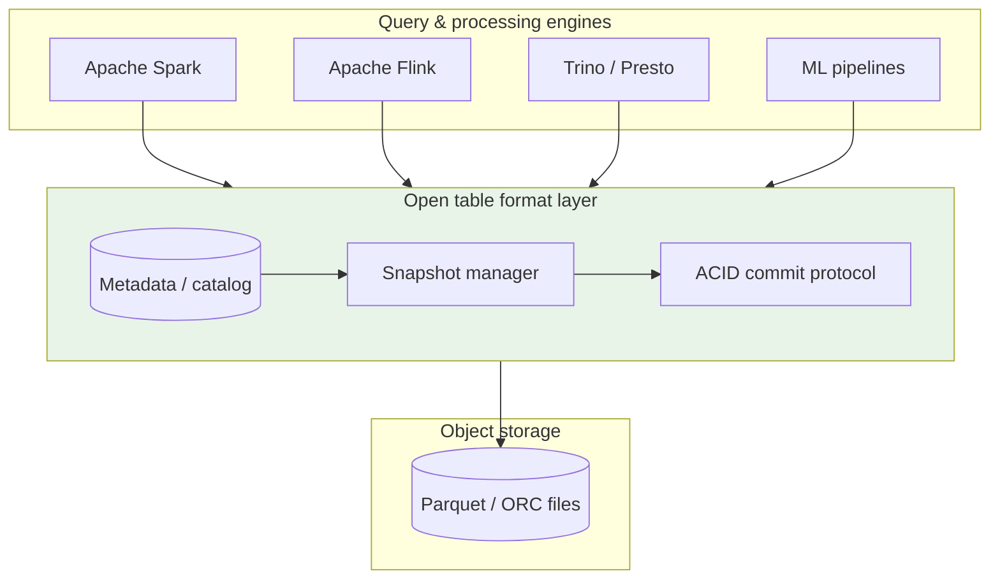
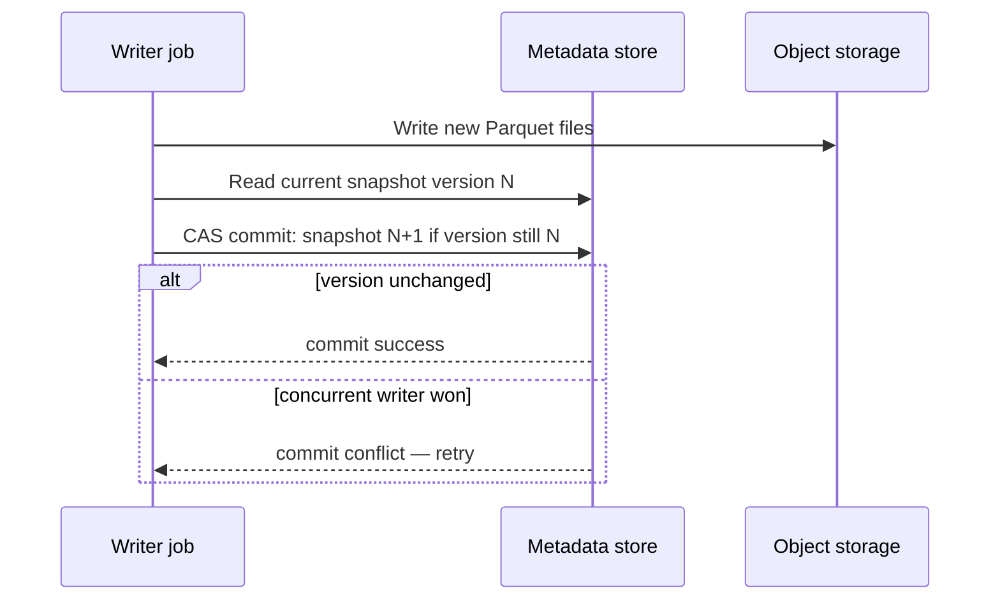
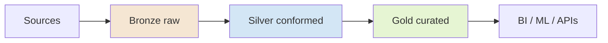

# Data Lakehouse Architecture

## 1. Executive Summary

A **data lakehouse** unifies the low-cost, schema-flexible storage of a **data lake** (object storage such as S3, GCS, or ADLS) with the **transactional semantics**, **schema enforcement**, and **performance optimizations** traditionally associated with a **data warehouse**. The architectural breakthrough is not a single product—it is the **open table format** layer (Apache Iceberg, Delta Lake, Apache Hudi) that sits above Parquet/ORC files and provides **ACID transactions**, **time travel**, **schema evolution**, and **concurrent writers** on commodity object storage.

The **medallion architecture** (bronze/silver/gold) is the dominant organizational pattern: raw ingestion (bronze), cleaned and conformed data (silver), and business-ready aggregates (gold). Lakehouses power modern analytics platforms at Netflix, Uber, Apple, and thousands of enterprises replacing siloed lake + warehouse stacks with a single governed platform.

For principal architects, the lakehouse decision is a **consistency, cost, and governance** tradeoff: you gain elasticity and open formats but inherit **compaction**, **metadata scaling**, **small-file problems**, and **multi-engine coordination** complexity that warehouses hide behind managed infrastructure.

## 2. Why This Topic Matters

Lakehouse architecture appears in principal interviews when organizations consolidate **Spark/Flink pipelines**, **BI tools**, and **ML feature stores** onto shared storage. Panels probe:

- **Open table formats**—how ACID works without a traditional database server.
- **Medallion vs data mesh**—organizational and technical boundaries.
- **Lake vs warehouse vs lakehouse**—when each wins.
- **Concurrency**—what happens when two Spark jobs commit simultaneously.
- **Governance**—row/column policies across engines (Trino, Spark, Snowflake external tables).

Misunderstanding lakehouses leads to "S3 with Parquet" designs that lack idempotent pipelines, explode metadata, or corrupt tables under concurrent writes.

## 3. Problems Being Solved

| Problem | Lakehouse approach |
|---------|-------------------|
| **Expensive proprietary warehouse storage** | Decouple compute; store in object storage |
| **Unreliable data lakes** | ACID + schema enforcement via table format |
| **Duplicate ETL to lake and warehouse** | Single source of truth with multiple query engines |
| **ML + analytics silos** | Shared tables for features and BI |
| **Time travel / audit** | Snapshot isolation per table format |
| **Schema drift** | Evolution rules in metadata layer |

### Workload fit matrix

| Workload | Fit | Caveat |
|----------|-----|--------|
| Batch analytics (TB–PB) | Strong | Compaction and partition design matter |
| Streaming ingestion | Strong | Requires streaming writers + idempotency |
| Low-latency OLTP | Weak | Not a replacement for operational databases |
| Ad hoc SQL (sub-second) | Moderate | Needs indexing, caching, or warehouse overlay |
| ML feature engineering | Strong | Point-in-time correctness requires discipline |
| Regulatory audit / replay | Strong | Time travel and lineage integration |

## 4. Assumptions and System Model

| Assumption | Implication |
|------------|-------------|
| **Object storage is durable and eventually consistent listing** | List-after-write visibility; retry semantics vary by cloud |
| **Compute is ephemeral** | Spark/Flink clusters scale independently of storage |
| **Table format provides atomic commit** | Single metadata pointer swap per commit |
| **Readers use consistent snapshot** | Snapshot isolation; no dirty reads of in-flight writes |
| **Network egress costs are non-trivial** | Co-locate compute with data region |

**Safety:** Committed snapshots are durable; readers never see partial multi-file writes after commit. **Liveness:** Writers may retry on commit conflicts; heavy compaction backlog can delay optimal read performance without blocking correctness.

## 5. Essential Terminology

| Term | Definition |
|------|------------|
| **Open table format** | Specification for table metadata, snapshots, and file layout (Iceberg, Delta, Hudi) |
| **Medallion architecture** | Bronze (raw) → silver (cleaned) → gold (curated) layering |
| **Snapshot** | Point-in-time consistent view of table files |
| **Compaction** | Merging small files into larger objects for scan efficiency |
| **Partition** | Logical subdivision (often by date/region) affecting pruning |
| **Manifest / metadata file** | Catalog of data files belonging to a snapshot |
| **COPY-ON-WRITE (COW)** | Updates rewrite data files (Iceberg default for many ops) |
| **MERGE-ON-READ (MOR)** | Updates logged separately; compacted later (Hudi MOR) |
| **Z-ordering** | Multi-dimensional clustering for scan pruning (Delta) |
| **Data skipping** | Min/max statistics in metadata to avoid reading irrelevant files |

## 6. Core Mechanism

### 6.1 Layered architecture



*Figure 1: Engines share a table format layer; object storage holds immutable data files; metadata atomically advances snapshots.*

### 6.2 Atomic commit (simplified)



*Figure 2: Compare-and-swap on metadata version ensures exactly one writer advances the table snapshot.*

### 6.3 Medallion pipeline



*Figure 3: Progressive refinement with increasing quality and decreasing schema variance toward consumption.*

### 6.4 Format comparison (implementation choices)

| Dimension | Apache Iceberg | Delta Lake | Apache Hudi |
|-----------|---------------|------------|-------------|
| **Originating ecosystem** | Netflix → Apache | Databricks | Uber → Apache |
| **Catalog integration** | REST, Hive, Glue, Nessie | Unity Catalog, Hive | Hive, Glue |
| **Row-level updates** | Merge (v2) | Merge | Upsert, MOR/COW |
| **Hidden partitioning** | Yes | Partition columns explicit | Yes (timeline) |
| **Engine breadth** | Spark, Flink, Trino, etc. | Spark-first; growing | Spark, Flink |

Verify current version features in official docs—formats evolve rapidly.

## 7. Step-by-Step Walkthrough

### Walkthrough A: Batch ingest to bronze

1. Landing zone receives JSON/CSV from Kafka or API dumps.
2. Spark job reads landing files, adds `_ingest_ts` and `_source` metadata columns.
3. Writer appends to `bronze.events` Iceberg table partitioned by `ingest_date`.
4. Commit succeeds; snapshot N+1 visible to readers.
5. Orchestrator (Airflow/Dagster) marks partition complete; moves landing files to archive.

### Walkthrough B: Silver transformation with deduplication

1. Silver job reads bronze snapshot at version V (idempotent re-run uses same V or later).
2. Applies schema validation, PII tokenization, dedup on `event_id`.
3. MERGE INTO silver table on primary key.
4. On commit conflict, job retries with exponential backoff.
5. Data quality checks assert row count bounds before promoting to gold consumers.

### Walkthrough C: Time-travel audit

1. Compliance requests state of `customers` table as of `2025-06-01T00:00:00Z`.
2. Analyst runs `SELECT ... FOR VERSION AS OF` or timestamp equivalent.
3. Engine resolves snapshot ID from metadata; scans only files in that snapshot.
4. Result exported to audit bucket with lineage ticket reference.

### Walkthrough D: Compaction after streaming micro-batches

1. Flink writes 5-minute micro-batches creating hundreds of small Parquet files.
2. Compaction job (OPTIMIZE in Delta, rewrite_data_files in Iceberg) merges files per partition.
3. Old files marked deleted in new snapshot; orphan cleanup policy runs separately.
4. BI queries see improved scan parallelism and reduced LIST operations.

### Walkthrough E: Iceberg vs Delta coexistence decision

1. Architecture review evaluates engine mix: Databricks-heavy teams lean Delta; multi-engine (Flink + Trino + Spark) lean Iceberg.
2. Proof-of-concept runs concurrent readers on same table format with representative queries.
3. Catalog choice finalized: Glue + Iceberg REST or Unity Catalog for Delta.
4. ADR documents format lock-in risk and migration escape hatch (export Parquet, re-register).
5. Platform team publishes golden path templates for bronze/silver/gold dbt models.

### Walkthrough F: Schema evolution without breaking consumers

1. Silver table adds nullable column `customer_tier` with default `unknown`.
2. Iceberg schema evolution commits; old snapshots retain old schema for time travel.
3. Gold dbt models updated in same release train; contract tests assert column presence.
4. BI semantic layer versioned; dashboards using old views continue until deprecation window ends.
5. Governance catalog marks schema version bump; lineage shows downstream impact count.

## 8. Invariants and Guarantees

| Property | Lakehouse guarantee |
|----------|---------------------|
| **Atomicity** | Snapshot commit is all-or-nothing |
| **Consistency** | Schema and partition specs enforced at write |
| **Isolation** | Snapshot isolation for readers |
| **Durability** | Committed files durable per object storage SLA |
| **Serializability of writes** | One winning writer per commit attempt; losers retry |

**Not guaranteed:** Sub-second interactive latency without additional indexing layers; cross-table transactional consistency (unless application-level or specialized catalogs).

## 9. Failure Scenarios

| Failure | Behavior | Mitigation |
|---------|----------|------------|
| **Concurrent write conflict** | Commit fails; job retries | Idempotent MERGE keys; partition serial writers |
| **Small file explosion** | Metadata bloat; slow queries | Scheduled compaction; target file size tuning |
| **Orphan files after failed commit** | Storage cost leak | Lifecycle rules + orphan file cleanup jobs |
| **Schema incompatibility** | Write rejected | Schema evolution policies; contract tests |
| **Catalog outage** | Cannot resolve table metadata | HA catalog; cached metastore |
| **Partition skew** | Hot partitions; straggler tasks | Salting; redesign partition keys |
| **Zombie snapshot retention** | Storage growth | Retention policies; expire_snapshots |

### Scenario narrative

A nightly and hourly job both MERGE into `silver.orders`. The hourly job commits first; nightly job's CAS fails at 03:00. Without retry logic, silver is stale until manual intervention. Production pipelines must treat commit conflicts as **expected**, not exceptional.

## 10. Performance Characteristics

| Dimension | Behavior |
|-----------|----------|
| **Scan throughput** | Scales with file parallelism; depends on file sizes |
| **Write latency** | Metadata commit + file upload; not OLTP-grade |
| **Metadata operations** | O(files in snapshot) for planning; manifests amortize |
| **Compaction cost** | Rewrite I/O; schedule off-peak |
| **Partition pruning** | Critical for petabyte tables |

Object storage LIST latency can dominate planning for tables with millions of files—compaction and partition design are performance architecture, not optional tuning.

## 11. Scalability Limits

- **Metadata file count** per table—billions of files require aggressive compaction and partitioning strategy.
- **Single partition hotspots** limit write parallelism.
- **Cross-region reads** incur egress and latency.
- **Concurrent writers** to same partition serialize at commit layer.
- **Catalog as control plane** can become bottleneck at extreme scale.

## 12. Operational Considerations

- Define **SLAs per medallion layer** (bronze freshness vs gold correctness).
- Automate **compaction**, **snapshot expiration**, and **orphan cleanup**.
- Monitor **files per partition**, **commit conflict rate**, **job duration variance**.
- Version-pin **table format** and **engine** combinations in production.
- Run **disaster recovery drills**: restore catalog + validate snapshot integrity.
- Document **partition evolution** procedure before changing keys on PB tables.
- Integrate **data quality** gates between silver and gold promotion.

## 13. Security Considerations

- **IAM policies** on bucket prefixes per environment (dev/staging/prod).
- **Column-level encryption** or tokenization before bronze when PII present.
- **Lake Formation / Unity Catalog / Ranger** for fine-grained access across engines.
- **Audit logs** on catalog access and sensitive table reads.
- **Network isolation**: private endpoints to object storage; no public buckets.

## 14. Cost Considerations

- **Storage**: cheap at rest; expensive when duplicated across snapshots without expiration.
- **Compute**: Spark/Flink cluster hours for ETL and compaction.
- **API costs**: LIST/GET requests during query planning.
- **Egress**: cross-AZ and cross-region data movement.
- **Hidden cost**: engineer time for file layout and incident response.

FinOps principle: **gold tables should be smaller and better partitioned** than bronze—if gold scans are petabyte-wide, the medallion failed its curation purpose.

## 15. Production Implementations

### Case study: Unified analytics platform (illustrative)

#### Business context

Retail enterprise runs separate Hadoop lake and cloud warehouse; duplicate pipelines, inconsistent metrics, $4M+ annual warehouse storage. Mandate: single metrics layer for BI and ML.

#### Scale

Illustrative: 20 PB object storage; 5,000 tables; 200 daily pipelines; 400 analysts.

#### Architecture overview

S3 + Apache Iceberg + Glue catalog + EMR Spark for ETL + Trino for ad hoc SQL + dbt for gold transformations. Bronze ingests from Kafka and SFTP. Silver enforces contracts. Gold exports to semantic layer (Looker/MetricFlow).

#### Partitioning

`event_date` + `region` for fact tables; dimension tables unpartitioned with periodic full refresh.

#### Consistency

Snapshot isolation; MERGE idempotency keys on `order_id`. No cross-table transactions—workflow orchestration ensures gold runs after silver SLA.

#### Failure handling

Airflow sensors on upstream freshness; commit conflict retries (3x); DLQ for poison bronze records.

#### Evolution

Phase 1: lift-and-shift warehouse exports to bronze. Phase 2: retire duplicate warehouse marts. Phase 3: ML features read gold directly.

#### Extended operations narrative

Six months post-launch, commit conflict rate spiked on `silver.orders` when hourly and nightly MERGE jobs overlapped. Platform team introduced **partition-level job locks** in Airflow and reduced conflicts 94%. Compaction backlog grew during Black Friday—dedicated `OPTIMIZE` warehouse slot added Tuesdays and Fridays. FinOps attributed $180k annual savings vs prior warehouse-only stack [illustrative—verify in your org]. Key lesson: lakehouse TCO includes **platform engineering headcount**, not just S3 storage lines.

#### Tradeoffs

| Choice | Tradeoff |
|--------|----------|
| Iceberg over Delta | Engine neutrality vs Databricks integration depth |
| Trino for ad hoc | Flexibility vs managed warehouse performance |
| Daily gold only | Cost vs near-real-time dashboards |

#### Interview lessons

Articulate **why** lakehouse vs warehouse; quantify compaction and metadata ops; governance across engines.

### Platform team operating model

Lakehouse platforms require dedicated **data platform engineering**—not a one-time migration project. Standing responsibilities include: table format upgrades, compaction SLOs, catalog hygiene, cost attribution per domain, and on-call for failed commits during peak ETL. Principal architects staffing this function should plan 1 platform engineer per 50–100 active pipelines as a rough order-of-magnitude [org-dependent, not a universal benchmark].

### Anti-patterns observed in production

| Anti-pattern | Symptom | Remediation |
|--------------|---------|-------------|
| Bronze overload | 90% storage in raw JSON | Aggressive silver promotion |
| No snapshot expiry | Storage bill 3× expected | `expire_snapshots` policy |
| Shared write partition | Commit conflict storms | Partition ownership |
| BI on bronze | Schema chaos | Enforce gold-only BI access |
| Manual compaction | Weekly fire drills | Scheduled OPTIMIZE jobs |

## 16. Alternatives and Tradeoffs

| Approach | When to choose |
|----------|----------------|
| **Traditional warehouse** (Snowflake, BigQuery) | Managed performance, less file ops burden |
| **Raw data lake only** | Exploratory science; weak governance tolerance |
| **Lakehouse** | Open formats, multi-engine, cost at scale |
| **Data mesh** | Organizational decentralization; can use lakehouse per domain |
| **HTAP database** | Operational analytics on transactional data |

## 17. Common Misconceptions

| Misconception | Reality |
|---------------|---------|
| "Parquet on S3 is a lakehouse" | Missing ACID metadata and governance |
| "Lakehouse replaces warehouse always" | Many teams run hybrid with warehouse serving layer |
| "One big table is fine" | Partitioning and file layout determine viability |
| "ACID means cross-table transactions" | Typically single-table snapshot atomicity |
| "Compaction is optional" | Required for sustained performance |

## 18. Principal Architect Perspective

1. **Pick table format** based on engine ecosystem and catalog strategy—not hype.
2. **Invest in medallion contracts** early; bronze permissive, gold strict.
3. **Treat compaction as production workload** with SLOs, not ad hoc scripts.
4. **Plan governance** before 500 tables, not after.
5. **Measure cost per curated GB** in gold—not just storage totals.

## 19. Architecture Review Exercise

**Scenario:** Team proposes 1-minute micro-batches to gold fact table with 50 columns, no compaction, shared partition `ingest_date` only.

**Findings:** Small-file death spiral; hot partition; BI scans degrade within weeks. Recommend: silver buffering, hourly compaction, composite partition (`date`, `hour`), aggregate before gold.

## 20. Whiteboard Explanation

"Data lands in object storage as Parquet files, but files alone aren't a database. An open table format maintains a metadata layer—manifests listing files, schemas, partitions, and snapshots. When a Spark job writes, it uploads new files then atomically swaps the metadata pointer from snapshot N to N+1 using compare-and-swap, so readers always see a consistent snapshot. Bronze keeps raw data; silver cleans and deduplicates; gold serves BI and ML. Multiple engines—Spark, Flink, Trino—read the same tables if they support the format. The hard parts are compaction, concurrent write retries, and governance across engines—not the diagram."

**Principal addendum:** When asked "lakehouse vs warehouse," draw cost axes: storage $/TB, compute elasticity, and ops headcount. Warehouse wins on **time-to-first-query** for undifferentiated SQL; lakehouse wins on **petabyte economics** and **ML co-location**. Hybrid is common—do not force binary choice in enterprise landscapes.

## 21. Interview Questions

1. **What is a lakehouse?** — Lake storage + warehouse-like ACID and schema via table formats.
2. **How does ACID work on S3?** — Atomic metadata commit; immutable data files.
3. **Bronze vs silver vs gold?** — Progressive refinement and trust levels.
4. **Iceberg vs Delta vs Hudi?** — Ecosystem, merge semantics, catalog—tradeoffs.
5. **What is snapshot isolation?** — Readers pin a snapshot version.
6. **Why compaction?** — Reduce small files and metadata overhead.
7. **Concurrent write failure mode?** — Commit conflict; retry required.
8. **Lake vs warehouse cost model?** — Decoupled storage/compute vs integrated unit.
9. **Time travel use cases?** — Audit, rollback, reproducible ML training.
10. **When not lakehouse?** — Low-latency OLTP, tiny datasets, team lacks Spark ops.
11. **Partition skew symptoms?** — Single task dominates; uneven file counts.
12. **Data mesh relationship?** — Complementary; mesh is organizational, lakehouse is technical.
13. **Exactly-once ingestion?** — Idempotent writes + deterministic keys + format commits.
14. **Governance challenge?** — Same policy across heterogeneous query engines.

### Scoring rubric (principal)

| Dimension | Strong | Weak |
|-----------|--------|------|
| ACID mechanism | Metadata CAS, immutable files | "S3 is transactional" |
| Operations | Compaction, conflicts, orphans | Ignores file layout |
| Tradeoffs | Hybrid warehouse scenarios | "Lakehouse replaces all" |
| Governance | Catalog, lineage, PII | Bucket IAM only |

## 22. Interview Follow-Ups

1. **Design medallion for clickstream at 1M events/sec.** — Kafka → Flink bronze; micro-batch silver; agg gold; compaction schedule.
2. **Two teams write same Iceberg table—safe?** — Possible with retry; better partition ownership or serial writes per partition.
3. **Recover from bad gold deploy.** — Time travel to prior snapshot; rollback workflow.
4. **Cost of keeping 90 days snapshots?** — Storage multiplication; expire_snapshots policy.
5. **BI needs sub-5s queries on 500 TB.** — Materialized aggregates, indexing (Iceberg deletes vectors), or warehouse sync.

## 23. Strong Answer Example

**Question:** "How does a lakehouse provide ACID on object storage?"

**Strong outline:** "Object storage provides durable PUT of immutable objects but not multi-file atomicity. The table format stores a metadata tree—typically a snapshot JSON or Avro manifest listing data files, partition stats, and schema. A writer first uploads all new Parquet files, then attempts an atomic metadata commit by compare-and-swap on the current snapshot pointer in a catalog or metastore. If another writer committed concurrently, CAS fails and the job retries with a fresh read of metadata. Readers always resolve a single snapshot ID and never see partial file sets from in-flight writes. Isolation is snapshot-based: long-running reads pin their snapshot while writers advance the head. This gives ACID at the table level without a traditional database server, at the cost of application-level handling of commit conflicts and operational need for compaction."

## 24. Weak Answer Example

**Weak:** "We store Parquet on S3 and use Spark, so we have a lakehouse with ACID because Spark supports transactions."

**Red flags:** No table format; no metadata commit; ignores concurrent writers and small files.

## 25. Hands-On Exercise

1. Create local MinIO or cloud bucket; write Iceberg or Delta table with Spark.
2. Run two concurrent append jobs; observe commit conflict behavior.
3. Query `history` or snapshots; run time-travel SELECT.
4. Generate small files; run compaction; compare query plan file counts.
5. Sketch medallion DAG for a sample ecommerce dataset.

## 26. Knowledge Check

1. Atomic commit mechanism? *(Metadata CAS / snapshot swap.)*
2. Medallion middle layer? *(Silver—cleaned/conformed.)*
3. Reader isolation model? *(Snapshot isolation.)*
4. Small file problem cause? *(High-frequency small writes.)*
5. Open formats named? *(Iceberg, Delta, Hudi.)*
6. Bronze layer purpose? *(Raw ingest preservation.)*
7. Time travel enables? *(Audit and rollback.)*
8. MERGE use case? *(Upserts and deduplication.)*
9. Catalog role? *(Table metadata resolution.)*
10. Lakehouse weak for? *(OLTP low-latency writes.)*

## 27. Flashcards

| Front | Back |
|-------|------|
| Lakehouse | Lake storage + warehouse semantics via table formats |
| Open table format | Metadata spec for ACID on object files |
| Medallion | Bronze → silver → gold layering |
| Snapshot | Point-in-time consistent table view |
| Compaction | Merge small files for scan efficiency |
| CAS commit | Compare-and-swap metadata for atomicity |
| Iceberg | Netflix-originated open table format |
| Delta Lake | Databricks-originated table format |
| Time travel | Query historical snapshots |
| Partition pruning | Skip files via partition metadata |

## 28. Cheat Sheet

```
LAKEHOUSE STACK
  Engines (Spark/Flink/Trino) → Table format → Parquet on object storage

ACID ON S3
  Write files → CAS metadata snapshot → readers pin version

MEDALLION
  Bronze: raw | Silver: clean | Gold: curated

OPS MUST-HAVES
  Compaction, snapshot expiry, orphan cleanup, commit retry

WHEN NOT
  OLTP, tiny data, no ops maturity

PRINCIPAL ANCHORS
  Format choice = engine + catalog lock-in
  Compaction is production SLO work
  Medallion contracts between layers
  Governance enforces across engines
  Time travel ≠ free storage
  Commit conflicts are normal at scale
  FinOps: gold smaller than bronze
  Hybrid warehouse+lake common at enterprise scale
```

## 29. Related Concepts

- [Storage Engine Fundamentals](/docs/storage-engines/storage-engine-fundamentals) — files, indexes, and durability primitives
- [ACID and Isolation](/docs/transactions/acid-and-isolation) — transactional semantics
- [Event-Driven Architecture](/docs/messaging-and-streaming/event-driven-architecture) — streaming ingest to bronze
- [Stream and Batch Processing](/docs/data-platforms/stream-and-batch-processing) — pipeline execution models
- [Data Governance and Lineage](/docs/data-platforms/data-governance-and-lineage) — catalog and policy layers
- [Apache Iceberg specification](https://iceberg.apache.org/docs/latest/) — primary format reference

## 30. References

### Primary sources

- Armbrust, M., et al. (2021). *Lakehouse: A New Generation of Open Platforms that Unify Data Warehousing and Advanced Analytics.* CIDR.
- Apache Iceberg, Delta Lake, Apache Hudi official documentation — format semantics and guarantees.

### Related systems

- Databricks Lakehouse documentation — medallion and Delta implementation choices.
- Netflix Iceberg engineering blogs — production scale lessons.

### Distinction

| Claim type | Source |
|------------|--------|
| Snapshot isolation semantics | Format specifications |
| Medallion pattern | Databricks/industry practice—organizational convention |
| Performance numbers | Workload-specific; do not generalize |
