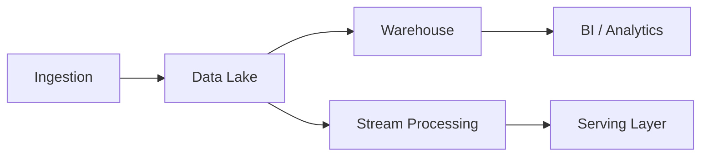

# Data Platforms

Lakehouse, ETL/ELT, Spark, Flink, Iceberg, and data governance.

*Figure: Lakehouse architecture — batch and stream paths to analytics.*

## Chapters

| Chapter | Focus |
|---------|-------|
| Data Lakehouse Architecture | [Data Lakehouse Architecture](/docs/data-platforms/data-lakehouse-architecture) |
| Stream and Batch Processing | [Stream and Batch Processing](/docs/data-platforms/stream-and-batch-processing) |
| Data Governance and Lineage | [Data Governance and Lineage](/docs/data-platforms/data-governance-and-lineage) |

## Learning Path

1. Start with **Data Lakehouse Architecture** for storage layers and query engines.
2. Study **Stream and Batch Processing** for Lambda/Kappa patterns and exactly-once semantics.
3. Finish with **Data Governance and Lineage** for cataloging, compliance, and impact analysis.

## Related Domains

- [Distributed Databases](/docs/distributed-databases/overview)
- [Messaging and Streaming](/docs/messaging-and-streaming/overview)

Return to the [Curriculum Overview](/docs/start-here/curriculum-overview) to see how this domain fits the learning path.
