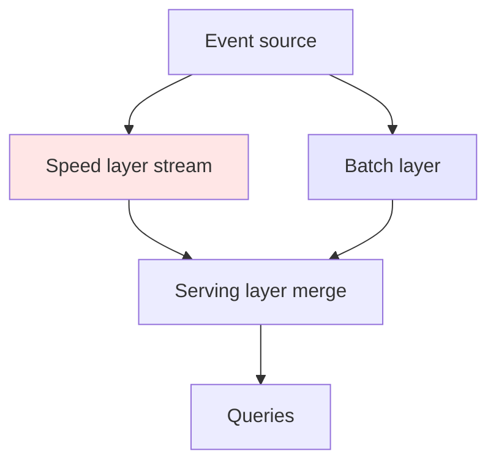
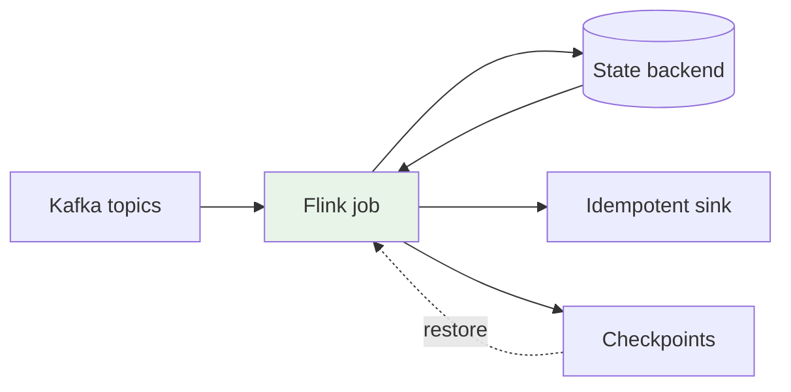
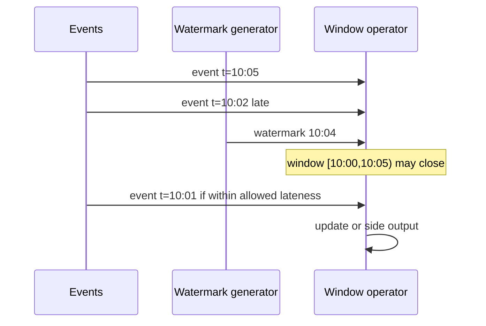

# Stream and Batch Processing

## 1. Executive Summary

**Stream processing** continuously transforms unbounded event streams with low latency; **batch processing** applies transformations to bounded datasets with high throughput and simpler fault tolerance. Modern data platforms rarely choose one exclusively—they implement **unified engines** (Apache Flink, Spark Structured Streaming) that expose similar APIs for both, while architectural patterns (**Lambda**, **Kappa**) describe how organizations combine speed and correctness layers.

Principal architects must reason about **event time vs processing time**, **watermarks** and **late data**, **delivery semantics** (at-most-once, at-least-once, exactly-once), and **state management** at scale. The interview-critical insight: **exactly-once end-to-end** requires cooperation between the processor, message broker, and sink—not a single checkbox in Flink configuration.

This chapter covers mechanisms, guarantees, failure modes, and production patterns for batch and stream pipelines powering analytics, fraud detection, and real-time features.

## 2. Why This Topic Matters

Every principal data architecture interview touches processing semantics:

- **When stream vs batch?** — Latency SLO, cost, correctness requirements.
- **How handle late events?** — Watermarks, allowed lateness, retractions.
- **Exactly-once reality** — Idempotent sinks, transactional commits, Kafka offsets.
- **Lambda vs Kappa** — Operational burden vs simplicity.
- **Backpressure** — What happens when sink slows.

Teams that confuse **processing-time windows** with **event-time windows** ship dashboards that drift from financial truth after outages or clock skew.

## 3. Problems Being Solved

| Problem | Processing approach |
|---------|---------------------|
| **Daily reports on TB datasets** | Batch (Spark, Hive, SQL warehouse) |
| **Real-time fraud scoring** | Stream (Flink, Kafka Streams) |
| **Near-real-time metrics** | Micro-batch or stream with short windows |
| **Reprocessing history** | Batch replay or Kappa re-read from log |
| **Correct aggregations under disorder** | Event-time + watermarks |
| **Joining streams to reference data** | Broadcast state, temporal joins, lookup tables |

### Workload fit matrix

| Workload | Batch | Stream | Hybrid |
|----------|-------|--------|--------|
| Monthly regulatory report | ✓ | | |
| 200 ms fraud alert | | ✓ | |
| 5-minute sales dashboard | | ✓ | micro-batch OK |
| ML training on full history | ✓ | | |
| Sessionization | | ✓ | |
| Nightly dimension sync | ✓ | | stream CDC optional |

## 4. Assumptions and System Model

| Assumption | Implication |
|------------|-------------|
| **Events are immutable facts** | Corrections via compensating events or retractions |
| **Clocks are not synchronized** | Use event timestamps, not `now()` at processor |
| **Brokers retain logs** | Replay enables recovery and Kappa reprocessing |
| **State fits or spills** | RocksDB/state backend sizing for Flink |
| **Sinks may not be transactional** | End-to-end exactly-once needs idempotent design |

**Safety:** Correct aggregations within declared lateness bounds. **Liveness:** Progress requires consumer groups advancing; stuck watermarks block window closes.

## 5. Essential Terminology

| Term | Definition |
|------|------------|
| **Event time** | Timestamp embedded in event payload |
| **Processing time** | Wall clock when processor observes event |
| **Watermark** | Lower bound on unseen event times in stream |
| **Window** | Bounded slice for aggregation (tumbling, sliding, session) |
| **Allowed lateness** | Grace period after watermark for late events |
| **Checkpoint** | Flink periodic consistent snapshot of state + offsets |
| **Micro-batch** | Spark Streaming divides stream into small batch jobs |
| **Side output** | Route late or invalid records to separate stream |
| **Retraction** | Update prior emission when late data changes result |
| **Changelog stream** | Table represented as insert/update/delete events |

## 6. Core Mechanism

### 6.1 Lambda architecture (historical pattern)



*Figure 1: Lambda maintains separate speed (approximate) and batch (correct) paths merged at query time—high operational cost.*

### 6.2 Unified stream processing



*Figure 2: Single engine with durable log, checkpointed state, and transactional or idempotent sink.*

### 6.3 Event-time windows and watermarks



*Figure 3: Watermark advances with observed event times; late events handled per allowed lateness policy.*

## 7. Step-by-Step Walkthrough

### Walkthrough A: Spark batch ETL

1. Airflow triggers nightly Spark job reading partitioned Parquet in lake.
2. Transformations: join dimensions, aggregate daily revenue per region.
3. Output written to gold table with partition `report_date`.
4. Job commits table snapshot; downstream BI refreshes semantic layer.
5. Failure mid-write: rerun job; idempotent overwrite on partition.

### Walkthrough B: Flink event-time aggregation

1. Job consumes `payments` topic with event timestamp `payment_ts`.
2. Assign watermarks: `max_event_time - 5 seconds` bounded out-of-orderness.
3. Tumbling 1-minute windows count transactions per merchant.
4. Checkpoint every 60s to S3; Kafka offsets stored in checkpoint.
5. Sink writes upserts to JDBC with primary key `(merchant_id, window_end)`.

### Walkthrough C: End-to-end exactly-once (conceptual)

1. Flink uses Kafka transactional producer per checkpoint epoch.
2. Two-phase commit sink (e.g., JDBC XA or Iceberg commit) participates in checkpoint.
3. On failure, restart from last completed checkpoint; uncommitted epoch aborted.
4. **Safety:** no duplicate visible records. **Cost:** latency tied to checkpoint interval.

### Walkthrough D: Kappa reprocessing

1. Bug in aggregation logic discovered; fix deployed.
2. Reset consumer offset to `T0` or deploy new application version reading compacted topic from beginning.
3. Rebuild materialized view from immutable log—batch layer unnecessary.
4. Requires sufficient Kafka retention or tiered storage archive.

### Walkthrough E: Flink SQL over Kafka with upsert sink

1. `CREATE TABLE orders` with Kafka source and upsert-kafka sink to compacted topic.
2. Changelog semantics: `+I`, `-U`, `+U` row kinds from CDC source.
3. Primary key defined on `order_id`; state backend stores latest row per key.
4. Checkpoint aligns Kafka consumer offset with sink transactional write.
5. Downstream batch job reads compacted topic as silver input—unified log contract.

### Walkthrough F: Backpressure during Black Friday spike

1. Traffic 8× baseline; Flink operator `busyTimeMsPerSecond` hits ceiling.
2. Kafka consumer lag grows; autoscaler adds task managers (if configured).
3. Gateway applies admission control on non-critical stream consumers.
4. Batch reconciliation job runs hourly comparing stream aggregates to warehouse truth.
5. Post-event review tunes parallelism, checkpoint interval, and max lag SLO.

### Engine selection matrix (principal decision aid)

| Criterion | Prefer Flink | Prefer Spark |
|-----------|-------------|--------------|
| Sub-second event-time windows | ✓ | |
| Nightly 50 TB batch | | ✓ |
| Complex CEP patterns | ✓ | |
| Team skill: SQL batch only | | ✓ |
| Exactly-once to Iceberg sink | ✓ (connector maturity varies) | ✓ |
| ML feature batch + stream unity | | ✓ (Structured Streaming) |

Document the choice in an ADR; revisit when latency SLO tightens or team skills shift.

## 8. Invariants and Guarantees

| Semantic | Guarantee |
|----------|-----------|
| **At-most-once** | No duplicates; may lose messages |
| **At-least-once** | No loss; duplicates possible without dedup |
| **Exactly-once (processor)** | Checkpoint aligns state and source offsets |
| **Exactly-once (end-to-end)** | Requires transactional/idempotent sink |

**Window correctness:** Holds only if event timestamps trustworthy and lateness policy matches business rules.

## 9. Failure Scenarios

| Failure | Behavior | Mitigation |
|---------|----------|------------|
| **Task manager crash** | Restart from checkpoint | HA Kafka; adequate checkpoint storage |
| **Checkpoint timeout** | Backpressure; lag grows | Scale parallelism; tune interval |
| **Watermark stuck** | Windows never close | Idle source watermark; processing-time fallback |
| **State backend corruption** | Job cannot restore | Remote checkpoints; backup strategy |
| **Sink partial write** | Duplicates on retry | Idempotent keys; transactional sink |
| **Skewed key** | Hot task bottleneck | Key salting; custom partitioner |
| **Broker outage** | Consumer pause | Multi-AZ cluster; mirror topics |

### Scenario narrative

During network partition, Flink job falls behind; watermarks lag real time. Dashboard shows stale 1-minute counts while batch nightly job still correct. Operations must define **which layer is source of truth** per metric and alert on stream lag separately from batch SLA.

## 10. Performance Characteristics

| Dimension | Batch | Stream |
|-----------|-------|--------|
| Latency | Minutes–hours | Sub-second to minutes |
| Throughput | Very high per dollar | High with tuning |
| Fault tolerance | Recompute partition | Checkpoint restore |
| State access | Shuffle joins costly | Local keyed state fast |
| Operational complexity | Lower | Higher (watermarks, state) |

Micro-batch (Spark) trades latency for simpler fault model—often 100ms–seconds, not true sub-100ms.

## 11. Scalability Limits

- **Keyed state size** per operator—must fit RocksDB + memory or use external store.
- **Kafka partition count** bounds consumer parallelism.
- **Shuffle-heavy joins** on infinite streams require careful state TTL.
- **Checkpoint duration** must stay << interval at scale.
- **Global windows** without bounds—unbounded state; prohibited pattern.

## 12. Operational Considerations

- Monitor **consumer lag**, **checkpoint duration**, **backpressure ratio**, **late event rate**.
- Version **savepoints** before incompatible state schema changes.
- Document **event-time field** contract with producers; reject missing timestamps.
- Run **chaos tests**: kill task managers during peak load.
- Separate **dev/staging topics**; never test against production consumer groups.
- Align **retention** with reprocessing window for Kappa.

## 13. Security Considerations

- **ACLs** on Kafka topics per pipeline service account.
- **Encrypt** data in transit (TLS) and at rest on state/checkpoint storage.
- **PII handling** in stream—mask before wide replication.
- **Secrets** for sink credentials via vault, not job configs in git.

## 14. Cost Considerations

- **Always-on Flink cluster** vs **scheduled Spark**—stream costs continuous compute.
- **Kafka retention** for reprocessing—storage grows with retention × throughput.
- **Checkpoint storage** I/O on S3/GCS.
- **Over-provisioned parallelism** wastes vCPU; right-size with autoscaler where supported.

### Extended failure scenario: Kafka broker rolling restart

During a planned Kafka broker restart, partition leaders migrate. Flink jobs with aligned checkpoint mode may pause checkpoint barriers until all operators acknowledge the new leader—checkpoint duration spikes from 30s to 4 minutes. Consumer lag appears healthy while checkpoint age breaches SLO. **Mitigation:** use unaligned checkpoints where supported, increase `checkpoint.timeout`, schedule broker maintenance during low-traffic windows, and alert on `lastCheckpointDuration` not just lag. Principal architects document this interaction in runbooks—streaming teams and Kafka admins often operate in silos until an incident connects them.

### State backend sizing worked example (illustrative)

A sessionization job keyed by `user_id` with 24-hour session window retains ~50 million keys at peak. At 200 bytes per key state entry, RocksDB state ≈ 10 GB plus overhead—fits single task manager with 16 GB heap. At 10× traffic, state grows linearly unless TTL evicts idle sessions. Architecture review should mandate **state TTL** and managed RocksDB memory before production promotion. Embarrassingly parallel jobs without keyed state scale more predictably than session windows at billion-user scale.

### Batch vs stream organizational boundary

Principal architects often mediate between **data engineering** (batch-first) and **real-time engineering** (stream-first) teams. A durable agreement: **batch owns authoritative financial reconciliation**; **stream owns operational alerting and near-real-time features**; disputes escalate via shared metric catalog with explicit `source_of_truth` tags. Without this, executives receive conflicting dashboards and teams optimize locally. Platform standards should include a **messaging contract** template mandating delivery semantics, schema registry linkage, and DLQ policy for every new topic.

## 15. Production Implementations

### Case study: Real-time fraud + daily reconciliation (illustrative)

#### Business context

Payment processor needs <500ms fraud scoring and daily audited totals matching ledger.

#### Architecture

Flink job: event-time windows, rules + ML model via async I/O. Gold fraud decisions to Kafka `decisions`. Nightly Spark reconciles stream aggregates vs warehouse ledger; mismatch alerts.

#### Semantics

Stream: at-least-once to external API with idempotency keys. Warehouse sink: exactly-once via Iceberg two-phase commit on checkpoint.

#### Tradeoffs

| Choice | Tradeoff |
|--------|----------|
| Flink over Spark Streaming | Lower latency vs team familiarity |
| 5s watermark bound | Accuracy vs window close delay |
| Separate reconciliation | Ops burden vs trusting stream alone |

#### Interview lessons

Never claim exactly-once without naming **sink cooperation**; separate **real-time approximate** from **batch authoritative** when required.

## 16. Alternatives and Tradeoffs

| Pattern | Pros | Cons |
|---------|------|------|
| **Pure batch** | Simple, cheap | High latency |
| **Pure stream (Kappa)** | Single path | Replay cost; stream complexity |
| **Lambda** | Speed + accuracy | Dual pipelines; merge bugs |
| **Micro-batch** | Middle ground | Not lowest latency |
| **Materialized CDC** | DB → stream without app changes | Transformation lag |

## 17. Common Misconceptions

| Misconception | Reality |
|---------------|---------|
| "Flink exactly-once = end-to-end" | Sink must participate |
| "Processing time is good enough" | Out-of-order breaks correctness |
| "More partitions always faster" | Overhead; ordering per key |
| "Kappa eliminates batch" | Historical replay is batch-like |
| "Windows close at wall clock" | Close on watermark in event time |

## 18. Principal Architect Perspective

1. **Define delivery semantics per sink**, not per platform slogan.
2. **Contract event timestamps** at producer boundary.
3. **Prefer Kappa** when log retention and team skill support it; avoid Lambda unless justified.
4. **Instrument lag and watermark age** as first-class SLIs.
5. **Reconciliation jobs** remain valuable for money-moving systems.

### Operating playbook (first 90 days)

**Days 1–30:** Inventory all production topics and jobs; tag each with delivery semantic (at-most/at-least/exactly-once) and `source_of_truth` flag for downstream metrics. Deploy OpenLineage or equivalent on top three revenue-impacting pipelines first.

**Days 31–60:** Establish watermark and allowed-lateness policies per stream; document in data contracts. Run chaos test: kill Flink task manager during peak; measure recovery time vs SLO.

**Days 61–90:** Eliminate duplicate Lambda paths where Kappa replay is viable; or formalize reconciliation SQL with alerting threshold. Present FinOps report: streaming always-on cost vs batch savings realized.

Principal architects use this playbook to show **operational maturity**, not just diagram fluency.

## 19. Architecture Review Exercise

**Scenario:** Team uses `processingTime` windows for billing aggregates because "it's simpler."

**Findings:** Replay after outage double-counts or mis-assigns periods. Mandate event-time, idle watermarks, reconciliation batch, documented allowed lateness.

## 20. Whiteboard Explanation

"Batch processing reads a bounded dataset—tonight's partition—and recomputes outputs idempotently. Stream processing treats Kafka as an append-only log, maintaining keyed state and advancing watermarks from event timestamps to know when a time window is complete. Flink checkpoints snapshot operator state and Kafka offsets together so restart is consistent. Exactly-once to a database requires the sink to commit in the same transaction boundary as the checkpoint, or use idempotent upserts. Lambda ran fast and slow paths; most teams now prefer one log and one engine with replay for corrections."

**Principal addendum:** Draw delivery semantics as a chain: source → processor → sink. Weakest link defines end-to-end guarantee. Interviewers reward naming the **sink** explicitly—JDBC, Iceberg, HTTP API each differ. Mention **reconciliation** for money: stream for speed, batch for audit truth.

## 21. Interview Questions

1. **Event time vs processing time?** — Payload timestamp vs observation time.
2. **What is a watermark?** — Progress marker for event-time completeness.
3. **At-least-once vs exactly-once?** — Duplicates vs coordinated commit.
4. **Lambda vs Kappa?** — Dual path vs single log reprocessing.
5. **Flink checkpoint purpose?** — Fault-tolerant consistent snapshot.
6. **Spark Structured Streaming model?** — Micro-batch or continuous processing.
7. **Handle late data?** — Allowed lateness, side outputs, retractions.
8. **Stateful operator example?** — Sessionization, running aggregate.
9. **Backpressure?** — Slow sink propagates pressure upstream.
10. **When prefer batch?** — High latency tolerance, huge historical scans.
11. **Kafka partition ordering guarantee?** — Per-partition order only.
12. **Idempotent sink pattern?** — Primary key upsert with deterministic ID.
13. **Session window?** — Gap-based dynamic windows.
14. **Reconciliation need?** — Financial correctness independent of stream SLI.

### Scoring rubric (principal)

| Dimension | Strong | Weak |
|-----------|--------|------|
| Semantics | End-to-end sink discussion | "Exactly-once enabled" |
| Time model | Watermarks + lateness | Processing time only |
| Ops | Checkpoints, lag, savepoints | Ignores failure |
| Patterns | Kappa tradeoffs | Buzzwords only |

## 22. Interview Follow-Ups

1. **Design clickstream aggregation with 1% events 10 min late.** — Watermark bound + allowed lateness + side output to correction topic.
2. **Checkpoint interval tradeoff.** — Smaller = less replay, more overhead.
3. **Join stream to slowly changing dimension.** — Temporal table join or broadcast with versioning.
4. **Prove at-least-once produces duplicates.** — Retry after sink success before offset commit.
5. **Scale Flink job 10x.** — Increase partitions, parallelism, state backend capacity.

### Additional principal scenarios

**Scenario:** CFO asks whether stream processing can replace month-end batch close. **Answer:** Only if you prove byte-for-byte reconciliation over full history, document watermark/lateness bounds for every revenue metric, and accept always-on compute cost. Most regulated orgs keep batch authoritative with stream for operational visibility.

**Scenario:** Team proposes Flink on every microservice. **Answer:** Use streams for event backbone and derived views, not per-service stateful Flink unless latency requires it. Operational burden scales with job count.

**Scenario:** Exactly-once checkbox enabled but HTTP sink duplicates on retry. **Answer:** Name the gap—sink is at-least-once; add idempotency keys or transactional sink; update architecture diagram weakest-link annotation.

Principal architects should diagram the **delivery semantic chain** on every architecture review whiteboard—source, processor, sink—with explicit weakest link labeled.

## 23. Strong Answer Example

**Question:** "How do you achieve exactly-once processing with Kafka and Flink?"

**Strong outline:** "Flink provides exactly-once within the pipeline via checkpointing: on checkpoint barrier alignment, operators flush state and Kafka consumer offsets are committed atomically with a two-phase commit protocol using Kafka transactional producers per checkpoint epoch. However, end-to-end exactly-once requires the sink to commit in the same checkpoint transaction—examples include JDBC XA, Iceberg sink integration, or Elasticsearch with idempotent writes and deterministic document IDs. If the sink is a non-transactional HTTP API, you achieve at-least-once with idempotency keys at the application layer. I always document the weakest link in the chain and run reconciliation for monetary aggregates."

## 24. Weak Answer Example

**Weak:** "Enable exactly-once in Flink config and Kafka will guarantee no duplicates."

**Red flags:** No checkpoint explanation; ignores sink; conflates broker and application semantics.

## 25. Hands-On Exercise

1. Run Kafka + Flink local; count events per key with event-time windows.
2. Inject out-of-order events; observe watermark behavior.
3. Kill task manager; verify recovery from checkpoint.
4. Compare Spark batch vs Structured Streaming on same topic.
5. Implement idempotent sink with duplicate inserts.

## 26. Knowledge Check

1. Watermark indicates? *(Lower bound on future event times.)*
2. Lambda speed layer role? *(Low-latency approximate views.)*
3. Checkpoint contains? *(State + source offsets.)*
4. Tumbling window? *(Fixed non-overlapping intervals.)*
5. Kappa core idea? *(Reprocess log for corrections.)*
6. Backpressure cause? *(Downstream slower than upstream.)*
7. Event-time requires? *(Trustworthy timestamps in payload.)*
8. At-least-once fix for duplicates? *(Idempotent sink.)*
9. Session window defined by? *(Inactivity gap.)*
10. Micro-batch engine example? *(Spark Structured Streaming.)*

## 27. Flashcards

| Front | Back |
|-------|------|
| Event time | Timestamp in event data |
| Watermark | Event-time progress marker |
| Checkpoint | Flink consistent state snapshot |
| Lambda architecture | Separate speed and batch layers |
| Kappa architecture | Single stream log reprocessing |
| At-least-once | No loss; possible duplicates |
| Exactly-once | Coordinated commit; no duplicates |
| Allowed lateness | Grace for late events |
| Backpressure | Flow control when sink slows |
| Micro-batch | Stream as small batch jobs |

## 28. Cheat Sheet

```
TIME
  Event time + watermarks + allowed lateness

SEMANTICS
  At-most / at-least / exactly-once (sink matters!)

ENGINES
  Batch: Spark | Stream: Flink, Kafka Streams

PATTERNS
  Lambda (dual) | Kappa (replay log) | Hybrid reconciliation

OPS
  Lag, checkpoint duration, savepoints, skew
```

## 29. Related Concepts

- [Kafka Architecture](/docs/distributed-databases/apache-kafka) — log-based messaging
- [Message Delivery Semantics](/docs/messaging-and-streaming/message-delivery-semantics) — broker guarantees
- [Event-Driven Architecture](/docs/messaging-and-streaming/event-driven-architecture) — event backbone
- [Data Lakehouse Architecture](/docs/data-platforms/data-lakehouse-architecture) — sink targets
- [Idempotency](/docs/distributed-systems-foundations/idempotency) — duplicate handling

## 30. References

### Primary sources

- Kreps, J. (2014). *Questioning the Lambda Architecture.* Confluent blog.
- Carbone, P., et al. (2015). *Apache Flink: Stream and Batch Processing in a Single Engine.* IEEE Data Eng. Bull.
- Apache Flink documentation — checkpoints, watermarks, state backends.

### Related

- Kleppmann, M. *DDIA* — Ch. 11 Stream Processing.
- Zaharia, M., et al. — Spark Structured Streaming papers and docs.

### Distinction

| Claim | Type |
|-------|------|
| Checkpoint protocol | Flink implementation spec |
| End-to-end exactly-once | Requires sink—formal in Flink docs per connector |
| Lambda operational cost | Engineering experience—anecdotal |
