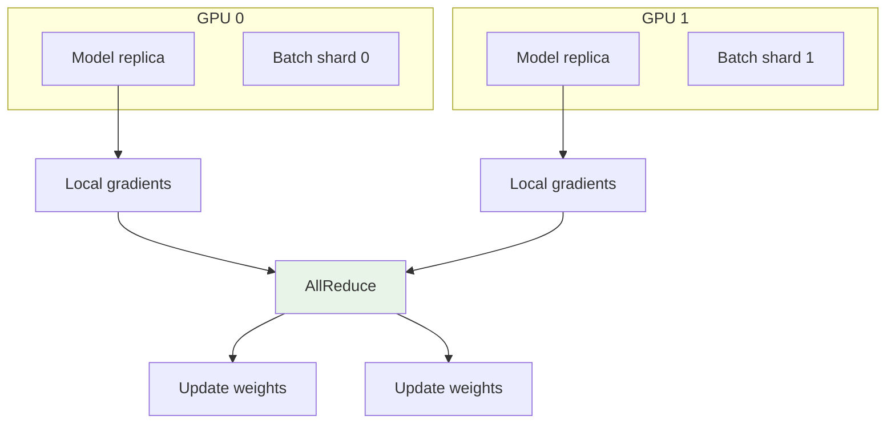
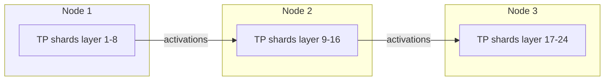
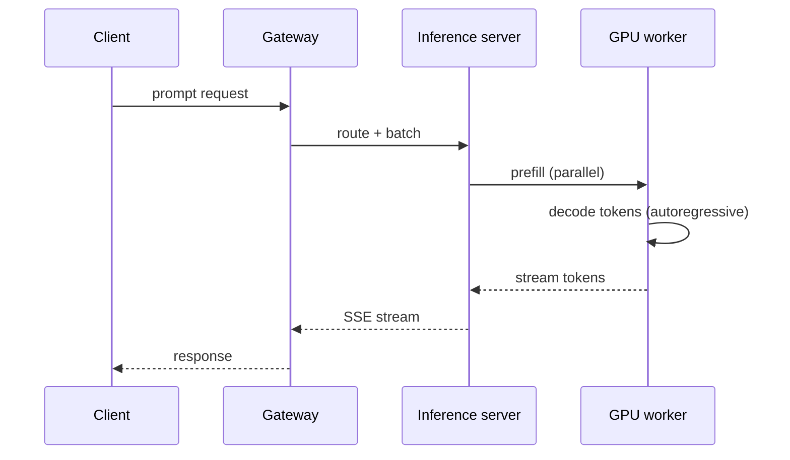

# Distributed Training and Inference

## 1. Executive Summary

Training and serving large machine learning models at scale requires treating **GPU clusters as distributed systems** with distinct failure modes, communication patterns, and scheduling constraints. **Distributed training** partitions work across devices using **data parallelism** (same model, different batches), **tensor parallelism** (split layers across GPUs), **pipeline parallelism** (split layers sequentially), and **expert parallelism** (MoE routing). Synchronization relies on collective operations—primarily **AllReduce**—over high-bandwidth interconnects (NVLink, InfiniBand).

**Distributed inference** optimizes latency and throughput via **model parallelism**, **batching** (static and continuous), **KV-cache** management, and **disaggregated prefill/decode** architectures. Principal architects must distinguish **training-time** concerns (gradient consistency, checkpoint frequency) from **inference-time** concerns (SLO tail latency, autoscaling cold starts).

This chapter covers mechanisms, safety/liveness properties of training jobs, failure recovery, and production patterns for principal-level interviews.

## 2. Why This Topic Matters

AI infrastructure interviews at principal level probe systems thinking, not just framework APIs:

- **Why AllReduce bandwidth limits scaling?** — Communication-bound regimes.
- **Data vs tensor parallelism tradeoffs?** — Memory per GPU vs communication volume.
- **Training failure at step 50,000?** — Checkpoint/resume semantics.
- **Inference GPU utilization low?** — Batching, memory fragmentation, prefill/decode imbalance.
- **Multi-node vs single-node?** — Network topology and collective algorithms.

Confusing "8 GPUs" with "8× throughput" ignores communication overhead and straggler effects.

## 3. Problems Being Solved

| Problem | Distributed approach |
|---------|---------------------|
| **Model exceeds single-GPU memory** | Tensor + pipeline parallelism |
| **Training too slow on one GPU** | Data parallelism across cluster |
| **Inference latency SLO** | Batching, quantization, speculative decode |
| **Cost of idle GPUs** | Job scheduling, multi-tenancy, spot instances |
| **Fault during long training** | Checkpoint to durable storage |
| **Heterogeneous hardware** | Placement and mixed-precision strategies |

### Workload fit matrix

| Workload | Data parallel | Tensor parallel | Pipeline parallel |
|----------|--------------|-----------------|-------------------|
| ResNet-scale CV | ✓ | Rare | Rare |
| 7B LLM training | ✓ | Optional | Optional |
| 70B+ LLM training | ✓ | ✓ | ✓ |
| Real-time inference 7B | Batching | Single-node TP | |
| 405B inference | | ✓ | ✓ disaggregated |

## 4. Assumptions and System Model

| Assumption | Implication |
|------------|-------------|
| **GPUs have high local bandwidth (NVLink)** | TP within node; PP across nodes costly |
| **Network may be slower than NVLink** | AllReduce algorithm choice matters |
| **Failures are partial** | Nodes drop; job must tolerate or restart |
| **Determinism optional** | FP16/BF16 nondeterminism; reproducibility tradeoffs |
| **Storage for checkpoints** | S3/GCS with multipart upload |

**Safety (training):** All workers apply consistent gradient updates per step (synchronous SGD) or bounded staleness (async). **Liveness:** Progress requires straggler mitigation and healthy interconnect.

## 5. Essential Terminology

| Term | Definition |
|------|------------|
| **Data parallelism (DP)** | Replicate model; shard batches; AllReduce gradients |
| **Tensor parallelism (TP)** | Split individual tensors/layers across GPUs |
| **Pipeline parallelism (PP)** | Stages of model on different devices |
| **ZeRO** | Shard optimizer states across data parallel ranks |
| **AllReduce** | Collective summing gradients across workers |
| **Ring AllReduce** | Bandwidth-optimal ring communication pattern |
| **Checkpoint** | Persist model + optimizer state for resume |
| **Continuous batching** | Dynamic batch inference requests (vLLM) |
| **KV cache** | Stored attention keys/values during autoregressive decode |
| **FSDP** | Fully Sharded Data Parallel (PyTorch) |

## 6. Core Mechanism

### 6.1 Data parallel training



*Figure 1: Each GPU computes gradients on its batch; AllReduce averages gradients before synchronized weight update.*

### 6.2 Tensor + pipeline parallelism (conceptual)



*Figure 2: Pipeline stages pass micro-batch activations; tensor parallelism splits within each stage.*

### 6.3 Inference serving path



*Figure 3: Prefill processes prompt in parallel; decode generates tokens sequentially using KV cache.*

## 7. Step-by-Step Walkthrough

### Walkthrough A: Multi-GPU data parallel training step

1. Rank 0–7 each load identical model weights from checkpoint.
2. Distributed sampler assigns disjoint batch shards per rank.
3. Forward/backward pass computes local gradients.
4. `torch.distributed.all_reduce` averages gradients (NCCL backend).
5. Optimizer step updates weights identically on all ranks.
6. Every N steps: rank 0 writes checkpoint to object storage.

### Walkthrough B: 70B model with 3D parallelism

1. **TP=8** within each of 4 nodes (32 GPUs total).
2. **PP=4** across nodes—each node holds pipeline stage.
3. **DP=2**—two replica groups process different micro-batches.
4. Activation checkpointing reduces memory; recomputes in backward.
5. Communication: intra-node NVLink for TP; inter-node IB for PP.

### Walkthrough C: Inference with continuous batching

1. Requests arrive with varying prompt lengths.
2. Scheduler adds new request to batch when GPU memory permits.
3. Prefill phase computes KV cache for new prompt.
4. Decode steps run batched token generation; completed sequences exit batch.
5. PagedAttention maps KV cache to non-contiguous GPU pages (vLLM).

### Walkthrough D: Training failure recovery

1. Node 3 lost at step 42,000; NCCL timeout raises.
2. Orchestrator (Slurm/K8s) terminates job group.
3. Relaunch from checkpoint at step 40,000 (every 2k steps policy).
4. **Liveness:** 2k steps recomputed. **Safety:** consistent checkpoint from rank 0 barrier.

### Walkthrough E: Pipeline parallelism micro-batching

1. 70B model split into 8 pipeline stages across 8 GPUs.
2. Forward pass injects micro-batches to fill pipeline; backward pass drains.
3. Bubble fraction ≈ `(stages-1) / (micro_batches + stages - 1)` [simplified textbook formula].
4. Increase micro-batch count to 16 to reduce idle stages at cost of memory.
5. Profile shows stage 3 compute-bound; consider tensor parallel within stage 3 only.

### Walkthrough F: Inference disaggregated prefill/decode

1. Prefill workers handle long prompts with high parallelism; decode workers optimized for memory bandwidth.
2. Request routed: prefill completes KV cache transfer to decode pool via RDMA or shared memory [architecture varies by product].
3. TTFT dominated by prefill cluster; TPOT by decode cluster—scale independently.
4. Autoscaling policies differ: prefill scales on prompt tokens/sec; decode on concurrent sequences.
5. Principal architects validate network cost of KV transfer vs colocated serving.

### GPU cluster topology checklist

| Question | Why it matters |
|----------|----------------|
| NVLink within node? | Tensor parallelism placement |
| IB bandwidth between nodes? | AllReduce and pipeline stage RTT |
| Shared filesystem for checkpoints? | Recovery time and contention |
| Spot/preemptible mix? | Checkpoint frequency vs cost |
| Network policy for NCCL ports? | Silent hang if blocked |

## 8. Invariants and Guarantees

| Property | Training | Inference |
|----------|----------|-----------|
| **Gradient consistency** | Sync SGD: all ranks same avg gradient | N/A |
| **Model weight consistency** | Identical across DP replicas after step | Single serving replica set |
| **Request isolation** | N/A | No cross-tenant data leak in batch |
| **Checkpoint atomicity** | Complete step boundary | N/A |

Async training trades **staleness bounds** for **throughput**—explicit safety/liveness tradeoff.

## 9. Failure Scenarios

| Failure | Behavior | Mitigation |
|---------|----------|------------|
| **GPU OOM** | Job crash | Gradient checkpointing; reduce batch; ZeRO |
| **NCCL timeout** | Hang or abort | Network diagnostics; increase timeout cautiously |
| **Straggler GPU** | AllReduce waits | Slowest rank bounds step time |
| **Checkpoint corrupt** | Resume fails | Multi-part verification; frequent checkpoints |
| **Inference overload** | Queue growth | Autoscale; rate limit; degrade model tier |
| **KV cache exhaustion** | Reject or preempt requests | Memory limits; max sequence length |
| **Spot preemption** | Training interrupt | Checkpoint to durable store; fault-tolerant schedulers |

## 10. Performance Characteristics

| Dimension | Training | Inference |
|-----------|----------|-----------|
| Bottleneck | AllReduce, memory | Memory bandwidth, decode serialism |
| Scaling efficiency | Sub-linear past communication bound | Batching improves utilization |
| Latency | Step time (seconds–minutes) | TTFT + TPOT (ms) |
| Interconnect | IB critical multi-node | NVLink within node |

**Strong scaling** hits communication wall; **weak scaling** increases batch per GPU.

## 11. Scalability Limits

- **AllReduce** scales poorly when network bisection bandwidth insufficient.
- **Pipeline bubbles** reduce PP efficiency without sufficient micro-batches.
- **Checkpoint size** for 100B+ models—terabytes; checkpoint frequency tradeoff.
- **Inference batch size** limited by KV cache memory.
- **Multi-tenancy interference** on shared GPUs—noisy neighbor latency.

## 12. Operational Considerations

- Monitor **GPU utilization**, **NCCL errors**, **step time variance**, **checkpoint duration**.
- **Topology-aware** placement: TP within node, PP across high-bandwidth links.
- Version-pin **CUDA, driver, NCCL, framework** combinations.
- **Capacity planning**: H100 memory for model size + optimizer shards.
- Inference: **SLO dashboards** for TTFT, tokens/sec, queue depth.
- Run **failure injection** on training jobs before multi-week runs.
- **Checkpoint restore drill** before every run &gt;7 days; verify hash integrity.
- **Separate VPC/subnet** for training vs inference traffic classes.
- **DCGM + NVML** metrics in standard observability stack; page on XID errors.
- **Job queue fairness** across teams when cluster oversubscribed.

## 13. Security Considerations

- **Tenant isolation** on shared inference clusters—separate namespaces, no shared KV.
- **Model artifact access** via signed URLs and IAM.
- **Training data** in encrypted volumes; no PII in logs.
- **Supply chain**: verify container images and model weights checksums.

## 14. Cost Considerations

- **GPU-hour** dominates; optimize utilization before buying more nodes.
- **Spot/preemptible** for fault-tolerant training with checkpoints.
- **Inference**: right-size model (quantize INT8/FP8) vs accuracy.
- **Egress** for checkpoint storage cross-region.
- **Idle multi-node clusters** during dev—auto-shutdown policies.

### NCCL and network partition narrative

A misconfigured security group blocks TCP ports used by NCCL on one node pair. Training does not fail immediately—AllReduce hangs until timeout (often minutes). GPUs show mixed utilization; nvidia-smi looks deceptively healthy. **Lesson:** cluster bring-up must include **collective communication tests**, not single-GPU burn-in. Document NCCL debug playbooks for on-call.

### Inference capacity planning methodology

Target 500 concurrent chat sessions on a 70B-class model. **Do not guess throughput**—profile tokens/sec per replica on representative prompts in staging. Count decode-heavy concurrency separately from prefill bursts. Plan replicas with 25% headroom; add gateway tier capacity. Revisit after quantization or router model tiering (small model handles 80% intents). Principal interviews reward **measurement discipline** over invented GPU math.

### Training checkpoint RPO decision framework

| Checkpoint interval | RPO (max lost work) | Cost |
|--------------------|---------------------|------|
| Every 100 steps | 100 steps | High I/O |
| Every 1000 steps | 1000 steps | Moderate |
| Every epoch | Full epoch | Lower |

Multi-week runs on expensive clusters justify frequent checkpoints despite storage cost—executives understand **insurance premium** framing better than raw S3 bills.

## 15. Production Implementations

### Case study: Foundation model training cluster (illustrative)

#### Context

Train 34B parameter LLM on 256 H100s; 3-week run budget.

#### Architecture

Slurm + PyTorch FSDP + activation checkpointing. Checkpoint every 500 steps to parallel filesystem → async copy S3. TensorBoard + DCGM metrics.

#### Failure events

Two node failures; resumed from checkpoint; total 4% overhead recomputation.

#### Extended operations narrative

Week two of training, NCCL timeout during all-to-all exposed misconfigured security group—8 hours lost before root cause found. Post-incident: mandatory **collective comm test** in cluster bring-up checklist. Inference path deployed separately after training team saturated network with checkpoint uploads to S3—**noisy neighbor** between training and chat serving resolved by VPC subnet isolation. FinOps report showed 62% average GPU utilization after continuous batching tuning on inference tier [profile your workload—do not cite as universal].

#### Tradeoffs

| Choice | Tradeoff |
|--------|----------|
| FSDP vs Megatron TP/PP | Simpler vs max scale efficiency |
| BF16 | Speed vs slight nondeterminism |
| 500-step checkpoints | Storage cost vs lost work |

## 16. Alternatives and Tradeoffs

| Approach | When |
|----------|------|
| **Single-GPU training** | Small models; prototyping |
| **Data parallel only** | Fits in GPU memory |
| **Megatron-style 3D parallel** | 70B+ training |
| **LoRA fine-tune** | Cheap adaptation vs full training |
| **CPU inference** | Tiny models; cost sensitivity |

## 17. Common Misconceptions

| Misconception | Reality |
|---------------|---------|
| "More GPUs = linear speedup" | Communication and stragglers |
| "Inference is embarrassingly parallel" | Decode is sequential per sequence |
| "Checkpoint anytime is fine" | Must be consistent across ranks |
| "TP and DP are interchangeable" | Different memory/comm tradeoffs |
| "Quantization free at inference" | Accuracy/latency tradeoff |

## 18. Principal Architect Perspective

1. **Profile communication vs compute** before scaling nodes.
2. **Checkpoint policy** is a risk management decision—document RPO for training.
3. **Separate training and inference clusters** for noisy-neighbor isolation.
4. **Standardize on orchestration** (K8s device plugin, Slurm) with observability.
5. **Plan model parallelism strategy** before procurement—not after OOM.

Principal architects presenting to infrastructure boards should quantify **checkpoint RPO in dollars** (lost GPU-hours) and **inference warm-pool cost vs TTFT SLA breach cost**—executives decide tradeoffs with numbers, not architecture jargon alone. Document assumptions in every GPU capacity plan. Profile before purchasing additional nodes.

### Operating playbook (first 90 days)

**Days 1–30:** Baseline GPU utilization and NCCL health on existing workloads. Document CUDA/NCCL/framework matrix approved for production.

**Days 31–60:** Implement checkpoint policy with tested restore drill. Separate inference and training clusters if noisy-neighbor observed.

**Days 61–90:** Deploy inference gateway with quotas; profile TTFT and tokens/sec per model tier. Present capacity plan with measured throughput, not vendor slides.

## 19. Architecture Review Exercise

**Scenario:** Team buys 64 GPUs for 13B model that fits on one H100 with quantization; uses multi-node AllReduce.

**Findings:** Over-engineered network; poor utilization. Recommend single-node multi-GPU or larger batch on fewer GPUs.

## 20. Whiteboard Explanation

"Data parallelism replicates the full model on each GPU but feeds different mini-batch shards. After backward pass, gradients are averaged with AllReduce so every replica stays synchronized. When the model doesn't fit in one GPU's memory, tensor parallelism splits individual weight matrices across devices in the same layer, requiring frequent communication. Pipeline parallelism assigns layer groups to different GPUs, passing micro-batches through stages like an assembly line—watch for pipeline bubbles. Inference is different: prefill is compute-bound and parallel over the prompt; decode generates one token at a time per sequence using KV cache, so continuous batching and PagedAttention maximize GPU use."

**Principal addendum:** Separate training (AllReduce, checkpoints) from inference (TTFT, batching). Profile communication before scaling nodes; checkpoint policy is risk management.

## 21. Interview Questions

1. **Data vs tensor parallelism?** — Shard batches vs shard layers/tensors.
2. **AllReduce purpose?** — Synchronize gradients across workers.
3. **Why pipeline bubbles?** — Stages idle waiting for micro-batches.
4. **ZeRO/FSDP benefit?** — Shard optimizer states to save memory.
5. **NCCL role?** — NVIDIA collective communication library.
6. **Checkpoint frequency tradeoff?** — Durability vs overhead/storage.
7. **Inference TTFT vs TPOT?** — Time to first token vs per output token.
8. **Continuous batching?** — Dynamic batching of variable-length requests.
9. **KV cache?** — Cached attention states during decode.
10. **Straggler effect?** — Slowest rank limits AllReduce step.
11. **Ring AllReduce?** — Bandwidth-efficient collective algorithm.
12. **Prefill vs decode disaggregation?** — Different resource profiles.
13. **BF16 vs FP32 training?** — Speed/memory vs precision.
14. **Spot instance training?** — Checkpoints required for preemption tolerance.

### Scoring rubric (principal)

| Dimension | Strong | Weak |
|-----------|--------|------|
| Parallelism types | DP/TP/PP tradeoffs | "Use more GPUs" |
| Communication | AllReduce bottleneck | Ignores network |
| Inference | KV cache, batching | Training-only answers |
| Failure | Checkpoint consistency | "Restart from scratch" |

### Extended scoring notes

**Principal bar:** Separates training parallelism from inference batching unprompted. Names NCCL and checkpoint as ops concerns. **Weak hire:** Only mentions "distributed PyTorch" without memory or communication limits.

15. **Gradient accumulation purpose?** — Simulate large batch on small memory.
16. **Expert parallelism?** — MoE routing across devices.
17. **INT4 inference tradeoff?** — Throughput vs accuracy.

## 22. Interview Follow-Ups

1. **Size AllReduce for 8 GPUs, 7B params, FP16.** — Gradient bytes ≈ 2× params; ring reduces bandwidth [order-of-magnitude reasoning].
2. **OOM on 80GB GPU—options?** — ZeRO, checkpointing, TP, smaller batch.
3. **Design inference for 10k RPS chat.** — Gateway, autoscale replicas, queue, model tiering.
4. **Async SGD when acceptable?** — Large batch exploration; staleness bounds.
5. **Multi-tenant GPU sharing risks?** — Latency interference, side channels.

### Additional principal scenarios

**Scenario:** CEO wants to train 405B in-house on 8 GPUs. **Answer:** Educate on memory and parallelism requirements; propose cloud burst or smaller model with RAG; do not promise linear scale.

**Scenario:** Inference p99 spikes during marketing launch. **Answer:** Pre-warm replicas 24h ahead; gateway queue with 429; degrade non-premium tier to smaller model; post-event rightsizing.

**Scenario:** Training job restarts from step 0 after checkpoint corruption. **Answer:** Verify checkpoint integrity hashes; multi-part upload to durable storage; test restore before 3-week run; treat checkpoint as production data with backup policy.

## 23. Strong Answer Example

**Question:** "When would you use tensor parallelism vs data parallelism?"

**Strong outline:** "Data parallelism works when the full model, activations, and optimizer states fit in each GPU's memory—you replicate weights and shard only the batch, synchronizing with AllReduce each step. It's the default for models up to tens of billions parameters on modern GPUs. Tensor parallelism splits individual layers across GPUs in the same forward pass, trading frequent high-bandwidth communication—ideally NVLink within a node—for the ability to run layers that don't fit on one device. I'd use TP when a single layer's weights exceed GPU memory or when activation memory dominates. In practice, large LLM training combines DP across nodes with TP within nodes and sometimes pipeline parallelism across nodes. The decision is driven by memory footprint, interconnect topology, and profiling whether we're compute-bound or communication-bound."

## 24. Weak Answer Example

**Weak:** "Use distributed training when training is slow; PyTorch handles parallelism automatically."

**Red flags:** No parallelism types; ignores memory and communication; no checkpoint/failure discussion.

## 25. Hands-On Exercise

1. Run PyTorch DDP on 2 GPUs locally; verify identical loss curves.
2. Profile step time with and without gradient accumulation.
3. Serve model with vLLM; measure TTFT vs batch size.
4. Simulate straggler with `sleep` in one rank; observe AllReduce delay.
5. Sketch 3D parallelism for hypothetical 70B model on 32 GPUs.

## 26. Knowledge Check

1. AllReduce synchronizes? *(Gradients across data parallel ranks.)*
2. TP splits? *(Layers/tensors across GPUs.)*
3. Pipeline bubble cause? *(Stage idle time.)*
4. FSDP shards? *(Optimizer states and params.)*
5. KV cache used in? *(Autoregressive decode.)*
6. Continuous batching benefit? *(Higher GPU utilization.)*
7. NCCL used for? *(GPU collective ops.)*
8. Checkpoint at step boundary why? *(Consistent state.)*
9. Straggler limits? *(Slowest worker in sync training.)*
10. Prefill phase? *(Parallel prompt processing.)*
11. FSDP shards? *(Optimizer states.)*
12. Pipeline bubble? *(Stage idle waiting.)*
13. Continuous batching? *(Dynamic inference grouping.)*

## 27. Flashcards

| Front | Back |
|-------|------|
| Data parallelism | Replicate model; shard batches |
| Tensor parallelism | Split layers across GPUs |
| Pipeline parallelism | Stages on different devices |
| AllReduce | Collective gradient averaging |
| ZeRO / FSDP | Shard optimizer states |
| NCCL | NVIDIA GPU collective library |
| KV cache | Stored attention for decode |
| Continuous batching | Dynamic inference batching |
| TTFT | Time to first token |
| Checkpoint | Durable training state snapshot |

## 28. Cheat Sheet

```
TRAINING PARALLELISM
  DP: shard batch | TP: shard layer | PP: shard depth | ZeRO: shard optimizer

BOTTLENECKS
  AllReduce bandwidth | stragglers | pipeline bubbles | OOM

INFERENCE
  Prefill (parallel) → Decode (serial) + KV cache + continuous batching

OPS
  Checkpoint policy | NCCL health | topology-aware placement
```

## 29. Related Concepts

- [Partial Failure](/docs/distributed-systems-foundations/partial-failure) — node failures in clusters
- [LLM Serving and Model Gateways](/docs/ai-distributed-systems/llm-serving-and-model-gateways) — production inference
- [SLO, SLI, and Error Budgets](/docs/reliability-and-resilience/slo-sli-error-budgets) — inference SLOs
- [Observability Fundamentals](/docs/observability/observability-fundamentals) — GPU metrics

## 30. References

### Primary sources

- Li, M., et al. (2020). *PyTorch Distributed: Experiences on Accelerating Data Parallel Training.* VLDB.
- Shoeybi, M., et al. (2019). *Megatron-LM: Training Multi-Billion Parameter Language Models Using Model Parallelism.* arXiv.
- NVIDIA NCCL documentation — collective algorithms.

### Related

- vLLM paper (PagedAttention) — inference memory management.
- Rajbhandari, S., et al. — ZeRO memory optimizations.

### Distinction

| Claim | Type |
|-------|------|
| AllReduce algorithms | NCCL implementation |
| Scaling efficiency numbers | Hardware and model specific |
| Checkpoint formats | Framework-specific |
