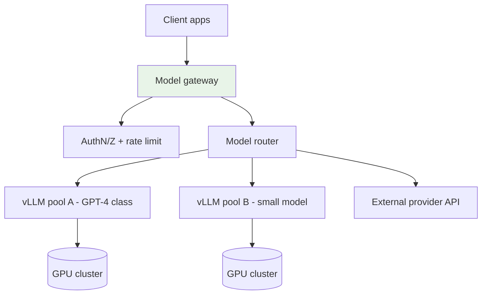
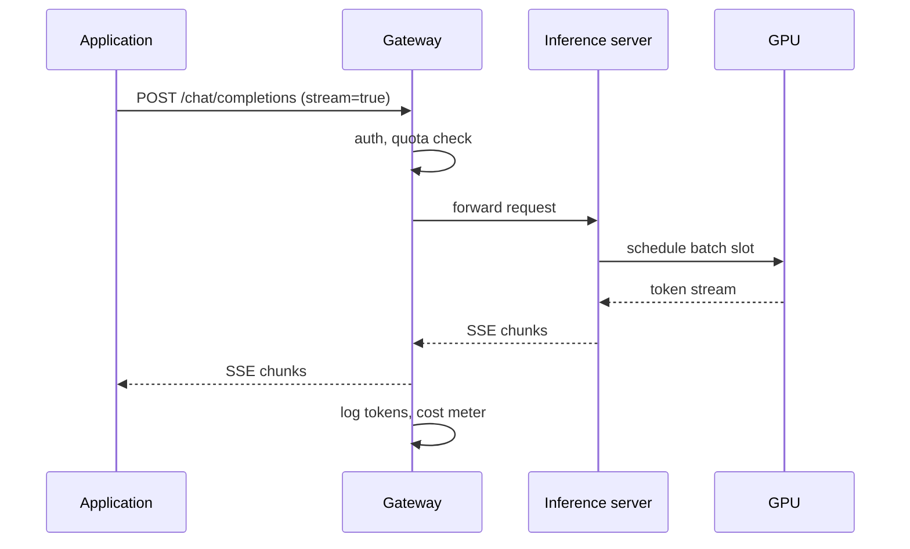
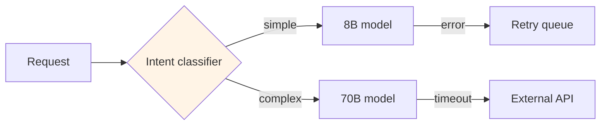

# LLM Serving and Model Gateways

## 1. Executive Summary

**LLM serving** exposes large language models as production APIs with stringent **latency**, **throughput**, and **cost** requirements. Unlike traditional microservices, inference workloads are **GPU-bound**, **memory-shaped by KV cache**, and **bimodal**—prefill (compute-intensive, parallel) vs decode (memory-bandwidth-intensive, sequential). Production stacks use specialized runtimes (**vLLM**, **TensorRT-LLM**, **TGI**) with **continuous batching**, **PagedAttention**, and **quantization** (FP8, INT4).

A **model gateway** sits in front of inference clusters as the **control plane**: authentication, **rate limiting**, **routing** across model versions and providers, **fallback chains**, **prompt caching**, **cost attribution**, and **policy enforcement** (PII, content filters). Examples include custom Kong/Envoy layers, **LiteLLM**, cloud **Azure API Management** patterns, and hyperscaler **Bedrock/SageMaker** endpoints.

Principal architects design gateways to prevent **thundering herds**, **noisy neighbor** GPU contention, and **unbounded token spend**—while maintaining **streaming SSE** compatibility and **observability** per tenant.

## 2. Why This Topic Matters

Every enterprise LLM deployment needs a serving layer interview narrative:

- **Why not call OpenAI directly from every app?** — Governance, cost, routing.
- **TTFT vs inter-token latency?** — Different optimization levers.
- **Autoscaling GPU inference?** — Cold start, scale-to-zero tradeoffs.
- **Multi-model routing?** — Cheap model for classification, large for generation.
- **Gateway failure modes?** — Timeouts, circuit breakers, partial streams.

Treating LLM inference as "just another REST service" ignores GPU scheduling and token economics.

## 3. Problems Being Solved

| Problem | Serving/gateway approach |
|---------|-------------------------|
| **Low GPU utilization** | Continuous batching, request pooling |
| **High latency tail** | Queue management, priority tiers |
| **Uncontrolled API spend** | Rate limits, quotas per tenant |
| **Model version rollout** | Canary routing in gateway |
| **Multi-vendor models** | Unified OpenAI-compatible API |
| **Compliance** | Audit logs, data residency routing |
| **Prompt injection at edge** | Input sanitization policies |

### Workload fit matrix

| Pattern | Fit | Caveat |
|---------|-----|--------|
| Chat assistant (streaming) | Strong | SSE timeout handling |
| Batch document summarization | Strong | Async job queue better at scale |
| Real-time code completion | Strong | Ultra-low TTFT requirement |
| Embedding API | Strong | Different hardware profile |
| Fine-tune on request | Weak | Separate training pipeline |

## 4. Assumptions and System Model

| Assumption | Implication |
|------------|-------------|
| **Requests are stateless at gateway** | Session state in app or cache |
| **Models loaded in GPU memory** | Warm pool vs cold start latency |
| **Streaming responses** | Long-lived HTTP connections |
| **Token metering** | Bill and limit by input+output tokens |
| **Provider SLAs vary** | Fallback and circuit breaking required |

**Safety:** Tenant A cannot access Tenant B prompts in logs or cache. **Liveness:** Under overload, degrade gracefully (queue, 429) rather than OOM crash.

## 5. Essential Terminology

| Term | Definition |
|------|------------|
| **TTFT** | Time to first token |
| **TPOT** | Time per output token (inter-token latency) |
| **Continuous batching** | Dynamic grouping of inference requests |
| **PagedAttention** | Non-contiguous KV cache memory management |
| **Model gateway** | Policy and routing layer before inference |
| **Speculative decoding** | Draft model proposes; target verifies |
| **Prefix caching** | Reuse KV for shared prompt prefixes |
| **Quantization** | Reduced precision weights (INT8/FP8/INT4) |
| **Disaggregated serving** | Separate prefill and decode workers |
| **OpenAI-compatible API** | `/v1/chat/completions` contract |

## 6. Core Mechanism

### 6.1 Serving architecture



*Figure 1: Gateway centralizes policy; router directs to internal or external inference backends.*

### 6.2 Request lifecycle (streaming)



*Figure 2: Streaming path maintains long connection; gateway meters tokens on completion.*

### 6.3 Routing and fallback



*Figure 3: Cascaded routing optimizes cost and latency; fallback handles capacity limits.*

## 7. Step-by-Step Walkthrough

### Walkthrough A: Chat completion through gateway

1. App sends JWT; gateway validates tenant `T1`, checks token quota.
2. Router selects `llama-3-70b` pool based on model header.
3. vLLM worker assigns request to continuous batch; prefill runs.
4. Tokens stream via SSE; gateway proxies without buffering full response.
5. On `finish_reason=stop`, gateway decrements quota, emits billing event.

### Walkthrough B: Canary deployment

1. New model weights `v2` deployed to 10% of GPU pool.
2. Gateway routes 10% traffic by consistent hash on `tenant_id`.
3. Compare TTFT, error rate, quality evals vs `v1`.
4. Promote to 100% or rollback based on SLO gates.

### Walkthrough C: Prefix cache hit

1. System prompt identical across requests (RAG template).
2. Inference runtime hashes prefix; KV cache reused.
3. TTFT drops for subsequent requests sharing prefix.
4. Gateway may route same-tenant requests to warm replica (session affinity optional).

### Walkthrough D: Overload protection

1. Queue depth exceeds threshold; gateway returns `429` with `Retry-After`.
2. Circuit opens to external provider after 5xx spike.
3. Degrade to smaller model for non-critical tier tenants.
4. Alert on-call; autoscaler adds GPU nodes (5–10 min lag).

### Walkthrough E: Multi-tenant fair queuing

1. Premium tenant tier gets dedicated GPU pool with guaranteed concurrency.
2. Standard tier shares pool with weighted fair queue—max 20 concurrent requests per tenant.
3. Batch embedding jobs routed to separate low-priority pool overnight.
4. Gateway tags requests with `tenant_id` and `priority` for metrics and billing.
5. Monthly review adjusts weights based on contract SLAs and actual utilization.

### Walkthrough F: Observability-driven tuning

1. Trace shows 40% of TTFT in gateway auth + policy; optimize JWT validation cache.
2. Inference trace reveals batch size 1 dominating—enable min batch wait 10ms for standard tier.
3. Prefix cache hit rate 12%—identify top 5 system prompts for cache warming.
4. External API fallback triggered 200 times/day—provision additional internal capacity.
5. SLO dashboard green after tuning; document changes in runbook.

### Gateway capability checklist

| Capability | Production requirement |
|------------|------------------------|
| Per-tenant auth | OAuth2/JWT validation |
| Token metering | Input + output + cached tokens |
| Model routing | Header or intent classifier |
| Streaming proxy | SSE without full buffer |
| Canary by hash | Consistent tenant routing |
| Circuit breaker | Per backend provider |
| Audit log | Request ID, model, tokens, latency |
| PII filter | Optional pre/post generation |

## 8. Invariants and Guarantees

| Property | Guarantee |
|----------|-----------|
| **Authentication** | Unauthenticated requests rejected |
| **Quota enforcement** | Hard stop at tenant limit (configurable soft/hard) |
| **Audit trail** | Request metadata logged; content policy varies |
| **Streaming integrity** | Chunks ordered; terminal chunk signals completion |
| **No cross-tenant cache leak** | Prefix cache scoped per tenant/model |

Inference **correctness** is probabilistic (sampling); **availability** and **cost bounds** are architectural guarantees.

## 9. Failure Scenarios

| Failure | Behavior | Mitigation |
|---------|----------|------------|
| **GPU OOM** | Request failed mid-stream | Max sequence limits; preemption |
| **Worker crash** | Client sees disconnect | Retry idempotency keys; gateway retry |
| **Provider outage** | Fallback model or queue | Multi-provider routing |
| **SSE proxy timeout** | Truncated response | Align LB idle timeout with max generation |
| **Thundering herd** | Latency explosion | Rate limit + queue + autoscale |
| **Bad canary** | Quality regression | Automated eval gates; fast rollback |
| **Token count mismatch** | Billing drift | Reconcile with inference server logs |

## 10. Performance Characteristics

| Dimension | Behavior |
|-----------|----------|
| TTFT | Prefill length, batch contention, cache hit |
| Throughput | Tokens/sec scales with batching |
| Cold start | Model load seconds–minutes |
| Gateway overhead | Typically ms vs GPU seconds |
| Quantization | ~1.5–2× throughput; accuracy tradeoff [model-specific] |

## 11. Scalability Limits

- **GPU memory** caps concurrent sequences.
- **LB long connections** limit connections per instance.
- **Central gateway** may bottleneck—horizontal scale stateless tier.
- **External API rate limits** cap burst routing.
- **Eval quality** may limit aggressive model down-tiering.

## 12. Operational Considerations

- SLOs: **p50/p99 TTFT**, **tokens/sec/GPU**, **error rate**, **queue wait**.
- **Dashboards** per model version and tenant.
- **Load test** with realistic prompt length distribution.
- **Align timeouts**: client < gateway < LB < inference max generation.
- **Runbooks** for OOM, NCCL errors (multi-GPU), provider degradation.
- **Cost dashboards**: $/1M tokens per model and tenant.
- **Prefix cache hit rate** tracked; warm top system prompts after deploy.
- **Model artifact registry** with signed weights and promotion workflow.
- **Synthetic probe** every 60s per model pool for availability SLO.
- **FinOps weekly** review of top 10 tenants by token spend.

## 13. Security Considerations

- **API keys** rotated; short-lived tokens preferred.
- **PII redaction** in logs; optional prompt encryption in transit/at rest.
- **Prompt injection** defenses at gateway and system prompt hardening.
- **VPC/private endpoints** for internal model access.
- **Content filtering** hooks (policy-as-code).

## 14. Cost Considerations

- **GPU amortization**: maximize batch utilization.
- **Model tiering**: route 80% traffic to smaller/cheaper models.
- **External API** premium vs self-hosted break-even analysis.
- **Idle GPU** cost—scale-to-zero vs warm pool for TTFT SLO.
- **Output token pricing** dominates long generations—max_tokens limits.

### SSE and load balancer timeout deep dive

A common production incident: chat works in staging but truncates at exactly 60 seconds in production. Root cause: AWS ALB idle timeout default 60s while generation continues 90s. Gateway streams bytes but LB severs connection. **Fix:** raise idle timeout above max generation time; enable TCP keepalive; document client reconnect for resumable streams if product supports it. Principal architects validate **full path timeouts**—client, gateway, LB, inference—not each layer in isolation.

### Model routing economics (illustrative framework)

Classify intents with a 8B router model costing ~$0.10 per 1M input tokens vs 70B at ~$2.00 [verify vendor pricing]. If 70% of requests are simple FAQ, routing saves ~45% inference spend before quantization. Track **misroute rate**—router sending complex queries to small model damages quality. Online eval samples flagged conversations for human review weekly.

### Cold start vs warm pool decision

| SLO | Strategy |
|-----|----------|
| TTFT p99 &lt; 2s interactive | Warm minimum 2 replicas per model |
| Batch overnight only | Scale to zero acceptable |
| Burst marketing event | Pre-warm 24h before; load test |

FinOps may push scale-to-zero; product SLO may forbid it—document tradeoff in ADR with dollar cost of warm pool vs lost conversion from slow TTFT [business input required].

## 15. Production Implementations

### Case study: Enterprise LLM platform (illustrative)

#### Context

50 internal apps; mix of self-hosted Llama and OpenAI fallback; $200k/month GPU budget.

#### Architecture

Envoy gateway + custom auth + LiteLLM router. vLLM on K8s with HPA on queue depth. Prefix cache for shared RAG system prompts.

#### Results (illustrative)

67% GPU utilization after continuous batching tuning; 40% cost reduction via small-model routing for classification intents.

#### Extended operations narrative

Launch day incident: ALB 60s idle timeout truncated CEO demo stream at token 847. Fix raised timeout to 300s and added gateway keepalive comments in SSE stream. Canary deploy of Llama fine-tune blocked when safety eval detected 2 new jailbreak passes—rollback automated via feature flag. Multi-tenant fair queue prevented one batch embedding job from starving interactive chat during month-end reporting crunch.

#### Tradeoffs

| Choice | Tradeoff |
|--------|----------|
| Self-host 70B | Control vs ops burden |
| LiteLLM | Velocity vs deep customization |
| Hard quotas | User friction vs budget protection |

## 16. Alternatives and Tradeoffs

| Approach | Pros | Cons |
|----------|------|------|
| **Direct vendor API** | Zero ops | Cost, data egress, lock-in |
| **Self-hosted vLLM** | Control, cost at scale | GPU ops |
| **Serverless inference** | Simple scale | Cold start, cost unpredictability |
| **Edge deployment** | Low latency | Model size limits |

## 17. Common Misconceptions

| Misconception | Reality |
|---------------|---------|
| "Gateway adds too much latency" | ms vs GPU seconds |
| "One model fits all tasks" | Routing saves cost and latency |
| "Streaming is optional" | UX standard for chat |
| "Autoscale is instant" | GPU provisioning lags |
| "max_tokens=4096 always fine" | Cost and latency explode |

## 18. Principal Architect Perspective

1. **Gateway is mandatory** for multi-tenant enterprise LLM—not optional middleware.
2. **Define SLOs per tier**—premium vs standard queues.
3. **Invest in routing intelligence** early—biggest cost lever.
4. **Treat inference as stateful** at GPU layer despite stateless HTTP.
5. **Eval gates** on every model promotion—not just latency metrics.

The gateway is where **enterprise AI economics and risk** meet engineering. Every principal roadmap should sequence: auth and quotas first, routing and cost second, model quality optimization third—never invert that order. Load tests must include long SSE streams through production load balancers, not just direct-to-vLLM benchmarks in staging.

### Operating playbook (first 90 days)

**Days 1–30:** Deploy gateway with auth, quotas, and request tracing. Block direct GPU access from application pods.

**Days 31–60:** Implement canary routing and model-tier classifier; measure cost per successful request by tenant.

**Days 61–90:** Load test with realistic prompt-length distribution; fix LB SSE timeouts. Publish inference SLO dashboard for executives.

## 19. Architecture Review Exercise

**Scenario:** Apps call vLLM pods directly via K8s service; no auth; shared GPU pool for batch and interactive.

**Findings:** No cost control, security gap, batch jobs starve chat. Mandate gateway, separate pools, quotas.

## 20. Whiteboard Explanation

"Applications talk to a model gateway, not directly to GPUs. The gateway authenticates tenants, enforces rate limits, and routes to the right model—small for classification, large for generation, external API as fallback. Behind it, vLLM servers use continuous batching: new chat requests join a GPU batch dynamically, and PagedAttention manages KV cache memory like virtual memory. Prefill processes the prompt in parallel; decode streams tokens one at a time. The gateway proxies SSE streams, meters tokens for billing, and supports canary deployments. Autoscaling watches queue depth, but GPU cold starts mean you keep a warm pool for interactive SLOs."

**Principal addendum:** Gateway owns policy; GPU tier owns throughput. Align LB SSE timeouts with max generation. Model routing is the top cost optimization.

## 21. Interview Questions

1. **TTFT vs TPOT?** — First token latency vs subsequent token spacing.
2. **Continuous batching benefit?** — Higher GPU utilization vs static batching.
3. **PagedAttention?** — Efficient non-contiguous KV cache allocation.
4. **Model gateway responsibilities?** — Auth, routing, limits, observability.
5. **Why OpenAI-compatible API?** — SDK reuse across providers.
6. **Canary inference deploy?** — Traffic split; SLO and eval gates.
7. **Prefix caching?** — Reuse KV for shared prompt prefixes.
8. **Quantization tradeoff?** — Speed/cost vs accuracy.
9. **SSE timeout issues?** — LB idle timeout vs long generations.
10. **Disaggregated prefill/decode?** — Scale each phase independently.
11. **Speculative decoding?** — Draft+verify for faster decode.
12. **Rate limit dimensions?** — RPM, TPM, concurrent requests.
13. **Fallback chain design?** — Primary internal → external → smaller model.
14. **Multi-tenant GPU isolation?** — Separate pools or strict scheduling.

### Scoring rubric (principal)

| Dimension | Strong | Weak |
|-----------|--------|------|
| Latency model | Prefill/decode split | "GPU slow" |
| Gateway | Policy + cost + routing | "API proxy" |
| Scale | Batching, warm pool | "Just add pods" |
| Ops | SLOs, canary, quotas | Ignores overload |

### Extended scoring notes

**Principal bar:** Gateway vs inference separation clear. TTFT/TPOT and SSE timeout chain mentioned. **Weak hire:** "Deploy vLLM behind load balancer" only.

15. **PagedAttention benefit?** — KV memory fragmentation fix.
16. **Speculative decoding?** — Draft model speedup.
17. **Token quota vs RPM limit?** — Cost vs concurrency control.

## 22. Interview Follow-Ups

1. **Design gateway for 100 tenants, 3 models.** — Auth, per-tenant quota, router, observability.
2. **p99 TTFT regression after deploy.** — Canary comparison, batch contention, prefix cache invalidation.
3. **When self-host vs API?** — Volume break-even, data residency, ops maturity.
4. **Handle 10-minute generation.** — Stream keepalive, LB timeout, client reconnect policy.
5. **Cost cap per user per day.** — Gateway token accounting; hard stop vs notify.

### Additional principal scenarios

**Scenario:** Security mandates all prompts logged in clear text. **Answer:** Push back—log hashes/metadata; clear text only with legal retention policy and restricted access; offer opt-in debug sessions.

**Scenario:** Vendor API outage during product launch. **Answer:** Pre-negotiated fallback model on self-hosted pool; circuit breaker already tested; communicate degraded mode SLA to product.

**Scenario:** Finance sees 3× token bill after feature launch. **Answer:** Audit `max_tokens` defaults; enable router model; prefix cache for system prompts; per-tenant quotas with alerting at 80% budget.

## 23. Strong Answer Example

**Question:** "What belongs in a model gateway vs the inference server?"

**Strong outline:** "The gateway owns cross-cutting platform concerns: authentication, authorization, per-tenant rate limits and token quotas, request logging for audit, routing to model versions or external providers, fallback and circuit breaking, and cost attribution. It should be stateless and horizontally scalable. The inference server owns GPU-efficient execution: model loading, continuous batching, KV cache management, quantization, and streaming token generation. Keeping policy at the gateway lets me swap vLLM for TensorRT-LLM without touching app clients, and keeps PII filtering out of the GPU tier. The contract between them is typically an internal OpenAI-compatible API with mTLS and request IDs for distributed tracing."

## 24. Weak Answer Example

**Weak:** "Put nginx in front of the model; it scales automatically."

**Red flags:** No batching, quotas, routing, or streaming considerations.

## 25. Hands-On Exercise

1. Deploy vLLM locally; measure TTFT vs prompt length.
2. Add LiteLLM proxy routing two models; test fallback.
3. Load test with Locust; observe queue and 429 behavior.
4. Configure SSE through reverse proxy; test idle timeout.
5. Sketch gateway components for your org's compliance needs.

## 26. Knowledge Check

1. TTFT measures? *(Time to first output token.)*
2. Continuous batching? *(Dynamic request grouping on GPU.)*
3. Gateway rate limits why? *(Cost and fairness.)*
4. KV cache used in? *(Decode phase.)*
5. Canary routing? *(Partial traffic to new version.)*
6. PagedAttention solves? *(KV memory fragmentation.)*
7. Prefix cache benefit? *(Faster prefill for shared prompts.)*
8. SSE used for? *(Streaming token delivery.)*
9. Quantization trades? *(Accuracy for speed/memory.)*
10. OpenAI-compatible API why? *(Interoperability.)*
11. TPOT measures? *(Time per output token.)*
12. Warm pool purpose? *(Avoid cold-start TTFT.)*
13. Circuit breaker protects? *(Cascading provider failures.)*

## 27. Flashcards

| Front | Back |
|-------|------|
| TTFT | Time to first token |
| TPOT | Time per output token |
| Continuous batching | Dynamic GPU request batching |
| PagedAttention | Paged KV cache management |
| Model gateway | Auth, routing, limits layer |
| Prefix caching | Reuse KV for shared prompts |
| Speculative decoding | Draft model accelerates decode |
| Quantization | Lower precision weights |
| SSE streaming | Server-sent events for tokens |
| Token quota | Per-tenant usage limit |

## 28. Cheat Sheet

```
SERVING STACK
  Apps → Gateway (auth/limit/route) → vLLM/TGI → GPU

LATENCY
  TTFT = prefill | TPOT = decode | batching affects both

GATEWAY
  Quotas, canary, fallback, audit, OpenAI-compatible API

OPS
  Warm pool, HPA on queue, LB SSE timeouts, $/token dashboards

PRINCIPAL ANCHORS
  Gateway before GPU for policy
  TTFT vs TPOT different tuning
  SSE timeout full-path test
  Router model saves cost
  Canary + eval on promote
  Quotas prevent bill shock
  Prefix cache for RAG prompts
  Self-host vs API break-even math
```

## 29. Related Concepts

- [Distributed Training and Inference](/docs/ai-distributed-systems/distributed-training-and-inference) — GPU parallelism foundations
- [RAG Architecture](/docs/ai-distributed-systems/rag-architecture) — retrieval-augmented serving
- [Caching Fundamentals](/docs/caching/caching-fundamentals) — prefix and prompt cache
- [SLO, SLI, and Error Budgets](/docs/reliability-and-resilience/slo-sli-error-budgets) — inference SLOs
- [Security Architecture Fundamentals](/docs/security/security-architecture-fundamentals) — API security

## 30. References

### Primary sources

- Kwon, W., et al. (2023). *Efficient Memory Management for Large Language Model Serving with PagedAttention.* SOSP (vLLM).
- NVIDIA TensorRT-LLM documentation — inference optimization.
- Hugging Face TGI documentation — production serving patterns.

### Related

- LiteLLM, Envoy AI gateway patterns — implementation choices.
- OpenAI API reference — de facto contract standard.

### Principal study path

Read [Distributed Training and Inference](/docs/ai-distributed-systems/distributed-training-and-inference) for GPU parallelism context, [RAG Architecture](/docs/ai-distributed-systems/rag-architecture) for retrieval-serving integration, [Caching Fundamentals](/docs/caching/caching-fundamentals) for prefix cache design, and [SLO, SLI, and Error Budgets](/docs/reliability-and-resilience/slo-sli-error-budgets) for inference SLO governance. Together these chapters form the production LLM platform stack interview narrative.

### Distinction

| Claim | Type |
|-------|------|
| PagedAttention mechanism | vLLM paper |
| Quantization speedups | Hardware and model specific |
| Gateway feature sets | Product/vendor specific |
