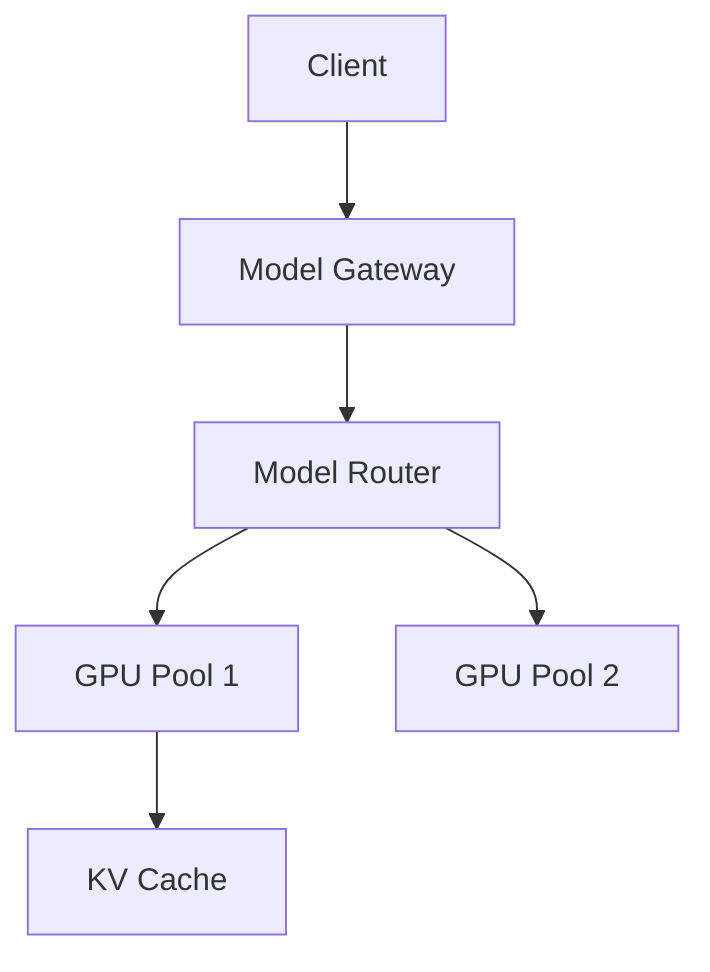

# AI Distributed Systems

Distributed training, inference, GPU scheduling, and model serving.

*Figure: Distributed LLM inference with routing and GPU pools.*

## Chapters

| Chapter | Focus |
|---------|-------|
| Distributed Training and Inference | [Distributed Training and Inference](/docs/ai-distributed-systems/distributed-training-and-inference) |
| LLM Serving and Model Gateways | [LLM Serving and Model Gateways](/docs/ai-distributed-systems/llm-serving-and-model-gateways) |
| RAG Architecture | [RAG Architecture](/docs/ai-distributed-systems/rag-architecture) |

## Learning Path

1. Begin with **Distributed Training and Inference** for parallelism strategies and GPU clusters.
2. Study **LLM Serving and Model Gateways** for routing, batching, and cost controls.
3. Finish with **RAG Architecture** for retrieval pipelines and grounding tradeoffs.

## Interview Prep

| Resource | Topic |
|----------|-------|
| [OpenAI LLM Gateway](/docs/real-world-scenarios/openai-llm-gateway) | Model routing, budgets |
| [Lab 015 RAG platform](/docs/ai-distributed-systems/rag-architecture#25-hands-on-exercise) | Hybrid retrieval on `:8105` |

## Related Domains

- [Agentic AI Architecture](/docs/agentic-ai-architecture/overview)
- [System Design](/docs/system-design/overview)

Return to the [Curriculum Overview](/docs/start-here/curriculum-overview) to see how this domain fits the learning path.
