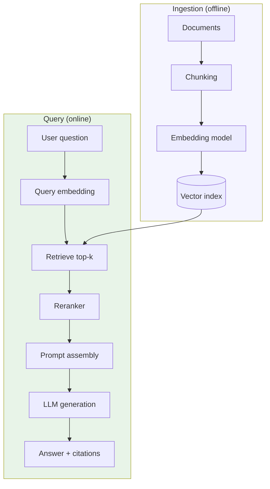
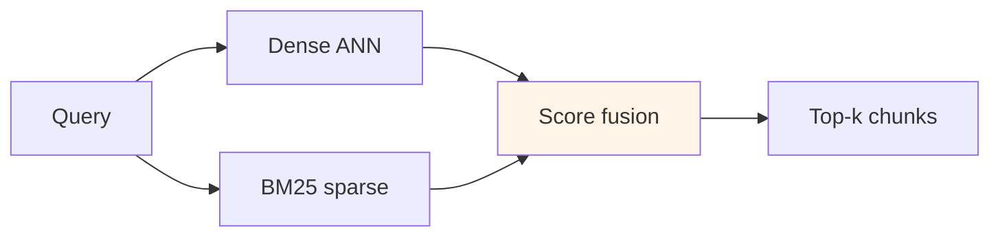
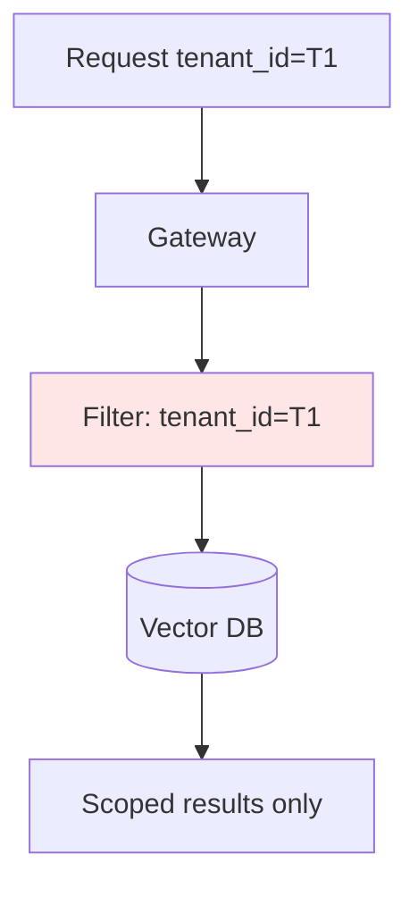

# RAG Architecture

## 1. Executive Summary

**Retrieval-Augmented Generation (RAG)** grounds large language model responses in **external knowledge** retrieved at query time, reducing hallucinations and enabling answers over private corpora without full model retraining. A production RAG system spans **ingestion** (chunking, embedding, indexing), **retrieval** (dense vector, sparse BM25, hybrid), **reranking**, **context assembly**, and **generation** with careful **prompt engineering** and **evaluation**.

Architecturally, RAG is a **distributed data pipeline** plus **inference path**: vector databases (Pinecone, Weaviate, pgvector, OpenSearch k-NN) scale similarity search; **embedding models** must version with index; **freshness** requires incremental indexing and **staleness SLAs**. Principal architects address **security** (tenant isolation in indexes), **cost** (embedding and retrieval at scale), and **correctness** (recall vs precision, attribution).

This chapter covers mechanisms, guarantees, failure modes, and interview-ready design patterns for enterprise knowledge assistants.

Production RAG failures rarely stem from vector database choice—they stem from **bad chunking**, **missing ACL propagation**, and **absence of eval harnesses**. Treat retrieval quality as a data engineering metric (recall@k, MRR) and generation quality separately (faithfulness). Staff cross-functional owners for ingest, retrieval, and generation tiers.

## 2. Why This Topic Matters

RAG is the default enterprise AI pattern—interviewers ask:

- **Chunking strategy?** — Size, overlap, structure-aware splits.
- **Vector vs keyword search?** — Hybrid when both matter.
- **When RAG fails?** — Wrong retrieval, context overflow, stale docs.
- **Evaluation?** — Recall@k, faithfulness, human eval loops.
- **Multi-tenant index design?** — Namespace isolation vs filtered search.

"We embedded everything in Pinecone" without ingestion discipline produces demos, not production systems.

Principal-level panels increasingly ask for **end-to-end architecture**: ingest SLA, retrieval latency budget, faithfulness metrics, and tenant isolation proof—not a diagram of three boxes labeled embed, search, generate. Budget time to whiteboard eval metrics and ACL filters in every RAG design review. Treat stale indexes as production incidents with defined freshness SLOs.

## 3. Problems Being Solved

| Problem | RAG approach |
|---------|--------------|
| **LLM lacks private knowledge** | Retrieve relevant chunks at query time |
| **Hallucination on facts** | Ground generation in retrieved context |
| **Frequent knowledge updates** | Re-index without retraining model |
| **Long documents exceed context** | Chunk + retrieve top-k |
| **Attribution / compliance** | Cite source chunks in response |
| **Cost of huge context windows** | Retrieve only relevant passages |

### Workload fit matrix

| Use case | RAG fit | Caveat |
|----------|---------|--------|
| Internal policy Q&A | Strong | Access control on chunks |
| Customer support KB | Strong | Freshness SLA |
| Code search assistant | Strong | Structure-aware chunking |
| Real-time market data | Weak | Needs tools/APIs not static index |
| Tasks requiring reasoning only | Weak | May not need retrieval |
| Highly structured SQL analytics | Weak | Text-to-SQL separate pattern |

## 4. Assumptions and System Model

| Assumption | Implication |
|------------|-------------|
| **Chunks represent retrievable facts** | Chunking quality dominates recall |
| **Embedding model fixed per index** | Re-embed on model change |
| **Similarity ≈ relevance** | Reranking often required |
| **Context window bounded** | Top-k and compression tradeoffs |
| **Sources may update** | Incremental index + tombstones |

**Safety:** Retrieved content must respect ACLs—never leak cross-tenant chunks. **Liveness:** Stale index degrades answer quality without hard failure.

## 5. Essential Terminology

| Term | Definition |
|------|------------|
| **Embedding** | Dense vector representation of text |
| **Chunk** | Indexed text segment with metadata |
| **Vector database** | ANN index for similarity search |
| **BM25** | Sparse lexical retrieval scoring |
| **Hybrid search** | Combine dense + sparse scores |
| **Reranker** | Cross-encoder scoring query-doc pairs |
| **Top-k** | Number of chunks retrieved |
| **MMR** | Maximal Marginal Relevance—diversity in results |
| **Faithfulness** | Answer supported by retrieved context |
| **GraphRAG** | Knowledge graph enhanced retrieval [research/product evolving] |

## 6. Core Mechanism

### 6.1 RAG pipeline overview



*Figure 1: Offline indexing path separate from online retrieval-generation loop.*

### 6.2 Hybrid retrieval



*Figure 2: Hybrid retrieval improves recall when queries contain exact identifiers or rare terms.*

### 6.3 Multi-tenant index isolation



*Figure 3: Metadata filters or separate namespaces enforce tenant isolation at retrieval.*

## 7. Step-by-Step Walkthrough

### Walkthrough A: Document ingestion

1. PDF uploaded to object storage; trigger extraction (text + layout).
2. Structure-aware chunking: 512 tokens, 64 overlap, preserve headings in metadata.
3. Embed with `text-embedding-3-large` equivalent; store vector + `doc_id`, `page`, `acl_group`.
4. Upsert to vector index; catalog registers lineage in governance system.

### Walkthrough B: Query execution

1. User asks: "What is our parental leave policy in Germany?"
2. Query embedding computed; hybrid search returns 20 candidates.
3. Cross-encoder reranker scores top 5.
4. Prompt template inserts chunks with `[Source: HR-DE-2024]` tags.
5. LLM generates answer; post-process validates citations exist in context.

### Walkthrough C: Incremental update

1. HR updates policy PDF; webhook fires re-ingestion.
2. Delete old chunks by `doc_id`; insert new version chunks.
3. **Eventual consistency**: 1–5 min index lag documented in SLA.
4. Cache invalidation for related prefix caches in LLM gateway.

### Walkthrough D: Failure—wrong retrieval

1. User reports incorrect answer about expense limits.
2. Trace: retrieval returned outdated `expense-2022` chunk ranked above `expense-2025`.
3. Fix: boost recency metadata; re-ingest with version field; add eval case.

### Walkthrough E: Parent-child chunking for manuals

1. Technical manual ingested with heading-aware splits—each chunk retains `section_path` metadata.
2. Retrieval returns subsection chunks; LLM cites `section_path` in answer.
3. User navigates to source PDF page via stored `page_number` metadata.
4. Eval verifies citation `section_path` exists in retrieved set—automated faithfulness check.
5. Reduces hallucinated section references common with naive fixed-size chunks.

### Walkthrough F: Query routing in advanced RAG

1. Classifier determines query type: factual lookup vs summarization vs comparison.
2. Factual: hybrid search k=10, rerank to 3, low temperature generation.
3. Comparison: multi-query retrieval (LLM generates 3 sub-queries), union results, dedupe.
4. Summarization: retrieve broader k=30, map-reduce summarize chunks before final answer.
5. Platform logs routing decision for offline eval of classifier accuracy.

### RAG quality metrics (operational)

| Metric | Definition | Target direction |
|--------|------------|------------------|
| recall@k | Relevant doc in top k | Higher |
| MRR | Mean reciprocal rank | Higher |
| Faithfulness | Answer supported by context | Higher |
| Citation accuracy | Cited chunk IDs valid | Higher |
| Latency p99 | End-to-end | Lower per SLO |
| Index freshness lag | Time since last ingest | Lower |

## 8. Invariants and Guarantees

| Property | Guarantee |
|----------|-----------|
| **ACL enforcement** | Retrieved chunks ⊆ caller-authorized set |
| **Citation integrity** | Sources map to indexed chunk IDs |
| **Index versioning** | Embedding model version tracked |
| **Idempotent ingestion** | Same `doc_id` replace semantics |

RAG does **not** guarantee factual correctness—only that model sees specified context. **Faithfulness** is eval metric, not theorem.

## 9. Failure Scenarios

| Failure | Behavior | Mitigation |
|---------|----------|------------|
| **Low recall** | LLM hallucinates or abstains poorly | Hybrid search, reranker, query expansion |
| **Context overflow** | Truncated prompt loses info | Compress chunks; increase k selectively |
| **Stale index** | Wrong answers | Freshness SLA; CDC ingestion |
| **Embedding model change** | Index incompatible | Blue/green re-index |
| **Poisoned document** | Malicious content in answers | Auth on upload; content scanning |
| **Cross-tenant leak** | Critical security incident | Filter tests; separate indexes |
| **Slow ANN at scale** | High p99 latency | Sharding; HNSW tuning; cache hot queries |

## 10. Performance Characteristics

| Dimension | Behavior |
|-----------|----------|
| Ingestion | Batch embed bound by GPU/API throughput |
| Retrieval | Sub-100ms ANN at millions of vectors [tuned] |
| Reranking | Adds 50–200ms for cross-encoder on top-k |
| End-to-end latency | Retrieval + LLM TTFT |
| Index size | Memory/disk scales with dimensions × vectors |

## 11. Scalability Limits

- **Billions of vectors** require sharded indexes and approximate recall tradeoffs.
- **Wide metadata filters** slow ANN if poorly indexed.
- **Massive chunks** reduce retrieval precision.
- **Real-time ingestion** vs batch—write amplification on index.
- **Multi-language** corpora need language-aware embeddings.

## 12. Operational Considerations

- **Eval harness**: golden questions with expected source IDs.
- Monitor **recall@k**, **MRR**, **faithfulness score**, **latency per stage**.
- **Version** embedding models in index metadata.
- **Dead letter queue** for failed ingestions.
- **Capacity plan**: embedding API QPS vs batch jobs.
- Run **red team** tests for ACL bypass via prompt injection.
- **Re-index playbook** tested quarterly including embedding model version bump drill.
- **Ingestion DLQ** reviewed weekly; poison documents quarantined with steward notification.
- **Chunk size histogram** monitored—bimodal distribution signals bad chunking strategy.
- **Hybrid search weights** tuned monthly on held-out eval set; log fusion parameters in metadata.

## 13. Security Considerations

- **Document-level ACL** propagated to chunk metadata.
- **Filter mandatory** on every query—never optional post-filter.
- **Sanitize** retrieved HTML before prompt injection.
- **Audit** what chunks were retrieved per query (metadata only if PII concern).
- **Encrypt** vectors at rest if policy requires [often metadata more sensitive].

## 14. Cost Considerations

- **Embedding cost** at ingest scale—cache chunk hashes to skip unchanged.
- **Vector DB** hosting vs managed SaaS.
- **LLM tokens**—retrieved context increases input tokens.
- **Reranker GPU**—optional tier for quality-sensitive paths.
- **Re-index** on model change—budget full rebuild.

### Chunking strategy comparison

| Strategy | Best for | Risk |
|----------|----------|------|
| Fixed token window | General prose | Splits tables/code badly |
| Recursive character | Mixed docs | May lose structure |
| Heading-aware | Manuals, policies | Requires clean headings |
| Semantic chunking | Heterogeneous corpora | Higher ingest cost |
| Parent-document retriever | Long coherent sections | Two-stage retrieval complexity |

Principal architects pilot chunking on **golden question set** before full corpus ingest—cheap eval prevents expensive re-index.

### Hybrid search score fusion

**Reciprocal Rank Fusion (RRF)** combines dense and sparse rankings without calibrating score scales: `score = Σ 1/(k + rank_i)` with k≈60 common default [verify tuning]. Weighted linear fusion requires score normalization—fragile across query types. Document fusion choice in platform standards; A/B test recall@k on held-out queries.

### RAG vs fine-tune decision guide

| Signal | Prefer RAG | Prefer fine-tune |
|--------|-----------|------------------|
| Knowledge changes weekly | ✓ | |
| Style/format consistency | | ✓ |
| Private docs with ACL | ✓ | |
| Proprietary reasoning pattern | | ✓ |
| Must cite sources | ✓ | |
| Low latency no retrieval | | ✓ |

Many production systems combine both—RAG for facts, light fine-tune for tone and tool-use format.

## 15. Production Implementations

### Case study: Enterprise HR assistant (illustrative)

#### Context

50k employees; 12k policy documents; SOC2 requirements.

#### Architecture

S3 → Lambda extract → chunk → embed (batch) → OpenSearch k-NN. Gateway enforces HR role ACL filter. Reranker on GPU sidecar. GPT-4 class model with 8k retrieved context budget.

#### Eval

200 golden QAs; weekly regression; faithfulness > 92% target [internal metric].

#### Extended operations narrative

Initial launch used pure vector search—recall failed on internal SKU queries until hybrid BM25 added. ACL penetration test found missing filter on admin API path; fixed before external audit. Re-index took 18 hours when embedding model upgraded—blue/green index cutover now standard playbook. Legal required citation of `section_path` in every HR answer—post-processor validates citation IDs against retrieved set.

#### Tradeoffs

| Choice | Tradeoff |
|--------|----------|
| OpenSearch vs Pinecone | Ops vs managed |
| 512-token chunks | Precision vs context fragmentation |
| Hybrid search | Index complexity vs recall |

## 16. Alternatives and Tradeoffs

| Approach | When |
|----------|------|
| **Fine-tuning only** | Static knowledge; high train cost |
| **Long context only** | Small corpus; expensive tokens |
| **RAG** | Dynamic/private knowledge |
| **Tool calling / APIs** | Live structured data |
| **Knowledge graph RAG** | Rich entity relationships |

## 17. Common Misconceptions

| Misconception | Reality |
|---------------|---------|
| "RAG eliminates hallucination" | Reduces; does not eliminate |
| "Bigger k always better" | Noise overwhelms context |
| "Same embedding for ingest and query" | Must use same model version |
| "Vector search finds exact matches" | Semantic not lexical—use hybrid |
| "One chunk size fits all" | Code, tables, prose differ |

## 18. Principal Architect Perspective

1. **Invest in ingestion and eval** more than prompt tweaks.
2. **Hybrid retrieval** default for enterprise text.
3. **ACL at index metadata**—non-negotiable for multi-tenant.
4. **Track embedding model version** like schema version.
5. **Separate offline index from online serving** SLOs.

RAG is a **data product** with freshness, ACL, and quality SLOs—not a vector database science project. Principals who own outcomes invest in golden evals and ingestion before debating embedding model benchmarks. Treat re-indexing as a **schema migration** with communication, dual-run periods, and rollback plans.

### Operating playbook (first 90 days)

**Days 1–30:** Build golden eval set (50–200 QAs) with expected source chunk IDs. Establish chunking strategy on pilot corpus.

**Days 31–60:** Deploy hybrid retrieval + reranker; measure recall@k and faithfulness weekly. Enforce ACL filters in integration tests.

**Days 61–90:** Automate incremental ingest with freshness SLO. Run red-team tests for cross-tenant retrieval bypass.

## 19. Architecture Review Exercise

**Scenario:** Single shared index for all tenants; ACL checked after LLM response generation.

**Findings:** Retrieval leak risk; fix mandatory pre-retrieval filter; penetration test.

## 20. Whiteboard Explanation

"Documents are split into chunks, embedded into vectors, and stored in an ANN index. At query time, we embed the question, retrieve top-k similar chunks—often hybrid with keyword search for exact matches—rerank with a cross-encoder, then stuff the best passages into the LLM prompt with citation markers. The model generates an answer grounded in that context. Ingestion runs asynchronously when docs change; we version embeddings and enforce tenant filters on every search. Quality depends on chunking and recall; we measure with golden datasets and faithfulness checks, not vibes."

**Principal addendum:** Enforce ACL at retrieval. Hybrid + rerank for enterprise corpora. Invest in eval and ingestion before prompt tuning.

## 21. Interview Questions

1. **What is RAG?** — Retrieve context then generate answer.
2. **Chunking tradeoffs?** — Size vs precision vs context limit.
3. **Dense vs sparse retrieval?** — Semantic vs lexical matching.
4. **Why reranker?** — Cross-encoder precision on top-k.
5. **Hybrid search fusion?** — Weighted or RRF score combination.
6. **ACL in RAG?** — Metadata filters at retrieval time.
7. **Embedding model change impact?** — Full re-index required.
8. **Faithfulness metric?** — Answer supported by context.
9. **When RAG insufficient?** — Live data, reasoning-only tasks.
10. **GraphRAG concept?** — Graph structure augments retrieval [verify product claims].
11. **Context window management?** — Top-k, compression, summarization.
12. **Incremental indexing?** — Upsert/delete by doc_id.
13. **Eval recall@k?** — Relevant doc in top k results.
14. **Poisoning attack?** — Malicious docs in corpus.

### Scoring rubric (principal)

| Dimension | Strong | Weak |
|-----------|--------|------|
| Pipeline | Ingest + retrieve + eval | "Embed and ask" |
| Security | Pre-retrieval ACL | Post-hoc check |
| Quality | Hybrid + rerank + metrics | Prompt-only |
| Ops | Versioning, freshness | Static demo |

### Extended scoring notes

**Principal bar:** Names hybrid retrieval, reranker, and eval metrics in first two minutes. ACL at retrieval mandatory. **Weak hire:** "We use Pinecone" with no ingestion or freshness story.

15. **ANN vs exact search?** — Approximate tradeoff recall/latency.
16. **Chunk size too large symptom?** — Low precision in context.
17. **GraphRAG when?** — Entity-heavy corpora [verify product fit].

## 22. Interview Follow-Ups

1. **Design RAG for 10M documents, 1k QPS.** — Sharded index, cache, async embed, gateway.
2. **User asks about doc uploaded 30s ago.** — Ingestion lag SLA; streaming index optional.
3. **Improve recall on SKU queries.** — Hybrid BM25 + metadata exact match field.
4. **Prove tenant isolation.** — Filter injection tests; separate namespaces.
5. **Cost reduce 50%.** — Smaller embed model, fewer k, cache embeddings, compress context.

### Additional principal scenarios

**Scenario:** Legal requires deletion of user data from RAG index. **Answer:** Lineage + metadata filter on `user_id`; delete chunks; run compaction; verify with search probe; document in erasure ticket.

**Scenario:** Retrieval returns correct chunk but LLM hallucinates anyway. **Answer:** Lower temperature; require citation format; faithfulness classifier; eval gap may be generation not retrieval—tune both stages independently.

**Scenario:** Embedding model vendor deprecates model version. **Answer:** Blue/green re-index plan; dual-run period; freeze ingest during cutover; communicate freshness gap in SLA.

## 23. Strong Answer Example

**Question:** "How do you prevent cross-tenant data leakage in a shared vector index?"

**Strong outline:** "Every chunk carries mandatory metadata: `tenant_id` and fine-grained `acl_groups`. The retrieval API requires these filters as part of the query contract—the ANN search executes as filtered approximate nearest neighbor, never retrieving candidates outside the filter set. The gateway injects filters from authenticated JWT claims; clients cannot override. Integration tests attempt bypass prompts and direct API calls without filters. For highest isolation, sensitive tenants get dedicated indexes or namespaces. We audit retrieved chunk IDs per request and alert on any chunk whose ACL doesn't match the caller. Post-generation filtering is insufficient because the model might leak retrieved content in intermediate steps or logs."

## 24. Weak Answer Example

**Weak:** "We use Pinecone namespaces per customer and trust the SDK."

**Red flags:** No filter enforcement story; no eval; no ingestion ACL propagation.

## 25. Hands-On Exercise

**Lab:** `labs/lab-015-rag-platform/` — ingest + hybrid retrieval on **`:8105`**

```bash
cd labs/lab-015-rag-platform
python3 -m venv .venv && source .venv/bin/activate
pip install -r requirements.txt
pytest tests/ -v
docker compose -p lab015 -f docker/docker-compose.yml up --build -d
chmod +x scripts/demo_rag.sh && ./scripts/demo_rag.sh
```

| Step | Endpoint | What happens |
|------|----------|--------------|
| 1 | `POST /v1/documents` | Chunk + embed markdown corpus |
| 2 | `GET /v1/documents` | List ingested docs + chunk counts |
| 3 | `POST /v1/query` | Hybrid vector + BM25 retrieval |
| 4 | Response | Answer + citations from top chunks |
| 5 | ACL filter | Tenant-scoped retrieval (bypass attempt fails) |

**Swagger:** http://localhost:8105/docs

### Engineer guide: how the local stack works

1. **Ingestion pipeline** — chunk overlap, embedding, vector store insert with metadata ACL.
2. **Hybrid retriever** — dense ANN + sparse BM25 fusion for acronym/keyword queries.
3. **Reranker** — cross-encoder re-scores top-k before LLM context assembly.
4. **Citation grounding** — answer must reference retrieved chunk IDs (faithfulness check).
5. **Latency breakdown** — embed, retrieve, rerank, generate stages timed separately.

### Build-from-scratch exercise (optional)

1. Build minimal RAG: chunk markdown files, pgvector, local LLM.
2. Compare pure vector vs hybrid with BM25 on acronym queries.
3. Add reranker; measure MRR on 20 test questions.
4. Simulate ACL filter; attempt bypass.
5. Measure end-to-end latency breakdown per stage.

## 26. Knowledge Check

1. RAG two phases? *(Retrieve + generate.)*
2. Chunk overlap purpose? *(Context continuity.)*
3. BM25 is? *(Sparse lexical retrieval.)*
4. Reranker type? *(Cross-encoder typically.)*
5. ANN stands for? *(Approximate nearest neighbor.)*
6. Faithfulness means? *(Answer grounded in context.)*
7. Re-index trigger? *(Embedding model change.)*
8. Hybrid search why? *(Lexical + semantic recall.)*
9. ACL filter when? *(Before/during retrieval.)*
10. recall@k measures? *(Relevant in top k.)*
11. MMR purpose? *(Diverse retrieval results.)*
12. Citation integrity? *(Sources map to chunk IDs.)*
13. Stale index symptom? *(Wrong factual answers.)*

## 27. Flashcards

| Front | Back |
|-------|------|
| RAG | Retrieval-Augmented Generation |
| Embedding | Dense vector text representation |
| Chunk | Indexed text segment |
| Vector database | ANN similarity search store |
| BM25 | Lexical sparse retrieval |
| Hybrid search | Dense + sparse combined |
| Reranker | Re-scores top candidates |
| Faithfulness | Answer supported by context |
| Top-k | Number of retrieved chunks |
| Metadata filter | ACL enforcement at retrieval |

## 28. Cheat Sheet

```
RAG PIPELINE
  Ingest: chunk → embed → index
  Query: embed → retrieve → rerank → prompt → LLM

QUALITY LEVERS
  Chunking, hybrid search, reranker, eval golden set

SECURITY
  ACL metadata on every chunk; filter at retrieval

OPS
  Embed model versioning, freshness SLA, re-index playbook

PRINCIPAL ANCHORS
  ACL filter at retrieval
  Hybrid for enterprise text
  Eval golden set first
  Chunking drives recall
  Faithfulness ≠ hallucination-free
  Re-index on embed model change
  Ingestion is data product
  Citation validation post-gen
```

## 29. Related Concepts

- [LLM Serving and Model Gateways](/docs/ai-distributed-systems/llm-serving-and-model-gateways) — generation tier
- [Distributed Caching](/docs/caching/distributed-caching) — query and prefix cache
- [Data Governance and Lineage](/docs/data-platforms/data-governance-and-lineage) — document catalog
- [Agent Platform Architecture](/docs/agentic-ai-architecture/agent-platform-architecture) — RAG as tool

## 30. References

### Primary sources

- Lewis, P., et al. (2020). *Retrieval-Augmented Generation for Knowledge-Intensive NLP Tasks.* NeurIPS.
- OpenSearch k-NN, Pinecone, Weaviate documentation — ANN index implementations.

### Related

- Anthropic/OpenAI retrieval guides — implementation patterns.
- BEIR benchmark — retrieval evaluation methodology.

### Principal study path

Continue with [LLM Serving and Model Gateways](/docs/ai-distributed-systems/llm-serving-and-model-gateways) for generation tier, [Agent Platform Architecture](/docs/agentic-ai-architecture/agent-platform-architecture) for RAG-as-tool patterns, [Data Governance and Lineage](/docs/data-platforms/data-governance-and-lineage) for document ACLs, and [Distributed Caching](/docs/caching/distributed-caching) for query cache layers. Principal interviews often ask end-to-end latency breakdown from embed through first token.

### Distinction

| Claim | Type |
|-------|------|
| RAG formal problem | Lewis et al. paper |
| ANN recall/latency | Index parameters—empirical |
| GraphRAG capabilities | Verify Microsoft/product docs |
