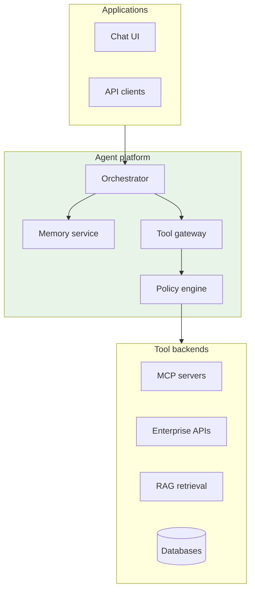
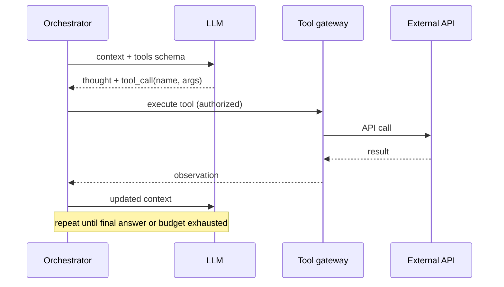
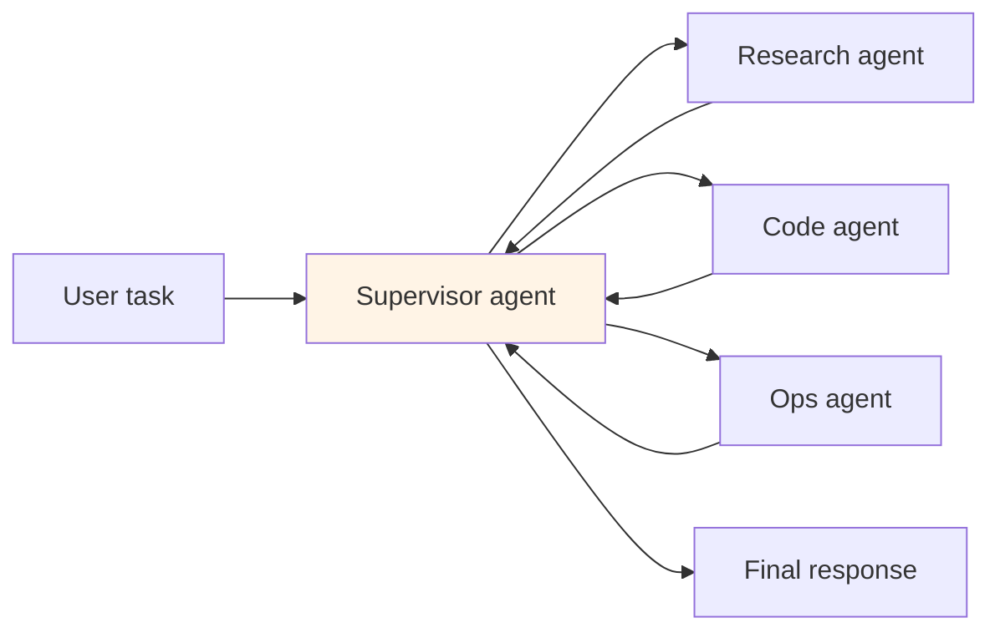

# Agent Platform Architecture

## 1. Executive Summary

An **agent platform** enables LLM-powered systems to **plan**, **invoke tools**, **maintain state**, and **execute multi-step workflows** autonomously within policy bounds. Unlike single-shot chat completion, agents run **loops**: observe context → reason → select tool → execute → incorporate result → repeat until termination. Production platforms provide **orchestration runtimes** (LangGraph, Temporal-backed agents, custom state machines), **tool registries** with schema validation, **Model Context Protocol (MCP)** for standardized tool connectivity, **memory** (short-term conversation, long-term vector store), and **observability** (trace spans per tool call).

Principal architects design agent platforms as **distributed control systems** with explicit **safety boundaries**, **idempotent tools**, **timeout budgets**, and **human-in-the-loop** escalation paths. The failure mode is not slow inference—it is **unbounded action loops**, **cascading side effects**, and **unaudited autonomous changes** to production systems.

Platform maturity is measured by **tool catalog discipline**, **trace completeness**, and **eval-gated promotions—not demo task completion rates**. Executive stakeholders should see agent roadmaps as **control-plane investments**, not chatbot features.

## 2. Why This Topic Matters

Agent architecture is the 2024–2026 principal interview frontier:

- **ReAct vs plan-and-execute?** — Loop structure and reliability.
- **Tool design for agents?** — Idempotency, least privilege, schema.
- **MCP vs custom integrations?** — Standardization tradeoffs.
- **State management?** — Checkpointing long-running workflows.
- **Multi-agent coordination?** — Supervisor patterns, message buses.

Teams shipping "GPT with plugins" without orchestration discipline create **incident generators**.

Interviewers now expect **blast-radius analysis**: which tools can mutate production, what budgets stop runaway loops, and how traces support post-incident review. Demonstrate kill-switch and HITL paths on the whiteboard without prompting. Name the tool gateway as the trust boundary in every answer. Step budgets and idempotent tools are as important as model selection in production agent architecture. Durable orchestration is required for any agent that mutates production state. Interview answers should always name max steps, tool policy, and audit logging together.

## 3. Problems Being Solved

| Problem | Agent platform approach |
|---------|------------------------|
| **Multi-step task completion** | Tool loop with planning |
| **Access to enterprise systems** | Authenticated tool gateway |
| **Long-running workflows** | Durable execution + checkpoints |
| **Consistency across sessions** | Memory stores |
| **Developer velocity** | Reusable tools and agent templates |
| **Audit and compliance** | Trace every action and decision |

### Workload fit matrix

| Use case | Agent fit | Caveat |
|----------|-----------|--------|
| IT ticket triage + fix | Strong | HITL for destructive ops |
| Research synthesis | Strong | Tool budget limits |
| Deterministic ETL | Weak | Use workflow engine |
| Real-time trading | Weak | Latency + safety |
| Customer refund automation | Moderate | Policy engine required |
| Code migration assistant | Strong | Sandboxed execution |

## 4. Assumptions and System Model

| Assumption | Implication |
|------------|-------------|
| **LLM is non-deterministic** | Retry, validation, guardrails required |
| **Tools have side effects** | Idempotency keys, approval gates |
| **Execution is bounded** | Max steps, max tokens, wall-clock timeout |
| **Observability is mandatory** | OpenTelemetry-style traces |
| **Humans retain override** | Kill switch and escalation |

**Safety:** Tools execute only with authorized credentials; destructive actions require policy match. **Liveness:** Agent must terminate or escalate within budget—no infinite loops.

## 5. Essential Terminology

| Term | Definition |
|------|------------|
| **Agent loop** | Iterative reason-act-observe cycle |
| **Tool / function calling** | Structured LLM output invoking external API |
| **ReAct** | Reasoning + Acting interleaved pattern |
| **Plan-and-execute** | Plan first, then execute steps |
| **MCP** | Model Context Protocol for tool/resource servers |
| **Orchestrator** | Runtime managing agent state and routing |
| **Supervisor agent** | Delegates to specialist sub-agents |
| **Checkpoint** | Persisted agent state for resume |
| **HITL** | Human-in-the-loop approval |
| **Tool budget** | Max invocations per session |

## 6. Core Mechanism

### 6.1 Agent platform layers



*Figure 1: Orchestrator coordinates LLM loops; tool gateway enforces policy before side effects.*

### 6.2 ReAct loop



*Figure 2: Each iteration extends context with tool observations until termination condition.*

### 6.3 Multi-agent supervisor pattern



*Figure 3: Supervisor delegates subtasks; aggregates results with global budget.*

## 7. Step-by-Step Walkthrough

### Walkthrough A: Support ticket agent

1. User pastes ticket; orchestrator loads session memory.
2. LLM calls `search_kb` tool (RAG); receives policy chunks.
3. LLM calls `lookup_customer` with `customer_id`; CRM returns account.
4. Policy: refund &lt; $50 auto-approved; else `request_approval` HITL tool.
5. Human approves; `issue_refund` idempotent tool executes.
6. Trace exported to observability; session archived.

### Walkthrough B: Durable workflow agent (Temporal-style)

1. Long migration agent starts; checkpoint after each file processed.
2. Worker crash at step 47; workflow resumes from checkpoint.
3. Tool calls wrapped in activities with retry policies.
4. **Safety:** activity idempotency keys on object storage writes.

### Walkthrough C: MCP tool registration

1. Developer publishes MCP server exposing `git_log` resource.
2. Platform discovers tools via MCP handshake; registers schemas.
3. Agent runtime includes tools in LLM function list.
4. Version bump of MCP server triggers platform re-registration.

### Walkthrough D: Budget exhaustion

1. Agent loops 15 times without resolution; step budget = 12.
2. Orchestrator forces summarization prompt or escalates to human.
3. Partial work persisted; user notified with trace link.

### Walkthrough E: Parallel tool execution

1. Agent needs `get_weather(city)` and `get_flight_status(flight)`—independent tools.
2. Orchestrator issues parallel tool calls after single LLM turn returns both.
3. Observations merged before next LLM turn—reduces wall-clock vs sequential.
4. Policy engine allows parallel only for read tools; writes remain serial.
5. Trace shows fork/join spans for latency analysis.

### Walkthrough F: Agent versioning and rollback

1. Agent `support-v3` promoted after eval pass; canary 5% traffic.
2. Regression: `refund` tool error rate 3× baseline in canary.
3. Automatic rollback to `support-v2` via feature flag; kill switch not required.
4. Postmortem: tool schema change broke argument validation—add contract test in CI.
5. Registry marks v3 `deprecated`; owners notified.

### Tool design standards (platform policy)

| Rule | Rationale |
|------|-----------|
| Read tools idempotent | Safe retry |
| Write tools require idempotency key | Durable workflow replay |
| Max 20 tools per agent | LLM selection accuracy |
| JSON Schema strict mode | Reduce hallucinated args |
| Timeout per tool &lt; 30s default | Bound agent loop |
| No raw SQL tool | Use parameterized query tool |
| Audit log every invocation | Compliance |

## 8. Invariants and Guarantees

| Property | Guarantee |
|----------|-----------|
| **Authorization** | Tools run with scoped service identity |
| **Bounded execution** | Max steps/time/tokens enforced |
| **Auditability** | Immutable trace of tool calls |
| **Idempotent retries** | Safe activity replay in durable workflows |
| **Policy before side effect** | No bypass of approval for destructive tools |

Agents do **not** guarantee correct task completion—only bounded, auditable attempts.

## 9. Failure Scenarios

| Failure | Behavior | Mitigation |
|---------|----------|------------|
| **Infinite tool loop** | Cost spike | Step budget; duplicate detection |
| **Hallucinated tool args** | API errors | JSON schema validation |
| **Tool timeout** | Partial state | Retry with backoff; compensating action |
| **Over-privileged tool** | Security incident | Least privilege; scoped tokens |
| **Prompt injection via tool output** | Unsafe next action | Sanitize observations |
| **Sub-agent divergence** | Inconsistent answer | Supervisor reconciliation |
| **Checkpoint corruption** | Workflow stuck | Versioned state schema |

## 10. Performance Characteristics

| Dimension | Behavior |
|-----------|----------|
| Latency | Sum of LLM calls + tool RTTs × steps |
| Cost | Tokens × steps + tool API charges |
| Throughput | Limited by LLM rate and tool backends |
| Parallelism | Independent tools may run concurrent |
| Cold start | Tool connection pools; MCP handshake |

Agent tasks measured in **seconds to minutes**, not milliseconds.

## 11. Scalability Limits

- **Context window** caps history + tool outputs.
- **Tool backend rate limits** bound agent fleet scale.
- **Supervisor fan-out** complexity grows with sub-agents.
- **Trace storage** volume at high QPS.
- **HITL queue** human bottleneck for approvals.

## 12. Operational Considerations

- **SLOs**: p95 task completion time, escalation rate, tool error rate.
- **Tool catalog** with owners, SLAs, deprecation policy.
- **Sandbox** for code-execution agents.
- **Kill switch** per agent definition and globally.
- **Eval suites**: task success rate on golden scenarios.
- Version **prompts and tool schemas** like API contracts.
- **Tool latency SLOs** per tool; circuit break slow backends.
- **Agent version pinning** in production; blue/green via feature flags.
- **Monthly tool audit**: remove unused tools from agent definitions.
- **Runaway loop detector**: alert when same tool called &gt;3 times with similar args.

## 13. Security Considerations

- **OAuth device flow** or service accounts per tool—never user password in prompt.
- **Network egress** restrictions from tool gateway.
- **Secrets** injected at runtime, not in LLM context.
- **Output filtering** before displaying to user.
- **MCP server trust** model—signed plugins, allowlist.

## 14. Cost Considerations

- **Token burn** from verbose tool outputs—compress observations.
- **LLM tiering**: small model for routing, large for synthesis.
- **Tool API charges** (search, CRM) multiply per step.
- **Human approval** labor—automate only within policy thresholds.
- **Trace storage** retention policies.

### Durable vs ephemeral agent sessions

| Session type | Runtime | Use case |
|--------------|---------|----------|
| Ephemeral chat | In-memory orchestrator | FAQ, low risk |
| Durable workflow | Temporal/Cadence | Multi-hour migrations |
| Scheduled agent | Cron + checkpoint | Nightly reports |

Mixing ephemeral runtime with write tools is an incident pattern—always match durability to blast radius.

### MCP ecosystem governance

MCP servers are plugins with network access. Platform policy should require: signed artifacts, security review for scopes, version pinning, and sandbox network policies for third-party servers. **MCP is not a security boundary**—the tool gateway remains authoritative. Principal architects reject "any developer can publish MCP to prod" without supply chain controls analogous to npm package promotion.

### Multi-agent coordination pitfalls

Supervisor patterns fail when sub-agents have **overlapping write scopes** or **contradictory goals**. Define exclusive tool ownership per sub-agent; supervisor aggregates read-only results unless explicitly delegating a single write path. Log supervisor routing decisions for debugging infinite delegate loops between research and code agents.

## 15. Production Implementations

### Case study: Internal devops agent (illustrative)

#### Context

Engineers query k8s status and restart pods via natural language; SOC2 audit required.

#### Architecture

LangGraph orchestrator; read-only tools default; `restart_pod` requires HITL + change ticket ID. MCP servers for kubectl wrapper and Grafana. Traces in Datadog.

#### Outcomes

60% ticket deflection for read queries; zero unauthorized restarts in 6 months (illustrative).

#### Extended operations narrative

Agent once looped 11 times calling `search_logs` with near-duplicate queries—step budget fired, escalated to human. Root cause: vague system prompt; fix added "stop when logs sufficient" and reduced tool count from 18 to 9. MCP server version 2.1 introduced breaking schema; platform CI caught mismatch before prod promotion. Durable Temporal workflow for migration agent survived 6-hour run with two worker restarts—checkpoint proved value.

#### Tradeoffs

| Choice | Tradeoff |
|--------|----------|
| LangGraph | Flexibility vs custom state machine |
| MCP | Standard vs build adapters |
| HITL on writes | Latency vs safety |

## 16. Alternatives and Tradeoffs

| Pattern | Pros | Cons |
|---------|------|------|
| **Single-shot RAG** | Simple | No actions |
| **Deterministic workflow** | Predictable | Brittle to NL |
| **ReAct agent** | Flexible | Loop risk |
| **Plan-and-execute** | Structured | Plan drift |
| **Multi-agent** | Specialization | Coordination cost |

## 17. Common Misconceptions

| Misconception | Reality |
|---------------|---------|
| "Agents replace workflows" | Complement; use each appropriately |
| "More tools = better" | Tool selection accuracy drops |
| "LLM will know when to stop" | Hard budgets required |
| "MCP solves security" | Still need policy gateway |
| "Autonomy without audit" | Unacceptable in enterprise |

## 18. Principal Architect Perspective

1. **Tool gateway is the trust boundary**—not the LLM.
2. **Default read-only**; escalate writes through policy.
3. **Durable execution** for anything &gt; 30 seconds.
4. **Eval-driven rollout** with golden tasks per agent.
5. **MCP for ecosystem**; custom only when necessary.

Agent platforms succeed when **tools are fewer, sharper, and policy-wrapped**—not when every API in the company is exposed to the LLM. Curate tool surfaces like public API products with owners and SLAs. Multi-agent designs need **exclusive write domains** to prevent conflicting side effects.

### Operating playbook (first 90 days)

**Days 1–30:** Agent registry live; no production agent without owner and risk tier. Tool gateway enforces read-only default.

**Days 31–60:** HITL workflow for all write tools above low-risk threshold. Tracing integrated with existing APM.

**Days 61–90:** Eval harness blocks promotion on safety regression. Kill switch drill completed and documented.

## 19. Architecture Review Exercise

**Scenario:** Agent has direct production DB write tool with admin credentials embedded in env shared across tenants.

**Findings:** Critical vulnerability. Scoped read replicas, per-tenant credentials, HITL, query allowlist.

## 20. Whiteboard Explanation

"An agent platform wraps the LLM in an orchestration loop. The user gives a goal; the orchestrator sends context and available tool schemas to the model. The model returns either a final answer or a structured tool call. The tool gateway authenticates, checks policy, executes the API, and returns an observation that gets appended to context. This repeats until done or a step budget fires. For long tasks, we checkpoint state in a durable workflow engine. MCP standardizes how tool servers expose capabilities. Multi-agent setups use a supervisor to delegate to specialists. Every step is traced for audit."

**Principal addendum:** Tool gateway is the trust boundary. Default read-only; durable runtime for writes. Step budgets and idempotent tools are non-negotiable.

## 21. Interview Questions

1. **Agent vs chat completion?** — Multi-step tool loop vs single response.
2. **ReAct pattern?** — Interleaved reasoning and tool use.
3. **Tool schema purpose?** — Constrain LLM outputs to valid calls.
4. **MCP role?** — Standard protocol for tools/resources.
5. **Why tool gateway?** — Policy, auth, audit centralization.
6. **HITL when?** — High-risk or ambiguous actions.
7. **Checkpointing why?** — Resume long workflows after failure.
8. **Supervisor pattern?** — Delegate subtasks to specialist agents.
9. **Infinite loop prevention?** — Step/time/token budgets.
10. **Idempotent tools?** — Safe retries in durable execution.
11. **Plan-and-execute vs ReAct?** — Upfront plan vs adaptive loop.
12. **Memory types?** — Short conversation vs long-term vector store.
13. **Tool output injection risk?** — Sanitize before re-prompting.
14. **Eval agent quality?** — Golden tasks, success rate, safety tests.

### Scoring rubric (principal)

| Dimension | Strong | Weak |
|-----------|--------|------|
| Architecture | Orchestrator + gateway + policy | "GPT + APIs" |
| Safety | HITL, budgets, least privilege | Full autonomy |
| Ops | Traces, checkpoints, evals | Demo-only |
| Tools | Idempotency, schema | Raw SQL access |

### Extended scoring notes

**Principal bar:** Tool gateway as trust boundary; step budgets; durable vs ephemeral runtime match. **Weak hire:** LangChain mention without policy or audit.

15. **Temporal vs in-memory orchestrator?** — Durability for long workflows.
16. **Tool output injection defense?** — Sanitize observations.
17. **Max tools per agent why?** — LLM selection accuracy degrades.

## 22. Interview Follow-Ups

1. **Design agent to deploy canary K8s service.** — Read tools auto; deploy HITL; Temporal workflow.
2. **15-step loop on simple query.** — Tune prompts; reduce tools; add duplicate detection.
3. **MCP vs internal REST tools.** — Standardization vs control; hybrid common.
4. **Multi-tenant agent platform.** — Separate credentials, traces, memory namespaces.
5. **Cost cap per session.** — Token + tool budget; downgrade model on approach.

### Additional principal scenarios

**Scenario:** Developer wants agent with 50 tools including production kubectl. **Answer:** Deny broad kubectl; provide read-only `get pods` and HITL-gated `rollout restart` with ticket ID validation.

**Scenario:** Multi-agent debate produces conflicting answers to user. **Answer:** Supervisor synthesizes with single final LLM call; cap delegate rounds; log disagreement for eval.

**Scenario:** MCP plugin update exfiltrates data via new tool. **Answer:** Signed plugins; version pinning; gateway allowlist; supply chain review same as production dependency promotion.

## 23. Strong Answer Example

**Question:** "How would you architect a safe enterprise agent platform?"

**Strong outline:** "I'd place a durable orchestrator—LangGraph or Temporal-backed—between clients and the LLM, with explicit max steps, wall-clock timeout, and token budgets. All tools route through a gateway that enforces OAuth-scoped service identities, JSON schema validation on arguments, and a policy engine classifying tools as read, write, or approval-required. Destructive tools block until HITL approval with ticket linkage. Tools must be idempotent with client-supplied keys for retries. MCP servers register capabilities centrally, but trust is enforced at the gateway, not by the protocol alone. Every loop iteration emits OpenTelemetry spans with tool name, latency, and outcome—never raw secrets. Eval harness runs golden tasks before each agent version promotion. Default deny on new tools until security review."

## 24. Weak Answer Example

**Weak:** "Use LangChain to connect GPT to our APIs; give it admin access so it can fix things fast."

**Red flags:** No policy, budgets, audit, or idempotency.

## 25. Hands-On Exercise

**Lab:** `labs/lab-016-agentic-ai-platform/` — agent gateway on **`:8106`**

```bash
cd labs/lab-016-agentic-ai-platform
python3 -m venv .venv && source .venv/bin/activate
pip install -r requirements.txt
pytest tests/ -v
docker compose -p lab016 -f docker/docker-compose.yml up --build -d
chmod +x scripts/demo_agent.sh && ./scripts/demo_agent.sh
```

| Step | Endpoint | What happens |
|------|----------|--------------|
| 1 | `POST /v1/agents/run` | ReAct loop with step budget |
| 2 | `GET /v1/agents/runs` | Audit trail of tool calls |
| 3 | `POST /v1/tools/invoke` | `search_kb` — auto-approved tool |
| 4 | `POST /v1/tools/invoke` | `send_email` — HITL approval gate |
| 5 | Policy engine | JSON schema validation + idempotency keys |

**Swagger:** http://localhost:8106/docs

### Engineer guide: how the local stack works

1. **Agent gateway** — auth, rate limits, and policy enforcement before runtime.
2. **ReAct runtime** — reason → act (tool) → observe loop with max step budget.
3. **Tool registry** — schema-validated arguments; dangerous tools require human approval.
4. **Audit log** — every tool invocation persisted with trace ID for compliance replay.
5. **Idempotency** — duplicate `run_id` / tool keys safe on retry (payments, tickets).

Pairs with [OpenAI LLM Gateway](/docs/real-world-scenarios/openai-llm-gateway).

### Build-from-scratch exercise (optional)

1. Build ReAct loop with 3 mock tools and step budget.
2. Add JSON schema validation on tool arguments.
3. Integrate MCP server locally; register one resource.
4. Simulate tool failure; verify retry and escalation.
5. Export trace JSON for one multi-step session.

## 26. Knowledge Check

1. Agent loop steps? *(Reason, act, observe, repeat.)*
2. Tool gateway role? *(Auth, policy, execution.)*
3. MCP standardizes? *(Tool/resource connectivity.)*
4. ReAct combines? *(Reasoning and acting.)*
5. HITL purpose? *(Human approval for risky actions.)*
6. Checkpoint enables? *(Durable resume.)*
7. Step budget prevents? *(Infinite loops.)*
8. Idempotent tools for? *(Safe retries.)*
9. Supervisor agent? *(Delegates to sub-agents.)*
10. Trace purpose? *(Audit and debug.)*
11. Plan-and-execute vs ReAct? *(Upfront plan vs adaptive loop.)*
12. Durable workflow for? *(Long-running multi-step tasks.)*
13. Tool schema validates? *(LLM argument structure.)*

## 27. Flashcards

| Front | Back |
|-------|------|
| Agent loop | Reason-act-observe cycle |
| Tool calling | Structured LLM API invocation |
| ReAct | Interleaved reasoning and tools |
| MCP | Model Context Protocol |
| Tool gateway | Policy-enforced tool execution |
| HITL | Human-in-the-loop approval |
| Checkpoint | Persisted agent workflow state |
| Supervisor agent | Coordinates specialist agents |
| Tool budget | Max tool calls per session |
| Plan-and-execute | Plan first, then execute steps |

## 28. Cheat Sheet

```
PLATFORM LAYERS
  App → Orchestrator → LLM + Memory + Tool gateway → Backends

SAFETY
  Budgets, HITL, least privilege, idempotent tools, traces

PATTERNS
  ReAct | Plan-execute | Supervisor multi-agent

MCP
  Standard tool servers; gateway still enforces policy

PRINCIPAL ANCHORS
  Tool gateway = trust boundary
  Step budget mandatory
  HITL for writes
  Idempotent tools
  Durable for long tasks
  Fewer tools better
  Trace every invocation
  MCP not security layer
```

## 29. Related Concepts

- [LLM Serving and Model Gateways](/docs/ai-distributed-systems/llm-serving-and-model-gateways) — inference tier
- [RAG Architecture](/docs/ai-distributed-systems/rag-architecture) — retrieval as tool
- [Agent Governance and Safety](/docs/agentic-ai-architecture/agent-governance-and-safety) — policy layer
- [Sagas](/docs/transactions/sagas) — compensating multi-step workflows
- [Event-Driven Architecture](/docs/messaging-and-streaming/event-driven-architecture) — async agent events

## 30. References

### Primary sources

- Yao, S., et al. (2023). *ReAct: Synergizing Reasoning and Acting in Language Models.* ICLR.
- Anthropic Model Context Protocol specification — tool server standard.
- LangGraph, Temporal documentation — orchestration implementation choices.

### Related

- OpenAI function calling / tools API documentation.
- OWASP LLM Top 10 — agent security risks.

### Principal study path

Read [Agent Governance and Safety](/docs/agentic-ai-architecture/agent-governance-and-safety) next, then [LLM Serving and Model Gateways](/docs/ai-distributed-systems/llm-serving-and-model-gateways), [RAG Architecture](/docs/ai-distributed-systems/rag-architecture), [Sagas](/docs/transactions/sagas) for compensating workflows, and [Event-Driven Architecture](/docs/messaging-and-streaming/event-driven-architecture) for async agent patterns. Boards increasingly ask for agent blast-radius diagrams—prepare one per high-tier agent.

### Distinction

| Claim | Type |
|-------|------|
| ReAct pattern | Published research |
| MCP protocol | Anthropic-led standard—verify current spec |
| Platform feature sets | Vendor implementation |
