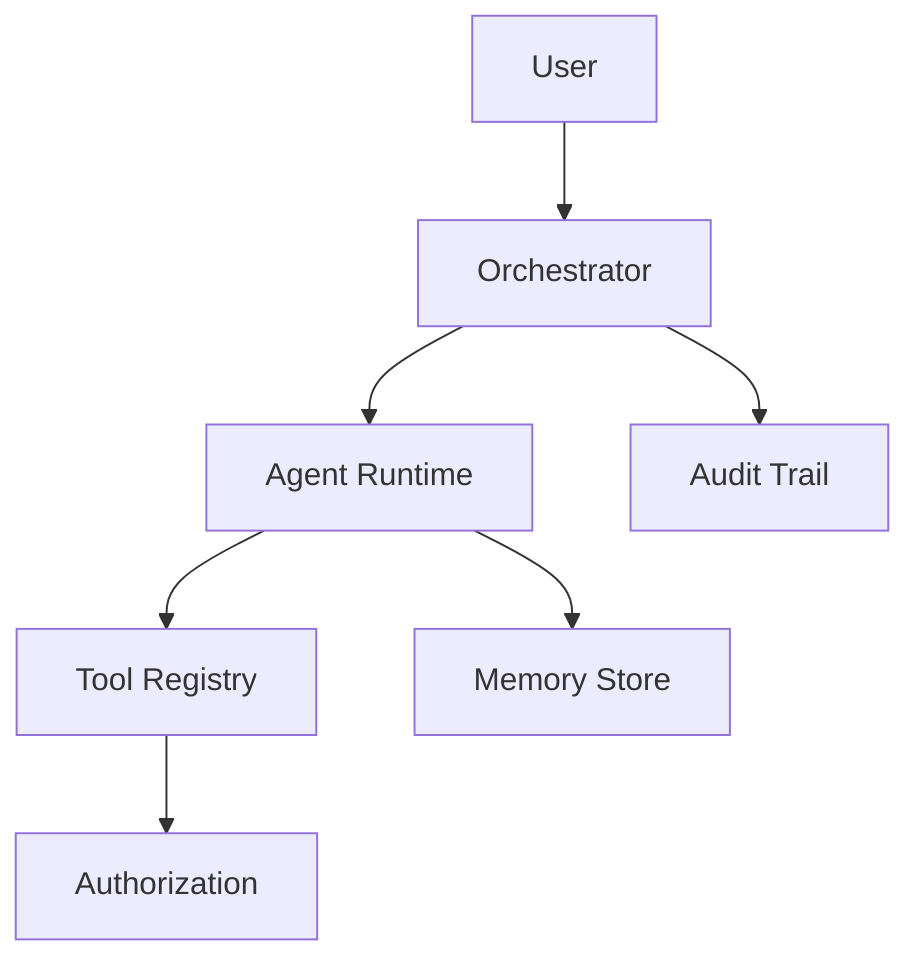

# Agentic AI Architecture

Agents, tools, orchestration, MCP, governance, and evaluation.

*Figure: Agentic platform — orchestration, tools, memory, and governance.*

## Chapters

| Chapter | Focus |
|---------|-------|
| Agent Platform Architecture | [Agent Platform Architecture](/docs/agentic-ai-architecture/agent-platform-architecture) |
| Agent Governance and Safety | [Agent Governance and Safety](/docs/agentic-ai-architecture/agent-governance-and-safety) |

## Learning Path

1. Start with **Agent Platform Architecture** for orchestration, tool use, and multi-agent coordination.
2. Finish with **Agent Governance and Safety** for guardrails, audit trails, and human-in-the-loop controls.

## Interview Prep

| Resource | Topic |
|----------|-------|
| [OpenAI LLM Gateway](/docs/real-world-scenarios/openai-llm-gateway) | Gateway + agent integration |
| [Lab 016 agent platform](/docs/agentic-ai-architecture/agent-platform-architecture#25-hands-on-exercise) | ReAct + tool gateway on `:8106` |

## Related Domains

- [AI Distributed Systems](/docs/ai-distributed-systems/overview)
- [Security Architecture](/docs/security/overview)

Return to the [Curriculum Overview](/docs/start-here/curriculum-overview) to see how this domain fits the learning path.
