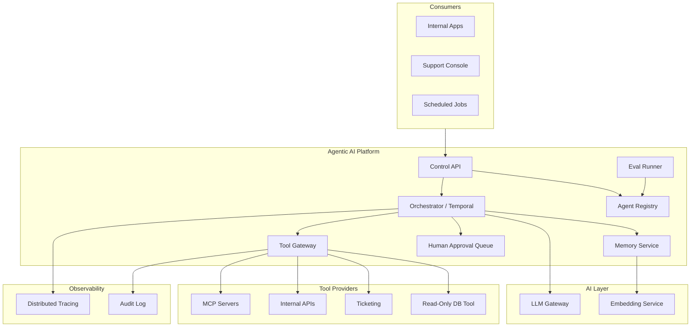
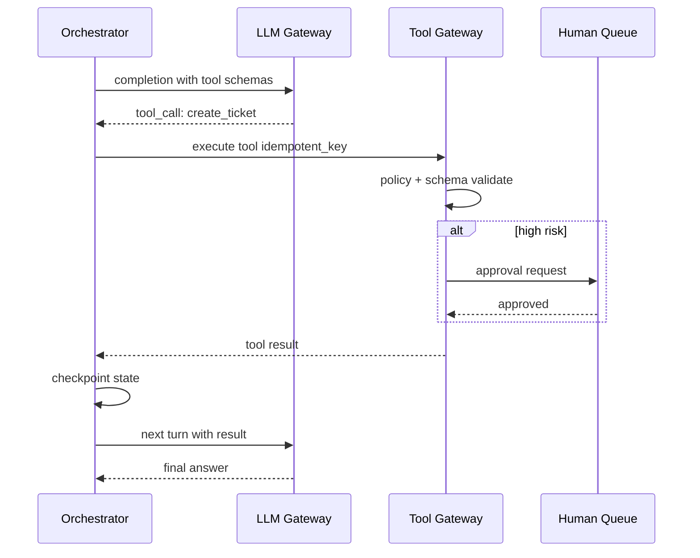
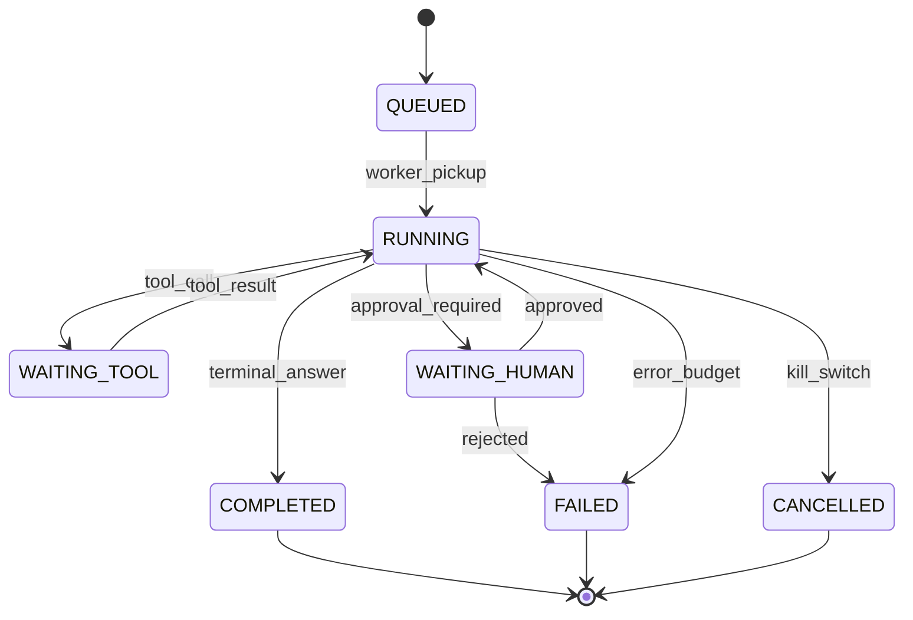

# Agentic AI Platform Design

## 1. Executive Summary

An **agentic AI platform** enables organizations to build, deploy, and govern **autonomous LLM workflows** that plan, invoke tools, maintain state, and complete multi-step tasks within explicit policy bounds. Unlike a single chat endpoint, agent platforms provide **orchestration runtimes** (state machines, durable workflows), **tool registries** with schema validation and least-privilege credentials, **memory tiers** (session, episodic, organizational knowledge), **human-in-the-loop (HITL)** escalation, and **observability** with per-step traces.

Principal architects design agent platforms as **distributed control systems**: bounded loops, idempotent tools, blast-radius limits, and kill switches—not "GPT with plugins." This chapter extends [Agent Platform Architecture](/docs/agentic-ai-architecture/agent-platform-architecture) with enterprise system-design depth: multi-tenant platform serving 200+ agent definitions, 5K concurrent runs, integration with [LLM Gateway](/docs/system-design/llm-gateway) for model access, and eval-gated promotion to production.

Safety: agents cannot invoke destructive tools without policy match and optional human approval. Liveness: every run terminates, escalates, or hits wall-clock timeout—no infinite loops.

## 2. Why This Topic Matters

Agent failures are **action failures**, not slow pages:

- **Unbounded tool loops** rack up inference cost and corrupt data.
- **Over-privileged tools** let compromised prompts drop databases.
- **Non-idempotent tools** double-charge or duplicate tickets on retry.
- **Missing traces** make agent incidents undebuggable.

2025–2026 principal interviews probe ReAct vs plan-and-execute, Model Context Protocol (MCP) standardization, durable execution with Temporal, and organizational governance. Candidates who only demo LangChain notebooks without blast-radius analysis fail senior bars.

## 3. Problems Being Solved

| Problem | Platform capability |
|---------|---------------------|
| **Ad-hoc agent scripts** | Registered agent definitions with versioning |
| **Tool sprawl** | Central catalog with auth and schema |
| **Runaway autonomy** | Step budget, token cap, timeout |
| **Non-deterministic failures** | Durable checkpoints; replay |
| **Compliance** | Audit every tool invocation |
| **Human oversight** | HITL queues for high-risk actions |
| **Multi-team reuse** | Shared tools; tenant isolation |
| **Quality regression** | Eval harness before promotion |

## 4. Assumptions and System Model

### Functional

- Register agent: system prompt, tool allowlist, max_steps=20, timeout=10m.
- Execute run: `POST /agents/{id}/runs` with input + optional session_id.
- Tool gateway validates JSON schema; executes with service credentials.
- HITL: pause run when tool risk_score &gt; threshold; resume on approval.
- Memory: session context in Redis; long-term in vector store (optional).
- MCP servers register as tool providers.

### Non-functional

- Orchestrator availability 99.9%.
- P99 scheduling latency &lt; 200 ms (excluding LLM/tool time).
- 5K concurrent runs; horizontal worker scale.
- Trace completeness: 100% of tool calls span-exported.

| Assumption | Implication |
|------------|-------------|
| **LLM is unreliable planner** | Validate tool args; retry with bounds |
| **Tools have side effects** | Idempotency keys mandatory for mutators |
| **Humans retain override** | Kill switch per run and global |
| **Eval sets exist per agent** | No promotion without benchmark pass |
| **Tenants isolated** | Separate tool creds and memory namespaces |

## 5. Essential Terminology

| Term | Definition |
|------|------------|
| **Agent loop** | Reason → tool select → execute → observe cycle |
| **Tool / function calling** | Structured LLM output invoking API |
| **ReAct** | Interleaved reasoning and acting |
| **Plan-and-execute** | Plan phase then execution phase |
| **MCP** | Model Context Protocol for tool servers |
| **HITL** | Human-in-the-loop approval gate |
| **Durable execution** | Workflow survives worker crash |
| **Checkpoint** | Persisted run state for resume |
| **Tool gateway** | Policy-enforced tool invocation layer |
| **Blast radius** | Max damage from single compromised run |
| **Eval harness** | Automated quality benchmark suite |
| **Kill switch** | Emergency run termination API |

## 6. Core Mechanism

### 6.1 Platform architecture



*Figure 1: Agent platform—orchestrator coordinates LLM and tool gateway; registry and eval gate promotions.*

### 6.2 Agent run loop



*Figure 2: Single loop iteration with optional HITL gate on risky tools.*

### 6.3 Run state machine



*Figure 3: Durable run states—checkpoints survive worker restarts.*

### 6.4 Deep dives

**Tool design standards:**

| Tool type | Idempotency | Auth |
|-----------|-------------|------|
| Read search | Optional | Read scope |
| Create ticket | Required key | Write scoped |
| Refund payment | Required + HITL | Finance role |
| Execute SQL | Deny by default | Never raw SQL agent |

**Orchestration patterns:**

- **ReAct:** flexible; higher token cost; good for exploratory tasks.
- **Plan-and-execute:** plan JSON validated before tools; better for SOP-following.
- **Supervisor multi-agent:** router delegates to specialist agents—adds coordination overhead.

**Memory tiers:**

1. **Working:** current run messages in orchestrator state.
2. **Session:** Redis TTL 24h for returning user context.
3. **Organizational:** RAG over approved knowledge—see [RAG Architecture](/docs/ai-distributed-systems/rag-architecture).

**Promotion pipeline:**

1. Dev agent version passes unit tool mocks.
2. Eval harness: 50 golden tasks, min 90% success.
3. Shadow mode: 5% production traffic compare.
4. ADR + [Architecture Governance](/docs/architecture-leadership/architecture-governance) sign-off.

## 7. Step-by-Step Walkthrough

### 7.1 IT support triage agent

1. Employee Slack message triggers run with `session_id`.
2. Agent searches KB (read tool); drafts resolution.
3. If needs ticket: `create_ticket` with idempotency key from run_id+step.
4. Ticket created; agent replies with link; run COMPLETED.

### 7.2 Refund agent with HITL

1. Customer requests $500 refund; agent proposes `issue_refund`.
2. Tool gateway risk_score=high → WAITING_HUMAN.
3. Finance analyst approves in console; tool executes.
4. Run resumes; customer notified.

### 7.3 Runaway loop containment

1. Agent repeatedly calls search without progress; step_count=20.
2. Orchestrator terminates FAILED; alert to owner team.
3. Post-incident: tighten system prompt; reduce max_steps.

### 7.4 Worker crash mid-run

1. Worker dies after tool result received before checkpoint.
2. Temporal replays from last checkpoint; tool idempotency prevents duplicate ticket.
3. Run completes without user-visible duplicate.

### 7.5 Compliance audit export

1. Regulator requests all agent actions affecting customer PII in 90-day window.
2. Query trace backend: `service.name=tool-gateway AND tool.name IN (...)` with `tenant_id` filter.
3. Join HITL approval records with trace `span_id` correlation.
4. Redact prompt content; include tool args hash and approver identity.
5. **Principal:** audit architecture designed before audit request—not ad hoc log grep.

## 7A. Safety Property Checklist

| Property | Enforcement layer |
|----------|---------------------|
| Max steps | Orchestrator counter |
| Tool allowlist | Registry per agent version |
| Idempotent writes | Tool gateway dedup store |
| HITL for T3 tools | Policy engine risk score |
| Kill switch | Control API + gateway budget revoke |
| Trace completeness | OTel SDK mandatory on tool path |

## 8. Invariants and Guarantees

| Property | Type | Mechanism |
|----------|------|-----------|
| **Max steps enforced** | Safety | Counter in orchestrator |
| **Tool allowlist** | Safety | Registry per agent version |
| **Idempotent mutators** | Safety | Idempotency key required |
| **HITL for high risk** | Safety | Policy engine on tool gateway |
| **Checkpoint durability** | Safety | Workflow engine persistence |
| **Run termination** | Liveness | Timeout + kill API |

## 9. Failure Scenarios

| Scenario | Mitigation |
|----------|------------|
| LLM hallucinates tool args | JSON schema reject; retry with error |
| Tool timeout | Compensating message; partial state in trace |
| HITL queue backlog | SLA alert; auto-reject after 24h policy |
| MCP server compromise | Tool signing; network policy; catalog review |
| Memory poisoning | Tenant-scoped retrieval; source citations |
| Duplicate run submit | Idempotent run creation key |
| Eval regression on deploy | Automated rollback of agent version |
| Global LLM outage | Queue runs; degrade to template responses |

## 10. Performance Characteristics

```
5K concurrent runs
Orchestrator schedule: &lt;200 ms p99
Typical run: 5-15 LLM calls × 2-10s each = 30s-3min wall clock
Tool gateway overhead: &lt;50 ms p99 excluding backend
Checkpoint write: async every step—&lt;10 ms
HITL wait: human minutes-hours—exclude from automation SLO
Token cost dominates—gateway budgets per run_id header
```

## 11. Scalability Limits

| Limit | Mitigation |
|-------|------------|
| Orchestrator history size | Prune old runs; archive to warehouse |
| Concurrent LLM calls | Queue per tenant; priority tiers |
| Tool gateway QPS | Pool connections; bulkhead per tool |
| MCP server fanout | Cache tool schemas; health checks |
| Trace volume | Sample low-risk runs; full trace for HITL |
| Registry complexity | Namespace per business unit |

## 12. Operational Considerations

- SLO: 99.9% orchestrator; agent success rate per eval baseline.
- Dashboards: runs/hour, step distribution, HITL queue depth, tool error rate.
- Runbooks: kill all runs for agent version; rotate MCP credentials.
- Weekly eval regression on production sample (shadow scoring).
- On-call: P1 if destructive tool without HITL; P2 orchestrator backlog.

## 13. Security Considerations

- Tool credentials via [Secrets Management Platform](/docs/system-design/secrets-management-platform)—never in prompts.
- Prompt injection defense: separate instructions from untrusted content markers.
- Sandboxed code execution isolated VMs if code tool enabled.
- MCP supply chain: signed server bundles; allowlist registry.
- Audit immutable: who approved HITL, what tool args.
- Align with [Agent Governance and Safety](/docs/agentic-ai-architecture/agent-governance-and-safety).

## 14. Cost Considerations

Token spend often 10–100× traditional API costs for agent runs. Platform must surface cost per run in UI. Cheaper models for planning, expensive for final synthesis—router integration with LLM gateway. Durable execution storage (Temporal) has retention cost—TTL policies.

## 15. Production Implementations

| System | Pattern |
|--------|---------|
| **Temporal + custom agents** | Durable workflows at scale |
| **LangGraph Platform** | State graph orchestration |
| **Microsoft Copilot Studio** | Enterprise agent builder |
| **Salesforce Agentforce** | CRM-integrated agents |
| **Internal platforms** | Custom tool gateway + registry |

## 16. Alternatives and Tradeoffs

| Decision | Tradeoff |
|----------|----------|
| ReAct vs plan-and-execute | Flexibility vs predictability |
| MCP vs bespoke tools | Standardization vs control |
| Sync vs async runs | UX vs scale for long tasks |
| Strong HITL vs autonomy | Safety vs throughput |
| Multi-agent vs single | Modularity vs coordination cost |
| Build vs buy orchestrator | Time vs customization |

## 17. Common Misconceptions

| Misconception | Reality |
|---------------|---------|
| "Agents replace workflows" | Deterministic ETL still needs workflow engine |
| "More tools = better" | Tool confusion hurts LLM accuracy |
| "Retries are safe" | Mutators need idempotency |
| "Tracing optional" | Tool audit is compliance requirement |
| "Demo accuracy = prod ready" | Eval harness on real tasks required |
| "MCP solves security" | Still need gateway policy |

## 18. Principal Architect Perspective

- **Tool gateway is the trust boundary**—not the LLM.
- **Design for failure of the planner**—validate everything.
- **HITL is a feature**, not admission of defeat.
- **Agent versioning like API versioning**—rollback path required.
- **Blast radius document** per agent before production.
- Executive narrative: **control plane investment**, not chatbot feature.

## 19. Architecture Review Exercise

**Scenario:** Team gives agent direct production DB write credentials for "speed."

**Review:** Unbounded blast radius; prompt injection → data loss. Mandate read-only tools, stored procedures with HITL, or ticket-based human execution.

## 20. Whiteboard Explanation

"Applications trigger registered agents on our orchestrator—Temporal for durability. Each turn calls the LLM gateway with tool schemas. The model may emit tool calls; our tool gateway validates schema, checks allowlist, enforces idempotency on writes, and routes high-risk actions to human approval. State checkpoints every step. Runs have max steps and wall timeout. MCP servers register tools into the catalog. Eval suite gates version promotion. Every tool call is traced and audited. Kill switch stops runaway loops. Memory is tenant-scoped with optional RAG over approved docs."

## 21. Interview Questions

1. **Design enterprise agent platform.** — *Signals:* orchestrator, tool gateway, HITL, eval. *Red flags:* script calling OpenAI.
2. **ReAct vs plan-and-execute?** — *Signals:* use case fit. *Follow-up:* token cost.
3. **Tool idempotency why?** — *Signals:* retry, replay. *Red flags:* ignore.
4. **HITL design for refunds?** — *Signals:* risk score, queue, audit.
5. **MCP vs internal tools?** — *Signals:* standardization, supply chain.
6. **Prevent infinite agent loop?** — *Signals:* max steps, timeout, kill API.
7. **Durable execution need?** — *Signals:* worker crash, replay. *Red flags:* in-memory only.
8. **Blast radius analysis?** — *Signals:* tool privilege tiers.
9. **Multi-agent when?** — *Signals:* specialization vs overhead.
10. **Prompt injection mitigation?** — *Signals:* content boundaries, tool policy.
11. **Eval before production?** — *Signals:* golden tasks, shadow mode.
12. **Cost control per run?** — *Signals:* LLM gateway session budget.

## 22. Interview Follow-Ups

1. **Tool returns 10MB JSON.** — Truncate/summarize; schema max size.
2. **Two agents deadlock waiting each other.** — Supervisor timeout; no circular delegation.
3. **Regulatory audit of agent decision.** — Export trace + HITL approval chain.

## 23. Strong Answer Example

**Q:** How design tool gateway for 100 tools?

**Outline:** Catalog with JSON schema, risk tier (read/low/medium/high), and required idempotency for mutators. Execution uses per-tool service account with least privilege. Policy engine evaluates agent_id + tool + args pattern. High tier → HITL. Rate limit per tool. All invocations emit OpenTelemetry span with redacted args hash. MCP servers register via signed manifest. No tool bypasses gateway—even "internal" HTTP.

## 24. Weak Answer Example

**Weak:** "Use LangChain agents with Python functions as tools."

**Red flags:** No durability, no HITL, no idempotency, no tenant isolation, no eval gate, no kill switch.

## 25. Hands-On Exercise

1. Build minimal orchestrator loop with max_steps=5.
2. Tool gateway with JSON schema validation and idempotency store.
3. Integrate LLM gateway for completions with tool calling.
4. Simulate worker crash; verify replay does not duplicate write.
5. **Extension:** HITL webhook approval flow.
6. **Extension:** Eval harness with 10 golden tasks and pass threshold.

## 26. Knowledge Check

1. Agent loop steps?
2. Why checkpoint after each tool call?
3. MCP purpose?
4. HITL trigger examples?
5. Idempotency key source for tool?
6. Kill switch scope options?
7. ReAct weakness?
8. Memory tier differences?
9. Eval shadow mode?
10. Tool gateway vs LLM gateway boundary?
11. Blast radius document contents?
12. When deny SQL tool entirely?

## 26A. Extended Knowledge Check

13. What span attributes prove HITL approval occurred?
14. How does Temporal replay interact with idempotent tools?
15. When is multi-agent architecture justified over single agent?
16. What kills an upstream LLM stream on run cancel?
17. Eval shadow mode purpose before full promotion?
18. MCP supply chain risk mitigations?

## 27. Flashcards

| Front | Back |
|-------|------|
| Agent loop | Reason, tool, observe cycle |
| Tool gateway | Policy-enforced tool execution |
| HITL | Human approval for risky actions |
| Checkpoint | Durable run state snapshot |
| MCP | Standard tool server protocol |
| max_steps | Loop iteration cap |
| Idempotency key | Prevents duplicate side effects |
| Eval harness | Quality gate for promotion |
| Kill switch | Emergency run termination |
| ReAct | Interleaved reasoning acting |
| Blast radius | Max damage from one run |
| Temporal | Durable workflow engine example |

## 28. Cheat Sheet

```
COMPONENTS: registry, orchestrator, tool gateway, LLM gateway, memory, HITL
RUN: queued → running → tool/human waits → completed/failed
LIMITS: max_steps, timeout, token budget per run
TOOLS: schema validate, allowlist, idempotency on writes, risk tiers
MCP: signed catalog registration
DURABLE: checkpoint each step; replay safe
SAFETY: HITL high-risk; kill switch; audit all tools
PROMOTION: eval → shadow → ADR
OBSERVE: full trace; cost per run
NEVER: raw prod DB creds in agent
```

## 28A. Principal Interview Deep Dive

### Tool risk tiering rubric

| Tier | Examples | Controls |
|------|----------|----------|
| T0 Read | Search KB, get order status | Schema validate; rate limit |
| T1 Low write | Create draft ticket | Idempotency key |
| T2 Medium write | Update customer profile | HITL if PII change |
| T3 High write | Issue refund, delete resource | Mandatory HITL + dual approval |
| T4 Forbidden | Raw SQL, shell exec on prod | Deny at gateway |

Principal whiteboard: draw tier table before any agent diagram—interviewers weight governance over clever prompts.

### Durable execution comparison

| Engine | Strength | Agent fit |
|--------|----------|-----------|
| Temporal | Long-running, saga, visibility | Production default for mutating agents |
| LangGraph | LLM-native state graphs | Rapid prototyping; verify durability |
| Step Functions | AWS-native | Limited loop complexity |
| In-memory loop | Simple | Unacceptable for prod side effects |

**Safety:** Checkpoint before external side effect. **Liveness:** Activity timeout returns control to orchestrator for escalation.

### Eval harness architecture

```
Golden tasks: 50+ realistic scenarios with expected tool sequence
Metrics: task success rate, wrong-tool rate, avg steps, cost per task
Regression gate: new agent version must be ≥ baseline - 2% on success
Shadow mode: run new version parallel without executing tools (dry-run trace)
Human review queue: sample 5% of prod runs for quality scoring
```

Connect eval failures to [Architecture Governance](/docs/architecture-leadership/architecture-governance)—block promotion without green eval.

### Multi-agent coordination patterns

| Pattern | When | Risk |
|---------|------|------|
| Supervisor | Specialist agents per domain | Supervisor bottleneck |
| Peer handoff | Sequential expertise | Context loss between agents |
| Parallel fan-out | Independent subtasks | Merge logic complexity |

Default recommendation: **single agent with curated tools** until proven insufficient—multi-agent adds coordination failure modes.

### Incident: agent issued 200 duplicate tickets

Contributing factors: missing idempotency on `create_ticket`; retry after timeout; no step budget. Corrective actions: mandatory idempotency key `run_id:step`; gateway dedup store; max_steps=15; postmortem links [Failure Analysis Methodology](/docs/production-failures/failure-analysis-methodology).

## 29. Related Concepts

- [Agent Platform Architecture](/docs/agentic-ai-architecture/agent-platform-architecture)
- [Agent Governance and Safety](/docs/agentic-ai-architecture/agent-governance-and-safety)
- [LLM Gateway](/docs/system-design/llm-gateway)
- [RAG Architecture](/docs/ai-distributed-systems/rag-architecture)
- [Event-Driven Architecture](/docs/messaging-and-streaming/event-driven-architecture)
- [Distributed Tracing](/docs/observability/distributed-tracing)
- [Failure Analysis Methodology](/docs/production-failures/failure-analysis-methodology)

## 19A. Extended Review Scenario

**Scenario B:** Agent workflow calls `delete_user` tool after prompt injection in support ticket body.

**Review:** Tool tier misclassification—destructive action without HITL. Untrusted content not sandboxed in prompt template. Fix: mark `delete_user` as T3 with mandatory human approval; separate system instructions from ticket content with delimiters; input classifier scores injection patterns; deny tool if confidence high. Add eval case with known injection corpus. Kill switch tested quarterly.

## 23A. Additional Strong Answer

**Q:** Compare Temporal vs in-memory LangGraph for production agents.

**Outline:** In-memory loses state on worker crash—unacceptable when tools mutate tickets, refunds, or infra. Temporal provides durable timers, retry policies, visibility UI, and saga compensation patterns. LangGraph excels for rapid graph iteration—can run *on* Temporal for production. Principal recommendation: LangGraph or equivalent for agent logic definition; Temporal (or similar) for durability when side effects exist. For read-only research agents, in-memory may suffice with session TTL. Decision ADR documents tradeoff per agent risk tier.

## 28B. Extended BOE Walkthrough (Interview Script)

**Interviewer:** "Build agent platform for IT support automation."

**Strong candidate:**

"IT support is good fit with HITL for destructive actions—not autonomous prod shell.

Orchestrator: Temporal for durable runs—checkpoint each tool call. Max 20 steps, 10-minute wall timeout, kill switch API.

Tool gateway: schema validate, idempotency on `create_ticket`, risk tier T3 for account deletion → human approval queue.

LLM via [LLM Gateway](/docs/system-design/llm-gateway) with per-run token budget.

Tools: read KB, search tickets, create ticket—no raw database credentials.

MCP servers register in signed catalog—supply chain reviewed.

Eval: 50 golden tickets; 90% success gate before promotion; shadow mode 5% traffic.

Traces: span per tool with redacted args hash—audit for compliance.

Memory: session Redis 24h; RAG over approved KB only—prompt injection boundaries in template.

Blast radius doc required before prod—principal signs off with security."

## 30. References

- Model Context Protocol specification — tool connectivity standard.
- Temporal documentation — durable workflow execution (implementation).
- ReAct paper (Yao et al.) — reasoning and acting interleaving (research).
- OWASP LLM Top 10 — agent and tool risks.
- NIST AI RMF — organizational governance framing.

**Distinction:** Academic agent loop patterns describe behavior; production safety properties require platform enforcement layers not present in research prototypes.

### 30A. Further reading paths

Essential: [Agent Governance and Safety](/docs/agentic-ai-architecture/agent-governance-and-safety), [Event-Driven Architecture](/docs/messaging-and-streaming/event-driven-architecture) for async tool results, [Transactional Outbox](/docs/transactions/transactional-outbox) if tools trigger domain events. Build a one-page blast-radius doc template for agent definitions—interviewers reward governance artifacts alongside architecture diagrams.

**Lab:** Simulate runaway loop hitting max_steps; verify kill switch terminates upstream LLM stream. **Interview drill:** design tool gateway policy for `issue_refund`—risk tier, HITL queue, idempotency key schema, audit span attributes, and FinOps cost attribution in one coherent narrative.
