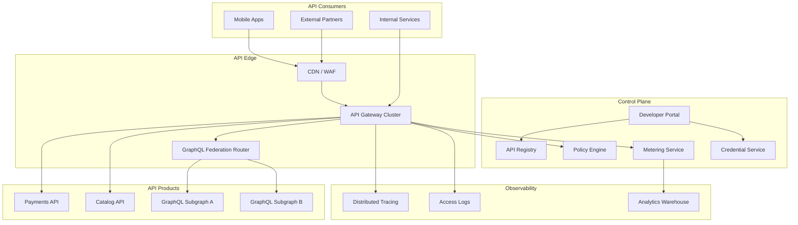
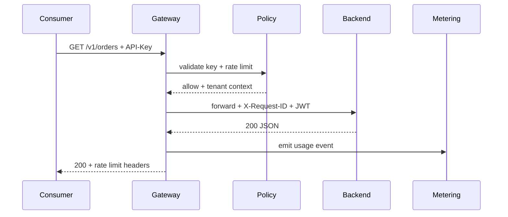
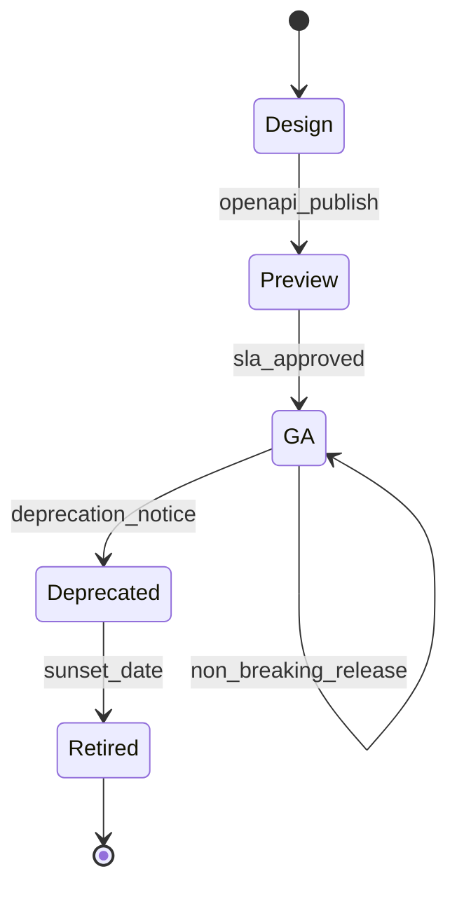

# API Platform

## 1. Executive Summary

An **API platform** is the organizational product layer that enables teams to **publish**, **consume**, **secure**, **observe**, and **monetize** HTTP and RPC interfaces at scale. It combines an **API gateway** (traffic management, auth termination, rate limiting), a **developer portal** (documentation, keys, sandboxes), **lifecycle governance** (design-first specs, breaking-change detection), and **analytics** (usage, latency, error budgets per API product).

Principal architects treat the API platform as **infrastructure-as-product**: internal developers and external partners onboard through self-service while platform teams enforce **security baselines**, **SLO contracts**, and **backward compatibility**. This chapter designs a platform supporting 500+ API products, 50K RPS aggregate throughput, multi-tenant isolation, and federated GraphQL alongside REST/gRPC—not a single reverse proxy with rate limits bolted on.

Safety: tenant A cannot invoke tenant B APIs with stolen keys; policy enforcement is default-deny. Liveness: gateway degrades with circuit breakers and queue shedding rather than cascading backend failure.

## 2. Why This Topic Matters

API platforms sit at the intersection of **distributed systems**, **developer experience**, and **business model**:

- **Stripe's API** is the product—platform quality drives revenue.
- **Breaking changes** without versioning destroy partner trust.
- **Rate limiting** protects shared backends from one noisy consumer.
- **Observability per API key** is essential for SLO attribution and billing.

Interviews probe gateway vs service mesh boundary, GraphQL federation operational cost, and how to roll out **API versioning** without stranding clients. Principal candidates articulate **platform multi-tenancy**, **idempotent webhook delivery**, and **contract testing** in CI—not just "put Kong in front."

## 3. Problems Being Solved

| Problem | Platform capability |
|---------|---------------------|
| **Inconsistent auth** | Central OAuth2/OIDC/mTLS termination |
| **Thundering herd** | Rate limits, quotas, priority tiers |
| **Undocumented APIs** | OpenAPI/AsyncAPI registry + portal |
| **Breaking deploys** | Contract tests; deprecation policy |
| **No usage visibility** | Per-key metrics and billing meters |
| **Multi-team gateway sprawl** | Shared platform with namespace isolation |
| **Partner onboarding friction** | Self-service keys, sandboxes, SDK generation |
| **GraphQL N+1 at edge** | Federation gateway with query cost limits |

## 4. Assumptions and System Model

### Functional

- Register API product with OpenAPI spec, owners, SLO tier.
- Issue API keys / OAuth clients per consumer application.
- Route `api.example.com/v1/*` to backend clusters with transforms.
- Enforce rate limit: 1000 req/min per key default; burst configurable.
- Publish async events via webhook subscriptions with signed delivery.
- Developer portal: try-it console, changelog, status page integration.

### Non-functional

- Gateway p99 overhead &lt; 10 ms (excluding backend).
- Availability 99.99% for edge; backends vary per product SLO.
- Global anycast or regional gateways with geo-routing.
- Audit all admin changes; retain access logs 90 days minimum.

| Assumption | Implication |
|------------|-------------|
| **Backends are heterogeneous** | Protocol translation at gateway optional |
| **Clients are slow to upgrade** | Long deprecation windows (12–24 months) |
| **Some APIs are revenue-bearing** | Metering and plan enforcement |
| **Internal and external share platform** | Network segmentation for internal routes |
| **Schema evolution is continuous** | CI breaking-change gates |

## 5. Essential Terminology

| Term | Definition |
|------|------------|
| **API product** | Versioned surface with owners and SLO |
| **Consumer** | Application using APIs via key or OAuth client |
| **API gateway** | Edge proxy for policy and routing |
| **Developer portal** | Self-service docs and credentials |
| **Rate limit** | Requests per time window per identity |
| **Quota** | Aggregate limit (daily/monthly) |
| **OpenAPI** | Machine-readable REST contract |
| **Federation** | GraphQL subgraph composition at gateway |
| **mTLS** | Mutual TLS for B2B partners |
| **API key** | Long-lived consumer credential (prefer OAuth for user-delegated) |
| **Breaking change** | Incompatible contract change for existing clients |
| **Sandbox** | Isolated environment with synthetic data |

## 6. Core Mechanism

### 6.1 Platform architecture



*Figure 1: API platform—edge gateway, control plane for credentials and specs, federated GraphQL optional path.*

### 6.2 Request lifecycle



*Figure 2: Authenticated request with metering and propagated correlation ID.*

### 6.3 API lifecycle state machine



*Figure 3: API product lifecycle—explicit deprecation before retirement.*

### 6.4 Deep dives

**Versioning strategy:**

- URL path `/v1/` for major breaks; header `Accept-Version` for minors where feasible.
- Parallel deploy: `v1` and `v2` routes to different backend deployments.
- Sunset headers: `Sunset: Sat, 01 Jan 2028 00:00:00 GMT`.

**Rate limiting algorithms:**

| Algorithm | Use case |
|-----------|----------|
| Token bucket | Burst-friendly mobile clients |
| Sliding window | Fair monthly quotas |
| Leaky bucket | Smooth traffic to fragile backend |
| Global + per-route | Protect hot endpoints separately |

See [Distributed Rate Limiter](/docs/system-design/distributed-rate-limiter) for Redis-cell coordination.

**Webhook delivery:**

- Outbox pattern from backend; platform signs payload `HMAC-SHA256`.
- Exponential backoff retries; DLQ after N failures; consumer idempotency via `event_id`.

## 7. Step-by-Step Walkthrough

### 7.1 Partner onboarding

1. Partner registers application in portal; accepts terms.
2. Platform issues OAuth client credentials (sandbox).
3. Partner reads OpenAPI; generates SDK from spec.
4. Integration tests against sandbox; requests production promotion.
5. Manual or automated review; production keys with higher quota tier.

### 7.2 Breaking change rollout

1. Team proposes `v2` with compatibility matrix in ADR.
2. CI detects breaking diff vs `v1` OpenAPI.
3. Platform enables `v2` route; `v1` marked deprecated with 12-month sunset.
4. Usage dashboard tracks `v1` traffic decline.
5. Email partners below 5% remaining; final shutdown with status page.

### 7.3 Incident: hot key exhausts backend

1. Single partner misconfigured poll loop → 50K RPS.
2. Per-key rate limit triggers 429 with `Retry-After`.
3. Circuit breaker opens to catalog service; other keys unaffected.
4. Post-incident: lower default quota; require backoff in SDK guidelines.

### 7.4 GraphQL query cost attack

1. Client submits deep nested query cost 10,000.
2. Federation router computes cost pre-execution; rejects over budget.
3. Persisted queries allowed for production mobile app.

## 8. Invariants and Guarantees

| Property | Type | Mechanism |
|----------|------|-----------|
| **Auth before route** | Safety | Gateway policy order |
| **Tenant isolation** | Safety | Key → tenant mapping |
| **Audit admin actions** | Safety | Immutable admin log |
| **Schema registry truth** | Safety | CI publish gate |
| **Rate limit enforcement** | Safety | Distributed counter |
| **Request routing** | Liveness | Health-checked upstreams |

## 9. Failure Scenarios

| Scenario | Mitigation |
|----------|------------|
| Gateway AZ loss | Multi-AZ; DNS failover |
| Redis rate limit down | Fail closed or local token bucket fallback (document tradeoff) |
| Registry unavailable | Cached OpenAPI at gateway; stale spec alert |
| Backend slow | Timeout, circuit breaker, 504 with request ID |
| Key leak | Revoke key; audit access; partner notify |
| Webhook endpoint down | Retry + DLQ; portal visibility |
| Federation partial subgraph outage | `@defer` optional; degrade fields with null + errors |
| DDoS on public API | WAF + CDN + global rate limit |

## 10. Performance Characteristics

```
50K RPS aggregate edge
Gateway overhead target: 3-8 ms p99 (Envoy/Kong class)
Rate limit check: Redis &lt; 2 ms p99 with local cache
OpenAPI validation (optional): offload to async for large bodies
TLS termination: hardware acceleration; session resumption
Metering: async Kafka emit; don't block response path
```

| Tier | Quota example |
|------|---------------|
| Free sandbox | 100 req/min |
| Standard partner | 1K req/min |
| Enterprise | Custom + dedicated shard |

## 11. Scalability Limits

| Limit | Mitigation |
|-------|------------|
| Gateway CPU | Horizontal pods; connection pooling to backends |
| Redis hot key for global limit | Sharded counters per key prefix |
| OpenAPI size | Lazy load per route |
| GraphQL query complexity | Cost analysis; persisted queries |
| Portal search | Index registry metadata |
| Webhook fanout | Queue workers scale independently |

## 12. Operational Considerations

- SLO: edge 99.99%; per-product backend SLOs published in portal.
- Dashboards: RPS per API, 4xx/5xx ratio, p99 latency, quota utilization.
- Runbooks: key revocation, emergency global throttle, backend drain.
- Chaos: kill gateway AZ; verify failover &lt; 30 s.
- Status page integration for platform-wide incidents.
- On-call rotation split: edge platform vs API product teams.

## 13. Security Considerations

- OAuth2 for user-delegated access; API keys only for server-to-server with IP allowlists where possible.
- mTLS option for high-trust B2B.
- WAF OWASP rules; request size limits; SSRF protection on webhook URL validation.
- PII minimization in access logs—log key ID not payload.
- Integrate [Identity Platform](/docs/system-design/identity-platform) for token issuance.
- Secrets for signing webhooks in [Secrets Management Platform](/docs/system-design/secrets-management-platform).

## 14. Cost Considerations

Gateway compute scales with RPS; CDN reduces origin load. Metering pipeline to warehouse has ingestion cost. Build vs buy: Kong/Apigee/AWS API Gateway—evaluate multi-cloud portability vs managed ops. GraphQL federation adds engineering headcount—justify with client flexibility needs.

## 15. Production Implementations

| System | Pattern |
|--------|---------|
| **Stripe** | Versioned REST; idempotent keys; excellent docs |
| **Twilio** | Per-product subaccounts; usage billing |
| **Kong / Apigee** | Enterprise API management |
| **Apollo Router** | GraphQL federation at scale |
| **AWS API Gateway** | Serverless integration focus |

## 16. Alternatives and Tradeoffs

| Decision | Tradeoff |
|----------|----------|
| Central gateway vs mesh egress | Consistency vs per-service flexibility |
| REST vs GraphQL public | Flexibility vs caching/CDN |
| URL vs header versioning | Cacheability vs clean URLs |
| Sync validation vs trust backend | Latency vs safety |
| Build portal vs Backstage plugin | Time-to-market vs customization |
| Global vs regional gateways | Latency vs operational complexity |

## 17. Common Misconceptions

| Misconception | Reality |
|---------------|---------|
| "Gateway replaces service auth" | Backend must validate JWT claims |
| "GraphQL removes versioning" | Schema evolution still required |
| "Rate limit = security" | AuthZ and input validation still needed |
| "OpenAPI optional" | Contract tests need machine spec |
| "One gateway team owns all APIs" | Product teams own SLO; platform owns edge |
| "429 is failure" | Backpressure is healthy protection |

## 18. Principal Architect Perspective

- **API platform is a product**—measure developer time-to-first-successful-call.
- **Versioning policy is organizational**, not technical-only.
- **Deprecate loudly**—headers, emails, portal banners.
- **Metering enables FinOps** chargeback to consuming teams.
- **Federation is not free**—operational complexity must be budgeted.
- Align with [Architecture Governance](/docs/architecture-leadership/architecture-governance) for API standards.

## 19. Architecture Review Exercise

**Scenario:** Each team deploys own nginx with copy-pasted rate limits and different auth.

**Review:** Inconsistent security; no global DDoS protection; impossible partner onboarding. Propose shared gateway, registry, portal, and mandatory OpenAPI publish in CI.

## 20. Whiteboard Explanation

"Consumers get credentials from our developer portal backed by an API registry of OpenAPI specs. Traffic hits a global gateway cluster that terminates TLS, validates OAuth or API keys, enforces per-tenant rate limits and quotas, and routes to backend services. We inject correlation IDs and JWT with tenant claims. Metering events stream async for billing and SLO dashboards. Breaking changes require new major version with deprecation window. Webhooks deliver signed events with retries. GraphQL federation is optional for products that need flexible queries—with query cost limits at the router."

## 21. Interview Questions

1. **Design API platform for external partners.** — *Signals:* portal, keys, rate limits, versioning. *Red flags:* single shared key.
2. **REST versioning strategies?** — *Signals:* URL major, deprecation policy. *Follow-up:* cache implications.
3. **Rate limit distributed implementation?** — *Signals:* Redis, token bucket, fail modes.
4. **Gateway vs service mesh?** — *Signals:* north-south vs east-west. *Red flags:* conflate.
5. **Detect breaking API change?** — *Signals:* OpenAPI diff CI. *Red flags:* manual only.
6. **Webhook reliability?** — *Signals:* signing, retry, idempotency. *Red flags:* fire-and-forget.
7. **GraphQL at public edge risks?** — *Signals:* query cost, depth limit. *Red flags:* unlimited introspection prod.
8. **Multi-tenant isolation?** — *Signals:* key mapping, JWT claims, row-level security backend.
9. **Sandbox vs production isolation?** — *Signals:* separate keys, data, backends.
10. **API monetization metering?** — *Signals:* usage events, plans, overage.
11. **DDoS on public API?** — *Signals:* WAF, CDN, global throttle. *Red flags:* backend only.
12. **Internal API on same platform?** — *Signals:* network policy, mTLS, separate realms.

## 22. Interview Follow-Ups

1. **Partner refuses to migrate before sunset.** — Contract terms; extended support fee; traffic cap.
2. **GraphQL N+1 across subgraphs?** — DataLoader; batch fields; review schema design.
3. **Zero-downtime gateway config deploy.** — Canary config; xDS incremental push.

## 23. Strong Answer Example

**Q:** How enforce rate limits across 20 gateway instances?

**Outline:** Partition counter key `ratelimit:{api_key}:{window}` in Redis Cluster. Each gateway uses local token bucket synchronized periodically or checks Redis per request for strict fairness. Return `X-RateLimit-Remaining` headers. On Redis failure, policy decision documented: fail closed for free tier, fail open with alert for enterprise (rare, contractual). Use sliding window log or Redis CELL algorithm for accuracy.

## 24. Weak Answer Example

**Weak:** "Put nginx in front with `limit_req` and call it a platform."

**Red flags:** No portal, no versioning policy, no metering, no multi-tenant keys, no contract testing.

## 25. Hands-On Exercise

1. Deploy Kong or Envoy gateway with rate limiting plugin.
2. Publish OpenAPI to registry; generate consumer SDK.
3. Implement API key auth with per-key limits in Redis.
4. Add OpenAPI breaking-change check in CI (oasdiff).
5. **Extension:** Webhook delivery worker with HMAC and retries.
6. **Extension:** GraphQL federation with query cost plugin.

## 26. Knowledge Check

1. Difference between rate limit and quota?
2. When use mTLS vs API key?
3. What belongs in gateway vs backend?
4. Purpose of `Sunset` header?
5. How idempotent are webhooks?
6. Token bucket vs sliding window?
7. Why propagate `X-Request-ID`?
8. GraphQL federation vs monolith schema?
9. Sandbox data requirements?
10. Breaking vs non-breaking field addition in OpenAPI?
11. OAuth2 client credentials vs auth code flow?
12. Circuit breaker trigger conditions?

## 27. Flashcards

| Front | Back |
|-------|------|
| API product | Versioned surface with owner and SLO |
| Developer portal | Self-service docs and keys |
| Token bucket | Burst-tolerant rate limiting |
| OpenAPI | Machine-readable REST contract |
| Sunset header | Deprecation deadline signal |
| Federation | Compose GraphQL subgraphs |
| Quota | Aggregate usage cap |
| Breaking change | Incompatible for existing clients |
| mTLS | Client cert authentication |
| Circuit breaker | Stop calls to failing backend |
| Webhook DLQ | Failed delivery queue |
| Persisted query | Pre-approved GraphQL operation |

## 28. Cheat Sheet

```
REQUIREMENTS: publish, secure, observe, monetize APIs
EDGE: CDN + WAF + gateway + optional GraphQL router
CONTROL: portal, registry, credentials, policy, metering
AUTH: OAuth2 / API key / mTLS by tier
LIMITS: token bucket per key; circuit breakers
VERSION: /v1 major; deprecation + sunset headers
WEBHOOKS: HMAC sign, retry, idempotent event_id
OBSERVE: trace + access log + usage warehouse
GOVERNANCE: OpenAPI CI diff; ADR for breaks
FAILURE: multi-AZ gateway; Redis limit fallback policy
```

## 28A. Principal Interview Deep Dive

### API platform as revenue enabler

For B2B SaaS, the API platform is not infrastructure—it is **distribution channel**. Principal architects quantify:

- **Partner onboarding time:** baseline 6 weeks → target 2 weeks with self-service portal.
- **API-related churn:** incidents attributed to breaking changes or poor docs.
- **Consumption revenue:** metered API tiers driving expansion.

Executive narrative: "Every week of partner delay costs $X pipeline; platform investment pays back in N quarters."

### Contract testing architecture

```
Producer CI: publish OpenAPI to registry
Consumer CI: pact or schema validation against registry version pin
Breaking change detector: oasdiff on PR
Gateway: optional request validation against registered schema (latency tradeoff)
```

**Safety:** Invalid requests rejected at edge before corrupting backend state. **Liveness:** Validation cache warmed from registry; stale schema alert if registry unreachable &gt; 5 minutes.

### Multi-tenant API isolation layers

| Layer | Mechanism |
|-------|-----------|
| Edge | API key → tenant_id claim in JWT |
| Gateway | Rate limit per tenant; WAF rules per plan |
| Service | Row-level security; tenant_id in every query |
| Data | Schema-per-tenant or shared schema with tenant column |
| Observability | Metrics/traces tagged tenant_id (cardinality caution) |

Principal interview follow-up: "Can tenant A's key access tenant B data?"—answer must address **every layer**, not gateway alone.

### GraphQL federation operational cost

Budget 2–3 platform engineers ongoing for:

- Subgraph schema review and composition CI.
- Query cost analysis tuning per release.
- Federation version upgrades across teams.

If organization has &lt;5 GraphQL consumers, federation may be overkill—monolith GraphQL or BFF pattern per [REST, gRPC, and GraphQL](/docs/api-and-integration-architecture/rest-grpc-and-graphql).

### BOE: 50K RPS gateway sizing

```
50K RPS × 2 KB average request = 100 MB/s ingress
Gateway pods: ~5K RPS per pod (Envoy class, TLS terminated) → 10 pods + 3 AZ headroom
Redis rate limit: 50K INCR/sec → Redis Cluster 3 shards minimum
Metering Kafka: async; 50K events/sec partition by tenant hash
p99 gateway overhead budget: 8ms—alert if exceeds 15ms (backend blame confusion)
```

## 29. Related Concepts

- [REST, gRPC, and GraphQL](/docs/api-and-integration-architecture/rest-grpc-and-graphql)
- [API Versioning and Evolution](/docs/api-and-integration-architecture/api-versioning-and-evolution)
- [Distributed Rate Limiter](/docs/system-design/distributed-rate-limiter)
- [Identity Platform](/docs/system-design/identity-platform)
- [Secrets Management Platform](/docs/system-design/secrets-management-platform)
- [Distributed Tracing](/docs/observability/distributed-tracing)
- [Architecture Governance](/docs/architecture-leadership/architecture-governance)

## 19A. Extended Review Scenario

**Scenario B:** Partner reports intermittent `401 Unauthorized` on API calls that succeed on retry.

**Review questions:**

1. Is clock skew affecting JWT `exp` validation at gateway?
2. Are API keys rotated without dual-version grace window?
3. Is rate limit returning 429 misread as auth failure in client SDK?
4. Does gateway pod restart lose in-memory key cache causing transient deny?

**Recommended architecture response:** Publish `WWW-Authenticate` and structured error bodies distinguishing `rate_limit_exceeded` vs `invalid_token`. Implement key versioning with 72-hour overlap. Add synthetic canary consumer hitting auth path every 60 seconds from multiple regions. Document in portal troubleshooting guide—not "retry harder."

## 23A. Additional Strong Answer

**Q:** Design API monetization for usage-based billing.

**Outline:** Gateway emits `api.usage` events to Kafka with fields: `tenant_id`, `api_product`, `route_template`, `timestamp`, `request_id`, `response_code`, `latency_ms`. Metering service aggregates hourly into warehouse. Plans table defines included quota and overage rate per product tier. Nightly job computes bill; real-time dashboard for tenant self-service. Idempotent event processing via `request_id` dedup. Overage soft limit warns at 80%; hard limit policy configurable per contract (block vs allow + invoice). Finance sign-off on event schema—billing disputes are architecture problems.

## 28B. Extended BOE Walkthrough (Interview Script)

**Interviewer:** "Design API platform for 10K partner integrations."

**Strong candidate:**

"Ten thousand partners doesn't mean 10K RPS day one—clarify active integrations and peak RPS. Assume 2K active partners, 50K RPS peak aggregate.

Edge: global gateway cluster with WAF, OAuth and API keys, per-tenant rate limits in Redis Cluster. Developer portal with OpenAPI registry—contract tests in CI block breaking changes.

Versioning: URL `/v1/` major; 12-month deprecation with Sunset headers and email campaigns. Webhooks via outbox with HMAC signing and idempotent `event_id`.

Metering: async usage events to warehouse for billing tiers. GraphQL only if &gt;5 products need it—otherwise REST simplicity.

Multi-tenant isolation at gateway JWT claims and backend row-level security—not gateway alone.

SLO: edge 99.99%; publish per-product backend SLOs. Incident: circuit breakers protect shared catalog service from one partner's poll loop.

Non-goals: building payment processing—that's [Payment Platform](/docs/system-design/payment-platform) downstream."

## 30. References

- OpenAPI Specification 3.1 — contract format (standard).
- OAuth 2.0 RFC 6749 — authorization framework (standard).
- Stripe API design documentation — industry patterns (implementation).
- GraphQL Federation specification — Apollo/subgraph model.
- "API Design Patterns" — JJ Geewax — versioning and resource modeling.

**Distinction:** OAuth security properties are normative per RFC; gateway vendor rate-limit accuracy varies; partner SLA terms are contractual not technical.

### 30A. Further reading paths

Pair with [Distributed Rate Limiter](/docs/system-design/distributed-rate-limiter) for token bucket math, [Identity Platform](/docs/system-design/identity-platform) for OAuth client design, and [Architecture Governance](/docs/architecture-leadership/architecture-governance) for API standards enforcement. Review Stripe and Twilio public API changelogs for deprecation communication patterns—gold standard for partner trust.

**Lab:** Implement OpenAPI diff gate in CI; simulate breaking field removal and verify build fails. **Interview drill:** design webhook delivery with at-least-once semantics—walk through signing, retry backoff, DLQ, and consumer idempotency on `event_id` without hand-waving "we'll use a queue."
