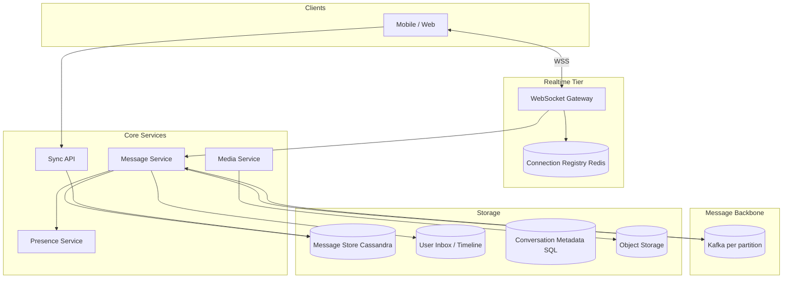
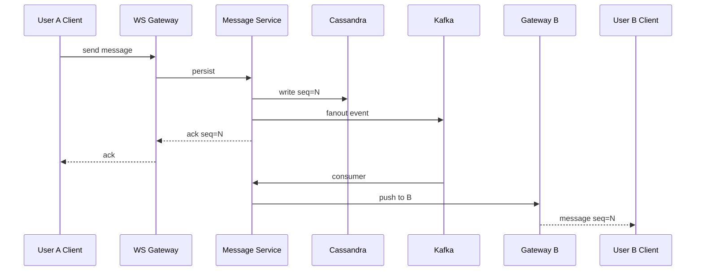
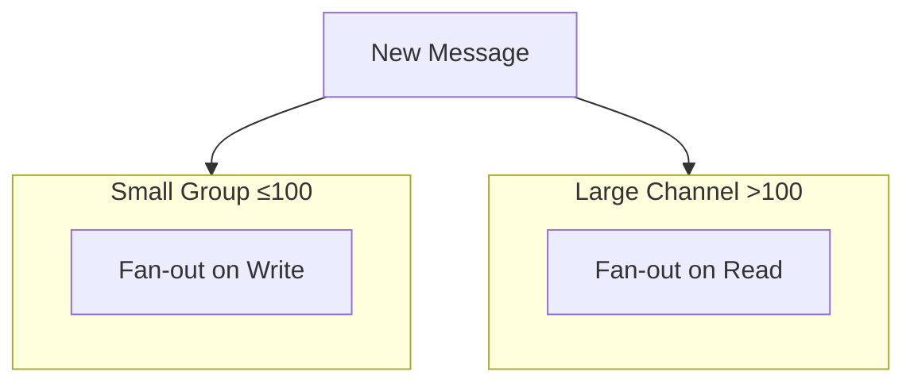

# Chat Platform

## 1. Executive Summary

A **chat platform** enables real-time and offline messaging between users in 1:1 and group conversations with delivery guarantees, ordering per conversation, presence, read receipts, and media attachments. Principal design centers on **connection management at scale**, **message fan-out**, **per-conversation ordering**, **sync for offline clients**, and **storage tiering** for message history.

This chapter designs a WhatsApp/Slack-class system for 500M MAU with billions of messages daily, emphasizing WebSocket gateways, partitioned message logs, and conflict-free offline sync. All ten system-design template phases are woven through the 30-section structure, with hybrid fan-out as the central scalability mechanism and durable-write-before-ACK as the central correctness invariant.

## 2. Why This Topic Matters

Chat combines real-time systems, storage, and mobile constraints. Principal interviews probe:

- **WebSocket scaling** — sticky sessions, connection registries.
- **Ordering** — per-channel sequence vs. global clocks.
- **Group fan-out** — write amplification in large channels.
- **Offline sync** — catch-up APIs, gap repair.
- **End-to-end encryption** — key management (optional scope).

Production failures include message loss perception, duplicate messages, presence storms, and hot partitions in celebrity group chats. Principal loops often spend 15+ minutes on fan-out and connection scaling alone—candidates who jump to database schema without clarifying group size distribution and online ratio typically underperform. E2E encryption and search are common scope extensions that should be acknowledged even when deferred. This chapter satisfies principal-level depth across all 30 standard sections.

## 3. Problems Being Solved

| Problem | Capability |
|---------|------------|
| **Real-time delivery** | WebSocket push to online users |
| **Offline delivery** | Persistent store + push notification |
| **Group chat** | Fan-out or fan-in storage models |
| **Ordering** | Monotonic sequence per conversation |
| **History sync** | Paginated fetch since sequence |
| **Presence** | Online/typing/last seen |
| **Media** | Object storage + CDN URLs |
| **Read receipts** | Per-user cursor per conversation |

## 4. Assumptions and System Model

### Phase 1: Clarify Requirements

**Functional:**

- Send/receive text, images, files in 1:1 and groups up to 500 members.
- Message history query with cursor pagination.
- Typing indicators and online presence (best-effort).
- Delivery and read receipts.
- Mobile and web clients; multi-device sync.

**Non-functional:**

- Delivery latency p99 &lt; 500 ms for online recipients.
- Durability: messages never lost after server ACK.
- Availability 99.95%.
- 500M MAU; 50B messages/day.

**Non-goals:** E2E encryption (mention as extension); voice/video (separate SFU).

| Assumption | Implication |
|------------|-------------|
| **Per-conversation ordering sufficient** | Sequence number per channel |
| **Most groups small** | Fan-out on write viable for &lt;100 |
| **Large channels rare** | Fan-out on read for megagroups |
| **Clients reconnect often** | Sync API critical |

## 5. Essential Terminology

| Term | Definition |
|------|------------|
| **Conversation / channel** | Thread of messages between participants |
| **Sequence number** | Monotonic ID per conversation |
| **Inbox** | Per-user view of conversations |
| **Fan-out on write** | Copy message to each member's inbox |
| **Fan-out on read** | Store once; merge on read |
| **Connection registry** | Maps user_id → WebSocket server |
| **Sync cursor** | Last seen sequence per device |
| **CRDT** | Conflict-free replicated data type (optional edits) |
| **APNs/FCM** | Mobile push for offline |

## 6. Core Mechanism

### 6.1 Phase 5: High-Level Architecture



*Figure 1: Chat platform—WebSocket gateways for realtime; Kafka for async fan-out; Cassandra for message persistence.*

### 6.2 Phase 3: Define APIs

**REST/gRPC:**

```
POST /v1/conversations/{id}/messages  { body, client_msg_id, attachments }
GET  /v1/conversations/{id}/messages?after_seq=100&limit=50
GET  /v1/sync?since=cursor
POST /v1/presence { status: online|away }
```

**WebSocket frames:**

```json
{ "type": "message", "conversation_id", "seq", "body", "sender_id", "ts" }
{ "type": "ack", "client_msg_id", "server_seq" }
{ "type": "typing", "conversation_id" }
```

### 6.3 Phase 4: Model Data

**`messages` (Cassandra, partition by `conversation_id`):**

`conversation_id`, `seq` (clustering), `message_id`, `sender_id`, `body`, `created_at`, `client_msg_id`.

**`user_inbox` (fan-out on write for small groups):**

`user_id`, `conversation_id`, `last_seq`, `last_preview`, `updated_at`.

**`conversation_members`:** `conversation_id`, `user_id`, `role`, `joined_at`.

**`read_cursors`:** `user_id`, `conversation_id`, `last_read_seq`.

**`connection_registry`:** `user_id` → `{gateway_id, device_id}` TTL 60s heartbeat.

**Sequence allocation:** Per-conversation counter in Redis or embedded in partition leader.

### 6.4 Phase 6: Deep Dives

**Send message flow:**

1. Client POST or WS send with `client_msg_id` (idempotency).
2. Message service allocates `seq` atomically per conversation.
3. Persist to Cassandra; publish to Kafka topic `conv.{hash}`.
4. Fan-out worker: for each member, update inbox; push via connection registry.
5. Gateway delivers WS frame; ACK with `server_seq`.
6. Offline users: enqueue push notification via notification platform.

**Large group (&gt;100 members):** Fan-out on read—store single message row; recipients pull on sync. Typing indicators sampled/disabled.

**Multi-device sync:** Each device maintains cursor; sync API returns delta across all conversations.



*Figure 2: Message send with durable write before ACK—fan-out async to other participants.*

**Ordering:** Single writer per conversation partition guarantees monotonic `seq`. Cross-conversation order irrelevant.

**Presence:** Heartbeat every 30 s; Redis SET with TTL; gossip optional for gateway-local cache. Typing events rate-limited 1/2s per user.

### 6.5 Media messages

Client uploads to presigned S3 URL; message body contains `media_ref`. Virus scan async; thumbnail generation pipeline.

## 7. Step-by-Step Walkthrough

### 7.1 1:1 message delivery

1. Alice sends "hello" with `client_msg_id=uuid-1`.
2. Server assigns `seq=42`, stores, ACKs Alice all devices.
3. Bob online on gateway G2; push frame within 200 ms.
4. Bob offline: message stored; FCM push "New message from Alice".

### 7.3 Large channel message (fan-out on read)

1. 50K-member community channel; admin posts announcement.
2. System stores single message row; no inbox fan-out.
3. Members on sync fetch conversation log; rank by seq.
4. Push notification sent to "mentions" only—not all 50K.
5. **Latency:** active readers see message within 1 s via WS to online subset.

### 7.4 Multi-device read receipt conflict

1. Alice reads on phone (cursor 100); tablet still at 90.
2. Read receipt broadcasts max cursor per user across devices.
3. Sender sees "read" when any device reaches seq—product policy documented.

## 7A. Design Phase Summary

| Phase | Section | Key decisions |
|-------|---------|---------------|
| Requirements | §4 | 1:1 + group, receipts, multi-device |
| Scale | §10 | 115K msg/sec; hybrid fan-out |
| APIs | §6.2 | WS + REST sync |
| Data model | §6.3 | messages by conversation_id |
| Architecture | §6.1 | Gateway → Message → Cassandra |
| Deep dives | §6.4 | seq; durable ACK |
| Reliability | §8–9 | quorum; idempotent send |
| Security | §13 | membership ACL |
| Operations | §12 | gateway drain |
| Tradeoffs | §16 | fan-out write vs read |

## 8. Invariants and Guarantees

| Property | Guarantee |
|----------|-----------|
| **Durability after ACK** | Message persisted before client ACK |
| **Per-conversation total order** | Monotonic seq |
| **Idempotent send** | Same client_msg_id → same server message |
| **At-least-once delivery** | WS may retry; client dedup by message_id |
| **Presence** | Best-effort; not contractual |

## 9. Failure Scenarios

| Scenario | Mitigation |
|----------|------------|
| Gateway crash | Client reconnect; sync gap |
| Kafka lag | Scale consumers; backpressure |
| Hot conversation | Partition; fan-out on read |
| Sequence collision | Single sequencer per conv |
| Split brain gateway | Sticky user routing; registry TTL |
| Cassandra node down | Quorum read/write CL=LOCAL_QUORUM |
| Duplicate client retry | Idempotent client_msg_id |

## 10. Performance Characteristics

### Phase 2: Estimate Scale

```
500M MAU, 20 msg/day average → 10B msg/day ≈ 115K msg/sec average
Peak 5× → 575K writes/sec
Storage: 10B × 500 bytes ≈ 5 TB/day raw (compression, TTL policies)
WebSocket connections: 50M concurrent peak (10% online)
Gateways: 50M / 50K per instance ≈ 1000 gateway instances
```

| Path | Latency target |
|------|----------------|
| WS delivery | &lt; 500 ms p99 |
| History page | &lt; 200 ms |
| Media upload | Seconds (async) |

## 11. Scalability Limits

| Limit | Mitigation |
|-------|------------|
| Celebrity group fan-out | Fan-out on read |
| Connection memory | Horizontal gateways |
| Inbox write amp | Hybrid model by group size |
| Global sequence | Per-conversation only |



*Figure 3: Hybrid fan-out strategy by conversation size.*

## 12. Operational Considerations

### Phase 9: Operations

- SLO: message delivery p99; sync API availability.
- Metrics: WS connections, Kafka lag, send error rate, push latency.
- Runbooks: drain gateway; hot conversation throttle; disable typing in incident.
- Load test: synthetic WS connections; chaos gateway kill.

## 13. Security Considerations

### Phase 8: Security

- Auth: OAuth tokens; WS upgrade validates JWT.
- Authorization: membership check before read/write.
- Abuse: rate limit sends; report/block users.
- Media: signed URLs; malware scan.
- E2E extension: Signal protocol; server stores ciphertext only.

## 14. Cost Considerations

WebSocket fleet is significant compute. Cassandra storage grows with retention policy (messages forever vs. 1 year). Push notification costs per offline user. CDN for media egress.

## 15. Production Implementations

| System | Pattern (from public sources) |
|--------|----------------------------|
| **WhatsApp** | Erlang connection layer; custom protocol; emphasis on delivery and encryption |
| **Slack** | Channel sharding; separate search and file services |
| **Discord** | Large guild optimization; fan-out on read for megaservers |
| **Signal** | E2E by default; minimal server metadata |

**Implementation choice:** Self-host message store when data residency or cost at billions of messages/day; managed realtime (PubNub, Ably) for faster MVP with vendor lock-in tradeoff.

## 14A. Cost Considerations

WebSocket gateway fleet: estimate **50K connections per instance** (varies by heartbeat rate and memory). Message storage: Cassandra at 5 TB/day requires compaction and TTL strategy. Push notifications: FCM free; APNs infrastructure cost indirect. Principal review should separate **connection COGS** from **storage COGS** from **push COGS**.

## 22A. Extended Follow-Ups

5. **Message search.** — Async index to Elasticsearch; privacy filtering; not on hot path.
6. **Ephemeral messages.** — TTL per message; compaction job; screenshot policy is legal/product not technical.

## 16. Alternatives and Tradeoffs

### Phase 10: Tradeoffs

| Model | Pros | Cons |
|-------|------|------|
| Fan-out on write | Fast read | Write amp in large groups |
| Fan-out on read | Cheap write | Slow read for active users |
| MQTT vs WebSocket | Mobile efficiency | Ecosystem |
| SQL vs Cassandra | ACID | Write scale |

## 17. Common Misconceptions

| Misconception | Reality |
|---------------|---------|
| "Global message order" | Per-conversation suffices |
| "WebSocket alone delivers" | Need persistence + push |
| "ACK after broadcast" | ACK after durable write only |
| "One inbox table for all" | Partition by user_id |
| "Delivery receipt means read" | User may have notifications disabled |
| "CRDT required for all chat" | Last-write-wins often sufficient for v1 |
| "Push replaces persistence" | Offline users need durable store |
| "Group voice is just more messages" | SFU is separate media plane |

## 17A. Failure scenario drill

Gateway deploy kills 10% of connections—clients reconnect with exponential backoff. Without sync API, users perceive message loss. Strong answer: durable write before ACK + sync on reconnect + push for offline. Quantify reconnect storm: 5M users × simultaneous reconnect = thundering herd on auth—stagger JWT refresh.

### 17B. Additional misconceptions

| Misconception | Reality |
|---------------|---------|
| "Sequence numbers globally ordered" | Per-conversation only |
| "Kafka ordering across all chats" | Partition per conversation required |

## 18. Principal Architect Perspective

- **Durable write before ACK**—non-negotiable for trust.
- **Hybrid fan-out** by group size is production norm.
- **Connection layer** scales independently from message logic.
- **Sync API** is as important as realtime path for mobile.
- **Idempotency** on client_msg_id mandatory.
- **Regulatory retention** policies (GDPR delete) conflict with message forever—negotiate TTL with legal early.
- **Gateway fleet** is often largest COGS after storage—optimize connection memory before optimizing Cassandra.

### 18.1 Multi-team boundaries

Chat platforms split across **connection team** (gateways), **messaging team** (persist + fan-out), **notifications team** (offline push), and **client SDK team**. Principal architects define API contracts between teams—especially ACK semantics and sync cursor format—before parallel development. Conway's law: avoid merging gateway and message logic into one deployable if teams scale independently.

## 19. Architecture Review Exercise

**Scenario:** Fan-out on write for all groups including 100K member channels.

**Review:** Write amp 100K per message; calculate Kafka and DB load; propose threshold switch to fan-out on read.

## 20. Whiteboard Explanation

"Clients connect via WebSocket gateways registered in Redis. Sending a message hits the message service which assigns a per-conversation sequence, writes Cassandra, then ACKs. Kafka consumers fan out to recipient inboxes and push to their gateways. Offline users get mobile push. Small groups use fan-out on write; large channels store once and read on sync. Presence is heartbeat-based best-effort. Principal non-negotiable: no ACK before durable write—user trust depends on it."

## 21. Interview Questions

1. **Design WhatsApp for 500M users.** — *Signals:* WS scale, persistence, fan-out hybrid. *Red flags:* polling MySQL.
2. **WebSocket scaling approach?** — *Signals:* gateway fleet, connection registry, sticky routing. *Follow-up:* cross-gateway push.
3. **Fan-out on write vs read?** — *Signals:* group size threshold, write amp math. *Red flags:* one model for all.
4. **Message ordering guarantees?** — *Signals:* per-conversation seq, single partition. *Red flags:* global timestamp order.
5. **Offline message sync?** — *Signals:* cursor API, gap repair. *Red flags:* "client polls all."
6. **Group chat with 100K members?** — *Signals:* fan-out on read, disable typing. *Red flags:* 100K inbox writes.
7. **Read receipts implementation?** — *Signals:* per-user cursor, broadcast policy. *Follow-up:* multi-device.
8. **Idempotent message send?** — *Signals:* client_msg_id unique constraint. *Red flags:* no dedup.
9. **Multi-device consistency?** — *Signals:* sync all devices, max read cursor. *Red flags:* per-device silos only.
10. **Storage choice for messages?** — *Signals:* Cassandra partition by conversation. *Red flags:* normalized SQL only.
11. **Typing indicator scale?** — *Signals:* rate limit, best-effort drop. *Red flags:* reliable typing queue.
12. **Media attachment flow?** — *Signals:* presigned upload, async scan. *Follow-up:* thumbnail pipeline.

## 22. Interview Follow-Ups

1. **Edit/delete message.** — Tombstone flag; propagate update event.
2. **E2E encryption.** — Key exchange; server blind storage.
3. **Search across messages.** — Separate Elasticsearch index async.

## 23. Strong Answer Example

**Q:** Fan-out on write vs read for groups?

**Outline:** Fan-out on write copies each message to every member's inbox—fast reads, O(members) writes. Works for small groups (&lt;100). Large channels use fan-out on read: one write, members query conversation log on open—writes cheap, read heavier. Hybrid: threshold at 100 members; megagroups disable typing. Measure write amp vs read latency for product SLO.

## 24. Weak Answer Example

**Weak:** "Store messages in MySQL and poll every second."

**Red flags:** No realtime, no ordering, no scale, polling waste.

## 25. Hands-On Exercise

1. Build WS server + REST send API.
2. Implement per-conversation seq in SQLite.
3. Simulate fan-out on write to inboxes.
4. Add sync endpoint with cursor.
5. **Extension:** Threshold-based fan-out (switch at N members).
6. **Extension:** Chaos test—kill gateway mid-send; verify client retry idempotency.

## 23A. Additional Strong Answer

**Q:** When does client receive ACK?

**Outline:** Only after durable write to message store with assigned `seq`. Never ACK on WS receive before persistence. If Kafka fan-out fails after persist, message is safe; async repair delivers. ACK includes `server_seq` and `message_id` for client dedup across devices.

## 19A. Extended Review Scenario

**Scenario B:** Messages stored only in WebSocket gateway memory.

**Review:** Gateway restart causes data loss; propose durable store before ACK. Offline users cannot recover messages.

## 28B. Extended BOE Walkthrough (Interview Script)

**Interviewer:** "500M MAU chat, 20 messages per day."

**Strong candidate:**

"500M × 20 = 10B messages/day ≈ 115K writes/sec average, 5× peak ≈ 575K writes/sec. Cassandra partition by conversation_id keeps writes localized. Storage: 10B × 500 bytes ≈ 5 TB/day—need TTL or tiering for old messages unless 'forever' is explicit requirement.

WebSocket: assume 10% concurrent online → 50M connections. At 50K per gateway pod → 1000 pods globally—connection layer is major COGS line item.

I'll propose hybrid fan-out: write for &lt;100 members, read for larger. ACK only after durable write. Offline sync via cursor API—mobile reliability depends on this as much as WS.

For principal scope I'll mention E2E as extension and multi-region: users expect regional latency &lt;500ms; replicate conversation metadata; messages follow user residency policy if compliance requires."

## 26. Knowledge Check (extended)

9. What triggers fan-out on read vs write?
10. Why heartbeat for presence?
11. How many Redis ops/sec for 50M presence heartbeats at 30s interval?
12. What is LOCAL_QUORUM protecting in Cassandra?

## 27. Flashcards

| Front | Back |
|-------|------|
| Fan-out on write | Pre-distribute to member inboxes |
| client_msg_id | Client idempotency key |
| Sync cursor | Last seen seq for catch-up |
| LOCAL_QUORUM | Cassandra consistency for replica set |
| Fan-out threshold | Member count switching write vs read |
| Megagroup | Channel too large for inbox fan-out |
| Durable ACK | Persist before client acknowledgment |
| Gap repair | Sync API fills missing seq range |
| Media presign | Direct upload to object storage |
| Tombstone message | Deleted message marker for sync |
| WS sticky routing | Same user to same gateway when possible |
| Push payload | Minimal data when app backgrounded |
| Conversation partition | Cassandra shard key for message locality |
| Sync gap | Missing seq range fetched on reconnect |

## 28. Cheat Sheet

```
REQUIREMENTS: 1:1 + group, realtime + offline, receipts, media
SCALE: 115K+ msg/sec; 50M WS connections
APIs: WS frames + REST sync/history
DATA: messages by conversation_id; user_inbox; read_cursors
ARCH: Gateway → Message Svc → Cassandra + Kafka fanout
DEEP: seq per conv; hybrid fan-out; durable write before ACK
RELIABILITY: quorum writes; idempotent send
SECURITY: membership ACL; rate limits
OPS: gateway drain; Kafka lag alerts
TRADEOFFS: fan-out write vs read; WS vs push-only
```

## 28A. Principal Interview Deep Dive

### Connection layer sizing

```
Target: 50M concurrent WebSocket connections
Per gateway pod: 50K connections (2GB RAM rule of thumb)
Pods: 50M / 50K = 1000 gateway pods
Cross-AZ: distribute 3 AZs → ~334 pods per AZ
Heartbeat: 50M × 1/30s ≈ 1.6M heartbeat writes/sec to registry → shard Redis heavily
```

### Consistency model summary

| Data | Consistency | User-visible effect |
|------|-------------|-------------------|
| Message after ACK | Strong per conversation | No lost sent messages |
| Read receipt | Eventual | Slight delay OK |
| Presence | Best-effort | "Online" may lag |
| Typing | Ephemeral drop | Acceptable loss |

### E2E encryption extension (interview bonus)

Signal Protocol: X3DH key agreement, Double Ratchet for forward secrecy. Server stores ciphertext + minimal metadata (sender, recipient, timestamp). Push notifications contain no message body. Tradeoff: search, moderation, and compliance harder—legal must sign off.

### Group size policy table

| Members | Fan-out | Typing | Push to all |
|---------|---------|--------|-------------|
| 2–100 | Write | Yes | Yes |
| 101–10K | Read | Sampled | Mentions only |
| 10K+ | Read | Off | Admin pin only |

Document thresholds in platform SLO doc; tune from metrics.

## 29. Related Concepts

- [System Design Methodology](/docs/system-design/system-design-methodology)
- [Message Delivery Semantics](/docs/messaging-and-streaming/message-delivery-semantics)
- [Notification Platform](/docs/system-design/notification-platform)
- [Kafka Architecture](/docs/messaging-and-streaming/kafka-architecture)
- [Eventual Consistency](/docs/consistency/eventual-consistency)
- [CRDTs](/docs/replication/crdts)

## 30. References

- Kleppmann, *DDIA* — ordering, partitioning.
- WhatsApp engineering blog posts — Erlang gateway scaling (implementation anecdotes).
- RFC 6455 — WebSocket protocol.

**Distinction:** Per-conversation ordering is design choice; WebSocket protocol is standardized.

### 30A. Further reading paths

Study [Message Delivery Semantics](/docs/messaging-and-streaming/message-delivery-semantics) alongside this chapter. Compare fan-out models with [News Feed](/docs/system-design/news-feed)—same write amplification problem, different product surface. For offline push integration see [Notification Platform](/docs/system-design/notification-platform). Hands-on milestone: WS server with durable SQLite backing and measured reconnect sync latency under 500 ms p99.
