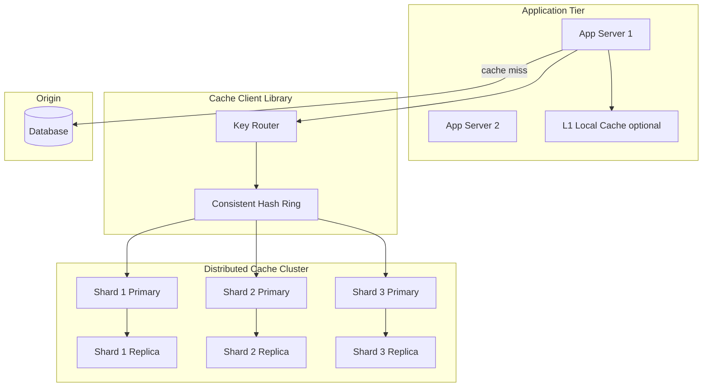
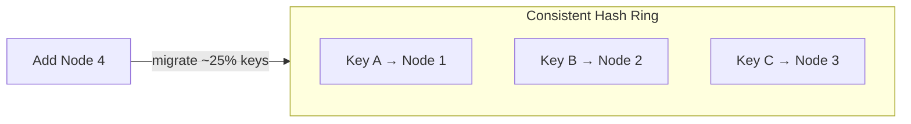
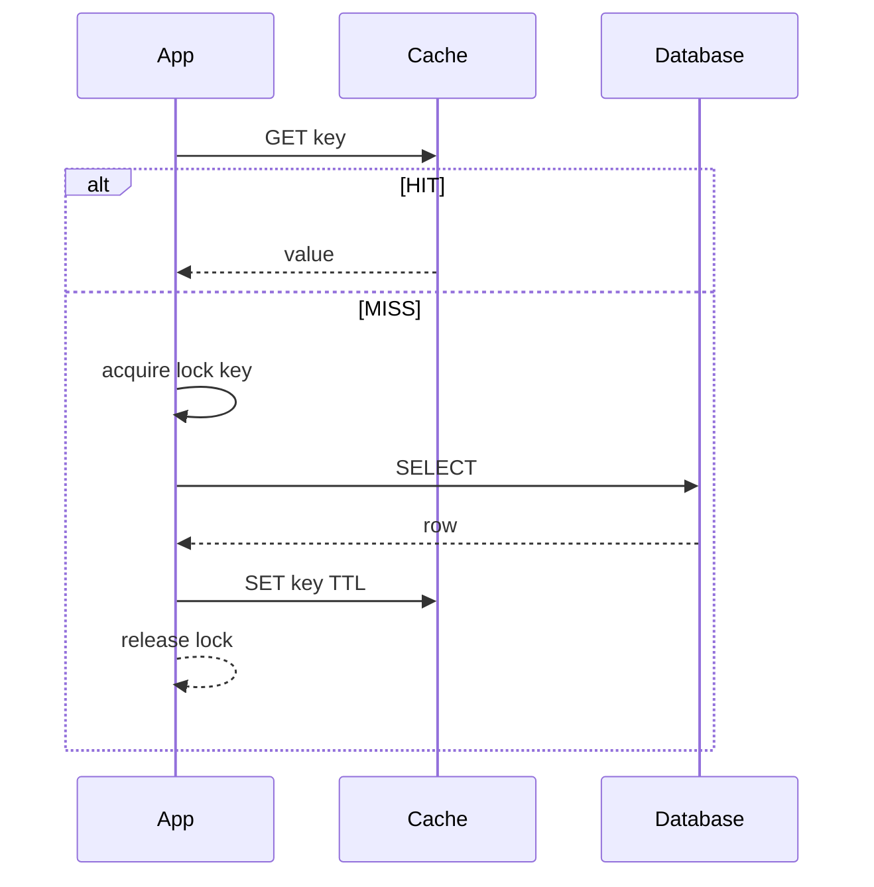

# Distributed Cache Design

## 1. Executive Summary

A **distributed cache** provides low-latency, shared in-memory storage across application tiers to reduce database load and improve response times. Principal-level design covers **partitioning** (consistent hashing), **replication** for availability, **eviction policies**, **cache coherence** (invalidation vs. TTL), **hot key mitigation**, and **failure behavior** (cache stampede, thundering herd).

This chapter designs a Memcached/Redis-cluster-class distributed cache serving 10M+ ops/sec with sub-millisecond p99 latency and 99.99% availability. Consistent hashing, cache-aside with stampede protection, and explicit failure behavior when the cache tier is lost are treated as mandatory interview and production topics—not optional optimizations.

## 2. Why This Topic Matters

Caching appears in nearly every system design interview and production stack. Architects must explain:

- Why **consistent hashing** beats modulo sharding.
- **Cache-aside vs. read-through vs. write-through** tradeoffs.
- **TTL vs. explicit invalidation** consistency models.
- **Replication** impact on consistency and failover.
- **Operational pain**: hot keys, memory pressure, big values.

Poor cache design causes stampedes, stale reads, cluster imbalance, and cascading DB failures when cache fails. Principal reviews often ask "what happens when Redis is entirely unavailable for 10 minutes"—answer must include measured DB capacity and degradation policy, not only replication topology. Cache is never a substitute for a database that cannot survive cache loss. Review [Caching Fundamentals](/docs/caching/caching-fundamentals) and [Cache Invalidation](/docs/caching/cache-invalidation) before mock interviews on this topic. Principal candidates should whiteboard consistent hashing from memory confidently.

## 3. Problems Being Solved

| Problem | Solution |
|---------|----------|
| **DB overload** | Absorb read traffic |
| **Latency** | Memory vs. disk/network DB |
| **Session state** | Shared cache across app servers |
| **Hot data** | Replicate or local L1 |
| **Scale memory** | Horizontal shard cluster |
| **Availability** | Replica failover |
| **Memory limits** | Eviction policies |
| **Consistency** | TTL + invalidation pub/sub |

## 4. Assumptions and System Model

### Phase 1: Clarify Requirements

**Functional:**

- `GET/SET/DELETE` key-value; optional CAS (compare-and-swap).
- TTL per key; max value size 1 MB.
- Namespaces per tenant.
- Optional: pub/sub invalidation channel.

**Non-functional:**

- p99 GET &lt; 2 ms same-AZ; &lt; 10 ms cross-AZ.
- 10M ops/sec cluster-wide.
- 99.99% availability.
- Linear scale-out by adding nodes (minimal remapping).

**Non-goals:** Persistent durable store (cache is ephemeral); complex queries.

| Assumption | Implication |
|------------|-------------|
| **Ephemeral data OK** | Eviction acceptable; rebuild from DB |
| **Eventual consistency** | TTL bounds staleness |
| **Crash-stop nodes** | Replication for HA |
| **Skewed access** | Hot key handling required |

## 5. Essential Terminology

| Term | Definition |
|------|------------|
| **Cache-aside** | App loads DB on miss, populates cache |
| **Read-through** | Cache fetches from DB on miss |
| **Write-through** | Write cache + DB synchronously |
| **Write-behind** | Write cache; async flush DB |
| **Consistent hashing** | Minimal key movement on node add/remove |
| **Virtual nodes (vnodes)** | Many hash points per physical node |
| **LRU** | Evict least recently used |
| **TTL** | Time-to-live expiration |
| **Cache stampede** | Many requests miss simultaneously |
| **Thundering herd** | Backend overload after expiry |
| **Hot key** | Disproportionate access to one key |

## 6. Core Mechanism

### 6.1 Phase 5: High-Level Architecture



*Figure 1: Distributed cache cluster with consistent hashing, primary-replica shards, optional L1.*

### 6.2 Phase 3: Define APIs

**Client protocol (Redis/Memcached-like):**

```
GET key → value | MISS
SET key value EX ttl
DEL key
CAS key version value  (optimistic concurrency)
MGET k1 k2 ...  (pipeline for efficiency)
```

**Cluster admin:**

```
ADD_NODE host:port
REMOVE_NODE host:port
GET_CLUSTER_HEALTH
REBALANCE_STATUS
```

**Invalidation (pub/sub):**

```
PUBLISH invalidate channel key_pattern
```

### 6.3 Phase 4: Model Data

**In-memory store per shard:**

- Hash table: `key → {value, expiry, version, size_bytes}`.
- LRU doubly-linked list for eviction tracking.
- Per-tenant quota counters.

**Cluster metadata (ZooKeeper/etcd):**

- Ring configuration: vnode → node mapping.
- Node health: last heartbeat, role (primary/replica).
- Migration state: keys in flux during rebalance.

**Key naming convention:** `{tenant}:{entity}:{id}` e.g., `t42:user:991`.

### 6.4 Phase 6: Deep Dives

**Consistent hashing:**

- Hash key and nodes to 0..2^32 ring.
- Key assigned to first node clockwise ≥ hash(key).
- Each physical node has 100–200 vnodes for balance.
- On node add: only adjacent key ranges migrate (~1/N keys).

**Replication:**

- Primary handles writes; async replicate to replica.
- On primary failure: promote replica (Raft/etcd coordination or external orchestrator).
- **Read from replica:** reduces primary load; may be stale—acceptable for many caches.

**Cache-aside pattern (recommended default):**

1. `GET cache`; hit → return.
2. Miss → `GET DB`; `SET cache` with TTL; return.
3. On write: `UPDATE DB`; `DEL cache` (not update-in-place—avoids race).

**Stampede prevention:**

- **Lock per key:** first miss acquires lock; others wait or serve stale.
- **Probabilistic early expiration:** jitter TTL refresh before expiry.
- **Singleflight:** dedupe in-flight loads for same key.



*Figure 2: Adding a node migrates only neighboring key ranges—not entire cache.*

**Hot key mitigation:**

- **Local L1** replica of hot key in app memory (short TTL 1s).
- **Key replication:** store hot key on multiple nodes with read fan-out.
- **Split key:** `user:123:profile:part1`, `part2`—last resort.



*Figure 3: Cache-aside with lock on miss—prevents stampede.*

### 6.5 Rebalancing

When adding node: mark migrating keys; dual-read (old+new) during copy; cutover; delete from old. Use incremental migration to avoid memory spike.

## 7. Step-by-Step Walkthrough

### 7.1 Normal read

1. App hashes `user:42` → shard 7 primary.
2. GET returns profile JSON; 1 ms latency.
3. No DB touch.

### 7.2 Expiry stampede

1. Popular key TTL expires; 1000 threads miss.
2. Singleflight: one thread loads DB; others wait 50 ms.
3. Key repopulated; remaining threads hit cache.

### 7.3 Cluster rebalance without outage

1. Add 4th cache node; ring assigns 25% keys to migrate.
2. Migration worker copies keys in batches; dual-read during copy.
3. Cutover per key range; delete from old node.
4. Hit ratio dips 2% during migration—acceptable maintenance window.
5. **Safety:** checksum verify; rollback plan if error rate spikes.

### 7.4 Cache penetration attack

1. Attacker requests random non-existent keys; every miss hits DB.
2. Bloom filter in front of cache rejects known-absent keys.
3. Rate limit per IP; alert on miss ratio anomaly.
4. **Principal:** defense in depth—cache is not authorization layer.

## 7A. Design Phase Summary

| Phase | Section | Key decisions |
|-------|---------|---------------|
| Requirements | §4 | GET/SET, TTL, HA scale-out |
| Scale | §10 | 10M ops/sec; sharding |
| APIs | §6.2 | Redis protocol + admin |
| Data model | §6.3 | key→value; ring metadata |
| Architecture | §6.1 | client router → shards |
| Deep dives | §6.4 | consistent hash; stampede |
| Reliability | §8–9 | replica failover |
| Security | §13 | AUTH, tenant prefix |
| Operations | §12 | hit ratio, rebalance |
| Tradeoffs | §16 | aside vs through |

## 8. Invariants and Guarantees

| Property | Guarantee |
|----------|-----------|
| **Single primary write** | Per key shard at a time |
| **Durability** | Not guaranteed—ephemeral |
| **Consistency** | Eventual; TTL-bound staleness |
| **CAS safety** | No lost updates if clients use CAS |
| **Availability** | Replica promotion restores service |

## 9. Failure Scenarios

| Scenario | Mitigation |
|----------|------------|
| **Cache total outage** | DB must absorb load—circuit breaker; degrade |
| **Hot key** | L1; replicate key |
| **Big value** | Reject &gt;1MB; compress |
| **Imbalanced ring** | More vnodes; manual rebalance |
| **Stale after write** | Delete-on-write; short TTL |
| **Split brain primary** | Fencing; consensus for promotion |
| **Migration data loss** | Verify checksum; dual-write period |

## 10. Performance Characteristics

### Phase 2: Estimate Scale

```
10M ops/sec cluster
Average value 2 KB → 20 GB/sec bandwidth (needs many NICs/shards)
Per node 100K ops/sec → 100 shards minimum
Memory: 500 GB working set → 10 nodes × 64 GB with replication 2× → 20 nodes
Latency: 0.5 ms LAN GET; 2 ms with serialization
```

| Policy | Hit ratio impact |
|--------|------------------|
| LRU | Good for temporal locality |
| TTL 5 min | Bounds staleness |
| No eviction headroom | OOM risk—reserve 20% free |

## 11. Scalability Limits

| Limit | Mitigation |
|-------|------------|
| Single hot key | Replicate; L1 |
| Memory | Shard; evict; don't cache everything |
| Cross-AZ latency | Client affinity same AZ |
| Large values | Chunk; CDN for blobs |
| Pub/sub invalidation fan-out | Scope channels; batch |

## 12. Operational Considerations

### Phase 9: Operations

- Metrics: hit ratio, evictions/sec, latency p99, memory %, hot keys.
- Alerts: hit ratio drop; memory &gt; 90%; replication lag.
- Runbooks: drain node before removal; emergency cache flush per namespace.
- Capacity: plan 30% headroom; rolling upgrades.

## 13. Security Considerations

### Phase 8: Security

- Network isolation; AUTH tokens per client.
- TLS in transit for multi-tenant SaaS.
- No sensitive data without encryption at application layer.
- Tenant key prefix isolation; ACL per namespace.
- Prevent cache poisoning: validate on fill from DB.

## 14. Cost Considerations

RAM is expensive vs. SSD/DB. Cache only high-ROI keys (read-heavy, expensive queries). Monitor cost per hit. Managed Redis/ElastiCache vs. self-hosted ops tradeoff.

## 15. Production Implementations

| System | Notes |
|--------|-------|
| **Redis Cluster** | 16384 hash slots; primary-replica; industry default |
| **Memcached** | Client-side consistent hash; simpler protocol |
| **Aerospike** | Flash + memory tier for large working sets |
| **Hazelcast** | JVM colocated cache for enterprise apps |
| **AWS ElastiCache** | Managed Redis/Memcached; ops savings |

**When to self-host:** Extreme scale cost optimization, custom eviction policies, or specialized hardware. **When managed:** Faster time-to-market, patching, and multi-AZ failover handled by vendor.

## 14A. Memory Planning Example

```
Working set keys:     50M
Avg value + metadata: 2 KB
Raw data:             100 GB
Replication factor 2: 200 GB
Overhead 30%:         260 GB cluster RAM
Headroom 20%:         ~312 GB provisioned
```

Adjust for compression (values) and L1 local cache hit ratio reducing central cluster load.

## 22A. Extended Follow-Ups

4. **Cache penetration (bogus keys).** — Bloom filter; negative caching with short TTL.
5. **Session cache vs object cache.** — Different TTL and security; don't mix key namespaces.

## 16. Alternatives and Tradeoffs

### Phase 10: Tradeoffs

| Pattern | Pros | Cons |
|---------|------|------|
| Cache-aside | Simple; app control | Stampede risk |
| Read-through | Centralized load logic | Cache complexity |
| Write-through | Stronger consistency | Write latency |
| TTL only | Simple invalidation | Stale window |
| Pub/sub invalidation | Fresher | Complexity; missed messages |
| Redis vs Memcached | Rich types; persistence option | Heavier |

## 17. Common Misconceptions

| Misconception | Reality |
|---------------|---------|
| "Cache replaces DB" | Cache is optimization layer |
| "Modulo N hashing scales" | Add node remaps most keys |
| "Update cache on write" | Delete safer than update |
| "Infinite hit ratio goal" | Memory bounded; evictions normal |
| "Replicas are always consistent" | Async replication lags |
| "Cache TTL fixes invalidation" | Stale window remains; delete-on-write for correctness |
| "Memcached and Redis interchangeable" | Cluster model and feature set differ |
| "Bigger values cache better" | Network and memory pressure; 1MB cap typical |
| "Hit ratio 100% achievable" | Working set exceeds RAM; eviction required |

## 17A. Failure scenario drill

Deploy removes 25% of cache nodes without migration—consistent hash remaps keys; massive miss storm hits database; site outage. Strong mitigation: incremental rebalance, dual-read during migration, load test before prod. Principal owns **change management** for topology changes as much as algorithm choice.

### 17B. Additional misconceptions

| Misconception | Reality |
|---------------|---------|
| "Redis persistence replaces DB" | RDB/AOF is durability option not source of truth |
| "Consistent hashing solves hot keys" | Hot keys need app-level mitigation |

## 18. Principal Architect Perspective

- **Define staleness budget** with product before TTL choices.
- **Cache failure mode** must be load-tested against DB.
- **Hot keys** appear in production—not edge case.
- **Consistent hashing** is table stakes for cluster scaling.
- **Don't cache everything**—ROI analysis per entity type.
- **Cache stampede** tests belong in release gate—not optional load test.
- **Eviction is normal**—size for working set not total dataset.

### 18.1 When principal escalates cache design

Escalate to architecture review when: (1) cache stores authoritative financial data without reconciliation; (2) no documented behavior on total cache loss; (3) hot key identified in production without mitigation plan; (4) cross-tenant keys without namespace prefix. These are incident precursors, not style preferences.

## 19. Architecture Review Exercise

**Scenario:** `key % num_servers` sharding; frequent scale events.

**Review:** Remapping storm; propose consistent hashing + vnodes; migration plan.

## 20. Whiteboard Explanation

"Clients route keys through a consistent hash ring with virtual nodes for balance. Each shard is a primary with async replica for failover. We use cache-aside: app reads cache, on miss loads DB and sets TTL. Writes update DB and delete cache keys. Hot keys get local L1 replicas. Stampede protection via singleflight. Cluster metadata in etcd coordinates failover and incremental rebalancing when nodes join or leave. Total cache loss must be load-tested against DB before production—cache is optimization, not crutch."

## 21. Interview Questions

1. **Design distributed cache for 10M QPS.** — *Signals:* consistent hash, replicas, client routing. *Red flags:* single Redis.
2. **Consistent hashing vs modulo?** — *Signals:* minimal remap on node change. *Red flags:* `hash % n`.
3. **Cache-aside vs write-through?** — *Signals:* app control vs consistency. *Follow-up:* delete-on-write.
4. **Handle cache stampede?** — *Signals:* singleflight, early refresh, stale-while-revalidate. *Red flags:* "add more cache."
5. **Hot key problem solutions?** — *Signals:* L1, key replication, split. *Red flags:* ignore.
6. **Replication consistency?** — *Signals:* async lag, read-your-writes caveat. *Red flags:* "replicas always fresh."
7. **Invalidation strategies?** — *Signals:* TTL vs pub/sub vs delete-on-write. *Follow-up:* missed pub/sub.
8. **Node add/remove without downtime?** — *Signals:* incremental migration, vnodes. *Red flags:* full flush.
9. **Redis vs Memcached?** — *Signals:* types, persistence option, cluster model. *Red flags:* "same thing."
10. **What happens when cache fails?** — *Signals:* DB load test, circuit breaker. *Red flags:* "cache always up."
11. **CAS use cases?** — *Signals:* optimistic concurrency, session update. *Red flags:* unnecessary everywhere.
12. **Size cluster memory?** — *Signals:* working set, replication factor, headroom. *Red flags:* exact DB size.

## 22. Interview Follow-Ups

1. **Session cache sticky sessions vs distributed.** — Distributed preferred for failover.
2. **Geo-distributed cache.** — Multi-region replicas; conflict resolution hard.
3. **Cache penetration (bogus keys).** — Bloom filter for existence.

## 23. Strong Answer Example

**Q:** Prevent cache stampede on hot key expiry?

**Outline:** Use singleflight so only one request reloads DB on miss; others await result. Add probabilistic early refresh: before TTL expires, one client probabilistically refreshes. Optionally serve stale-while-revalidate: return expired value while async refresh. For extreme hot keys, replicate across nodes or local L1 with 1s TTL.

## 24. Weak Answer Example

**Weak:** "Use a bigger Redis."

**Red flags:** No pattern, no stampede, no hashing, no invalidation.

## 25. Hands-On Exercise

1. Implement consistent hash ring with vnodes.
2. Simulate node add; measure key migration %.
3. Add cache-aside with singleflight.
4. Load test stampede with/without protection.
5. **Extension:** Implement delete-on-write invalidation from mock DB trigger.
6. **Extension:** Compare hit ratio LRU vs LFU on Zipf workload.

## 23A. Additional Strong Answer

**Q:** When to use write-through vs cache-aside?

**Outline:** Cache-aside: app manages cache; simplest; delete-on-write for invalidation. Write-through: synchronous cache+DB—stronger consistency, higher write latency. Write-behind: fastest writes, loss risk on crash. Default cache-aside for read-heavy workloads.

## 19A. Extended Review Scenario

**Scenario B:** Session cache 24h TTL; no invalidation on password change.

**Review:** Stolen session valid until TTL. Propose delete-on-password-change via pub/sub and shorter TTL for sensitive apps.

## 28B. Extended BOE Walkthrough (Interview Script)

**Interviewer:** "10M cache operations per second."

**Strong candidate:**

"10M ops/sec ÷ 80K per Redis shard ≈ 125 primaries with replication 2× → 250 instances—order of magnitude check. Working set 50M keys × 2KB = 100 GB—fits many shards; ops not memory bound.

I'll draw consistent hash ring with vnodes, client-side routing, primary-replica per shard. Cache-aside default; delete-on-write invalidation. Stampede: singleflight on miss.

Hot key: replicate or L1—Twitter-scale single key may need application-specific replication beyond default Redis.

Failure: cache down → DB must survive—circuit breaker and load test mandatory before launch. State fail-open is wrong for cache—DB is backstop not optional."

## 26. Knowledge Check (extended)

9. What problem do vnodes solve?
10. Why delete instead of update cache on write?
11. Name three stampede mitigations.
12. When is write-through justified?

## 27. Flashcards

| Front | Back |
|-------|------|
| Consistent hashing | Minimal key remap on topology change |
| Cache stampede | Many concurrent misses same key |
| Singleflight | Coalesce concurrent loads |
| vnode | Virtual node for ring balance |
| Negative cache | Short TTL cache for known-miss keys |
| Write-behind | Async DB write after cache update |
| Read replica | Stale reads OK for many cache workloads |
| Ring rebalance | Incremental key migration on topology change |
| Memory headroom | 20% free RAM to avoid eviction storms |
| Tenant prefix | Namespace isolation in key names |
| Zipf workload | Few hot keys, many cold—typical cache pattern |
| Circuit breaker | Stop DB calls when cache cluster down |
| Working set | Hot keys that fit in RAM budget |
| Cold key | Long-tail entries evicted first under LRU |

## 28. Cheat Sheet

```
REQUIREMENTS: GET/SET/DEL, TTL, scale-out, HA
SCALE: consistent hash; 100+ shards; 10M ops/sec
APIs: GET/SET/DEL/CAS; cluster admin
DATA: key→value+ttl; ring metadata in etcd
ARCH: client router → primary/replica shards
DEEP: cache-aside; stampede lock; hot key L1
RELIABILITY: replica failover; gradual rebalance
SECURITY: AUTH; tenant prefixes; TLS
OPS: hit ratio; memory alerts; drain node
TRADEOFFS: aside vs through; TTL vs invalidate
```

## 28A. Principal Interview Deep Dive

### When NOT to cache

- Data changes every request (personalized dynamic pricing mid-checkout).
- Dataset larger than economical RAM and low hit ratio.
- Strong consistency required on every read (financial balances—cache with extreme care).
- Security-sensitive data without encryption at application layer.

### Latency breakdown: cache hit vs miss

| Path | Typical p99 |
|------|-------------|
| L1 local hit | &lt; 0.1 ms |
| Redis hit same AZ | 0.5–2 ms |
| Redis cross-AZ | 2–5 ms |
| Cache miss + DB | 5–50 ms |

Target &gt;90% combined L1+Redis hit for read-heavy workloads.

### Eviction policy selection

| Policy | Workload |
|--------|----------|
| LRU | General temporal locality |
| LFU | Catalog with evergreen hot items |
| TTL-only | Session tokens |
| Random | Simple; approximate |

Redis defaults approximate LRU—sufficient for most. **Monitor evicted_keys** metric; sustained high eviction means undersized cluster or wrong keys cached.

### Multi-tenant isolation

Cache key MUST include `tenant_id` prefix—prevents cross-tenant data leak on key collision or bug. Per-tenant memory quotas via separate logical databases (Redis DB index) or key count sampling alerts.

## 29. Related Concepts

- [System Design Methodology](/docs/system-design/system-design-methodology)
- [Caching Fundamentals](/docs/caching/caching-fundamentals)
- [Distributed Caching](/docs/caching/distributed-caching)
- [Cache Invalidation](/docs/caching/cache-invalidation)
- [Consistent Hashing](/docs/caching/distributed-caching)
- [Redis](/docs/distributed-databases/redis)
- [Quorum Systems](/docs/consistency/quorum-systems)

## 30. References

- Karger et al. — consistent hashing paper (academic).
- Redis Cluster specification — hash slots implementation.
- Kleppmann, *DDIA* — caching chapters.

**Distinction:** Consistent hashing theory from literature; Redis slot assignment is implementation.

### 30A. Further reading paths

Deepen with [Distributed Caching](/docs/caching/distributed-caching) and [Cache Invalidation](/docs/caching/cache-invalidation). Apply patterns to [URL Shortener](/docs/system-design/url-shortener) redirect cache and [News Feed](/docs/system-design/news-feed) timeline cache—compare TTL vs explicit purge requirements. Lab: measure stampede multiplier on DB without singleflight at 1000 concurrent misses on one key.
