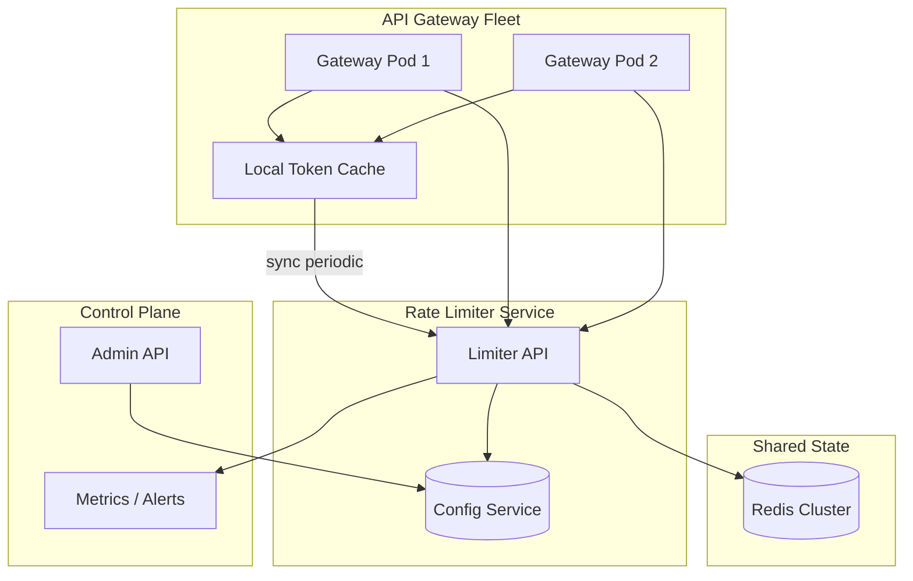
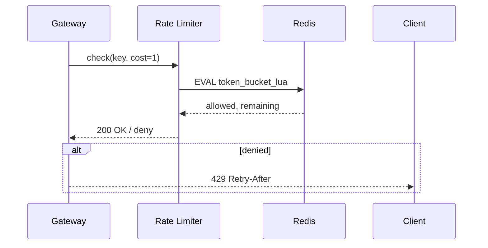
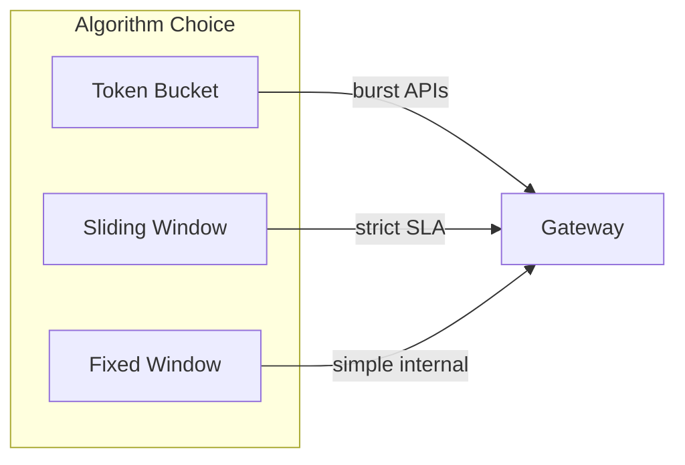

# Distributed Rate Limiter

## 1. Executive Summary

A **distributed rate limiter** enforces per-tenant, per-user, or per-API quotas across a fleet of stateless application servers with **consistent enforcement** despite clock skew, partial failures, and high request rates. Principal candidates must compare **token bucket**, **leaky bucket**, and **sliding window** algorithms; choose between **centralized** (Redis/etcd) and **approximate local** (gossip) approaches; and articulate **safety** (never exceed hard caps) vs. **liveness** (don't block all traffic on store outage) tradeoffs.

This chapter designs a global rate-limiting service for API gateways handling millions of RPS with sub-millisecond decision latency, hierarchical limits (global → tenant → user), and burst allowance.

## 2. Why This Topic Matters

Rate limiting protects systems from abuse, ensures fair sharing, and enforces commercial SLAs. It appears in principal interviews and production architecture because:

- **Correctness under concurrency** requires atomic operations or proven approximate algorithms.
- **Distributed state** introduces race conditions absent in single-node limiters.
- **Edge vs. central** placement affects latency and consistency.
- **Failure modes** are subtle—fail-open vs. fail-closed has business implications.

Every API gateway, CDN, and multi-tenant SaaS platform implements some form of distributed rate limiting. Misconfiguration causes outages (fail-closed during Redis blip) or revenue loss (fail-open during attack).

## 3. Problems Being Solved

| Problem | Solution |
|---------|----------|
| **DDoS / abuse** | Hard caps per IP/API key |
| **Noisy neighbor** | Per-tenant quotas |
| **Cost control** | Limit expensive endpoints |
| **Fairness** | Weighted limits by plan tier |
| **Burst traffic** | Token bucket allowance |
| **Global enforcement** | Shared counter store |
| **Low latency** | Local cache with sync |
| **Observability** | Metrics on throttle events |

## 4. Assumptions and System Model

### Phase 1: Clarify Requirements

**Functional:**

- Check-and-increment: allow or deny request with `429 Too Many Requests`.
- Configurable limits: `N requests per window` per key (tenant, user, IP, endpoint).
- Hierarchical: all levels must pass (global AND tenant AND user).
- Response headers: `X-RateLimit-Limit`, `Remaining`, `Reset`.
- Dynamic config updates without deploy.

**Non-functional:**

- Decision latency p99 &lt; 5 ms (in-process + one network hop).
- Accuracy: hard caps within 1% for billing tiers; soft limits can be approximate.
- 100K limit checks/sec per region; horizontal scale.
- Availability: 99.99% for limiter service.

**Non-goals:** Per-packet network rate limiting (L4); ML-based anomaly detection.

| Assumption | Implication |
|------------|-------------|
| **Clocks skew** | Prefer sliding window log or Redis TIME; avoid pure local timers |
| **Redis (or similar) available** | Central store for strict limits |
| **Keys are hashable strings** | `tenant:user:endpoint` composite keys |
| **Deny is cheaper than overload** | Fail-closed for paid tiers; configurable |

## 5. Essential Terminology

| Term | Definition |
|------|------------|
| **Token bucket** | Tokens refill at rate R; burst capacity B |
| **Leaky bucket** | Fixed outflow rate; smooths bursts |
| **Fixed window** | Counter resets each wall-clock window |
| **Sliding window** | Rolling count over last T seconds |
| **Sliding window log** | Store timestamps per request; precise but memory-heavy |
| **Sliding window counter** | Weighted blend of current + previous window |
| **Lua script / atomic INCR** | Redis atomicity for check-and-decrement |
| **Fail-open** | Allow traffic when limiter unavailable |
| **Fail-closed** | Deny when limiter unavailable |
| **Cell-based limit** | Divide time into cells; sum recent cells |

## 6. Core Mechanism

### 6.1 Phase 5: High-Level Architecture



*Figure 1: Gateways consult limiter service backed by Redis; optional local cache for soft limits; config plane separate.*

### 6.2 Phase 3: Define APIs

**Internal gRPC/HTTP:**

```
POST /v1/check
Body: { "key": "tenant:123:user:456:/v1/search", "cost": 1 }
Response: { "allowed": true, "remaining": 42, "reset_at": 1690000000 }

POST /v1/configure
Body: { "key_pattern": "tenant:123:*", "limit": 1000, "window_sec": 60, "burst": 100 }
```

**Gateway integration:** Middleware calls `check` before upstream; on deny return `429` with `Retry-After`.

### 6.3 Phase 4: Model Data

**Redis keys (per limit rule):**

- `rl:{key}:tokens` — token bucket balance (float or integer micro-units).
- `rl:{key}:window:{epoch}` — fixed/sliding window counter.
- `rl:{key}:log` — sorted set of timestamps (sliding log, capped).

**Config store (etcd/DB):**

| Field | Description |
|-------|-------------|
| `rule_id` | UUID |
| `key_pattern` | Glob match on request key |
| `limit` | Max requests per window |
| `window_sec` | Window size |
| `burst` | Token bucket burst |
| `tier` | free/pro/enterprise |

**Metadata TTL:** All Redis keys expire after 2× window to prevent unbounded growth.

### 6.4 Phase 6: Deep Dives

**Token bucket (Redis Lua):**

```lua
-- Pseudocode: atomic refill + consume
local tokens = tonumber(redis.call('GET', key)) or burst
local last = tonumber(redis.call('GET', key..':ts')) or now
tokens = math.min(burst, tokens + (now - last) * rate)
if tokens >= cost then
  redis.call('SET', key, tokens - cost)
  redis.call('SET', key..':ts', now)
  return {1, tokens - cost}
else
  return {0, tokens}
end
```

**Sliding window counter (memory efficient):**

`count = count_curr_window * (1 - elapsed/window) + count_prev_window * (elapsed/window)`

Two Redis keys per window pair; atomic INCR on current; weighted sum for decision.

**Hierarchical check:** Evaluate global → tenant → endpoint in sequence; short-circuit on first deny. Batch Redis via `MGET` or pipeline.

**Local approximate cache:** Gateway keeps 100ms local token budget synced from central; reduces Redis QPS 10×; accept slight over-admission with global reconciliation.



*Figure 2: Single round-trip atomic check in Redis—correctness depends on script atomicity.*

### 6.5 Multi-region

**Option A:** Regional Redis; limits are per-region (3× effective quota unless divided).

**Option B:** Global Redis with cross-region latency (5–50 ms)—accurate but slow.

**Option C:** Regional counters + global sync via async aggregation—eventual global cap.

Principal recommendation: **split quotas by region** for latency; **global cap** only for expensive abuse prevention via async path.

## 7. Step-by-Step Walkthrough

### 7.1 API request under tenant limit

1. Gateway extracts tenant_id, user_id, route; builds key `t:42:u:9:route:search`.
2. Middleware calls limiter with cost=1.
3. Limiter loads rule: 100 req/min, burst 20.
4. Lua executes token bucket; returns allowed, remaining=73.
5. Gateway adds headers; forwards to backend.
6. Metric `rate_limit_allowed_total` incremented.

### 7.3 Enterprise tier fail-closed incident

1. Redis cluster fails over; 30 s write unavailability.
2. Enterprise APIs configured fail-closed return 503.
3. Support receives tickets; ops switch enterprise to fail-open temporarily via feature flag.
4. Post-incident: dual Redis clusters; automated failover testing monthly.
5. **Principal lesson:** fail policy is product/legal decision—document in ADR with approval chain.

### 7.4 Dynamic limit raise for batch job

1. Tenant requests temporary 10× limit for nightly ETL window.
2. Admin API creates time-bound rule override with auto-expiry.
3. Audit log records approver; metrics confirm no abuse post-window.
4. Override stored in etcd; limiter watches and hot-reloads rules.

## 7A. Design Phase Summary

| Phase | Section | Key decisions |
|-------|---------|---------------|
| Requirements | §4 | Hierarchical limits; headers; dynamic config |
| Scale | §10 | 250K checks/sec; Redis sharded |
| APIs | §6.2 | check/configure endpoints |
| Data model | §6.3 | Redis token keys; etcd rules |
| Architecture | §6.1 | Gateway → Limiter → Redis |
| Deep dives | §6.4 | Lua atomicity; local cache |
| Reliability | §8–9 | Fail-open/closed policy |
| Security | §13 | mTLS; key namespacing |
| Operations | §12 | throttle dashboards |
| Tradeoffs | §16 | accuracy vs latency |

## 8. Invariants and Guarantees

| Property | Type | Mechanism |
|----------|------|-----------|
| **No over-count lost updates** | Safety | Atomic Lua / Redis transactions |
| **Hard cap (strict mode)** | Safety | Central store; no local over-admit |
| **Soft cap (approximate)** | Liveness | Local cache may exceed briefly |
| **Config consistency** | Eventual | etcd watch; cache rules 1s TTL |
| **Availability** | Liveness | Fail-open/closed policy explicit |

**Safety vs. liveness:** Strict billing limits favor safety (fail-closed); internal APIs may fail-open to preserve availability.

## 9. Failure Scenarios

| Scenario | Impact | Mitigation |
|----------|--------|------------|
| **Redis primary down** | No checks | Replica promote; fail-open policy |
| **Network partition** | Split brain counters | Per-region quotas; merge conservatively |
| **Clock skew** | Token refill errors | Redis TIME; logical clocks |
| **Hot key** | Single tenant saturates shard | Hash tags; dedicated shard |
| **Lua timeout** | Slow checks | Key sharding; limit script complexity |
| **Config publish delay** | Stale limits | Version stamp in response |
| **Thundering herd after window reset** | Traffic spike | Jitter Retry-After; smooth refill |

## 10. Performance Characteristics

### Phase 2: Estimate Scale

```
API gateways: 50 pods × 5K RPS = 250K RPS per region
Limiter checks: 250K RPS (1 per request)
Redis: single shard ~100K ops/sec → need 3+ shards or local cache
Latency budget: 2ms Redis + 1ms network + 1ms app
Memory: 1M active keys × 64 bytes ≈ 64 MB per region (manageable)
```

| Algorithm | Redis ops/check | Accuracy |
|-----------|-----------------|----------|
| Fixed window | 1 INCR | Boundary burst 2× |
| Sliding log | 1 ZADD + 1 ZCOUNT | Exact |
| Sliding counter | 2 INCR + read | ~1% error |
| Token bucket | 1 EVAL | Exact burst |

## 11. Scalability Limits

| Limit | Mitigation |
|-------|------------|
| Redis ops/sec | Local cache; read replicas for checks (careful) |
| Hot tenant key | Dedicated key partition |
| Config cardinality | Pattern rules vs. per-key rules |
| Cross-region accuracy | Regional budget split |



*Figure 3: Algorithm selection by use case—token bucket for burst tolerance; sliding for accuracy.*

## 12. Operational Considerations

### Phase 9: Operations

- Dashboards: throttle rate by tenant, Redis latency, deny ratio.
- Alerts: Redis memory, failover events, anomaly deny spikes.
- Runbooks: switch fail-open; emergency limit raise; drain hot key.
- Testing: chaos Redis outage; load test boundary windows.
- SLO: 99.99% check success; p99 &lt; 5 ms.

## 13. Security Considerations

### Phase 8: Security

- **Key forgery:** Gateway signs keys; limiter trusts mTLS from gateway only.
- **Limit bypass:** Enforce at edge; defense in depth at service mesh.
- **Redis exposure:** VPC only; AUTH; no public endpoints.
- **DoS on limiter:** Rate limit the limiter; connection pools.
- **Tenant isolation:** Keys namespaced; no cross-tenant rule bleed.

## 14. Cost Considerations

Redis cluster cost vs. overloaded origin—limiter is cheap insurance. Local cache reduces Redis size and ops. Managed API gateway rate limits (AWS API Gateway, Cloudflare) trade control for ops savings.

## 15. Production Implementations

| System | Approach |
|--------|----------|
| **Redis + Lua** | Industry standard custom limiter |
| **Envoy rate limit service** | gRPC RLDS/xDS integration |
| **Kong / NGINX** | Plugin-based; often Redis backend |
| **GCRA** | Generic Cell Rate Algorithm in some proxies |

## 16. Alternatives and Tradeoffs

### Phase 10: Tradeoffs

| Approach | Pros | Cons |
|----------|------|------|
| Central Redis | Accurate | Latency, SPOF |
| Local only | Fast | Inaccurate globally |
| Hybrid | Balance | Complexity |
| Fixed window | Simple | 2× burst at boundary |
| Sliding log | Precise | Memory per key |
| Fail-open | High availability | Abuse risk |
| Fail-closed | Protects backend | Outage amplification |

## 17. Common Misconceptions

| Misconception | Reality |
|---------------|---------|
| "INCR is enough" | Race without atomic read-modify-write |
| "Nginx limit_req scales globally" | Per-node unless shared store |
| "Sliding window = one counter" | Fixed window ≠ sliding |
| "Always fail-open" | Paid APIs often fail-closed |
| "Microsecond precision matters" | Second-level windows dominate |
| "Rate limit once at edge only" | Per-service limits still needed for defense in depth |
| "Local cache is always safe" | Over-admission breaks strict billing caps |
| "GCRA and token bucket identical" | Different burst smoothing behavior |
| "429 without Retry-After is fine" | Clients need backoff guidance |

## 18. Principal Architect Perspective

- Clarify **hard vs. soft limits** with product before algorithm choice.
- Document **fail-open/closed** per API tier in ADR.
- **Hierarchical limits** prevent one dimension from starving others.
- Measure **throttle as product signal**, not only ops metric.
- **Clock skew** breaks naive distributed token buckets—use centralized time source.
- **Coordinate with billing** when limits enforce commercial tiers—misconfiguration is revenue incident.
- **Chaos test Redis failover** quarterly; fail policy must be feature-flaggable without deploy.

### 18.1 Envoy and service mesh integration

In mesh architectures, rate limiting moves to **sidecar or dedicated RLDS service** (Envoy Rate Limit Service). Principal architects decide whether limits live at edge gateway (coarse) vs. per-service (fine-grained). Duplicated limits at both layers require **consistent key schema** and documentation to avoid double-throttling legitimate traffic.

## 19. Architecture Review Exercise

**Scenario:** Each app server keeps local counter reset every minute.

**Review:** 50 servers → 50× limit; propose Redis Lua; discuss local cache with sync budget.

## 20. Whiteboard Explanation

"Every request hits gateway middleware that builds a composite key. The limiter service runs atomic token-bucket Lua in Redis per key, supporting burst and refill rate. Rules live in a config service with pattern matching. Hierarchical checks run global then tenant then user. We return standard rate-limit headers. On Redis failure, enterprise APIs fail-closed; internal APIs fail-open per policy. Local optional cache reduces Redis load at cost of brief over-admission."

## 21. Interview Questions

1. **Design distributed rate limiter for 1M RPS.** — *Signals:* Redis cluster, Lua, local cache, sharding. *Red flags:* per-server counters.
2. **Token bucket vs. sliding window?** — *Signals:* burst vs accuracy, boundary behavior. *Follow-up:* sliding counter approximation.
3. **Implement atomic increment in Redis.** — *Signals:* Lua script, WATCH/MULTI, or INCR with TTL. *Red flags:* GET then SET race.
4. **Handle Redis down—fail-open or closed?** — *Signals:* tiered policy, business tradeoff. *Red flags:* unqualified answer.
5. **Per-user and global limits together?** — *Signals:* hierarchical short-circuit, pipeline. *Red flags:* single counter.
6. **Fixed window boundary burst problem?** — *Signals:* 2× at boundary, sliding fix. *Red flags:* unaware of issue.
7. **Rate limit across 10 data centers?** — *Signals:* regional quotas, global async cap. *Red flags:* single global Redis only.
8. **Sub-millisecond latency requirements?** — *Signals:* local cache, approximate admission. *Red flags:* cross-region Redis every request.
9. **Different limits per API tier?** — *Signals:* config patterns, rule matching. *Follow-up:* dynamic updates.
10. **Prevent race conditions without Redis?** — *Signals:* DB row lock, consensus, or accept inaccuracy. *Red flags:* "use mutex in app."
11. **GCRA vs. token bucket?** — *Signals:* smoother rate, used in Envoy. *Red flags:* conflate algorithms.
12. **Observability for rate limiting?** — *Signals:* deny metrics, saturation alerts, tenant dashboards.

### 21.1 Scoring rubric (principal loop)

| Dimension | Strong (4) | Weak (1) |
|-----------|------------|----------|
| Correctness | Atomic ops; no over-limit under concurrency | Race conditions ignored |
| Scale | Sharding + optional local cache | Single Redis |
| Failure | Explicit fail policy per tier | "Redis HA" hand-wave |
| Business | Throttle as product/SLA signal | Purely technical |

## 22. Interview Follow-Ups

1. **Billing requires exact counts.** — Sliding log or sync counter with nightly reconciliation to warehouse; document acceptable error bound.
2. **Customer wants burst of 10K for batch job.** — Temporary rule override with expiry; audit approver; auto-revert.
3. **Attacker rotates IPs.** — Layer IP + API key + device fingerprint limits; behavioral scoring upstream.
4. **Global limit conflicts with regional fairness.** — Split regional budgets; global cap as abuse-only async path.
5. **Compare to API gateway built-in limits.** — Dedicated service offers dynamic config, hierarchical keys, and centralized metrics across heterogeneous gateways.

## 14A. Cost and Infrastructure Sizing

Redis cluster cost scales with key cardinality and ops/sec. At 250K checks/sec with 64-byte keys and 1M active limit keys, memory is modest (~100 MB) but **ops/sec drives shard count**. Local cache reducing Redis load 10× directly reduces infrastructure cost. Principal architects present TCO comparison: dedicated limiter vs. over-provisioned origin during abuse without limits.

## 23. Strong Answer Example

**Q:** Token bucket vs. sliding window?

**Outline:** Token bucket allows controlled burst: refill at steady rate, capacity B. Good for APIs tolerating short spikes. Sliding window counts requests in rolling interval—smoother enforcement, no 2× boundary burst of fixed windows. Sliding window log is exact but memory-heavy; sliding window counter approximates with two fixed windows. Choose bucket when burst is feature; sliding when strict fairness matters.

## 24. Weak Answer Example

**Weak:** "Use a database counter."

**Red flags:** Latency, contention, no burst model, no atomicity discussion.

## 25. Hands-On Exercise

**Lab:** `labs/lab-011-rate-limiter/` — distributed rate limiter on **`:8101`**

```bash
cd labs/lab-011-rate-limiter
python3 -m venv .venv && source .venv/bin/activate
pip install -r requirements.txt
pytest tests/ -v
docker compose -p lab011 -f docker/docker-compose.yml up --build -d
chmod +x scripts/demo_rate_limit.sh && ./scripts/demo_rate_limit.sh
```

| Step | Endpoint | What happens |
|------|----------|--------------|
| 1 | `POST /v1/check` | Token-bucket check per tenant + route |
| 2 | Burst requests | Allowed until bucket empty, then 429 |
| 3 | `POST /v1/chaos/redis-down` | Simulate Redis outage |
| 4 | `POST /v1/check` during outage | Fail-open vs fail-closed policy |
| 5 | `GET /health` | Allowed/denied counters |

**Swagger:** http://localhost:8101/docs

### Engineer guide: how the local stack works

1. **Redis token bucket** — Lua script atomically decrements tokens with refill rate + burst capacity.
2. **Hierarchical keys** — tenant + route dimensions; single round-trip per check.
3. **Sliding vs fixed window** — compare boundary behavior under burst traffic in tests.
4. **Fail modes** — `redis-down` chaos toggles fail-open (allow) vs fail-closed (deny) — product decision.
5. **Gateway placement** — limiter runs at edge; central Redis shards horizontally at ~80K ops/shard.

Pairs with [Airbnb Distributed Rate Limiting](/docs/real-world-scenarios/airbnb-distributed-rate-limiting).

### Build-from-scratch exercise (optional)

1. Implement token bucket in Redis with Lua.
2. Load test 10K concurrent clients; verify no over-limit beyond burst.
3. Compare fixed vs. sliding window boundary behavior.
4. Simulate Redis outage; implement fail-open flag.
5. **Extension:** Hierarchical limits (global + user) in single Lua script.

## 23A. Additional Strong Answer

**Q:** Design for 1M RPS global checks.

**Outline:** 1M RPS ÷ ~80K ops/shard ≈ 13 Redis shards minimum; add 50% headroom. Client-side local token bucket synced every 100ms cuts central load 5–10× for soft limits. Strict billing limits bypass local cache. Deploy limiter pods close to gateways (same AZ). Pipeline Redis commands per request for hierarchical limits.

## 19A. Extended Review Scenario

**Scenario B:** Database row per counter with `SELECT FOR UPDATE` per request.

**Review:** Lock contention at thousands RPS; propose Redis Lua. Estimate lock wait p99 under load. Discuss whether DB limits acceptable for low-traffic admin APIs only.

## 28B. Extended BOE Walkthrough (Interview Script)

**Interviewer:** "1M API checks per second globally."

**Strong candidate:**

"1M checks/sec centralized is ~13 Redis primaries at 80K ops/sec each before headroom—add replication and 30% buffer → ~20 primaries. Local soft cache at gateway cutting 50% traffic halves Redis need—state assumption explicitly.

Hierarchical limits: global cap AND per-tenant AND per-user—evaluate in sequence, pipeline Redis scripts. Fail-closed for enterprise billing tier documented in ADR.

I'll mention GCRA as Envoy alternative and chaos test Redis quarterly. Clock: use Redis TIME in Lua, not app wall clock."

## 26. Knowledge Check (extended)

9. What is GCRA?
10. Boundary burst in fixed window?
11. When fail-open vs fail-closed?
12. How many ops saved with 50% local cache hit?

## 27. Flashcards

| Front | Back |
|-------|------|
| Token bucket | Refill rate + burst capacity |
| 429 | HTTP Too Many Requests |
| GCRA | Generic Cell Rate Algorithm |
| Fail-closed | Deny when limiter unavailable |
| Sliding window counter | Weighted sum of two fixed windows |

## 28. Cheat Sheet

```
REQUIREMENTS: per-key limits, burst, hierarchy, headers, dynamic config
SCALE: 250K+ checks/sec; Redis sharded; optional local cache
APIs: POST /check, POST /configure
DATA: Redis keys per rule; etcd for config
ARCH: Gateway → Limiter → Redis
DEEP: Lua atomic token bucket; sliding counter for accuracy
RELIABILITY: replica failover; explicit fail policy
SECURITY: mTLS gateway→limiter; key namespacing
OPS: throttle metrics; chaos tests
TRADEOFFS: accuracy vs latency; fail-open vs closed
```

## 28A. Principal Interview Deep Dive

### Algorithm selection matrix

| Use case | Recommended algorithm | Rationale |
|----------|----------------------|-----------|
| Public REST API | Token bucket + burst | Smooth UX; tolerate spikes |
| Billing meter | Sliding window log | Hard cap accuracy |
| DDoS protection | Fixed window + block | Simple; aggressive |
| Internal microservice | GCRA via Envoy | Standard sidecar integration |
| Batch ETL window | Temporary override rule | Scheduled capacity |

### Back-of-envelope: proving Redis shard count

Given 1M checks/sec target and 80K atomic ops/sec per Redis primary (conservative with Lua):

```
Shards = ceil(1_000_000 / 80_000) = 13 primaries
With replication factor 2: 26 Redis instances
Add 30% headroom: ~17 primaries
```

If 60% of checks hit local soft cache (100ms budget sync), effective central load:

```
1M × 0.4 = 400K ops/sec → still 5+ shards without headroom
```

State assumptions aloud in interviews—interviewers reward explicit math over "we'll shard."

### Safety and liveness formalization

- **Safety property:** Under no concurrency pattern shall a strict-tier client exceed configured hard limit for a completed window (assuming synchronized Redis primary).
- **Liveness property:** If Redis is healthy, every check request receives allow/deny response within timeout T.
- **Degraded mode:** When Redis unavailable, liveness prioritized via fail-open OR safety via fail-closed—cannot maximize both.

### Organizational rollout

1. **Phase 1:** Shadow mode—log would-be throttles without enforcing.
2. **Phase 2:** Enforce on non-critical internal APIs.
3. **Phase 3:** Enforce on external APIs with generous limits.
4. **Phase 4:** Tune limits from p99 latency and abuse metrics.

Principal architects own the rollout ADR and coordinate with customer success before tightening paid-tier limits.

## 29. Related Concepts

- [System Design Methodology](/docs/system-design/system-design-methodology)
- [Redis](/docs/distributed-databases/redis)
- [Distributed Leases](/docs/consensus/distributed-leases)
- [Partial Failure](/docs/distributed-systems-foundations/partial-failure)
- [SLO, SLI, and Error Budgets](/docs/reliability-and-resilience/slo-sli-error-budgets)

## 30. References

- Redis documentation — atomic transactions, Lua scripting.
- Endresen, "Generic Rate Limiting Concepts" — GCRA algorithm.
- Envoy Rate Limit Service API — production integration pattern.

**Distinction:** Token bucket mathematics are well-established; Redis Lua patterns are implementation choices.
