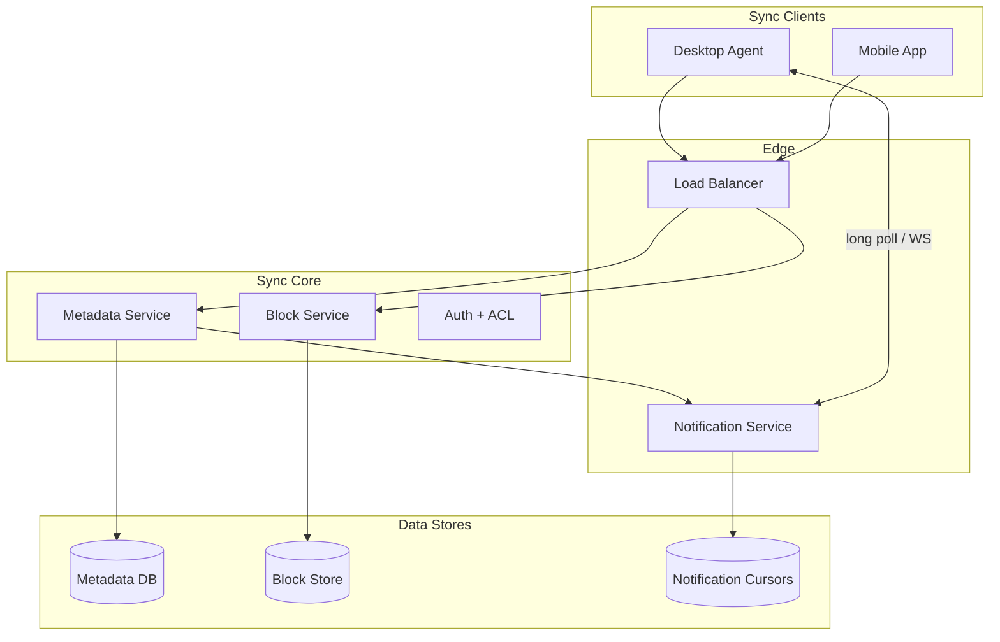
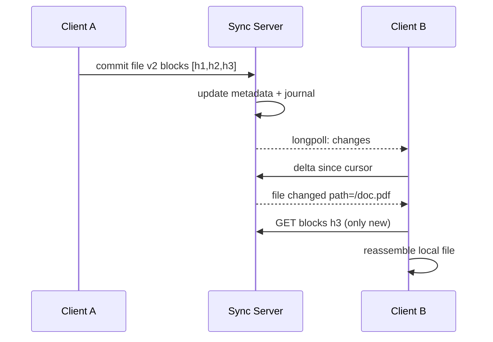
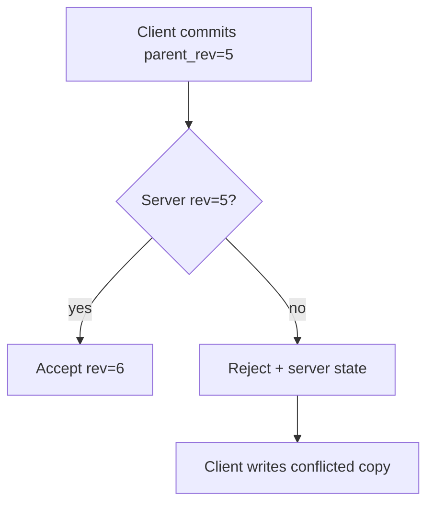

# Dropbox Design

## 1. Executive Summary

**Dropbox-class sync** keeps files consistent across devices and users through block-level deduplication, delta synchronization, conflict resolution, and a metadata service tracking file versions and folder hierarchy. Principal-level design covers **content-defined chunking**, **namespace sync protocol**, **offline clients**, **sharing and permissions**, and **notification** of remote changes.

This chapter designs a multi-device sync platform for 500M+ users and trillions of blocks, optimizing bandwidth via deduplication and minimizing sync latency via push notifications and incremental block lists. Block hashing, sync cursor protocol, and explicit conflict behavior are mandatory interview topics.

## 2. Why This Topic Matters

File sync is a classic system design interview (popularized by early Dropbox engineering posts) testing:

- **Deduplication** across users and versions.
- **Sync protocol** efficiency over unreliable networks.
- **Consistency** when two clients edit offline.
- **Metadata scale** for per-user file trees.
- **Security** of shared links and encryption.

Production failures include sync loops, data loss on conflict mishandling, and storage explosion without dedup. Review [File Storage System](/docs/system-design/file-storage-system) and [Replication](/docs/replication/overview) before deep dives.

## 3. Problems Being Solved

| Problem | Solution |
|---------|----------|
| **Bandwidth cost** | Block deduplication; delta sync only changed blocks |
| **Multi-device consistency** | Central metadata + sync cursors |
| **Offline edits** | Local queue; merge on reconnect |
| **Conflicts** | Last-writer-wins or conflict copies |
| **Large files** | Chunking; resumable block upload |
| **Sharing** | ACL on namespace; shared folder metadata |
| **Fast propagation** | Long-poll/WebSocket change notifications |
| **Storage cost** | Global block store with ref counting |

## 4. Assumptions and System Model

**Functional:**

- Sync folders across desktop, mobile, web.
- Block-level upload/download with deduplication.
- File versioning (retain N versions).
- Shared folders with read/write permissions.
- Selective sync (exclude folders on device).

**Non-functional:**

- Sync notification latency &lt; 5 s p99 for online clients.
- Block upload dedup hit rate 30–60% for typical workloads.
- Metadata availability 99.99%.
- Client works offline up to 30 days.

| Assumption | Implication |
|------------|-------------|
| **Blocks immutable** | Content-addressed storage |
| **Files are block lists** | Metadata stores block hash sequence |
| **Clients cache blocks** | Local index for dedup before upload |
| **Conflicts rare but critical** | Explicit conflict file policy |
| **Untrusted client possible** | Server validates hashes and ACL |

## 5. Essential Terminology

| Term | Definition |
|------|------------|
| **Block / chunk** | Fixed or content-defined piece of file |
| **Content hash** | SHA-256 of block bytes—address in block store |
| **File signature** | Ordered list of block hashes |
| **Sync cursor** | Opaque token marking client's known metadata state |
| **Delta sync** | Transfer only changed blocks |
| **CDC** | Content-defined chunking—boundaries by content |
| **Ref count** | Number of file versions referencing a block |
| **Tombstone** | Deleted file marker in sync journal |
| **Conflict copy** | Duplicate file when merge impossible |
| **Block manifest** | Server record of file → blocks mapping |
| **Long poll** | Hold HTTP request until changes or timeout |

## 6. Core Mechanism

### 6.1 Architecture



*Figure 1: Clients sync metadata via Metadata Service; blocks via Block Service; push via Notification Service.*

### 6.2 Sync Protocol APIs

```
GET /sync/delta?cursor={cursor}
→ { entries: [FileChange...], cursor, has_more }

POST /blocks/upload { hash, size } → presigned URL or accept if exists
POST /files/commit { path, block_hashes[], parent_rev, client_mtime }

GET /blocks/{hash} → download stream

GET /sync/longpoll?cursor={cursor}&timeout=30
→ { changes: true } | timeout
```

### 6.3 Data Model

**User namespace:**

```
file_id, user_id, path, block_hashes[], rev, size, mtime, deleted
```

**Block store:**

```
hash → { size, storage_key, ref_count }
```

**Shared folder:**

```
share_id, members[], role, root_file_id
```

**Sync journal (per user):**

```
seq, file_id, change_type, timestamp → feeds delta API
```

### 6.4 Deep Dives

**Client upload (deduplicated):**

1. Client chunks file locally (4 MB fixed or CDC).
2. For each block: compute hash; check local index + server `has_block` batch API.
3. Upload only missing blocks.
4. Commit file metadata with block hash list and parent revision.

**Delta download:**

1. Client long-polls or receives push.
2. Calls `/sync/delta` with cursor.
3. For each changed file: compare block lists with local; fetch missing blocks.
4. Reassemble file; update local index.



*Figure 2: Client B fetches only new blocks after metadata delta.*

**Conflict resolution:**

- Optimistic concurrency: commit requires `parent_rev` matching server.
- On mismatch: server rejects; client downloads latest, saves "conflicted copy".
- Alternative: operational transform for text—rare in generic file sync.



*Figure 3: Revision-based optimistic concurrency with conflict copy fallback.*

**Deduplication across users:**

- Global block store keyed by hash.
- Privacy: encryption before upload (optional client-side) breaks cross-user dedup—product tradeoff.
- Server-side dedup within account always; cross-account requires legal/product approval.

## 7. Step-by-Step Walkthrough

### 7.1 First upload

1. User drops 100 MB file in synced folder.
2. Client splits 25 × 4 MB blocks; all new hashes.
3. Uploads 25 blocks; commits metadata.
4. Server stores blocks once; file rev=1.

### 7.2 Edit one byte

1. Client re-chunks; CDC may shift boundaries—only 1–2 blocks change typically.
2. Uploads 1 new block; commits rev=2 referencing mostly same hashes.
3. Other devices delta-sync 1 block—bandwidth minimal.

### 7.3 Offline conflict

1. Two laptops edit same file offline.
2. First reconnect wins rev=3.
3. Second commit fails parent_rev; downloads rev=3, saves `file (conflicted copy).doc`.

### 7.5 Selective sync bandwidth savings

1. Mobile user excludes `Photos/Raw` folder (200 GB) from sync.
2. Metadata still lists folder; client skips block download for excluded paths.
3. User saves cellular bandwidth; server stores full library for desktop clients.

### 7.6 Shared link read-only access

1. Owner generates link with read-only token for `report.pdf`.
2. Recipient downloads via HTTPS gateway—block fetch authorized by link scope not full account.
3. Link expiry 7 days; audit log records downloads.

## 7B. Sync Protocol Edge Cases

| Edge case | Behavior |
|-----------|----------|
| Block upload succeeds; commit network fail | Client retries commit same block list—server idempotent on rev |
| Clock skew 1 hour on client | Server mtime authoritative; may confuse UI sort—not data loss |
| User deletes file while uploading | Cancel upload session; GC parts |
| Partial LAN sync | Server wins on conflict; LAN is optimization only |

Block store **never** deletes block until ref count zero across all users—shared installer hash may serve millions of devices.


| Phase | Key decisions |
|-------|---------------|
| Requirements | multi-device sync, sharing, offline |
| Scale | global block store; sharded metadata |
| APIs | delta + block upload/commit |
| Data | content-addressed blocks + file rev |
| Deep dives | dedup; conflict copies |
| Reliability | immutable blocks; ref counting |

## 8. Invariants and Guarantees

| Property | Guarantee |
|----------|-----------|
| **Block immutability** | Hash identifies fixed bytes |
| **File revision monotonic** | rev increments on successful commit |
| **Dedup integrity** | Same hash → same bytes (collision astronomically rare) |
| **ACL** | Enforced server-side on all ops |
| **Durability** | Committed blocks replicated per policy |

## 9. Failure Scenarios

| Scenario | Mitigation |
|----------|------------|
| **Partial block upload** | Commit only after all hashes present |
| **Sync loop** | Rev mismatch detection; client hash verify |
| **Notification missed** | Periodic delta poll backup |
| **Ref count leak** | GC sweeper for unreferenced blocks |
| **CDC boundary shift** | Re-upload more blocks; tune chunk algorithm |
| **Client clock skew** | Server authoritative mtime on conflict |

## 10. Performance Characteristics

```
500M users × 10K blocks avg deduped → trillions of blocks
Block size 4 MB → balance dedup vs metadata overhead
Delta API: 100 bytes/change entry; batch 1000 entries
Long-poll: 1M concurrent connections → notification tier scale-out
Dedup saves 30–60% storage for versioned office docs (workload dependent)
```

## 11. Scalability Limits

| Limit | Mitigation |
|-------|------------|
| Metadata per user huge | Pagination; selective sync |
| Hot block (popular installer) | CDN cache for hash |
| Journal per user growth | Compaction; snapshot cursors |
| Cross-user dedup privacy | Opt-in or encrypted dedup only |

## 12. Operational Considerations

- Metrics: sync latency, upload dedup ratio, conflict rate, block GC backlog.
- Alerts: delta API error spike; notification delay &gt; 30s.
- Client compatibility: protocol versioning.
- Load test: 1M clients reconnect after outage.

## 13. Security Considerations

- TLS everywhere; optional client-side encryption (E2EE) vs dedup tradeoff.
- Shared link tokens with expiry and password.
- Block fetch requires file ACL path authorization.
- Rate limit block upload per account.
- Audit shared folder access for enterprise.

## 14. Cost Considerations

Block storage largest cost—dedup and compression critical. Egress on sync reduced by delta. Notification tier cheaper than constant polling. Tier old block versions to cold storage after N days.

## 15. Production Implementations

| System | Notes |
|--------|-------|
| **Dropbox** | Block sync; public engineering posts on metadata |
| **Google Drive** | Different chunking; similar metadata sync |
| **OneDrive** | Office integration; similar patterns |
| **iCloud Drive** | Apple ecosystem sync |
| **Syncthing** | P2P optional; no central block store |

**Note:** Specific chunk sizes and dedup policies are implementation choices; verify against current vendor docs if citing numbers.

## 16. Alternatives and Tradeoffs

| Approach | Pros | Cons |
|----------|------|------|
| File-level sync | Simpler | High bandwidth |
| Block dedup | Storage + bandwidth savings | Complex metadata |
| Fixed vs CDC chunking | Fixed simpler | CDC better dedup on edits |
| E2EE | Privacy | No server dedup |
| P2P sync | No upload bandwidth | NAT traversal complexity |
| LWW conflicts | Simple | Data loss risk |

## 16A. When to Choose Block Sync vs Alternatives

| Requirement | Block sync (this chapter) | File-level rsync | Object store + metadata |
|-------------|---------------------------|------------------|-------------------------|
| Frequent small edits | Excellent (CDC) | Poor | Good with chunking |
| Real-time multi-device | Core strength | Manual | Polling lag |
| Web-only access | Needs gateway | N/A | Native |
| Bandwidth cost | Low (delta) | Medium | Low with multipart |
| Implementation complexity | High | Low | Medium |

Principal recommendation: block sync for desktop/mobile agents with continuous sync; pure object API for server-side and web upload/download without local folder semantics. Hybrid products (Dropbox, Drive) use both—sync agent plus HTTP API reading same metadata layer.

## 16B. Operational Metrics Dashboard

Track weekly: dedup ratio (bytes uploaded / bytes changed), conflict rate per 10K commits, sync latency p99 (change on device A → visible on B), block GC backlog hours, notification delivery delay. Regression in dedup ratio often indicates CDC misconfiguration or client bug shipping full files.

| "Dropbox stores folders" | Metadata tree + blocks |
| "Conflicts auto-merge" | Binary files get conflict copies |
| "Dedup across all users default" | Privacy and encryption limits |
| "Client trusts local clock" | Server revision wins |

## 18. Principal Architect Perspective

- **Block immutability** simplifies replication and caching.
- **parent_rev** is the concurrency contract—document conflict UX.
- **Notification + delta poll** dual path for reliability.
- **GC ref counting** prevents storage leaks at scale.
- **CDC tuning** is ops-sensitive—wrong params inflate uploads.

## 19. Architecture Review Exercise

**Scenario:** Sync uploads full file on every save; 1 GB docs; user complaints.

**Review:** Implement block hashing + delta; CDC chunking; local block index.

## 20. Whiteboard Explanation

"Files are lists of content hashes pointing into immutable block storage. Clients chunk locally, upload only missing blocks, and commit metadata with a parent revision for optimistic locking. Other devices receive change notifications, pull metadata deltas, and fetch only new blocks. Conflicts create duplicate files when revisions diverge. Reference counting garbage-collects unreferenced blocks. Metadata sharded per user; blocks globally deduplicated by hash."

## 21. Interview Questions

1. **Design Dropbox.** — *Signals:* block store, metadata, delta sync. *Red flags:* FTP full file.
2. **How deduplication works?** — *Signals:* content hash, ref count. *Follow-up:* cross-user.
3. **Sync 1 GB file after 1-byte edit?** — *Signals:* re-chunk, few blocks upload.
4. **Conflict handling?** — *Signals:* parent_rev, conflict copy.
5. **Offline sync protocol?** — *Signals:* local queue, commit on reconnect.
6. **Notify clients of changes?** — *Signals:* long-poll/WebSocket + backup poll.
7. **Block size tradeoff?** — *Signals:* dedup vs metadata overhead.
8. **CDC vs fixed chunks?** — *Signals:* insert efficiency vs complexity.
9. **Shared folder ACL?** — *Signals:* server enforce on block GET.
10. **E2EE impact?** — *Signals:* no server dedup; key management.
11. **Scale metadata?** — *Signals:* shard by user_id.
12. **GC unreferenced blocks?** — *Signals:* ref count, sweeper.
13. **Sync cursor purpose?** — *Signals:* incremental delta without full tree scan.
14. **Malicious client uploads wrong hash?** — *Signals:* verify on read; integrity check.

## 21B. Extended Interview Question Deep Dives

**Q15 (Principal):** Enterprise customer demands cross-user deduplication for 40% storage savings but legal requires data isolation.

*Strong signals:* Per-tenant dedup only within tenant boundary; global hash store with tenant-scoped ref count; legal review for cross-tenant. *Alternative:* Client-side encryption breaks all cross-user dedup—quantify cost. *Red flags:* "Just dedup everything." *Rubric:* 5/5 addresses legal + technical boundary explicitly.

**Q16 (Principal):** Mobile client on 2G uploads 500 MB video—design resumable path.

*Strong signals:* Block/chunk with checkpoint; resume upload_id; exponential backoff; WiFi-only policy optional; server `has_block` batch check. *Metrics:* bytes uploaded vs bytes in file ratio for efficiency dashboard.

## 22. Interview Follow-Ups

1. **Selective sync.** — Per-device folder subscription in metadata.
2. **Version history restore.** — Retain old block lists per rev.
3. **LAN sync.** — Local discovery; still server authoritative metadata.

## 23. Strong Answer Example

**Q:** Two users edit the same file offline—what happens?

**Outline:** Each client commits with parent_rev when online. First commit succeeds, incrementing server rev. Second fails rev check; client fetches latest version, merges if text (optional), otherwise saves conflicted copy with naming convention. User notified to resolve manually. Never silently overwrite without policy.

## 24. Weak Answer Example

**Weak:** "Just compare file timestamps and pick newest."

**Red flags:** Clock skew, data loss, no block-level efficiency, no server authority.

## 25. Hands-On Exercise

1. Implement fixed 4 MB chunking with SHA-256 block IDs.
2. Build delta API with cursor over change journal.
3. Simulate conflict with parent_rev mismatch.
4. Reference-count blocks; GC when count=0.
5. **Extension:** Compare upload bytes fixed vs CDC on inserted bytes.

## 26. Knowledge Check

1. What is a file signature?
2. Why immutable blocks?
3. Three conflict resolution strategies?
4. How delta sync saves bandwidth?

## 27. Flashcards

| Front | Back |
|-------|------|
| Block hash | Content address in global store |
| parent_rev | Optimistic concurrency token |
| Sync cursor | Incremental metadata fetch position |
| CDC | Content-defined chunk boundaries |
| Conflict copy | Preserved alternate edit |
| Long poll | Efficient change notification |
| Ref count | Blocks GC when zero |
| Delta API | Changed files since cursor |
| Selective sync | Exclude folders per device |
| Immutable block | Enables dedup and CDN cache |

## 28. Cheat Sheet

```
REQUIREMENTS: multi-device sync, sharing, offline, versions
SCALE: sharded metadata; global block store
APIs: delta, block upload, commit, longpoll
DATA: file→block_hashes; hash→bytes; journal
ARCH: metadata svc + block svc + notifications
DEEP: dedup upload; parent_rev conflicts; CDC
RELIABILITY: immutable blocks; ref GC; poll backup
SECURITY: ACL; optional E2EE tradeoff
OPS: dedup ratio; conflict rate; sync latency
```

## 17A. Failure Scenario Drill

Engineering disables `parent_rev` check "temporarily" for mobile bug—two devices overwrite each other's edits silently for a week before user reports. Mitigation: never bypass revision check in prod; feature flag with audit; conflict copy UX tested in QA. Principal treats **concurrency contract** as data safety invariant.

## 18.1 Sync Protocol Versioning

Mobile clients lag 3 versions behind server protocol. Server must support N-2 protocol versions with translation layer; breaking changes gated behind `protocol_version` in commit API. Deprecation timeline communicated 6 months ahead—enterprise customers on old agents.

## 19A. Extended Review Scenario

**Scenario B:** Block store keyed by `(user_id, hash)` not global hash—dedup savings lost; storage 3× budget.

**Review:** Global content-addressed blocks with ref count; privacy mode opts out cross-user dedup per account policy.

## 21A. Additional Interview Questions

15. **Bandwidth math for 1M users sync photos?** — *Signals:* delta blocks vs full file; average change rate. *Red flags:* ignore dedup.
16. **Malware in shared folder?** — *Signals:* scan on commit; block hash if known bad.

## 22A. Extended Follow-Ups

4. **LAN sync discovery.** — mDNS local transfer; server authoritative for conflict.
5. **End-to-end encryption impact.** — No cross-user dedup; key escrow policy.

## 23A. Additional Strong Answer

**Q:** Why content-defined chunking vs fixed 4 MB?

**Outline:** CDC (e.g., Rabin fingerprint) shifts boundaries based on content so inserting bytes at start of file changes only 1–2 chunk boundaries—not entire file re-chunked. Fixed chunks simpler but 1-byte insert at offset 0 may re-hash all blocks. CDC costs CPU on client; tune window size. For interview: mention both; default fixed unless edit-in-place workload proven.

## 28A. Principal Interview Deep Dive

### Block size and metadata overhead

| Block size | 1 TB file blocks | Metadata list size |
|------------|------------------|-------------------|
| 1 MB | 1M hashes | Large delta API payloads |
| 4 MB | 256K hashes | Industry common default |
| 64 MB | 16K hashes | Poor dedup on small edits |

### Notification fanout scale

1M online clients long-polling: notification tier horizontal scale; connection memory ~10 KB each → 10 GB RAM per 1M—plan regional pools. Backup 60s delta poll if push missed.

### Storage ref count GC edge case

Block shared by file rev 1 and rev 2; delete rev 1 only decrements ref; rev 2 retains block. Purge only when all manifests unreference hash—test in unit tests.

## 28B. Extended BOE Walkthrough

**Interviewer:** "Design Dropbox for 500M users."

**Strong candidate:**

"Files = ordered block hash lists; blocks immutable in global store keyed by SHA-256. Upload missing blocks only; commit with parent_rev.

Sync: delta API + long-poll notification; conflict → conflicted copy. Metadata sharded by user_id; blocks global.

Storage: ref count GC. Dedup cross-user optional—privacy product decision.

Scale: trillions of blocks—object store backend per [Global Object Store](/docs/system-design/global-object-store). Bandwidth saved by delta—critical cost metric."

## 29. Related Concepts

- [File Storage System](/docs/system-design/file-storage-system)
- [Global File Transfer Platform](/docs/system-design/global-file-transfer-platform)
- [Global Object Store](/docs/system-design/global-object-store)
- [Replication](/docs/replication/overview)
- [Conflict Resolution](/docs/replication/conflict-resolution)
- [System Design Methodology](/docs/system-design/system-design-methodology)

## 30. References

- Dropbox engineering blog — early sync architecture posts (implementation anecdotes).
- Blake et al. — content-defined chunking literature.
- Kleppmann, *DDIA* — data synchronization.

**Distinction:** Public Dropbox posts describe historical design; current internals may differ—use for pattern learning, not exact specs.

### 30A. Further Reading Paths

Pair with [Global File Transfer Platform](/docs/system-design/global-file-transfer-platform) for partner B2B transfer vs consumer sync. Study [Conflict Resolution](/docs/replication/conflict-resolution) for advanced merge strategies beyond conflict copies.

### 30B. Bandwidth Savings Model

```
1M users × 5 GB library = 5 EB total (upper bound)
Without dedup/versioning: full re-upload on change
With block sync 1% daily change: 5 GB × 1% × 1M = 50 TB/day upload
CDC vs fixed 4MB on 1KB insert: fixed may re-upload 100+ MB; CDC ~4–8 MB
```

Numbers illustrative—measure per workload.

### 30D. Principal Architecture Review Checklist

- [ ] `parent_rev` enforced on every commit—no bypass flag in prod
- [ ] Conflict copy UX documented and user-tested
- [ ] Block GC ref counting verified under shared-folder delete scenarios
- [ ] Notification + 60s delta poll backup both tested
- [ ] Client protocol version N-2 supported with deprecation timeline
- [ ] E2EE mode documented impact on dedup and support tooling
- [ ] Load test: 1M clients reconnect after 10 min notification outage
- [ ] Bandwidth dashboard: delta ratio vs full-file upload baseline &gt; 90% on doc edits

Sync systems fail in edge cases—checklist forces explicit review of concurrency and notification paths that interviews emphasize but teams skip in haste.
