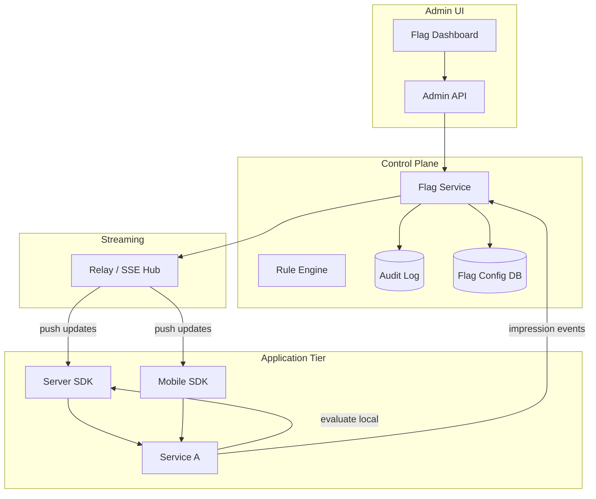
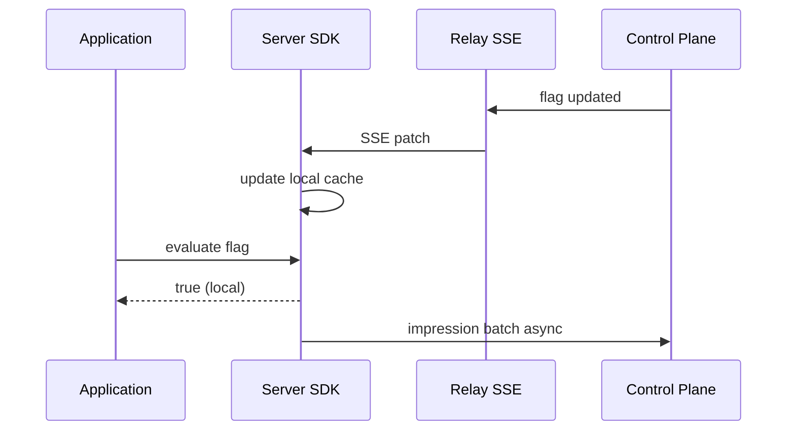
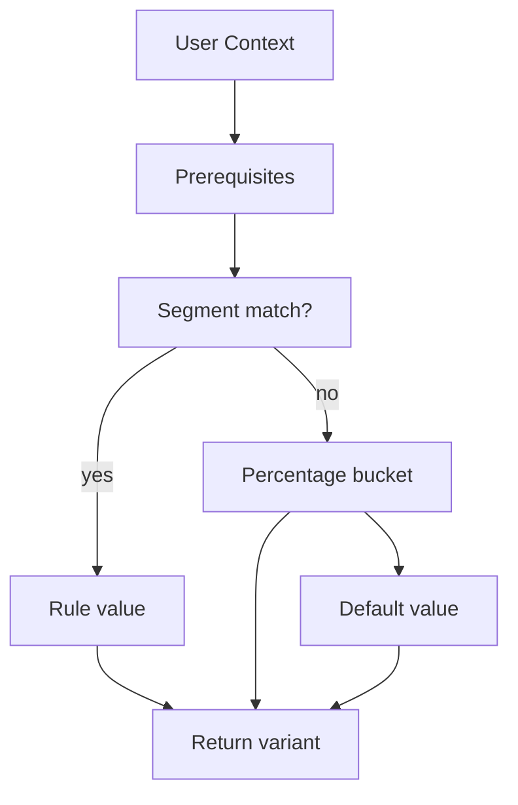

# Feature Flag Platform

## 1. Executive Summary

A **feature flag platform** enables runtime control of feature visibility, gradual rollouts, A/B experiments, and kill switches without redeploying application code. Principal-level design covers **evaluation latency**, **consistent bucketing**, **targeting rules**, **SDK caching**, **audit trails**, and **safe defaults** when the flag service is unavailable.

This chapter designs a LaunchDarkly/Unleash-class platform evaluating 1M+ flags/sec with p99 under 10 ms and sub-second propagation of flag changes globally. Deterministic hashing for percentage rollouts, server-side vs client-side evaluation tradeoffs, and explicit fail-open vs fail-closed policies are mandatory interview topics.

## 2. Why This Topic Matters

Feature flags decouple release from deploy—critical for continuous delivery and experimentation. Architects must explain:

- **Evaluation path** (SDK local cache vs server round-trip).
- **Consistent bucketing** so users don't flip variants on each request.
- **Targeting** (user attributes, segments, geo).
- **Kill switch** behavior during incidents.
- **Technical debt** of long-lived flags.

Poor flag design causes flickering UX, security holes (client-side secrets), and outage amplification when flag service fails. Review [Caching Fundamentals](/docs/caching/caching-fundamentals) and [System Design Methodology](/docs/system-design/system-design-methodology).

## 3. Problems Being Solved

| Problem | Solution |
|---------|----------|
| **Gradual rollout** | Percentage bucketing |
| **Instant kill switch** | Toggle off without deploy |
| **A/B experiments** | Variant assignment + analytics |
| **Targeting** | Rule engine on user attributes |
| **Low latency** | SDK streaming + local cache |
| **Audit compliance** | Change history per flag |
| **Multi-environment** | dev/staging/prod flag namespaces |
| **Permission control** | RBAC on flag management |

## 4. Assumptions and System Model

**Functional:**

- CRUD flags with variants (boolean, string, JSON).
- Rules: default, percentage rollout, attribute targeting.
- SDKs for Java, Go, JS, mobile.
- Real-time flag update push to SDKs.
- Impression/exposure events for analytics.

**Non-functional:**

- Evaluation p99 &lt; 10 ms (local SDK &lt; 1 ms).
- Flag change propagation &lt; 5 s global.
- 99.99% availability for evaluation path.
- 10K flags; 1M evaluations/sec.
- Audit log immutable 1 year.

| Assumption | Implication |
|------------|-------------|
| **SDK caches flag state** | Must handle stale briefly |
| **User context provided** | user_id, attributes for targeting |
| **Deterministic assignment** | Hash(user_id + flag_key) |
| **Server-side for sensitive flags** | Client SDK not trusted for auth flags |
| **Default off safe** | Fail-closed for risky features |

## 5. Essential Terminology

| Term | Definition |
|------|------------|
| **Feature flag / toggle** | Runtime configurable switch |
| **Variant** | Possible return values |
| **Evaluation** | Resolve flag value for context |
| **Bucketing** | Assign user to percentage bucket |
| **Targeting rule** | Condition on attributes |
| **Segment** | Predefined user group |
| **Impression** | Record that flag was evaluated |
| **Kill switch** | Emergency off |
| **SDK stream** | SSE/WebSocket flag updates |
| **Stale cache** | SDK serving old flag state briefly |
| **Prerequisite flag** | Flag depends on another flag |
| **Flag hygiene** | Remove dead flags to reduce debt |

## 6. Core Mechanism

### 6.1 Architecture



*Figure 1: Admin updates flags in control plane; SDKs cache locally and receive streaming updates.*

### 6.2 APIs

**Admin:**

```
POST /flags { key, variants, rules, default }
PATCH /flags/{key}/rules
GET /flags/{key}/audit
```

**SDK bootstrap:**

```
GET /sdk/flags?env=prod&sdk_key=...  (initial full snapshot)
GET /sdk/stream  (SSE updates)
```

**Evaluation (server-side optional):**

```
POST /evaluate { flag_key, context: { user_id, country, plan } }
→ { value, variant, reason }
```

### 6.3 Data Model

**Flag definition:**

```json
{
  "key": "new-checkout",
  "type": "boolean",
  "default": false,
  "rules": [
    { "priority": 1, "segment": "beta-testers", "value": true },
    { "priority": 2, "percentage": 10, "value": true },
    { "priority": 99, "value": false }
  ],
  "prerequisites": [{ "flag": "checkout-enabled", "value": true }]
}
```

**Segment:**

```
segment_id, name, query: { country: US, plan: enterprise }
```

**Impression event:**

```
{ flag_key, user_id_hash, variant, timestamp, eval_reason }
```

### 6.4 Deep Dives

**Deterministic percentage rollout:**

```
bucket = hash(flag_key + user_id) % 10000
if bucket < percentage * 100 → enabled
```

Same user always gets same bucket for same flag—prevents flicker.

**SDK evaluation flow:**

1. App calls `client.boolVariation("new-checkout", context, false)`.
2. SDK checks in-memory flag snapshot (updated via stream).
3. Rule engine evaluates prerequisites → segments → rules → default.
4. Returns value in &lt; 1 ms locally.
5. Async batch sends impression events.



*Figure 2: Streaming updates refresh SDK cache; evaluation is local.*

**Fail-open vs fail-closed:**

| Policy | When | Risk |
|--------|------|------|
| **Fail-closed (default false)** | New risky features | Feature off during outage |
| **Fail-open (default true)** | Kill switch protecting broken feature | Bad feature on during outage |
| **Cached last known** | Most production SDKs | Brief stale state |

Document per flag in runbook.

**Server-side vs client-side evaluation:**

| Mode | Pros | Cons |
|------|------|------|
| **Server SDK** | Secret rules; trusted | Per-service deploy |
| **Client SDK (mobile/web)** | Low latency UI | Rules visible; tamper risk |
| **Server evaluate API** | Centralized | Latency; availability dependency |

Sensitive flags (pricing, auth) must be server-side only.



*Figure 3: Evaluation order: prerequisites → segments → percentage → default.*

**A/B experiment integration:**

- Variant assignment same bucketing as rollout.
- Impression events joined with conversion metrics in warehouse.
- Statistical analysis outside flag platform (Looker, internal).

## 7. Step-by-Step Walkthrough

### 7.1 Gradual rollout

1. Flag `new-checkout` at 0% default off.
2. PM sets 5% rollout rule.
3. Relay pushes update; SDKs evaluate within 5 s.
4. ~5% users see new checkout consistently.

### 7.2 Kill switch incident

1. New checkout causes payment errors.
2. On-call toggles flag off in dashboard.
3. Propagation &lt; 5 s; SDKs return false.
4. Incident mitigated without redeploy.

### 7.3 Relay outage

1. SSE connection drops; SDK uses cached snapshot.
2. Evaluation continues locally—no app errors.
3. Stale up to TTL (e.g., 30s poll backup).
4. New changes delayed until reconnect—not fail-open unless configured.

### 7.5 Gradual rollout increase without reshuffle

1. Flag at 10% bucket 0–999.
2. Increase to 25%—only buckets 1000–2499 **newly** enabled.
3. Users in 0–999 unchanged—stable UX during rollout ramp.

### 7.6 Experiment conclusion and cleanup

1. Variant B wins A/B with 5% conversion lift.
2. Set default true; remove percentage rule.
3. Engineering removes `if flag` branches in code next sprint.
4. Archive flag in platform—CI lint prevents resurrection.

## 7B. Organizational Rollout Playbook

| Stage | Audience | Rollback |
|-------|----------|----------|
| Dev dogfood | Engineers | Instant toggle |
| Internal beta | All employees | &lt;5 min kill switch |
| 1% prod | Random users | Monitor error budget |
| 100% | Everyone | Code path default; remove flag |

Principal aligns flag stages with [SLO SLI Error Budgets](/docs/reliability-and-resilience/slo-sli-error-budgets) gates.

## 10A. Relay Connection Storm Recovery

After relay regional restart, 200K SDKs reconnect simultaneously:

```
SSE accept rate limit: 5K/sec per relay node
20 nodes → 100K/sec—drain backlog in 2s
SDK exponential backoff jitter prevents thundering herd
```

Load test relay reconnect before major control plane deploy.


| Phase | Key decisions |
|-------|---------------|
| Requirements | rollout, targeting, kill switch, audit |
| Scale | local SDK eval; SSE push |
| APIs | admin CRUD; SDK bootstrap/stream |
| Data | flag rules; segments; impressions |
| Deep dives | deterministic hash; fail policy |

## 8. Invariants and Guarantees

| Property | Guarantee |
|----------|-----------|
| **Deterministic bucketing** | Same user+flag → same bucket |
| **Rule priority** | Lower number evaluated first |
| **Audit append-only** | Flag changes immutable log |
| **Evaluation availability** | SDK local cache when relay down |
| **Consistency** | Brief stale across SDKs during propagation |

## 9. Failure Scenarios

| Scenario | Mitigation |
|----------|------------|
| **Control plane down** | SDK cached snapshot |
| **Relay down** | Polling fallback |
| **Bad rule deploy** | Audit rollback; prerequisite flags |
| **Hash collision concern** | Use 32-bit+ hash; not security |
| **Flag debt** | Lint CI for flags &gt; 90 days |
| **Client tampering** | Server-side eval for sensitive |

## 10. Performance Characteristics

```
1M eval/sec × 1 KB context = mostly local CPU in SDK
Impression batch: 100 events per 10s per instance
Relay: 100K concurrent SSE connections → connection tier scale
Flag snapshot size: 10K flags × 2 KB ≈ 20 MB—gzip to SDK
```

## 11. Scalability Limits

| Limit | Mitigation |
|-------|------------|
| Snapshot too large | Flag pruning; environment split |
| SSE connection count | Regional relay shards |
| Segment size millions | Precomputed membership sync |
| Impression volume | Sample 10% for analytics |
| Rule complexity | Compile rules; limit depth |

## 12. Operational Considerations

- Metrics: eval latency, relay lag, connection count, impression rate.
- Alerts: flag change error; relay disconnect storm.
- Runbooks: global kill switch; rollback flag version.
- Flag lifecycle: create → rollout → 100% → remove code → archive flag.

## 13. Security Considerations

- SDK keys scoped read-only per environment.
- Admin RBAC: who can change prod flags.
- Audit all prod changes; optional approval workflow.
- Do not put secrets in flag values—use secret manager.
- Server-side only for entitlements and pricing.

## 14. Cost Considerations

SaaS per-seat pricing vs self-hosted Unleash ops. Impression event volume drives warehouse cost—sample or aggregate. Relay infrastructure for SSE at scale. ROI: fewer failed deploys and faster rollback.

## 15. Production Implementations

| System | Notes |
|--------|-------|
| **LaunchDarkly** | Enterprise leader; streaming SDK |
| **Unleash** | OSS self-hosted option |
| **Split.io** | Experimentation focus |
| **Flagsmith** | OSS + hosted |
| **Custom in-app** | Common; debt risk without platform |

## 16. Alternatives and Tradeoffs

| Approach | Pros | Cons |
|----------|------|------|
| Feature flag platform | Targeting; audit; SDK | Cost; dependency |
| Config file in deploy | Simple | No runtime toggle |
| Env variables | Easy | Requires restart |
| DB config table | Flexible | No SDK; cache needed |
| Client-only flags | Fast UI | Tamper risk |
| Service mesh traffic split | Infra level | Not app-aware targeting |

## 16A. Anti-Patterns in Feature Flag Usage

| Anti-pattern | Why harmful | Fix |
|--------------|-------------|-----|
| Flag inside tight loop | Eval overhead | Hoist outside loop |
| 200 flags per request | Snapshot bloat | Consolidate config |
| Same flag 5 names | Drift | Single key registry |
| Permanent `if (flag)` | Dead code paths | Remove after rollout |
| Client-only paywall | Fraud | Server entitlements |

Quarterly audit exports all prod flags with last-change date and code reference count from static analysis.

## 16B. Experimentation Ethics and Compliance

Before A/B test storing impressions:

- Legal review for GDPR/CCPA consent
- Exclude minors if product allows under-18
- Document hypothesis and success metric upfront
- Stop test early if harm metric degrades (error rate, revenue)

Principal architects partner with legal/privacy—not optional for global products.

| "Client SDK secure for auth" | Server evaluate entitlements |
| "Random rollout per request" | Must hash user for consistency |
| "Flag service in hot path" | SDK local eval default |
| "100% rollout ends flag life" | Remove code and archive flag |

## 18. Principal Architect Perspective

- **Fail policy per flag** documented before launch.
- **Server-side** for anything affecting money, security, compliance.
- **Flag retirement** in same epic as full rollout.
- **Prerequisite flags** prevent partial enablement bugs.
- **Staging mirrors prod rules** for realistic QA.

## 19. Architecture Review Exercise

**Scenario:** Mobile app calls server API per page load to check 50 flags; p99 latency 300 ms.

**Review:** Server SDK with local cache + SSE; batch evaluate; reduce flag count.

## 20. Whiteboard Explanation

"Product and eng manage flags in admin UI stored in config DB with audit log. Server and client SDKs bootstrap full flag snapshot and subscribe to SSE relay for updates. Evaluation runs locally: check prerequisites, segment rules, percentage bucket via hash(user_id+flag_key), then default. Returns in sub-millisecond. Impressions batched async for analytics. Kill switch toggles off; propagates in seconds. Sensitive flags evaluated server-side only. SDK uses cached snapshot if control plane unavailable—fail-closed to default off for risky features."

## 21. Interview Questions

1. **Design feature flag system.** — *Signals:* SDK cache, SSE, bucketing. *Red flags:* DB per request.
2. **Consistent percentage rollout?** — *Signals:* hash(user+flag). *Follow-up:* flicker prevention.
3. **Kill switch during outage?** — *Signals:* toggle off; propagation SLA.
4. **SDK unavailable?** — *Signals:* cached snapshot; fail policy.
5. **Server vs client evaluation?** — *Signals:* trust boundary.
6. **A/B test with flags?** — *Signals:* variants + impression events.
7. **Targeting enterprise segment?** — *Signals:* attribute rules; precomputed segments.
8. **Audit requirements?** — *Signals:* immutable change log.
9. **Flag propagation latency?** — *Signals:* SSE push; 5s target.
10. **Multi-environment isolation?** — *Signals:* separate SDK keys/namespaces.
11. **Prerequisite flags?** — *Signals:* dependency ordering in eval.
12. **Technical debt management?** — *Signals:* TTL; lint stale flags.
13. **10K flags performance?** — *Signals:* snapshot size; prune unused.
14. **Fail-open vs closed?** — *Signals:* risk tradeoff per feature.

## 21B. Extended Interview Question Deep Dives

**Q15 (Principal):** Security audit finds premium features gated only by client-side flag.

*Strong signals:* Immediate server-side entitlement service migration; incident response; pen test retest; SDK separation experiment vs auth flags. *Rubric:* 5/5 includes remediation timeline and prevention in CI.

**Q16 (Principal):** A/B test needs 50/50 split stable for 30-day experiment.

*Strong signals:* Fixed bucketing salt version; no rule changes mid-flight; power analysis for sample size; impression logging for analysis; ethics review. *Red flags:* Change percentage daily reshuffling users.

2. **Canary by service version.** — mesh + flags combination.
3. **GDPR and experimentation.** — consent before impression tracking.

## 23. Strong Answer Example

**Q:** How ensure user stays in same rollout bucket?

**Outline:** Compute `bucket = hash(flag_key + stable_user_id) % 10000`. Compare bucket to `percentage * 100`. Use stable user_id from auth—not session ID. Same hash function in all SDKs. Changing percentage only adds users from higher buckets—does not reshuffle existing unless salt version bumped intentionally with migration plan.

## 24. Weak Answer Example

**Weak:** "Random number each request if &lt; 10% enable."

**Red flags:** Flickering UX, inconsistent experiments, no targeting, no kill switch story.

## 25. Hands-On Exercise

1. Build rule evaluator with percentage and attribute rules.
2. Implement deterministic hash bucketing test suite.
3. SSE mock pushing flag updates to in-memory SDK cache.
4. Measure eval latency: local vs HTTP evaluate API.
5. **Extension:** Audit log and rollback to previous flag version.

## 26. Knowledge Check

1. Evaluation order of rules?
2. Why hash user_id?
3. When server-side only?
4. SDK behavior when relay down?

## 27. Flashcards

| Front | Back |
|-------|------|
| Deterministic bucketing | Stable variant per user per flag |
| Impression | Exposure event for analytics |
| Kill switch | Instant flag off |
| SSE relay | Push flag updates to SDKs |
| Fail-closed | Default off when uncertain |
| Segment | Predefined user attribute group |
| Prerequisite flag | Must pass before evaluation |
| Flag hygiene | Remove obsolete flags |
| SDK snapshot | Full local flag config cache |
| Variant | Possible flag return value |

## 28. Cheat Sheet

```
REQUIREMENTS: rollout, targeting, kill switch, audit, A/B
SCALE: 1M eval/sec local SDK; SSE propagation <5s
APIs: admin CRUD; SDK bootstrap/stream; evaluate optional
DATA: flag rules; segments; impression events
ARCH: control plane → relay → SDK → app
DEEP: hash bucketing; rule priority; fail policy
RELIABILITY: local cache; poll fallback
SECURITY: server-side sensitive; RBAC admin
OPS: flag lifecycle; stale connection alerts
```

## 17A. Failure Scenario Drill

Pricing flag evaluated client-side in mobile app—user patches APK to always return enterprise plan. Mitigation: entitlements server-side only; client flags for UI experiments non-security only. Principal **threat models** flag evaluation location per flag class.

## 18.1 Flag Lifecycle Governance

States: `draft` → `staging` → `prod_rollout` → `full_on` → `deprecated` → `archived`. CI fails if code references archived flag keys. Quarterly flag debt review with engineering managers.

## 19A. Extended Review Scenario

**Scenario B:** Percentage rollout salt changed—every user reshuffled; A/B experiment invalidated.

**Review:** Never change hash salt without `bucketing_version` field; new version only for new experiments.

## 21A. Additional Interview Questions

15. **Multi-variate test 3 variants 33/33/34?** — *Signals:* bucket ranges 0–3299, 3300–6599, 6600–9999.
16. **Emergency global kill all flags?** — *Signals:* master kill namespace; break-glass RBAC.

## 28A. Principal Interview Deep Dive

### Evaluation latency comparison

| Path | p99 |
|------|-----|
| Local SDK | &lt; 1 ms |
| Server evaluate API | 10–50 ms |
| DB lookup per flag | Unacceptable |

### Impression sampling ethics

Sample 10% impressions for analytics; never sample security audit flags. GDPR: consent before behavioral experiment impression storage.

### Prerequisite flag chains

`new-checkout` requires `checkout-enabled` AND `payments-v2`—document DAG; cyclic prerequisite detection in admin API validation.

## 28B. Extended BOE Walkthrough

**Interviewer:** "Feature flags for 500 services, 1M eval/sec."

**Strong candidate:**

"SDK local eval—no hot path RPC. SSE relay pushes updates &lt;5s. Snapshot ~20 MB gzip per SDK.

Deterministic hash bucketing per user+flag. Server-side only for pricing/auth.

1M eval/sec local CPU trivial; impression batch async to warehouse.

Kill switch tested quarterly game day. Remove flags after 100% rollout—debt lint in CI.

Pair with [Metrics Platform](/docs/system-design/metrics-platform) for experiment conversion metrics."

## 29. Related Concepts

- [System Design Methodology](/docs/system-design/system-design-methodology)
- [Caching Fundamentals](/docs/caching/caching-fundamentals)
- [Distributed Cache Design](/docs/system-design/distributed-cache-design)
- [Payment Platform](/docs/system-design/payment-platform)
- [News Feed](/docs/system-design/news-feed)
- [Chaos Engineering](/docs/reliability-and-resilience/chaos-engineering)

## 30. References

- LaunchDarkly architecture blog posts — SDK streaming model (vendor).
- Unleash documentation — open source flag patterns (official).
- Humble, Farley — *Continuous Delivery* — feature toggles chapter.

**Distinction:** Vendor SDK behaviors vary; bucketing and fail-policy principles are universal.

### 30A. Further Reading Paths

Use [Chaos Engineering](/docs/reliability-and-resilience/chaos-engineering) game days to test kill switches. [News Feed](/docs/system-design/news-feed) experiments often share bucketing infrastructure with flags.

### 30B. Flag Types Taxonomy

| Type | Lifetime | Example |
|------|----------|---------|
| Release toggle | Days–weeks | new-checkout |
| Ops kill switch | Permanent infra | payments-disable |
| Experiment | Weeks + analysis | button-color-test |
| Permission | Long-lived entitlement | enterprise-feature (server-side) |

Ops and permission flags should never share SDK keys with experiments.

### 30D. Principal Architecture Review Checklist

- [ ] Fail-open vs fail-closed policy documented per flag in runbook
- [ ] Pricing/auth flags server-side evaluation only—verified by security review
- [ ] Deterministic bucketing tested across SDK languages (hash parity)
- [ ] Kill switch game day executed quarterly
- [ ] Flag retirement CI lint active—no references to archived keys
- [ ] Audit log retention ≥ 1 year for prod flag changes
- [ ] Relay reconnect storm load tested
- [ ] Impression PII policy aligned with legal (consent, sampling)

Feature flags accelerate delivery but accumulate debt—governance checklist prevents permanent toggle spaghetti.

### 30E. Integration with Release Engineering

| Release stage | Flag role |
|---------------|-----------|
| Trunk | Default off in prod |
| Canary | 1% rollout with error budget gate |
| GA | 100% then remove flag code within 2 sprints |
| Incident | Kill switch without redeploy |

Pair with deployment pipeline in [Kubernetes and Platform Engineering](/docs/kubernetes-and-platform-engineering/overview)—flags complement blue/green, do not replace health checks.

### 30F. Closing Principal Note

Feature flags are a delivery accelerator and an operational risk when mismanaged. The platform succeeds when evaluation is invisible (sub-ms local), kill switches work in game days, and flag count trends down over time—not up. Principal architects set organizational policy: maximum flag lifetime, server-side entitlements for revenue, and audit for every production toggle change. Schedule quarterly flag cemetery reviews with product and engineering leads. Archive flags only after code references removed—static analysis gate in CI prevents orphaned `if (flag)` branches shipping to production.
