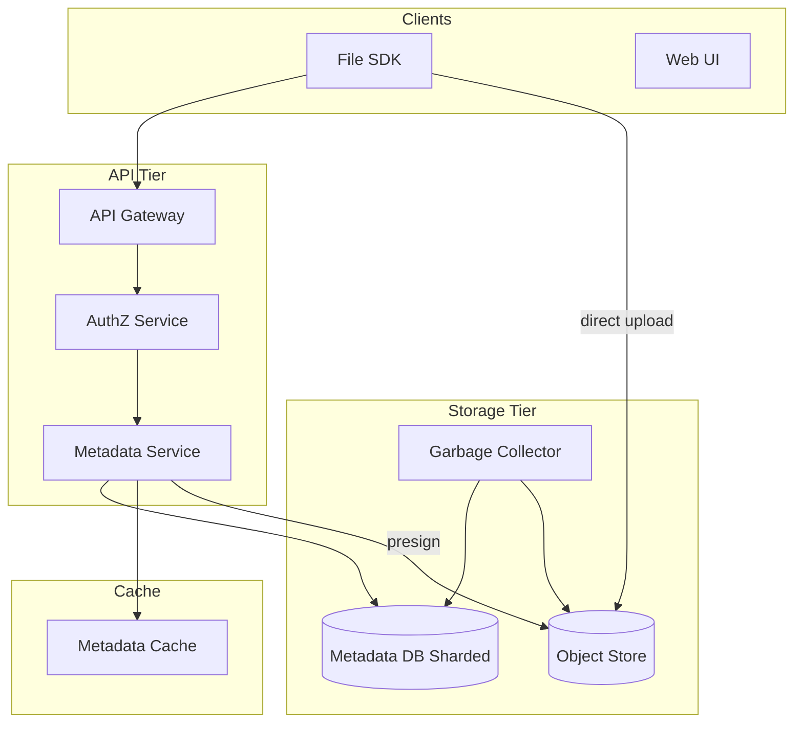
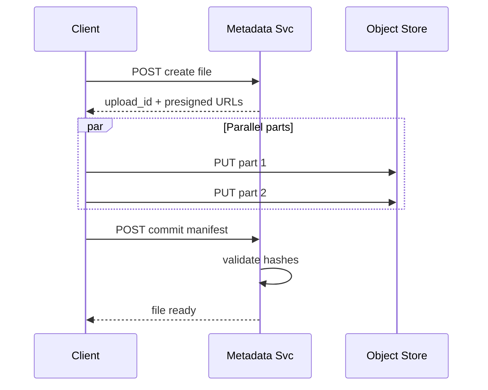
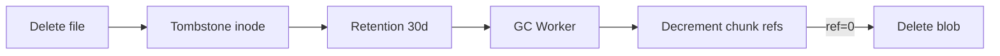

# File Storage System

## 1. Executive Summary

A **file storage system** provides durable, hierarchical namespace semantics (files and directories) backed by scalable blob storage, serving applications that need POSIX-like or API-driven file operations without managing raw disks. Principal-level design covers **metadata separation** from content, **chunking large files**, **consistency models** for directory operations, **multi-tenancy**, **quota enforcement**, and **garbage collection** of orphaned blobs.

This chapter designs a cloud file API serving billions of files and exabytes of content with 99.999999999% (11 nines) durability for blobs and 99.99% availability for metadata operations. Metadata in a distributed SQL or key-value store, content in object storage with erasure coding, and explicit behavior during partial upload failure are core interview topics.

## 2. Why This Topic Matters

File storage underlies backup products, content management, ML datasets, and internal developer platforms. Architects must explain:

- **Metadata vs. blob** separation and why mixing them fails at scale.
- **Listing performance** at millions of files per directory.
- **Consistency** for rename vs. read during concurrent writers.
- **Multipart upload** lifecycle and orphan cleanup.
- **Access control** at path granularity.

Poor design causes metadata hotspots, unbounded storage costs from abandoned uploads, and data loss during misconfigured replication. Review [Storage Engine Fundamentals](/docs/storage-engines/storage-engine-fundamentals) and [Global File Transfer Platform](/docs/system-design/global-file-transfer-platform) for related patterns.

## 3. Problems Being Solved

| Problem | Solution |
|---------|----------|
| **Durable blob storage** | Object store + replication/erasure coding |
| **Hierarchical namespace** | Metadata tree with parent pointers or materialized paths |
| **Large files** | Chunking; multipart upload |
| **Concurrent writers** | Versioning; optimistic locking |
| **Quota / billing** | Per-tenant counters; async reconciliation |
| **Fast metadata ops** | Sharded metadata DB; avoid listing huge dirs |
| **Access control** | ACL on inode; IAM integration |
| **Deletion safety** | Soft delete; tombstone GC |

## 4. Assumptions and System Model

**Functional:**

- Create/read/update/delete files and directories.
- List directory contents with pagination.
- Multipart upload for files &gt; 5 MB.
- Optional versioning and snapshots.
- Presigned URLs for direct client↔blob transfer.

**Non-functional:**

- Metadata ops p99 &lt; 100 ms.
- Throughput: 100K metadata ops/sec; 1 TB/sec aggregate blob bandwidth.
- Durability 11 nines for committed blobs.
- Max file size 5 TB; max path length 1024 chars.

| Assumption | Implication |
|------------|-------------|
| **Small metadata, large blobs** | Never store file bytes in metadata DB |
| **Read-heavy** | Cache metadata; CDN for public blobs |
| **Directories can be huge** | Pagination mandatory; no full list in memory |
| **Eventual blob GC** | Tombstones + sweeper job |
| **Multi-tenant** | Shard by tenant_id |

## 5. Essential Terminology

| Term | Definition |
|------|------------|
| **Inode** | Metadata record for file or directory |
| **Blob / object** | Content bytes in object store |
| **Chunk** | Fixed-size piece of large file |
| **Multipart upload** | Upload parts in parallel; commit manifest |
| **Manifest** | Ordered list of chunk IDs and hashes |
| **Tombstone** | Deleted marker pending GC |
| **Erasure coding** | Parity shards for storage efficiency |
| **Presigned URL** | Time-limited direct storage access |
| **Materialized path** | Full path string as key |
| **Copy-on-write** | Snapshot without duplicating data |
| **Quota hard limit** | Reject writes when exceeded |

## 6. Core Mechanism

### 6.1 High-Level Architecture



*Figure 1: Metadata service orchestrates namespace; blobs stored directly in object tier.*

### 6.2 APIs

```
POST /v1/files { path, size } → { file_id, upload_urls[] }
PUT /v1/files/{id}/parts/{n}  (or direct to presigned URL)
POST /v1/files/{id}/commit { parts: [{n, etag, hash}] }
GET /v1/files/{id}/download → redirect or presigned URL
GET /v1/dirs/{path}?cursor=... → paginated listing
DELETE /v1/files/{id}
POST /v1/dirs { path }
```

### 6.3 Data Model

**Inode table (sharded by tenant_id):**

```
inode_id, tenant_id, parent_id, name, type(file|dir),
size, version, created_at, modified_at, blob_manifest_id,
acl_id, deleted_at
```

**Blob manifest:**

```
manifest_id → [{ chunk_id, offset, size, sha256 }]
```

**Multipart session:**

```
upload_id, inode_id, parts_completed[], expires_at
```

Unique constraint: `(parent_id, name, tenant_id)` where `deleted_at IS NULL`.

### 6.4 Deep Dives

**Upload flow:**

1. Client requests create file; metadata service allocates inode + upload_id.
2. Returns presigned URLs per chunk (e.g., 64 MB parts).
3. Client uploads parts in parallel directly to object store.
4. Client commits with part ETags/hashes.
5. Metadata service validates completeness, writes manifest, marks file committed.
6. Quota counter incremented asynchronously.



*Figure 2: Multipart upload with direct client-to-object transfer.*

**Directory listing at scale:**

- Never `SELECT *` without limit; cursor-based pagination (inode_id &gt; cursor).
- For &gt;10K children: warn in API; consider subfolder policy.
- Cache directory listing first page in Redis with short TTL.

**Garbage collection:**

- Delete sets `deleted_at`; blobs referenced until manifest unlinked.
- Sweeper scans tombstoned inodes after retention window.
- Reference-count chunks; delete from object store when count=0.
- Orphan multipart uploads expire after 7 days.



*Figure 3: Tombstone → retention → reference-counted blob purge.*

## 7. Step-by-Step Walkthrough

### 7.1 Small file upload

1. Client POST 2 MB file via single PUT presigned URL.
2. Commit with one part hash.
3. Metadata updated; download available in 50 ms.

### 7.2 Concurrent rename

1. User A renames `/docs/report.pdf` → `/archive/report.pdf`.
2. User B lists `/docs/` during rename.
3. Serializable transaction or per-parent lock ensures B sees consistent state.
4. B either sees old name or not—never duplicate.

### 7.3 Abandoned multipart

1. Client uploads 3 of 10 parts; crashes.
2. Upload session expires after 7 days.
3. GC deletes orphan parts; no inode committed.

### 7.5 Cross-region read after metadata failover

1. Primary metadata region `us-east-1` fails over to `us-west-2` read replica promoted in 60s.
2. In-flight multipart commits in ambiguous state—clients retry commit with same upload_id (idempotent).
3. Presigned URLs issued before failover remain valid (object store regional).
4. RPO for metadata: seconds of writes if sync replication; minutes if async—document in SLA.

### 7.6 Enterprise dedicated shard migration

1. Tenant `acme` exceeds 50K ops/sec on shared shard—noisy neighbor.
2. Migrate inode range to dedicated shard online: dual-write period, cutover read path, verify checksum sample.
3. Zero downtime if dual-read during migration—same pattern as cache rebalance in [Distributed Cache Design](/docs/system-design/distributed-cache-design).

## 7B. Extended Performance Modeling

```
Metadata write path:
  AuthZ:           3 ms
  DB insert inode: 8 ms
  Cache invalidate: 2 ms
  Total p50:       ~15 ms

Blob upload path (bypasses API for bytes):
  Presign:         10 ms
  64 MB part PUT:  500 ms–2s (network bound)
  Commit:          20 ms

GC throughput target:
  1B tombstones × 1% scan/day = 10M inodes/day
  ~115 inodes/sec per GC worker × 100 workers = 11.5K/sec → ~24 days full scan
  Tune scan rate vs storage reclamation urgency
```

Principal architects set **GC SLO** same as user-facing APIs—unbounded orphans are deferred outages.


| Phase | Key decisions |
|-------|---------------|
| Requirements | hierarchical NS, multipart, 11-nine durability |
| Scale | metadata sharded; blob in object store |
| APIs | presigned direct upload |
| Data | inode + manifest separation |
| Reliability | commit validation; GC |
| Security | path ACL; tenant isolation |

## 8. Invariants and Guarantees

| Property | Guarantee |
|----------|-----------|
| **Committed file** | All chunks present with valid hashes |
| **Namespace uniqueness** | One active name per parent per tenant |
| **Durability** | Committed blobs replicated per policy |
| **List consistency** | Paginated snapshot per request |
| **Delete** | File invisible after delete API returns |

## 9. Failure Scenarios

| Scenario | Mitigation |
|----------|------------|
| **Partial commit** | Transaction; no inode until all parts verified |
| **Metadata DB partition** | Fail writes; reads from replica if consistent |
| **Object store outage** | Queue commits; retry |
| **Hot directory** | Shard listings; rate limit |
| **GC bug deleting live blob** | Reference counting; dry-run mode |
| **Split-brain metadata** | Leader election; fencing tokens |

## 10. Performance Characteristics

```
1B files metadata ≈ 500 bytes/inode → 500 GB metadata (sharded)
100K metadata ops/sec → 50+ DB shards with connection pooling
Blob bandwidth 1 TB/sec → parallel object store partitions
Listing p99: 20–80 ms with index on (parent_id, name)
```

## 11. Scalability Limits

| Limit | Mitigation |
|-------|------------|
| Single directory millions of files | Pagination; subfolder policy |
| Metadata hotspot tenant | Dedicated shard |
| Manifest size huge file | Chunk size tuning |
| GC backlog | Parallel sweeper workers |

## 12. Operational Considerations

- Metrics: metadata QPS, upload success rate, GC lag, quota violations.
- Alerts: orphan part growth; commit failure spike.
- Runbooks: restore from backup; emergency read-only mode.
- Chaos test: object store regional failure.

## 13. Security Considerations

- AuthZ on every metadata and presigned URL generation.
- Presigned URLs short TTL; bound to content-hash where possible.
- Tenant isolation in shard keys and ACL checks.
- Encryption at rest (SSE-KMS) and in transit (TLS).
- Audit log for admin access and cross-tenant operations.

## 14. Cost Considerations

Object storage cheap; metadata DB and API tier dominate ops cost. Lifecycle policies move cold blobs to archive tier. Erasure coding vs replication: EC saves ~50% storage at CPU cost. Chargeback per tenant using metered storage + API calls.

## 15. Production Implementations

| System | Notes |
|--------|-------|
| **Amazon S3** | Object store; not hierarchical—apps add metadata |
| **Google Cloud Storage** | Similar; uniform bucket-level access |
| **Azure Blob Storage** | Hierarchical namespace option on ADLS Gen2 |
| **CephFS** | Unified metadata + object via Ceph |
| **HDFS** | NameNode metadata + DataNode blocks |

## 16. Alternatives and Tradeoffs

| Approach | Pros | Cons |
|----------|------|------|
| Metadata DB + object store | Industry standard | Two systems to operate |
| POSIX on block storage | Familiar | Hard to scale horizontally |
| Flat object keys only | Simple | No real directories |
| Copy-on-write FS | Snapshots native | Complex implementation |
| Strong listing consistency | Predictable | Higher metadata latency |

## 17. Common Misconceptions

| Misconception | Reality |
|---------------|---------|
| "Store files in PostgreSQL BYTEA" | Does not scale past GB |
| "S3 has folders" | Prefix simulation only |
| "Delete is immediate free space" | GC async |
| "Unlimited directory size" | Listing degrades |
| "Presigned URL skips auth" | Auth at issuance time |

## 18. Principal Architect Perspective

- **Metadata is the bottleneck**—design shards and pagination first.
- **Multipart commit is a transaction**—half-committed files corrupt trust.
- **GC is production code**—not a background afterthought.
- **Quota enforcement** needs async reconciliation for accuracy.
- **11 nines** requires cross-region replication policy explicit in design.

## 19. Architecture Review Exercise

**Scenario:** File bytes stored in MySQL BLOB column; 500 GB database; backups failing.

**Review:** Migrate to object store + inode metadata; presigned uploads; chunked transfer.

## 20. Whiteboard Explanation

"Metadata service owns the namespace in a sharded SQL store—inode per file with parent pointer and manifest reference. File bytes never touch the DB; clients upload chunks via presigned URLs to object storage, then commit a manifest. Deletes tombstone inodes; GC workers decrement chunk reference counts and purge unreferenced blobs. Directory listings are always paginated. ACLs checked on every operation. Multipart sessions expire to prevent orphan storage leaks."

## 21. Interview Questions

1. **Design file storage for 1B files.** — *Signals:* metadata/blob split, sharding. *Red flags:* DB blobs.
2. **Upload 10 GB file?** — *Signals:* multipart, presigned, parallel. *Follow-up:* commit atomicity.
3. **Directory with 1M files?** — *Signals:* pagination, never full list.
4. **Delete file—when is space freed?** — *Signals:* tombstone, GC, ref counting.
5. **Consistency for rename?** — *Signals:* transaction or lock per parent.
6. **Durability 11 nines?** — *Signals:* cross-AZ/region replication, erasure coding.
7. **Quota enforcement?** — *Signals:* counter + reconcile; reject on commit.
8. **Presigned URL security?** — *Signals:* short TTL, scoped permissions.
9. **Versioning design?** — *Signals:* new manifest; copy-on-write chunks.
10. **Hot tenant shard?** — *Signals:* dedicated shard; rate limits.
11. **Orphan multipart cleanup?** — *Signals:* expiry sweeper.
12. **List vs search?** — *Signals:* listing is prefix of path; search needs index.
13. **Snapshot without copying data?** — *Signals:* COW manifests.
14. **Metadata cache invalidation?** — *Signals:* delete on write; short TTL.

## 21B. Extended Interview Question Deep Dives

**Q15 (Principal):** A tenant reports files "disappearing" after delete API returns 404 but storage bill unchanged for 60 days.

*Strong signals:* Explains tombstone + async GC; ref count decrement; retention before physical purge; billing uses logical meter vs physical free. *Follow-up:* How prove blob purged?—GC audit log + object store lifecycle metrics. *Red flags:* "Delete is immediate." *Rubric:* 5/5 if mentions billing lag vs GC lag distinction and compliance hold blocking purge.

**Q16 (Principal):** Design versioning for compliance—retain all overwrites 7 years.

*Strong signals:* New manifest per version; immutable blocks; lifecycle to glacier; list versions API; delete creates delete marker not purge. *Tradeoff:* Storage cost 10×—legal holds override lifecycle. Link [Global Object Store](/docs/system-design/global-object-store) versioning semantics.

## 22. Interview Follow-Ups

1. **POSIX compatibility layer on object store.** — FUSE gateway; metadata latency.
2. **Cross-region replication.** — Async metadata; conflict on concurrent writes.
3. **Encryption per-tenant keys.** — KMS integration; key rotation.

## 23. Strong Answer Example

**Q:** How do you upload a 50 GB file reliably?

**Outline:** Client calls create API; receives upload_id and presigned URLs for 64 MB parts. Uploads parts in parallel with retry per part. On completion, commit sends ordered part list with hashes. Metadata service verifies all parts exist and hashes match before marking file committed. Failed commits leave no visible file; GC cleans orphan parts after TTL.

## 24. Weak Answer Example

**Weak:** "Use a single NFS server."

**Red flags:** No scale, no cloud durability model, no multipart, no multi-tenant isolation.

## 25. Hands-On Exercise

1. Implement inode + manifest schema with multipart commit.
2. Simulate orphan part GC after expired upload.
3. Paginated directory listing benchmark at 1M entries.
4. Reference-counted chunk deletion on file remove.
5. **Extension:** Presigned URL generator with TTL and ACL scope.

## 26. Knowledge Check

1. Why separate metadata and blobs?
2. Three steps of multipart commit?
3. When is a blob safe to delete?
4. How prevent hot directory listing?

## 27. Flashcards

| Front | Back |
|-------|------|
| Inode | File metadata record without bytes |
| Manifest | Ordered chunk list for a file |
| Tombstone | Soft-deleted inode pending GC |
| Presigned URL | Direct timed access to object store |
| Ref counting | Track chunk usage before purge |
| Multipart | Parallel chunked upload protocol |
| Materialized path | Full path as lookup key |
| Erasure coding | Parity-based durable storage |
| Quota reconcile | Async fix counter drift |
| Pagination cursor | Stable large directory listing |

## 28. Cheat Sheet

```
REQUIREMENTS: hierarchical files, multipart, 11-nine blobs
SCALE: sharded metadata; object store for bytes
APIs: create/commit/download/list/delete
DATA: inode table + manifest + upload sessions
ARCH: API → metadata DB; client → object direct
DEEP: commit txn; GC ref count; paginated list
RELIABILITY: hash verify; replica; orphan sweeper
SECURITY: ACL; presigned TTL; tenant shard
OPS: GC lag; quota alerts; backup metadata
```

## 17A. Failure Scenario Drill

Deploy enables public list on bucket metadata API without pagination—attacker enumerates 10M paths; metadata DB CPU saturates; legitimate uploads fail. Mitigation: mandatory pagination max 1000; rate limit per API key; WAF on abnormal list QPS. Principal owns **API abuse** review same as storage durability review.

## 18.1 When Principal Escalates File Storage Design

Escalate when: (1) file bytes stored in relational DB; (2) no multipart commit atomicity; (3) GC not implemented—storage cost grows unbounded; (4) cross-tenant path collision possible without tenant prefix in shard key. These precede data loss or compliance incidents.

## 19A. Extended Review Scenario

**Scenario B:** Versioning disabled; user overwrites payroll.csv; no recovery.

**Review:** Enable object versioning or file rev history; soft delete with 30d retention; audit who issued overwrite API.

## 21A. Additional Interview Questions

15. **Cross-region read after write?** — *Signals:* primary region metadata; async replica lag disclosed. *Red flags:* claim instant global consistency.
16. **Compare to Dropbox block model.** — *Signals:* this chapter is namespace + blob; Dropbox adds sync—see [Dropbox Design](/docs/system-design/dropbox-design).

## 22A. Extended Follow-Ups

4. **Legal hold on delete.** — Tombstone blocks GC until hold released; compliance audit trail.
5. **Antivirus scan pipeline.** — Async scan before marking file `READY`; quarantine infected uploads.

## 23A. Additional Strong Answer

**Q:** How enforce per-tenant 10 TB quota accurately?

**Outline:** Fast path: atomic counter increment on commit (approximate). Slow path: nightly reconciliation scan summing manifest sizes vs counter; alert drift &gt; 1%. Hard reject on commit if counter ≥ limit even if reconciliation lags—may temporarily over-block by small margin vs under-block which is worse for billing.

## 28A. Principal Interview Deep Dive

### Multipart part size selection

| Part size | Tradeoff |
|-----------|----------|
| 5 MB | More parts for large files; more commit metadata |
| 64 MB | Fewer API calls; memory buffer on client |
| 256 MB | High memory; fewer parts; good on datacenter links |

Default 64 MB for files &gt; 100 MB; single PUT for smaller.

### Metadata shard key design

Shard by `hash(tenant_id)` not `hash(path)`—keeps tenant data colocated for quota and ACL cache locality. Cross-tenant hot path isolation: noisy neighbor tenant on dedicated shard if enterprise contract.

### Read path latency breakdown

| Step | p99 |
|------|-----|
| AuthZ + metadata lookup | 10–30 ms |
| Presigned URL generation | 5 ms |
| Client direct GET from object store | 50–200 ms by size |

Optimize metadata; never proxy bytes through API tier at scale.

## 28B. Extended BOE Walkthrough

**Interviewer:** "1 billion files, 100K metadata ops per second."

**Strong candidate:**

"1B inodes × 500 bytes ≈ 500 GB metadata—sharded SQL or distributed KV, say 50 shards × 2K ops/sec each with headroom.

Blobs in object store—never in DB. Upload: presigned multipart; commit transactional on inode + manifest. Delete: tombstone + async GC with ref counting.

List directory: cursor pagination only—never load 1M children. Quota per tenant with reconcile job.

Durability: object store 11 nines; metadata 3× replicated. Link [Global Object Store](/docs/system-design/global-object-store) for blob tier details."

## 29. Related Concepts

- [System Design Methodology](/docs/system-design/system-design-methodology)
- [Global File Transfer Platform](/docs/system-design/global-file-transfer-platform)
- [Storage Engine Fundamentals](/docs/storage-engines/storage-engine-fundamentals)
- [Global Object Store](/docs/system-design/global-object-store)
- [Dropbox Design](/docs/system-design/dropbox-design)
- [Write-Ahead Log](/docs/storage-engines/write-ahead-log)

## 30. References

- Ghemawat, Gobioff, Leung — Google File System paper.
- Amazon S3 documentation — multipart upload specification.
- Kleppmann, *DDIA* — storage and replication chapters.

**Distinction:** GFS paper describes Google's implementation; S3 API is de facto cloud standard.

### 30A. Further Reading Paths

Apply blob patterns in [Global Object Store](/docs/system-design/global-object-store). Contrast namespace sync needs with [Dropbox Design](/docs/system-design/dropbox-design). Lab: implement multipart commit with hash verification and measure orphan part storage without GC.

### 30B. Capacity Planning Worked Example

```
Tenant count:           10,000
Avg files per tenant:   100,000
Total inodes:           1B
Inode row size:         512 bytes
Metadata storage:       ~512 GB (+ indexes ~40% → 720 GB)
Object storage:         1B × 2 MB avg = 2 EB (dominant cost)

Metadata ops: 100K/sec → 50 shards × 2K ops with replicas
API tier: stateless autoscaled on CPU
GC workers: 1% of blob storage scanned daily for orphan detection
```

### 30D. Principal Architecture Review Checklist

Before production launch of file storage API, verify:

- [ ] Multipart commit is atomic—no visible inode until all part hashes verified
- [ ] Presigned URL TTL ≤ 15 minutes for upload; scoped to upload_id
- [ ] Directory list API enforces max page size 1000 with mandatory cursor
- [ ] GC sweeper running with lag alert &lt; 24h
- [ ] Quota hard limit tested at commit boundary—not only soft warnings
- [ ] Cross-tenant inode isolation via shard key includes tenant_id
- [ ] Load test: cache bypass on metadata (no CDN for inode ops) at 2× peak QPS
- [ ] DR drill: metadata restore RTO documented; blob store CRR RPO aligned with business

Missing any item is a release blocker for principal sign-off—not post-launch backlog.
