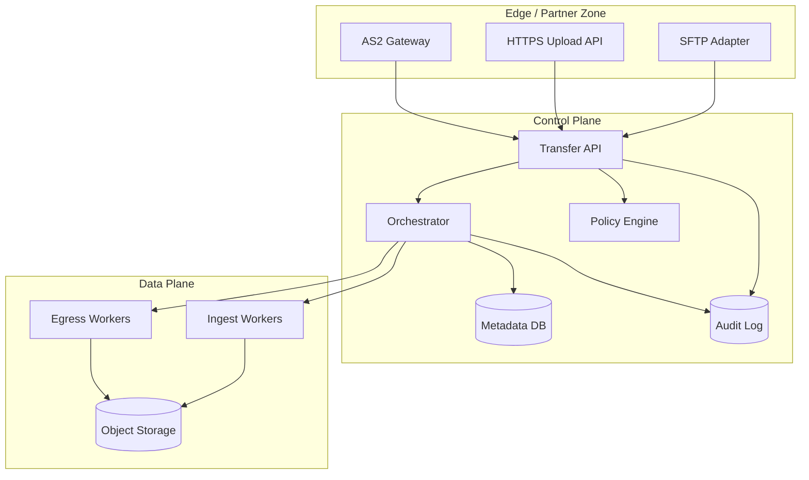
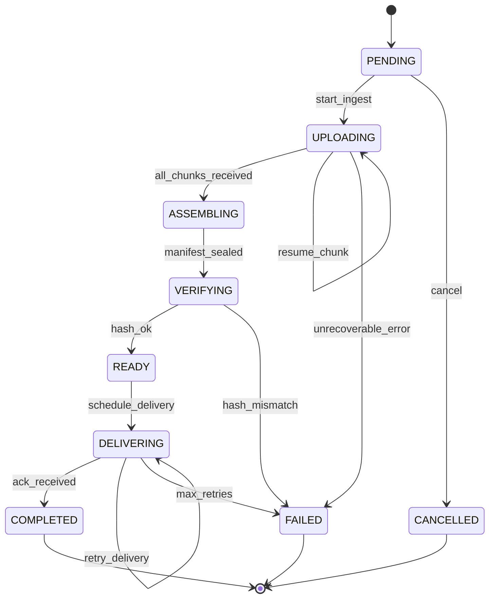
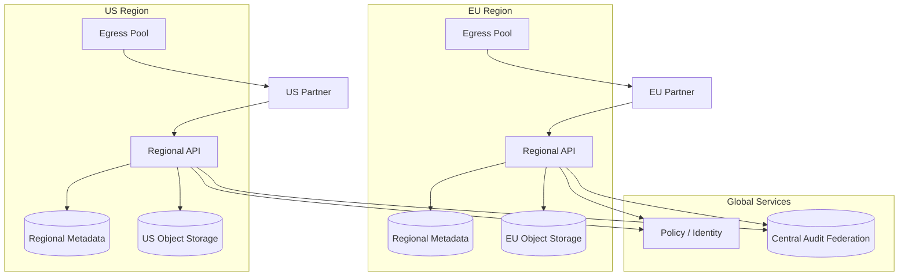

# Global File Transfer Platform

## 1. Executive Summary

A **global file transfer platform** is an enterprise-grade system that moves large files reliably between organizations, business units, and cloud regions while satisfying security, compliance, and operational requirements that consumer file-sharing tools do not address. Typical workloads include batch data exchange with partners (B2B), internal ETL file drops, backup and disaster-recovery replication, media distribution, and regulated payloads (healthcare, financial, government) that demand encryption, audit trails, and non-repudiation.

At principal-architect level, the design problem is not "upload to object storage"—it is orchestrating **multi-gigabyte transfers over unreliable networks**, enforcing **authorization and data residency**, providing **end-to-end integrity verification**, supporting **protocol heterogeneity** (HTTPS, SFTP, AS2, S3-compatible APIs), and operating at **planetary scale** with predictable cost and recoverability. This chapter presents a **generic reference architecture** without vendor-specific or confidential implementation details, suitable for interviews and architecture reviews.

Core components include edge ingress agents, a transfer orchestration control plane, durable metadata service, chunked object storage with erasure coding or replication, workflow engine for retries and scheduling, certificate and key management, and comprehensive audit logging. Safety properties include at-least-once delivery with idempotent completion, integrity via checksums, and authorization enforced at every hop.

## 2. Why This Topic Matters

File transfer remains a backbone of enterprise integration despite APIs and streaming. Principal candidates encounter this pattern when:

- Designing **data platforms** that ingest partner files nightly.
- Building **multi-region DR** with large blob replication.
- Evaluating **managed file transfer (MFT)** vs. custom platforms.
- Answering interviews that test **resumable uploads**, **bandwidth fairness**, and **compliance**.

Production failures in this domain cause missed SLAs with external partners, regulatory exposure, and multi-day recovery efforts. Architects must reason about **partial uploads**, **clock skew in scheduling**, **cross-border data flows**, and **operator visibility** into stuck transfers.

## 3. Problems Being Solved

| Problem | Platform capability |
|---------|---------------------|
| **Large file reliability** | Chunking, resumable transfers, checkpointing |
| **Partner protocol diversity** | Protocol adapters behind unified API |
| **Integrity** | Per-chunk and composite hashes; manifest |
| **Security** | TLS/mTLS, encryption at rest, HSM-backed keys |
| **Compliance** | Audit log, retention, data residency routing |
| **Scheduling** | Cron, event triggers, SLA windows |
| **Throughput at distance** | Parallel streams, edge caching, WAN optimization |
| **Operational visibility** | Transfer state machine, alerting, replay |
| **Cost control** | Storage tiering, lifecycle policies, egress budgeting |
| **Failure recovery** | Idempotent jobs, dead-letter queues, manual replay |

## 4. Assumptions and System Model

| Assumption | Implication |
|------------|-------------|
| **Files are large** (MB–TB) | Chunked upload; avoid holding full file in app memory |
| **Networks are lossy** | Retries with exponential backoff; resume tokens |
| **Partners are heterogeneous** | Adapter layer; don't force single protocol |
| **Compliance varies by tenant** | Policy engine routes storage region and encryption |
| **At-least-once delivery** | Idempotent completion handlers |
| **Partial failure is common** | Explicit transfer state machine |
| **Operators need forensics** | Immutable audit trail |

**Failure model:** Crash-stop nodes, network partitions, storage unavailability, certificate expiry—not Byzantine partners unless explicitly in scope.

## 5. Essential Terminology

| Term | Definition |
|------|------------|
| **MFT** | Managed File Transfer—enterprise orchestration of file movement |
| **Ingress** | Entry point where files enter the platform |
| **Egress** | Delivery to destination (partner endpoint, bucket, filesystem) |
| **Transfer job** | Unit of work moving one logical file or batch |
| **Chunk / part** | Subdivision of file for parallel or resumable upload |
| **Manifest** | Metadata listing chunks, hashes, ordering |
| **Checkpoint** | Persisted progress enabling resume after failure |
| **AS2** | Applicability Statement 2—HTTP-based B2B with signing/encryption |
| **SFTP** | SSH File Transfer Protocol |
| **Presigned URL** | Time-limited direct upload/download to object storage |
| **Data residency** | Geographic constraint on data storage and processing |
| **RPO/RTO** | Recovery point/time objectives for metadata and blobs |
| **DLQ** | Dead-letter queue for failed jobs after max retries |
| **mTLS** | Mutual TLS—client and server certificate authentication |

## 6. Core Mechanism

### 6.1 Reference architecture



*Figure 1: Global file transfer platform—protocol adapters, control plane orchestration, and object storage data plane.*

### 6.2 Transfer state machine

States: `PENDING` → `UPLOADING` → `ASSEMBLING` → `VERIFYING` → `READY` → `DELIVERING` → `COMPLETED` | `FAILED` | `CANCELLED`.

Transitions are persisted; workers are stateless and claim jobs via lease. **Safety:** a file is marked `COMPLETED` only after composite hash verification and successful delivery acknowledgment (or policy-defined "landed in vault" without forward delivery).



*Figure 2: Transfer job state machine—explicit states enable resume, audit, and operator intervention.*

### 6.3 Chunked ingest with resumability

1. Client calls `InitiateTransfer` → receives `transfer_id`, chunk size, presigned URLs or upload session token.
2. Client uploads chunks in parallel with per-chunk SHA-256.
3. Client calls `CompleteChunk(transfer_id, index, hash)`; server verifies and records in manifest.
4. On disconnect, client calls `ListCompletedChunks` and resumes.
5. On `SealTransfer`, workers assemble multipart object in storage (server-side compose) without streaming through orchestrator.
6. Composite hash compared to client-supplied digest or partner contract.

**Liveness:** stalled uploads detected by heartbeat timeout; leases expire for worker reassignment.

### 6.4 Delivery paths

| Destination type | Mechanism |
|------------------|-----------|
| **Object storage (S3-compatible)** | Server-side copy or cross-region replication |
| **Partner SFTP** | Egress worker with connection pooling, host key pinning |
| **Internal filesystem** | Mounted volume or NFS with virus scan hook |
| **Event notification** | Message to downstream pipeline on `READY` |

Policy engine selects region, encryption key, and allowed protocols per tenant and data classification.

## 7. Step-by-Step Walkthrough

### 7.1 Partner uploads 50 GB file via HTTPS

1. Partner authenticates with API key + mTLS (tenant `T1`, classification `PII`, residency `EU`).
2. Policy routes storage to `eu-west` bucket with CMK `T1-EU`.
3. Orchestrator creates job `J-9001`, state `PENDING`.
4. API returns 64 MB chunk size; 800 presigned URLs generated in batches.
5. Partner uploads 800 chunks over 4 parallel TCP connections; checkpoint every 50 chunks.
6. Network blip at chunk 412; partner resumes from 412 without re-uploading 0–411.
7. `SealTransfer` triggers server-side multipart complete; manifest hash verified.
8. State → `READY`; scheduled delivery to internal analytics bucket at 02:00 UTC window.
9. Egress worker copies with storage replication; downstream event `file.landed` published.
10. Audit log records actors, hashes, regions, timestamps—immutable store.

### 7.2 Failure: hash mismatch at verify

1. Composite hash ≠ expected EDI control number hash.
2. State → `FAILED`; alert to operations; file quarantined.
3. Partner notified with correlation ID; replay requires new transfer or chunk re-upload per policy.
4. No downstream processing—**safety** over liveness.

## 8. Invariants and Guarantees

| Property | Guarantee | Mechanism |
|----------|-----------|-----------|
| **Integrity** | Detected corruption | Per-chunk + composite hashing |
| **Authorization** | Only entitled actors | Policy + IAM + mTLS |
| **Auditability** | Append-only event trail | WORM or immutable log store |
| **Idempotent completion** | Duplicate complete safe | Unique constraint on transfer_id + state CAS |
| **Residency** | Data not stored outside region | Policy-enforced bucket routing |
| **Delivery** | At-least-once typical | Retries; partners must dedupe via file ID |

**Not guaranteed by default:** exactly-once end-to-end delivery to partner systems without partner cooperation; sub-second latency for TB files.

## 9. Failure Scenarios

| Scenario | Impact | Mitigation |
|----------|--------|------------|
| **Orchestrator crash mid-job** | Stalled state | Lease expiry; worker reclaim |
| **Partial chunk upload** | Incomplete manifest | ListCompletedChunks; garbage-collect orphans |
| **Storage AZ outage** | Ingest blocked | Multi-AZ bucket; failover region read-only mode |
| **Certificate expiry** | Partner cannot connect | Automated cert rotation; 30-day alerts |
| **Hot tenant saturates bandwidth** | Starvation | Per-tenant QoS; weighted fair queuing |
| **Malicious huge file bomb** | Cost/DoS | Pre-auth quotas; max file size; scan hooks |
| **Clock skew in scheduling** | Early/late delivery | UTC clocks; NTP monitoring |
| **Cross-region egress cost spike** | Budget breach | Transfer planning; same-region landing zones |
| **Duplicate delivery** | Downstream double process | Idempotent file IDs; partner ack dedup |
| **Metadata DB corruption** | Lost job state | Replicated DB; PITR; reconcile from object tags |

## 10. Performance Characteristics

| Dimension | Typical target (illustrative) | Drivers |
|-----------|------------------------------|---------|
| **Throughput** | Line-rate bounded by WAN | Parallelism, chunk size, TCP window |
| **Latency to first byte** | Seconds (API) | Auth, policy, presign generation |
| **Time to complete 100 GB** | Minutes–hours | 1 Gbps ≈ 13 min theoretical; overhead 2–4× |
| **Metadata ops** | Thousands of state updates/sec | Sharded job store |
| **Audit write** | Async batch | Don't block data path |

Tune chunk size: larger chunks reduce metadata overhead; smaller improve resume granularity and parallelism on lossy links.

## 11. Scalability Limits

| Limit | Cause | Mitigation |
|-------|-------|------------|
| **Metadata DB write rate** | One row per chunk complete | Batch updates; coarser checkpoints |
| **Presigned URL explosion** | Huge chunk counts | Session-based upload proxy for small chunks |
| **Orchestrator queue depth** | Traffic spikes | Horizontal workers; priority queues |
| **Object listing for GC** | Orphan chunk cleanup | Lifecycle rules; prefix sharding by date |
| **Cross-region replication lag** | WAN distance | Accept async DR; sync only for critical tier |
| **SFTP connection count** | Stateful protocol | Connection pools; dedicated egress pools per partner |

Horizontal scale applies to **stateless workers**; metadata and policy stores require sharding by `tenant_id` or `transfer_id` hash.

### 11.1 Multi-region deployment pattern

Most enterprises adopt **regional landing zones** rather than a single global control plane streaming all bytes. Metadata may be global or federated per region depending on latency and compliance tradeoffs.



*Figure 3: Regional landing zones with federated audit—data residency enforced at routing layer; cross-region replication only when policy permits.*

**Active-active** for the same file across regions is rare; **active-passive DR** with async replication is more common for cost and conflict reasons.

## 12. Operational Considerations

- **Dashboards:** transfers in flight, bytes/sec per region, failure rate by protocol, p95 time-to-complete.
- **Alerting:** SLO burn on stuck `UPLOADING` > N hours; DLQ depth; cert expiry.
- **Runbooks:** replay failed delivery; quarantine malicious file; drain region.
- **Capacity:** storage growth forecasting; egress budget alarms.
- **Upgrades:** blue/green adapters; backward-compatible API versions.
- **Support tooling:** operator search by transfer_id, partner ID, hash.

Principal architects define **SLOs** such as 99.9% of scheduled transfers complete within window W.

## 13. Security Considerations

- **Perimeter:** WAF on HTTPS; rate limits; geo-blocking where legal.
- **Identity:** Federation with enterprise IdP; per-partner credentials rotation.
- **Encryption:** TLS 1.2+ in transit; SSE-KMS or CSE at rest; optional client-side encryption for zero-knowledge tiers.
- **Secrets:** Vault/HSM; no long-lived keys in config repos.
- **Malware:** Optional ClamAV or commercial scan on `READY` before forward.
- **Least privilege:** Workers get scoped IAM to specific bucket prefixes.
- **Audit:** Tamper-evident logs for compliance (SOX, HIPAA, GDPR artifacts).

Threat model **STRIDE** on partner-facing adapters and presigned URL leakage (short TTL, single-use where possible).

Partner credential lifecycle deserves explicit design: rotate API keys on schedule, support overlapping validity windows, and audit every authentication failure with correlation to transfer jobs. For high-assurance partners, prefer **mTLS with short-lived certificates** issued from an internal PKI rather than long-lived shared secrets embedded in scripts.

## 14. Cost Considerations

| Cost driver | Control lever |
|-------------|---------------|
| **Storage GB-months** | Lifecycle to IA/Glacier; delete after retention |
| **Cross-region egress** | Land in-region; compress; schedule off-peak |
| **API operations** | Batch metadata; server-side compose |
| **Compute for workers** | Autoscale on queue depth; spot for batch egress |
| **Managed MFT license** | Build vs. buy when differentiation low |

**Unit economics:** $/GB transferred and $/1000 files—compare to partner SLA penalties.

## 15. Production Implementations

| Category | Examples (generic) |
|----------|-------------------|
| **Commercial MFT** | IBM Sterling, GoAnywhere, Axway—protocol breadth, governance |
| **Cloud native** | AWS Transfer Family, Azure Logic Apps + SFTP, GCP Storage transfer |
| **Open source building blocks** | MinIO, rclone, Apache NiFi, Airflow for orchestration |
| **CDN-style large delivery** | Origin pull from object storage with signed URLs |

**Implementation choice:** buy MFT when compliance certifications and protocol support dominate; build when deep integration with internal data platform and custom policy is strategic.

## 16. Alternatives and Tradeoffs

| Option | Pros | Cons |
|--------|------|------|
| **Direct S3 cross-account** | Simple, cheap | Weak workflow, audit, partner SFTP |
| **SFTP-only gateway** | Familiar to partners | Scaling connections; limited orchestration |
| **Message bus with attachments** | Unified events | Poor for multi-GB payloads |
| **Peer-to-peer (WeTransfer model)** | Low infra | Enterprise control weak |
| **Full custom platform** | Tailored policy | High build/ops cost |
| **Sync (rsync)** | Efficient delta | Not partner-friendly; firewall pain |

## 17. Common Misconceptions

| Misconception | Reality |
|---------------|---------|
| "S3 multipart is enough" | Missing orchestration, audit, partner protocols |
| "Checksum optional" | Silent corruption destroys trust |
| "One region is fine" | Residency and DR often mandate multi-region |
| "SFTP is secure by default" | Weak ciphers, credential sprawl without governance |
| "Exactly-once is free" | Requires idempotent partners or transactional outbox |
| "Bigger chunks always faster" | Resume cost and memory on mobile clients |

## 18. Principal Architect Perspective

- **Separate control plane from data plane**—orchestrator never streams file bytes.
- **Treat transfer_id as idempotency key** across initiate/complete.
- **Policy as code** for residency and retention—avoid hardcoded routing.
- **Design for operator intervention**—stuck jobs are inevitable at scale.
- **Negotiate SLAs with partners** on retry semantics and duplicate handling.
- **Measure end-to-end**, not just upload API latency.

## 19. Architecture Review Exercise

**Scenario:** Team proposes streaming all files through a single Kubernetes service that buffers to disk before uploading to object storage. Peak: 20 Gbps aggregate, files up to 500 GB.

**Review:**

1. Identify bottleneck (disk I/O, pod network, memory).
2. Propose presigned direct-to-storage upload with metadata-only control plane.
3. Define state machine and failure recovery.
4. Estimate cost difference (double network hop eliminated).
5. Security: can presigned URLs leak? TTL and scope?

## 20. Whiteboard Explanation

"Partners connect through protocol adapters into a transfer API. The orchestrator creates a durable job with a state machine—uploading, verifying, delivering. Files are chunked and uploaded directly to regional object storage using presigned URLs so we don't proxy bytes through the control plane. Each chunk is hashed; on completion we verify the composite hash before marking ready. Policy routes storage by tenant residency and encryption requirements. Egress workers deliver to partner endpoints or internal pipelines with retries and dead-letter queues. Audit logs capture who sent what, when, and where. The design prioritizes resumability, integrity, and compliance over raw simplicity."

## 21. Interview Questions

1. **Design global file transfer for 10K partners.** — Adapters, orchestration, storage, policy.
2. **How resume a 100 GB failed upload?** — Chunk manifest, ListCompleted, presigned resume.
3. **Ensure file integrity?** — Per-chunk hash, composite, optional PGP signing.
4. **Multi-region active-active?** — Metadata replication complexity; often active-passive per file.
5. **Handle SFTP at scale?** — Connection pools, dedicated pools, horizontal egress.
6. **Data residency enforcement?** — Policy engine, bucket routing, no cross-region copy.
7. **Idempotent transfer completion?** — CAS on state; unique transfer_id.
8. **Cost optimize cross-region?** — Land in-region, lifecycle, compress, schedule.
9. **Audit for compliance?** — Immutable log, correlation IDs, retention.
10. **Detect stuck transfers?** — Heartbeat, lease timeout, alerting.
11. **AS2 vs. SFTP tradeoffs?** — HTTP firewalls, non-repudiation vs. simplicity.
12. **Build vs. buy MFT?** — Compliance, differentiation, TCO, time-to-market.

## 22. Interview Follow-Ups

1. **Partner claims they didn't receive file but you show COMPLETED.** — Ack semantics, MDN (AS2), audit trail.
2. **Encrypt end-to-end with keys partner holds.** — Client-side encryption; you never see plaintext.
3. **10× file volume next year.** — Shard metadata, autoscale workers, storage lifecycle.
4. **Ransomware on partner upload.** — Scan hooks, immutable backups, isolation bucket.
5. **Exactly-once to data warehouse.** — Landing zone + dedup on file_id in loader.

## 23. Strong Answer Example

**Question:** "How would you design resumable uploads for very large files?"

**Strong outline:** "I'd use a transfer job with persisted state. Client calls initiate to get transfer_id, chunk size, and either presigned URLs or an upload session. Chunks are fixed size except the last; each upload includes a content hash. The server records completed chunk indices in a manifest table with idempotent CompleteChunk operations keyed by transfer_id and index. On network failure, the client queries completed chunks and resumes. When all chunks are present, Seal triggers server-side multipart compose in object storage so bytes never flow through the app tier. Only after composite hash matches do we transition to READY. Chunk size trades metadata overhead against resume granularity—I'd start around 32–128 MB for datacenter links. TTL garbage-collects abandoned multipart uploads."

## 24. Weak Answer Example

**Weak:** "Use S3 and a load balancer. Scale horizontally."

**Red flags:** No state machine, no resume, no integrity, no partner protocols, no compliance.

## 25. Hands-On Exercise

1. Implement a minimal transfer API: Initiate, UploadChunk (simulate), Complete, Status.
2. Add SQLite manifest with state machine transitions.
3. Simulate failure at random chunk; verify resume works.
4. Add per-chunk SHA-256 verification.
5. Document BOE: 1 TB/day ingress, metadata rows per chunk, storage cost.
6. Write threat model for presigned URL leakage.

## 26. Knowledge Check

1. Why separate control and data planes for file transfer?
2. Name five transfer states in the reference state machine.
3. What is a manifest in chunked upload?
4. How enforce data residency?
5. At-least-once vs. exactly-once delivery—typical choice?
6. What triggers transition from VERIFYING to FAILED?
7. Name two partner protocols and one tradeoff.
8. How detect orphaned chunks?
9. What belongs in an immutable audit log entry?
10. Why presigned URLs vs. proxy upload?
11. What is weighted fair queuing used for?
12. RPO for metadata vs. blobs—often different?

## 27. Flashcards

| Front | Back |
|-------|------|
| MFT | Managed File Transfer—enterprise orchestrated file movement |
| Chunked upload | Split file for parallelism and resume |
| Presigned URL | Time-limited direct access to object storage |
| Transfer state machine | PENDING → UPLOADING → … → COMPLETED/FAILED |
| Composite hash | Verify entire file from chunk hashes |
| Data residency | Store/process only in approved geography |
| At-least-once delivery | Retries may duplicate; idempotency required |
| AS2 | HTTP B2B protocol with signing/encryption |
| DLQ | Holds jobs failed after max retries |
| Server-side compose | Assemble multipart object without app proxying bytes |
| mTLS | Mutual certificate authentication |
| Quarantine bucket | Isolation for failed verification or malware |

## 28. Cheat Sheet

```
ARCHITECTURE
  Adapters (SFTP/HTTPS/AS2) → API → Orchestrator
  Metadata DB + Audit (control plane)
  Ingest/Egress workers → Object Storage (data plane)

STATE MACHINE
  PENDING → UPLOADING → ASSEMBLING → VERIFYING → READY → DELIVERING → COMPLETED

RESUME
  Initiate → upload chunks with hash → CompleteChunk (idempotent)
  → ListCompleted on failure → resume → Seal → verify composite

SECURITY
  mTLS, presigned TTL, SSE-KMS, policy routing, immutable audit

SCALE
  shard metadata by tenant_id; autoscale workers; per-tenant QoS
```

## 29. Related Concepts

- [System Design Methodology](/docs/system-design/system-design-methodology) — design process
- [Idempotency](/docs/distributed-systems-foundations/idempotency) — safe retries
- [Transactional Outbox](/docs/transactions/transactional-outbox) — reliable downstream events
- [Object Storage Patterns](/docs/cloud-architecture/overview) — cloud storage (when available)
- [Security Overview](/docs/security/overview) — enterprise security domain
- [Observability](/docs/observability/overview) — SLOs and operations

## 30. References

### Standards and specifications

- RFC 4130 — MIME-based secure B2B data exchange (AS2 foundation)
- IETF SFTP specifications — SSH file transfer
- NIST SP 800-57 — Key management guidance

### Industry and academic

- Kleppmann, M. (2017). *Designing Data-Intensive Applications.* O'Reilly. [Object storage, batch processing]
- Amazon S3 multipart upload documentation — server-side compose patterns (implementation reference)

### Distinction

- **Formal guarantees** — Integrity via cryptographic hashes; TLS confidentiality on wire.
- **Implementation choices** — Commercial MFT vs. cloud-native vs. custom orchestration.
- **Operational experience** — Chunk size and timeout tuning vary by network; verify with partner pilots.
