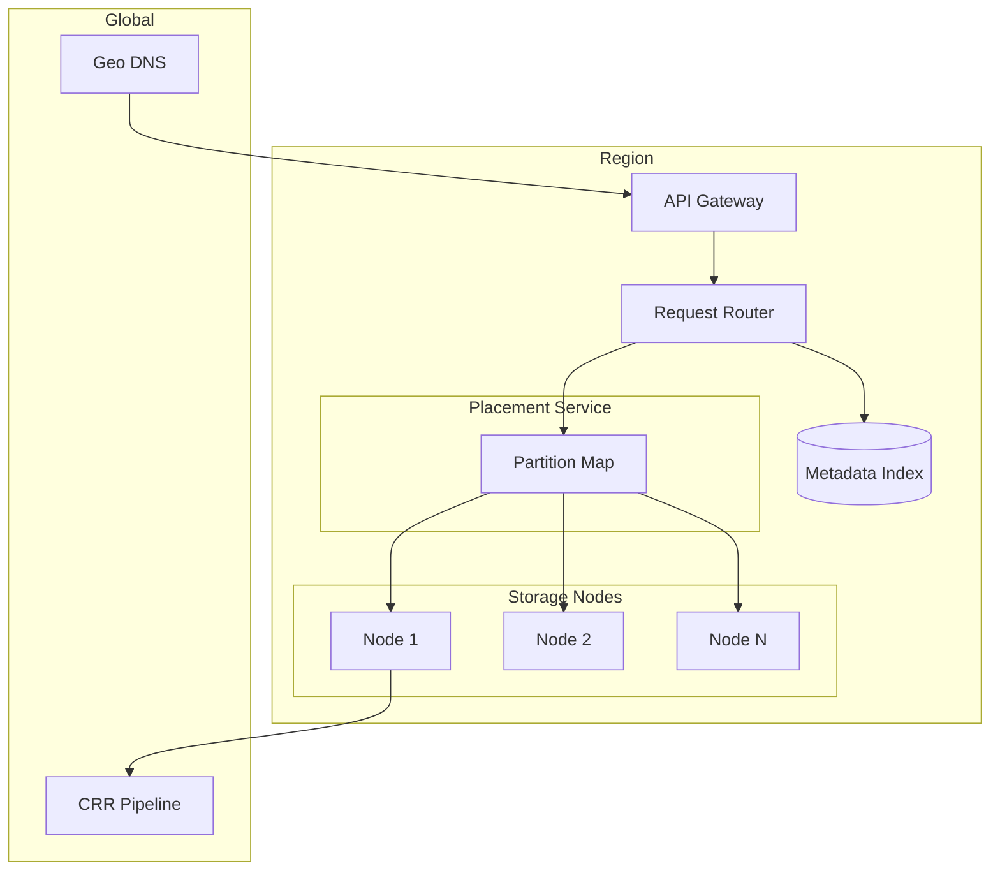
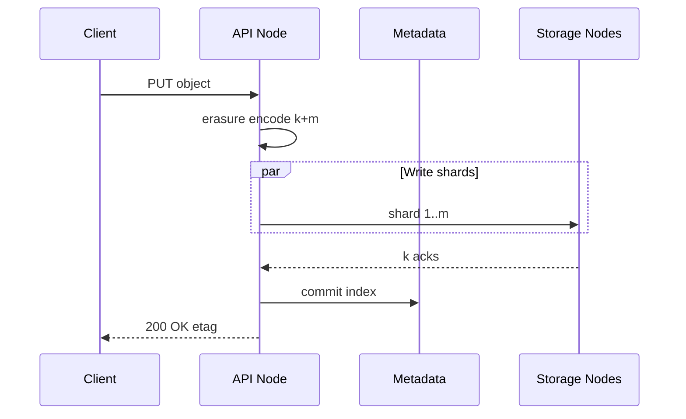
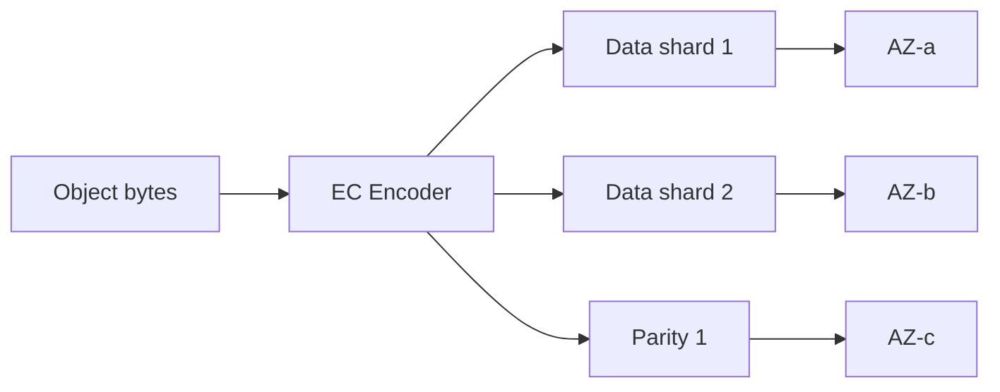

# Global Object Store

## 1. Executive Summary

A **global object store** provides durable, scalable key-value storage for unstructured blobs (photos, backups, logs, ML datasets) with REST APIs, multi-region replication, and 11-nines durability targets. Principal-level design covers **partitioning**, **quorum writes**, **erasure coding vs replication**, **strong vs eventual consistency models**, **lifecycle tiering**, and **multi-region active-active** tradeoffs.

This chapter designs an S3-class service storing exabytes across regions with PUT/GET latency under 100 ms same-region and configurable cross-region replication lag. Consistent hashing for placement, Reed-Solomon erasure coding, and metadata index separation are core interview topics.

## 2. Why This Topic Matters

Object storage is the foundation of cloud data platforms. Architects must explain:

- **CAP tradeoffs** for metadata vs data path.
- **Durability math** (replication factor, erasure coding k+m).
- **Listing at scale** (prefix design, not true directories).
- **Multipart upload** and consistency of LIST after PUT.
- **Cross-region replication** for DR and latency.

Failures include lost objects from insufficient quorum, runaway storage costs, and LIST inconsistencies during partitions. Review [Amazon Dynamo](/docs/distributed-databases/amazon-dynamo), [Quorum Systems](/docs/consistency/quorum-systems), and [File Storage System](/docs/system-design/file-storage-system).

## 3. Problems Being Solved

| Problem | Solution |
|---------|----------|
| **Exabyte scale** | Horizontal partition; no central bottleneck |
| **Durability** | Replication + erasure coding across AZs |
| **Availability** | Quorum reads/writes; repair degraded shards |
| **Global access** | Regional endpoints; async replication |
| **Cost efficiency** | EC 10+4 vs 3× replication |
| **Large objects** | Multipart; range GET |
| **Lifecycle** | Tier to Glacier; expiration rules |
| **Tenant isolation** | Bucket policies; IAM |

## 4. Assumptions and System Model

**Functional:**

- PUT/GET/DELETE object by `(bucket, key)`.
- Multipart upload; range reads.
- LIST with prefix (paginated).
- Versioning optional.
- Server-side encryption (SSE-S3, SSE-KMS).

**Non-functional:**

- Durability 99.999999999% (11 nines) per object per year.
- Availability 99.99% per region.
- Same-region PUT p99 &lt; 200 ms; GET &lt; 100 ms for 1 MB.
- Unlimited buckets; 5 TB max object size.

| Assumption | Implication |
|------------|-------------|
| **Objects immutable after commit** | Overwrite = new version |
| **Key-value flat namespace** | Prefix is convention |
| **Read-heavy** | CDN integration; caching |
| **Eventual LIST consistency** | Design clients accordingly (S3 historical model) |
| **Regional data sovereignty** | Pin buckets to region |

## 5. Essential Terminology

| Term | Definition |
|------|------------|
| **Bucket** | Container; globally unique name |
| **Object key** | String identifier within bucket |
| **Shard / partition** | Subset of keys on storage node set |
| **Erasure coding (k+m)** | k data + m parity shards |
| **Quorum** | Minimum replicas for read/write |
| **Placement group** | Nodes that store one object's shards |
| **Read repair** | Fix divergent replicas on read |
| **Scrubber** | Background integrity verification |
| **CRR** | Cross-region replication |
| **WORM** | Write once read many—compliance mode |
| **Strong read-after-write** | New object immediately visible |

## 6. Core Mechanism

### 6.1 Architecture



*Figure 1: API router resolves bucket/key to partition; placement service maps to storage nodes.*

### 6.2 APIs

```
PUT /{bucket}/{key}  Body + headers
GET /{bucket}/{key}  Range: bytes=0-1048575
DELETE /{bucket}/{key}
POST /{bucket}?uploads  → uploadId
PUT /{bucket}/{key}?partNumber=N&uploadId=...
POST /{bucket}/{key}?uploadId=...  (complete)
GET /{bucket}?prefix=logs/2026/&marker=...
```

### 6.3 Data Model

**Metadata index (per region):**

```
bucket, key, version_id → { size, etag, storage_tier,
  shard_map[], created_at, encryption_key_id }
```

**Shard map:**

```
[{ node_id, shard_index, checksum }]
```

**Partition map:**

```
hash(bucket+key) → partition_id → [node_ids]
```

### 6.4 Deep Dives

**Write path (quorum):**

1. Authenticate; resolve bucket region.
2. Hash key → partition; select k+m nodes (distinct racks/AZs).
3. Stream object; compute shards via erasure coding.
4. Write shards in parallel; wait for k acknowledgments (write quorum).
5. Commit metadata index entry atomically.
6. Async replicate to CRR destination if configured.

**Read path:**

1. Lookup metadata; fetch any k shards.
2. Reconstruct object if needed.
3. Read repair if shard checksum mismatch detected.



*Figure 2: Parallel shard write with quorum ack before metadata commit.*

**Erasure coding vs replication:**

| Mode | Storage overhead | Rebuild traffic | CPU |
|------|------------------|-----------------|-----|
| 3× replication | 200% | Low | Low |
| 10+4 EC | 40% | Higher on failure | Higher |

Large objects favor EC; hot small objects may use replication for latency.



*Figure 3: Erasure-coded shards spread across availability zones.*

**Multi-region:**

- **Active-passive:** Primary region writes; async CRR to DR.
- **Active-active:** Conflict on same key concurrent writes—need version vectors or last-writer-wins; complex.
- **Global bucket:** DNS routes to nearest region; metadata federation or single primary metadata region.

## 7. Step-by-Step Walkthrough

### 7.1 Simple PUT

1. Client PUT 10 MB object to `s3://logs/app/2026/07/25/file.gz`.
2. Router hashes key → partition 42.
3. 10+4 EC → 14 shards on 14 nodes across 3 AZs.
4. 10 acks received; metadata committed.
5. GET immediately returns object (strong read-after-write in modern S3-class systems).

### 7.2 Node failure during write

1. One shard write times out.
2. Retry alternate node in same AZ if spare capacity.
3. If k shards committed, write succeeds; repair job fixes missing shard.

### 7.3 Cross-region replication

1. Bucket policy enables CRR to `eu-west-1`.
2. After commit, replication event queued.
3. Object copied to EU bucket within seconds to minutes (SLA-dependent).
4. EU GET served locally without US round trip.

### 7.5 LIST consistency after overwrite

1. Client A overwrites key `config.json` (versioned bucket).
2. Client B lists prefix `config` immediately after.
3. Modern S3-class: read-after-write for new object; LIST may lag milliseconds—B sees new version on retry.
4. Application design: GET by known key after PUT, not LIST-dependent critical path.

### 7.6 Inventory API for compliance

1. Auditor needs all objects in `finance/` prefix for year.
2. Daily inventory manifest to S3 CSV—no LIST storm on hot bucket.
3. Manifest includes size, etag, storage class for cost audit.

## 7B. Replication and Repair Timeline

```
Event: AZ-a loss with 33% of shard primaries
T+0:    Controller detects heartbeat miss
T+30s:  New leaders elected from ISR in AZ-b/c
T+1m:   Writes resume; elevated latency cross-AZ
T+1h:   Repair jobs begin rebuilding parity shards
T+24h:  Repair 80% complete—throttled to protect foreground IO
```

Document **repair throttle** policy—full-speed rebuild can starve production GETs.

## 10A. Egress Cost Modeling

Cross-region GET dominates cloud bill for global products:

```
1 PB/month egress cross-region × $0.02/GB ≈ $20K/month (order of magnitude—verify vendor pricing)
Mitigation: CloudFront; regional buckets; CRR with local reads
```

Mark pricing for verification against current cloud rate cards.


| Phase | Key decisions |
|-------|---------------|
| Requirements | PUT/GET/LIST, 11 nines, multi-region |
| Scale | partition hash; EC |
| APIs | S3-compatible REST |
| Data | metadata index + shard map |
| Reliability | quorum; scrubber; CRR |

## 8. Invariants and Guarantees

| Property | Guarantee |
|----------|-----------|
| **Durability** | k-of-n shard survival policy |
| **Immutability** | Versioned overwrite |
| **AuthZ** | IAM policy on every request |
| **LIST** | Eventually consistent in classic model; strong in some modern implementations |
| **Delete** | Tombstone; async physical delete |

## 9. Failure Scenarios

| Scenario | Mitigation |
|----------|------------|
| **AZ loss** | Survive if k shards across remaining AZs |
| **Silent bit rot** | Checksums; scrubber |
| **Metadata loss** | Replicated metadata store; backups |
| **Hot partition** | Split partition; rate limit |
| **CRR lag** | Monitor backlog; scale replicators |
| **Split brain write** | Leader for metadata; fencing |

## 10. Performance Characteristics

```
Exabyte store: billions of objects
Partition count: 10K+ for parallelism
Per-node throughput: 1–10 Gbps
Metadata lookup: 1–5 ms from distributed index
Small object overhead: consider merge pack for &lt;64 KB
```

## 11. Scalability Limits

| Limit | Mitigation |
|-------|------------|
| Hot key | Per-key rate limits; CloudFront |
| LIST huge prefix | Pagination; inventory API |
| Metadata size | Shard index by bucket hash |
| EC rebuild storm | Throttle repair bandwidth |

## 12. Operational Considerations

- Metrics: durability events, repair queue, CRR lag, 5xx rate.
- Alerts: shard under-replication; scrub failures.
- Capacity: disk utilization per AZ balanced.
- Game days: AZ failure simulation.

## 13. Security Considerations

- IAM policies; bucket policies; block public access default.
- SSE-KMS per-tenant keys; audit CloudTrail-equivalent.
- Presigned URL scope and TTL.
- Object Lock / WORM for compliance.
- DDoS protection on public buckets.

## 14. Cost Considerations

EC reduces storage 50%+ vs 3× replication. Egress is profit center—design APIs to minimize cross-region reads. Intelligent tiering for unknown access patterns. Small object tax—batch or pack tiny files.

## 15. Production Implementations

| System | Notes |
|--------|-------|
| **Amazon S3** | Industry reference; 11 nines claim |
| **Google GCS** | Similar API; dual-region buckets |
| **Azure Blob** | Hot/cool/archive tiers |
| **MinIO** | S3-compatible self-hosted |
| **Ceph RADOS** | Open source object layer |

**Verification:** Durability and consistency claims should be verified against current vendor SLAs and documentation.

## 16. Alternatives and Tradeoffs

| Approach | Pros | Cons |
|----------|------|------|
| 3× replication | Simple reads | 3× storage |
| Erasure coding | Storage efficient | Rebuild cost |
| Strong LIST | Easier clients | Metadata cost |
| Single region | Simpler | No DR |
| Active-active multi-region | Low latency writes globally | Conflict complexity |
| File system on block | POSIX | Does not scale to exabytes |

## 16A. Storage Class Selection Guide

| Class | Access pattern | Latency | Cost |
|-------|----------------|---------|------|
| Standard | Frequent | ms | Baseline |
| Infrequent Access | Monthly | ms | −40% storage |
| Glacier Instant | Quarterly restore | ms–minutes | −70% |
| Glacier Deep Archive | Yearly compliance | hours | −90% |

Lifecycle transitions automatic by prefix—but **retrieval fees** surprise finance if analysts query cold tier interactively. Principal architects model total cost including egress and retrieval, not storage $/GB alone.

## 16B. Multi-Tenancy on Shared Cluster

SaaS object store isolates tenants via:

- IAM policy per tenant prefix `s3://shared/{tenant_id}/`
- Rate limits per API key
- Storage quota counters with alert at 90%
- Optional dedicated partition pool for enterprise noisy neighbors

Noisy neighbor on shared partition remains risk—monitor per-partition request rate heatmaps.

| "LIST is always immediate" | Historical eventual consistency |
| "Unlimited QPS per prefix" | Hot partition limits |
| "DELETE frees instantly" | Async physical removal |
| "CRR is synchronous" | Usually async with lag |

## 18.1 Multi-Cloud Object Store Considerations

Organizations avoiding single-vendor lock-in may abstract S3 API via MinIO or cloud-agnostic gateways. Principal tradeoffs: lowest latency when app and storage same cloud; egress charges when crossing clouds; consistent IAM model harder across vendors. Document **primary write region** explicitly—active-active multi-cloud object writes remain research-grade hard for general workloads; active-passive DR is production norm. Compliance data residency may force region-specific buckets regardless of abstraction layer—architecture review maps legal entity → bucket region matrix.

## 18. Principal Architect Perspective

- **Durability is a system property**—quorum + scrub + geo dispersion.
- **Key design affects performance**—avoid hot prefixes with sequential keys; add salt.
- **Metadata is not free**—billions of small objects stress index.
- **CRR RPO** must match business DR requirements explicitly.
- **EC parameter choice** is irreversible ops commitment—model rebuild time.

## 19. Architecture Review Exercise

**Scenario:** Sequential keys `object-0000001` cause single partition overload.

**Review:** Hash prefix in key or use UUID keys; partition spread analysis.

## 20. Whiteboard Explanation

"Clients PUT objects via regional API. Router hashes bucket+key to a partition and erasure-encodes into k data plus m parity shards spread across AZs. Write succeeds when k shards ack; metadata index commits atomically. GET fetches any k shards to reconstruct. Background scrubbers detect bit rot; read repair fixes replicas. Cross-region replication is async event-driven. Lifecycle policies tier cold data. IAM enforces every request."

## 21. Interview Questions

1. **Design S3.** — *Signals:* partition, EC, metadata index. *Red flags:* single NAS.
2. **11 nines durability?** — *Signals:* multi-AZ shards, scrub, monitoring. *Follow-up:* math.
3. **EC 10+4 vs 3× replication?** — *Signals:* storage vs rebuild tradeoff.
4. **Hot key problem?** — *Signals:* partition limits, CDN, key salting.
5. **Multipart upload why?** — *Signals:* large files, resume, parallel.
6. **LIST consistency?** — *Signals:* eventual vs strong; client design.
7. **Cross-region replication?** — *Signals:* async pipeline, conflict policy.
8. **Delete object flow?** — *Signals:* tombstone, async purge.
9. **Small object problem?** — *Signals:* metadata overhead, packing.
10. **Read repair vs scrub?** — *Signals:* proactive vs reactive.
11. **Presigned URL?** — *Signals:* delegated auth, TTL.
12. **Versioning?** — *Signals:* delete marker, storage cost.
13. **WORM compliance?** — *Signals:* Object Lock, legal hold.
14. **Quorum write failure?** — *Signals:* retry, alternate nodes, never commit partial.

## 21B. Extended Interview Question Deep Dives

**Q15 (Principal):** Customer demands strong read-after-write LIST globally within 1 second.

*Strong signals:* Explains classic eventual LIST vs strong metadata index options; cost of global consensus on list; alternative: application tracks known keys post-PUT. *Red flags:* "S3 always strong LIST everywhere." *Rubric:* 5/5 states tradeoff and recommends GET-by-key for correctness path.

**Q16 (Principal):** 10 KB objects at 100K PUT/sec—metadata bottleneck.

*Strong signals:* Small object packing; batch PUT API; higher metadata shard count; consider if objects should be aggregated upstream. *Math:* 100K metadata ops/sec shard plan.

2. **Inventory vs LIST.** — Batch export for analytics; avoids LIST QPS.
3. **S3 Select / query in place.** — Pushdown compute; separate subsystem.

## 23. Strong Answer Example

**Q:** How do you achieve 11 nines durability?

**Outline:** Erasure code or replicate each object across ≥3 AZs so simultaneous loss of 2 AZs still allows reconstruction. Checksum every shard; background scrubbers detect corruption. Read repair on access. Monitor shard under-replication and alert. Cross-region copy for regional catastrophe. Durability is probabilistic model based on failure rates—document assumptions.

## 24. Weak Answer Example

**Weak:** "Store three copies on one server with RAID."

**Red flags:** Single point of failure, no AZ diversity, no scrub, no scale model.

## 25. Hands-On Exercise

1. Simulate 10+4 EC encode/decode with shard loss.
2. Implement consistent-hash partition router.
3. Quorum write with timeout and retry.
4. Benchmark LIST pagination vs full prefix scan.
5. **Extension:** CRR lag simulator with queue backlog metrics.

## 25A. Extended Hands-On Lab

7. Model AZ failure: mark 33% leaders offline; measure write availability with min ISR=2.
8. Calculate storage for 1 PB retention 30d with EC 10+4 vs 3× replication—spreadsheet for interview practice.
9. Implement LIST pagination client that never assumes single-page completeness.
10. **Principal lab:** Write ADR choosing CRR async vs sync for finance bucket—document RPO/RTO.

## 25B. Production Readiness Review Questions

Ask these in architecture review before launch:

- What happens to in-flight multipart uploads during regional failover?
- Can a compromised API key enumerate entire bucket without rate limit?
- Is repair bandwidth throttled during triple AZ degradation?
- How long until deleted data is cryptographically unrecoverable?

If any answer is "we'll figure out later," the design is not production-ready.

2. Why salt sequential keys?
3. Write quorum before metadata commit?
4. Difference inventory API vs LIST?

## 27. Flashcards

| Front | Back |
|-------|------|
| Erasure coding | k data + m parity shards |
| Write quorum | Minimum acks before commit |
| Read repair | Fix replica on read mismatch |
| CRR | Async cross-region copy |
| Tombstone | Logical delete marker |
| Partition | Key hash range on node set |
| Strong read-after-write | New PUT visible immediately |
| Scrubber | Background checksum verify |
| Storage tier | Hot/cool/archive cost levels |
| Hot prefix | Sequential keys overload partition |

## 28. Cheat Sheet

```
REQUIREMENTS: PUT/GET/LIST, 11 nines, 5TB object, multi-region
SCALE: hash partition; EC; thousands of storage nodes
APIs: S3 REST; multipart; presigned
DATA: metadata index + shard map per object
ARCH: router → placement → storage nodes
DEEP: quorum write; read repair; CRR async
RELIABILITY: multi-AZ; scrub; under-replication alert
SECURITY: IAM; SSE-KMS; block public access
OPS: repair bandwidth; CRR lag; lifecycle rules
```

## 17A. Failure Scenario Drill

Operator enables `unclean.leader.election` globally to recover faster after AZ outage—partitions lose last 30s of writes; payment events missing. Mitigation: unclean election disabled for financial topics; runbook requires explicit exec approval. Principal distinguishes **availability vs durability** tradeoff explicitly in runbooks.

## 18.1 Durability Math (Interview BOE)

RF=3, min ISR=2: survive 1 simultaneous replica loss without write stall. Probability models (vendor SLAs) claim 11 nines when objects spread across ≥3 AZs—state assumptions: independent AZ failure, scrub detects bit rot. Do not invent exact outage probabilities—cite vendor SLA or mark for verification.

## 19A. Extended Review Scenario

**Scenario B:** Lifecycle policy missing; 5 PB bucket grows $500K/month unnoticed.

**Review:** Default lifecycle 90d to IA, 365d to Glacier; budget alerts on storage growth rate per bucket.

## 21A. Additional Interview Questions

15. **S3 eventual consistency history—design client?** — *Signals:* retry LIST; strong read-after-write for new objects in modern regions. *Red flags:* assume 1990s semantics without caveat.
16. **Requester pays buckets?** — *Signals:* egress billing to downloader; abuse consideration.

## 28A. Principal Interview Deep Dive

### Key naming for partition spread

Bad: `logs/2026/07/25/00001` sequential—hot partition.
Good: `logs/2026/07/25/{uuid}` or hash prefix `logs/{hash%256}/...`

### Repair bandwidth planning

Losing AZ triggers rebuild of all shards that had primaries there—estimate rebuild TB/day vs disk IO budget; throttle repair to protect foreground GET latency.

### Multipart upload orphan cost

7-day lifecycle rule on incomplete multipart uploads—schedule mandatory; orphans can be 5–10% storage in immature deployments.

## 28B. Extended BOE Walkthrough

**Interviewer:** "Exabyte object store, 1M PUT/sec."

**Strong candidate:**

"1M PUT/sec × 1 MB avg = 1 TB/sec ingest—needs thousands of partitions and nodes; most objects smaller—use packed small object store or accept metadata pressure.

Partition hash(bucket+key); EC 10+4; quorum k acks. Metadata index separate from data nodes.

Hot key: salt prefix. CRR async for DR. LIST not in hot path—inventory API for analytics.

Compare [File Storage System](/docs/system-design/file-storage-system) when hierarchical namespace needed on top."

## 29. Related Concepts

- [File Storage System](/docs/system-design/file-storage-system)
- [Dropbox Design](/docs/system-design/dropbox-design)
- [Amazon Dynamo](/docs/distributed-databases/amazon-dynamo)
- [Quorum Systems](/docs/consistency/quorum-systems)
- [CAP Theorem](/docs/consistency/cap-theorem)
- [Disaster Recovery](/docs/reliability-and-resilience/disaster-recovery-and-multi-region)

## 30. References

- Amazon S3 — durability and consistency documentation (vendor SLA).
- Weil et al. — Ceph CRUSH placement (academic/implementation).
- Kleppmann, *DDIA* — replication and partitioning.

**Distinction:** 11-nines figure from AWS marketing/docs—validate for your design context.

### 30A. Further Reading Paths

Study [Quorum Systems](/docs/consistency/quorum-systems) for ISR math. Compare to [Amazon Dynamo](/docs/distributed-databases/amazon-dynamo) for metadata partition tolerance differences.

### 30B. Small Object Packing

Objects &lt; 64 KB incur metadata overhead disproportionate to size. **Packing** aggregates small objects into blob with index—used in some systems (implementation choice). Tradeoff: GET latency for packed object vs metadata explosion.

### 30C. Cross-Region Consistency Modes

| Mode | Write | Read | Use case |
|------|-------|------|----------|
| Single region | Local | Local | Default |
| CRR async | Primary | Local replica | DR |
| Active-active | Multi-primary | Nearest | Low latency global; conflict risk |

Document RPO for CRR explicitly in architecture review.

### 30E. Principal Architecture Review Checklist

- [ ] `min.insync.replicas=2` with `replication.factor=3` on all production topics-equivalent buckets
- [ ] Unclean leader election disabled for durability-critical namespaces
- [ ] Key naming reviewed for partition heat—no sequential prefixes without salt
- [ ] Incomplete multipart upload lifecycle rule enabled (max 7 days)
- [ ] CRR lag monitored with RPO alert threshold documented
- [ ] Scrubber job completing full cluster scan within SLA (e.g., 30 days)
- [ ] LIST not on critical path for applications—GET by key after PUT
- [ ] Public access block enabled account-wide; exception process requires security approval

Object stores look simple in diagrams; production incidents come from lifecycle gaps, hot partitions, and replication misconfiguration.

### 30F. Comparison with File Storage Layer

When product needs folders and ACL paths, add [File Storage System](/docs/system-design/file-storage-system) metadata tier **on top of** this object store—do not reinvent erasure coding in metadata service. Separation of concerns: this chapter owns bytes durability; file chapter owns namespace semantics.
