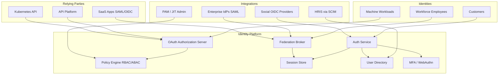
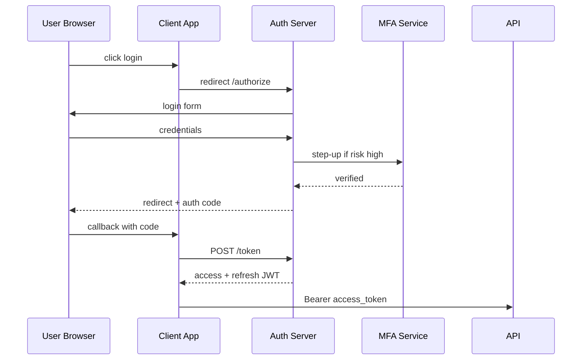
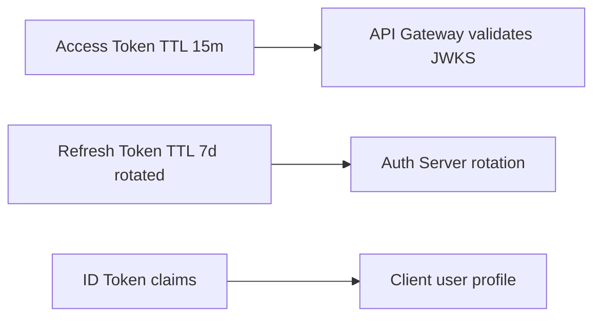

# Identity Platform

## 1. Executive Summary

An **identity platform** is the authoritative system for **authentication** (proving who you are), **authorization** (what you may do), and **identity lifecycle** (provisioning, federation, offboarding) across workforce employees, customer users, and machine workloads. Modern platforms unify **Workforce Identity** (SSO via SAML/OIDC to corporate apps), **Customer Identity and Access Management (CIAM)** (registration, social login, MFA for B2C), and **machine identity** (SPIFFE, workload JWTs, service accounts) under consistent policy engines and audit.

Principal architects design identity platforms when fragmented login systems create security gaps, compliance failures, and poor user experience. This chapter covers a reference architecture serving 50M customer identities, 20K employees, 8K microservices—with **OIDC** as primary protocol, **RBAC + ABAC** policy layering, **step-up authentication** for sensitive actions, and **zero standing admin access** integrated with [Zero Trust Architecture](/docs/security/zero-trust-architecture).

Safety: authentication failures deny access; authorization is default-deny. Liveness: cached JWKS and session stores must survive IdP degradation within defined bounds without bypassing MFA.

## 2. Why This Topic Matters

Identity is the **control plane of security**:

- **Credential stuffing** attacks exploit password reuse.
- **OAuth misconfiguration** causes cross-tenant data leaks in SaaS.
- **Stale workforce accounts** remain active after termination.
- **B2B federation** (SAML) errors break enterprise deals.

Principal interviews test OAuth2 flows, token lifetimes, refresh rotation, SCIM provisioning, and how identity integrates with API platforms and secrets management—not "we use Okta" without depth. Follow-ups on token binding, session fixation, and break-glass admin separate levels.

## 3. Problems Being Solved

| Problem | Platform capability |
|---------|---------------------|
| **Password fatigue** | SSO; passwordless passkeys |
| **MFA enforcement** | Adaptive risk-based step-up |
| **Customer registration** | CIAM with social IdPs |
| **B2B enterprise SSO** | SAML/OIDC federation per tenant |
| **Service-to-service auth** | mTLS + JWT with audience claims |
| **Provisioning lag** | SCIM sync from HRIS |
| **Audit and compliance** | Login logs; access reviews |
| **Privileged access** | PAM integration; just-in-time roles |

## 4. Assumptions and System Model

### Functional

- Workforce SSO to 200+ SaaS apps via SAML/OIDC.
- Customer sign-up, login, password reset, MFA enrollment.
- OAuth2 authorization server for first-party and partner APIs.
- Admin console for role assignment and access reviews.
- SCIM inbound from Workday/Okta for user lifecycle.
- Machine auth: K8s SA tokens → OIDC → service JWT.

### Non-functional

- Login p99 &lt; 500 ms (excluding external IdP latency).
- Availability 99.99% for auth endpoints.
- Global deployment with data residency per region for CIAM PII.
- Support 10K auth RPS peak (product launch).

| Assumption | Implication |
|------------|-------------|
| **OIDC preferred over custom** | Standard libraries; interoperable |
| **Tokens are bearer unless bound** | Short TTL; rotation; mTLS where possible |
| **HRIS is source of truth for workforce** | SCIM deprovision within 1 hour of termination |
| **Customers may use social login** | Account linking; email verification |
| **Regulations vary by region** | EU data in EU; consent logging |

## 5. Essential Terminology

| Term | Definition |
|------|------------|
| **IdP** | Identity Provider—authenticates users |
| **SP** | Service Provider—relies on IdP (SAML term) |
| **OIDC** | OpenID Connect—identity layer on OAuth2 |
| **SAML** | XML federation standard for enterprise SSO |
| **CIAM** | Customer Identity and Access Management |
| **SCIM** | Cross-domain user provisioning protocol |
| **RBAC** | Role-Based Access Control |
| **ABAC** | Attribute-Based Access Control |
| **MFA** | Multi-Factor Authentication |
| **Refresh token rotation** | New refresh on each use; detect reuse |
| **JWKS** | JSON Web Key Set for token verification |
| **Passkey** | WebAuthn/FIDO2 passwordless credential |
| **B2B federation** | Per-tenant enterprise IdP trust |

## 6. Core Mechanism

### 6.1 Identity platform architecture



*Figure 1: Unified identity platform—workforce federation, CIAM, and machine OAuth in one policy plane.*

### 6.2 Authorization code flow (customer login)



*Figure 2: OIDC authorization code flow with optional adaptive MFA.*

### 6.3 Token and session model



*Figure 3: Short-lived access tokens; refresh rotation detects theft.*

### 6.4 Deep dives

**B2B multi-tenant federation:**

- Each enterprise tenant configures SAML metadata or OIDC discovery URL.
- Email domain routing: `@acme.com` → Acme IdP.
- JIT provisioning creates user with tenant_id claim.

**Authorization layering:**

1. **Coarse RBAC:** `billing_admin`, `viewer`.
2. **ABAC:** `resource.owner_id == subject.user_id`.
3. **ReBAC (optional):** Google Zanzibar-style relationship tuples for sharing graphs.

**Machine identity:**

- SPIFFE ID `spiffe://prod/ns/payments/sa/api` in JWT `sub`.
- Audience claim `aud: payments-api` enforced at gateway and service.

**Offboarding:**

- SCIM `DELETE` or `active: false` → revoke all sessions within 60 s.
- Event to API platform to invalidate outstanding refresh tokens.

## 7. Step-by-Step Walkthrough

### 7.1 Employee SSO to internal tool

1. Employee visits `analytics.corp.com`.
2. SP redirects to corporate IdP (OIDC).
3. IdP asserts MFA satisfied; returns ID token + access token.
4. SP validates JWT signature via JWKS cache.
5. SP maps `groups` claim to RBAC roles.

### 7.2 Customer passkey enrollment

1. Logged-in customer opts into passkey.
2. WebAuthn challenge from platform; credential stored hashed.
3. Next login: passwordless assertion; risk score low → no SMS MFA.

### 7.3 OAuth misconfiguration incident

1. Mobile app uses implicit flow (legacy)—token in URL fragment leaked via referrer.
2. Fix: migrate to PKCE authorization code; rotate client secret.
3. Postmortem updates [Architecture Governance](/docs/architecture-leadership/architecture-governance) OAuth standards.

### 7.4 Service-to-service call

1. Payment service requests token from AS with client credentials + mTLS.
2. JWT contains `scope: payments.write` and SPIFFE sub.
3. Ledger service validates `aud` and scope before accepting write.

### 7.5 Regulatory audit of access decisions

1. Auditor requests proof that terminated employees lost access within policy SLA.
2. Export IdP audit log + SCIM event stream + session revoke events correlated by `user_id`.
3. Identify 3 accounts exceeding 60-minute SLA—root cause delayed SCIM from contractor agency.
4. Action: webhook from agency HR system; daily reconciliation job; dashboard for security review.
5. **Principal deliverable:** access lifecycle diagram linking HRIS → SCIM → session store → API gateway blocklist—referenced in SOC2 evidence binder.

## 7A. Integration Summary

| Consumer | Identity capability | Contract |
|----------|---------------------|----------|
| [API Platform](/docs/system-design/api-platform) | OAuth AS, JWT validation | `aud`, `scope`, `tenant_id` |
| [Secrets Management Platform](/docs/system-design/secrets-management-platform) | Workload JWT auth | SPIFFE `sub` binding |
| [Zero Trust Architecture](/docs/security/zero-trust-architecture) | MFA, posture, federation | Continuous session risk |
| SaaS apps | SAML/OIDC SSO | Attribute mapping per app |

## 8. Invariants and Guarantees

| Property | Type | Mechanism |
|----------|------|-----------|
| **AuthN before session** | Safety | Credential verify first |
| **Default deny AuthZ** | Safety | Explicit policy grants |
| **Token signature integrity** | Safety | Asymmetric keys in HSM |
| **Refresh reuse detection** | Safety | Rotation family revoke |
| **Session invalidation on offboard** | Safety | SCIM + event bus |
| **Login availability** | Liveness | Multi-region IdP replicas |

## 9. Failure Scenarios

| Scenario | Mitigation |
|----------|------------|
| IdP regional outage | Secondary region; cached JWKS |
| JWKS rotation lag | Key overlap period; kid header |
| SCIM delay on termination | HR webhook + daily reconciliation |
| MFA provider down | Backup factor; break-glass policy |
| SAML clock skew | Skew tolerance; NTP monitoring |
| Token theft | Short TTL; rotation; binding |
| Directory split-brain | Single writer region; CRDT not typical |
| DDoS on /login | CDN + CAPTCHA + rate limit |

## 10. Performance Characteristics

```
10K auth RPS peak
Session store: Redis cluster &lt; 5 ms p99
JWT validation at gateway: local JWKS cache &lt; 1 ms
SCIM bulk sync: async queue; not hot path
Password hash: Argon2id tuned to ~200ms (anti-brute-force)
Directory read: replicated LDAP/DB with read replicas
```

## 11. Scalability Limits

| Limit | Mitigation |
|-------|------------|
| Session store memory | Shorter session TTL; stateless JWT where safe |
| SAML XML parsing CPU | Dedicated federation workers |
| JWKS fetch storm | CDN cache; push key update webhook |
| Global user count | Shard directory by region |
| Policy evaluation complexity | Compile policies; cache decisions briefly |

## 12. Operational Considerations

- SLO: 99.99% auth endpoint; 100% SCIM deprovision within 1 hour SLA.
- Dashboards: login success rate, MFA adoption, federation errors, token grant rate.
- Runbooks: key rotation, IdP metadata update, mass session revoke.
- Quarterly access reviews for privileged roles.
- Game day: primary IdP failure; verify read-only mode messaging.

## 13. Security Considerations

- PKCE mandatory for public clients; no implicit flow.
- Secure cookie flags: `HttpOnly`, `Secure`, `SameSite=Lax`.
- Rate limit login; credential stuffing detection.
- Admin actions require step-up MFA and PAM session recording.
- GDPR: consent logs; right-to-erasure workflow for CIAM.
- Integrate secrets for signing keys via [Secrets Management Platform](/docs/system-design/secrets-management-platform).

## 14. Cost Considerations

Okta/Auth0/Azure AD B2C licensing per MAU for CIAM. Self-hosted Keycloak reduces license but increases ops. MFA SMS costs add up—push WebAuthn. Engineering: custom policy engine vs OPA sidecar.

## 15. Production Implementations

| System | Pattern |
|--------|---------|
| **Okta / Azure AD** | Workforce SSO leader |
| **Auth0 / Cognito** | CIAM patterns |
| **Keycloak** | Self-hosted OIDC/SAML |
| **Google Identity** | B2B workforce |
| **SPIFFE/SPIRE** | Workload identity |

## 16. Alternatives and Tradeoffs

| Decision | Tradeoff |
|----------|----------|
| Central IdP vs per-app auth | Security vs migration cost |
| Stateful session vs JWT-only | Revocation speed vs scale |
| SAML vs OIDC for B2B | Enterprise demand vs modern DX |
| SMS MFA vs WebAuthn | Reach vs phishing resistance |
| Zanzibar vs RBAC | Expressiveness vs complexity |
| Build vs buy CIAM | Time vs customization |

## 17. Common Misconceptions

| Misconception | Reality |
|---------------|---------|
| "JWT means stateless forever" | Revocation needs blocklist or short TTL |
| "OAuth is authentication" | OAuth is delegation; OIDC adds identity |
| "MFA once per device forever" | Step-up for sensitive actions |
| "Service accounts don't need rotation" | Machine creds need lifecycle too |
| "SAML is legacy only" | Still required for enterprise RFPs |
| "Groups in token are enough" | Fine-grained ABAC often needed |

## 18. Principal Architect Perspective

- **Identity is platform**, not per-team login page.
- **Optimize for offboarding speed**—slow deprovision is a breach waiting.
- **Token design is API contract**—claims must be stable and documented.
- **Federation errors are revenue risks** for B2B—monitor obsessively.
- **Machine and human identity converge** on OIDC patterns.
- Partner with security on zero-trust policy alignment.

## 19. Architecture Review Exercise

**Scenario:** Microservice validates JWT but ignores `aud` and accepts any signed token from corporate IdP.

**Review:** Cross-service token replay. Enforce audience, issuer, expiry, and scope at gateway and service. Document in API standards.

## 20. Whiteboard Explanation

"Workforce users federate through SAML or OIDC to our central authorization server. Customers use CIAM with passkeys and adaptive MFA. The OAuth server issues short-lived access JWTs and rotating refresh tokens. SCIM from HRIS deprovisions within an hour. Machine workloads get SPIFFE-based client credentials. Policy engine combines RBAC roles with ABAC attributes. API gateway validates JWKS with cached keys. Privileged admin uses PAM with just-in-time elevation. All login and admin events go to immutable audit for compliance."

## 21. Interview Questions

1. **Design identity for B2B SaaS with enterprise SSO.** — *Signals:* SAML/OIDC per tenant, JIT provision. *Red flags:* one password DB.
2. **OAuth2 flows compare?** — *Signals:* auth code+PKCE, client credentials. *Red flags:* implicit for SPAs.
3. **Refresh token rotation?** — *Signals:* reuse detection, family revoke.
4. **JWT validation checklist?** — *Signals:* sig, exp, iss, aud, scope.
5. **SCIM offboarding latency?** — *Signals:* event-driven session revoke.
6. **MFA bypass risks?** — *Signals:* step-up, risk engine. *Red flags:* permanent device trust.
7. **RBAC vs ABAC?** — *Signals:* layering, policy engine.
8. **Machine identity at scale?** — *Signals:* SPIFFE, short-lived JWT.
9. **Cross-region CIAM data residency?** — *Signals:* shard directory, consent.
10. **Passwordless rollout?** — *Signals:* WebAuthn, fallback factors.
11. **B2B SAML debugging?** — *Signals:* metadata, clock skew, attribute mapping.
12. **Break-glass admin access?** — *Signals:* PAM, time-bound, audited.

## 22. Interview Follow-Ups

1. **Token stolen from mobile app storage.** — Short TTL, binding, secure enclave.
2. **Enterprise IdP cert expires unnoticed.** — Metadata monitoring alerts 30d prior.
3. **Acquire company with separate IdP.** — Federation bridge; gradual directory merge.

## 23. Strong Answer Example

**Q:** How handle workforce termination at 2 AM?

**Outline:** HRIS marks terminated → SCIM webhook within minutes → identity platform disables account → publishes `user.revoked` event → session store deletes all sessions → refresh tokens invalidated → API gateway adds sub to blocklist cache → PAM closes any open elevated sessions. Audit log records chain. SLA 60 minutes max; target 5 minutes automated.

## 24. Weak Answer Example

**Weak:** "We use Okta and disable users manually when HR emails."

**Red flags:** No automation SLA, no session revoke, no machine identity, no token validation depth.

## 25. Hands-On Exercise

1. Deploy Keycloak; configure OIDC client with PKCE SPA.
2. Implement JWT validation middleware checking aud/iss/exp.
3. SCIM mock provision and deprovision user; verify session kill.
4. Configure SAML federation with test IdP; debug attribute mapping.
5. **Extension:** Refresh token rotation with reuse detection test.
6. **Extension:** OPA policy for ABAC on sample API.

## 26. Knowledge Check

1. OIDC vs OAuth2 responsibility split?
2. Why PKCE for public clients?
3. SAML assertion vs OIDC ID token?
4. What claims belong in access vs ID token?
5. SCIM operations for offboarding?
6. JWKS rotation strategy?
7. Passkey phishing resistance mechanism?
8. Client credentials flow use case?
9. Session fixation prevention?
10. Tenant isolation in B2B CIAM?
11. When step-up MFA?
12. SPIFFE ID in JWT benefit?

## 27. Flashcards

| Front | Back |
|-------|------|
| OIDC | Identity on OAuth2 |
| PKCE | Public client code exchange protection |
| SCIM | Automated user provisioning |
| JWKS | Public keys for JWT verify |
| Refresh rotation | Detect token theft via reuse |
| CIAM | Customer identity management |
| ABAC | Attribute-based policy |
| WebAuthn | Passkey standard |
| aud claim | Intended token recipient |
| Federation | Trust external enterprise IdP |
| Step-up MFA | Extra auth for sensitive action |
| SPIFFE | Workload identity framework |

## 28. Cheat Sheet

```
IDENTITIES: workforce | customer | machine
PROTOCOLS: OIDC primary; SAML B2B; SCIM provision
TOKENS: access 15m; refresh rotated; validate aud/iss/exp
MFA: adaptive risk; WebAuthn preferred
FEDERATION: per-tenant metadata; domain routing
MACHINE: client credentials + mTLS + SPIFFE sub
OFFBOARD: SCIM → revoke sessions + refresh
POLICY: RBAC coarse + ABAC fine
AUDIT: all login/admin events immutable
ZERO TRUST: identity + device + context
```

## 28A. Principal Interview Deep Dive

### B2B federation failure modes

Enterprise SSO integrations fail in production for predictable reasons—principal architects prepare:

| Failure | Symptom | Mitigation |
|---------|---------|------------|
| Metadata cert expiry | All logins fail for tenant | 30/14/7 day alerts; automated metadata fetch |
| Attribute mapping drift | User provisioned without role | Contract test against IdP sandbox |
| Clock skew | SAML assertion rejected | NTP monitoring; skew tolerance documented |
| JIT provisioning race | Duplicate users | Idempotent provision by external_id |
| IdP outage | Enterprise customers blocked | Cached session; status page; contractual RTO |

### Token design as API contract

Access token claims must be **stable, documented, and minimal**:

```
Required: sub, iss, aud, exp, iat
Tenant: tenant_id (B2B)
AuthZ: scope or roles (prefer scope for APIs)
Avoid: PII in token (email in ID token only)
```

Breaking change policy: adding optional claims is safe; renaming claims requires new API version. Coordinate with [API Platform](/docs/system-design/api-platform) JWT validation middleware.

### Machine identity at scale

```
8,000 K8s pods × cert TTL 24h → 333 cert issuances/hour average
SPIRE or mesh CA must automate; manual cert ops impossible
Rotation: rolling pod restart vs hot reload depends on mesh choice
Blast radius: compromised SA in namespace X → policy limits paths to namespace X only
```

### Offboarding SLA as security invariant

**Safety:** Terminated employee session invalid within 60 minutes (target 5 minutes automated). **Liveness:** IdP degradation may delay revoke—document maximum exposure window in risk register.

Measure: `time(HRIS termination event → last successful auth)`—dashboard for security review.

### Interview scenario: OAuth for mobile + SPA + server

| Client | Flow | Pitfall |
|--------|------|---------|
| SPA | Auth code + PKCE | Storing refresh in localStorage |
| Mobile | Auth code + PKCE + attestation | Custom URL scheme hijack |
| Server | Client credentials + mTLS | Shared secret in image |

Principal answer maps each client to flow with explicit threat mitigation—never one-size-fits-all.

## 29. Related Concepts

- [Security Architecture Fundamentals](/docs/security/security-architecture-fundamentals)
- [Zero Trust Architecture](/docs/security/zero-trust-architecture)
- [API Platform](/docs/system-design/api-platform)
- [Secrets Management Platform](/docs/system-design/secrets-management-platform)
- [HTTP, TLS, and QUIC](/docs/networking/http-tls-and-quic)
- [Architecture Governance](/docs/architecture-leadership/architecture-governance)

## 19A. Extended Review Scenario

**Scenario B:** Mobile app stores refresh token in `localStorage`; XSS on marketing subdomain steals token.

**Review:** Public client must use PKCE auth code flow; refresh token in httpOnly cookie or secure enclave—not localStorage. Implement strict Content-Security-Policy on all subdomains. Short access token TTL (15 min). Refresh rotation with reuse detection revokes token family on theft. Add security regression test in CI scanning mobile repo for forbidden storage patterns.

## 23A. Additional Strong Answer

**Q:** Design B2B multi-tenant identity for SaaS with per-customer SAML.

**Outline:** Each enterprise tenant record stores IdP metadata URL, attribute mapping (`groups` → `roles`), and JIT provisioning rules. Email domain routing resolves tenant on login. SP-initiated and IdP-initiated flows supported. Tenant isolation: `tenant_id` claim in every token; authorization policies deny cross-tenant API paths. Admin console for tenant self-service metadata upload with validation. Sandbox IdP for integration testing. Monitor federation error rate per tenant—sales alert if enterprise login fails &gt;1%. SCIM outbound optional for provisioned app roster sync.

## 28B. Extended BOE Walkthrough (Interview Script)

**Interviewer:** "Design identity for B2B SaaS with enterprise SSO."

**Strong candidate:**

"B2B means tenant-per-enterprise with SAML or OIDC federation. Customer users may also use local CIAM with passkeys for SMB segment.

Federation broker routes `@acme.com` to Acme IdP metadata. JIT provisioning creates user with `tenant_id` and mapped `groups` → roles. SCIM from customer optional for roster sync.

OAuth authorization server issues access JWT 15-minute TTL, refresh rotation with reuse detection. Machine workloads use SPIFFE client credentials—separate from human flows.

Offboarding: SCIM or admin disable → revoke all sessions within 60 minutes target. Audit every login and admin action.

Token validation at [API Platform](/docs/system-design/api-platform) gateway: `iss`, `aud`, `exp`, `tenant_id` required.

Data residency: EU tenants in EU directory shard—legal not optional.

Break-glass admin via PAM with recording—not shared root password."

## 30. References

- OAuth 2.0 RFC 6749 and OIDC Core 1.0 — protocol standards.
- SAML 2.0 OASIS specification — enterprise federation.
- SCIM RFC 7644 — provisioning protocol.
- NIST SP 800-63B — digital identity guidelines.
- FIDO2/WebAuthn specifications — passwordless authentication.

**Distinction:** RFC security requirements are normative; vendor IdP feature sets vary; regional privacy law drives data residency implementation choices.

### 30A. Further reading paths

Study [Zero Trust Architecture](/docs/security/zero-trust-architecture) for continuous verification model, [API Platform](/docs/system-design/api-platform) for JWT validation at gateway, and [Secrets Management Platform](/docs/system-design/secrets-management-platform) for signing key storage. Walk through B2B SAML metadata exchange on paper—principal candidates should explain attribute mapping, clock skew, and certificate rotation without conflating SAML with OIDC.

**Lab:** Configure Keycloak SAML IdP + OIDC client; test SCIM deprovision kills active sessions. **Interview drill:** compare authorization code + PKCE vs client credentials—when each applies, what attacks each prevents, and common mobile/SPA misconfigurations that leak tokens.
