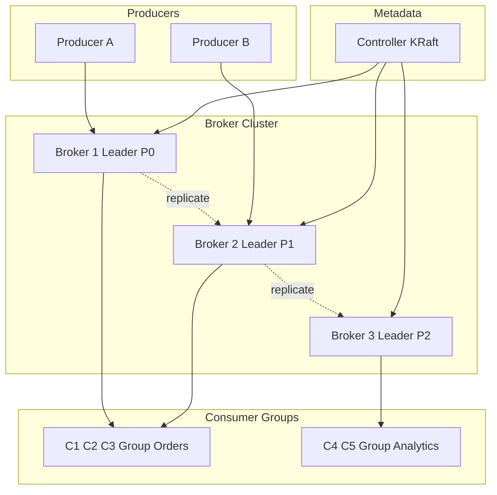
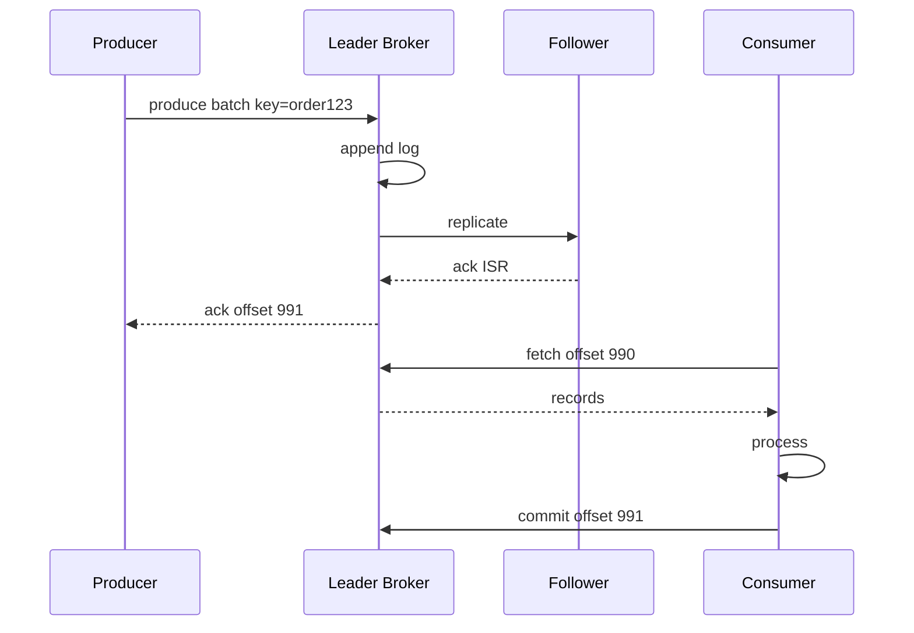
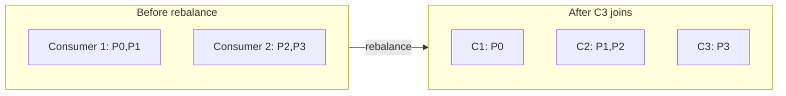

# Kafka-like Event Platform

## 1. Executive Summary

A **Kafka-like event platform** is a distributed commit log providing durable, ordered, partitioned streams for publish-subscribe messaging and stream processing at millions of events per second. Principal-level design covers **partition leadership**, **replication and ISR (in-sync replicas)**, **consumer groups**, **offset management**, **exactly-once semantics**, and **tiered storage**.

This chapter designs an Apache Kafka/Pulsar-class platform handling 10M+ messages/sec cluster-wide with configurable retention, at-least-once default delivery, and optional exactly-once transactions. Log segments, leader election, and rebalance protocol are mandatory interview topics.

## 2. Why This Topic Matters

Event streaming is the backbone of microservices, ETL, and real-time analytics. Architects must explain:

- **Log vs queue** semantics.
- **Partition ordering** guarantees.
- **Consumer group rebalancing** impact.
- **Replication** and unclean leader election risks.
- **Backpressure** and retention policies.

Failures include message loss, duplicate processing storms, and consumer lag incidents lasting hours. Review [Kafka Architecture](/docs/messaging-and-streaming/kafka-architecture), [Message Delivery Semantics](/docs/messaging-and-streaming/message-delivery-semantics), and [Apache Kafka](/docs/distributed-databases/apache-kafka).

## 3. Problems Being Solved

| Problem | Solution |
|---------|----------|
| **Durable messaging** | Append-only partitioned log |
| **High throughput** | Sequential disk I/O; zero-copy |
| **Ordering** | Per-partition order |
| **Fan-out** | Multiple consumer groups |
| **Replay** | Retain log; reset offsets |
| **Scale consumers** | Partition count ≥ max parallelism |
| **Fault tolerance** | Leader-follower replication |
| **Long retention** | Tiered storage to object store |

## 4. Assumptions and System Model

**Functional:**

- Topics divided into partitions; producers append records.
- Consumers in groups partition-assign consume with offsets.
- Retention by time (7d) or size.
- Compacted topics for changelog (key-based retention).
- Admin: create topic, alter config, ACLs.

**Non-functional:**

- 10M messages/sec aggregate (large cluster).
- p99 produce latency &lt; 10 ms same AZ.
- Durability: no acknowledged write lost if min ISR met.
- Availability 99.95% per cluster.
- Message size max 1 MB default.

| Assumption | Implication |
|------------|-------------|
| **Consumers idempotent** | At-least-once default |
| **Partition count planned** | Hard to change without rebalance pain |
| **Ordering per key** | Key → partition hash |
| **Broker local storage** | Disk bandwidth matters |
| **ZooKeeper/KRaft metadata** | Controller manages leaders |

## 5. Essential Terminology

| Term | Definition |
|------|------------|
| **Topic** | Named stream of records |
| **Partition** | Ordered immutable log shard |
| **Offset** | Monotonic position in partition |
| **Broker** | Server storing partitions |
| **Leader** | Broker handling reads/writes for partition |
| **Follower** | Replica fetching from leader |
| **ISR** | In-sync replicas eligible for leader |
| **Consumer group** | Cooperative consumers sharing load |
| **Rebalance** | Partition reassignment among consumers |
| **Retention** | Time/size bound on log |
| **Compaction** | Keep latest record per key |
| **HW (high watermark)** | Offset visible to consumers |
| **LEO** | Log end offset on replica |

## 6. Core Mechanism

### 6.1 Architecture



*Figure 1: Producers write to partition leaders; followers replicate; multiple consumer groups read independently.*

### 6.2 APIs

```
Produce(topic, partition|key, value, headers)
Fetch(topic, partition, offset, max_bytes)
OffsetCommit(group, topic, partition, offset)
CreateTopics(name, num_partitions, replication_factor)
ListOffsets(topic, partition, timestamp)
```

### 6.3 Data Model

**Record:**

```
{ offset, timestamp, key, value, headers, crc }
```

**Log segment files:**

```
topic-partition/
  00000000000000000000.log
  00000000000000000000.index  (offset → file position)
  00000000000000000000.timeindex
```

**Consumer offset (internal topic `__consumer_offsets`):**

```
group_id, topic, partition → committed_offset
```

### 6.4 Deep Dives

**Produce path:**

1. Producer picks partition: `hash(key) % num_partitions` or explicit.
2. Send to leader broker for partition.
3. Leader appends to log segment; replicate to ISR followers.
4. Ack when `acks=all` and min ISR replicas persisted.
5. Advance high watermark when all ISR caught up.

**Consume path:**

1. Consumer joins group; coordinator assigns partitions (range or cooperative sticky).
2. Fetch from leader at committed offset.
3. Process batch; commit offset synchronously or async.
4. On rebalance: revoke partitions; commit; reassign.



*Figure 2: Produce with ISR replication; consumer fetch and offset commit.*

**Leader election:**

- Controller detects leader failure via metadata heartbeat.
- Elect new leader from ISR preferred.
- **Unclean election** (non-ISR leader): risk data loss—disable for critical topics.

**Consumer rebalance:**

- Triggered: member join/leave, partition count change.
- **Cooperative sticky** reduces stop-the-world vs eager rebalance.
- Mitigate: static membership, incremental cooperative protocol.



*Figure 3: Partition reassignment when consumer group scales.*

**Exactly-once (EOS):**

- Idempotent producer (PID + sequence per partition).
- Transactions: atomic write to multiple partitions + consumer offsets.
- Cost: higher latency; use only when necessary.

**Tiered storage:**

- Old segments moved to S3; fetch transparently.
- Retention 30d hot local + 1y cold object store.

## 7. Step-by-Step Walkthrough

### 7.1 Ordered order events

1. Producer sends `order_id` as key; always partition 7.
2. All events for order strictly ordered in partition 7.
3. Consumer processes sequentially; no cross-order interleaving.

### 7.2 Broker failure

1. Leader broker for P3 crashes.
2. Controller elects follower from ISR as new leader.
3. Producers metadata refresh; resume in seconds.
4. Unclean election disabled—brief unavailability vs data loss.

### 7.3 Consumer lag incident

1. Slow consumer falls 10M messages behind.
2. Alert on lag &gt; 100K for 15 min.
3. Scale consumers up to partition count (12).
4. If still lagging: optimize processing or add partitions (requires planning).

### 7.5 Compacted topic consumer bootstrap

1. New `user-profile-cache` consumer joins group.
2. Reads compacted topic from offset `earliest`—gets latest profile per `user_id` key.
3. Builds local cache without snapshot DB—changelog pattern from [Event-Driven Architecture](/docs/messaging-and-streaming/event-driven-architecture).

### 7.6 Transactional consume-process-produce

1. Consumer reads order event, updates DB, publishes shipment event.
2. Kafka transaction: offsets + output topic commit atomically.
3. Failure rolls back offset—reprocess without duplicate shipment if DB idempotent.

## 7B. Partition Reassignment Impact

Increasing partitions from 12 → 24 **does not** split existing data—only new messages distribute. Plan partition count before production; increasing requires dual-consume migration or accept uneven historical distribution.

## 10A. Broker Disk Sizing

```
Retention: 7 days
Ingest: 500 MB/sec/cluster
Storage: 500 × 86400 × 7 ≈ 302 PB raw before replication
RF=3 → ~900 PB—illustrates why tiered storage mandatory at scale
```

Interview: show math even if hypothetical—principal thinks in orders of magnitude.


| Phase | Key decisions |
|-------|---------------|
| Requirements | durable log, ordering per key, fan-out |
| Scale | partitions, brokers, disk |
| APIs | produce, fetch, offset commit |
| Data | log segments; consumer offsets |
| Deep dives | ISR, rebalance, EOS optional |

## 8. Invariants and Guarantees

| Property | Guarantee |
|----------|-----------|
| **Partition order** | Total order within partition |
| **Durability** | acks=all + min.insync.replicas |
| **Delivery** | At-least-once default with manual commit |
| **Retention** | Records deleted per policy |
| **ISR safety** | Leader only committed up to min ISR offset |

## 9. Failure Scenarios

| Scenario | Mitigation |
|----------|------------|
| **Broker disk full** | Retention; tiered storage; alert |
| **ISR shrink below min** | Stop writes; alert ops |
| **Rebalance storm** | Static membership; cooperative protocol |
| **Poison message** | DLQ pattern; skip with manual offset |
| **Zombie consumer** | session.timeout.ms eviction |
| **Split brain leader** | KRaft consensus; fencing |

## 10. Performance Characteristics

```
Sequential write ~500 MB/sec per broker disk
10M msg/sec × 500 bytes = 5 GB/sec cluster → 10+ brokers
Zero-copy sendfile reduces CPU
Batch produce linger.ms=5 improves throughput
Partition count: start 2× peak consumer count
```

## 11. Scalability Limits

| Limit | Mitigation |
|-------|------------|
| Partition count too high | Metadata overhead; file handles |
| Hot partition | Key skew; salt keys |
| Single broker disk | More brokers; tiered storage |
| Consumer &gt; partitions | idle consumers |
| Cross-region mirror | MirrorMaker; lag SLA |

## 12. Operational Considerations

- Metrics: under-replicated partitions, ISR shrink, consumer lag, request rate.
- Alerts: offline partitions; disk &gt; 85%.
- Runbooks: preferred leader election; expand cluster.
- Topic creation governance: default RF=3, min ISR=2.

## 13. Security Considerations

- TLS + SASL authentication.
- ACL per topic produce/consume.
- Encrypt sensitive payloads at application layer.
- Network isolation for inter-broker traffic.
- Audit admin operations.

## 14. Cost Considerations

Disk and cross-AZ replication bandwidth dominate. Tiered storage cuts retention cost. Right-size partitions—over-partitioning wastes resources. Managed Kafka (MSK/Confluent) vs self-hosted ops.

## 15. Production Implementations

| System | Notes |
|--------|-------|
| **Apache Kafka** | Industry standard log |
| **Apache Pulsar** | BookKeeper storage separation |
| **Amazon MSK** | Managed Kafka |
| **Confluent Platform** | Enterprise Kafka ecosystem |
| **Redpanda** | C++ Kafka-compatible |

## 16. Alternatives and Tradeoffs

| Approach | Pros | Cons |
|----------|------|------|
| Kafka log | Replay; throughput | Ops complexity |
| RabbitMQ queue | Simple task queues | No replay log |
| SQS | Managed | No ordering (except FIFO) |
| Pulsar | Storage/compute split | Smaller ecosystem |
| DB changelog | Transactional | Lower throughput |
| gRPC streaming | Low latency RPC | Not durable log |

## 16A. Topic Naming and Governance Standards

Enforce org-wide conventions:

- `{domain}.{entity}.{event}` e.g. `orders.payment.captured`
- Version suffix in payload not topic name (`v2` in Avro schema)
- Owner team in topic registry; on-call rotation required for approval
- Max retention documented per topic class (events 7d, changelog compacted forever)

Ad-hoc topic sprawl causes consumer coupling and orphan topics nobody dares delete.

## 16B. Stream Processing Placement

| Processing | Tool |
|------------|------|
| Windowed aggregation metrics | Flink / Kafka Streams |
| Simple filter/map routing | Consumer app |
| Join two streams | Stream processor with state store |
| Long-running saga | [Workflow Engine](/docs/system-design/workflow-engine) |

Kafka is the log—not every computation belongs in broker. Principal defines platform boundaries clearly for engineering teams.

| "More consumers always faster" | Capped by partition count |
| "Global ordering" | Only per-partition |
| "Queues delete on read" | Log retains per policy |
| "Unlimited partitions free" | Metadata and file cost |

## 18.1 Event Schema Evolution Playbook

1. Add optional Avro field with default—backward compatible.
2. Deploy new consumers reading optional field.
3. Deploy producers writing field.
4. Remove old field only after all consumers upgraded—forward compatibility window.
5. Never rename field without new schema version—consumers break silently.

Schema Registry CI gate blocks incompatible changes. Principal owns cross-team schema council for shared topics like `orders.events`—adhoc JSON blobs become integration debt within quarters.

## 18. Principal Architect Perspective

- **Partition count is capacity plan**—hard to reduce later.
- **Key design drives fairness**—skew breaks hot partitions.
- **Consumer idempotency** mandatory unless EOS justified.
- **min.insync.replicas=2** with RF=3 for production durability.
- **Rebalance** is incident source—monitor and tune protocols.

## 19. Architecture Review Exercise

**Scenario:** Single partition topic; 50 consumers; massive lag.

**Review:** Increase partitions to ≥ consumer parallelism; fix key strategy; batch consume.

## 20. Whiteboard Explanation

"Topics split into ordered partitions stored as append-only logs on brokers. Each partition has a leader handling produce/fetch; followers replicate to ISR. Producers hash keys to partitions for ordering. Consumer groups coordinate partition assignment; each partition consumed by one consumer in group. Offsets track progress in internal topic. Controller manages leader election via KRaft. Retention trims old segments; compaction keeps latest per key. acks=all with min ISR for durability."

## 21. Interview Questions

1. **Design Kafka.** — *Signals:* log, partitions, ISR. *Red flags:* single queue DB.
2. **Ordering guarantees?** — *Signals:* per-partition only. *Follow-up:* key choice.
3. **acks=all meaning?** — *Signals:* ISR persisted before ack.
4. **Consumer group purpose?** — *Signals:* parallel consume; partition assign.
5. **Rebalance problem?** — *Signals:* stop-the-world; cooperative sticky.
6. **Hot partition fix?** — *Signals:* key salting; more partitions.
7. **At-least-once vs exactly-once?** — *Signals:* idempotent consumer vs transactions.
8. **Log retention vs compaction?** — *Signals:* time/size vs key changelog.
9. **Why not RabbitMQ for replay?** — *Signals:* queue deletes; no log rewind.
10. **Broker failure handling?** — *Signals:* ISR leader election.
11. **Partition count sizing?** — *Signals:* max consumer parallelism.
12. **Consumer lag mitigation?** — *Signals:* scale to partitions; optimize handler.
13. **Unclean leader election risk?** — *Signals:* data loss. *Follow-up:* when disable.
14. **Tiered storage benefit?** — *Signals:* long retention cheap on S3.

## 21B. Extended Interview Question Deep Dives

**Q15 (Principal):** Finance requires exactly-once ledger entries from Kafka consumer.

*Strong signals:* Idempotent consumer with DB unique constraint on `event_id`; or transactional consume-process-produce; compare EOS cost. *Red flags:* "Kafka is exactly-once end-to-end always." *Rubric:* 5/5 distinguishes broker EOS vs application ledger correctness.

**Q16 (Principal):** Topic with 6 partitions, peak lag 2 hours during Black Friday.

*Strong signals:* Pre-scale consumers to partition count; load test; consider temporary partition increase (requires planning); optimize handler batch size; add standby consumer group. *Prevention:* capacity review before known events.

2. **Schema Registry.** — Avro evolution; compatibility modes.
3. **Kafka Streams vs Flink.** — Library vs cluster processing.

## 23. Strong Answer Example

**Q:** How ensure no message loss on produce?

**Outline:** Set `acks=all`, `min.insync.replicas=2`, `replication.factor=3`. Producer retries with idempotence enabled. Disable unclean leader election. Monitor under-replicated partitions. Application treats ack failure as retryable. Durability is broker ISR policy plus producer acknowledgment contract.

## 24. Weak Answer Example

**Weak:** "Use a MySQL table as a queue with SELECT FOR UPDATE."

**Red flags:** Poor throughput, no fan-out, no replay, locking contention.

## 25. Hands-On Exercise

1. Create topic 12 partitions; produce with keyed messages.
2. Run consumer group; observe partition assignment.
3. Kill leader broker; measure failover time.
4. Demonstrate consumer lag under slow processing.
5. **Extension:** Enable idempotent producer; count duplicates without it.

## 25A. Extended Hands-On Lab

7. Produce with idempotence enabled; kill producer mid-batch; verify no dupes on broker.
8. Increase partitions; observe that historical messages do not rebalance.
9. Configure compacted topic; produce tombstone; verify old keys removed after compaction.
10. **Principal lab:** Topic registry YAML in Git with owner and retention per topic.

## 25B. Production Readiness Review Questions

- Is unclean leader election disabled on payment topics?
- Can consumer lag page before customer-visible backlog?
- Are ACLs audited quarterly for stale produce permissions?
- What is disk headroom policy before auto retention trim?

Kafka cluster full disk is catastrophic—monitor bytes in per broker daily.

2. Max parallel consumers per group?
3. HW vs LEO?
4. When use compaction?

## 27. Flashcards

| Front | Back |
|-------|------|
| ISR | Replicas caught up with leader |
| Offset | Position in partition log |
| Consumer group | Cooperative partition consumers |
| High watermark | Last offset safe to read |
| Rebalance | Partition reassignment event |
| Log compaction | Latest record per key retained |
| acks=all | Wait for ISR replication |
| Hot partition | Key skew overloads one shard |
| KRaft | Kafka metadata consensus (no ZK) |
| Idempotent producer | PID+sequence dedup on broker |

## 28. Cheat Sheet

```
REQUIREMENTS: durable log, fan-out, replay, ordering per key
SCALE: partitions ≥ consumers; RF=3; 10M msg/sec
APIs: produce, fetch, offset commit, admin
DATA: log segments; offset index; __consumer_offsets
ARCH: producers → leaders → followers; consumer groups
DEEP: ISR ack; rebalance; compaction; tiered storage
RELIABILITY: min ISR=2; no unclean election
SECURITY: TLS; SASL; topic ACLs
OPS: lag; under-replicated; disk usage
```

## 17A. Failure Scenario Drill

Topic `orders` has 3 partitions but consumer group scales to 30 consumers—27 idle; lag on hot partition unfixable by scale. Mitigation: partition count planning 2× peak consumer parallelism; key salting for skew. Principal reviews **partition count** at topic creation—not after production lag incident.

## 18.1 Schema Evolution with Consumers

Avro backward compatible: add optional field OK; remove field breaks old consumers. CI compatibility check against Schema Registry before deploy producer.

## 19A. Extended Review Scenario

**Scenario B:** `enable.auto.commit=true` with slow processing—messages lost on crash mid-batch.

**Review:** Manual commit after successful processing; idempotent consumer; consider transactional read-process-write.

## 21A. Additional Interview Questions

15. **MirrorMaker lag SLA for DR?** — *Signals:* RPO measured in replication lag seconds; alert &gt; 60s.
16. **Compacted topic disk still growing?** — *Signals:* tombstone retention; duplicate keys with null value.

## 28A. Principal Interview Deep Dive

### Producer tuning cheat sheet

| Setting | Effect |
|---------|--------|
| `linger.ms=5` | Batch more; +latency |
| `compression.type=lz4` | CPU vs bandwidth |
| `batch.size` | Max batch bytes |

### Consumer fetch tuning

`max.poll.records` vs processing time—must process batch within `max.poll.interval.ms` or rebalance eviction.

### When EOS worth it

Money movement exactly-once across topic + DB—yes. Analytics pipeline—at-least-once + idempotent sink usually sufficient and cheaper.

## 28B. Extended BOE Walkthrough

**Interviewer:** "10M messages/sec, 7 day retention."

**Strong candidate:**

"10M × 500B = 5 GB/sec—cluster of 100+ brokers with NVMe.

Partition for parallelism—start 1000+ partitions for consumer scale.

RF=3 min ISR=2 acks=all. Tiered storage day 3 to S3 for cost.

Consumer lag alert per group. Hot partition: salt keys.

Feed [Logging Platform](/docs/system-design/logging-platform) and [Workflow Engine](/docs/system-design/workflow-engine) as downstream patterns."

## 29. Related Concepts

- [Kafka Architecture](/docs/messaging-and-streaming/kafka-architecture)
- [Message Delivery Semantics](/docs/messaging-and-streaming/message-delivery-semantics)
- [Event-Driven Architecture](/docs/messaging-and-streaming/event-driven-architecture)
- [Transactional Outbox](/docs/transactions/transactional-outbox)
- [Logging Platform](/docs/system-design/logging-platform)
- [Workflow Engine](/docs/system-design/workflow-engine)

## 30. References

- Kreps, Rao, Schubert — Kafka design paper (LinkedIn origin).
- Apache Kafka documentation — replication and consumer protocols (official).
- Kleppmann, *DDIA* — stream processing and logs.

**Distinction:** Kafka paper describes core log model; KRaft and tiered storage are later implementation evolution.

### 30A. Further Reading Paths

Connect to [Event-Driven Architecture](/docs/messaging-and-streaming/event-driven-architecture) patterns. Outbox pattern in [Transactional Outbox](/docs/transactions/transactional-outbox) often publishes to Kafka.

### 30B. Topic Design Checklist

- [ ] Partition count ≥ max consumer parallelism
- [ ] RF=3, min.insync.replicas=2
- [ ] Key strategy avoids hot partition
- [ ] Retention aligned with replay requirements
- [ ] ACLs least privilege produce/consume
- [ ] DLQ strategy for poison messages documented

### 30D. Principal Architecture Review Checklist

- [ ] Partition count documented at topic creation with consumer parallelism justification
- [ ] `acks=all` and `min.insync.replicas=2` on durability-critical topics
- [ ] Consumer idempotency or EOS decision documented per consumer
- [ ] Rebalance protocol: cooperative sticky enabled; static membership where applicable
- [ ] Under-replicated partition alert wired to paging
- [ ] DLQ or skip strategy for poison messages defined
- [ ] Tiered storage or retention limits prevent unbounded disk growth
- [ ] ACLs least privilege—no shared `admin` client in applications

Kafka operations excellence is measured in lag, ISR health, and rebalance frequency—not only throughput benchmarks.

### 30F. Closing Principal Note

Kafka won the log abstraction war because replay, fan-out, and retention are fundamental to modern distributed systems—not because messaging was unsolved before.

### 30G. KRaft and ZooKeeper Migration

New clusters should use KRaft metadata mode per current Kafka project direction—ZooKeeper deprecation reduces operational moving parts. Migration from ZK to KRaft is planned downtime exercise—include in multiyear platform roadmap; verify steps against official Kafka documentation at migration time.

### 30H. Broker Sizing Quick Reference

| Workload | Broker profile |
|----------|----------------|
| High throughput | NVMe, 10 GbE+, fewer larger brokers |
| Long retention | More disk per broker; tiered storage |
| Many partitions | Higher CPU for request handling |
| Cross-AZ RF=3 | 3× write amplification—budget network |

Right-size before partition explosion—adding brokers later is easier than repartitioning topics with production traffic. For interview back-of-envelope: if each broker sustains 100 MB/sec write and cluster needs 2 GB/sec ingest, plan ~20 brokers minimum before replication overhead and headroom—then validate with load test rather than trusting napkin math alone. Document consumer lag SLO per consumer group in service catalog—on-call routes to owning team not Kafka platform for business logic slowness. Include broker disk utilization forecast in quarterly capacity review—log growth is predictable until it is not. Producers must handle `MESSAGE_TOO_LARGE` with client-side split or compression—document max message size in API standards for all teams publishing to shared cluster. Broker defaults near 1 MB are not suggestions—they are hard limits that reject oversize payloads at the protocol layer.
