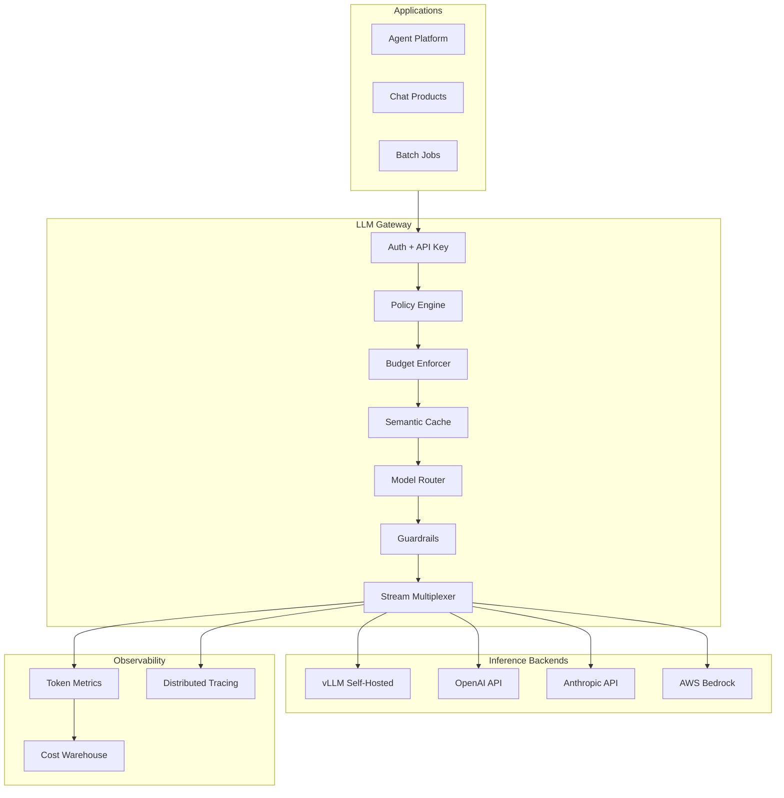
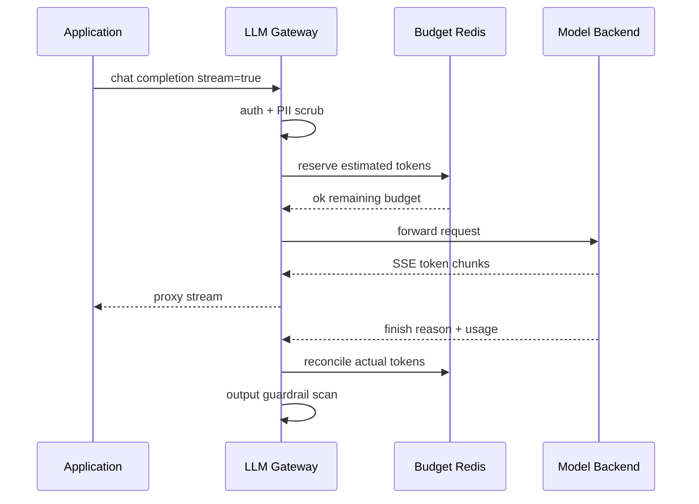
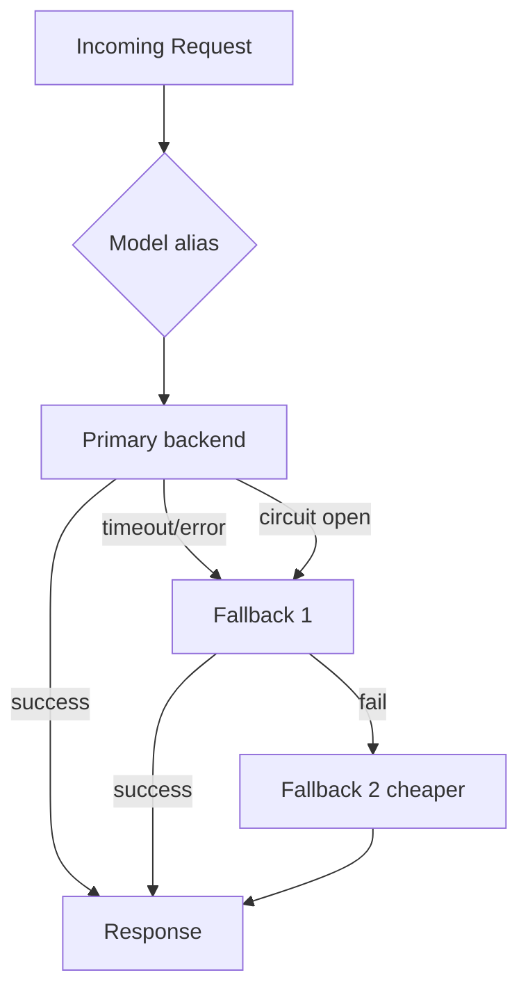

# LLM Gateway

## 1. Executive Summary

An **LLM gateway** is the enterprise control plane between applications and **large language model (LLM)** inference—whether self-hosted GPUs or third-party APIs (OpenAI, Anthropic, Bedrock). It centralizes **authentication**, **rate limiting and quotas**, **routing** across models and providers, **fallback chains**, **prompt/response policy** (PII redaction, content filters), **cost attribution**, and **observability** (tokens, latency, errors per tenant).

Unlike a generic API gateway, LLM gateways understand **token semantics**: input tokens, output tokens, streaming Server-Sent Events (SSE), **time-to-first-token (TTFT)**, and **context window** limits. Principal architects design gateways to prevent **unbounded spend**, **noisy neighbor GPU contention**, and **compliance violations** while preserving developer ergonomics via OpenAI-compatible APIs.

This chapter designs a gateway for 500+ consuming applications, 2K requests/sec peak, multi-vendor routing, and $2M/month inference budget with per-team chargeback—complementing [LLM Serving and Model Gateways](/docs/ai-distributed-systems/llm-serving-and-model-gateways) which focuses on GPU runtime internals.

## 2. Why This Topic Matters

Enterprises cannot allow every team to embed API keys and call models directly:

- **Cost explosions** from runaway agent loops.
- **Data leakage** when prompts contain PII sent to external vendors.
- **Inconsistent model versions** break production behavior silently.
- **No SLO attribution** when latency degrades across shared inference.

2025–2026 principal interviews expect gateway narratives: routing cheap vs expensive models, circuit breaking slow providers, **semantic caching**, and budget enforcement. Follow-ups on streaming timeout handling and eval-gated model promotion separate platform thinking from "wrap OpenAI SDK."

## 3. Problems Being Solved

| Problem | Gateway capability |
|---------|---------------------|
| **Sprawling API keys** | Central credentials; vault-backed |
| **Uncontrolled token spend** | Per-tenant budgets and hard caps |
| **Vendor lock-in** | Unified OpenAI-compatible facade |
| **Model version drift** | Registry with pinned defaults |
| **Compliance** | PII scrub; residency routing |
| **Latency SLO** | Priority queues; fallback models |
| **Observability gap** | Token and cost metrics per app |
| **Prompt injection at edge** | Input policy before inference |

## 4. Assumptions and System Model

### Functional

- `POST /v1/chat/completions` OpenAI-compatible (streaming supported).
- Route by model alias: `gpt-enterprise` → primary + fallback chain.
- Enforce: 100K tokens/day per app default; burst 50 RPS.
- Log prompt hash + metadata (not raw PII) for audit.
- Admin: register models, providers, pricing tables, policies.

### Non-functional

- Gateway overhead p99 &lt; 20 ms (excluding model latency).
- Streaming connections: 100K concurrent SSE supported via connection pooling.
- Availability 99.95% gateway; model backends vary.
- Budget check &lt; 5 ms p99 (Redis counters).

| Assumption | Implication |
|------------|-------------|
| **Models are replaceable** | Abstraction via aliases |
| **Streaming is default UX** | Long-lived connections; idle timeouts |
| **Token counting is approximate pre-call** | Reserve budget; reconcile post-response |
| **Some workloads need data residency** | EU prompts → EU endpoint only |
| **Eval quality gates promotion** | Canary model weights in router |

## 5. Essential Terminology

| Term | Definition |
|------|------------|
| **TTFT** | Time to first token in streaming response |
| **TPOT** | Time per output token |
| **Token budget** | Max tokens per period per tenant |
| **Model alias** | Logical name mapping to provider/model/version |
| **Fallback chain** | Ordered list when primary fails or slow |
| **Semantic cache** | Return similar prior prompt response |
| **Guardrail** | Policy filter on input/output |
| **SSE** | Server-Sent Events for stream chunks |
| **Prompt injection** | Adversarial input manipulating model behavior |
| **Router** | Component selecting backend per request |
| **Chargeback** | Cost allocation to consuming team |
| **Eval gate** | Quality benchmark before model rollout |

## 6. Core Mechanism

### 6.1 Gateway architecture



*Figure 1: LLM gateway—policy, budget, routing, and guardrails before heterogeneous inference backends.*

### 6.2 Request flow with budget



*Figure 2: Token budget reservation before inference; reconciliation after completion.*

### 6.3 Routing and fallback



*Figure 3: Fallback chain with circuit breaker skipping unhealthy primary.*

### 6.4 Deep dives

**Budget enforcement:**

1. Estimate `input_tokens + max_output` from tokenizer.
2. Atomic decrement in Redis `budget:{tenant}:{day}`.
3. If insufficient → `429` with `retry_after` next budget window.
4. Post-response: adjust delta if actual &lt; estimate.

**Semantic cache (optional):**

- Embed prompt; cosine similarity &gt; 0.95 → return cached response.
- TTL and tenant isolation mandatory; never cross-tenant cache hits.

**Streaming reliability:**

- Idle timeout 60 s without token → cancel upstream.
- Client disconnect → abort provider stream to save cost.
- Buffer first N tokens for output guardrail before release (latency tradeoff).

**Multi-vendor normalization:**

- Translate OpenAI request/response to Anthropic/Bedrock schemas.
- Preserve `usage` block for metering consistency.

## 7. Step-by-Step Walkthrough

### 7.1 Standard chat request

1. App sends `model: gpt-enterprise`, 2K input tokens estimated.
2. Gateway authenticates API key → `team:payments`.
3. PII scanner redacts credit card pattern → placeholder.
4. Budget OK; router selects self-hosted vLLM primary.
5. Streams tokens to client; logs 2.1K input, 450 output tokens.
6. Cost event: $0.03 attributed to payments team.

### 7.2 Primary provider outage

1. vLLM returns 503; circuit breaker increments failure count.
2. Router fails over to OpenAI `gpt-4o-mini` per chain.
3. Response header `X-LLM-Routed-To: openai-fallback` for debugging.
4. Incident channel notified if fallback &gt; 5 min.

### 7.3 Budget exhaustion

1. Marketing batch job consumes daily 10M token quota by noon.
2. Subsequent requests get `429 insufficient_budget`.
3. FinOps dashboard shows spike; team requests temporary increase via ticket.

### 7.4 Model canary promotion

1. New `llama-70b-v2` at 5% traffic weight in router.
2. Eval pipeline compares quality scores vs v1.
3. After 7 days green metrics, ADR promotes to 100%.

### 7.5 Multi-region inference routing

1. EU customer data flagged `region=eu` in request metadata.
2. Policy engine routes only to EU-hosted model endpoint.
3. Attempt to override model alias to US provider → policy deny with audit log.
4. Legal review confirms deny message does not leak provider names to client.
5. **Principal:** residency is policy-as-code in gateway—not documentation-only.

## 7A. Platform Integration Matrix

| Upstream | Downstream | Header / contract |
|----------|------------|---------------------|
| Agent platform | LLM gateway | `X-Agent-Run-Id`, session budget |
| API platform | LLM gateway | OAuth token, tenant quota |
| FinOps warehouse | Metering events | `tokens_in`, `tokens_out`, `model` |
| Eval pipeline | Model router | Canary weight, promotion gate |

## 8. Invariants and Guarantees

| Property | Type | Mechanism |
|----------|------|-----------|
| **Tenant budget not exceeded** | Safety | Atomic reserve + reconcile |
| **No cross-tenant cache** | Safety | Namespace in cache key |
| **Auth before inference** | Safety | API key / JWT |
| **Audit metadata logged** | Safety | Hash + tenant + model |
| **PII policy applied** | Safety | Input/output scanners |
| **Streaming progress** | Liveness | Heartbeat chunks; timeouts |

## 9. Failure Scenarios

| Scenario | Mitigation |
|----------|------------|
| Provider slow tail | Timeout; fallback; 504 with request ID |
| Token count mismatch | Reconcile budget; alert if systematic |
| SSE client hang | Idle timeout; connection limit per IP |
| Redis budget down | Fail closed for new requests; document |
| Guardrail false positive | Shadow mode; human override path |
| Semantic cache stale | Short TTL; version in cache key |
| Runaway agent loop | Per-session token cap; gateway kill API |
| Key leak | Revoke; audit usage by key |

## 10. Performance Characteristics

```
2K RPS gateway (non-streaming equivalent)
Streaming: 50K concurrent SSE connections
Gateway CPU: mostly JSON proxy + policy—scale horizontally
Budget check: Redis INCRBY &lt; 2 ms p99
Tokenizer estimate: local tiktoken &lt; 5 ms for 8K context
Provider latency dominates: TTFT 200ms-2s depending on model
Semantic cache hit: skip provider—sub-50ms response
```

## 11. Scalability Limits

| Limit | Mitigation |
|-------|------------|
| SSE connection memory | Dedicated stream proxy tier |
| Redis hot tenant key | Shard budget keys |
| Tokenizer CPU | Cache counts per prompt hash |
| Provider rate limits | Queue + backoff; multi-account pool |
| Trace volume | Sample spans; tail-based sampling |
| Policy eval latency | Compile policies; skip for trusted internal |

## 12. Operational Considerations

- SLO: gateway 99.95%; publish model backend SLOs separately.
- Dashboards: tokens/sec, cost/day per team, fallback rate, TTFT p99.
- Runbooks: provider key rotation, emergency global throttle, model rollback.
- FinOps weekly review of top spenders.
- On-call: P1 if all fallbacks exhausted; P2 elevated 429 rate.

## 13. Security Considerations

- API keys in [Secrets Management Platform](/docs/system-design/secrets-management-platform).
- Provider keys never exposed to client applications.
- Data residency routing: `region=eu` constraint in policy.
- Prompt logging: hash + opt-in full capture for debugging with DLP.
- Output filtering for secrets/code leakage patterns.
- Rate limit per key against credential stuffing on gateway auth.

## 14. Cost Considerations

Gateway infra is small vs inference spend. Semantic cache ROI depends on repeated queries—support bots benefit; unique codegen less. Fallback to expensive cloud API during GPU outage can 10× cost—monitor fallback duration. Chargeback drives behavioral change more than technical limits alone.

## 15. Production Implementations

| System | Pattern |
|--------|---------|
| **LiteLLM** | Multi-provider proxy |
| **Portkey / Helicone** | Observability + routing SaaS |
| **Custom Envoy + plugins** | Hyperscaler scale |
| **Azure API Management** | Enterprise policy + AI |
| **Internal gateways** | Stripe, Shopify-class patterns |

## 16. Alternatives and Tradeoffs

| Decision | Tradeoff |
|----------|----------|
| Self-host vs SaaS gateway | Control vs velocity |
| Hard budget cap vs soft alert | UX vs finance protection |
| Semantic cache on/off | Cost savings vs staleness risk |
| Sync output guardrail | Safety vs TTFT |
| Single vs multi-provider | Resilience vs integration cost |
| OpenAI-compatible vs native APIs | Portability vs feature access |

## 17. Common Misconceptions

| Misconception | Reality |
|---------------|---------|
| "Gateway adds too much latency" | &lt;20 ms vs seconds model time |
| "One model fits all" | Route by task cost/quality |
| "Token count from API is optional" | Billing and budgets require it |
| "Stream = fire and forget" | Must handle disconnect and cancel upstream |
| "PII redaction is LLM job" | Edge scrub before external vendor |
| "Eval is research only" | Production promotion gate |

## 18. Principal Architect Perspective

- **Gateway is finance and compliance control**, not just proxy.
- **Model aliases decouple apps from provider churn.**
- **Budget errors are product decisions**—429 messaging matters.
- **Instrument TTFT and tokens**, not just HTTP 200.
- **Agent workloads need session-level caps**—see [Agentic AI Platform Design](/docs/system-design/agentic-ai-platform-design).
- Partner with FinOps on chargeback model.

## 19. Architecture Review Exercise

**Scenario:** Teams embed OpenAI keys in mobile apps; no metering.

**Review:** Key extraction risk; unbounded cost; no residency control. Mandate gateway with app attestation or server-side-only calls; per-team budgets.

## 20. Whiteboard Explanation

"Apps call our OpenAI-compatible gateway with team API keys. We authenticate, scrub PII, check daily token budget in Redis, optionally hit semantic cache, then route through a model alias to self-hosted vLLM or cloud fallback chain. We stream SSE back while counting tokens. Output passes guardrails. Every request emits trace spans and cost events for chargeback. Model promotions go through eval canary. Provider keys live in vault—apps never see them."

## 21. Interview Questions

1. **Design LLM gateway for enterprise.** — *Signals:* auth, budget, routing, observability. *Red flags:* direct API keys.
2. **Token budget enforcement?** — *Signals:* reserve, reconcile, 429. *Follow-up:* estimate error.
3. **Streaming timeout handling?** — *Signals:* idle cancel, client disconnect.
4. **Multi-provider fallback?** — *Signals:* circuit breaker, alias. *Red flags:* infinite retry.
5. **PII before external API?** — *Signals:* scrub, residency routing.
6. **Semantic cache risks?** — *Signals:* tenant isolation, TTL. *Red flags:* global cache.
7. **Cost attribution model?** — *Signals:* input+output tokens, model price table.
8. **OpenAI-compatible why?** — *Signals:* SDK portability, vendor swap.
9. **Agent runaway spend?** — *Signals:* session cap, step budget.
10. **Model canary rollout?** — *Signals:* traffic weight, eval gate.
11. **TTFT vs total latency SLO?** — *Signals:* streaming UX metrics.
12. **Gateway vs GPU serving layer boundary?** — *Signals:* policy vs batching inference.

## 22. Interview Follow-Ups

1. **Budget estimate overshoots systematically.** — Tune tokenizer; post-hoc true-up; lower max_tokens default.
2. **EU customer data on US model.** — Hard policy deny; regional router.
3. **Provider changes token pricing mid-month.** — Versioned price table; FinOps notification.

## 23. Strong Answer Example

**Q:** How prevent one agent from spending entire org budget?

**Outline:** Per-application daily token cap + per-session cap for agent runtime IDs passed in header. Gateway tracks `session:{id}` cumulative tokens; hard stop at 50K per session. Rate limit RPS per key. Alerts at 80% budget. Kill switch API for security. Agent platform enforces max steps—defense in depth.

## 24. Weak Answer Example

**Weak:** "Use LiteLLM and set OpenAI key in env."

**Red flags:** No budgets, no PII policy, no chargeback, no fallback SLO, keys in env.

## 25. Hands-On Exercise

1. Deploy LiteLLM or custom FastAPI proxy with OpenAI schema.
2. Add Redis token budget per API key.
3. Implement fallback from local mock to secondary provider on 503.
4. Stream SSE with client disconnect cancellation test.
5. **Extension:** Semantic cache with embedding similarity threshold.
6. **Extension:** OpenTelemetry spans with token usage attributes.

## 26. Knowledge Check

1. TTFT definition and why it matters?
2. Token budget reserve vs reconcile?
3. When circuit breaker opens on primary?
4. SSE idle timeout purpose?
5. Model alias benefit?
6. Cross-tenant cache forbidden why?
7. Output guardrail latency tradeoff?
8. Chargeback data sources?
9. PKCE irrelevant here—what auth for gateway?
10. Semantic cache key components?
11. Fallback cost risk?
12. Eval gate before promotion?

## 26A. Extended Knowledge Check

13. How cancel upstream provider stream on client disconnect?
14. What headers pass agent session budget to gateway?
15. When is semantic cache ROI positive vs negative?
16. How document fallback cost multiplier for FinOps?
17. EU residency policy deny—what audit log fields?
18. TTFT vs TPOT—which SLO for chat UX?

## 27. Flashcards

| Front | Back |
|-------|------|
| TTFT | Time to first streamed token |
| Token budget | Per-tenant usage cap |
| Model alias | Logical to physical model map |
| Fallback chain | Backup providers on failure |
| Semantic cache | Similar prompt cache hit |
| SSE | Server-Sent Events streaming |
| Guardrail | Input/output policy filter |
| Chargeback | Cost allocation per team |
| Circuit breaker | Skip failing backend |
| Reserve/reconcile | Budget estimate then adjust |
| TPOT | Inter-token latency |
| Eval gate | Quality check before rollout |

## 28. Cheat Sheet

```
API: OpenAI-compatible /v1/chat/completions
AUTH: per-team API key; vault-backed provider keys
BUDGET: Redis daily tokens; reserve + reconcile
ROUTING: alias → primary + fallback + circuit breaker
POLICY: PII scrub; residency; rate limit RPS
STREAM: SSE proxy; idle timeout; cancel on disconnect
OBSERVE: tokens, TTFT, cost per team; distributed trace
CACHE: semantic optional; tenant-scoped TTL
PROMOTION: canary weight + eval scores
FAILURE: 429 budget; 504 timeout; fallback header
```

## 28A. Principal Interview Deep Dive

### Token economics model

Principal architects build FinOps spreadsheet (illustrative—verify vendor pricing):

| Model tier | Input $/1M tokens | Output $/1M tokens | Use case |
|------------|-------------------|---------------------|----------|
| Small local | ~$0 (infra amortized) | ~$0 | Classification, routing |
| Cloud mini | vendor-specific | vendor-specific | Default chat |
| Cloud large | higher | higher | Complex reasoning |

Gateway value: **route 70% of requests to small model** with quality eval gate → material savings at scale. Without gateway, every team picks largest model by default.

### Streaming SLO decomposition

| Metric | User perception | Gateway lever |
|--------|-----------------|---------------|
| TTFT | "Is it working?" | Warm pools; regional routing |
| TPOT | "Feels fluent" | Model selection; batch on GPU side |
| Total time | Task completion | max_tokens; timeout cancel |

Alert separately on TTFT p99 vs total duration—different root causes.

### Provider fallback decision matrix

| Condition | Action |
|-----------|--------|
| Primary 503 | Fallback immediately |
| Primary slow (TTFT &gt; 5s) | Circuit half-open; try fallback |
| Primary rate limited 429 | Backoff; secondary account pool |
| Quality eval fail on fallback | Block promotion; alert ML platform |
| All providers down | Queue or 503 with retry-after |

Document **cost multiplier** when fallback is 10× price—FinOps alert if fallback &gt; 30 minutes/month.

### Agent session budget integration

Pass headers from [Agentic AI Platform Design](/docs/system-design/agentic-ai-platform-design):

```
X-Agent-Run-Id: uuid
X-Agent-Step: 7
X-Session-Token-Budget: 50000
```

Gateway enforces cumulative tokens per `run_id`—defense in depth beyond per-API-key daily budget.

### Regulatory routing example

Policy engine rule (conceptual):

```
if request.metadata.region == "EU" and model.provider not in ["eu-west-hosted"]:
  deny with "data_residency_violation"
```

Principal owns policy schema with legal—not ad hoc per-team checks.

## 29. Related Concepts

- [LLM Serving and Model Gateways](/docs/ai-distributed-systems/llm-serving-and-model-gateways)
- [Agentic AI Platform Design](/docs/system-design/agentic-ai-platform-design)
- [API Platform](/docs/system-design/api-platform)
- [Distributed Rate Limiter](/docs/system-design/distributed-rate-limiter)
- [Observability Fundamentals](/docs/observability/observability-fundamentals)
- [Distributed Tracing](/docs/observability/distributed-tracing)
- [Cloud Cost Optimization](/docs/cost-and-finops/cloud-cost-optimization)

## 19A. Extended Review Scenario

**Scenario B:** Data science team routes all prompts directly to OpenAI with shared API key in notebook.

**Review:** Compliance violation—no PII scrub, no residency control, no cost attribution, key in shared notebook. Mandate LLM gateway with per-team keys, budget caps, and audit metadata. Provide Jupyter kernel plugin calling gateway OpenAI-compatible endpoint. Block outbound `api.openai.com` at corporate egress except gateway IPs. Executive memo on inference spend risk if key leaked to public GitHub.

## 23A. Additional Strong Answer

**Q:** How handle provider returning 200 stream then mid-stream error?

**Outline:** Gateway proxies SSE chunks; on provider error frame or connection reset, emit terminal SSE event with `error` object and `request_id`. Client SDK must handle partial output—idempotent downstream writes if user saves incomplete generation. Reconcile token budget with partial `usage` if provider sends it; else estimate from tokens streamed. Log trace span status ERROR with `provider_error_code`. Do not retry full generation automatically for paid user without explicit user action—duplicate content risk. Circuit breaker if provider error rate &gt;5% over 5 minutes.

## 28B. Extended BOE Walkthrough (Interview Script)

**Interviewer:** "Control LLM spend for 200 internal apps."

**Strong candidate:**

"Don't let 200 apps hold provider keys—central [LLM Gateway](/docs/system-design/llm-gateway) with team API keys.

Budget: Redis daily token cap per key; reserve estimated tokens pre-call; reconcile post-response. Hard 429 at exhaustion—FinOps dashboard for 80% alerts.

Routing: model aliases with cheap model for classification, expensive for generation. Fallback chain with circuit breaker—alert if fallback &gt;30 min (cost spike).

PII scrub before external vendor; EU residency policy deny rule.

Streaming: cancel upstream on client disconnect; idle timeout 60s.

Observability: trace per request with `llm.input_tokens`, `llm.output_tokens` for chargeback.

Agent apps pass `X-Agent-Run-Id` for per-run caps—defense against loops.

Semantic cache optional for support bots—tenant-isolated TTL."

## 30. References

- OpenAI API reference — de facto compatibility standard (vendor documentation).
- LiteLLM documentation — multi-provider proxy patterns (implementation).
- NIST AI Risk Management Framework — governance context (guidance).
- vLLM paper (PagedAttention) — self-hosted serving background.
- OWASP LLM Top 10 — prompt injection and data leakage risks.

**Distinction:** Provider pricing and rate limits are vendor-specific and change frequently—verify operationally; token counting algorithms may differ slightly between tokenizer and provider billing.

### 30A. Further reading paths

Deep dive [LLM Serving and Model Gateways](/docs/ai-distributed-systems/llm-serving-and-model-gateways) for GPU runtime vs gateway boundary, [Agentic AI Platform Design](/docs/system-design/agentic-ai-platform-design) for per-run token caps, and [Cloud Cost Optimization](/docs/cost-and-finops/cloud-cost-optimization) for chargeback models. Read OWASP LLM Top 10 before any production gateway design review.

**Lab:** Implement tail-aware budget reconcile when actual tokens differ from estimate by &gt;20%. **Interview drill:** explain streaming cancel-on-client-disconnect—why it saves cost, how to avoid leaking goroutines/connections, and idle timeout tuning tradeoffs with long-thinking models.
