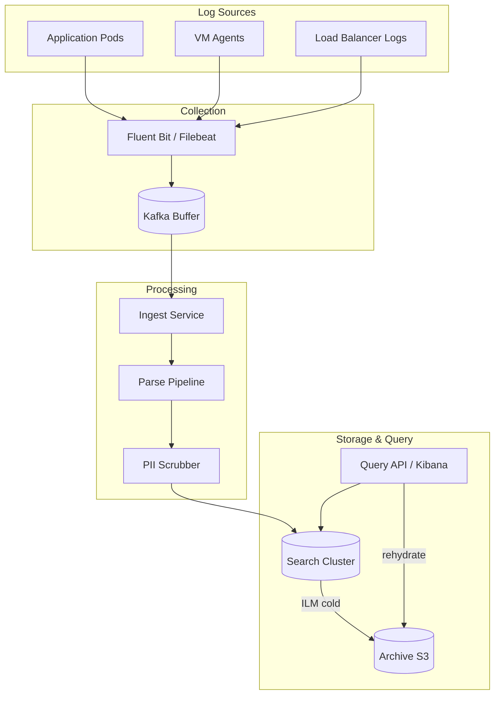
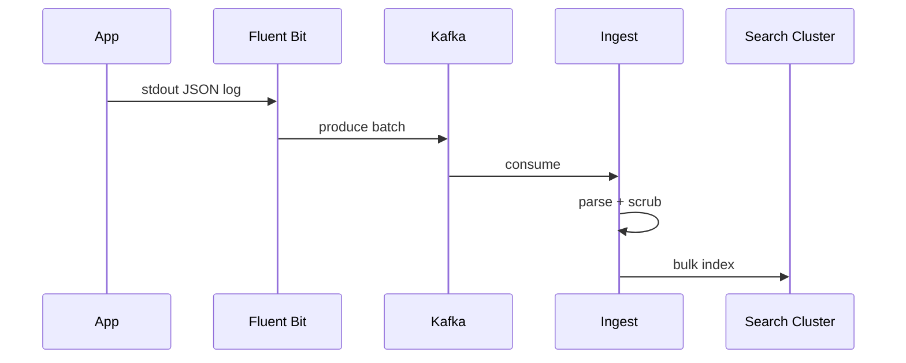

# Logging Platform

## 1. Executive Summary

A **logging platform** collects, indexes, stores, and queries semi-structured log events from distributed services at terabytes per day scale. Principal-level design covers **ingest pipelines**, **indexing strategies**, **hot/warm/cold tiering**, **schema-on-read vs schema-on-write**, **sampling and filtering**, and **compliance retention** with cost control.

This chapter designs an ELK/Splunk-class platform ingesting 5 TB/day with search p99 under 5 s for common filters and 30-day hot retention. Structured logging, partition by time, and explicit behavior during index hotspot incidents are core interview topics.

## 2. Why This Topic Matters

Logs remain the primary debugging artifact despite metrics and traces. Architects must explain:

- **Centralized vs sidecar** collection.
- **Index design**—what to index vs store only.
- **Cardinality** in log fields (similar to metrics).
- **Cost** of full-text index on everything.
- **PII** and compliance (GDPR delete).

Poor logging design causes runaway storage bills, slow incident response, and compliance violations. Review [Observability Fundamentals](/docs/observability/observability-fundamentals) and [Metrics Platform](/docs/system-design/metrics-platform).

## 3. Problems Being Solved

| Problem | Solution |
|---------|----------|
| **Distributed log collection** | Agents + forwarders |
| **High ingest volume** | Buffered pipelines; Kafka |
| **Fast search** | Inverted index; time partitioning |
| **Retention policies** | ILM hot/warm/cold/delete |
| **Structured queries** | JSON parsing; field mapping |
| **Security / compliance** | RBAC; audit; PII scrubbing |
| **Cost control** | Sampling; tiered storage |
| **Correlation** | trace_id injection |

## 4. Assumptions and System Model

**Functional:**

- Ingest JSON or text logs with metadata (service, env, level, trace_id).
- Search: full-text + field filters; time range required.
- Dashboards and saved searches.
- Export to S3 for archive; rehydrate for investigations.
- Per-tenant isolation in SaaS mode.

**Non-functional:**

- Ingest 5 TB/day (50K events/sec average).
- Hot search retention 30 days; archive 1 year.
- Search p99 &lt; 5 s for indexed fields over 24h range.
- Ingest availability 99.9%.
- At-least-once delivery acceptable with dedup optional.

| Assumption | Implication |
|------------|-------------|
| **Time-range queries dominant** | Partition indexes by day |
| **Most logs never queried** | Cold tier cheap storage |
| **Structured fields key** | Parse at ingest |
| **Full-text expensive** | Limit analyzed fields |
| **Compliance delete** | Document IDs for erasure |

## 5. Essential Terminology

| Term | Definition |
|------|------------|
| **Log shipper** | Agent forwarding logs (Fluent Bit, Filebeat) |
| **Ingest pipeline** | Parse, enrich, drop processors |
| **Index** | Searchable collection (e.g., logs-2026.07.25) |
| **Shard** | Lucene sub-index partition |
| **ILM** | Index Lifecycle Management |
| **Hot/warm/cold** | Storage tiers by access frequency |
| **Inverted index** | Term → document mapping |
| **Schema-on-read** | Parse at query time |
| **Bloated index** | Too many analyzed fields |
| **Trace correlation** | trace_id links logs to traces |
| **Sampling** | Store subset at ingest |

## 6. Core Mechanism

### 6.1 Architecture



*Figure 1: Agents buffer to Kafka; ingest pipeline parses and indexes; ILM moves cold data to object store.*

### 6.2 APIs

```
POST /_bulk  (Elasticsearch bulk index)

GET /logs-*/_search
{ "query": { "bool": { "filter": [
  { "range": { "@timestamp": { "gte": "now-1h" }}},
  { "term": { "service": "payment" }},
  { "match": { "message": "timeout" }}
]}}}

POST /_ilm/policy/logs-policy
DELETE /_delete_by_query  (GDPR erasure)
```

### 6.3 Data Model

**Log document:**

```json
{
  "@timestamp": "2026-07-25T10:00:00Z",
  "level": "ERROR",
  "service": "payment",
  "env": "prod",
  "trace_id": "abc123",
  "message": "charge failed",
  "user_id_hash": "sha256...",
  "duration_ms": 450
}
```

**Index naming:** `logs-{env}-{yyyy.MM.dd}` — enables time-based ILM.

**Mapping:**

- Keyword: `service`, `level`, `trace_id` (exact match, aggregations).
- Text: `message` (full-text, optionally disabled subfields).
- Numeric: `duration_ms` (range queries).

### 6.4 Deep Dives

**Ingest pipeline:**

1. Kafka consumer batch (1000 docs or 5 MB).
2. Grok/JSON parse; drop DEBUG in prod if policy.
3. PII scrubber masks email, credit card patterns.
4. Enrich with K8s metadata (pod, namespace).
5. Bulk index to today's index shard.

**Index and shard sizing:**

- Target shard 20–50 GB.
- 5 TB/day ÷ 50 GB ≈ 100 shards/day—use index-per-day not per-hour unless extreme.
- Forcemerge warm indices; read-only after day closes.



*Figure 2: Buffered ingest decouples burst logging from index pressure.*

**Hot/warm/cold ILM:**

| Phase | Age | Storage | Actions |
|-------|-----|---------|---------|
| Hot | 0–7d | SSD | Active writes |
| Warm | 7–30d | HDD | Shrink replicas |
| Cold | 30–365d | S3 snapshot | Searchable snapshot |
| Delete | &gt;365d | — | Compliance |


*Figure 3: Index lifecycle reduces cost as logs age.*

**Query optimization:**

- Always filter `@timestamp` first (prunes shards).
- Use `keyword` filters before `match` on message.
- Saved searches with index pattern `logs-prod-*` not `*`.

**Sampling for high-volume debug:**

- Head-based: keep 10% of DEBUG logs.
- Tail-based: keep all ERROR; sample INFO.
- Never sample security audit logs.

## 7. Step-by-Step Walkthrough

### 7.1 Incident search

1. On-call filters `service:payment AND level:ERROR` last 1h.
2. Query hits 3 daily indices; 200 ms response.
3. Click trace_id → jump to tracing platform.

### 7.2 Ingest spike

1. Buggy deploy logs 100× normal volume.
2. Kafka absorbs burst; consumer lag grows.
3. Autoscale ingest workers; lag clears in 10 min.
4. Post-incident: rate limit log line per request.

### 7.3 GDPR delete

1. User requests erasure.
2. `_delete_by_query` on `user_id_hash` across indices.
3. Force merge; verify zero hits; audit log deletion job.

### 7.5 Security incident log investigation

1. SOC searches `event:auth_failure AND user_id_hash:abc` last 7d.
2. Query spans 7 daily indices—shard pruning via time filter.
3. Results exported to case ticket; chain of custody documented.
4. Original logs immutable in WORM audit cluster if regulated.

### 7.6 Log sampling for high-volume debug

1. Service logs 50K DEBUG lines/sec per pod—unsustainable.
2. Head sample 1% DEBUG; 100% WARN+.
3. Dynamic upsample: if ERROR rate &gt; threshold, capture 100% DEBUG for 5 min window.
4. Balances cost vs debuggability during incidents.

## 7B. OpenSearch Cluster Sizing Heuristic

```
Daily ingest:     5 TB
Retention hot:    30 days → 150 TB raw
Replica factor:   1 → 300 TB disk (with overhead)
Shard target:     40 GB → 3750 shards total → ~125 shards/day
Nodes:            30 data nodes × 12 TB NVMe with headroom
```

Validate with vendor sizing calculator—heuristic for interview whiteboard only.

## 10A. Query DSL Performance Patterns

**Fast:**

```json
{ "bool": { "filter": [
  { "range": { "@timestamp": { "gte": "now-1h" }}},
  { "term": { "service.keyword": "payment" }},
  { "term": { "level.keyword": "ERROR" }}
]}}
```

**Slow:** `wildcard` on `message`, no time filter, `script` filters on hot path.

Train developers via slow query log review weekly.


| Phase | Key decisions |
|-------|---------------|
| Requirements | 5TB/day, 30d hot, field search |
| Scale | Kafka buffer; daily indices |
| APIs | bulk index; search DSL |
| Data | JSON mapping; ILM policy |
| Deep dives | PII scrub; tiering |

## 8. Invariants and Guarantees

| Property | Guarantee |
|----------|-----------|
| **At-least-once ingest** | Possible duplicates; idempotent doc IDs optional |
| **Time ordering** | Per-shard approximate; use timestamp field |
| **Retention** | ILM deletes after policy |
| **RBAC** | Index-level access per team |
| **Immutability** | Logs append-only; corrections via new events |

## 9. Failure Scenarios

| Scenario | Mitigation |
|----------|------------|
| **Search cluster red** | Replica shards; cross-AZ |
| **Kafka lag unbounded** | Scale consumers; drop DEBUG emergency |
| **Mapping explosion** | Limit dynamic fields; reject |
| **Hot shard** | Rollover alias; split index |
| **Disk full** | ILM force; expand or delete |
| **PII leak in logs** | Scrub pipeline; block deploy |

## 10. Performance Characteristics

```
50K events/sec × 2 KB avg = 100 MB/sec ingest
5 TB/day raw; 30% index overhead ≈ 1.5 TB/day index hot
Query: filter on keyword + time → ms; full-text GB → seconds
Bulk batch 5–15 MB optimal for Elasticsearch
```

## 11. Scalability Limits

| Limit | Mitigation |
|-------|------------|
| Field cardinality | Limit dynamic mapping |
| Shard count explosion | Daily indices not hourly |
| Expensive aggregations | Precompute via metrics |
| Cross-cluster search | CCS or federated query |
| Log volume | Sampling; log level policy |

## 12. Operational Considerations

- Metrics: ingest rate, Kafka lag, JVM heap, query latency, disk %.
- Alerts: cluster red; lag &gt; 1h; failed bulk reject rate.
- Runbooks: emergency index close; increase refresh interval.
- Index template versioning in Git.

## 13. Security Considerations

- TLS ingest; mTLS for agents.
- RBAC: team A cannot query team B indices.
- PII scrubbing mandatory; secrets never logged (CI lint).
- Audit admin searches.
- Immutable audit log index separate from app logs.

## 14. Cost Considerations

Storage dominates—ILM to S3 saves 80% vs all-SSD. Reduce volume: structured logs, appropriate levels, sampling. Managed OpenSearch vs self-hosted ops tradeoff. Chargeback per GB ingested per team.

## 15. Production Implementations

| System | Notes |
|--------|-------|
| **Elasticsearch / OpenSearch** | Dominant OSS stack |
| **Splunk** | Enterprise leader; proprietary |
| **Loki** | Label-indexed; cheaper at scale for K8s |
| **Datadog Logs** | SaaS integrated |
| **Fluent Bit** | Lightweight shipper |

## 16. Alternatives and Tradeoffs

| Approach | Pros | Cons |
|----------|------|------|
| Full-text index (ES) | Flexible search | Expensive |
| Label-only (Loki) | Lower cost | Weak full-text |
| S3 + Athena | Cheapest archive | Slow interactive |
| Schema-on-read | Flexible ingest | Slow queries |
| Kafka only | Durable buffer | Not searchable alone |
| stdout only | Simple | No central search |

## 16A. Structured Logging Standard (Org-Wide)

Required fields on every production log line:

```json
{
  "@timestamp": "ISO8601",
  "level": "INFO|WARN|ERROR",
  "service": "payment",
  "env": "prod",
  "trace_id": "hex",
  "span_id": "hex",
  "message": "human readable",
  "error": { "type": "", "stack": "" }
}
```

Optional: `user_id_hash`, `tenant_id`, `request_id`. Forbidden: raw email, PAN, password, OAuth tokens. Lint in CI with sample log fixture tests.

## 16B. Log Volume Reduction Levers

| Lever | Typical savings |
|-------|-----------------|
| INFO default vs DEBUG | 50–90% |
| Sample DEBUG 1% | Additional on remainder |
| Drop health-check logs at ingest | 5–15% |
| Aggregate access logs to metrics | 30–50% access log volume |

Principal sponsors quarterly log budget review with top 10 volume services—engineering managers accountable.

| "grep scale" | Need distributed index |
| "JSON any shape OK" | Mapping explosions hurt |
| "Logs replace metrics" | Different cost model |
| "Real-time means no buffer" | Kafka protects index |

## 18.1 eDiscovery and Legal Hold Workflow

Legal requests may require preserving logs matching complex queries across years of cold storage. Architecture provides: legal hold flag on index pattern preventing ILM delete; export API to WORM storage; chain-of-custody metadata on export job. Engineering does not interpret law—workflow hands forensic package to legal team with documented integrity hashes (SHA-256 of export manifest). Retention extension overrides default delete—monitor storage cost of holds quarterly.

## 18. Principal Architect Perspective

- **Logging standard** per org—required fields: trace_id, service, level.
- **Default log level INFO** in prod; DEBUG gated.
- **PII policy** in code review—not just pipeline afterthought.
- **ILM day-one**—retrofit is painful.
- **Link logs to metrics and traces**—observability triad.

## 19. Architecture Review Exercise

**Scenario:** Single index `logs-all` 500 shards 2 TB; queries timeout.

**Review:** Daily indices; reduce shards; ILM; mandatory time filter in UI.

## 20. Whiteboard Explanation

"Apps log structured JSON to stdout; Fluent Bit ships to Kafka for buffering. Ingest workers parse, scrub PII, enrich metadata, and bulk index into daily time-partitioned indices. Keyword fields indexed for filters; message full-text with care. ILM rolls hot SSD indices to warm HDD then S3 snapshots. Queries always time-bound; trace_id links to tracing. RBAC per team index pattern. Sampling and log-level policies control volume."

## 21. Interview Questions

1. **Design logging for 5 TB/day.** — *Signals:* Kafka, daily indices, ILM. *Red flags:* single DB.
2. **Elasticsearch vs Loki?** — *Signals:* full-text vs label-only cost.
3. **Index design?** — *Signals:* daily partition; keyword vs text.
4. **Handle ingest spike?** — *Signals:* Kafka buffer; scale consumers.
5. **PII in logs?** — *Signals:* scrub pipeline; hash user IDs.
6. **GDPR delete?** — *Signals:* delete_by_query; audit.
7. **Shard sizing?** — *Signals:* 20–50 GB target.
8. **Slow queries?** — *Signals:* time filter; keyword first.
9. **At-least-once duplicates?** — *Signals:* doc ID dedup optional.
10. **Cold archive search?** — *Signals:* searchable snapshot.
11. **Correlation with traces?** — *Signals:* trace_id field.
12. **Cost reduction?** — *Signals:* sampling, ILM, log level.
13. **Mapping explosion?** — *Signals:* disable dynamic; limit fields.
14. **Security audit logs?** — *Signals:* separate index; no sampling.

## 21B. Extended Interview Question Deep Dives

**Q15 (Principal):** GDPR erasure request across 400 daily indices—SLA 30 days.

*Strong signals:* `_delete_by_query` with `user_id_hash`; track job ID; verify zero hits; legal hold exception path; audit deletion certificate. *Cost:* expensive search—maintain secondary index on `user_id_hash` if frequent.

**Q16 (Principal):** Developer wants raw TCP syslog from 10K legacy devices.

*Strong signals:* Syslog gateway normalizing to JSON; Kafka buffer; rate limit per device; separate low-trust index with short retention. *Security:* unauthenticated syslog is spoofing risk—VPN or mTLS.

2. **Multi-region aggregation.** — Cross-cluster search latency.
3. **Log-based metrics (ELK aggregations).** — Prefer metrics platform instead.

## 23. Strong Answer Example

**Q:** How to design indices for 5 TB/day?

**Outline:** Daily indices `logs-prod-yyyy.MM.dd` with rollover at 50 GB if needed. Target 20–40 shards per index on adequate nodes. ILM: hot 7d SSD, warm 30d HDD, snapshot to S3 for 1y, then delete. Kafka buffers ingest; bulk 5 MB batches. Mandatory `@timestamp` and keyword `service` field. Close indices older than hot phase to writes.

## 24. Weak Answer Example

**Weak:** "SSH to each server and grep logs."

**Red flags:** No centralization, no scale, no retention, no compliance.

## 25. Hands-On Exercise

1. Deploy Fluent Bit → Elasticsearch with JSON parse.
2. Create ILM policy hot-warm-delete.
3. Benchmark query with vs without time filter.
4. Implement PII regex scrub in ingest pipeline.
5. **Extension:** Kafka lag alert and consumer autoscale rule.

## 25A. Extended Hands-On Lab

7. Restore searchable snapshot from S3; measure query latency vs hot index.
8. Run `_delete_by_query` dry-run mode; estimate affected docs before execute.
9. Inject mapping conflict; observe strict dynamic mapping rejection.
10. **Principal lab:** Define org JSON log schema with JSON Schema validation in CI.

## 25B. Production Readiness Review Questions

- Can ingest continue if search cluster yellow?
- Is PII scrubber tested with adversarial payloads?
- Are audit logs tamper-evident?
- What is max acceptable Kafka lag before dropping DEBUG at source?

Logging platform incidents overlap with security incidents—runbooks must cover both.

2. Keyword vs text mapping?
3. Three ILM phases?
4. Why Kafka before index?

## 27. Flashcards

| Front | Back |
|-------|------|
| ILM | Automated index lifecycle phases |
| Log shipper | Agent forwarding to central pipeline |
| Bulk API | Batch document indexing |
| Keyword field | Exact match and aggregations |
| Searchable snapshot | S3-backed cold index |
| Mapping | Schema defining field types |
| Kafka buffer | Decouples burst from index |
| PII scrubber | Removes sensitive data at ingest |
| trace_id | Correlates logs with traces |
| Forcemerge | Reduces segments in warm index |

## 28. Cheat Sheet

```
REQUIREMENTS: central search, 5TB/day, 30d hot, compliance
SCALE: Kafka buffer; daily indices; bulk ingest
APIs: bulk index; search DSL; ILM policy
DATA: JSON logs; keyword+text mapping
ARCH: agent → Kafka → pipeline → ES → S3
DEEP: ILM tiers; PII scrub; query optimization
RELIABILITY: replicas; at-least-once; lag monitoring
SECURITY: RBAC; audit index; no secrets in logs
OPS: disk %; kafka lag; mapping limits
```

## 17A. Failure Scenario Drill

Engineer sets `"index.mapping.total_fields.limit": 50000` to silence errors—mapping explodes from dynamic JSON keys; cluster yellow for weeks; search unusable. Mitigation: disable dynamic mapping prod; schema registry for log fields; reject unknown fields at ingest. **Mapping discipline** equals metrics cardinality discipline.

## 18.1 OpenSearch vs Loki Decision Matrix

| Requirement | Prefer |
|-------------|--------|
| Full-text message search | OpenSearch/ES |
| K8s label-only filter | Loki |
| 30d interactive + 1y archive | ES ILM + S3 |
| Cost &lt; $0.10/GB/day ingest | Loki or S3+Athena |

## 19A. Extended Review Scenario

**Scenario B:** Security team needs tamper-proof audit logs in same index as app DEBUG logs—attacker with app creds could delete audit entries if shared cluster admin.

**Review:** Separate cluster/account for audit; WORM bucket; break-glass access only.

## 21A. Additional Interview Questions

15. **Structured logging standard?** — *Signals:* required fields service, trace_id, level; JSON only. *Red flags:* printf debugging in prod.
16. **Rehydrate from S3 snapshot cost?** — *Signals:* minutes to hours; chargeback to investigating team.

## 28A. Principal Interview Deep Dive

### Ingest pipeline processor order

1. Parse JSON
2. Drop DEBUG (if policy)
3. PII scrub
4. Enrich k8s metadata
5. Route to index

Scrub before index—indexed PII is compliance failure even if later deleted.

### Query guardrails in UI

- Mandatory time range default 15m
- Reject wildcard leading `*search*` without filter
- Max result window 10K

### Cost attribution

Chargeback label `team` on every log line—FinOps visibility drives volume reduction more than ops nagging.

## 28B. Extended BOE Walkthrough

**Interviewer:** "5 TB/day logs, 30 day hot search."

**Strong candidate:**

"5 TB/day × 30 = 150 TB hot before ILM—plan shard count and node disk.

Kafka buffer mandatory—100 MB/sec sustained ingest.

Daily indices `logs-prod-yyyy.MM.dd`; 30 shards × 50 GB target.

ILM to S3 snapshot day 31; delete year 1.

PII scrub at ingest. Correlate trace_id to [Metrics Platform](/docs/system-design/metrics-platform).

Never grep production servers at this scale."

## 29. Related Concepts

- [Observability Fundamentals](/docs/observability/observability-fundamentals)
- [Metrics Platform](/docs/system-design/metrics-platform)
- [Kafka-like Event Platform](/docs/system-design/kafka-like-event-platform)
- [Apache Kafka](/docs/distributed-databases/apache-kafka)
- [Security Architecture Fundamentals](/docs/security/security-architecture-fundamentals)
- [System Design Methodology](/docs/system-design/system-design-methodology)

## 30. References

- Elasticsearch documentation — index lifecycle and mappings (official).
- Grafana Loki design doc — label-based logging alternative.
- Kleppmann, *DDIA* — batch and stream processing for logs.

**Distinction:** Elasticsearch architecture well-documented; exact shard counts are deployment-specific.

### 30A. Further Reading Paths

Ingest pipeline often fed by [Kafka-like Event Platform](/docs/system-design/kafka-like-event-platform). Security logs may require [Security Architecture Fundamentals](/docs/security/security-architecture-fundamentals) retention policies.

### 30B. Index Template Version Control

Store index templates in Git:

```json
{
  "index_patterns": ["logs-prod-*"],
  "settings": { "number_of_shards": 30, "index.lifecycle.name": "logs-policy" },
  "mappings": { "dynamic": "strict", "properties": { ... } }
}
```

CI applies template before deploy; prevents mapping drift across environments.

### 30D. Principal Architecture Review Checklist

- [ ] Kafka buffer between agents and index—no direct burst to search cluster
- [ ] Daily index pattern with ILM policy applied in all environments
- [ ] Dynamic mapping disabled or strict in production indices
- [ ] PII scrubbing in pipeline before index—spot-check weekly samples
- [ ] Mandatory time filter in search UI and API gateway
- [ ] Audit logs on separate cluster or WORM storage
- [ ] Slow query log reviewed; top 10 queries optimized monthly
- [ ] Ingest sampling policy documented for DEBUG volume

Logging at scale is an indexing and governance problem—volume reduction beats bigger cluster after ~2 TB/day for most orgs.

### 30F. Closing Principal Note

Logging remains the definitive artifact for "what exactly happened to request X?"—metrics tell you that error rate spiked; logs tell you which dependency timed out.

### 30G. OpenTelemetry Logs Bridge

OTel log signal export to same pipeline as app JSON enables trace-log correlation without custom instrumentation per framework. Standardize on OTel SDK where possible—reduces vendor lock-in to Elasticsearch vs Loki vs SaaS backend choice made independently of instrumentation.

### 30H. Dual-Write Anti-Pattern Warning

Teams sometimes log AND metric the same event at high volume—duplicate cost. Prefer metric for aggregates (error rate) and log for exemplar traces (single error detail). Exception: security audit events may require both immutable log and metric counter for alerting—document explicitly in security architecture review. On-call runbooks should link from Alertmanager annotations directly to saved Kibana/OpenSearch searches with prefilled time range and service filter.
