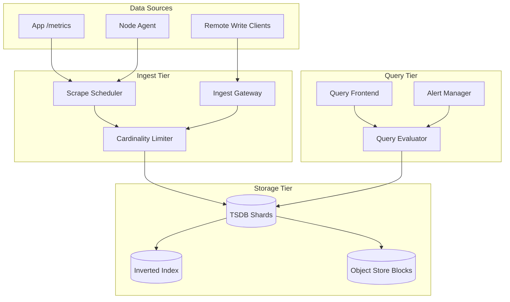
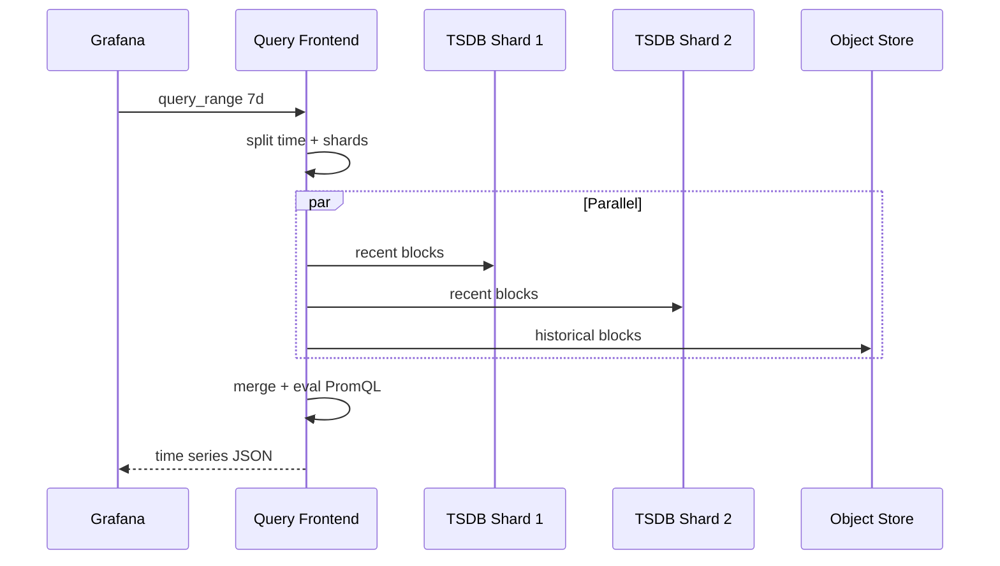
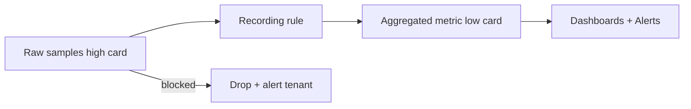

# Metrics Platform

## 1. Executive Summary

A **metrics platform** ingests, stores, queries, and alerts on time-series numerical measurements (counters, gauges, histograms) from applications and infrastructure at millions of samples per second. Principal-level design covers **data model** (labels and cardinality), **write path** (remote write, aggregation), **read path** (PromQL-style queries), **retention tiering**, **high availability**, and **multi-tenancy isolation**.

This chapter designs a Prometheus/Datadog-class system handling 50M+ active series and 10M+ samples/sec ingest with query p99 under 2 s for dashboard ranges. Cardinality control, downsampling, and explicit behavior during label explosion incidents are mandatory interview topics.

## 2. Why This Topic Matters

Metrics power SLOs, alerting, capacity planning, and incident response. Architects must explain:

- **Pull vs push** ingestion models.
- **Cardinality explosion** and why `user_id` labels destroy systems.
- **Histogram vs summary** for percentiles.
- **Retention and compaction** for cost.
- **Federation** and **remote write** for global views.

Bad metrics design causes on-call fatigue, storage bankruptcy, and blind spots during outages. Review [Observability Fundamentals](/docs/observability/observability-fundamentals) and [SLO/SLI/Error Budgets](/docs/reliability-and-resilience/slo-sli-error-budgets).

## 3. Problems Being Solved

| Problem | Solution |
|---------|----------|
| **High-volume ingest** | Sharded TSDB; batching |
| **Fast range queries** | Block storage; inverted index |
| **Alerting** | Rule evaluator on stream |
| **Cardinality control** | Limits; aggregation; dropping labels |
| **Long retention** | Downsampling; cold storage |
| **Multi-tenant SaaS** | Per-tenant isolation and quotas |
| **Service discovery** | Pull targets from K8s/consul |
| **Global view** | Federation hierarchy |

## 4. Assumptions and System Model

**Functional:**

- Ingest counters, gauges, histograms with labels.
- Query: instant and range; aggregations (rate, sum, histogram_quantile).
- Alert rules with notification routing.
- Dashboard integration (Grafana-compatible).
- Exemplars linking metrics to traces (optional).

**Non-functional:**

- Ingest 10M samples/sec.
- Active series &lt; 50M (with cardinality governance).
- Query p99 &lt; 2 s for 24h range, 15s step.
- Ingest availability 99.9%; query 99.95%.
- Retention: 15d raw; 1y downsampled.

| Assumption | Implication |
|------------|-------------|
| **Metrics are numeric time-series** | Not logs or traces |
| **Label cardinality bounded** | Enforce limits |
| **Recent data queried most** | Hot/warm tiering |
| **Eventually consistent ingest** | Brief query gaps OK |
| **Pull preferred for K8s** | Service discovery native |

## 5. Essential Terminology

| Term | Definition |
|------|------------|
| **Time series** | Metric name + label set + timestamped values |
| **Cardinality** | Count of unique label combinations |
| **Counter** | Monotonically increasing value |
| **Gauge** | Point-in-time value |
| **Histogram** | Bucketed observations for percentiles |
| **PromQL** | Query language for metrics |
| **Scrape** | Pull metrics from /metrics endpoint |
| **Remote write** | Push ingest to central TSDB |
| **TSDB block** | Immutable compressed time chunk |
| **Head block** | In-memory recent samples |
| **Recording rule** | Precomputed query saved as metric |
| **Exemplar** | trace_id attached to histogram sample |

## 6. Core Mechanism

### 6.1 Architecture



*Figure 1: Scrape and remote-write ingest into sharded TSDB; query frontend serves PromQL.*

### 6.2 APIs

```
GET /metrics  (Prometheus exposition format on apps)

POST /api/v1/write  (remote write protobuf)

GET /api/v1/query?query=rate(http_requests[5m])
GET /api/v1/query_range?query=...&start=&end=&step=

POST /api/v1/rules  (alert/recording rules)
```

### 6.3 Data Model

**Sample:**

```
metric_name{label1="v1", label2="v2"} value timestamp_ms
```

**Internal series ID:**

```
hash(metric_name + sorted labels) → series_id
```

**Histogram:**

```
http_request_duration_bucket{le="0.1"} 42
http_request_duration_bucket{le="0.5"} 100
http_request_duration_sum 35.2
http_request_duration_count 100
```

**Sharding:**

- `shard = hash(tenant_id, metric_name) % num_shards`

### 6.4 Deep Dives

**Write path:**

1. Scraper pulls `/metrics` every 15s from target.
2. Parse text format; validate label count and name length.
3. Cardinality limiter drops or aggregates new series beyond quota.
4. Append to head block in memory; WAL for durability.
5. Every 2h: compact head to immutable block; upload to object store.

**Query path:**

1. Query frontend parses PromQL; splits by time range and shard.
2. Parallel fetch from TSDB shards + object store blocks.
3. Merge results; return to Grafana.



*Figure 2: Query fan-out across shards and cold object storage.*

**Cardinality explosion prevention:**

- Reject labels: `user_id`, `request_id`, `trace_id` at ingest.
- Limit 10K new series/min per tenant.
- Aggregate high-cardinality to `status_code` only.
- Recording rules pre-aggregate before dashboard queries.



*Figure 3: Recording rules and ingest limits control cardinality.*

**Alerting:**

- Rule evaluator runs `rate(errors[5m]) > 0.05` every eval interval.
- Firing alerts → Alertmanager → PagerDuty/Slack with grouping and inhibition.

**Downsampling:**

- After 15d: 5m resolution aggregates to object store.
- After 90d: 1h resolution for long-term trends.

## 7. Step-by-Step Walkthrough

### 7.1 Normal scrape

1. K8s pod exposes `http_requests_total{method,status}`.
2. Scraper discovers via annotations; pulls every 15s.
3. Samples appended; visible in query within 30s.

### 7.2 Cardinality incident

1. Deploy adds `user_id` label; 500K new series in 5 min.
2. Limiter blocks new series; alerts platform team.
3. Rollback deploy; recording rule cannot fix historical spike—block retained.

### 7.3 Long range query

1. User queries 30d CPU usage 15s step.
2. Query frontend routes &gt;15d portion to downsampled blocks.
3. Response in 1.2s vs 30s if raw only.

### 7.5 Recording rule deployment canary

1. New recording rule `service:error_rate:5m` deployed to ruler shard 1 only.
2. Compare output to ad-hoc query for 24h shadow period.
3. Promote to all shards; add to dashboard replacing expensive query.
4. Reduces query CPU 10× for 24h range dashboards.

### 7.6 Multi-tenant noisy neighbor isolation

1. Tenant A spikes to 5M new series/hour—limiter blocks at 20K/min.
2. Tenant B unaffected on shared cluster—hard isolation requires dedicated TSDB cells for enterprise tier.
3. Sales packaging: shared vs dedicated cells pricing.

## 7B. Histogram Bucket Design Workshop

For HTTP latency SLO 200ms p99:

```
Suggested buckets (seconds): 0.005, 0.01, 0.025, 0.05, 0.1, 0.2, 0.5, 1, 2, 5
```

Too few buckets → quantile error; too many → cardinality on `le` label manageable (typically &lt;20 buckets). Native histograms (OpenMetrics) reduce label cardinality—adoption growing.

## 10A. Federation Hierarchy Example

```
Global query frontend
  ├── region-us (Thanos query)
  │     ├── prom-k8s-prod-1
  │     └── prom-k8s-prod-2
  └── region-eu
        └── prom-k8s-eu-1
```

Global SLO dashboard fans out—cache 1 min at global layer to protect regional queriers.


| Phase | Key decisions |
|-------|---------------|
| Requirements | PromQL, 10M samples/sec, 15d retention |
| Scale | shard TSDB; object store blocks |
| APIs | scrape + remote write + query |
| Data | series_id; histogram buckets |
| Deep dives | cardinality limits; downsampling |

## 8. Invariants and Guarantees

| Property | Guarantee |
|----------|-----------|
| **Sample immutability** | Past blocks read-only |
| **Counter monotonic** | `rate()` assumes resets handled |
| **Tenant isolation** | Query cannot cross tenant without admin |
| **WAL durability** | Recent samples survive process crash |
| **Alert eval at-least-once** | Possible duplicate notifications—dedupe externally |

## 9. Failure Scenarios

| Scenario | Mitigation |
|----------|------------|
| **TSDB shard down** | Replica; partial query degradation |
| **Object store outage** | Query recent only; alert |
| **Cardinality storm** | Hard limits; automatic drop |
| **Slow query** | Query timeout; recording rules |
| **Clock skew** | Reject out-of-order beyond tolerance |
| **Scrape target down** | `up` metric alert; stale marker |

## 10. Performance Characteristics

```
10M samples/sec × 16 bytes ≈ 160 MB/sec ingest
50M series × index overhead ≈ tens of GB RAM per shard
Block compression: 1.5 bytes/sample typical
Query: parallel shard fetch dominates; merge CPU for aggregations
Scrape interval 15s default—balance resolution vs load
```

## 11. Scalability Limits

| Limit | Mitigation |
|-------|------------|
| Cardinality | Label policies; aggregation |
| Query fan-out | Recording rules; query frontend cache |
| Single metric hot shard | Shard by additional label hash |
| Long retention cost | Object store + downsample |
| Alert eval CPU | Sharded ruler |

## 12. Operational Considerations

- Metrics: ingest lag, samples/sec, active series, query latency, compaction backlog.
- Alerts: cardinality limit hit; WAL corruption; block upload failure.
- Runbooks: tenant series reset; emergency label drop list.
- Capacity plan: series growth per new service.

## 13. Security Considerations

- Auth on query and remote write APIs.
- Tenant API keys scoped to write or read.
- No PII in labels—enforce via CI lint.
- Network policy: scrape internal only.
- Audit admin queries across tenants.

## 14. Cost Considerations

Storage scales with series count × retention. Downsampling saves 90%+ for old data. Managed vs self-hosted: ops headcount tradeoff. Chargeback per tenant by active series and ingest volume.

## 15. Production Implementations

| System | Notes |
|--------|-------|
| **Prometheus** | CNCF standard; pull model |
| **Thanos/Cortex/Mimir** | Horizontally scalable Prometheus |
| **Datadog** | SaaS metrics + APM |
| **InfluxDB** | Alternative TSDB |
| **VictoriaMetrics** | Compression-focused TSDB |

## 16. Alternatives and Tradeoffs

| Approach | Pros | Cons |
|----------|------|------|
| Pull (Prometheus) | Service discovery; target health | NAT/firewall issues |
| Push (StatsD) | Simple agents | Cardinality harder to control |
| Histogram | Aggregatable percentiles | Bucket design matters |
| Summary | Exact quantiles per instance | Not aggregatable |
| Logs as metrics | Reuse pipeline | Expensive; wrong tool |
| Single giant TSDB | Simple | Vertical scale ceiling |

## 16A. Building an SLO Metrics Package per Service

Minimum viable metrics for each microservice before production:

1. `http_requests_total{method,route_template,status}` counter
2. `http_request_duration_seconds` histogram with SLO-aligned buckets
3. `process_cpu_seconds_total` and memory (USE method)
4. `up` or custom health gauge
5. `dependency_call_duration` histogram for top 3 downstreams

Route template label uses `/users/{id}` not raw path—prevents cardinality explosion. Enforce via code review checklist tied to [SLO SLI Error Budgets](/docs/reliability-and-resilience/slo-sli-error-budgets).

## 16B. On-Call Friendly Dashboards

Dashboard panels should answer in 10 seconds during incident:

- Is ingest healthy? (rate, errors)
- Is query path slow? (p99, queue depth)
- Cardinality growing? (active series derivative)
- Which tenant/job caused spike? (top 10 series by count)

Avoid 50-panel dashboards—on-call ignores them under stress.

| "Logs can replace metrics" | Different cost and query model |
| "Summary for global p99" | Use histogram + histogram_quantile |
| "Infinite retention cheap" | Downsample required |
| "Metrics need strong consistency" | Brief gaps acceptable |

## 18.1 FinOps Integration

Metrics platform enables chargeback: `storage_active_series{team}` and `samples_ingested_total{team}` exported monthly to finance. Teams exceeding cardinality budget pay internal transfer price—drives behavior better than email warnings alone. Principal architects partner with FinOps to set unit economics before self-serve metric onboarding. Sudden cost spike investigation starts with top 10 new series by `team` label—same workflow as incident response.

## 18. Principal Architect Perspective

- **Cardinality budget** per team—enforce in CI and ingest.
- **SLO metrics** designed before launch—not added after outage.
- **Recording rules** for dashboard queries—protect TSDB.
- **Alert quality** over quantity—symptoms not causes where possible.
- **Runbooks linked** to alerts in Alertmanager annotations.

## 19. Architecture Review Exercise

**Scenario:** `http_requests{user_id, path}` → 20M series; queries timeout.

**Review:** Drop `user_id`; aggregate path to route template; recording rule for p95 latency.

## 20. Whiteboard Explanation

"Apps expose Prometheus metrics; scrapers pull every 15s or agents remote-write to ingest gateways. Cardinality limiter enforces per-tenant series quotas. Samples land in sharded TSDB head blocks with WAL, compacted to immutable blocks in object storage. Query frontend parses PromQL, fans out to shards and cold blocks, merges results. Alert evaluator runs rules; Alertmanager groups notifications. Downsampled tiers for long retention. Never allow unbounded label dimensions."

## 21. Interview Questions

1. **Design metrics for 10M samples/sec.** — *Signals:* shard TSDB, object blocks. *Red flags:* one DB.
2. **Pull vs push?** — *Signals:* K8s scrape vs agent push. *Follow-up:* hybrid.
3. **Cardinality explosion?** — *Signals:* label limits, drop rules. *Red flags:* ignore.
4. **Histogram vs summary?** — *Signals:* aggregatable percentiles. *Follow-up:* bucket design.
5. **Calculate storage needs?** — *Signals:* samples/sec × bytes × retention.
6. **PromQL rate() purpose?** — *Signals:* counter reset handling.
7. **Multi-tenant isolation?** — *Signals:* tenant label; shard; ACL.
8. **Long query optimization?** — *Signals:* recording rules, downsample, parallel fetch.
9. **Alert fatigue reduction?** — *Signals:* grouping, inhibition, SLO burn alerts.
10. **HA for Prometheus?** — *Signals:* Thanos/Mimir; not single replica HA.
11. **Exemplars why?** — *Signals:* metrics-to-traces correlation.
12. **WAL purpose?** — *Signals:* crash recovery before compaction.
13. **Service discovery?** — *Signals:* K8s SD, Consul.
14. **Detect scrape failure?** — *Signals:* `up` metric, missing samples alert.

## 21B. Extended Interview Question Deep Dives

**Q15 (Principal):** Board asks for per-customer p99 latency metric—5000 SaaS tenants.

*Strong signals:* Reject `customer_id` label—use exemplar sampling or separate tenant cells for enterprise; aggregate tiers (free/pro/enterprise). *Red flags:* "Add label." *Rubric:* 5/5 explains cardinality explosion with mitigation.

**Q16 (Principal):** Migrate 200 legacy Prometheus to unified Mimir—strategy?

*Strong signals:* Federation interim; remote write dual-publish; recording rule parity validation; cutover by team; rollback plan. *Timeline:* quarters not days for 200 clusters.

2. **SLO burn rate alerts.** — Multi-window multi-burn-rate (Google SRE book).
3. **Federation for multi-cluster.** — Hierarchy tradeoffs.

## 23. Strong Answer Example

**Q:** How prevent cardinality from killing the system?

**Outline:** Enforce label allowlists at ingest; reject high-cardinality labels like user_id. Per-tenant series quota with hard drop and alert. CI lint on /metrics exposition in deploy pipeline. Recording rules aggregate to service-level metrics for dashboards. Document cardinality budget per team. Incident runbook to identify offending metric via top series API.

## 24. Weak Answer Example

**Weak:** "Store everything in Elasticsearch."

**Red flags:** Wrong data model, cost explosion, no PromQL, no scrape model.

## 25. Hands-On Exercise

1. Deploy Prometheus scraping sample app.
2. Trigger cardinality spike; implement relabel drop rule.
3. Create recording rule for `sum(rate(...)) by (service)`.
4. Configure alert on `up == 0`.
5. **Extension:** Thanos sidecar query across two Prometheus instances.

## 25A. Extended Hands-On Lab

7. Deploy kube-prometheus-stack; add cardinality limit alert rule.
8. Create burn-rate alert for 2% error budget consumption in 1 hour.
9. Benchmark query with 1M series histogram vs recording rule pre-agg.
10. **Principal lab:** Write team policy doc: forbidden metric labels with CI enforcement example.

## 25B. Production Readiness Review Questions

- What happens to alerting when metrics cluster is down during outage?
- Can one tenant exhaust shared ingest capacity?
- Are recording rules version-controlled and reviewed?
- Is there a runbook for emergency label drop?

Metrics outages cause flying blind—treat platform as tier-0.

2. Why histogram over summary for global p99?
3. Three cardinality controls?
4. WAL vs block?

## 27. Flashcards

| Front | Back |
|-------|------|
| Cardinality | Unique label combination count |
| Counter | Monotonic metric; use rate() |
| Histogram | Bucketed latency observations |
| Remote write | Push ingest to central TSDB |
| Recording rule | Precomputed PromQL metric |
| Head block | In-memory recent TSDB data |
| Scrape interval | Pull frequency from targets |
| Downsample | Lower resolution for old data |
| Exemplar | Trace link on histogram sample |
| Alertmanager | Groups and routes firing alerts |

## 28. Cheat Sheet

```
REQUIREMENTS: PromQL, scrape+push, alert, 15d retention
SCALE: 10M samples/sec; 50M series; sharded TSDB
APIs: /metrics exposition; remote write; query_range
DATA: time series; inverted index; immutable blocks
ARCH: scrape → limiter → TSDB → object store
DEEP: cardinality control; recording rules; downsample
RELIABILITY: WAL; replication; query timeout
SECURITY: tenant ACL; no PII labels
OPS: active series; ingest lag; compaction
```

## 17A. Failure Scenario Drill

New deploy adds `http_requests{user_id}` label—active series 10M → 50M in 1 hour; cluster OOM; all dashboards down during production incident. Mitigation: cardinality limiter at ingest; deploy pipeline lint rejecting high-card labels; on-call runbook to drop label via relabel config. **Metrics outage during outage** is worst case—design fail-safe defaults.

## 18.1 SLO Burn Rate Alerts (Principal)

Multi-window burn rate alerts (Google SRE): fast burn 2% budget in 1h pages; slow burn 10% in 6h tickets. Requires error-rate metric low cardinality—`http_requests_total{service,status}` not per-route unless recording rule aggregates.

## 19A. Extended Review Scenario

**Scenario B:** Histogram buckets `le=0.1, 1, 10` only—p99 always wrong for 200ms typical latency.

**Review:** Redesign buckets around SLO threshold; use native histogram if backend supports.

## 21A. Additional Interview Questions

15. **Agent vs scrape for serverless?** — *Signals:* push remote write; short-lived instances. *Follow-up:* cardinality from function version label.
16. **Federation vs single cluster?** — *Signals:* hierarchy for multi-cluster global view; query fan-out cost.

## 28A. Principal Interview Deep Dive

### Recording rule examples

```
# Bad dashboard query (expensive):
histogram_quantile(0.99, sum(rate(http_duration_bucket[5m])) by (le, pod))

# Good (pre-aggregated):
histogram_quantile(0.99, sum(service:http_duration_bucket:rate5m) by (le))
```

### Tenant isolation models

| Model | Isolation | Cost |
|-------|-----------|------|
| Label `tenant_id` | Soft; query filter | Shared |
| Dedicated TSDB | Hard | Higher |
| Dedicated scrape agent | Medium | Medium |

### When to use logs not metrics

Debugging single request path—logs. Aggregated health and SLO—metrics. Do not metric every log line.

## 28B. Extended BOE Walkthrough

**Interviewer:** "50M active series, 10M samples/sec."

**Strong candidate:**

"10M samples × ~2 bytes compressed ≈ 20 MB/sec ingest—hundreds of TSDB shards.

50M series index RAM-heavy—plan TB-scale index or hierarchical federation.

Cardinality governance non-negotiable—limit 20K new series/min per tenant.

Query: Thanos/Mimir parallel fetch; recording rules for dashboards.

Alert on [Logging Platform](/docs/system-design/logging-platform) lag separately—metrics tell symptoms not root cause stack traces."

## 29. Related Concepts

- [Observability Fundamentals](/docs/observability/observability-fundamentals)
- [SLO SLI Error Budgets](/docs/reliability-and-resilience/slo-sli-error-budgets)
- [Logging Platform](/docs/system-design/logging-platform)
- [Chaos Engineering](/docs/reliability-and-resilience/chaos-engineering)
- [Kubernetes Architecture](/docs/kubernetes-and-platform-engineering/kubernetes-architecture)
- [System Design Methodology](/docs/system-design/system-design-methodology)

## 30. References

- Prometheus documentation — data model and PromQL (official).
- Google SRE Book — alerting and SLO chapters.
- Wilkes et al. — Monarch (Google metrics at scale, academic/industry paper).

**Distinction:** PromQL semantics are specification; internal TSDB layout varies by implementation (Mimir, VictoriaMetrics).

### 30A. Further Reading Paths

Pair with [SLO SLI Error Budgets](/docs/reliability-and-resilience/slo-sli-error-budgets). Contrast cost model with [Logging Platform](/docs/system-design/logging-platform)—when to metric vs log.

### 30B. RED Method Application

For each service expose:

- **Rate:** `sum(rate(http_requests_total[5m])) by (service)`
- **Errors:** `sum(rate(http_requests_total{status=~"5.."}[5m])) by (service)`
- **Duration:** `histogram_quantile(0.99, sum(rate(http_duration_bucket[5m])) by (le, service))`

Keep label cardinality on `service` only in alerts.

### 30D. Principal Architecture Review Checklist

- [ ] Cardinality limits enforced at ingest with alert on block rate
- [ ] CI lint rejects `/metrics` exposition with forbidden labels (`user_id`, `trace_id` as labels)
- [ ] Recording rules exist for top 20 dashboard queries
- [ ] Alertmanager grouping and inhibition configured—test notification storm
- [ ] Retention and downsampling ILM-equivalent policy documented with cost model
- [ ] HA: no single Prometheus without remote storage/federation story
- [ ] Tenant isolation model chosen and documented (label vs dedicated cell)
- [ ] Runbook: emergency label drop via relabel_config without full redeploy

Metrics platforms die from cardinality and alert noise—checklist addresses top two production failure modes.

### 30F. Closing Principal Note

The metrics platform is often underestimated until it fails during the worst possible moment—an ongoing Sev-1 with no graphs. Invest in cardinality governance, HA query path, and alert quality before adding the hundredth dashboard.

### 30G. Native Histograms and OpenTelemetry

OpenTelemetry metrics export and native histograms reduce `le` label cardinality while improving quantile accuracy—evaluate adoption when upgrading Prometheus/Mimir stacks. Migration requires dual-publish period comparing old histogram_quantile vs new—principal owns cutover plan with SLO validation window.

### 30H. Service Ownership Model

Each microservice team owns: metric naming prefix, dashboard folder, alert rules, and cardinality budget. Platform team owns TSDB reliability and ingest limits—not individual service metrics. Escalation path when team exceeds budget: mandatory recording rule refactor within 2 sprints or dedicated cell purchase. This organizational split prevents platform team becoming bottleneck for every new counter while keeping shared infrastructure sustainable at 50M+ series scale. Review cardinality budgets quarterly in architecture guild—top offenders demo their recording rule refactors to spread best practices. Treat metrics platform downtime as Sev-1 when it blocks incident response for revenue services. Instrument the metrics platform with its own meta-metrics—"who watches the watchers" prevents blind spots during platform upgrades and satisfies recursive observability requirements in mature SRE organizations.
