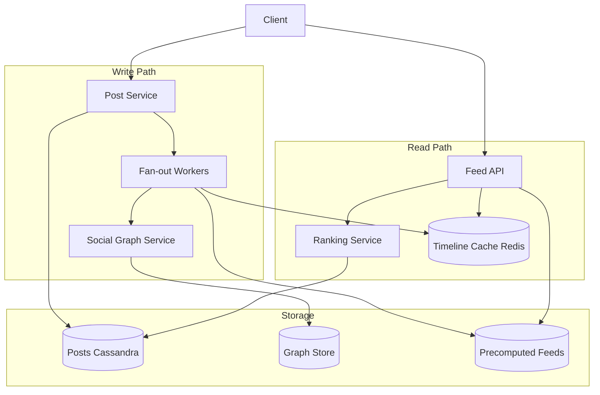
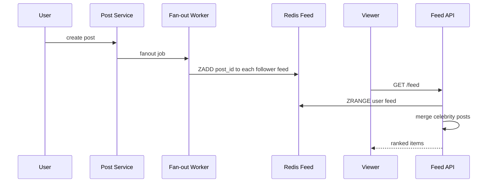
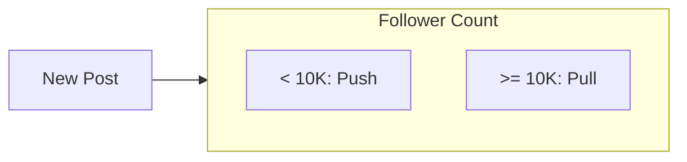

# News Feed

## 1. Executive Summary

A **news feed** (home timeline) aggregates posts from followed users and ranked content into a personalized, scrollable stream. The canonical principal-level problem contrasts **fan-out on write** (push model) vs. **fan-out on read** (pull model), addresses the **celebrity problem**, and layers **ranking**, **caching**, and **eventual consistency** for social graphs at billions of requests per day.

This chapter designs a Twitter/Facebook-class feed for 300M DAU with sub-200 ms feed load p99 and 50K post writes/sec peak. The hybrid fan-out model—push for normal users, pull for celebrities—is the architectural centerpiece, with ranking and caching layered as read-path optimizations rather than afterthoughts.

## 2. Why This Topic Matters

Feed systems embody read/write asymmetry and graph fan-out—core themes in distributed systems interviews and large-scale product engineering:

- **Write amplification** vs. **read latency** tradeoff.
- **Hot users** breaking naive fan-out.
- **Ranking pipelines** mixing ML and heuristics.
- **Cache hierarchy** for personalized content.

Misdesign causes feed staleness, celebrity post outages, or runaway storage costs from precomputed timelines. Interviewers frequently interrupt to add "one user has 50 million followers"—candidates must pivot to hybrid fan-out without restarting the design from scratch. Ranking ML depth is optional; fan-out math is not. See related [Distributed Cache Design](/docs/system-design/distributed-cache-design) for timeline caching patterns in production feeds.

## 3. Problems Being Solved

| Problem | Capability |
|---------|------------|
| **Aggregate followed content** | Merge posts from follow graph |
| **Fast feed load** | Precomputed or cached timeline |
| **New post propagation** | Fan-out pipeline |
| **Ranking** | Score and reorder candidates |
| **Celebrity scale** | Hybrid fan-out |
| **Pagination** | Cursor-based infinite scroll |
| **Real-time feel** | Near-line updates; WebSocket optional |
| **Ads injection** | Slot-based merge in ranker |

## 4. Assumptions and System Model

### Phase 1: Clarify Requirements

**Functional:**

- Users follow users; feed shows posts from followees reverse-chronological with ranking layer.
- Create post (text, image); appears in followers' feeds within seconds (not strict real-time).
- Like/comment counts shown (can be eventually consistent).
- Feed pagination: 20 items per page, cursor.

**Non-functional:**

- Feed read p99 &lt; 200 ms.
- 300M DAU; 150M reads/day per user average → massive read QPS.
- 500K new posts/sec peak (major event).
- Average follows: 200; max follows: 50K (power users).

**Non-goals:** Full-text search; DM (see chat platform).

| Assumption | Implication |
|------------|-------------|
| **Read >> write** | Optimize read path |
| **Most users few followers** | Fan-out on write viable |
| **Celebrities exist** | Special-case pull merge |
| **Ranking can be async** | Slight staleness OK |

## 5. Essential Terminology

| Term | Definition |
|------|------------|
| **Fan-out on write** | Push post to each follower's feed cache |
| **Fan-out on read** | Merge followees' posts at request time |
| **Celebrity / hot user** | User with millions of followers |
| **Timeline cache** | Precomputed list of post IDs per user |
| **Ranker** | ML/heuristic scoring service |
| **Candidate generation** | Pool of posts eligible for feed |
| **Write amplification** | O(followers) work per post |
| **Sharding** | Partition by user_id |

## 6. Core Mechanism

### 6.1 Phase 5: High-Level Architecture



*Figure 1: News feed—write path fans out to follower caches; read path merges cache + celebrity pull + ranking.*

### 6.2 Phase 3: Define APIs

```
POST /v1/posts        { body, media_refs }
GET  /v1/feed?cursor=xyz&limit=20
POST /v1/follow/{user_id}
DELETE /v1/follow/{user_id}
GET  /v1/users/{id}/posts?cursor=  (profile timeline)
```

**Feed response:** `{ items: [{post_id, author, score, ...}], next_cursor }`

### 6.3 Phase 4: Model Data

**`posts`:** `post_id`, `author_id`, `body`, `created_at`, `shard_key=author_id`.

**`follows`:** `follower_id`, `followee_id`, `created_at` — index both directions.

**`user_feed` (Redis sorted set):** `user_id` → `{post_id: timestamp_score}` cap 1000 recent.

**`celebrity_list`:** Users with followers &gt; 10K — fan-out on read only.

**`feed_generation_log`:** Debugging fan-out lag per post.

### 6.4 Phase 6: Deep Dives

**Hybrid fan-out (production standard):**

1. On new post, if author follower count &lt; threshold (e.g., 10K): enqueue fan-out job listing follower IDs (paginated).
2. Worker pushes `post_id` to each follower's Redis ZSET; trim to 1000 entries.
3. If author is celebrity: skip fan-out; store post only in author's post list.
4. On feed read: fetch precomputed ZSET + merge recent posts from followed celebrities (pull) + rank.

**Fan-out worker optimization:**

- Batch followers 1000 per Kafka message.
- Shard workers by follower_id hash.
- Rate limit per worker to protect Redis.

**Ranking pipeline:**

1. **Candidate retrieval:** ~500 post IDs from cache + celebrity merge.
2. **Feature fetch:** author affinity, recency, engagement signals.
3. **Score:** ML model or weighted heuristic.
4. **Filter:** dedup, blocked users, seen posts (Bloom filter per user session).
5. **Inject ads** at slots 3, 8, 15.



*Figure 2: Write fan-out to follower caches; read merges and ranks.*

**Consistency:** Counts (likes) eventual; feed inclusion may lag seconds—acceptable for NFR.

### 6.5 Cold start / new user

Follow suggestions; feed from popular/trending until graph dense enough.

## 7. Step-by-Step Walkthrough

### 7.1 Normal user posts

1. Alice (500 followers) posts; fan-out enqueues 500 Redis ZADDs.
2. Completes in &lt;2 s; Bob refreshes feed sees post near top after ranker boosts recency.

### 7.3 Ranking model deployment canary

1. New ML ranker deployed to 5% traffic via feature flag.
2. Metrics: dwell time, hide rate, report rate compared to control.
3. Regression detected—rollback in 10 minutes without feed outage (chrono fallback).
4. **Principal process:** ranker changes are production experiments with guardrails.

### 7.4 Ads merge in feed

1. Ranker returns 18 organic items; ad server fills slots 3, 8, 15.
2. Ad pacing ensures frequency cap per user per day.
3. Failure: ad server timeout → organic-only feed (revenue hit, UX preserved).

## 7A. Design Phase Summary

| Phase | Section | Key decisions |
|-------|---------|---------------|
| Requirements | §4 | follow graph, ranked feed |
| Scale | §10 | 175K read RPS; hybrid fan-out |
| APIs | §6.2 | POST posts, GET feed cursor |
| Data model | §6.3 | posts, follows, ZSET timeline |
| Architecture | §6.1 | fan-out workers + ranker |
| Deep dives | §6.4 | celebrity threshold |
| Reliability | §8–9 | ranker fallback |
| Security | §13 | block list, private accounts |
| Operations | §12 | fan-out lag SLO |
| Tradeoffs | §16 | push vs pull |

## 8. Invariants and Guarantees

| Property | Guarantee |
|----------|-----------|
| **Post durability** | Persisted before fan-out enqueue |
| **Feed inclusion (normal)** | Eventually within SLO (e.g., 5 s) |
| **Ordering** | Ranker determines final order; not strict time |
| **No duplicate posts in page** | Dedup in ranker |
| **Celebrity posts** | Visible via pull merge |

## 9. Failure Scenarios

| Scenario | Mitigation |
|----------|------------|
| Fan-out lag | Scale workers; priority queue for fresh posts |
| Redis memory | Trim ZSET; tier cold feeds to SSD |
| Hot follower shard | Consistent hash followers |
| Ranker down | Fallback chronological |
| Stale celebrity merge | Cache celebrity recent posts |
| Graph inconsistency | Eventual; repair jobs |

## 10. Performance Characteristics

### Phase 2: Estimate Scale

```
300M DAU × 10 feed loads/day = 3B feed reads/day ≈ 35K RPS average
Peak 5× → 175K feed read RPS
500K posts/sec peak (assumption for major event)
Fan-out: avg 200 followers × 500K = 100M Redis ops/sec peak → requires sharding + batching + hybrid celebrity

Feed cache: 300M users × 1000 IDs × 8 bytes ≈ 2.4 TB Redis (not all active—use LRU tiering)
```

| Operation | Target |
|-----------|--------|
| Feed read p99 | &lt; 200 ms |
| Fan-out lag p99 | &lt; 5 s normal users |
| Post write ACK | &lt; 100 ms |

## 11. Scalability Limits

| Limit | Mitigation |
|-------|------------|
| Celebrity fan-out | Pull on read |
| Redis size | Trim; only active users hot |
| Ranker CPU | Precompute features; approximate models |
| Graph fan-in | Limit max follows or sample |



*Figure 3: Hybrid fan-out threshold—celebrity boundary.*

## 12. Operational Considerations

### Phase 9: Operations

- Metrics: fan-out lag histogram, feed p99, cache hit rate, ranker error.
- Alerts: fan-out queue age; Redis memory; feed error budget burn.
- Runbooks: disable ranking (chrono fallback); increase celebrity threshold temporarily.
- Load test: simulate celebrity post without fan-out.

## 13. Security Considerations

### Phase 8: Security

- Authorization: only show posts user entitled to see (follow graph, blocks).
- Privacy: friend-only posts filtered in fan-out or read path.
- Abuse: rate limit posts; spam detection before fan-out.
- IDOR: cursor tokens signed; no arbitrary user feed access.

## 14. Cost Considerations

Redis memory dominates if every user has full precomputed feed (2.4 TB+ at scale). Tier inactive users to pull-only. Fan-out worker compute scales with posts × followers—celebrity hybrid essential. ML ranking infrastructure: GPU inference fleet or managed feature store—budget separately from feed cache.

**Cost lever summary:** Increase celebrity threshold → lower write amp; decrease ZSET cap → lower Redis; weaker ranking → lower ML cost but product impact.

## 15A. Ranking Feature Store

Production feeds use offline + online features: author affinity (clicks/likes), social graph distance, recency decay, content type boosts. Feature store (batch precompute + low-latency lookup) decouples ranking iteration from feed serving path. Principal architects scope **minimum viable ranker** (recency + engagement) before ML platform investment.

## 22A. Extended Follow-Ups

5. **Real-time feed updates.** — WebSocket push new post IDs to online clients; still backed by cache ZSET.
6. **Feed for non-followed recommended content.** — Hybrid retrieval: social graph + candidate generator from ML—extends design scope explicitly in interview.

## 15. Production Implementations

| System | Approach |
|--------|----------|
| **Twitter (historical)** | Hybrid timelines; public talks on fan-out |
| **Facebook** | Aggregated feed ranking (FBR) pipeline |
| **LinkedIn** | Feed mixer architecture |

## 16. Alternatives and Tradeoffs

### Phase 10: Tradeoffs

| Model | When |
|-------|------|
| Pure push | Small graphs; low read latency critical |
| Pure pull | Storage constrained; few reads per post |
| Hybrid | Production default |
| Chronological | Simple; no ML ops |
| Ranked | Engagement; complexity |

## 17. Common Misconceptions

| Misconception | Reality |
|---------------|---------|
| "Always fan-out on write" | Celebrities break this |
| "Feed is sorted by time" | Ranking reorders |
| "One Redis for all" | Shard by user_id |
| "Real-time feed means WebSocket required" | Pull on refresh acceptable for many products |
| "Delete post removes from all feeds instantly" | Fan-out delete expensive; tombstone + filter |
| "ML ranker required day one" | Chrono MVP validates infra first |
| "Follow graph fits one machine" | Shard; celebrity table separate |

## 17A. Failure scenario drill

Celebrity dies; breaking news post fans out to 50M followers if threshold misconfigured. Fan-out queue explodes; normal users' posts delayed. Mitigation: auto-promote author to celebrity on follower spike; circuit breaker on fan-out workers; manual ops threshold override. Principal lesson: **dynamic celebrity detection** beats static threshold alone.

### 17B. Additional misconceptions

| Misconception | Reality |
|---------------|---------|
| "Graph DB required for follows" | SQL/NoSQL with indexes works at scale |
| "Feed and profile timeline identical" | Profile is author-centric; feed is follower-centric merge |
| "Strong consistency for likes" | Eventual is standard |

## 18. Principal Architect Perspective

- **Quantify fan-out cost** before choosing push model.
- **Celebrity threshold** is tunable operational knob.
- **Ranker failure mode** must be defined (chrono fallback).
- **Graph changes** (unfollow) don't require immediate feed purge—TTL handles.
- **Measure fan-out lag** as product SLO.
- **Ads and organic** should have independent failure domains—never block feed on ad timeout.
- **Search and feed** are separate systems—do not JOIN at read time.

### 18.1 Product-architecture negotiation

Feed ranking changes are **A/B tested** with guardrail metrics (report rate, hide rate, time spent). Principal architects provide **chrono fallback** and feature flags so ML team can iterate without availability risk. Celebrity threshold is tunable by ops during major events—document runbook for temporary pull-only mode if fan-out queue backs up during breaking news.

## 19. Architecture Review Exercise

**Scenario:** Fan-out on write for all users including 10M-follower accounts.

**Review:** Calculate 10M writes per post; Redis/network impossible; propose hybrid.

## 20. Whiteboard Explanation

"When a user posts, we persist the post then fan-out to followers' timeline caches in Redis—unless they're a celebrity with huge follower count, in which case we only store the post and merge on read. Feed load fetches the cached timeline, pulls recent celebrity posts from followed megaccounts, sends candidates through a ranker, and returns a cursor page. Fan-out workers batch followers to control write amplification. Ranker failure falls back to chronological order without user-visible outage."

## 21. Interview Questions

1. **Design Twitter news feed.** — *Signals:* hybrid fan-out, cache, ranker. *Red flags:* SQL JOIN on read.
2. **Fan-out on write vs read?** — *Signals:* write amp, celebrity exception. *Follow-up:* threshold tuning.
3. **Celebrity problem solution?** — *Signals:* pull merge on read. *Red flags:* push to all followers.
4. **Feed ranking architecture?** — *Signals:* candidate gen, features, fallback. *Red flags:* sort by time only.
5. **Storage for 300M users' feeds?** — *Signals:* Redis ZSET trim, inactive tiering. *Red flags:* full feed per user forever.
6. **Consistency for like counts?** — *Signals:* eventual, counter service. *Red flags:* sync on every like in feed path.
7. **Fan-out lag monitoring?** — *Signals:* queue age histogram, SLO. *Red flags:* no metrics.
8. **New user cold start?** — *Signals:* trending, follow suggestions. *Red flags:* empty feed.
9. **Pagination cursor design?** — *Signals:* opaque, stable under new posts. *Red flags:* offset pagination.
10. **Shard social graph?** — *Signals:* follower_id hash, celebrity table. *Follow-up:* hot shard.
11. **Ads injection in feed?** — *Signals:* slot merge, failure degrade. *Red flags:* block organic on ad fail.
12. **Block user immediate effect?** — *Signals:* filter on read + stop fan-out. *Red flags:* purge all historical posts sync.

## 22. Interview Follow-Ups

1. **User unfollows—remove posts?** — Lazy; TTL; filter on read.
2. **Edit post.** — Update post store; fan-out update expensive—broadcast invalidate.
3. **Private accounts.** — Fan-out only to approved followers.

## 23. Strong Answer Example

**Q:** Explain celebrity problem.

**Outline:** Fan-out on write for a user with 10M followers means 10M writes per post—prohibitive latency and cost. Solution: classify users above follower threshold as celebrities; store their posts normally but skip push fan-out. Followers merge celebrity posts at read time from author's post timeline (recent N). Normal users still get push fan-out for low latency reads. Threshold tunable (~10K).

## 24. Weak Answer Example

**Weak:** "Query all friends' posts with SQL JOIN on every load."

**Red flags:** O(follows) read every time; doesn't scale.

## 25. Hands-On Exercise

1. Implement post + follow graph in DB.
2. Fan-out on write to Redis ZSET per user.
3. Simulate celebrity (skip fan-out); merge on read.
4. Measure read latency vs follower count.
5. **Extension:** Fan-out lag metric from enqueue to ZADD complete.
6. **Extension:** Simple ranker hook (recency × log(likes)).

## 23A. Additional Strong Answer

**Q:** Ranker fails in production—what happens?

**Outline:** Feature flag disables ML ranker; feed API falls back to reverse-chronological merge from ZSET + celebrity pull. Alert fires on ranker error budget burn. Cached feature vectors may be stale briefly—acceptable for fallback window.

## 19A. Extended Review Scenario

**Scenario B:** Store entire feed as JSON blob in PostgreSQL per user.

**Review:** Write amplification on every followed post; unbounded blob size. Propose Redis ZSET of post IDs + separate post store.

## 28B. Extended BOE Walkthrough (Interview Script)

**Interviewer:** "Design feed for 300M DAU."

**Strong candidate:**

"300M DAU × 10 feed loads/day = 3B reads/day ≈ 35K RPS average, peak 5× → 175K RPS. Dominated by read—precompute timelines in Redis ZSET trimmed to 1000 posts.

Writes: if 20% DAU post once daily → 60M posts/day ≈ 700 posts/sec average. Fan-out: 700 × 200 avg followers × 2 Redis ops = 280K ops/sec—manageable. Celebrity with 10M followers breaks model → threshold at 10K followers for pull merge.

I'll sketch hybrid architecture, ranker with chrono fallback, and state engagement counts are eventual. Pagination via cursor not offset.

Cost warning: 300M × 1000 IDs × 8 bytes Redis if all hot = 2.4 TB—must tier inactive users to pull-only or Cassandra materialized views."

## 26. Knowledge Check (extended)

9. What is fan-out lag?
10. Why ZSET for timeline?
11. How ads slot injection avoids blocking organic on failure?
12. Offset pagination failure mode on live feed?

## 27. Flashcards

| Front | Back |
|-------|------|
| Fan-out on write | Push post IDs to follower feeds on publish |
| Celebrity problem | High follower count makes push impractical |
| ZSET timeline | Sorted set by timestamp score in Redis |
| Candidate generation | Pool before ranking |
| Fan-out lag | Time from post to inbox ZADD complete |
| Materialized view | Alternative feed store in Cassandra |
| Chrono fallback | Ranker-off reverse time ordering |
| Engagement counter | Eventually consistent like/comment count |
| Follow graph shard | Partition by follower_id hash |
| Feed cap | Trim ZSET to N recent post IDs |
| Recommended content | Non-followed posts in candidate pool |
| Block filter | Remove blocked authors on read path |
| Trending injection | Cold-start content for sparse graphs |
| Post tombstone | Deleted post marker in feed merge |

## 28. Cheat Sheet

```
REQUIREMENTS: follow graph, post, ranked feed, pagination
SCALE: 175K+ read RPS; hybrid fan-out for celebrities
APIs: POST /posts, GET /feed?cursor=
DATA: posts by author; follows; user_feed ZSET
ARCH: Post → Fan-out → Redis; Feed API → Ranker
DEEP: threshold push/pull; batch fan-out workers
RELIABILITY: ranker fallback chrono; trim cache
SECURITY: block list; private account filter
OPS: fan-out lag SLO; Redis memory alerts
TRADEOFFS: push vs pull vs hybrid
```

## 28A. Principal Interview Deep Dive

### Fan-out cost formula

```
Write cost per post ≈ F × R
F = follower count
R = Redis ZADD + metadata (2 writes follower typical)

Example: 10K followers × 2 writes = 20K ops/post
At 500K posts/sec peak (extreme): 10B ops/sec → impossible without celebrity hybrid
```

Use formula in interview to justify threshold instantly.

### Read path latency budget (200 ms p99)

| Stage | Budget |
|-------|--------|
| API auth | 5 ms |
| Redis ZRANGE 1000 ids | 10 ms |
| Celebrity merge (3 accounts × 20 posts) | 30 ms |
| Post metadata MGET | 40 ms |
| Ranker inference | 80 ms |
| Serialize | 15 ms |
| Buffer | 20 ms |

If ranker exceeds budget, async precompute scores on post create for followed authors.

### Materialized view alternative

Some teams store feed as **materialized view in Cassandra** updated on fan-out instead of Redis—better durability, higher write latency. Hybrid: Redis hot cache atop Cassandra cold storage for users inactive &gt;7 days.

### Engagement eventual consistency

Like counts updated via counter service (Dynamo/Redis INCR) aggregated every N seconds into feed cards—decouple hot counter path from feed read. Comment counts similar. State explicitly: **feed order may reflect stale engagement** by design.

## 29. Related Concepts

- [System Design Methodology](/docs/system-design/system-design-methodology)
- [Caching Fundamentals](/docs/caching/caching-fundamentals)
- [Eventual Consistency](/docs/consistency/eventual-consistency)
- [Kafka Architecture](/docs/messaging-and-streaming/kafka-architecture)
- [Distributed Caching](/docs/caching/distributed-caching)

## 30. References

- Kleppmann, *DDIA* — stream processing, materialized views.
- Public engineering posts on Twitter/Facebook feed architecture (implementation anecdotes).
- Redis sorted set documentation — timeline pattern.

**Distinction:** Hybrid fan-out is industry practice; exact thresholds are implementation-specific.

### 30A. Further reading paths

Pair with [Caching Fundamentals](/docs/caching/caching-fundamentals) for ZSET timeline patterns and [Eventual Consistency](/docs/consistency/eventual-consistency) for engagement counter semantics. Contrast celebrity problem with chat megagroup fan-out in [Chat Platform](/docs/system-design/chat-platform). Exercise: implement fan-out worker with Prometheus histogram for `fanout_lag_seconds` and alert when p99 exceeds 5 s.
