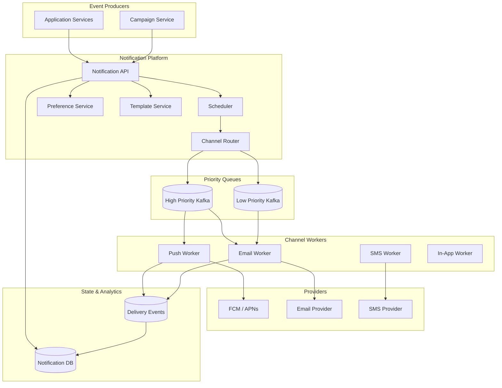
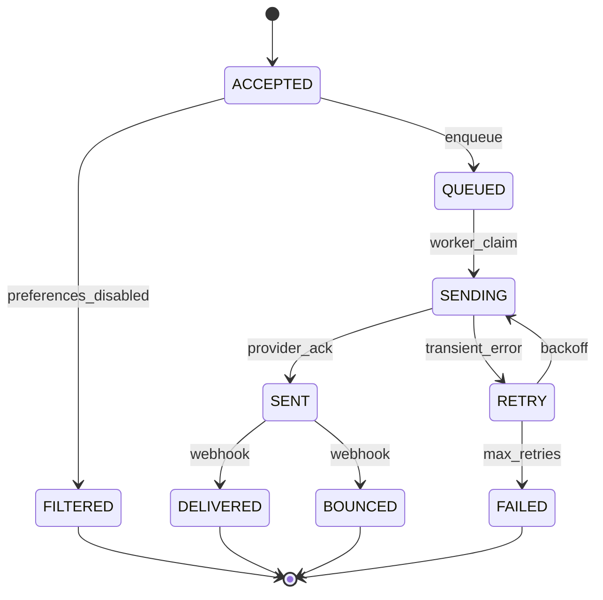
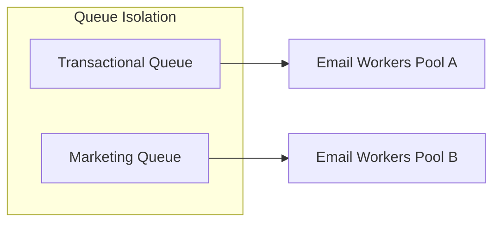

# Notification Platform

## 1. Executive Summary

A **notification platform** delivers messages to users across channels—push, email, SMS, in-app—with templating, preference management, scheduling, and delivery tracking. Principal-level design addresses **fan-out at scale**, **provider abstraction**, **at-least-once delivery with idempotent consumers**, **regulatory compliance** (opt-out, quiet hours), and **priority queuing** without collapsing under marketing bursts.

This chapter designs a multi-tenant notification service for billions of messages per month with 99.9% delivery visibility and channel-specific SLAs. It maps each design phase—requirements through tradeoffs—into the standard 30-section curriculum used across this knowledge system, with explicit safety/liveness separation for delivery guarantees and principal-level organizational context for compliance and deliverability SLOs.

## 2. Why This Topic Matters

Notification systems sit at the intersection of distributed messaging, third-party integrations, and user trust. Architects encounter them when:

- Building **growth loops** (email/push campaigns).
- Designing **transactional alerts** (password reset, payment receipt).
- Scaling **event-driven architectures** where every domain event triggers notify.

Failures cause duplicate charges emails, missed fraud alerts, compliance fines (CAN-SPAM, TCPA), and provider account suspension. Principal interviews test fan-out, queue design, and idempotency.

## 3. Problems Being Solved

| Problem | Capability |
|---------|------------|
| **Multi-channel delivery** | Unified API; channel adapters |
| **Template management** | Versioned templates; i18n |
| **User preferences** | Opt-in/out per channel/category |
| **Scheduling** | Send at local time; quiet hours |
| **Burst traffic** | Queues; rate limits per provider |
| **Delivery tracking** | Webhooks; status state machine |
| **Retries** | Exponential backoff; DLQ |
| **Compliance** | Unsubscribe; audit trail |

## 4. Assumptions and System Model

### Phase 1: Clarify Requirements

**Functional:**

- `SendNotification(user_id, template, channel, payload, priority)`.
- Support push (APNs/FCM), email (SMTP/SES), SMS (Twilio-class), in-app.
- User preference center: channel × category matrix.
- Batch and triggered (event) sends.
- Delivery status: queued, sent, delivered, failed, bounced.

**Non-functional:**

- Transactional priority: p99 queue time &lt; 30 s.
- Marketing: throughput 1M messages/minute (absorb burst).
- Durability: no lost messages after accept.
- At-least-once delivery; dedup on consumer side.

**Non-goals:** In-app chat (see chat platform); rich email editor.

| Assumption | Implication |
|------------|-------------|
| **Providers rate-limit** | Per-provider throttles; multiple accounts |
| **Users opt out** | Preference check before send |
| **Templates vary by locale** | Template resolution service |
| **Bounces happen** | Suppression list; hygiene |

## 5. Essential Terminology

| Term | Definition |
|------|------------|
| **Transactional vs. marketing** | Priority and compliance differ |
| **Fan-out** | One event → many recipients |
| **Provider adapter** | Channel-specific sender |
| **Suppression list** | Emails/phones that must not receive |
| **Webhook** | Provider callback for delivery/bounce |
| **DLQ** | Dead-letter queue after max retries |
| **Idempotency key** | Prevent duplicate sends |
| **Quiet hours** | No push/SMS during user local night |
| **Outbox pattern** | Reliable event → notify pipeline |

## 6. Core Mechanism

### 6.1 Phase 5: High-Level Architecture



*Figure 1: Notification platform—API accepts, preferences filter, priority queues fan out to channel workers and providers.*

### 6.2 Phase 3: Define APIs

```
POST /v1/notifications
{
  "idempotency_key": "order-123-shipped",
  "user_id": "u-456",
  "template_id": "order_shipped",
  "channels": ["email", "push"],
  "priority": "transactional",
  "variables": { "order_id": "123" },
  "schedule_at": null
}

GET /v1/notifications/{id}  → status per channel
PUT /v1/users/{id}/preferences
POST /v1/webhooks/provider  → delivery callbacks
```

### 6.3 Phase 4: Model Data

**`notifications`:** `id`, `idempotency_key` (unique), `user_id`, `template_id`, `status`, `created_at`.

**`notification_attempts`:** `notification_id`, `channel`, `provider_msg_id`, `status`, `attempts`, `last_error`.

**`user_preferences`:** `user_id`, `category`, `channel`, `enabled`.

**`templates`:** `id`, `version`, `locale`, `channel`, `body`, `subject`.

**`suppression_list`:** `address_hash`, `reason`, `created_at`.

**Kafka topics:** `notify.high`, `notify.low`, `notify.dlq`, `delivery.events`.

### 6.4 Phase 6: Deep Dives

**Send pipeline:**

1. API validates; checks idempotency_key unique → return existing if duplicate.
2. Load preferences; filter channels user disabled.
3. Resolve template for user locale.
4. Evaluate quiet hours; defer to scheduler if needed.
5. Enqueue per-channel messages to priority topic.
6. Worker claims message; render template; call provider.
7. Persist attempt; publish delivery event.

**Idempotency:** Unique constraint on `(tenant_id, idempotency_key)`; workers check `notification_attempts` before provider call.

**Fan-out campaign:** Campaign service pages users (cursor); enqueues batch jobs; workers respect provider rate (token bucket per provider).



*Figure 2: Per-channel notification state machine—explicit retries and terminal states.*

**Transactional outbox:** Domain service writes business event + outbox row; relay publishes to notification API—avoids dual-write.

### 6.5 Provider failure handling

Circuit breaker per provider; failover secondary SMS route; email IP warming for new domains. DLQ with manual replay tooling.

## 7. Step-by-Step Walkthrough

### 7.1 Password reset email

1. Auth service calls notify API with `priority=transactional`, `idempotency_key=reset-789`.
2. Preferences allow email security category.
3. Message to `notify.high`; email worker picks up within 2 s.
4. SES accepts; status `SENT`; webhook later confirms `DELIVERED`.

### 7.3 CAN-SPAM compliance audit

1. Regulator requests proof user opted in before marketing email.
2. Platform produces audit: preference timestamp, IP, source form, template version.
3. Gap found: one campaign skipped preference check—incident review.
4. **Remediation:** mandatory preference middleware unit tests; block deploy without check in CI.

### 7.4 Cross-channel deduplication

1. Order shipped triggers email + push + SMS with same `idempotency_key` prefix.
2. User receives one logical notification; three channel attempts logged under parent `notification_id`.
3. Dashboard shows per-channel status; user disables SMS—only email and push fire.

## 7A. Design Phase Summary

| Phase | Section | Key decisions |
|-------|---------|---------------|
| Requirements | §4 | Multi-channel, preferences, priority |
| Scale | §10 | 40K/sec peak; isolated queues |
| APIs | §6.2 | idempotent POST; webhooks |
| Data model | §6.3 | notifications, attempts, templates |
| Architecture | §6.1 | API → Kafka → workers → PSPs |
| Deep dives | §6.4 | state machine; outbox |
| Reliability | §8–9 | retry, DLQ, circuit breaker |
| Security | §13 | PII, webhook HMAC |
| Operations | §12 | queue lag SLOs |
| Tradeoffs | §16 | sync vs async send |

## 8. Invariants and Guarantees

| Property | Guarantee |
|----------|-----------|
| **No send after opt-out** | Safety — preference check mandatory |
| **Idempotent accept** | Same key → same notification id |
| **At-least-once delivery** | Retries may duplicate provider-side dedup |
| **Auditability** | All attempts logged |
| **Ordering** | Not global; per-user causal optional |

## 9. Failure Scenarios

| Scenario | Mitigation |
|----------|------------|
| Provider outage | Queue backlog; circuit breaker; secondary |
| Template bug | Canary template version; rollback |
| Kafka lag | Scale consumers; priority isolation |
| Duplicate API retry | Idempotency key |
| Wrong locale | Fallback chain en → default |
| SMS fraud | Rate limit; captcha on trigger |
| Webhook loss | Poll provider status API |

## 10. Performance Characteristics

### Phase 2: Estimate Scale

```
Users: 50M MAU
Notifications/user/month: 40 → 2B/month ≈ 770/sec average
Peak (Black Friday): 50× → 40K/sec enqueue
Email payload: 50 KB average (with metadata)
Storage: 2B × 500 bytes state ≈ 1 TB/month metadata (tiered)
Workers: 40K/sec / 100 msg/sec per worker ≈ 400 workers peak
```

| Channel | Typical latency SLA |
|---------|---------------------|
| Push | &lt; 10 s |
| Transactional email | &lt; 60 s |
| SMS | &lt; 30 s |
| Marketing batch | Hours acceptable |

## 11. Scalability Limits

| Limit | Mitigation |
|-------|------------|
| Provider rate cap | Sharded provider accounts; throttle |
| DB write rate | Partition by date; async status updates |
| Template render CPU | Pre-render static parts; cache |
| Single campaign hot topic | Dedicated topic per large campaign |



*Figure 3: Priority queue isolation—transactional traffic never starved by marketing.*

## 12. Operational Considerations

### Phase 9: Operations

- SLO: transactional p99 &lt; 30 s end-to-end; marketing backlog drain rate.
- Dashboards: queue lag per priority, provider error rate, bounce rate.
- Runbooks: pause marketing; switch SMS provider; replay DLQ.
- On-call: Pager for high-priority queue age &gt; 60 s.

## 13. Security Considerations

### Phase 8: Security

- PII in payloads encrypted at rest; minimize template variables.
- Webhook signature verification (HMAC).
- API auth: service-to-service mTLS.
- SMS pumping fraud: per-tenant send caps; anomaly detection.
- Unsubscribe links signed tokens; one-click compliance.

## 14. Cost Considerations

SMS most expensive; push cheapest. Batch email vs. transactional IP pools. Archive old notification metadata to cold storage. Provider volume discounts tiered by commit.

## 15. Production Implementations

| Category | Examples (generic) |
|----------|-------------------|
| **SaaS** | Twilio SendGrid, Iterable, Braze, Customer.io |
| **Cloud** | AWS SNS/SES/Pinpoint, Firebase Cloud Messaging, Azure Communication Services |
| **Internal patterns** | Outbox-triggered notify microservice at large tech cos (public blog anecdotes) |
| **Open source building blocks** | Apache Kafka, Celery/RQ workers, Novu (notification infrastructure) |

**Build vs. buy:** Buy when deliverability expertise and provider relationships are core to vendors; build when deep integration with proprietary user graph, compliance controls, and cost at billions of messages favors internal platform. Hybrid common: internal orchestration + external SMS/email providers.

## 22A. Interview Follow-Ups (extended)

5. **Notification content localization.** — Template variants per locale; fallback chain; RTL layout for email clients.
6. **Wake-up push for dormant users.** — Marketing category; quiet hours; frequency cap per week.
7. **In-app vs push redundancy.** — User preference; collapse into single logical notification record with channel fan-out.

## 16. Alternatives and Tradeoffs

### Phase 10: Tradeoffs

| Decision | Tradeoff |
|----------|----------|
| Single queue | Simple vs. priority inversion |
| Sync send | Low latency vs. no buffer |
| Pull vs. push providers | Complexity vs. control |
| Global vs. regional send | Latency vs. compliance residency |

## 17. Common Misconceptions

| Misconception | Reality |
|---------------|---------|
| "Fire-and-forget HTTP to provider" | Need durability, retries, status |
| "One email API fits all" | Transactional vs marketing IPs differ |
| "Exactly-once delivery" | At-least-once + idempotency standard |
| "Skip preferences for important" | Legal and trust require opt-in |
| "SMS and push are interchangeable" | Cost, reach, and compliance differ radically |
| "Webhook delivery is guaranteed" | At-least-once; handlers must be idempotent |
| "One template for all channels" | Channel-specific rendering and size limits |
| "Queue depth is only ops metric" | Product-visible delay when transactional starved |

## 17A. Failure scenario drill

Walk through aloud: marketing campaign misconfigured to `notify.high` topic—password resets delayed 90 minutes during incident. Identify detection (transactional queue age alert), mitigation (pause campaign, drain high queue), and prevention (CI lint on topic name, separate AWS accounts for marketing workers). Principal candidates connect architecture to user harm and revenue.

### 17B. Additional misconceptions

| Misconception | Reality |
|---------------|---------|
| "Push notification body can be full email HTML" | Size limits; deep link to in-app content |
| "Unsubscribe link optional for transactional" | Transactional exempt from marketing unsub but not from clarity requirements—verify with legal |

## 18. Principal Architect Perspective

- **Isolate priorities** before optimizing throughput.
- **Provider is always flaky**—design for backoff and visibility.
- **Compliance is architectural**, not legal appendix.
- **Idempotency from day one**—retries are guaranteed.
- **Measure deliverability**, not just send rate.
- **Legal/compliance partnership** required for SMS and email—architecture must capture consent artifacts.
- **Provider diversification** reduces single-vendor outage blast radius—budget integration cost in roadmap.

### 18.1 Deliverability as SLO

Principal architects define **deliverability SLOs** separate from enqueue SLOs: % delivered within 60 s for transactional, bounce rate &lt; 2%, complaint rate &lt; 0.1%. These metrics drive template quality, list hygiene, and provider selection—not just engineering uptime.

### 18.2 Cross-functional ownership

Notification platforms sit between **product growth** (wants maximum sends), **legal/compliance** (wants consent proof), and **finance** (SMS cost). Architecture must expose per-tenant send quotas, audit logs, and emergency pause switches accessible to non-engineers. Principal-led **game day** exercises: simulate provider outage and verify transactional path still meets SLO while marketing remains paused. Document escalation when complaint rate spikes—often template or list purchase issue, not infrastructure.

## 19. Architecture Review Exercise

**Scenario:** Monolith calls SendGrid synchronously from request path.

**Review:** Latency coupling; no retry; propose async queue, idempotency, preference service.

## 20. Whiteboard Explanation

"Producers call a notification API with idempotency keys. We resolve templates and user preferences, then enqueue per-channel jobs to priority Kafka topics. Workers render and call provider adapters with rate limiting and circuit breakers. Status flows back via webhooks into a tracking store. Transactional traffic uses a high-priority queue so marketing bursts cannot starve password resets. DLQ and replay handle poison messages. Compliance artifacts—opt-in timestamps, unsubscribe tokens—are first-class data, not logs of afterthought."

## 21. Interview Questions

1. **Design notification system for 100M users.** — *Signals:* queue, channels, preferences, idempotency. *Red flags:* sync provider calls.
2. **Email vs. push vs. SMS tradeoffs?** — *Signals:* cost, latency, reach, compliance. *Follow-up:* quiet hours.
3. **Prevent duplicate notifications?** — *Signals:* idempotency key, unique constraint. *Red flags:* "check DB first" without transaction.
4. **Priority between transactional and marketing?** — *Signals:* separate topics/workers. *Red flags:* single FIFO queue.
5. **Handle provider rate limits?** — *Signals:* throttle, sharded accounts, backoff. *Red flags:* unbounded workers.
6. **User preference model?** — *Signals:* channel × category matrix. *Follow-up:* legal opt-in evidence.
7. **Schedule send at local 9 AM?** — *Signals:* timezone store, scheduler service. *Red flags:* UTC-only cron.
8. **Track delivery status?** — *Signals:* webhooks, state machine, polling fallback. *Red flags:* fire-and-forget.
9. **Bounce handling architecture?** — *Signals:* suppression list, complaint loops. *Red flags:* ignore bounces.
10. **Fan-out 10M email campaign?** — *Signals:* chunked enqueue, rate limit, pause/resume. *Red flags:* single thread loop.
11. **Transactional outbox integration?** — *Signals:* same DB txn, relay worker. *Red flags:* dual write without outbox.
12. **Multi-region compliance?** — *Signals:* data residency, regional providers. *Follow-up:* GDPR delete propagation.

## 22. Interview Follow-Ups

1. **User complains about night push.** — Quiet hours; timezone DB; audit.
2. **Template XSS in email.** — Sanitize variables; CSP where applicable.
3. **Exact-once billing per SMS.** — Idempotent provider + ledger.

## 23. Strong Answer Example

**Q:** How isolate transactional from marketing traffic?

**Outline:** Separate Kafka topics and worker pools with independent autoscaling. Transactional API enqueues only to high-priority topic with dedicated consumers and stricter SLO alerts. Marketing uses low-priority topic with rate limits tied to provider caps. Optional: reserve minimum consumer capacity for high queue always.

## 24. Weak Answer Example

**Weak:** "Loop users and send email in cron."

**Red flags:** No queue, no retry, no preferences, blocks on provider.

## 25. Hands-On Exercise

1. Build notify API with SQLite + Redis queue.
2. Implement idempotency and preference filter.
3. Mock provider with failure rate; add retry + DLQ.
4. Load test marketing vs. transactional concurrency.
5. **Extension:** Implement quiet hours with user timezone table.
6. **Extension:** Webhook signature verification module with test vectors.

## 23A. Additional Strong Answer

**Q:** End-to-end delivery tracking without slowing send path.

**Outline:** State machine in `notification_attempts` updated asynchronously via provider webhooks and polling fallback. Send path only writes `queued` then returns; workers transition to `sent` on HTTP 202 from provider. Webhook handler idempotent on `provider_msg_id`. Dashboard reads materialized view.

## 19A. Extended Review Scenario

**Scenario B:** Single queue for all notification types with one worker pool.

**Review:** Marketing campaign blocks password reset during peak. Propose priority queues and quantify blast radius in minutes of transactional delay.

## 26. Knowledge Check

1. Purpose of idempotency key?
2. Why separate priority queues?
3. Outbox pattern role?
4. Bounce → suppression flow?
5. At-least-once implications?

## 27. Flashcards

| Front | Back |
|-------|------|
| DLQ | Queue for failed messages after max retries |
| Suppression list | Blocked addresses (bounces, complaints) |
| Quiet hours | Defer notify to user-local daytime |
| Transactional outbox | Reliable async handoff from DB transaction |
| Circuit breaker | Stop calls to failing provider temporarily |
| Preference matrix | channel × category enable/disable grid |
| Campaign chunking | Stream user IDs in batches to queue |
| Consent artifact | Legal proof of opt-in for compliance |
| Priority isolation | Separate queues for transactional vs marketing |
| Edge sampling | Reduce analytics load on viral events |
| Template version | Rollback path for bad template deploy |
| Frequency cap | Max marketing messages per user per day |
| Provider webhook | Async delivery status callback |
| Poison message | Failed after max retries → DLQ |

## 28. Cheat Sheet

```
REQUIREMENTS: multi-channel, preferences, priority, scheduling, tracking
SCALE: priority queues; worker pools; provider rate limits
APIs: POST /notifications, preferences, webhooks
DATA: notifications, attempts, templates, suppression
ARCH: API → Router → Kafka → Workers → Providers
DEEP: idempotency; state machine; outbox from domain
RELIABILITY: retry backoff; DLQ; circuit breaker
SECURITY: PII encryption; webhook HMAC; fraud caps
OPS: queue lag alerts; campaign pause
TRADEOFFS: sync vs async; single vs multi queue
```

## 28A. Principal Interview Deep Dive

### Channel comparison for architects

| Channel | Latency | Cost | Reach | Compliance burden |
|---------|---------|------|-------|-------------------|
| Push | Seconds | Low | App installed | Platform policies |
| Email | Minutes | Low–medium | Universal | CAN-SPAM, unsubscribe |
| SMS | Seconds | High | Phone required | TCPA, opt-in proof |
| In-app | Instant | Low | Active session | Lowest |

### BOE: worker fleet for Black Friday

```
10M emails in 1 hour = 2,778/sec enqueue
Provider cap 50K/min = 833/sec per account
Accounts needed: ceil(2778/833) = 4 provider sub-accounts or throttle to 833/sec → 3.3 hours drain
Workers: 2778 / 50 per worker ≈ 56 email workers (assuming 50 concurrent SMTP per pod)
```

Demonstrate tradeoff: extend send window vs. buy provider capacity vs. sample recipients for non-critical campaigns.

### Delivery semantics

- **At-least-once** from platform to provider is standard (retries).
- **At-most-once** to user requires provider idempotency + dedup on `provider_msg_id`.
- **Exactly-once user perception** achieved by idempotency key at API + collapse duplicate channels in UI.

### Incident patterns from production (generic)

| Incident | Root cause | Architectural fix |
|----------|------------|-------------------|
| Password reset delayed 2h | Marketing queue shared | Priority isolation |
| Duplicate SMS charges | Missing idempotency | Unique constraint |
| GDPR fine | No opt-in record | Consent artifact store |

## 28B. Extended BOE Walkthrough (Interview Script)

**Interviewer:** "100M users, 40 notifications per user per month."

**Strong candidate:**

"100M × 40 = 4B notifications/month ≈ 1,540/sec average enqueue. Peak campaign 50× → ~77K/sec—Kafka partitions and worker autoscale. SMS at $0.01/msg dominates cost model vs push—route by preference and priority.

Transactional 30s SLO requires isolated high-priority queue—never share workers with marketing. Idempotency key on every send API; webhooks update state async.

Compliance: store opt-in timestamp and source; CAN-SPAM unsubscribe one-click; TCPA for SMS—architecture captures consent artifacts, legal owns policy.

I'll draw outbox from order service to notification API for reliable triggers."

## 26A. Knowledge Check (extended)

9. What is suppression list?
10. Why separate Kafka topics by priority?
11. Circuit breaker on provider protects what?
12. Quiet hours implementation sketch?

## 29. Related Concepts

- [System Design Methodology](/docs/system-design/system-design-methodology)
- [Message Delivery Semantics](/docs/messaging-and-streaming/message-delivery-semantics)
- [Transactional Outbox](/docs/transactions/transactional-outbox)
- [Idempotency](/docs/distributed-systems-foundations/idempotency)
- [Event-Driven Architecture](/docs/messaging-and-streaming/event-driven-architecture)
- [Kafka Architecture](/docs/messaging-and-streaming/kafka-architecture)

## 30. References

- CAN-SPAM Act; TCPA — regulatory constraints (consult legal counsel).
- Kleppmann, *DDIA* — stream processing, exactly-once semantics discussion.
- AWS SES / FCM documentation — provider integration patterns.

**Distinction:** Regulations are legal requirements; delivery semantics follow distributed systems theory (at-least-once typical).

### 30A. Further reading paths

After mastering this exercise, compare with [Transactional Outbox](/docs/transactions/transactional-outbox) for domain-to-notify integration, [Kafka Architecture](/docs/messaging-and-streaming/kafka-architecture) for queue partitioning strategy, and [Idempotency](/docs/distributed-systems-foundations/idempotency) for retry-safe APIs. Principal study path: implement minimal notify service, load-test priority inversion without isolation, document incident postmortem template for duplicate-send scenarios.
