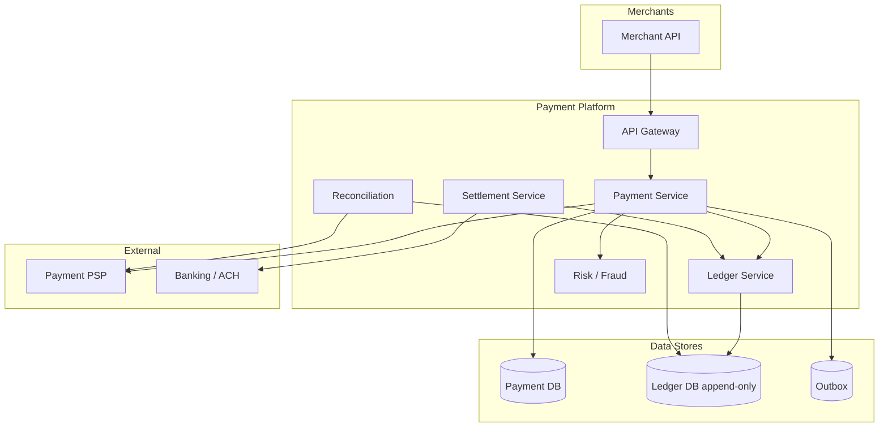
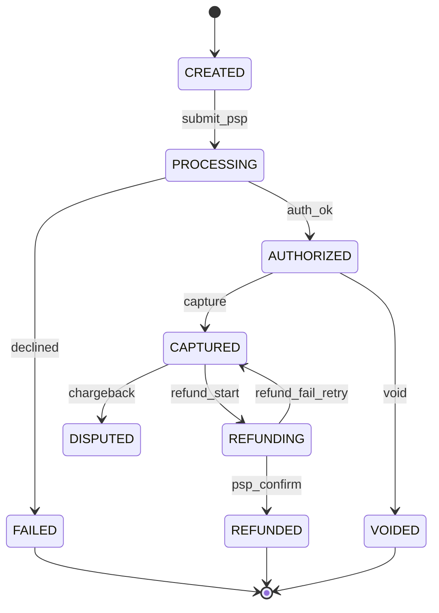
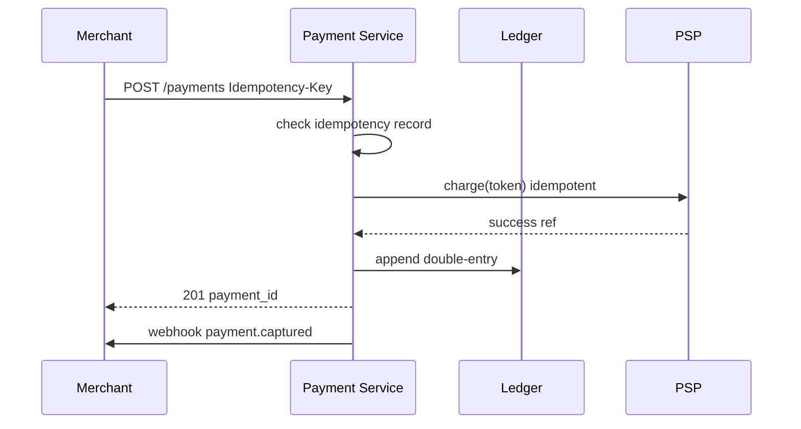

# Payment Platform

## 1. Executive Summary

A **payment platform** processes money movement—charges, refunds, payouts—with **correctness**, **auditability**, and **regulatory compliance** paramount over raw throughput. Principal architects must design **double-entry ledgers**, **idempotent APIs**, **PCI scope minimization**, **reconciliation** with payment processors, and **saga-based** compensation for distributed transactions.

This chapter presents a reference architecture for a Stripe-class payment processor handling $50B annual volume with 99.99% correctness (no lost or duplicate money) and sub-second authorization latency. Double-entry ledger invariants, idempotent APIs, and nightly reconciliation are presented as non-negotiable safety properties distinct from liveness and availability concerns.

## 2. Why This Topic Matters

Payment systems are among the highest-stakes distributed systems:

- **Money must balance** — ledger invariants are non-negotiable.
- **External PSPs** (payment service providers) are eventually consistent and retry-heavy.
- **Compliance** — PCI-DSS, AML, regional regulations.
- **Idempotency** — network retries must not double-charge.

Principal interviews and architecture reviews test whether candidates understand **ledger design**, not just "call Stripe API." Follow-up questions on ambiguous PSP timeouts and chargebacks after payout separate staff-level API knowledge from principal-level financial systems reasoning. Zero ledger imbalance tolerance should be stated explicitly in the first five minutes of the interview.

## 3. Problems Being Solved

| Problem | Capability |
|---------|------------|
| **Accept payment** | Card/wallet charge with auth/capture |
| **Idempotent operations** | Safe client retries |
| **Ledger accounting** | Double-entry immutable journal |
| **Refunds / chargebacks** | Compensating transactions |
| **Payouts to merchants** | Settlement batching |
| **Reconciliation** | Match internal vs. PSP records |
| **Fraud** | Risk scoring; 3DS |
| **Compliance** | PCI scope reduction; audit trail |

## 4. Assumptions and System Model

### Phase 1: Clarify Requirements

**Functional:**

- `CreatePayment(amount, currency, payment_method, idempotency_key)`.
- Auth + capture (two-phase) or single charge.
- Refund full/partial.
- Merchant balance and settlement reports.
- Webhooks to merchants on state changes.

**Non-functional:**

- **Correctness:** zero duplicate charges; ledger always balances.
- Authorization p99 &lt; 500 ms.
- Availability 99.99% for payment API.
- Durability: no acknowledged payment lost.
- Audit: immutable 7-year retention.

**Non-goals:** Build card network switches; cryptocurrency (separate).

| Assumption | Implication |
|------------|-------------|
| **PSP handles card rails** | Integrate Stripe/Adyen-class APIs |
| **Retries inevitable** | Idempotency everywhere |
| **Clock skew** | Use DB/ledger timestamps; not wall clock alone |
| **Partial failures** | Saga with compensation |

## 5. Essential Terminology

| Term | Definition |
|------|------------|
| **PSP** | Payment Service Provider |
| **Double-entry ledger** | Debits = credits per transaction |
| **Authorization** | Hold funds; not yet captured |
| **Capture** | Settle authorized amount |
| **Idempotency key** | Client-supplied dedup token |
| **PCI-DSS** | Card data security standard |
| **Tokenization** | Replace PAN with vault token |
| **Reconciliation** | Match ledger to PSP settlement files |
| **Chargeback** | Disputed reversal from issuer |
| **Saga** | Multi-step txn with compensating actions |
| **Exactly-once effect** | Idempotent retries achieve this semantically |

## 6. Core Mechanism

### 6.1 Phase 5: High-Level Architecture



*Figure 1: Payment platform—payment orchestration, append-only ledger, PSP integration, reconciliation loop.*

### 6.2 Phase 3: Define APIs

```
POST /v1/payments
Headers: Idempotency-Key: uuid
Body: { amount, currency, payment_method_token, merchant_id, capture: true|false }

POST /v1/payments/{id}/capture  { amount? }
POST /v1/payments/{id}/refund   { amount?, reason }
GET  /v1/payments/{id}
GET  /v1/merchants/{id}/balance
POST /v1/webhooks/psp           (PSP callbacks)
```

**States:** `created` → `processing` → `authorized` → `captured` | `failed` | `refunded` | `disputed`.

### 6.3 Phase 4: Model Data

**`payments`:** `payment_id`, `idempotency_key` (unique per merchant), `merchant_id`, `amount`, `currency`, `status`, `psp_reference`, `created_at`.

**`ledger_entries` (append-only):**

| entry_id | account | debit | credit | payment_id | ts |
|----------|---------|-------|--------|------------|-----|
| E1 | customer_cash | 100 | 0 | P1 | ... |
| E2 | merchant_payable | 0 | 97 | P1 | ... |
| E3 | platform_fee | 0 | 3 | P1 | ... |

**Invariant:** Σ debits = Σ credits per currency per transaction.

**`idempotency_records`:** `key`, `request_hash`, `response`, `expires_at`.

**`merchant_accounts`:** balance derived from ledger materialized view.

### 6.4 Phase 6: Deep Dives

**Idempotent payment create:**

1. Check `idempotency_records` for key; if exists and hash matches → return stored response.
2. If new: begin DB transaction.
3. Insert payment `processing`; call PSP with idempotency header.
4. On PSP success: append ledger entries; update status `captured`; commit.
5. Store idempotency response; commit.
6. Publish webhook via outbox.

**Auth + capture (two-phase):**

- Auth: ledger hold (customer → auth_hold account).
- Capture: move hold → merchant_payable; fee to platform.
- Expire auth: release hold after 7 days.

**Saga for refund:**

1. Initiate refund; status `refunding`.
2. Call PSP refund API (idempotent).
3. On success: compensating ledger entries (reverse merchant credit).
4. On PSP failure: retry with backoff; manual ops if stuck.



*Figure 2: Payment state machine—explicit transitions for ops and reconciliation.*

**PCI scope reduction:**

- Never store PAN; use PSP tokenization / Elements iframe.
- Platform sees only tokens and last4.
- CDE (cardholder data environment) minimized to PSP.

**Reconciliation (nightly):**

1. Download PSP settlement file.
2. Match by `psp_reference` to payments.
3. Flag discrepancies: missing, amount mismatch, duplicate.
4. Ops queue for manual resolution.



*Figure 3: Idempotent charge with ledger write in same transaction boundary.*

### 6.5 Fraud and 3DS

Risk service scores transaction; high risk triggers 3DS challenge flow before PSP call. Decline before ledger mutation.

## 7. Step-by-Step Walkthrough

### 7.1 Successful charge

1. Merchant POST $100 with idempotency key K1.
2. Risk approves; PSP charges; ledger: debit customer $100, credit merchant $97, credit fee $3.
3. Webhook `payment.captured` delivered with signed payload.

### 7.2 Duplicate retry

1. Merchant retries same K1 due to timeout.
2. Idempotency record returns original 201—no second PSP call.

### 7.3 Chargeback after merchant payout

1. Customer disputes $500 charge 45 days post-capture.
2. PSP debits platform; ledger creates negative merchant balance entry.
3. Merchant balance -$200; future payouts held until positive.
4. Ops workflow: evidence submission to card network; status `disputed`.
5. **Principal:** chargebacks are async compensating events—design ledger for reversals.

### 7.4 Marketplace split payment

1. $100 purchase: $80 seller A, $15 seller B, $5 platform fee.
2. Single PSP charge; ledger splits to three payable accounts.
3. Payout batch nightly per seller; minimum payout threshold $25.
4. Idempotency on entire payment—not per seller line.

## 7A. Design Phase Summary

| Phase | Section | Key decisions |
|-------|---------|---------------|
| Requirements | §4 | charge, refund, ledger, recon |
| Scale | §10 | shard ledger; PSP idempotency |
| APIs | §6.2 | Idempotency-Key mandatory |
| Data model | §6.3 | double-entry append-only |
| Architecture | §6.1 | Payment → PSP + Ledger |
| Deep dives | §6.4 | saga refund; recon |
| Reliability | §8–9 | ambiguous PSP repair |
| Security | §13 | PCI tokenization |
| Operations | §12 | imbalance P0 |
| Tradeoffs | §16 | auth/capture; multi-PSP |

## 8. Invariants and Guarantees

| Property | Type | Mechanism |
|----------|------|-----------|
| **Ledger balance** | Safety | Double-entry; DB constraints |
| **No duplicate charge** | Safety | Idempotency key + PSP idempotency |
| **Durability after 201** | Safety | Sync replicate payment + ledger |
| **Audit trail** | Safety | Append-only ledger |
| **Liveness** | Processing completes or explicit failed | Reconciliation repair |

## 9. Failure Scenarios

| Scenario | Mitigation |
|----------|------------|
| PSP duplicate callback | Idempotent webhook handler |
| Ledger write fails after PSP success | Reconciliation repair; alert P0 |
| Split brain idempotency | Unique constraint; transaction isolation |
| Currency FX rounding | Integer minor units only |
| Chargeback after payout | Negative merchant balance; hold future payouts |
| Fraud attack | Rate limits; velocity checks |
| Outbox stuck | Relay retry; DLQ |

## 10. Performance Characteristics

### Phase 2: Estimate Scale

```
$50B/year ≈ $1,580/sec average charge volume
Peak 10× → ~16K payments/sec
Ledger: 3 entries × 16K = 48K writes/sec → shard ledger by merchant_id
Storage: 500M txns/year × 1KB ≈ 500 GB/year ledger (compressed, tiered)
PSP latency dominates p99 (~200-400ms)
```

| Path | Target |
|------|--------|
| Create payment p99 | &lt; 500 ms |
| Webhook delivery | &lt; 30 s |
| Reconciliation | Daily batch + near-real-time alerts |

## 11. Scalability Limits

| Limit | Mitigation |
|-------|------------|
| Ledger write rate | Shard by merchant; event sourcing |
| Hot merchant | Dedicated partition |
| PSP rate limits | Queue; multiple PSP accounts |
| Reconciliation file size | Stream parse; parallel match |
| Global currency | Per-currency ledger partitions |

## 12. Operational Considerations

### Phase 9: Operations

- **SLO:** correctness incidents = 0 tolerance; availability 99.99%.
- Dashboards: payment success rate, latency, reconciliation gap count.
- Runbooks: stuck `processing`; manual refund; chargeback dispute.
- On-call: P0 for ledger imbalance alert.
- Freeze releases during settlement windows if required.

## 13. Security Considerations

### Phase 8: Security

- PCI: tokenization; network segmentation; annual audit.
- API auth: merchant API keys + HMAC webhooks.
- Encryption at rest for PII; KMS rotation.
- AML/KYC for merchant onboarding (separate service).
- Rate limiting; anomaly detection on refund volume.
- Principle of least privilege for ops access to production.

## 14. Cost Considerations

PSP interchange fees dominate (typically 2–3% card-present, higher CNP). Platform margin on application fee split. Ledger storage cheap relative to fraud losses and chargeback fees. Build vs. buy PSP integration: buy unless payment is strategic differentiator (marketplace, fintech core product).

**Hidden costs:** PCI audit scope, reconciliation ops headcount, dispute management, multi-currency FX spreads.

## 15A. Regulatory and Organizational Context

Payment platforms require partnership with finance, legal, and compliance from architecture phase—not post-launch. AML/KYC for merchant onboarding, SAR filing workflows, and regional payment method support (iDEAL, UPI, etc.) shape service boundaries. Principal architects document **which team owns ledger truth** vs. **PSP settlement truth** and reconciliation SLAs between them.

## 22A. Extended Follow-Ups

4. **Split payment between three sellers.** — Multi-party ledger in single txn; payout scheduling per seller.
5. **PCI SAQ scope for microservices.** — Network segmentation diagram; which services touch cardholder data environment.

## 15. Production Implementations

| System | Pattern |
|--------|---------|
| **Stripe** | Idempotent API; Connect for marketplaces |
| **Adyen** | Unified acquiring |
| **Square** | In-person + online ledger |
| **PayPal** | Wallet balance ledger |

## 16. Alternatives and Tradeoffs

### Phase 10: Tradeoffs

| Decision | Tradeoff |
|----------|----------|
| Single vs two-phase capture | Flexibility vs complexity |
| Sync vs async capture | Latency vs reliability |
| Event sourcing ledger | Audit vs query complexity |
| Multi-PSP routing | Resilience vs integration cost |
| Strong consistency everywhere | Latency vs correctness (prefer correctness) |

## 17. Common Misconceptions

| Misconception | Reality |
|---------------|---------|
| "Float balance in payments table" | Ledger is source of truth |
| "PSP success = done without ledger" | Must be atomic or repairable |
| "UUID is enough idempotency" | Need stored response + hash |
| "Refunds are trivial" | Saga, timing, partial, FX |
| "We don't need reconciliation" | PSP and internal always drift |
| "Float dollars in JSON is fine" | Minor integer units only |
| "Webhook retry from merchant is enough" | Platform must guarantee delivery attempt |
| "Refund = delete payment row" | Append compensating ledger entries |
| "PCI is Infosec problem only" | Data flow diagram is architecture deliverable |

## 17A. Failure scenario drill

PSP succeeds; app crashes before ledger commit—customer charged, merchant not credited. Detection: reconciliation next day; prevention: outbox or txn boundary including PSP idempotency key persistence before external call. P0 if widespread—principal designs **ambiguous state** handling before launch.

### 17B. Additional misconceptions

| Misconception | Reality |
|---------------|---------|
| "Stripe handles ledger for you" | Platform still needs internal books for marketplace splits |
| "Async capture simplifies UX" | Auth hold expiry confuses users if not messaged clearly |

## 18. Principal Architect Perspective

- **Correctness before latency**—always.
- **Idempotency is API contract**, not implementation detail.
- **Ledger append-only**—never update entries; only compensating entries.
- **Reconciliation is part of design**, not back-office afterthought.
- **PCI scope** decisions affect entire architecture.
- **Finance sign-off** required on ledger schema changes—treat as regulated system.
- **No DELETE on ledger**—cultural norm enforced in code review.

### 18.1 Incident severity model

| Severity | Condition | Response |
|----------|-----------|----------|
| P0 | Ledger imbalance detected | Halt captures; exec bridge |
| P1 | Reconciliation gap &gt; $X | Ops manual match within 4h |
| P2 | Elevated processing stuck | Run recon job; no user-visible if rare |
| P3 | Webhook delay | Retry; merchant idempotent |

Principal architects define dollar thresholds X with finance and document in on-call playbook.

## 19. Architecture Review Exercise

**Scenario:** Team updates `merchant_balance` column without ledger on charge.

**Review:** Race conditions; audit failure; propose double-entry + derived balance.

## 20. Whiteboard Explanation

"Merchants call our idempotent payment API. We check idempotency keys, score fraud, then call the PSP with their idempotency token. On success we append double-entry ledger rows in the same database transaction as the payment state update. Webhooks go through an outbox for reliable delivery. Nightly reconciliation matches PSP settlement files to our ledger. Refunds run as sagas with compensating ledger entries. We never store raw card numbers—only PSP tokens. Ledger imbalance is P0—halt captures until resolved."

## 21. Interview Questions

1. **Design payment system for marketplace.** — *Signals:* ledger, split, idempotency, PSP. *Red flags:* balance column update only.
2. **Double-entry ledger explain?** — *Signals:* debits=credits, append-only. *Follow-up:* compensation entries.
3. **Idempotency implementation?** — *Signals:* key store, PSP layer, recon. *Red flags:* UUID only.
4. **Auth vs capture?** — *Signals:* two-phase, hold accounts. *Red flags:* conflate.
5. **Handle PSP timeout?** — *Signals:* processing state, recon query. *Red flags:* retry charge blindly.
6. **Reconciliation process?** — *Signals:* settlement file match, discrepancy queue. *Red flags:* skip.
7. **PCI scope reduction?** — *Signals:* tokenization, no PAN. *Red flags:* store cards.
8. **Refund saga design?** — *Signals:* compensating ledger, retry. *Red flags:* delete payment row.
9. **Prevent double charge?** — *Signals:* idempotency at all layers. *Red flags:* hope.
10. **Chargeback handling?** — *Signals:* negative balance, dispute workflow. *Red flags:* ignore post-payout.
11. **Multi-currency ledger?** — *Signals:* per-currency balance, minor units. *Red flags:* float dollars.
12. **Webhook reliability?** — *Signals:* outbox, merchant idempotency. *Red flags:* direct HTTP from request path.

## 22. Interview Follow-Ups

1. **Split payment between sellers.** — Marketplace Connect; multi-party ledger.
2. **Exactly-once webhook to merchant.** — Outbox + merchant idempotency.
3. **$1M errant charge.** — Compensation txn; incident process; regulatory notify.

## 23. Strong Answer Example

**Q:** How ensure no double charge on retry?

**Outline:** Merchant supplies Idempotency-Key per logical operation. Server stores key → response mapping in DB with unique constraint before calling PSP. On retry with same key, return stored response without re-invoking PSP. PSP call also carries idempotency key for their layer. If timeout leaves ambiguous state, reconciliation queries PSP by key to resolve processing payments. Ledger entries only on confirmed success.

## 24. Weak Answer Example

**Weak:** "Use transactions and hope for the best."

**Red flags:** No idempotency, no ledger, no reconciliation, no PSP ambiguity handling.

## 25. Hands-On Exercise

1. Build payment API with SQLite ledger (double-entry).
2. Implement idempotency table.
3. Mock PSP with random timeout; reconciliation job.
4. Verify ledger always balances after tests.
5. **Extension:** Partial refund saga with compensating entries.
6. **Extension:** Reconciliation report CSV parser unit tests.

## 23A. Additional Strong Answer

**Q:** Explain double-entry for $100 charge with $3 fee.

**Outline:** Debit customer_funds $100. Credit merchant_payable $97. Credit platform_revenue $3. Sum debits = sum credits. Refund uses compensating entries—never delete original rows. Merchant balance is derived from ledger, not floating column.

## 19A. Extended Review Scenario

**Scenario B:** Worker charges PSP before DB transaction commits.

**Review:** Orphan charge if DB rolls back. Propose saga: reserve in DB, call PSP, commit ledger, or compensate on failure.

## 28B. Extended BOE Walkthrough (Interview Script)

**Interviewer:** "$50B annual payment volume."

**Strong candidate:**

"$50B/year ÷ 31536000 sec ≈ $1,580/sec average money velocity—not same as txn count. If AOV $50 → ~32 txns/sec average, peak 10× → 320/sec—modest for ledger. If AOV $5 → 3200/sec peak—still shardable.

Ledger 3 entries per txn → 10K entries/sec peak—PostgreSQL may need sharding by merchant_id or event sourcing to Kafka.

Critical path latency is PSP network 200-400ms—optimize for correctness: idempotency keys, double-entry, reconciliation nightly + real-time anomaly on imbalance.

PCI: tokenization only—I never touch PAN. Webhooks via outbox. Refund saga with compensating entries, never DELETE from ledger."

## 26. Knowledge Check (extended)

9. What is a compensating ledger entry?
10. Why processing state after PSP timeout?
11. Name accounts in marketplace split.
12. SAQ scope reduction technique?

## 27. Flashcards

| Front | Back |
|-------|------|
| Idempotency-Key | Dedup client retries |
| Double-entry | Debits equal credits |
| Capture | Settle authorized funds |
| PCI tokenization | No raw PAN storage |
| Auth hold | Ledger account for uncaptured funds |
| Settlement file | PSP daily batch for reconciliation |
| Dispute workflow | Chargeback evidence and status |
| Minor units | Integer cents—never float money |
| Marketplace split | Multi-party ledger from one charge |
| SAQ A | Reduced PCI scope with tokenization |
| Ambiguous processing | PSP timeout pending state |
| Compensating entry | Reversal without deleting history |
| P0 ledger halt | Stop captures on imbalance detection |

## 28. Cheat Sheet

```
REQUIREMENTS: charge, refund, ledger, webhooks, reconciliation
SCALE: shard ledger; PSP idempotency; 16K+ txns/sec peak
APIs: POST /payments + Idempotency-Key; capture; refund
DATA: payments; append-only ledger_entries; idempotency_records
ARCH: Payment Svc → PSP + Ledger + Outbox
DEEP: saga refund; auth/capture; nightly recon
RELIABILITY: recon repair; stuck processing job
SECURITY: PCI tokenization; webhook HMAC
OPS: ledger imbalance P0; settlement windows
TRADEOFFS: sync capture vs async; multi-PSP
```

## 28A. Principal Interview Deep Dive

### Ledger invariants (formal)

For all transactions `t` and currencies `c`:

```
Σ debit(t,c) = Σ credit(t,c)
Σ all entries in system (per c) = 0  (closed system with external PSP as boundary)
```

Violations trigger P0 halt on new captures until reconciled.

### PSP ambiguity state machine

```
processing + PSP unknown → query PSP by idempotency_key
  → succeeded: complete ledger
  → failed: mark failed
  → still unknown: remain processing; alert ops after T
```

Never create second PSP charge for same idempotency key.

### Marketplace ledger accounts (example)

| Account | Purpose |
|---------|---------|
| `customer_cash` | Funds from card |
| `merchant_{id}_payable` | Owed to seller |
| `platform_fee` | Revenue |
| `psp_settlement` | Clearing with PSP |
| `chargeback_reserve` | Risk hold |

Payout moves `merchant_payable` → `merchant_paid` via ACH batch.

### PCI scope diagram (conceptual)

```
[Browser PCI iframe] → [PSP] 
Your API sees token only → in scope: SAQ A or reduced
Never: log raw PAN, never: store CVV
```

Principal owns data-flow diagram for annual QSA review.

## 29. Related Concepts

- [System Design Methodology](/docs/system-design/system-design-methodology)
- [Idempotency](/docs/distributed-systems-foundations/idempotency)
- [Sagas](/docs/transactions/sagas)
- [ACID and Isolation](/docs/transactions/acid-and-isolation)
- [Transactional Outbox](/docs/transactions/transactional-outbox)
- [Security Architecture Fundamentals](/docs/security/security-architecture-fundamentals)

## 30. References

- PCI-DSS v4.0 — compliance requirements (consult QSA).
- Kleppmann, *DDIA* — transactions, exactly-once semantics.
- Stripe API idempotency documentation — industry pattern.

**Distinction:** Ledger invariants are mathematical; PCI requirements are regulatory; PSP behaviors are vendor-specific.

### 30A. Further reading paths

Essential companions: [Sagas](/docs/transactions/sagas) for refund flows, [ACID and Isolation](/docs/transactions/acid-and-isolation) for txn boundaries, [Security Architecture Fundamentals](/docs/security/security-architecture-fundamentals) for PCI scoping workshops. Contrast money movement with [Notification Platform](/docs/system-design/notification-platform)—both need idempotency but payment has zero tolerance for ledger imbalance. Lab: write property test asserting Σ debits = Σ credits after random refund sequence.
