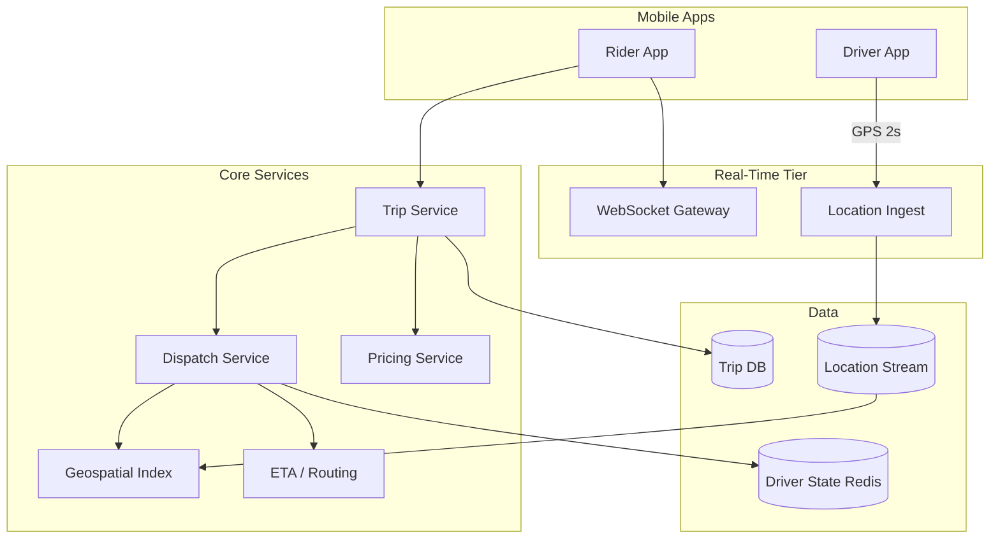
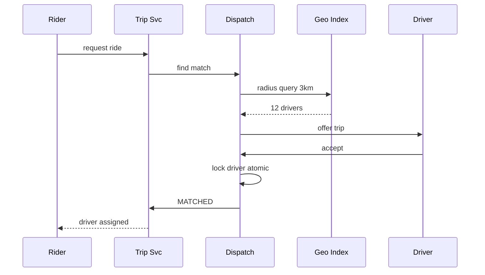
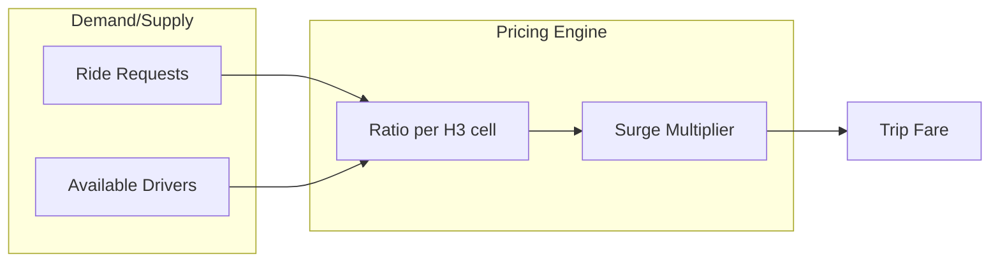

# Ride Sharing Platform

## 1. Executive Summary

A **ride-sharing platform** matches riders with nearby drivers in real time, manages trip lifecycle (request → match → pickup → dropoff → payment), and optimizes supply positioning. Principal-level design covers **geospatial indexing**, **matching algorithms**, **location streaming**, **ETA estimation**, **surge pricing**, and **consistency** under concurrent driver acceptance.

This chapter designs an Uber/Lyft-class system handling millions of concurrent drivers, 1M+ ride requests per hour peak, and sub-second match latency in dense urban markets. Geohash/quadtree indexes, dispatch service with optimistic locking, and explicit degradation during GPS outages are core interview topics.

## 2. Why This Topic Matters

Ride-sharing interviews test real-time systems, geospatial data structures, and marketplace dynamics:

- **Nearest-neighbor search** at scale with moving points.
- **Double-booking prevention** when two riders match one driver.
- **Location update throughput** (GPS every 1–4 seconds × millions).
- **Surge pricing** coupling supply/demand signals.
- **Trip state machine** reliability.

Production failures include wrong matches, pricing riots from surge bugs, and safety incidents from stale driver locations. Review [System Design Methodology](/docs/system-design/system-design-methodology) and [Notification Platform](/docs/system-design/notification-platform).

## 3. Problems Being Solved

| Problem | Solution |
|---------|----------|
| **Find nearby drivers** | Geospatial index; radius query |
| **Fair matching** | Batching; scoring (ETA, rating, fairness) |
| **Real-time location** | WebSocket + stream processing |
| **Prevent double assign** | Transactional driver lock |
| **ETA accuracy** | Routing engine + traffic ML |
| **Surge pricing** | Supply/demand ratio per geofence |
| **Trip tracking** | Trip state machine + location history |
| **Payments** | Integrate payment platform post-trip |

## 4. Assumptions and System Model

**Functional:**

- Rider requests ride with pickup/dropoff.
- System matches driver; both see ETA and route.
- Live trip tracking; cancel before/after match.
- Rating and fare calculation at end.
- Driver go online/offline; accept/reject offers.

**Non-functional:**

- Match latency p99 &lt; 3 s in urban core.
- Location ingest 5M updates/sec global peak.
- Trip state durability 99.999%.
- GPS staleness &gt; 30 s disqualifies driver from match.

| Assumption | Implication |
|------------|-------------|
| **Drivers move continuously** | Index must support frequent updates |
| **Match is competitive** | Atomic driver reservation |
| **City-scale partitioning** | Shard by geohash region |
| **Network flakiness** | Idempotent trip APIs |
| **Safety critical** | Stale location rejection |

## 5. Essential Terminology

| Term | Definition |
|------|------------|
| **Geohash** | Hierarchical spatial encoding string |
| **Quadtree** | Recursive spatial subdivision |
| **H3** | Uber's hexagonal hierarchical geospatial index |
| **Dispatch** | Service assigning rides to drivers |
| **Supply heatmap** | Driver density per area |
| **Surge multiplier** | Price factor when demand &gt; supply |
| **Geofence** | Polygon region for pricing/rules |
| **ETA** | Estimated time of arrival |
| **Trip state machine** | REQUESTED → MATCHED → PICKUP → ONTRIP → COMPLETE |
| **Offer timeout** | Seconds driver has to accept |
| **Ghost driver** | Stale GPS showing available but not |

## 6. Core Mechanism

### 6.1 Architecture



*Figure 1: Location stream feeds geospatial index; dispatch queries nearby available drivers.*

### 6.2 APIs

```
POST /v1/trips { pickup, dropoff, ride_type }
→ { trip_id, status: SEARCHING }

GET /v1/trips/{id}  (poll or WS push)

POST /v1/drivers/location { lat, lng, heading, ts }
POST /v1/drivers/status { online|offline }

POST /v1/drivers/offers/{id}/accept
POST /v1/drivers/offers/{id}/reject

WS /v1/stream  → trip updates, driver location to rider
```

### 6.3 Data Model

**Trip:**

```
trip_id, rider_id, driver_id?, status, pickup, dropoff,
fare_estimate, surge, created_at, matched_at
```

**Driver state (Redis):**

```
driver_id → { lat, lng, heading, status, trip_id?,
  last_update_ts, vehicle_type }
```

**Geospatial index:**

- Redis GEO / custom H3 cell → set of available driver_ids.
- Updated on each location tick if status=available.

### 6.4 Deep Dives

**Matching algorithm:**

1. Rider requests trip; trip service creates SEARCHING record.
2. Dispatch queries GEO: drivers within 3 km radius, status=available, fresh GPS.
3. Score candidates: `score = w1/ETA + w2*rating - w3*idle_time`.
4. Send offer to top driver; 15 s timeout.
5. On accept: atomic `SET driver status=busy IF available` (Lua script).
6. On reject/timeout: next candidate.



*Figure 2: Dispatch offers sequentially with atomic driver lock on accept.*

**Location ingest scale:**

- 2M drivers × 0.5 Hz = 1M updates/sec.
- Partition stream by geohash prefix.
- Consumers update GEO index and trip tracking only.
- Drop updates for offline drivers immediately.

**Surge pricing:**

- Divide city into H3 cells (resolution 7–8).
- Every 5 min: `surge = f(demand_requests / supply_drivers)` per cell.
- Cap surge (e.g., 3×) for regulatory compliance.
- Cache multipliers in Redis; pricing service reads at trip start.



*Figure 3: Per-cell supply/demand ratio drives surge multiplier.*

**ETA service:**

- Precomputed road graph per metro.
- Real-time traffic overlay from historical + live probes.
- Cache route pickup→rider and rider→dropoff on match.

## 7. Step-by-Step Walkthrough

### 7.1 Happy path match

1. Rider requests downtown SF pickup.
2. GEO returns 8 drivers within 2 km; top ETA 4 min.
3. Driver accepts in 8 s; lock succeeds.
4. Rider sees driver approach on map via WS location stream.

### 7.2 Double-booking prevention

1. Two dispatch workers offer same driver (race).
2. First accept sets `busy`; second accept fails lock.
3. Second trip re-dispatches to next driver.

### 7.3 No drivers available

1. GEO returns empty within expanding radius (3→5→8 km).
2. Trip stays SEARCHING; rider sees high ETA estimate.
3. Surge may increase to attract supply.

### 7.5 Scheduled ride dispatch

1. User books airport ride for 6 AM tomorrow.
2. Trip stored `SCHEDULED`; dispatch triggers at T-30 min.
3. At trigger: transition to `SEARCHING`; normal match flow.
4. No driver locked until dispatch window—avoids stale assignment overnight.

### 7.6 Pool ride detour constraints

1. Rider A and B share route with 10% detour cap.
2. Match engine solves constrained optimization—NP-hard at scale; heuristic greedy in production.
3. ETA shown includes pickup order; dynamic re-route on new pool member.

## 7B. Fraud and Safety Signals

| Signal | Action |
|--------|--------|
| GPS teleport &gt; 100 km/min | Exclude from match; fraud review |
| Payment chargeback history | Require prepay |
| Driver rating &lt; 4.0 | Lower match priority—not hard block without policy |
| Rider cancel rate &gt; 50% | Surge prepay or throttle |

Safety architecture crosses engineering, legal, and ops—principal owns cross-functional requirements traceability.

## 10A. Dispatch Queue Depth

During demand spike, requests queue rather than fail:

```
Queue depth 5000 × avg wait 30s → user-visible delay
Max queue policy: expand radius + surge + show honest ETA
Reject new requests only when queue &gt; 15 min estimated wait
```

Honest ETA reduces cancel rate—product metric tied to dispatch architecture.


| Phase | Key decisions |
|-------|---------------|
| Requirements | real-time match, tracking, pricing |
| Scale | 1M loc/sec; city shard |
| APIs | trip CRUD; driver location stream |
| Data | Redis driver state; trip DB |
| Deep dives | atomic lock; geospatial index |

## 8. Invariants and Guarantees

| Property | Guarantee |
|----------|-----------|
| **One active trip per driver** | Enforced by lock |
| **Trip state monotonic** | Valid transitions only |
| **Fare lock** | Surge at request time or pickup—policy explicit |
| **Location freshness** | Stale drivers excluded |
| **Idempotent trip create** | client_request_id dedup |

## 9. Failure Scenarios

| Scenario | Mitigation |
|----------|------------|
| **Dispatch overload** | Queue; expand match radius gradually |
| **GEO index stale** | Stream lag alert; fallback smaller radius |
| **Driver accept timeout** | Offer next; max 5 attempts |
| **Payment failure post-trip** | Trip complete; billing retry + collections |
| **Regional outage** | Failover dispatch region; read-only mode |
| **Surge calculation bug** | Circuit breaker; cap multiplier |

## 10. Performance Characteristics

```
1M rides/day/city × 10 cities = 10M rides/day
Peak hour 3× → ~3500 rides/min/city
Match query: GEO radius &lt; 50 ms
Location write: 1M/sec sharded across 50 Kafka partitions
WebSocket fanout: 500K concurrent trip watchers
```

## 11. Scalability Limits

| Limit | Mitigation |
|-------|------------|
| Dense downtown GEO query | H3 cell pre-aggregation |
| Hot geofence surge | Precompute; local cache |
| Trip DB writes | Shard by city_id |
| WS gateway connections | Horizontal scale; sticky sessions |

## 12. Operational Considerations

- Metrics: match time, cancel rate, supply/demand ratio, GPS staleness %.
- Alerts: zero supply cells; dispatch queue depth.
- Runbooks: disable surge; manual driver reassign.
- City launch playbook: seed supply incentives.

## 13. Security Considerations

- PII minimization in location logs.
- Rider/driver phone number masking.
- Fraud detection: GPS jump, emulator patterns.
- Background check integration for drivers (compliance).
- Rate limit trip requests per rider.

## 14. Cost Considerations

Location ingest and map API calls dominate variable cost. Batch routing requests. Use open map data where licensed. Surge caps reduce regulatory risk vs revenue. Incentives to balance supply are marketing cost, not infra.

## 15. Production Implementations

| System | Notes |
|--------|-------|
| **Uber** | H3 index public; microservices architecture |
| **Lyft** | Similar dispatch patterns |
| **DiDi** | High-scale emerging market constraints |
| **Grab** | Multi-modal expansion |

**Note:** Specific algorithms proprietary; patterns from public engineering talks.

## 16. Alternatives and Tradeoffs

| Approach | Pros | Cons |
|----------|------|------|
| Batch matching (5 s window) | Global optimum | Higher latency |
| Greedy nearest | Fast | Suboptimal fleet util |
| Redis GEO | Simple | Limited at huge scale |
| H3 / geohash cells | Scalable | Tuning resolution |
| Central dispatch | Consistent | Single region bottleneck |
| Peer-to-peer offer broadcast | Decentralized | Chaos at scale |

## 16A. Driver Incentive vs Dispatch Architecture

Surge pricing affects **rider price**; separate **driver incentive** bonuses (quest, heat map) affect supply without always raising rider fare—regulatory and PR sensitivity. Architecture: incentive service writes to driver app feed; pricing service writes rider estimate—decouple to avoid accidental 10× rider charge when boosting driver pay.

## 16B. Simulation and Load Testing

Pre-launch city simulation:

- Inject synthetic GPS streams at target driver density
- Generate ride requests Poisson distribution peak hour
- Measure match time p50/p99 vs supply
- Chaos: kill GEO shard; verify graceful degradation

Simulation does not replace live pilot—human behavior differs—but catches order-of-magnitude capacity errors.

| "GPS always accurate" | Urban canyon, staleness |
| "One DB for locations" | Stream + in-memory index |
| "Surge is greedy only" | Supply incentive function |
| "Match is instant globally" | City-sharded dispatch |

## 18.1 Accessibility and Inclusive Design

Ride-sharing UX must serve users with disabilities: screen reader support for trip status, option to share trip with trusted contact, audio turn-by-turn. Engineering architecture enables via structured trip state API—not only graphical map. Regulatory jurisdictions increasingly mandate accessibility features; treat as non-functional requirement in launch checklist alongside p99 match latency.

## 18. Principal Architect Perspective

- **Atomic driver lock** is safety-critical—test race conditions.
- **Location pipeline** is highest throughput component—design first.
- **Surge** needs governance caps and audit trail.
- **ETA errors** drive cancellations—monitor MAPE.
- **Degrade gracefully** when routing API down—haversine fallback.

## 19. Architecture Review Exercise

**Scenario:** MySQL query `SELECT * FROM drivers WHERE distance < 3km` every request.

**Review:** Replace with GEO index; in-memory driver state; partition by city.

## 20. Whiteboard Explanation

"Drivers stream GPS to a partitioned Kafka topic. Consumers maintain an H3-cell index of available drivers in Redis with last-update timestamps. Rider trip request hits dispatch, which queries neighboring cells, scores by ETA, and offers sequentially. Accept uses atomic Redis Lua to set driver busy. Trip state in durable DB. WebSocket pushes driver location to rider. Surge pricing reads precomputed supply/demand ratios per H3 cell. Stale GPS excludes drivers from matching."

## 21. Interview Questions

1. **Design Uber.** — *Signals:* geo index, dispatch, location stream. *Red flags:* SQL distance scan.
2. **Geohash vs quadtree?** — *Signals:* update cost, query shape. *Follow-up:* H3 benefits.
3. **Prevent double booking?** — *Signals:* atomic lock, transaction.
4. **Scale location updates?** — *Signals:* Kafka partition, batch index update.
5. **Matching algorithm?** — *Signals:* ETA scoring, not just distance.
6. **Surge pricing design?** — *Signals:* per-cell ratio, caps, audit.
7. **Driver rejects offer?** — *Signals:* next candidate, timeout.
8. **Rider cancels after match?** — *Signals:* state machine, driver release.
9. **ETA how computed?** — *Signals:* routing graph, traffic.
10. **Shard by city?** — *Signals:* geo locality, regulations.
11. **Ghost driver problem?** — *Signals:* staleness threshold.
12. **Trip idempotency?** — *Signals:* client_request_id.
13. **WebSocket vs poll?** — *Signals:* WS for live map; poll fallback.
14. **Peak NYE dispatch?** — *Signals:* pre-position supply, queue, surge.

## 21B. Extended Interview Question Deep Dives

**Q15 (Principal):** City council caps surge at 2×; engineering has 5× in config.

*Strong signals:* Geo-fenced rule engine; config per market; audit trail; graceful clamp without error; test in staging with legal matrix. *Red flags:* "Surge is pure algorithm." *Rubric:* 5/5 includes regulatory config layer separate from demand ratio formula.

**Q16 (Principal):** Driver app offline 5 minutes mid-trip—rider sees frozen map.

*Strong signals:* Stale driver exclusion from new matches but trip in progress uses last known + "connection lost" UX; WS reconnect backoff; trip state durable in DB not Redis alone.

2. **Multi-stop trips.** — Ordered waypoints; dynamic re-route.
3. **Regulatory data residency.** — Trip data per country shard.

## 23. Strong Answer Example

**Q:** How to find nearby drivers in 50 ms?

**Outline:** Maintain in-memory geospatial index partitioned by city. Drivers update cell membership on each GPS tick if available. Query uses H3 k-ring around pickup cell to gather candidates, filter by freshness and vehicle type, then score top 20 by ETA from routing cache. No database scan at request time—all hot path in Redis/memory.

## 24. Weak Answer Example

**Weak:** "Query all drivers and sort by distance in application."

**Red flags:** O(n) scan, no scale, no staleness, no locking.

## 25. Hands-On Exercise

1. Implement H3 k-ring driver lookup mock.
2. Atomic busy lock with Redis Lua script.
3. Simulate offer timeout and re-dispatch.
4. Load test 100K location updates/sec to index.
5. **Extension:** Surge calculator from request/driver counts.

## 25A. Extended Hands-On Lab

7. Build surge calculator from CSV of requests/drivers per cell; visualize heatmap.
8. Chaos: freeze GEO index updates 60s; measure match quality degradation.
9. Simulate driver accept race with 100 concurrent threads on same driver_id.
10. **Principal lab:** Draft regulatory matrix of surge caps per city in config schema.

## 25B. Production Readiness Review Questions

- What is rider experience when zero drivers in 8 km radius?
- Can driver reject without penalty abuse throttle?
- Is trip state recoverable if Redis entirely flushed?
- How are safety incidents correlated across logs, metrics, and trip ID?

Ride-sharing launches require ops playbooks beyond happy-path diagrams.

2. Trip state transitions?
3. Surge formula inputs?
4. When exclude driver from match?

## 27. Flashcards

| Front | Back |
|-------|------|
| H3 | Hexagonal hierarchical geospatial index |
| Dispatch | Ride-to-driver assignment service |
| Surge multiplier | Demand/supply price factor |
| Atomic driver lock | Prevents double assignment |
| GPS staleness | Exclude if update too old |
| Geofence | Regional pricing/rules polygon |
| Offer timeout | Window for driver accept |
| Trip state machine | Lifecycle status enforcement |
| k-ring | H3 neighbor cells for search |
| Supply heatmap | Driver density visualization |

## 28. Cheat Sheet

```
REQUIREMENTS: request, match, track, pay, surge
SCALE: 1M GPS/sec; city-sharded dispatch
APIs: trip CRUD; location stream; offer accept
DATA: trip DB; Redis driver+geo; location Kafka
ARCH: ingest → geo index → dispatch → WS
DEEP: atomic lock; ETA scoring; surge cells
RELIABILITY: idempotent trip; state machine
SECURITY: fraud GPS; PII masking
OPS: match latency; supply/demand alerts
```

## 17A. Failure Scenario Drill

Surge pricing bug sets 50× multiplier citywide during routine deploy—regulatory investigation and rider refunds. Mitigation: hard cap 3×; canary deploy pricing rules; shadow mode compare old vs new multiplier 24h before enable. Principal requires **financial impact review** on pricing code same as payment service.

## 18.1 Supply Positioning (Advanced)

Predictive model pre-positions drivers to high-demand cells before event ends—separate ML pipeline feeding driver incentives, not blocking match hot path. Match still uses real-time GEO index; positioning is minutes-ahead optimization.

## 19A. Extended Review Scenario

**Scenario B:** WebSocket gateway single region; cross-region riders see 5s location delay.

**Review:** Regional WS pools; driver location published to rider's region via internal bus; cap cross-region fanout.

## 21A. Additional Interview Questions

15. **Wheelchair accessible vehicle filter?** — *Signals:* attribute filter in GEO query before scoring. *Follow-up:* fallback if none available.
16. **Regulatory cap on surge?** — *Signals:* geo-specific max; audit log of multiplier changes.

## 28A. Principal Interview Deep Dive

### Match radius expansion strategy

Start 2 km → 3 → 5 → 8 km with 2s between expansions; avoid querying 20 km on first attempt (latency + unfair distant assign).

### Location update frequency tradeoff

| Interval | Pros | Cons |
|----------|------|------|
| 1s | Smooth map | 2× ingest vs 2s |
| 4s | Lower cost | Staler match |
| Adaptive | Fast when on trip | Complex |

### Trip state durability

Trip DB is source of truth—Redis driver state ephemeral rebuilt from stream on crash. Never complete payment without durable trip record in `COMPLETE` state.

## 28B. Extended BOE Walkthrough

**Interviewer:** "2M drivers, 50K rides/minute peak in one city."

**Strong candidate:**

"Location: 2M × 0.5 Hz = 1M updates/sec city—Kafka partitioned by geohash.

Match: GEO index H3 cells; query k-ring; score ETA not distance. Atomic Redis lock on accept.

50K rides/min ≈ 833/sec dispatch—each match &lt;50ms index + offer loop.

Surge per H3 cell every 5 min. WS fanout for live map.

Payment post-trip via [Payment Platform](/docs/system-design/payment-platform). Notify via [Notification Platform](/docs/system-design/notification-platform)."

## 29. Related Concepts

- [System Design Methodology](/docs/system-design/system-design-methodology)
- [Notification Platform](/docs/system-design/notification-platform)
- [Payment Platform](/docs/system-design/payment-platform)
- [Chat Platform](/docs/system-design/chat-platform)
- [Distributed Rate Limiter](/docs/system-design/distributed-rate-limiter)
- [Idempotency](/docs/distributed-systems-foundations/idempotency)

## 30. References

- Uber H3 documentation — hexagonal index (open source).
- Uber engineering blog — dispatch and surge posts (implementation anecdotes).
- Kleppmann, *DDIA* — stream processing.

**Distinction:** H3 is open specification; matching scoring is proprietary.

### 30A. Further Reading Paths

Integrate [Distributed Rate Limiter](/docs/system-design/distributed-rate-limiter) on trip request API. Study [Idempotency](/docs/distributed-systems-foundations/idempotency) for trip create dedup.

### 30B. Marketplace Fairness Considerations

Drivers with low acceptance rate may be deprioritized—product policy not just engineering. Document scoring weights and audit for bias (geographic redlining risk if surge ignores underserved areas). Principal architects engage policy/legal on surge caps.

### 30D. Principal Architecture Review Checklist

- [ ] Driver atomic lock tested under concurrent accept race (chaos test)
- [ ] GPS staleness threshold enforced in match query—not post-filter only
- [ ] Surge multiplier hard cap configured per regulatory region
- [ ] Trip state machine transitions validated—no illegal jumps
- [ ] Location ingest partitioned; lag alert &lt; 30s at p99
- [ ] WebSocket + backup poll both operational in mobile clients
- [ ] Fraud signals documented with human review queue SLA
- [ ] Payment integration idempotent post-trip—see [Payment Platform](/docs/system-design/payment-platform)

Ride-sharing combines real-time geo, marketplace fairness, and safety—principal review spans product policy not only QPS math.

### 30F. Closing Principal Note

Ride-sharing systems sit at the intersection of real-time engineering, marketplace economics, and public safety. Technical interviews focus on GEO indexes and locking; production success requires surge governance, accessibility, fraud pipelines, and honest ETA communication when supply is constrained.

### 30G. Regulatory and Market Variation

Launch playbooks must vary by city: some jurisdictions ban surge entirely; others require driver background check data residency. Architecture supports feature flags and config per geofence—not hardcoded global constants. Legal review precedes enabling pricing experiments in new markets.
