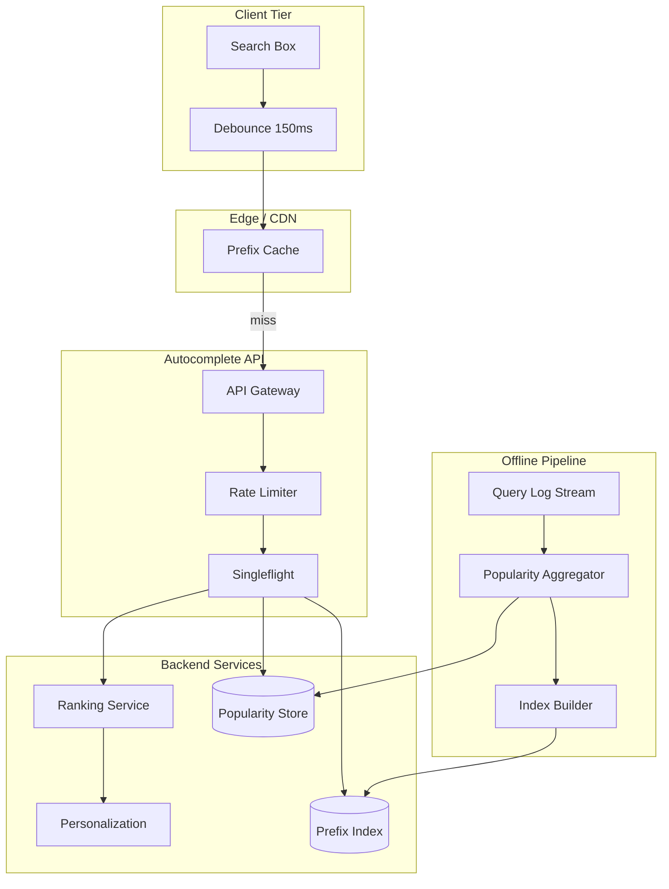
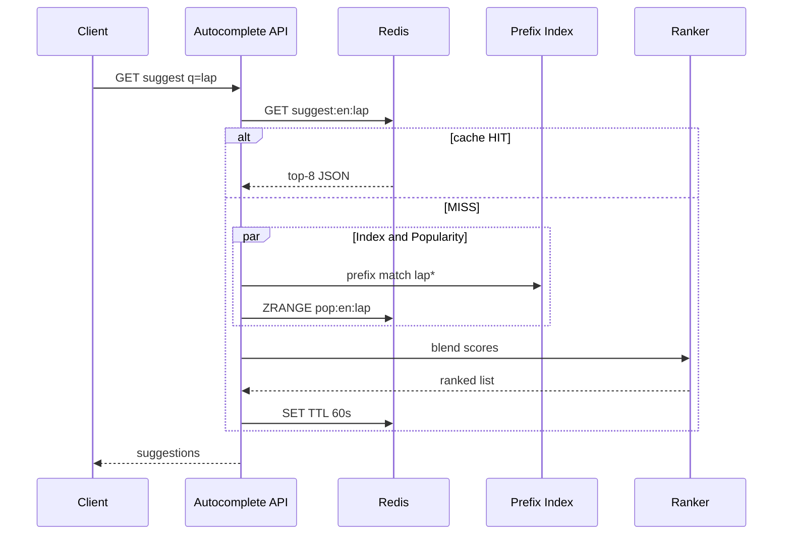
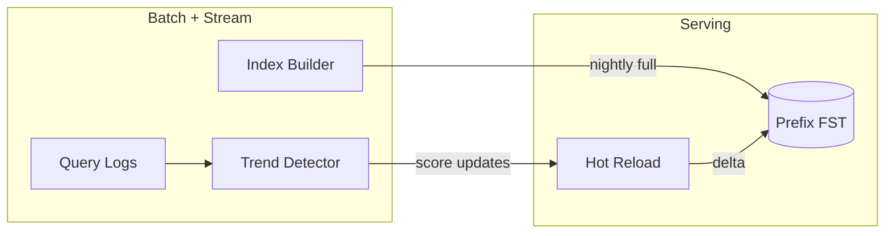

# Search Autocomplete

## 1. Executive Summary

A **search autocomplete** (typeahead) system returns ranked prefix suggestions as a user types, typically within tens of milliseconds, across millions of queries per day. Principal-level design covers **prefix indexing** (trie, n-gram, or inverted index), **ranking** (popularity, personalization, freshness), **caching** at multiple tiers, **debouncing and request coalescing**, and **failure degradation** when the index or ranking service is slow.

This chapter designs a Google/Amazon-class autocomplete serving 500M+ suggestions per day with p99 latency under 50 ms globally. Trie-based or inverted-index prefix retrieval, popularity-weighted ranking, CDN edge caching for top prefixes, and explicit behavior when personalization backends fail are mandatory interview topics—not optional polish.

## 2. Why This Topic Matters

Autocomplete appears in e-commerce, social search, developer tools, and enterprise knowledge bases. Architects must explain:

- Why **prefix trees** or **edge n-grams** beat naive `LIKE 'prefix%'` on relational databases.
- **Ranking signals** and how to blend popularity with personalization without latency blowups.
- **Cache key design** for partial prefixes and per-user variants.
- **Thundering herd** when a trending query spikes.
- **Privacy** implications of logging keystrokes.

Poor autocomplete design causes search abandonment, database overload from prefix scans, and embarrassing suggestions during incidents. Principal reviews ask "what happens when the ranking model is 200 ms behind"—the answer must include static fallback lists and circuit breakers, not only index topology. Review [Caching Fundamentals](/docs/caching/caching-fundamentals) and [System Design Methodology](/docs/system-design/system-design-methodology) before mock interviews on this topic.

## 3. Problems Being Solved

| Problem | Solution |
|---------|----------|
| **Low-latency prefix match** | Trie, inverted index, or dedicated prefix store |
| **Relevance ranking** | Popularity, CTR, personalization blend |
| **High read QPS** | Multi-tier cache; read replicas |
| **Fresh trending queries** | Streaming popularity updates; short TTL |
| **Personalization** | User history sidecar; don't block on miss |
| **Global latency** | Geo-distributed cache; regional index replicas |
| **Abuse / injection** | Rate limits; blocklist; input sanitization |
| **Stale suggestions** | Incremental index updates; versioned cache |

## 4. Assumptions and System Model

### Phase 1: Clarify Requirements

**Functional:**

- Return top-K (typically 5–10) suggestions for prefix string (min length 2–3 chars).
- Support locale, category context (e.g., "products" vs "users").
- Optional: spell correction, trending badge, sponsored slots.
- Log impressions and selections for ranking feedback.

**Non-functional:**

- p99 latency &lt; 50 ms same region; &lt; 150 ms cross-region.
- 50K–500K autocomplete QPS at peak (large retailer scale).
- 99.99% availability for read path.
- Index update latency &lt; 5 minutes for popularity shifts; &lt; 1 hour for new catalog terms.

**Non-goals:** Full-text search results page; complex semantic ranking (separate search service).

| Assumption | Implication |
|------------|-------------|
| **Read-heavy** | Optimize GET path; async index updates |
| **Skewed prefixes** | Cache hot prefixes aggressively |
| **Short prefixes ambiguous** | Require min length; broader matches need better ranking |
| **Eventual consistency OK** | Brief staleness on trending acceptable |
| **User-specific optional** | Personalization must degrade gracefully |

## 5. Essential Terminology

| Term | Definition |
|------|----------|
| **Typeahead** | UI pattern showing suggestions while typing |
| **Prefix search** | Match strings beginning with query prefix |
| **Trie** | Tree structure where each edge is a character |
| **Compressed trie (radix tree)** | Merged single-child paths for memory efficiency |
| **Edge n-gram** | Token substrings indexed for prefix retrieval |
| **Top-K** | K highest-ranked matching suggestions |
| **CTR** | Click-through rate—selection / impression ratio |
| **Debounce** | Client delay before sending request |
| **Singleflight** | Coalesce concurrent identical requests |
| **Bloom filter** | Probabilistic structure for existence checks |
| **Sponsored suggestion** | Paid placement with disclosure |
| **Query log** | Stream of prefixes and selected completions |

## 6. Core Mechanism

### 6.1 Phase 5: High-Level Architecture



*Figure 1: Autocomplete read path with CDN, prefix index, popularity ranking, and offline rebuild pipeline.*

### 6.2 Phase 3: Define APIs

**Autocomplete API:**

```
GET /v1/suggest?q={prefix}&locale=en&category=products&limit=8
→ { suggestions: [{ text, score, type, metadata }], request_id }
```

**Admin / index API:**

```
POST /v1/index/terms  (batch upsert terms with weights)
DELETE /v1/index/terms/{id}
GET /v1/index/health
POST /v1/blocklist    (emergency remove offensive terms)
```

**Analytics callback (client):**

```
POST /v1/events
{ request_id, selected_index, selected_text, prefix }
```

### 6.3 Phase 4: Model Data

**Prefix index (options):**

1. **In-memory trie per shard** — O(prefix length + K log K) retrieval; memory-bound.
2. **Elasticsearch/OpenSearch completion suggester** — FST-based; operational maturity.
3. **RocksDB + custom FST** — Used at very large scale (implementation choice).

**Per suggestion record:**

```
{ term_id, display_text, normalized_text, popularity_score,
  category, locale, last_updated, sponsored_flag }
```

**Popularity store (Redis/KeyDB):**

- Key: `pop:{locale}:{normalized_prefix}` → sorted set of term_ids by score.
- Updated every 1–5 minutes from streaming aggregator.

**Query log (Kafka):**

- `{ timestamp, user_id_hash, prefix, suggestions_shown, selected }`

### 6.4 Phase 6: Deep Dives

**Prefix retrieval algorithm:**

1. Normalize input: lowercase, Unicode NFKC, strip dangerous chars.
2. If prefix length &lt; min_length → return empty or curated defaults.
3. Lookup trie/FST for all terms with prefix (cap candidate set at 100–500).
4. Join popularity scores; apply business rules (blocklist, category filter).
5. Rank: `final_score = α·popularity + β·personalization + γ·freshness`.
6. Return top-K; attach `request_id` for analytics.

**Caching strategy:**

| Tier | Key | TTL |
|------|-----|-----|
| CDN | `suggest:{locale}:{category}:{prefix}` | 60s–300s |
| App Redis | same | 30s–120s |
| In-process LRU | hot prefixes | 5s |

Shorter TTL for short prefixes (more volatile); longer for 4+ char prefixes.

**Personalization without latency spike:**

- Fetch personalization in parallel with index lookup; 10 ms budget.
- On timeout → popularity-only ranking (degrade).
- Never block autocomplete on ML model inference &gt; 20 ms.



*Figure 2: Read path with parallel index and popularity fetch; cache populate on miss.*

**Trending query handling:**

- Spark/Flink job counts prefix selections per minute.
- Boost terms with velocity spike (compare to 7-day baseline).
- Emergency pipeline can inject blocklist updates in &lt; 60s via pub/sub.



*Figure 3: Offline popularity and nightly index rebuild with hot delta reload.*

### 6.5 Index sharding

Shard by `hash(locale + first_char)` or category. Cross-shard prefix queries need fan-out only for global search—usually scoped by category to avoid it. Rebalance using consistent hashing when adding index nodes.

## 7. Step-by-Step Walkthrough

### 7.1 Normal typeahead

1. User types "lapt" after debounce 150 ms.
2. CDN miss; API receives request.
3. Redis miss; prefix index returns 200 candidates starting with "lapt".
4. Popularity ZSET ranks "laptop", "laptop bag", "laptop stand" in top 8.
5. Response in 18 ms; cached in Redis and CDN.

### 7.2 Personalization timeout

1. User with purchase history types "iph".
2. Index returns candidates including "iphone case".
3. Personalization service times out at 10 ms.
4. API returns popularity-ranked list without personalization boost.
5. Log degradation metric; no user-visible error.

### 7.3 Trending spike

1. Celebrity event causes spike in prefix "tayl".
2. Trend detector boosts "taylor swift tickets" within 2 minutes.
3. Hot reload pushes score delta to index servers.
4. Cache keys for "tay", "tayl" invalidated via pub/sub.
5. New suggestions appear without full index rebuild.

### 7.4 Offensive suggestion incident

1. Offensive term enters index via bad vendor feed.
2. Operator adds term to blocklist API.
3. Pub/sub propagates blocklist to all API nodes within 30s.
4. Post-incident: add human review gate on index ingest.

## 7A. Design Phase Summary

| Phase | Section | Key decisions |
|-------|---------|---------------|
| Requirements | §4 | top-K prefix, &lt;50ms, locale |
| Scale | §10 | 500K QPS; CDN + Redis |
| APIs | §6.2 | GET suggest + analytics |
| Data model | §6.3 | FST/trie + popularity ZSET |
| Architecture | §6.1 | edge cache → index + rank |
| Deep dives | §6.4 | degrade personalization |
| Reliability | §8–9 | static fallback lists |
| Security | §13 | rate limit; blocklist |
| Operations | §12 | cache hit ratio; index lag |
| Tradeoffs | §16 | trie vs ES completion |

## 8. Invariants and Guarantees

| Property | Guarantee |
|----------|-----------|
| **Read availability** | Degraded static lists if index down |
| **Consistency** | Eventual; popularity lag 1–5 min |
| **Ordering** | Deterministic rank given same scores |
| **Safety** | Blocklist applied before response |
| **Idempotency** | Read-only suggest API is naturally idempotent |

## 9. Failure Scenarios

| Scenario | Mitigation |
|----------|------------|
| **Index shard down** | Replica failover; partial results |
| **Redis outage** | Direct index query; higher latency |
| **Ranking timeout** | Popularity-only fallback |
| **CDN stale bad suggestion** | Short TTL; emergency purge API |
| **Index builder failure** | Serve previous version; alert |
| **DDoS on suggest API** | Rate limit; CDN absorb |
| **Memory pressure on trie** | Shard; compress; cap candidates |

## 10. Performance Characteristics

### Phase 2: Estimate Scale

```
500M suggestions/day ≈ 6K QPS average
Peak 10× → 60K QPS (plan 100K+ with headroom)
Prefix index lookup: 1–5 ms in-memory FST
Redis GET: 1–2 ms
Ranking blend: 2–5 ms
CDN hit ratio target: 40–60% for top prefixes
```

| Component | p99 budget |
|-----------|------------|
| CDN hit | &lt; 10 ms |
| API + Redis hit | &lt; 25 ms |
| Full miss path | &lt; 50 ms |
| Personalization | &lt; 10 ms (hard cap) |

## 11. Scalability Limits

| Limit | Mitigation |
|-------|------------|
| Trie memory | FST compression; shard by locale |
| Short prefix fan-out | Min length; cap candidates |
| Personalization QPS | Batch features; local cache |
| Global index size | Regional indexes |
| Log ingest volume | Sample non-selected impressions |

## 12. Operational Considerations

### Phase 9: Operations

- Metrics: QPS, p50/p99 latency, cache hit ratio, index lag, degradation rate.
- Alerts: p99 &gt; 100 ms; index version &gt; 2h stale; blocklist sync failure.
- Runbooks: emergency blocklist; CDN purge; rollback index version.
- Dark launch new ranking weights with shadow traffic comparison.

## 13. Security Considerations

### Phase 8: Security

- Rate limit per IP and per session; prevent enumeration attacks.
- Sanitize input; max prefix length 64 chars.
- Do not log raw PII in query logs—hash user IDs.
- Blocklist for offensive, regulated, and legally restricted terms.
- Sponsored suggestions must be labeled; audit trail for compliance.

## 14. Cost Considerations

CDN and Redis dominate at high QPS. Precompute top 10K prefixes per locale nightly into CDN cache.warm files. Index in memory is costly—FST compression reduces RAM 5–10× vs naive trie. Sample query logs at 10% for ranking if volume extreme. Managed OpenSearch completion vs self-hosted FST is ops vs cost tradeoff.

## 15. Production Implementations

| System | Notes |
|--------|-------|
| **Elasticsearch Completion Suggester** | FST-based; common enterprise choice |
| **Redis + custom trie** | Low latency; ops burden |
| **Google Search** | Proprietary; multi-signal ranking |
| **Amazon search suggestions** | Catalog + behavioral blend |
| **Algolia Query Suggestions** | Managed SaaS autocomplete |

**Distinction:** Public descriptions of ranking are implementation anecdotes; latency budgets and degradation paths are architectural requirements regardless of vendor.

## 16. Alternatives and Tradeoffs

### Phase 10: Tradeoffs

| Approach | Pros | Cons |
|----------|------|------|
| In-memory trie | Fastest reads | Memory; rebuild cost |
| ES completion | Ops maturity | Heavier; ms-level latency |
| DB `LIKE prefix%` | Simple | Does not scale past ~1K QPS |
| N-gram index | Fuzzy match | Larger index; false positives |
| Client-only dictionary | Zero latency | Cannot update dynamically |
| Full personalization | Better CTR | Latency and privacy cost |

## 17. Common Misconceptions

| Misconception | Reality |
|---------------|---------|
| "Query DB with LIKE" | Prefix scan does not scale |
| "One global ranking" | Locale and category matter |
| "Always personalize" | Must degrade on timeout |
| "Longer cache TTL always better" | Stale trending and incidents |
| "Trie fits everything in RAM" | Shard or use FST compression |
| "Autocomplete is stateless" | Ranking needs logs and feedback loop |

## 17A. Failure scenario drill

Deploy disables CDN; 60K QPS hits origin; API and index overheat; site search box hangs. Mitigation: CDN is not optional at scale; origin autoscaling with queue depth limits; static fallback JSON per locale. Principal owns **capacity planning** for cache bypass events.

## 18. Principal Architect Perspective

- **Degradation hierarchy:** personalized → popularity → static curated → empty.
- **Min prefix length** prevents expensive 1-char fan-out.
- **Blocklist propagation** is incident-critical—test quarterly.
- **Analytics loop** closes ranking quality; without it suggestions rot.
- **Privacy review** for keystroke logging in regulated industries.
- **Sponsored slots** need product/legal alignment separate from organic rank.

## 19. Architecture Review Exercise

**Scenario:** Autocomplete hits PostgreSQL with `WHERE term LIKE 'prefix%'` at 20K QPS; p99 800 ms.

**Review:** Replace with FST/trie or ES completion; add Redis and CDN; move popularity to streaming aggregator. Load-test prefix "a" separately.

## 20. Whiteboard Explanation

"Client debounces keystrokes and calls suggest API. CDN caches responses for hot prefixes. On miss, API fetches prefix matches from sharded FST index and popularity scores from Redis in parallel. Ranking blends popularity, optional personalization with 10 ms timeout, and freshness boosts. Top 8 returned and cached. Offline pipeline ingests query logs, updates popularity every few minutes, and rebuilds index nightly with hot delta reload. Blocklist pub/sub for emergencies. Personalization failure never blocks the read path."

## 21. Interview Questions

1. **Design autocomplete for Amazon-scale search.** — *Signals:* trie/FST, CDN, popularity ranking. *Red flags:* SQL LIKE.
2. **Trie vs Elasticsearch completion?** — *Signals:* latency, ops, memory. *Follow-up:* when ES wins.
3. **How to rank suggestions?** — *Signals:* popularity, CTR, personalization blend. *Red flags:* alphabetical only.
4. **Handle trending queries?** — *Signals:* streaming counts, velocity boost, cache invalidation.
5. **Min characters before suggest?** — *Signals:* fan-out cost vs UX. *Follow-up:* "a" prefix problem.
6. **Personalization without latency hit?** — *Signals:* parallel fetch, timeout, degrade.
7. **Cache key design?** — *Signals:* locale, category, prefix normalization.
8. **Prevent offensive suggestions?** — *Signals:* blocklist, ingest review, fast purge.
9. **Shard prefix index?** — *Signals:* locale/category; avoid cross-shard fan-out.
10. **Measure suggestion quality?** — *Signals:* CTR, null-selection rate, A/B tests.
11. **Debounce on client or server?** — *Signals:* client debounce; server rate limit.
12. **What if index is 1 hour stale?** — *Signals:* hot reload path; popularity still fresh.
13. **Deduplicate concurrent requests?** — *Signals:* singleflight per prefix.
14. **Spell correction in autocomplete?** — *Signals:* separate fuzzy layer; latency budget.

## 22. Interview Follow-Ups

1. **Multi-language prefixes.** — Unicode normalization; per-locale indexes.
2. **Sponsored suggestions.** — Separate auction slot; disclosure; do not break latency.
3. **Federated autocomplete across entities.** — Parallel queries; merge ranks.

## 23. Strong Answer Example

**Q:** How do you handle a sudden trending prefix?

**Outline:** Stream query logs into sliding-window counter; compare rate to baseline; boost matching terms in popularity store. Invalidate CDN/Redis keys for affected prefixes via pub/sub. Hot-reload score deltas without full index rebuild. Cap boost to prevent irrelevant terms gaming trend detector. Monitor null-selection rate after boost.

## 24. Weak Answer Example

**Weak:** "Store all searches in MySQL and SELECT WHERE term LIKE prefix%."

**Red flags:** No indexing structure, no cache, no ranking, no scale math, no degradation.

## 25. Hands-On Exercise

1. Build compressed trie with top-K retrieval for 100K terms.
2. Add Redis cache layer; measure hit ratio on Zipf prefix distribution.
3. Simulate personalization timeout; verify fallback ranking.
4. Implement singleflight for identical concurrent prefixes.
5. **Extension:** Stream aggregator updating popularity every 60s.
6. **Extension:** A/B test two ranking weights; compare CTR.

## 26. Knowledge Check (extended)

1. Why FST over naive trie?
2. What three signals blend in ranking?
3. Why cap candidate set before top-K?
4. How blocklist propagates in &lt; 60s?
5. CDN hit ratio target and why not 99%?
6. Debounce value tradeoff?

## 27. Flashcards

| Front | Back |
|-------|------|
| FST | Finite state transducer; compressed prefix index |
| Typeahead debounce | Client delay reducing request spam |
| Popularity ZSET | Redis sorted set for ranked terms |
| Min prefix length | Limits fan-out for ambiguous short queries |
| Singleflight | Coalesce duplicate in-flight suggest requests |
| Degrade path | popularity-only when personalization times out |
| CTR | Clicks / impressions for suggestion quality |
| Hot reload | Delta index update without full rebuild |
| Blocklist pub/sub | Fast offensive term removal |
| Edge n-gram | Alternative indexing for fuzzy prefix |
| Request coalescing | Same as singleflight at API layer |
| Static fallback | Curated JSON when index unavailable |

## 28. Cheat Sheet

```
REQUIREMENTS: top-K prefix, <50ms p99, locale, analytics
SCALE: CDN + Redis + sharded FST; 100K+ QPS peak
APIs: GET /suggest; POST /events; blocklist admin
DATA: FST/trie shards; popularity ZSET; query log Kafka
ARCH: debounce → CDN → API → index + rank parallel
DEEP: ranking blend; personalization timeout; trending boost
RELIABILITY: replica index; static fallback; circuit breaker
SECURITY: rate limit; blocklist; PII hashing in logs
OPS: cache hit ratio; index version; shadow ranking tests
TRADEOFFS: trie vs ES; personalization vs latency
```

## 28A. Principal Interview Deep Dive

### Latency budget table

| Stage | Budget |
|-------|--------|
| Network client→CDN | 5–15 ms |
| CDN hit | 5 ms total |
| API gateway | 2 ms |
| Index lookup | 5 ms |
| Popularity fetch | 3 ms |
| Rank + serialize | 5 ms |
| Personalization (optional) | 10 ms max |

### When NOT to personalize

- Guest users without identity.
- Latency SLO already at risk.
- Regulated contexts prohibiting behavioral profiling.
- Cold-start users with no signal.

### Prefix length policy

| Length | Behavior |
|--------|----------|
| 0–1 | Empty or curated defaults only |
| 2 | Top global suggestions; heavy cache |
| 3+ | Full prefix index query |

## 28B. Extended BOE Walkthrough (Interview Script)

**Interviewer:** "Design autocomplete for Amazon search—500M suggestions per day."

**Strong candidate:**

"500M/day ≈ 6K QPS average; peak 10× → 60K QPS. Each request returns top-8 from prefix index—assume 200 byte response → ~10 MB/sec egress, modest.

I'll shard prefix index by locale and first character. Hot prefixes ('lap', 'iph') cached at CDN with 60–120s TTL; origin Redis for miss. Ranking blends popularity ZSET updated every 2 min from Kafka query logs, optional personalization with 10 ms timeout.

Personalization failure → popularity-only—never block suggest path. Min prefix length 2 chars to limit fan-out. Blocklist pub/sub for offensive terms under 60s.

Scale math: if 50M unique prefixes active, FST compressed ~5–10 bytes per term edge—fits RAM on modest cluster; QPS not memory-bound at this scale. Stampede on cache expiry handled by singleflight per prefix key at API.

Failure: index down → static curated JSON per locale; metrics on degradation rate. Link to [Distributed Cache Design](/docs/system-design/distributed-cache-design) for cache-aside patterns on popularity store."

## 29. Related Concepts

- [System Design Methodology](/docs/system-design/system-design-methodology)
- [Caching Fundamentals](/docs/caching/caching-fundamentals)
- [Distributed Caching](/docs/caching/distributed-caching)
- [News Feed](/docs/system-design/news-feed)
- [Distributed Cache Design](/docs/system-design/distributed-cache-design)
- [Elasticsearch](/docs/distributed-databases/overview)
- [Observability Fundamentals](/docs/observability/observability-fundamentals)

## 30. References

- Bast and Hirst — query completion surveys (academic).
- Elasticsearch completion suggester — official documentation (implementation).
- Kleppmann, *DDIA* — stream processing for analytics.

**Distinction:** FST theory is well-established; production ranking blends are implementation-specific and require A/B validation.

### 30A. Further Reading Paths

Deepen with [Distributed Caching](/docs/caching/distributed-caching) for popularity store design. Compare prefix search requirements to [News Feed](/docs/system-design/news-feed) ranking—both blend popularity with personalization but feed tolerates 100ms+ while autocomplete requires &lt;50ms. Lab: measure cache hit ratio on Zipf prefix distribution; plot tail latency with and without CDN.

### 30B. Interview Scoring Rubric (Principal)

| Dimension | Strong (4–5) | Weak (1–2) |
|-----------|--------------|------------|
| Scale estimation | QPS, cache tiers, index RAM | Hand-wavy "use cache" |
| Ranking | Multi-signal blend + degrade | Alphabetical sort |
| Failure modes | Blocklist, static fallback | "Index always up" |
| Tradeoffs | FST vs ES with criteria | Single solution |
| Operations | Cache purge, trending pipeline | No ops mention |
