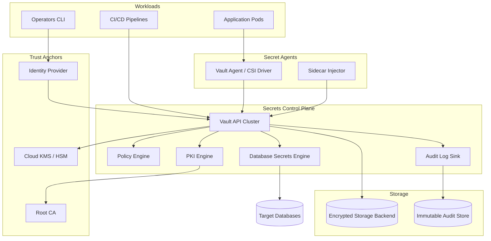
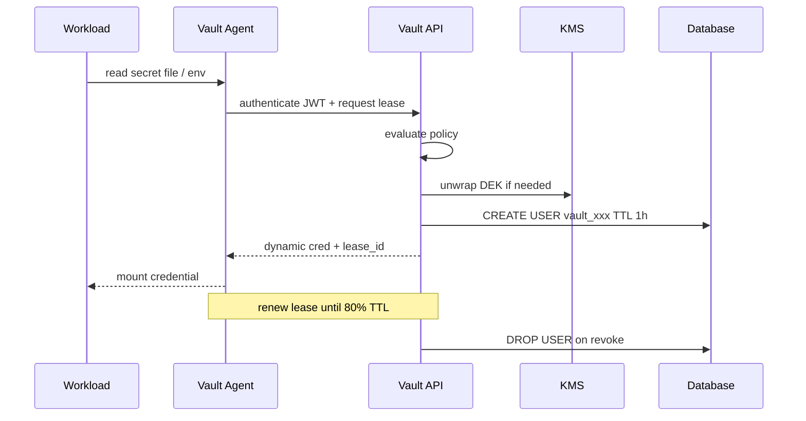
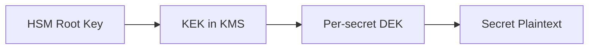

# Secrets Management Platform

## 1. Executive Summary

A **secrets management platform** is the centralized control plane for **credential lifecycle**—generation, storage, distribution, rotation, revocation, and audit—across applications, infrastructure, and human operators. Unlike configuration stores that hold non-sensitive settings, secrets platforms enforce **encryption at rest**, **least-privilege access**, **dynamic credentials** with short time-to-live (TTL), and **immutable audit logs** for every read and write.

Principal architects design secrets platforms when organizations outgrow `.env` files, Kubernetes Secrets encoded in etcd, or shared password spreadsheets. A mature platform integrates with **identity** (workload and human), **certificate authorities** for mTLS, **cloud KMS** for envelope encryption, and **CI/CD** for bootstrap without long-lived keys in pipelines. The reference architecture below supports 10,000+ workloads, sub-100 ms secret fetch p99 for cached paths, and **zero standing privilege** for database credentials through dynamic issuance.

Safety properties: no secret plaintext in logs, no secret duplication across regions without explicit replication policy, and **revocation propagation** within defined SLAs. Liveness: applications must degrade gracefully when the secrets backend is unavailable—via cached leases, not static fallbacks that violate policy.

## 2. Why This Topic Matters

Secrets failures cause disproportionate breaches relative to their code footprint:

- **Leaked API keys** in Git history remain exploitable for years.
- **Shared database passwords** prevent attribution during incidents.
- **Stale credentials** survive employee offboarding.
- **Blast radius** expands when one secret unlocks many systems.

Principal interviews test whether candidates understand **dynamic secrets**, **encryption hierarchy**, and **operational rotation**—not merely "use HashiCorp Vault." Follow-up questions on split-brain during regional outage, Kubernetes sidecar vs CSI driver injection, and emergency break-glass access separate staff-level tool familiarity from principal-level platform design.

## 3. Problems Being Solved

| Problem | Platform capability |
|---------|---------------------|
| **Static credentials in repos** | Central vault; Git secret scanning |
| **Long-lived DB passwords** | Dynamic credentials per session |
| **Certificate sprawl** | Internal PKI with auto-renewal |
| **Audit gaps** | Who accessed which secret when |
| **Rotation without downtime** | Dual-credential window; lease overlap |
| **Multi-cloud key management** | KMS integration; BYOK patterns |
| **Break-glass access** | Time-bound elevated paths with approval |
| **Compliance** | SOC2/PCI evidence from access logs |

## 4. Assumptions and System Model

### Functional requirements

- `GetSecret(path, identity)` with policy evaluation.
- `IssueDynamicCredential(role, ttl)` for databases, cloud IAM.
- `RotateSecret(path)` with versioning and grace period.
- `RevokeLease(lease_id)` for immediate invalidation.
- PKI: issue and renew X.509 certificates for workloads.
- Namespace isolation per team/environment.

### Non-functional requirements

- **Availability:** 99.95% for secret read path (cached).
- **Latency:** p99 &lt; 50 ms for hot secrets (agent cache).
- **Durability:** secrets survive AZ loss; RPO near-zero for metadata.
- **Audit:** 100% of access logged; tamper-evident retention 7+ years.
- **Security:** encryption at rest with HSM-backed root; no admin plaintext view by default.

| Assumption | Implication |
|------------|-------------|
| **Workloads have identity** | SPIFFE/SPIRE, IAM roles, K8s SA JWT |
| **Apps tolerate TTL** | Connection pool refresh; retry on auth failure |
| **Humans use SSO + MFA** | OIDC auth to vault UI/CLI |
| **Network is hostile** | mTLS between agents and control plane |
| **Compromise is possible** | Short TTL limits blast radius |

**Non-goals:** Replace full configuration management; store non-secret config in Consul/etcd/Parameter Store.

## 5. Essential Terminology

| Term | Definition |
|------|------------|
| **Secret** | Sensitive credential (password, key, token, cert) |
| **Static secret** | Pre-provisioned value with manual rotation |
| **Dynamic secret** | Generated on demand; auto-revoked at TTL |
| **Lease** | Time-bound grant to use a secret |
| **KMS** | Key Management Service—envelope encryption root |
| **HSM** | Hardware Security Module—root key protection |
| **PKI** | Public Key Infrastructure—certificate lifecycle |
| **SPIFFE** | Secure Production Identity Framework for Everyone |
| **Break-glass** | Emergency access with extra logging and approval |
| **Shamir unseal** | Split master key shares for vault bootstrap |
| **Envelope encryption** | DEK encrypted by KEK in KMS |
| **Standing privilege** | Persistent access—minimize via dynamic creds |

## 6. Core Mechanism

### 6.1 High-level architecture



*Figure 1: Secrets platform—identity-bound access, engines for dynamic issuance, KMS-wrapped storage, immutable audit.*

### 6.2 Access flow



*Figure 2: Dynamic database credential—short TTL, automatic revocation at lease end.*

### 6.3 Encryption hierarchy



*Figure 3: Envelope encryption—compromise of storage backend does not expose secrets without KMS/HSM.*

**Policy example (HCL concept):**

```
path "database/creds/app-read" {
  capabilities = ["read"]
  allowed_entity_ids = ["spiffe://prod/payments/api"]
}
```

### 6.4 Deep dives

**Static secret rotation:**

1. Write `secret_v2` alongside `secret_v1` in versioned path.
2. Notify consumers via event; grace window 24–72 hours.
3. Deprecate `v1`; audit confirms zero reads.
4. Destroy `v1` after retention policy.

**Kubernetes integration patterns:**

| Pattern | Pros | Cons |
|---------|------|------|
| **CSI driver** | No sidecar; kube-native volume | Pod restart on rotation |
| **Sidecar agent** | Hot reload via shared volume | Extra container per pod |
| **External Secrets Operator** | GitOps-friendly CRDs | Another component to secure |
| **Init container only** | Simple | Stale creds until restart |

**Unseal and disaster recovery:**

- Auto-unseal via cloud KMS in primary region.
- Shamir ceremony for DR region bootstrap.
- Replication: performance replicas for read scaling; DR replicas with lag monitoring.

## 7. Step-by-Step Walkthrough

### 7.1 Application bootstrap

1. Pod starts with projected K8s SA JWT.
2. Vault Agent authenticates via `kubernetes` auth method.
3. Agent requests `database/creds/payments-api` with TTL 1 hour.
4. Vault creates `v-token-abc` on PostgreSQL with `GRANT SELECT`.
5. Agent writes connection string to `/vault/secrets/db` with `0640` perms.
6. App reads on startup; agent renews lease at 80% TTL.

### 7.2 Operator break-glass

1. Operator requests emergency path via PAM integration.
2. Manager approves in ticketing system; webhook grants 15-minute policy.
3. All reads logged to SIEM with ticket correlation.
4. Lease auto-revokes; post-incident review mandatory.

### 7.3 Rotation incident

1. CI key leaked in public fork.
2. Security revokes lease globally; rotates static version.
3. Event bus notifies services; agents refresh within minutes.
4. Forensics uses audit log to determine if key was exfiltrated.

### 7.4 Regional failover

1. Primary vault cluster unavailable.
2. DR replica promoted; RPO measured from replication lag dashboard.
3. Workloads fail over DNS; agents re-authenticate.
4. **Principal decision:** accept brief read-only mode vs split-brain writes.

## 8. Invariants and Guarantees

| Property | Type | Mechanism |
|----------|------|-----------|
| **No secret in audit log plaintext** | Safety | Audit hash only |
| **Policy deny by default** | Safety | Explicit grant paths |
| **Lease expiry** | Safety | TTL + revocation API |
| **Encryption at rest** | Safety | KMS envelope |
| **AuthN before AuthZ** | Safety | All paths authenticated |
| **Liveness of reads** | Liveness | Agent cache; replica reads |

## 9. Failure Scenarios

| Scenario | Mitigation |
|----------|------------|
| Vault cluster down | Agent cache serves until TTL; queue writes |
| KMS unavailable | Pre-unsealed barrier keys; alert P0 |
| Rotation race | Dual-version grace; idempotent consumers |
| Policy misconfiguration | CI policy tests; staging namespace |
| Rogue admin | MFA; dual control; no default root token |
| Replication lag | Monitor lag; freeze promotion threshold |
| App ignores TTL | Connection pool validator; max connection age |
| etcd backup contains K8s Secret | Migrate to CSI + external vault |

## 10. Performance Characteristics

```
10,000 workloads × 1 secret read/min = ~167 RPS control plane
Peak deploy: 10× burst → 1,700 RPS (horizontal API replicas)
Dynamic DB cred: +50ms for CREATE USER (amortized per pool)
Agent local cache: &lt;1ms read after initial lease
Audit: async sink to Kafka → SIEM (don't block hot path)
```

| Path | Target |
|------|--------|
| Cached static read p99 | &lt; 5 ms (agent) |
| Dynamic issuance p99 | &lt; 100 ms |
| Rotation propagation | &lt; 5 min org-wide |
| Revocation | &lt; 60 s effective |

## 11. Scalability Limits

| Limit | Mitigation |
|-------|------------|
| Storage backend write rate | Sharded namespaces; rate limits |
| PKI issuance rate | Intermediate CA pool |
| Database CREATE USER rate | Connection pooling; longer TTL tradeoff |
| Audit volume | Tiered storage; sampling for health checks only |
| Policy evaluation | Compiled policy cache |

## 12. Operational Considerations

- **SLO:** 99.95% secret read availability; 0 tolerance for audit loss.
- Dashboards: lease count, auth failure rate, replication lag, rotation age.
- Runbooks: unseal ceremony, KMS key rotation, emergency revoke-all.
- Game days: vault down + app behavior; break-glass drill quarterly.
- On-call: P0 for audit pipeline gap; P1 for primary cluster unavailable.
- Certificate expiry alerts 30/14/7 days before PKI leaf expiration.

## 13. Security Considerations

- Root token eliminated after bootstrap; use entity-based admin.
- Namespace isolation: `prod` cannot read `staging` paths.
- mTLS between all agents and API nodes.
- Secret zeroization in memory where possible.
- Threat model: insider admin, compromised workload identity, supply chain in CI.
- Integrate with [Zero Trust Architecture](/docs/security/zero-trust-architecture)—secrets are one pillar, not the whole model.
- PCI: CDE credentials never in application config repos.

## 14. Cost Considerations

Vault Enterprise licensing vs open-source + operational burden. KMS API costs per encrypt/decrypt—batch where possible. HSM clusters expensive but required for some regulatory tiers. Engineering cost of migration from static secrets often exceeds license—plan phased rollout by blast radius (payments first).

**Hidden costs:** Database user churn from short TTL; SIEM ingestion of audit logs; on-call expertise for unseal/DR.

## 15. Production Implementations

| System | Pattern |
|--------|---------|
| **HashiCorp Vault** | Multi-engine; industry reference |
| **AWS Secrets Manager** | Native IAM integration |
| **GCP Secret Manager** | Per-secret IAM; CMEK |
| **Azure Key Vault** | HSM-backed keys |
| **SPIFFE/SPIRE + cert-manager** | Identity + cert rotation |

## 16. Alternatives and Tradeoffs

| Decision | Tradeoff |
|----------|----------|
| Dynamic vs static DB creds | Security vs DB user churn |
| Short vs long TTL | Blast radius vs renewal traffic |
| Central vault vs cloud-native | Portability vs integration depth |
| Sidecar vs CSI | Hot reload vs simplicity |
| Auto-unseal vs Shamir | Ops convenience vs insider risk |
| Multi-region active-active | Complexity vs RTO |

## 17. Common Misconceptions

| Misconception | Reality |
|---------------|---------|
| "K8s Secrets are encrypted" | etcd encryption optional; RBAC often too broad |
| "Vault solves zero trust" | Identity and network policy still required |
| "Rotation = change one file" | Consumers must handle dual-version window |
| "Long TTL is fine internally" | Lateral movement exploits standing privilege |
| "Audit logs are optional" | Compliance and forensics depend on them |
| "CI needs permanent admin key" | OIDC federation with short-lived tokens |

## 18. Principal Architect Perspective

- **Treat secrets as temporal**, not permanent configuration.
- **Identity is the perimeter**—bind every secret read to workload attestation.
- **Design rotation into the application contract** before mandating dynamic creds.
- **Audit is a product feature**, not logging afterthought.
- **Break-glass must be rare, loud, and reviewed**—not shared root password.
- Partner with security for KMS key ceremony and compliance mapping.

## 19. Architecture Review Exercise

**Scenario:** Team stores production DB password in GitHub Actions secrets and rotates manually yearly.

**Review:** Standing privilege; no per-workload attribution; leak in fork history. Propose Vault dynamic creds + OIDC auth for CI + Git secret scanning + 90-day max TTL policy.

## 20. Whiteboard Explanation

"Workloads authenticate with SPIFFE or K8s JWT to our vault cluster. Policies grant least-privilege paths. Database credentials are dynamic—vault creates a user with one-hour TTL and revokes on lease end. Static API keys are versioned with rotation grace periods. All access hits immutable audit logs in SIEM. Encryption uses KMS envelope with HSM root. Agents cache leases and renew at eighty percent TTL. If vault is down, cached creds work until expiry—we never fall back to hardcoded passwords. Break-glass goes through approval with fifteen-minute elevated policy."

## 21. Interview Questions

1. **Design secrets platform for 5,000 microservices.** — *Signals:* identity, dynamic creds, audit, K8s patterns. *Red flags:* env vars in git.
2. **Dynamic vs static database credentials?** — *Signals:* TTL, revocation, pool refresh. *Follow-up:* DB load from user churn.
3. **How rotate secrets without downtime?** — *Signals:* dual version, grace window, events. *Red flags:* big-bang swap.
4. **Vault HA across regions?** — *Signals:* replication, RPO/RTO, split-brain. *Red flags:* active-active writes everywhere.
5. **Kubernetes secret injection options?** — *Signals:* CSI, sidecar, ESO tradeoffs.
6. **What happens when vault is down?** — *Signals:* agent cache, TTL bounds, degrade policy.
7. **Break-glass access design?** — *Signals:* approval, time-bound, audit. *Red flags:* shared root.
8. **Envelope encryption explain?** — *Signals:* DEK/KEK, KMS, HSM. *Red flags:* master key in config.
9. **CI/CD bootstrap without long-lived keys?** — *Signals:* OIDC, ephemeral tokens. *Red flags:* PAT in repo.
10. **Detect secret leak in Git?** — *Signals:* scanning, revocation, rotation. *Red flags:* delete commit only.
11. **PKI for service mesh?** — *Signals:* intermediate CA, short leaf TTL, renewal. *Red flags:* manual certs.
12. **Compliance evidence for SOC2?** — *Signals:* access logs, policy reviews, rotation proof.

## 22. Interview Follow-Ups

1. **Database rejects rapid CREATE USER.** — Longer TTL + pooler; dedicated vault DB role limits.
2. **Multi-cloud single vault vs per-cloud?** — Portability vs latency; data residency constraints.
3. **Compromised workload identity.** — Revoke leases; narrow policy; SPIFFE attestation hardening.

## 23. Strong Answer Example

**Q:** How do you rotate an API key used by 200 services without outage?

**Outline:** Store versioned secret `api-key` with `v1` and `v2` active. Publish rotation event. Services read both versions during grace window (72h)—accept either for inbound validation, use `v2` for outbound. Monitor metrics for `v1` usage. After zero `v1` reads for 24h, disable `v1`. Audit confirms completion. Never embed keys in images—pull from agent at runtime.

## 24. Weak Answer Example

**Weak:** "Put secrets in AWS Secrets Manager and rotate every 90 days manually."

**Red flags:** No workload identity binding, no dynamic creds, no dual-version strategy, no audit forensics, manual rotation at scale fails.

## 25. Hands-On Exercise

1. Deploy Vault dev mode; enable `database` secrets engine against PostgreSQL.
2. Configure K8s auth; deploy sample app with Vault Agent sidecar.
3. Verify dynamic user appears in `pg_user` and disappears after lease revoke.
4. Simulate vault outage; measure app behavior until TTL expiry.
5. **Extension:** Policy-as-code test denying cross-namespace read.
6. **Extension:** Export audit log to local SIEM mock; alert on break-glass path.

## 26. Knowledge Check

1. What is the difference between a lease and a secret version?
2. Why deny-by-default policies?
3. Name three K8s integration patterns.
4. What triggers vault unseal?
5. How does envelope encryption protect stored ciphertext?
6. What is standing privilege?
7. Why log secret access but not values?
8. RPO consideration for vault replication?
9. When prefer static over dynamic credentials?
10. What is break-glass and when is it appropriate?
11. How do SPIFFE IDs bind to vault policies?
12. PCI implication of secrets in CI logs?

## 27. Flashcards

| Front | Back |
|-------|------|
| Dynamic secret | Generated on demand; auto-revoked |
| Lease TTL | Max credential lifetime |
| Envelope encryption | DEK wrapped by KMS KEK |
| Shamir unseal | Split master key shares |
| Break-glass | Emergency time-bound access |
| Standing privilege | Persistent cred—minimize |
| Vault Agent | Sidecar/cache/renewal |
| PKI engine | Automated cert issuance |
| Policy path | ACL on secret namespace |
| Auto-unseal | KMS unwraps master key |
| Revocation | Immediate lease invalidation |
| SPIFFE ID | Workload identity URI |

## 28. Cheat Sheet

```
REQUIREMENTS: store, distribute, rotate, revoke, audit
SCALE: 10K workloads; agent cache; horizontal API replicas
AUTH: K8s JWT / SPIFFE / OIDC for humans
ENGINES: KV v2, database dynamic, PKI, cloud IAM
ENCRYPTION: HSM → KMS → DEK → secret
K8S: CSI driver | sidecar agent | ESO
ROTATION: dual version + grace + metrics
FAILURE: agent cache until TTL; no static fallback
SECURITY: deny default; mTLS; audit immutable
OPS: replication lag; cert expiry; game days
```

## 28A. Principal Interview Deep Dive

### Threat model walkthrough

Principal candidates should articulate **who attacks what** in a secrets platform:

| Threat actor | Attack vector | Control |
|--------------|---------------|---------|
| External attacker | Stolen CI API key | Short TTL; vault-backed rotation; no long-lived keys |
| Compromised pod | Read `/proc` or env dumps | Sidecar file permissions; no env injection of secrets |
| Malicious insider | Export all secrets via admin API | Dual control; audit; no bulk export by default |
| Supply chain | Malicious Helm chart exfiltrates vault token | Signed charts; minimal SA permissions |
| Ransomware | Encrypt storage backend | KMS-wrapped ciphertext useless without keys |

**Safety property:** A secret value never appears in audit logs, metrics labels, or distributed traces—only path hashes and lease IDs. **Liveness property:** Applications continue operating on cached leases during vault control-plane degradation until TTL expiry; this is an explicit product decision documented in runbooks, not an accident.

### Multi-region replication tradeoffs

| Mode | RPO | Use case |
|------|-----|----------|
| Performance replication | Near-zero read lag | Global read scaling |
| DR replication | Minutes (async) | Regional disaster |
| Active-active writes | Complex conflict handling | Rare; most vault deployments avoid |

Principal architects document **split-brain write policy**: when primary and DR both accept writes, data divergence is possible—prefer single-writer primary with automatic failover after quorum confirmation. Game day: promote DR replica while primary simulates AZ loss; measure RTO for application lease renewal storm.

### PCI and secrets scoping workshop deliverable

For payment platforms, the architecture deliverable is a **data-flow diagram** showing:

1. Where cardholder data environment (CDE) boundaries exist.
2. Which services touch PAN vs token only.
3. Which secrets paths map to CDE credentials.

Cross-reference [Payment Platform](/docs/system-design/payment-platform) PCI scope reduction. Principal owns diagram for annual QSA review—not security team alone.

### Back-of-envelope: lease renewal storm

```
10,000 pods × 1-hour TTL → full renewal wave every hour if aligned
Mitigation: jitter renewal at 80% TTL ± 10% random
Renewal RPS: 10,000 / (0.2 × 3600) ≈ 14 RPS average—manageable
Misaligned deploy: 10,000 simultaneous renewals → 10,000 RPS spike
Fix: stagger pod start times; exponential backoff on 503 from vault
```

### Interview red-flag phrases

- "We encrypt secrets in the database" (who holds the key?)
- "Kubernetes Secrets are fine with RBAC" (etcd backup exposure; broad SA defaults)
- "Root token in break-glass drawer" (should be Shamir + PAM workflow)
- "Rotation is ops runbook" (without dual-version consumer contract)

## 29. Related Concepts

- [Security Architecture Fundamentals](/docs/security/security-architecture-fundamentals)
- [Zero Trust Architecture](/docs/security/zero-trust-architecture)
- [Kubernetes Architecture](/docs/kubernetes-and-platform-engineering/kubernetes-architecture)
- [Platform Engineering and GitOps](/docs/kubernetes-and-platform-engineering/platform-engineering-and-gitops)
- [Identity Platform](/docs/system-design/identity-platform)
- [Payment Platform](/docs/system-design/payment-platform) — PCI credential isolation
- [Distributed Tracing](/docs/observability/distributed-tracing) — trace secret fetch latency

## 30. References

- HashiCorp Vault documentation — engines, auth methods, replication (implementation choices).
- NIST SP 800-57 — key management recommendations (formal guidance).
- SPIFFE/SPIRE specifications — workload identity (standards).
- OWASP Secrets Management Cheat Sheet — operational practices.
- AWS KMS envelope encryption documentation — cloud pattern.

**Distinction:** Ledger invariants are mathematical; PCI requirements are regulatory; PSP behaviors are vendor-specific.

### 30A. Further reading paths

Essential companions: [Zero Trust Architecture](/docs/security/zero-trust-architecture) for identity-bound access patterns, [Identity Platform](/docs/system-design/identity-platform) for workload JWT auth to vault, [Kubernetes Architecture](/docs/kubernetes-and-platform-engineering/kubernetes-architecture) for CSI driver patterns. Contrast static secret rotation with dynamic database credentials in [Payment Platform](/docs/system-design/payment-platform)—both need idempotency but secrets focus on lease TTL not ledger balance.

**Lab extension:** Deploy Vault with `kv-v2` and `database` engines; write integration test asserting lease revocation drops DB user within 60 seconds. **Interview drill:** whiteboard envelope encryption and Shamir unseal ceremony without consulting notes—principal bar expects fluent explanation of key hierarchy and blast radius of compromised KMS vs compromised storage backend.
