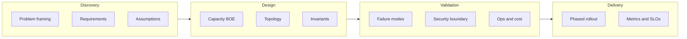
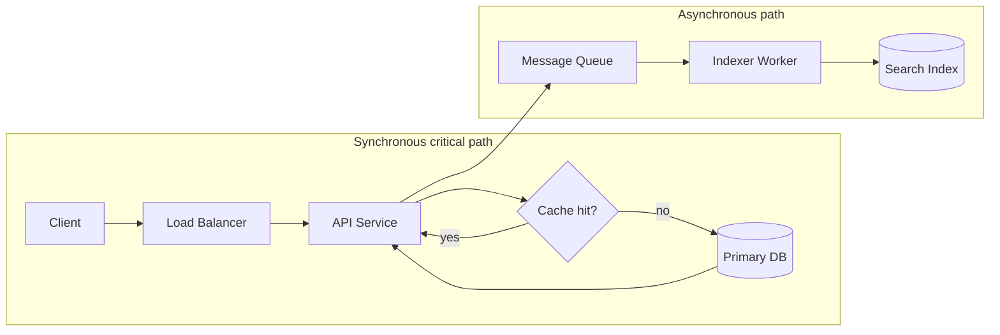
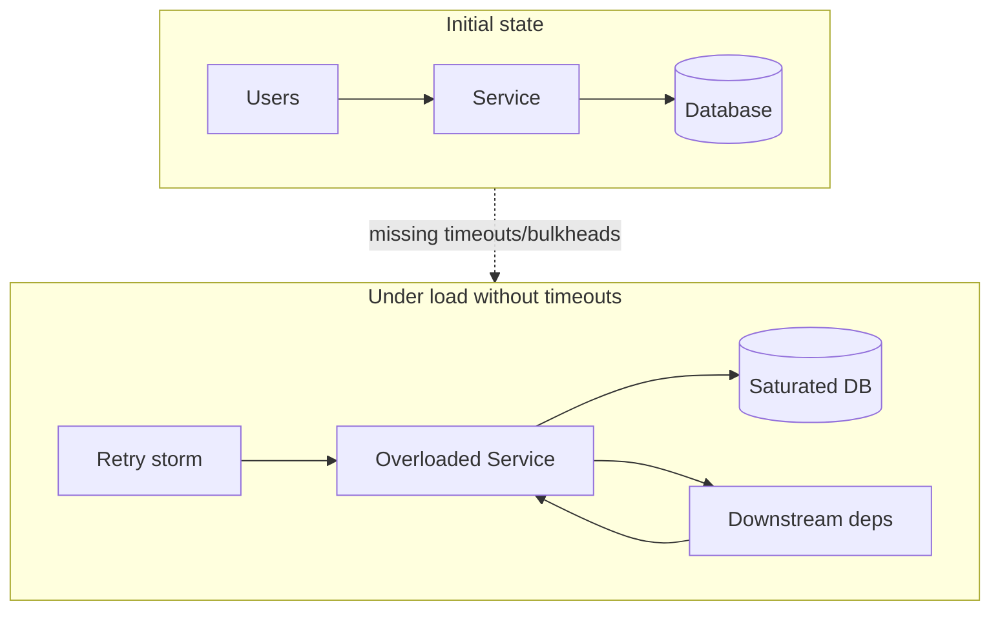

# System Design Methodology

## 1. Executive Summary

**System design methodology** is the structured process principal architects use to translate ambiguous business problems into durable, operable distributed systems. Unlike junior interview exercises that optimize for drawing boxes quickly, principal-level design demands explicit **requirements elicitation**, **constraint surfacing**, **quantitative reasoning**, **failure-mode analysis**, and **organizational alignment** before committing to an architecture.

A robust methodology proceeds through phases: clarify goals and non-goals; enumerate functional and non-functional requirements (NFRs); estimate scale with back-of-envelope calculations; identify critical paths and bottlenecks; propose a candidate architecture with explicit tradeoffs; validate against failure scenarios, security boundaries, and cost; and define an incremental delivery path with observability and rollback. The output is not a diagram—it is a **decision record** that stakeholders can challenge, operate, and evolve.

This chapter presents a repeatable framework used in both **staff/principal interviews** and **production architecture reviews**, with emphasis on distributed-systems reasoning, explicit guarantees, and the communication patterns that separate senior engineers from architects who influence organizations.

## 2. Why This Topic Matters

System design is the primary evaluation axis for principal and distinguished engineer loops at major technology companies. Interviewers assess whether candidates can:

- Drive clarity when requirements are underspecified.
- Reason about **partial failure**, consistency, and availability without hand-waving.
- Quantify capacity and cost rather than asserting "we'll scale horizontally."
- Identify operational burden, migration risk, and team topology implications.
- Communicate tradeoffs to technical and non-technical audiences.

In production, weak methodology produces over-engineered platforms, silent single points of failure, and architectures that meet slide-deck NFRs but fail under real traffic shapes. Strong methodology aligns engineering investment with business risk and creates audit trails for future maintainers.

## 3. Problems Being Solved

| Problem | Methodology response |
|---------|---------------------|
| **Ambiguous requirements** | Structured questioning; documented assumptions |
| **Premature optimization** | Scale estimates before deep design |
| **Invisible tradeoffs** | Explicit alternatives and decision criteria |
| **Operational blind spots** | Runbooks, SLOs, and failure injection in design |
| **Interview time pressure** | Prioritized depth on critical path |
| **Organizational misalignment** | Stakeholder map and phased delivery |
| **Architecture drift** | ADRs, review gates, and fitness functions |

Methodology does not replace creativity—it **channels** it toward decisions that survive contact with production.

## 4. Assumptions and System Model

| Assumption | Design implication |
|------------|-------------------|
| **Partial failure is normal** | No silent dependencies; timeouts and bulkheads |
| **Requirements will change** | Modular boundaries; migration paths |
| **Operators are human** | Observability, safe defaults, runbooks |
| **Security is not optional** | Threat model early, not as appendix |
| **Cost is a constraint** | Unit economics in capacity planning |
| **Teams own services** | Conway's law shapes service boundaries |
| **Data outlives code** | Schema evolution and retention policies |

**Interview model:** 45–60 minutes, whiteboard or collaborative doc, interviewer as product owner and skeptic.

**Production model:** Multi-week discovery, cross-functional review, phased rollout with measurable success criteria.

## 5. Essential Terminology

| Term | Definition |
|------|------------|
| **Functional requirement (FR)** | What the system must do (features, APIs) |
| **Non-functional requirement (NFR)** | How well: latency, availability, durability, compliance |
| **Back-of-envelope (BOE)** | Order-of-magnitude capacity estimate |
| **Critical path** | Sequence determining end-to-end latency or throughput |
| **Bottleneck** | Resource limiting system capacity |
| **SLI/SLO/SLA** | Indicator, objective, contractual agreement on reliability |
| **Blast radius** | Scope of impact when a component fails |
| **CAP/PACELC** | Frameworks for consistency-availability-latency tradeoffs |
| **Fitness function** | Automated check that architecture constraints hold |
| **Strangler fig** | Incremental migration pattern |
| **C4 model** | Context, container, component, code documentation levels |
| **ADR** | Architecture Decision Record |
| **MVP vs. target state** | Minimum viable vs. long-term architecture |
| **Error budget** | Allowed unreliability before feature freeze |

## 6. Core Mechanism

### 6.1 The PRACTICE framework

Principal architects often use a phased checklist:

1. **P**roblem framing — Restate the problem in one sentence; list non-goals.
2. **R**equirements — FRs, NFRs, compliance, multi-tenancy.
3. **A**ssumptions — Explicit; mark for verification.
4. **C**apacity — BOE: QPS, storage, bandwidth, fan-out.
5. **T**opology — High-level components and data flows.
6. **I**nvariants — Safety, consistency, idempotency guarantees.
7. **C**onstraints — Latency budgets, regions, cost ceilings.
8. **E**volution — Phases, risks, observability, rollback.



*Figure 1: System design methodology phases—from discovery through validated delivery.*

### 6.2 Requirements depth ladder

| Level | Questions |
|-------|-----------|
| **L0 — Vague** | "Design Twitter" |
| **L1 — Scoped** | Read-heavy feed; 100M DAU; eventual consistency OK for likes |
| **L2 — Quantified** | p99 read < 200ms; 10K write QPS peak; 7-year retention |
| **L3 — Constrained** | GDPR delete within 30 days; multi-region active-active; $X/month cap |

Always climb the ladder before drawing databases.

### 6.3 Capacity estimation template

```
Daily active users (DAU)     → 10M
Actions per user per day     → 20
Peak factor                  → 3× average
Write QPS (peak)             ≈ (10M × 20 × 3) / 86400 ≈ 7K
Read/write ratio             → 100:1 → read QPS ≈ 700K
Storage per object           → 2 KB
Annual growth                → 30%
```

Document units, peak vs. average, and which assumptions dominate.

### 6.4 Architecture decision pattern

For each major choice, document:

- **Options considered** (at least two).
- **Decision criteria** (latency, ops burden, team skill, vendor lock-in).
- **Chosen option** and **rejected** alternatives with reasons.
- **Consequences** — what becomes easier and harder.

This mirrors [Architecture Decision Records](/docs/architecture-leadership/architecture-decision-records).

### 6.5 Critical path and dependency diagram

Interviewers and reviewers expect you to identify which components sit on the **latency-critical path** and which can fail asynchronously without blocking user-visible progress.



*Figure 2: Separating synchronous read path from asynchronous indexing—search lag is a product decision, not an accidental outage.*

### 6.6 Depth allocation in timed interviews

| Time remaining | Prioritize |
|----------------|------------|
| **> 20 min** | BOE validation, one deep dive (consistency or scaling) |
| **10–20 min** | API + data model + single failure mode |
| **< 10 min** | State invariants, bottlenecks, wrap-up with tradeoffs |

Principal candidates **signal prioritization explicitly**: "Given time, I'd deep-dive replication; for now I'll state assumptions."

## 7. Step-by-Step Walkthrough

### 7.1 Interview scenario: design a URL shortener

**Step 1 — Frame (3 min):** "Shorten URLs, redirect on access, optional analytics. Non-goals: custom domains for MVP."

**Step 2 — Requirements (5 min):** 100M URLs/month created; 10:1 read/write; p99 redirect < 50ms; URLs must not be guessable.

**Step 3 — BOE (5 min):** ~40 creates/sec average, ~400 peak; ~4K reads/sec peak. 7-char base62 → ~3.5T space. Storage: 100M × 500B ≈ 50 GB/month.

**Step 4 — API sketch:** `POST /urls` → `{short}`; `GET /{short}` → 302 to long URL.

**Step 5 — Data model:** `(short_code PK, long_url, created_at, owner_id)`. Index on short_code for O(1) lookup.

**Step 6 — ID generation:** Counter + base62 vs. hash (collision risk) vs. random (check uniqueness). **Choose** distributed ID or DB sequence with range allocation.

**Step 7 — Caching:** CDN + Redis for hot keys; cache-aside on miss.

**Step 8 — Failure modes:** DB down → stale cache serves; ID generator partition → retry with backoff.

**Step 9 — Deep dive (interviewer choice):** Analytics pipeline, custom aliases, or global latency.

### 7.2 Production scenario: architecture review gate

1. Distribute pre-read: context, BOE, diagrams, ADRs.
2. Review meeting: 10 min presentation, 40 min challenge.
3. Required artifacts: SLO draft, threat model summary, cost estimate, rollout plan.
4. Outcomes: approve, approve with conditions, or request revision.

## 8. Invariants and Guarantees

System design methodology does not guarantee optimal architecture—it guarantees **traceable reasoning**:

| Property | Meaning in methodology |
|----------|------------------------|
| **Safety (design)** | Documented invariants (e.g., "no duplicate charges") |
| **Liveness (design)** | Progress paths under failure (retries, failover) |
| **Consistency model** | Explicit per operation (linearizable vs. eventual) |
| **Durability** | RPO/RTO stated with mechanism (replication, backups) |
| **Idempotency** | Client and server retry semantics defined |

Separate **formal guarantees** (from chosen algorithms) from **design intent** (we aim for 99.9% availability).

## 9. Failure Scenarios

| Failure | Design response |
|---------|----------------|
| **Underspecified requirements** | State assumptions; ask clarifying questions |
| **Single point of failure** | Identify during review; add redundancy or accept risk |
| **Thundering herd** | Caching, request coalescing, jittered backoff |
| **Hot partition** | Sharding strategy, salting, async rebalancing |
| **Cascading failure** | Timeouts, bulkheads, circuit breakers |
| **Data loss** | Replication factor, backup verification |
| **Security breach** | Least privilege, encryption, audit logs |
| **Cost overrun** | FinOps review; right-sizing; tiered storage |
| **Team cannot operate** | Reduce complexity; improve tooling and docs |
| **Interview rabbit hole** | Time-box; return to critical path |

Always ask: "What happens when this component is slow or dead?"

### 9.1 Cascading failure without guardrails



*Figure 3: Retry storms and missing bulkheads convert partial failure into full outage—design reviews must name backoff and timeout budgets.*

Document **failure budgets** alongside performance budgets: maximum acceptable error rate during dependency degradation.

## 10. Performance Characteristics

Methodology improves **decision quality**, not raw latency. Performance of the process itself:

| Activity | Typical duration |
|----------|------------------|
| Interview deep design | 45–60 min |
| BOE | 5–15 min |
| Production discovery | 1–4 weeks |
| Architecture review | 1–2 hours per iteration |
| ADR authoring | 1–4 hours |

**Throughput of good decisions** scales with reusable patterns, reference architectures, and platform teams—not with reinventing per project.

## 11. Scalability Limits

| Limit | Cause |
|-------|-------|
| **Human review bandwidth** | Too many bespoke designs |
| **Analysis paralysis** | Perfectionism before MVP |
| **Template rigidity** | Applying microservices to every problem |
| **Missing data** | BOE based on guesses |
| **Conway friction** | Org structure fights service boundaries |

Mitigation: tiered design rigor (lightweight for low-risk; full review for critical paths), platform abstractions, and measured production feedback loops.

## 12. Operational Considerations

Design is incomplete without operations:

- **Observability:** Metrics, logs, traces aligned to user journeys and SLOs.
- **Deployment:** Blue/green, canary, feature flags; rollback criteria.
- **Runbooks:** On-call playbooks for top failure modes.
- **Capacity planning:** Growth triggers for scale-out.
- **Incident learning:** Postmortems feed back into methodology.
- **Ownership:** Clear service owners and escalation paths.

Principal architects embed **Day 2 operations** in Day 1 design.

Operational readiness checklist for any design review:

| Artifact | Question answered |
|----------|-------------------|
| **Service level objectives** | What does "working" mean numerically? |
| **Dashboards** | Can on-call see user-impacting symptoms in one screen? |
| **Runbooks** | What are the top three failure procedures? |
| **Deployment strategy** | How roll back in < 15 minutes? |
| **Capacity triggers** | At what queue depth or CPU do we scale? |
| **Ownership** | Who is paged at 3 a.m.? |

Skipping this table in production design is how teams ship **demoware** that becomes **toilware**.

## 13. Security Considerations

Threat modeling belongs in core design, not as a checkbox:

- **Trust boundaries:** Internet, DMZ, internal services, data stores.
- **Authentication and authorization:** Perimeter vs. zero trust.
- **Data classification:** PII, secrets, encryption at rest and in transit.
- **Supply chain:** Dependencies, SBOM, signed artifacts.
- **Abuse cases:** Rate limiting, bot detection, resource exhaustion.

Document **STRIDE** or **PASTA** outcomes at appropriate depth for risk tier.

## 14. Cost Considerations

| Driver | Estimation approach |
|--------|---------------------|
| **Compute** | Instance hours × peak/average utilization |
| **Storage** | GB/month × replication factor × retention |
| **Egress** | Cross-AZ and internet bandwidth |
| **Managed services** | Per-request or per-GB pricing |
| **People** | Operational toil hours |

Compare **unit economics** (cost per transaction, per user) across options. A cheaper component that triples ops headcount may lose.

## 15. Production Implementations

| Pattern | Where seen |
|---------|------------|
| **Well-Architected Reviews** | AWS, Azure, GCP frameworks |
| **Architecture review boards** | Enterprise engineering governance |
| **RFC culture** | Meta, large open-source projects |
| **Platform golden paths** | Internal developer portals |
| **SRE error budgets** | Google-inspired reliability governance |
| **Domain-Driven Design** | Bounded contexts for service boundaries |

These are **implementation choices** for governance—not universal best practices. Match rigor to blast radius.

## 16. Alternatives and Tradeoffs

| Approach | Strength | Weakness |
|----------|----------|----------|
| **Top-down (NFR-first)** | Aligns with business | Slow for exploration |
| **Bottom-up (component-first)** | Fast prototyping | Misses systemic issues |
| **Reference architecture copy** | Speed, proven patterns | Misfit to constraints |
| **Evolutionary architecture** | Adapts over time | Requires discipline |
| **Big design upfront** | Clarity for large programs | Risk of wrong bets |

Principal architects **blend**: BOE and invariants upfront; defer implementation detail where uncertainty is high.

## 17. Common Misconceptions

| Misconception | Reality |
|---------------|---------|
| "More boxes = better design" | Clarity and justified boundaries matter |
| "We'll use Kafka for everything" | Match messaging to consistency needs |
| "Microservices always scale" | Operational cost dominates |
| "CAP means pick two forever" | PACELC: latency tradeoffs under normal conditions |
| "Interview design = production design" | Interviews compress time; production needs ADRs and ops |
| "NoSQL because scale" | Relational systems scale enormously with right schema |
| "Skip BOE; cloud scales" | Cost and limits still exist |

## 18. Principal Architect Perspective

- **Start with the decision, not the database.** What must be true for the business?
- **Name the consistency model** for each write path.
- **Quantify one bottleneck** even if rough.
- **Identify the team that will operate this** in year two.
- **Prefer boring technology** on the critical path unless differentiation demands otherwise.
- **Document rejected options**—they prevent relitigation.
- **Treat design as a social process**, not a solo optimization problem.

## 19. Architecture Review Exercise

**Scenario:** A team proposes moving a monolithic order service to 15 microservices before Black Friday. Current pain: slow deploys (weekly). Proposed: event-driven choreography with Kafka.

**Your review tasks:**

1. List assumptions and missing NFRs (peak QPS, consistency for orders).
2. Identify blast radius of partial Kafka outage during checkout.
3. Propose a phased approach (strangler on read paths first?).
4. Define success metrics and rollback triggers.
5. Decide: approve, conditional approve, or defer.

**Strong signals:** Saga/outbox for order-payment consistency; idempotent consumers; SLO for checkout path; team ownership map.

## 20. Whiteboard Explanation

"Principal system design starts by narrowing the problem and making assumptions explicit. I estimate scale to know if we're handling thousands or millions of requests per second—that drives sharding and caching. I sketch components on the critical path and state consistency and durability requirements per operation. I walk through failure modes: what if the cache, database, or queue is down? I compare at least two options with tradeoffs, pick one with clear rationale, and describe how we'd roll out incrementally with metrics and rollback. The goal is a design operators can run and leaders can fund."

## 21. Interview Questions

1. **How do you start a system design interview?** — Clarify requirements, scope, non-goals.
2. **What NFRs do you always ask about?** — Latency, availability, durability, consistency, scale, cost.
3. **Walk through a BOE for X.** — Show work; state assumptions.
4. **How do you choose SQL vs. NoSQL?** — Access patterns, consistency, ops, team skill.
5. **Design a rate limiter.** — Token bucket; distributed store; race conditions.
6. **How handle hot keys?** — Sharding, local cache, read replicas, async aggregation.
7. **Explain CAP in your design.** — Partition behavior; explicit choice.
8. **How ensure idempotency?** — Idempotency keys, dedup store, exactly-once semantics discussion.
9. **Multi-region strategy?** — Active-active vs. active-passive; conflict resolution.
10. **How phase a migration from monolith?** — Strangler, dual-write, feature flags.
11. **What observability do you add?** — SLIs, tracing on critical path, alerting on SLO burn.
12. **When would you reject microservices?** — Small team, unclear boundaries, high coordination cost.

## 22. Interview Follow-Ups

1. **Your cache fails open or closed?** — Tradeoff: availability vs. stale/dangerous data.
2. **How detect duplicate payment?** — Idempotency key + unique constraint.
3. **Leader dies mid-transaction?** — Fencing, epoch numbers, or external coordinator.
4. **10× traffic overnight?** — Auto-scale limits, DB connection pool, queue backpressure.
5. **Compliance: right to erasure?** — Tombstones, async purge, CDN invalidation.

## 23. Strong Answer Example

**Question:** "Design a notification system for 50M users."

**Strong outline:** "I'll clarify: push, email, SMS, or all? Real-time vs. batched? I'll assume multi-channel, p99 delivery under 30s for push, at-least-once with idempotent consumers. BOE: 50M users, 5 notifications/user/day average, 2× peak → ~6K notifications/sec peak. API accepts notification requests, validates, writes to durable queue partitioned by user_id for ordering per user. Workers per channel with rate limits to providers. Template service for content; preference store for opt-outs—GDPR delete async. Idempotency key on send prevents duplicates. DLQ for failures with retry policy. Metrics: delivery latency per channel, provider error rate, queue lag. I'd start single-region with multi-AZ, add region failover in phase 2. Tradeoff: Kafka vs. SQS—Kafka if we need replay and high throughput; SQS for simpler ops at lower scale."

## 24. Weak Answer Example

**Weak:** "Use Kafka, microservices, Redis, and Kubernetes. Scale horizontally."

**Red flags:** No requirements, no numbers, no failure modes, buzzword stack, no tradeoffs.

## 25. Hands-On Exercise

1. Pick a system you know (e.g., internal CI, e-commerce checkout).
2. Write one-page problem statement with FRs and NFRs.
3. Perform BOE for QPS, storage, and bandwidth.
4. Draw context and container diagram (C4 level 1–2).
5. List five failure scenarios and mitigations.
6. Write a mini-ADR for one contentious choice.
7. Peer review: can another engineer operate this from your doc alone?

## 26. Knowledge Check

1. What is the difference between an SLI and an SLO?
2. Name three questions to ask before choosing a database.
3. What is a strangler fig pattern?
4. How do you estimate peak QPS from DAU?
5. What belongs in an explicit assumption list?
6. Define blast radius.
7. When is eventual consistency acceptable?
8. What is an error budget?
9. Why document rejected alternatives?
10. What is the critical path in a design?
11. How does Conway's law affect service boundaries?
12. What separates L2 from L3 requirements depth?

## 27. Flashcards

| Front | Back |
|-------|------|
| PRACTICE framework | Problem, Requirements, Assumptions, Capacity, Topology, Invariants, Constraints, Evolution |
| BOE purpose | Order-of-magnitude validation before deep design |
| NFR examples | Latency, availability, durability, compliance, cost |
| Critical path | Sequence determining end-to-end performance limit |
| Strangler fig | Incrementally replace legacy by routing traffic to new system |
| Blast radius | Scope of impact when a component fails |
| Idempotency | Repeated requests produce same effect as one |
| PACELC extension | If Partition, choose A or C; else Latency vs. Consistency |
| ADR purpose | Record context, decision, consequences |
| Error budget | Allowed unreliability before reliability work takes priority |
| Fitness function | Automated architectural constraint check |
| Hot key mitigation | Shard, cache, replicate, aggregate async |

## 28. Cheat Sheet

```
INTERVIEW FLOW (45-60 min)
  5 min  — clarify FR/NFR, non-goals
  5 min  — BOE (QPS, storage, bandwidth)
  15 min — high-level API + data model + diagram
  15 min — deep dive (interviewer choice)
  5 min  — failure modes, scaling, wrap-up

BOE
  peak_QPS ≈ (DAU × actions/day × peak_factor) / 86400
  storage ≈ objects × size × retention × replication

ALWAYS STATE
  consistency model per write path
  durability (RPO/RTO mechanism)
  idempotency / retry semantics
  single points of failure

TRADEOFF TABLE
  option | pros | cons | why rejected/chosen
```

## 29. Related Concepts

- [What Is a Distributed System?](/docs/distributed-systems-foundations/what-is-a-distributed-system) — foundational model
- [CAP Theorem](/docs/consistency/cap-theorem) — partition tradeoffs
- [PACELC](/docs/consistency/pacelc) — latency vs. consistency
- [Idempotency](/docs/distributed-systems-foundations/idempotency) — retry-safe design
- [Architecture Decision Records](/docs/architecture-leadership/architecture-decision-records) — documenting choices
- [Executive Communication](/docs/architecture-leadership/executive-communication) — presenting designs to leadership
- [Global File Transfer Platform](/docs/system-design/global-file-transfer-platform) — applied large-scale design

## 30. References

### Primary sources (formal and pedagogical)

- Kleppmann, M. (2017). *Designing Data-Intensive Applications.* O'Reilly. [Data modeling, replication, stream processing]
- Ongaro, D., & Ousterhout, J. (2014). *In Search of an Understandable Consensus Algorithm.* USENIX ATC. [Example of explicit safety reasoning]
- Brewer, E. (2012). CAP twelve years later. *Computer.* [Partition tolerance framing]

### Industry frameworks (implementation choices)

- AWS Well-Architected Framework: https://aws.amazon.com/architecture/well-architected/
- C4 Model (Simon Brown): https://c4model.com/
- Google SRE Workbook — error budgets and SLOs

### Books

- Ford, N., Richards, M., Sadalage, P., & Dehghani, Z. (2021). *Fundamentals of Software Architecture.* O'Reilly.
- Bass, L., Clements, P., & Kazman, R. (2012). *Software Architecture in Practice.*

### Distinction

- **Formal guarantees** — From algorithms you select (consensus, isolation levels).
- **Implementation choices** — Review boards, RFC templates, cloud frameworks.
- **Operational experience** — BOE accuracy improves with production feedback; verify assumptions in your context.
