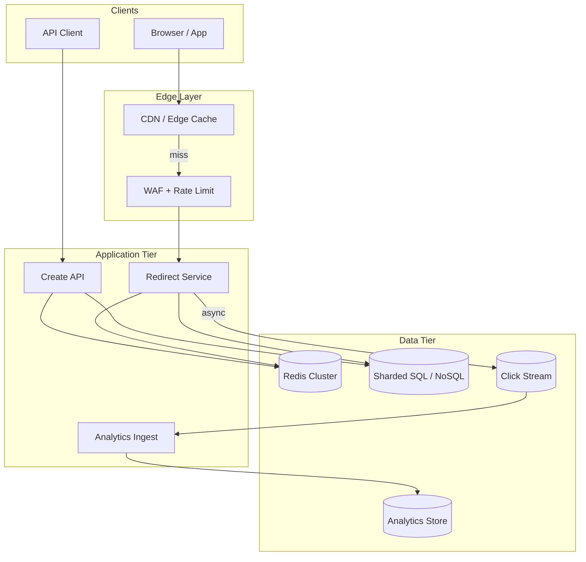
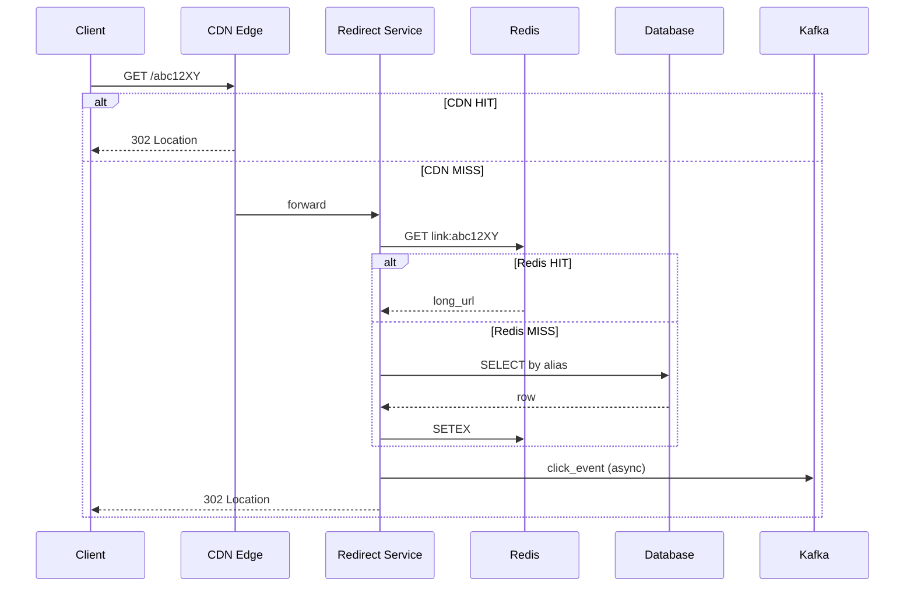
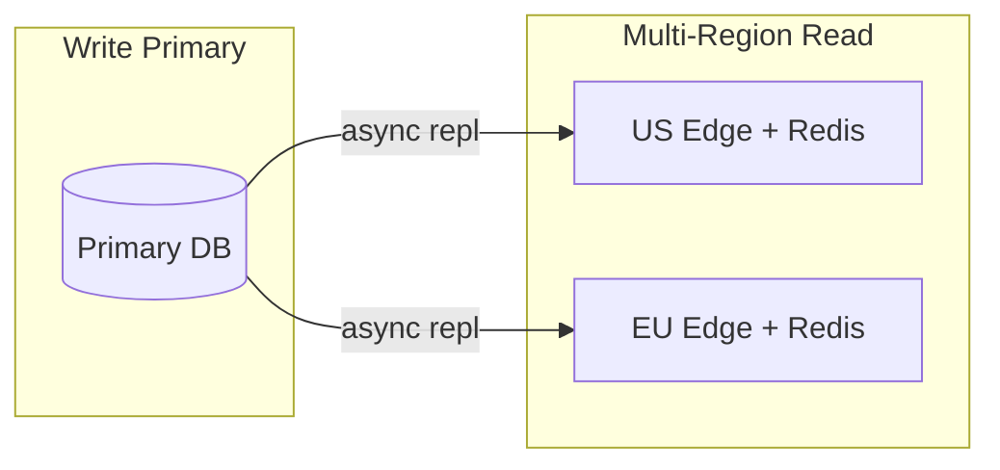

# URL Shortener

## 1. Executive Summary

A **URL shortener** maps long URLs to compact, shareable aliases and resolves those aliases with low latency on redirect. At principal level, the exercise tests whether you can separate **write path** (create short link, rare) from **read path** (redirect, dominant), choose an **ID generation strategy** without centralized bottlenecks, and reason about **cache hierarchy**, **analytics**, and **abuse** without over-engineering.

This chapter presents a reference design for a global shortener handling billions of redirects per day, custom domains, optional expiration, and click analytics—using explicit design phases (requirements through tradeoffs) mapped into the standard 30-section curriculum structure.

## 2. Why This Topic Matters

URL shorteners appear in staff and principal loops because they compress many distributed-systems themes into a bounded problem:

- **Read-heavy skew** — viral links dominate traffic; caching strategy is the design.
- **ID allocation** — counters vs. hashes vs. snowflakes; collision and predictability tradeoffs.
- **Latency SLOs** — redirects must be sub-10 ms at the edge; database on critical path is unacceptable.
- **Abuse and security** — phishing, malware, SSRF via preview endpoints.
- **Multi-tenancy** — enterprise custom domains and branded short links.

Production systems in this class include Bitly, TinyURL patterns, and internal link wrappers at large enterprises. Failures manifest as redirect outages (revenue and trust impact), ID collisions, or security incidents from unmoderated URLs.

## 3. Problems Being Solved

| Problem | Capability |
|---------|------------|
| **Long URLs unwieldy** | Compact alias (e.g., 7-char base62) |
| **Redirect latency** | Edge cache + CDN; minimal hops |
| **Unique alias generation** | Distributed ID or hash-with-retry |
| **Custom branding** | Per-tenant domain + namespace |
| **Analytics** | Async click stream; aggregation |
| **Expiration / revocation** | TTL metadata; cache invalidation |
| **Abuse** | URL blocklists, rate limits, safe browsing |
| **Durability** | Mapping survives restarts; replicated store |

## 4. Assumptions and System Model

### Phase 1: Clarify Requirements

**Functional requirements (in scope):**

- Create short URL from long URL; optional custom alias, expiration, password.
- HTTP 301/302 redirect on GET; support HEAD for metadata.
- Optional analytics dashboard: clicks by time, referrer, geography.
- API for programmatic creation (authenticated tenants).

**Non-functional requirements:**

- Redirect p99 latency &lt; 50 ms globally (edge); create p99 &lt; 200 ms.
- Availability 99.99% for redirect path.
- Durability: no lost mappings once acknowledged.
- Scale: 100M DAU, 10:1 read:write ratio, 10B redirects/month.

**Non-goals (explicit):**

- Full web page preview rendering at redirect time.
- Guaranteed exactly-once click counting (at-least-once + dedup acceptable).
- Editing long URL after creation (immutable mapping v1).

| Assumption | Implication |
|------------|-------------|
| **Reads dominate** | Aggressive caching; write-optimized metadata store |
| **Aliases are immutable** | Cache forever with TTL for expiring links |
| **Collision probability manageable** | Base62 length 7+ or counter-based IDs |
| **Malicious URLs exist** | Scan/block pipeline on create |
| **Partial failure normal** | Redirect must degrade to origin DB, not fail open to wrong URL |

**Failure model:** Crash-stop servers, network partitions, cache misses—not Byzantine clients unless abuse is in scope.

## 5. Essential Terminology

| Term | Definition |
|------|------------|
| **Alias / slug** | Short path component (e.g., `abc12XY`) |
| **Long URL** | Original destination |
| **301 vs. 302** | Permanent vs. temporary redirect; affects SEO and cache |
| **Base62** | Encoding using [A-Za-z0-9] for URL-safe IDs |
| **Snowflake ID** | Time-ordered 64-bit ID from machine + sequence |
| **Cache-aside** | App loads cache on miss, populates from DB |
| **Surrogate key** | Internal ID distinct from public alias |
| **Click stream** | Async events for analytics |
| **Custom domain** | Tenant CNAME to shortener edge |
| **Bloom filter** | Probabilistic "alias exists" check before DB |

## 6. Core Mechanism

### 6.1 Phase 5: High-Level Architecture



*Figure 1: URL shortener—redirect path optimized through CDN and Redis; create path writes durable store; analytics async.*

### 6.2 Phase 3: Define APIs

| Method | Endpoint | Purpose |
|--------|----------|---------|
| `POST` | `/v1/links` | Create short link; body: `long_url`, `custom_alias?`, `expires_at?` |
| `GET` | `/{alias}` | Redirect 302 to long URL |
| `GET` | `/v1/links/{alias}` | Metadata (auth); no redirect |
| `DELETE` | `/v1/links/{alias}` | Revoke; purge cache |
| `GET` | `/v1/links/{alias}/stats` | Aggregated clicks |

**Create response:** `201` with `short_url`, `alias`, `created_at`. **Idempotency:** `Idempotency-Key` header for create retries.

**Redirect:** `302 Found` + `Location`; `404` if unknown/expired; `410 Gone` if revoked.

### 6.3 Phase 4: Model Data

**`links` table (sharded by `alias_hash`):**

| Column | Type | Notes |
|--------|------|-------|
| `alias` | VARCHAR(16) PK | Public slug |
| `long_url` | TEXT | Normalized URL |
| `tenant_id` | UUID | Multi-tenant |
| `created_at` | TIMESTAMP | |
| `expires_at` | TIMESTAMP NULL | |
| `status` | ENUM | active, revoked |
| `long_url_hash` | BINARY(32) | Dedup optional |

**`custom_domains`:** `domain`, `tenant_id`, `verified`, DNS challenge state.

**Analytics (columnar / OLAP):** `alias`, `timestamp`, `referrer`, `country`, `user_agent_hash`.

**Cache key:** `link:{alias}` → JSON `{long_url, expires_at, status}` TTL = min(expires_at - now, 24h).

### 6.4 Phase 6: Deep Dives

**ID generation strategies:**

| Strategy | Pros | Cons |
|----------|------|------|
| **Global counter + base62** | No collisions; sortable | Counter SPOF; needs range allocation per shard |
| **Hash (MD5/SHA) truncate** | Stateless | Collisions; retry loop |
| **Snowflake / UUID** | Distributed | Longer URLs; not human-friendly |
| **Pre-generated ID pools** | Fast create | Pool management overhead |

**Recommended:** Range-based counters per shard (e.g., 1000 IDs/sec per DB shard) encoded base62; collision check on custom aliases.

**Redirect path (critical):**

1. CDN edge: cache `Location` header keyed by full short URL path.
2. On miss: redirect service checks Redis (`GET link:{alias}`).
3. On Redis miss: read DB replica; populate Redis; respond.
4. Fire-and-forget click event to Kafka (never block redirect).

**Custom domain:** TLS cert via ACME; route by `Host` header to tenant namespace; alias uniqueness scoped per domain.



*Figure 2: Redirect sequence—CDN and Redis absorb read load; DB only on cold miss.*

### 6.5 Expiration and revocation

Revoke sets `status=revoked`, deletes Redis key, CDN purge via API. Expired links: lazy check on read + background job; CDN TTL must be &lt; min time-to-expiry for active links or use shorter edge TTL.

## 7. Step-by-Step Walkthrough

### 7.1 Create short link

1. API client POSTs long URL with API key.
2. Normalize URL (lowercase host, strip fragments per policy).
3. Safe-browsing scan queue; reject if malware.
4. Allocate alias from shard counter; encode base62.
5. INSERT into `links`; return `https://short.example/abc12XY`.
6. Optional: warm Redis with mapping.

### 7.3 Multi-region read after create

1. User in EU creates link; write goes to primary in `eu-west`.
2. Async replication to `us-east` read replica lag 200 ms.
3. US user redirects before replication: cache miss, replica miss → brief 404 possible.
4. **Mitigation:** read-after-write for creator session routes to primary; redirects use replicas with "eventual" OK; or global primary with higher latency.
5. Principal decision: document consistency model in API contract.

### 7.4 Analytics pipeline backpressure

1. Viral link generates 2M clicks/sec to analytics topic.
2. Kafka partition saturates; consumers lag minutes.
3. **Mitigation:** edge sampling (1%); aggregate counters in CDN; dedicated high-partition topic per viral detection.
4. Product accepts approximate counts for trending; exact billing uses sampled extrapolation with confidence intervals.

## 7A. Design Phase Summary

| Phase | Section | Key decisions |
|-------|---------|---------------|
| Requirements | §4 | Read-heavy; immutable mappings; async analytics |
| Scale | §10 | 19K+ peak RPS redirect; CDN first |
| APIs | §6.2 | Idempotent create; 302 redirect |
| Data model | §6.3 | Sharded `links`; Redis cache |
| Architecture | §6.1 | Edge → Redirect → Redis → DB |
| Deep dives | §6.4 | Counter+base62; hot key CDN |
| Reliability | §8–9 | HA DB; cache degrade path |
| Security | §13 | SSRF block; safe browsing |
| Operations | §12 | Revoke purge runbook |
| Tradeoffs | §16 | 301 vs 302; hash vs counter |

## 8. Invariants and Guarantees

| Property | Guarantee | Mechanism |
|----------|-----------|-----------|
| **Uniqueness** | One alias → one long URL (per domain) | PK on alias; custom alias transactional insert |
| **Safety** | No redirect to unmapped URL | 404 on miss; no default fallback |
| **Durability** | Acknowledged create persists | Sync replicate DB before 201 |
| **Analytics** | At-least-once click events | Kafka retries; idempotent consumer |
| **Revocation** | Eventually invisible | Cache purge + TTL bound |

**Not guaranteed:** exactly-once click counts; global strong consistency on read-after-write across regions (eventual for cache).

## 9. Failure Scenarios

| Scenario | Impact | Mitigation |
|----------|--------|------------|
| **Redis down** | Higher DB load | Circuit breaker; read replicas; brief stale OK for 301 |
| **DB shard unavailable** | Partial 404s | HA replicas; failover |
| **Counter shard exhausted** | Create failures | Pre-allocate ranges; alert |
| **CDN misconfiguration** | Stale redirects after revoke | Purge API; short TTL |
| **Hash collision (custom)** | Create conflict | Retry with suffix; user message |
| **Kafka backlog** | Delayed analytics | Scale consumers; sample clicks |
| **DDoS on short domain** | Edge saturation | WAF, rate limit, anycast |

## 10. Performance Characteristics

### Phase 2: Estimate Scale

```
DAU                    = 100M
Creates per user/month = 2        → 200M creates/month ≈ 80 creates/sec avg
Redirects per create   = 50       → 10B redirects/month
Peak factor            = 5×
Peak redirect RPS      ≈ (10B × 5) / (30 × 86400) ≈ 19K RPS average peak bursts higher on viral

Storage: 200M new links/month × 500 bytes ≈ 100 GB/month metadata
Read:write = 50:1 → design for redirect path first
```

| Dimension | Target | Driver |
|-----------|--------|--------|
| Redirect p99 | &lt; 50 ms | CDN hit ratio &gt; 95% |
| Create p99 | &lt; 200 ms | DB write + scan |
| Cache hit | &gt; 90% origin | TTL, hot keys |
| CDN hit | &gt; 80% global | Geographic distribution |

## 11. Scalability Limits

| Limit | Cause | Mitigation |
|-------|-------|------------|
| **Hot key in Redis** | Viral alias | Local cache; read replicas of cache; split analytics |
| **Counter coordination** | Global sequence | Shard ranges; snowflake |
| **DB write rate** | Mass create API | Batch; async provisioning |
| **Custom domain TLS** | Cert per host | Shared wildcard + SAN limits; automated ACME |
| **Analytics ingest** | Click firehose | Sample; edge aggregation |



*Figure 3: Multi-region reads with single write primary—acceptable eventual consistency for redirects; custom domains may need regional routing.*

## 12. Operational Considerations

### Phase 9: Operations

- **SLOs:** Redirect availability 99.99%; create 99.9%.
- **Dashboards:** RPS, cache hit ratio, p99 latency, create error rate, Kafka lag.
- **Alerts:** DB replication lag; Redis memory; CDN 5xx; abuse spike.
- **Runbooks:** Purge alias from all caches; failover DB; block malicious tenant.
- **Deployments:** Redirect service canary—read-only; no schema change on redirect path without dual-write.

## 13. Security Considerations

### Phase 8: Security

- **Open redirect abuse:** Allowlist schemes (https only); block internal IPs (SSRF).
- **Phishing:** Safe browsing API; user report; rapid takedown.
- **Enumeration:** Non-sequential IDs; rate limit GET on unknown aliases.
- **Auth:** API keys per tenant; OAuth for dashboard.
- **Custom domains:** DNS verification before activation.
- **Audit:** Log creates/deletes with actor.

## 14. Cost Considerations

| Driver | Lever |
|--------|-------|
| CDN egress | Cache 302 aggressively; minimize redirect chain hops |
| Redis memory | TTL; evict cold aliases; compress values |
| DB storage | Archive expired links to cold tier; partition by date |
| Kafka | Sample analytics; tiered retention |
| Safe browsing API | Cache scan results by URL hash |
| Custom domain TLS | Automate ACME; wildcard where policy allows |

**Unit economics:** cost per million redirects and per thousand creates—compare to enterprise contract value. At 10B redirects/month, 1% origin miss at 19K RPS peak can still overwhelm DB—CDN misconfiguration is a cost and availability incident.

## 14A. Evolution and Migration Path

**Phase 1 (MVP):** Single region, counter IDs, Redis + PostgreSQL, no custom domains.

**Phase 2:** CDN integration, analytics pipeline, abuse scanning.

**Phase 3:** Multi-region reads, custom domains, enterprise API tier.

**Phase 4:** Global active-active writes only if business requires sub-second global create visibility—most products do not.

Each phase should have measurable exit criteria (e.g., Phase 2: CDN hit ratio &gt; 90% for 7 days).

## 15. Production Implementations

| System | Pattern |
|--------|---------|
| **Bitly** | Custom domains, analytics, enterprise API |
| **Internal wrappers** | Policy enforcement, SSO, audit |
| **CloudFront + Lambda@Edge** | Redirect at edge from KV store |

## 16. Alternatives and Tradeoffs

### Phase 10: Tradeoffs

| Decision | Option A | Option B |
|----------|----------|----------|
| Redirect code | 301 (cache forever) | 302 (easier revoke) |
| ID | Counter | Hash |
| DB | SQL sharded | Dynamo-style KV |
| Analytics | Sync write | Async stream |
| Multi-region | Read replicas | Active-active writes (conflict risk) |

## 17. Common Misconceptions

| Misconception | Reality |
|---------------|---------|
| "Use MD5, take 6 chars, done" | Collisions; security; predictability |
| "DB can handle all reads" | 19K+ RPS needs cache/CDN |
| "301 is always better" | Harder to change destination |
| "Count every click exactly" | At-least-once + dedup is standard |
| "Count every click exactly" | At-least-once + dedup is standard |
| "One global counter is fine" | Bottleneck at scale |
| "Short URLs never expire" | Storage and abuse grow unbounded |
| "Analytics in sync path is fine" | Destroys redirect latency SLO |
| "Custom domain is just DNS" | TLS cert lifecycle and routing complexity |

## 18. Principal Architect Perspective

- **Optimize the read path first**—interview time spent on create is often misallocated.
- **State explicit consistency** for cache vs. DB on revoke.
- **Separate analytics** from redirect critical path.
- **Plan for hot keys** before they happen (viral links).
- **Custom domains** multiply operational complexity—phase them.
- **Document consistency model** for multi-region reads explicitly in API docs.
- **Analytics sampling** is a product decision—define accuracy SLO with stakeholders.
- **Capacity planning:** model viral factor separately from average RPS; CDN contract limits matter at extreme scale.

### 18.1 Organizational implications

Short links often become **critical infrastructure** embedded in marketing campaigns, SMS, and printed materials. A principal architect aligns platform teams with marketing on revoke policy (302 vs 301), establishes abuse response SLAs with security, and ensures legal review of terms for phishing liability. Migration from legacy shortener requires **redirect compatibility** and dual-run period—treat as data migration, not greenfield deploy.

## 19. Architecture Review Exercise

**Scenario:** Team stores full redirect in PostgreSQL and queries on every GET. Expected 50K RPS.

**Review:** Calculate DB capacity (~5K QPS per beefy replica); identify 10× gap; propose CDN + Redis; estimate hit ratios; discuss revoke propagation.

## 20. Whiteboard Explanation

"Users create links via an API that normalizes URLs, scans for abuse, and assigns a base62 alias from a sharded counter. The mapping lives in a sharded database. Redirects hit CDN first; on miss, a stateless redirect service reads Redis, then DB on cache miss, returns 302, and asynchronously publishes click events. Revocation deletes cache entries and purges CDN. The design is read-optimized with at-least-once analytics."

## 21. Interview Questions

1. **Design a URL shortener for 100M DAU.** — *Signals:* read/write split, CDN, ID strategy, sharding. *Follow-up:* custom domains. *Red flags:* DB on every redirect.
2. **How generate unique short IDs at scale?** — *Signals:* sharded counters, base62, collision handling. *Red flags:* single MySQL auto-increment.
3. **301 vs. 302 redirect—when which?** — *Signals:* cache semantics, SEO, revoke ease. *Red flags:* "always 301."
4. **Handle a viral link with 1M RPS?** — *Signals:* CDN 302 cache, analytics decoupling, local micro-cache. *Red flags:* scale Redis single key.
5. **Custom domain support architecture?** — *Signals:* Host routing, ACME TLS, per-domain namespace. *Follow-up:* cert renewal ops.
6. **Ensure a revoked link stops working quickly?** — *Signals:* cache purge API, short TTL, 410 Gone. *Red flags:* "delete DB only."
7. **Detect and block phishing URLs?** — *Signals:* safe browsing, blocklists, report flow. *Red flags:* no abuse model.
8. **Multi-region deployment strategy?** — *Signals:* write primary, read replicas, consistency caveats. *Follow-up:* read-after-write for creator.
9. **Analytics without slowing redirects?** — *Signals:* async Kafka, sampling, edge aggregation. *Red flags:* sync DB increment on redirect.
10. **Collision handling for hash-based IDs?** — *Signals:* retry, lengthen suffix, birthday paradox math. *Red flags:* ignore collisions.
11. **API idempotency for create?** — *Signals:* Idempotency-Key header, unique constraint. *Follow-up:* TTL on keys.
12. **Estimate storage for 5 years of links?** — *Signals:* BOE with growth rate, compression, archival tier.

## 22. Interview Follow-Ups

1. **User wants to change destination URL.** — Immutability vs. versioned mapping; cache invalidation across CDN/Redis; legal implications for marketing campaigns already printed.
2. **Predictable sequential IDs leak business metrics.** — Random IDs; opaque snowflakes; rate limit enumeration.
3. **GDPR delete request.** — Purge DB, cache, analytics; audit trail retention policy; right-to-erasure vs. fraud investigation hold.
4. **Enterprise wants private shortener.** — Dedicated shard; VPC; no shared cache keys; custom SLA and support tier.
5. **How monetize analytics?** — Aggregate trends without PII; differential privacy considerations; contract with enterprise tenants.
6. **Compare to redirect service inside API gateway.** — Dedicated service scales independently; gateway redirect lacks analytics and custom domain depth.

## 22A. Capacity Planning Worksheet

| Input | Value | Notes |
|-------|-------|-------|
| Monthly creates | 200M | Drives metadata storage |
| Avg redirects/create | 50 | Viral tail separate model |
| Peak RPS multiplier | 5–20× | CDN contract sizing |
| Bytes per link row | ~500 | Index overhead extra |
| Redis memory per hot key | ~200 B | JSON + overhead |
| CDN cache hit target | 85–95% | Origin protection |

Principal candidates should complete this table aloud in interviews, stating which assumption dominates cost (usually CDN egress for redirect-heavy analytics beacon endpoints, or Redis if CDN bypassed).

## 23. Strong Answer Example

**Q:** How handle 10M redirects/sec on one popular link?

**Outline:** CDN caches the 302 response at edge—origin should not see proportional load. Use cache-control appropriate to redirect type. Decouple click tracking: edge sampling or async beacon so analytics don't hit origin. If traffic bypasses CDN, add per-pod local cache for that alias key. Never shard the alias—replicate hot read state. Monitor origin RPS as SLO.

## 24. Weak Answer Example

**Weak:** "Store in MySQL and use a load balancer."

**Red flags:** No cache, no CDN, no ID strategy, no abuse, no read/write split.

## 25. Hands-On Exercise

1. Build create + redirect API with SQLite.
2. Add Redis cache-aside on redirect.
3. Simulate viral traffic; measure DB QPS with/without cache.
4. Implement revoke with cache purge.
5. BOE: storage and RPS for stated assumptions.
6. **Extension:** Implement consistent hash for multi-shard simulation; measure key distribution.
7. **Extension:** Add idempotency table for create API; verify duplicate POST returns same alias.
8. **Written deliverable:** One-page ADR choosing 302 over 301 with revoke and SEO tradeoffs documented.

## 25A. Mock Interview Timing (60 min)

| Minutes | Activity |
|---------|----------|
| 0–8 | Requirements and scale BOE |
| 8–15 | APIs and data model |
| 15–30 | Architecture diagram + deep dives (CDN, cache, IDs) |
| 30–40 | Failure scenarios and security |
| 40–50 | Tradeoffs and evolution phases |
| 50–60 | Questions for interviewer; ops/SLO summary |

## 23A. Additional Strong Answer

**Q:** Walk through ID generation at scale.

**Outline:** Assign each DB shard a range of integers from a coordination service (ZooKeeper/etcd). On create, shard atomically increments local counter and encodes to base62. Custom aliases use transactional INSERT with uniqueness check. At 7 chars base62 (~3.5T space), random hash collision risk is low until billions of URLs—still verify for custom slugs.

## 26. Knowledge Check

1. Why cache-aside on redirect path?
2. Name two ID generation approaches.
3. What happens on Redis miss?
4. Why async click logging?
5. How enforce alias uniqueness for custom slugs?
6. 301 vs 302 cache behavior?
7. What is a hot key problem?
8. How prevent open redirect vulnerabilities?
9. What is the read:write ratio assumption driving architecture?
10. When would you choose hash-based IDs over counters?
11. How does CDN purge interact with revocation SLO?
12. What metadata belongs in an idempotency record for create?

*Answers in §6–§8; review Phase Summary table §7A before mock interviews.*

## 27. Flashcards

| Front | Back |
|-------|------|
| Base62 | URL-safe encoding for compact IDs |
| Cache-aside | App manages cache populate on miss |
| 302 redirect | Temporary; easier to update destination |
| Hot key | Single key receiving disproportionate traffic |
| Snowflake ID | Distributed time-ordered identifier |
| Idempotency-Key | Safe retry for create API |

## 28. Cheat Sheet

```
REQUIREMENTS: create link, redirect, analytics async, custom domain optional
SCALE: read-heavy; CDN + Redis + sharded DB
APIs: POST /links, GET /{alias} → 302
DATA: links(alias PK, long_url, expires, status)
ARCH: Edge → Redirect → Redis → DB; Kafka for clicks
DEEP: counter+base62 IDs; hot key = CDN + local cache
RELIABILITY: DB HA; degrade Redis to DB
SECURITY: SSRF block, safe browsing, rate limits
OPS: cache purge on revoke; SLO on redirect p99
TRADEOFFS: 301 vs 302; hash vs counter
```

## 29. Related Concepts

- [System Design Methodology](/docs/system-design/system-design-methodology)
- [Caching Fundamentals](/docs/caching/caching-fundamentals)
- [Cache Invalidation](/docs/caching/cache-invalidation)
- [Idempotency](/docs/distributed-systems-foundations/idempotency)
- [Distributed Caching](/docs/caching/distributed-caching)
- [SLO, SLI, and Error Budgets](/docs/reliability-and-resilience/slo-sli-error-budgets)

## 30. References

- Kleppmann, M. (2017). *Designing Data-Intensive Applications.* O'Reilly — caching, partitioning.
- RFC 7231 — HTTP redirect semantics (301, 302, 307, 308).
- Twitter snowflake ID pattern — distributed ID generation (implementation reference).

**Distinction:** HTTP redirect semantics are normative (RFC); ID and cache choices are implementation tradeoffs.
