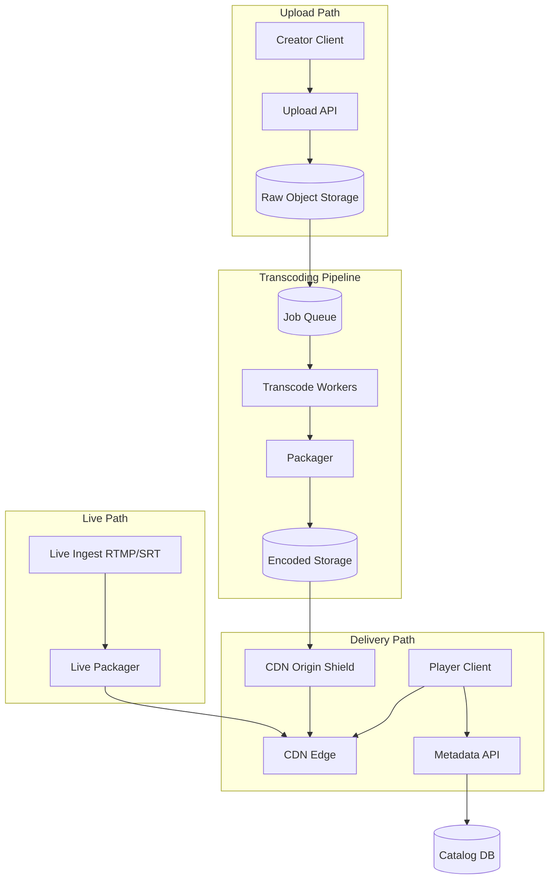
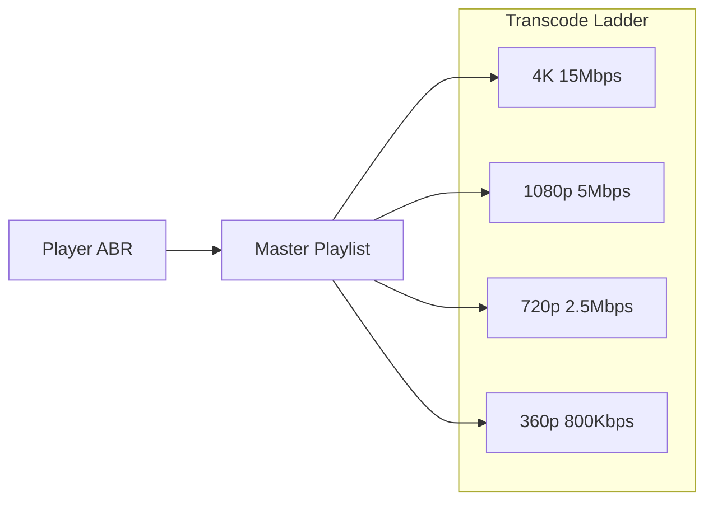
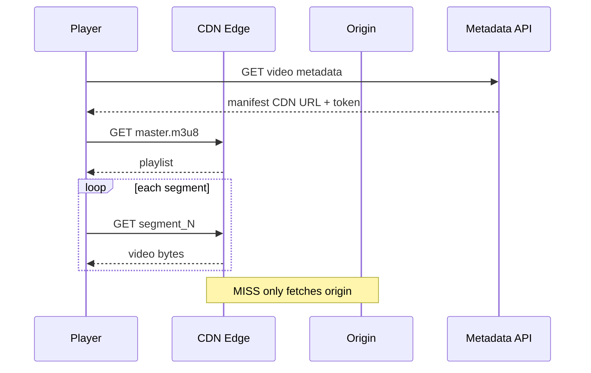

# Video Streaming Platform

## 1. Executive Summary

A **video streaming platform** delivers on-demand (VOD) and live video to global audiences with adaptive bitrate playback, minimal buffering, and cost-efficient bandwidth. Principal design spans **upload ingest**, **transcoding pipelines**, **CDN distribution**, **manifest-based streaming** (HLS/DASH), **live low-latency paths**, and **recommendation/metadata** services separate from the byte delivery path.

This chapter designs a Netflix/YouTube-class platform for 200M subscribers, 1B hours streamed monthly, supporting 4K VOD and live events with 30–60 second live latency (standard HLS) or sub-5 second (LL-HLS extension).

## 2. Why This Topic Matters

Video is the dominant internet traffic type. Architects face:

- **Orders-of-magnitude bandwidth** vs. typical APIs.
- **Batch + streaming pipelines** for transcoding.
- **CDN as architecture centerpiece**, not afterthought.
- **Tradeoffs between quality, latency, and cost**.
- **Live vs VOD** fundamentally different hot paths.

Interviews test whether candidates understand **separation of control plane (metadata) and data plane (bytes)** and **ABR (adaptive bitrate)** mechanics.

## 3. Problems Being Solved

| Problem | Capability |
|---------|------------|
| **Upload video** | Resumable ingest to object storage |
| **Transcode** | Multiple resolutions/codecs |
| **Global delivery** | CDN edge caching |
| **Adaptive playback** | HLS/DASH manifest + segments |
| **Live streaming** | Ingest RTMP/SRT; packager |
| **DRM** | Widevine/FairPlay license server |
| **Resume playback** | Bookmark progress |
| **Cost control** | Tiered storage; CDN optimization |

## 4. Assumptions and System Model

### Phase 1: Clarify Requirements

**Functional:**

- Upload VOD; transcode to 360p–4K H.264/HEVC.
- Playback via web/mobile players (HLS primary).
- Live stream with DVR window (2 hours).
- Search/browse metadata; thumbnails.
- Resume from last position.

**Non-functional:**

- VOD start playback &lt; 2 s (time to first frame).
- Rebuffer ratio &lt; 0.5% on good networks.
- Live latency 30–60 s (standard); optional LL mode.
- 200M subscribers; peak concurrent 20M streams.
- Availability 99.9% playback API; CDN higher.

**Non-goals:** Build custom video codec; social features (see news feed).

| Assumption | Implication |
|------------|-------------|
| **CDN carries bulk traffic** | Origin protection critical |
| **Transcoding is async** | Processing state machine |
| **Clients support ABR** | Multiple renditions required |
| **Copyright enforcement** | Content ID optional extension |

## 5. Essential Terminology

| Term | Definition |
|------|------------|
| **VOD** | Video on demand |
| **ABR** | Adaptive bitrate—client switches quality |
| **HLS** | HTTP Live Streaming—Apple manifest format |
| **DASH** | Dynamic Adaptive Streaming over HTTP |
| **Manifest / playlist** | M3U8 listing segment URLs |
| **Segment / chunk** | 2–6 second `.ts` or fMP4 fragment |
| **Transcoding ladder** | Set of resolutions/bitrates |
| **Packager** | Splits stream into segments + manifest |
| **Origin** | Source server CDN fetches from |
| **LL-HLS** | Low-latency HLS with partial segments |
| **CMAF** | Common Media Application Format |
| **DRM** | Digital rights management |

## 6. Core Mechanism

### 6.1 Phase 5: High-Level Architecture



*Figure 1: Video platform—async transcode pipeline; CDN serves segments; metadata API separate from bytes.*

### 6.2 Phase 3: Define APIs

```
POST /v1/videos/upload/initiate     → presigned multipart URLs
POST /v1/videos/upload/complete     → trigger transcode job
GET  /v1/videos/{id}                → metadata, status, playback_url
GET  /v1/videos/{id}/manifest.m3u8  → (often CDN URL directly)
PUT  /v1/users/{id}/progress        → { video_id, position_sec }
POST /v1/live/streams               → stream_key, ingest_url
```

**Transcode job states:** `uploaded` → `queued` → `transcoding` → `packaging` → `ready` | `failed`.

### 6.3 Phase 4: Model Data

**`videos`:** `video_id`, `owner_id`, `title`, `status`, `duration`, `created_at`.

**`video_renditions`:** `video_id`, `resolution`, `bitrate`, `codec`, `manifest_path`, `storage_key`.

**`transcode_jobs`:** `job_id`, `video_id`, `state`, `worker_id`, `error`.

**`playback_sessions`:** analytics—`user_id`, `video_id`, `quality`, `rebuffer_events`.

**`live_streams`:** `stream_key`, `status`, `dvr_window`, `cdn_channel_id`.

**Storage layout:**

```
s3://encoded/{video_id}/1080p/segment_00001.m4s
s3://encoded/{video_id}/manifest.m3u8
```

### 6.4 Phase 6: Deep Dives

**VOD transcode pipeline:**

1. Upload completes to raw bucket.
2. Job enqueued with ladder spec: 360p, 720p, 1080p, 4K (optional).
3. Worker fleet (GPU) transcodes each rendition in parallel.
4. Packager generates HLS fMP4 segments (4 s) + master playlist referencing all renditions.
5. Copy to origin bucket; CDN prefetch popular titles.
6. Catalog status → `ready`; CDN cache manifest with short TTL.

**ABR playback:**

1. Player fetches master `.m3u8`.
2. Selects initial rendition based on bandwidth estimate.
3. Downloads segments sequentially; switches rendition on buffer health.
4. CDN serves segments from edge—95%+ hit ratio for popular content.

**Live streaming:**

1. Encoder pushes RTMP to ingest endpoint.
2. Live packager produces rolling HLS segments (sliding window).
3. CDN passes through low-TTL segments; DVR stores window in origin.
4. Scale: multiple packager instances with stream affinity.



*Figure 2: ABR ladder—player selects rendition dynamically from master manifest.*

**Origin protection:**

- Signed URLs / cookies for manifest and segments.
- CDN token auth with short expiry.
- Origin shield layer collapses cache misses.



*Figure 3: Playback sequence—metadata from API; bytes from CDN; origin shield on miss.*

### 6.5 DRM and security

License server validates entitlement; encrypted segments (AES-128 or SAMPLE-AES). Key rotation per session. Separate from clear-text ladder for free tier.

## 7. Step-by-Step Walkthrough

### 7.1 Creator uploads 1-hour 4K video

1. Initiate multipart upload; 100 chunks to raw S3.
2. Complete triggers transcode job; 4 parallel GPU workers.
3. 45 minutes later all renditions packaged; CDN warms top markets.
4. Viewer in Tokyo plays 1080p via nearest edge—start &lt; 2 s.

### 7.3 Marquee release CDN pre-warm

1. Studio releases blockbuster; 5M concurrent streams expected in first hour.
2. Ops triggers CDN pre-warm from origin to top 50 POPs 24h before.
3. Origin shield absorbs fill traffic; edge hit ratio &gt; 98% at launch.
4. Transcode completed 72h early; QA sign-off on all renditions.
5. **Principal:** live events and launches are **capacity projects**, not normal autoscale.

### 7.4 Re-transcode for new codec (AV1)

1. Catalog titles flagged for AV1 ladder addition.
2. Batch queue processes back catalog at lower priority than new uploads.
3. Manifest version bumped; players negotiate AV1 if supported.
4. Storage cost increases—lifecycle policy archives H.264-only for old tail titles.

## 7A. Design Phase Summary

| Phase | Section | Key decisions |
|-------|---------|---------------|
| Requirements | §4 | VOD, live, ABR, resume |
| Scale | §10 | CDN Tbps; GPU transcode |
| APIs | §6.2 | multipart upload, manifest URLs |
| Data model | §6.3 | videos, renditions, segments |
| Architecture | §6.1 | transcode → origin → CDN |
| Deep dives | §6.4 | ABR ladder; live packager |
| Reliability | §8–9 | multi-CDN; transcode retry |
| Security | §13 | signed URLs; DRM |
| Operations | §12 | rebuffer SLO; pre-warm |
| Tradeoffs | §16 | HLS vs DASH; segment size |

## 8. Invariants and Guarantees

| Property | Guarantee |
|----------|-----------|
| **Segment immutability** | Once published, segment URL content unchanged |
| **Manifest consistency** | Versioned manifest on re-transcode |
| **Playback auth** | Token required for premium |
| **Transcode completeness** | `ready` only when all ladder rungs done |
| **Live ordering** | Segments monotonic sequence |

## 9. Failure Scenarios

| Scenario | Mitigation |
|----------|------------|
| Transcode worker crash | Job retry; idempotent outputs |
| CDN region outage | Multi-CDN failover |
| Origin overload | Shield; rate limit misses |
| Live ingest disconnect | Auto-reconnect; slate filler |
| Bad segment | Player skip; QC validation |
| Hot live event | Reserved CDN capacity |
| DRM license failure | Fallback error UX; retry |

## 10. Performance Characteristics

### Phase 2: Estimate Scale

```
1B hours/month viewed ≈ 385K concurrent average
Peak 20M concurrent streams
Average bitrate 3 Mbps → 20M × 3 Mbps = 60 Tbps peak egress (CDN scale)
Storage: 500K new hours/month × 5 renditions × 2 GB/hour ≈ 5 PB/month ingest encoded (lifecycle to IA)
Transcode: 1 hour video × 5 renditions ≈ 30 min GPU time → worker fleet sizing
```

| Metric | Target |
|--------|--------|
| Time to first frame | &lt; 2 s |
| Rebuffer ratio | &lt; 0.5% |
| Live latency (HLS) | 30–60 s |
| Transcode SLA | &lt; 1.5× realtime for VOD |

## 11. Scalability Limits

| Limit | Mitigation |
|-------|------------|
| Origin egress | CDN; shield; peer CDN |
| Transcode backlog | Autoscale GPU; priority queue |
| Live packager CPU | Dedicated pool per event |
| Manifest hot object | Replicate; short TTL |
| Storage cost | Tiering; delete raw after transcode |
| 4K ladder cost | Optional; per-title policy |

## 12. Operational Considerations

### Phase 9: Operations

- SLO: playback start success; rebuffer rate; transcode queue age.
- Dashboards: CDN bandwidth, cache hit, transcode GPU util, live viewer count.
- Runbooks: fail over CDN; scale live packagers; bad deployment rollback manifest version.
- Capacity: pre-warm CDN for marquee releases; load test with synthetic players.

## 13. Security Considerations

### Phase 8: Security

- Signed URLs; geo-restrictions; VPN detection (licensing).
- DRM for premium; key protection in TEE where required.
- Upload malware scan; content moderation queue.
- DDoS on CDN—provider mitigation; WAF on API.
- Token binding to device/session for anti-piracy (policy-dependent).

## 14. Cost Considerations

CDN egress dominates at scale—negotiate commit discounts and multi-CDN leverage. GPU transcode second largest line item—optimize ladder (skip 4K for mobile-only catalogs). Storage lifecycle: delete raw after transcode; Infrequent Access for long-tail titles. **Rule of thumb:** egress cost often exceeds storage + compute combined for video-heavy products.

## 15A. Live Event Runbook (Principal Checklist)

- [ ] Reserved CDN capacity confirmed 72h prior
- [ ] Packager pool pre-scaled; stream affinity tested
- [ ] Origin shield health verified
- [ ] DRM license server load tested
- [ ] Fallback slate/brb asset ready for ingest failure
- [ ] War room comms channel with CDN vendor NOC
- [ ] Synthetic playback monitors in top 10 markets

## 22A. Extended Follow-Ups

4. **Peer-assisted delivery (P2P).** — Reduces CDN cost; complexity, privacy, ISP policies; more common in APAC markets historically.
5. **Offline download for mobile.** — Encrypted local storage; license persistence; separate from streaming architecture.

## 15. Production Implementations

| Component | Examples |
|-----------|----------|
| **CDN** | CloudFront, Akamai, Fastly |
| **Transcode** | AWS MediaConvert, self FFmpeg fleet |
| **Live** | AWS IVS, Wowza patterns |
| **Players** | Shaka, hls.js, AVPlayer |

## 16. Alternatives and Tradeoffs

### Phase 10: Tradeoffs

| Decision | Tradeoff |
|----------|----------|
| HLS vs DASH | Ecosystem vs standards |
| Segment duration | Latency vs efficiency (2s vs 6s) |
| GPU vs CPU transcode | Cost vs speed |
| Single vs multi-CDN | Cost vs resilience |
| LL-HLS vs standard | Complexity vs latency |
| Self transcode vs managed | Control vs ops |

## 17. Common Misconceptions

| Misconception | Reality |
|---------------|---------|
| "Serve MP4 from API server" | Doesn't scale; no ABR |
| "CDN optional" | Origin dies at TBps |
| "One quality fits all" | ABR required for mobile |
| "Live = VOD pipeline" | Real-time packager path |
| "Transcode synchronously on upload" | Async queue mandatory |
| "Single CDN vendor is fine" | Outage and negotiation risk; multi-CDN for tier-1 |
| "Live and VOD share transcode fleet" | Live needs real-time packagers; different SLO |
| "Player quality = max bitrate" | ABR may select lower for buffer health |
| "DRM optional for premium" | Studio contracts often mandate |

## 17A. Failure scenario drill

Live sports event—ingest encoder fails mid-game. Architecture response: backup ingest URL, automatic failover to slate, CDN holds last segments, comms to social team. RTO measured in seconds for ingest. Rehearse **before** championship final—not during.

## 18. Principal Architect Perspective

- **Bytes flow through CDN**, not application tier.
- **Transcode is batch compute**—queue and autoscale separately.
- **Manifest is control plane** for player—version carefully.
- **Live events** need capacity planning and rehearsal.
- **Cost model** must include egress—architecture driver.

## 19. Architecture Review Exercise

**Scenario:** Serve video files from app servers behind load balancer.

**Review:** Bandwidth math; propose S3 + CDN + HLS; transcode pipeline; signed URLs.

## 20. Whiteboard Explanation

"Creators upload raw video to object storage via multipart presigned URLs. A transcode queue fans out to GPU workers producing an ABR ladder—multiple resolutions packaged as HLS segments in encoded storage. The catalog API returns a CDN URL to the master manifest with auth token. Players fetch manifests and segments from CDN edges with origin shield on miss. Live streams ingest via RTMP to a packager emitting rolling HLS segments with low TTL. Metadata and bytes are deliberately separated."

## 21. Interview Questions

1. **Design YouTube/Netflix streaming.** — *Signals:* CDN-centric, transcode async, HLS. *Red flags:* app server bytes.
2. **HLS vs DASH?** — *Signals:* ecosystem, DRM, player support. *Follow-up:* CMAF unification.
3. **CDN role in architecture?** — *Signals:* 95%+ traffic, origin shield. *Red flags:* optional CDN.
4. **Transcoding pipeline design?** — *Signals:* GPU queue, ladder, packaging. *Red flags:* sync on upload.
5. **Adaptive bitrate how works?** — *Signals:* manifest renditions, buffer-based switch. *Red flags:* single MP4.
6. **Live vs VOD differences?** — *Signals:* rolling segments, low TTL. *Red flags:* same pipeline.
7. **Reduce live latency?** — *Signals:* LL-HLS, shorter segments, tradeoffs. *Red flags:* smaller CDN only.
8. **Origin protection strategies?** — *Signals:* shield, signed URLs, token auth. *Red flags:* public bucket.
9. **Storage cost optimization?** — *Signals:* delete raw, IA tier, ladder policy. *Red flags:* keep all renditions forever.
10. **DRM architecture?** — *Signals:* license server, encrypted segments. *Follow-up:* key rotation.
11. **Resume playback implementation?** — *Signals:* progress API, player state. *Red flags:* client-only.
12. **Scale live event 5M viewers?** — *Signals:* CDN multicast edge, packager scale. *Red flags:* origin streams to all.

## 22. Interview Follow-Ups

1. **4K only for 10% viewers—worth it?** — Cost/benefit; per-title ladder.
2. **Peer-assisted delivery.** — P2P reduces CDN cost; complexity, privacy.
3. **Global release at midnight local.** — Geo-fenced manifest availability.

## 23. Strong Answer Example

**Q:** How does adaptive bitrate work?

**Outline:** Server provides multiple renditions (bitrates/resolutions) in master manifest. Player estimates available bandwidth from segment download times and buffer level. It selects a rendition—starts conservative, ramps up if buffer healthy, downshifts before rebuffer. Segments are short (2–6s) to allow frequent switches. CDN caches all renditions; client logic is local—no server-side session state required.

## 24. Weak Answer Example

**Weak:** "Store MP4 in database blob; stream over HTTP."

**Red flags:** No CDN, no ABR, no transcode, DB as blob store.

## 25. Hands-On Exercise

1. Transcode sample video to HLS with FFmpeg.
2. Host segments on local nginx; play with hls.js.
3. Add master playlist with 2 renditions.
4. BOE: CDN egress for 1M concurrent @ 3 Mbps.
5. **Extension:** Measure time-to-first-frame vs segment duration.
6. **Extension:** Simulate CDN miss storm; observe origin RPS.

## 23A. Additional Strong Answer

**Q:** Origin protection at 20M concurrent streams.

**Outline:** CDN serves 95%+ bytes from edge. Origin shield collapses misses to regional fetch per segment. Signed URLs prevent hotlinking. New live viewers fetch only latest segments—origin load proportional to join rate. Pre-warm manifest and first segments for marquee titles.

## 19A. Extended Review Scenario

**Scenario B:** Single 4K MP4 per video; progressive download.

**Review:** No ABR for mobile; poor CDN segment caching. Propose transcode ladder + HLS; estimate storage multiplier for multiple renditions.

## 28B. Extended BOE Walkthrough (Interview Script)

**Interviewer:** "1B hours streamed per month, 4K catalog."

**Strong candidate:**

"1B hours/month ≈ 385K average concurrent streams if uniformly distributed—reality peaks higher, say 20M concurrent major events.

Bitrate 3 Mbps average → 20M × 3 Mbps = 60 Tbps CDN egress—CDN is the architecture; origin sized for miss rate not viewers.

Storage: 500K hours new/month × 5 renditions × ~2GB/hour encoded ≈ 5 PB/month before lifecycle to IA—raw delete after transcode saves ~80% on upload bucket.

Transcode GPU: 1 hour source × 5 renditions at 0.5× realtime = 2.5 GPU-hours per upload hour—fleet sizing from upload curve not playback.

Live: packager + CDN low TTL; VOD: aggressive CDN cache. I'll separate metadata API from byte path and mention DRM as premium extension."

## 26. Knowledge Check (extended)

9. What is origin shield?
10. Why segment-based streaming vs MP4?
11. TTFF vs rebuffer—which SLO first?
12. LL-HLS tradeoff?

## 27. Flashcards

| Front | Back |
|-------|------|
| ABR | Client switches quality by bandwidth |
| HLS | HTTP Live Streaming manifest format |
| Rendition | Single bitrate/resolution variant |
| Origin shield | Intermediate CDN cache layer |
| CMAF | Common format for HLS and DASH |
| TTFF | Time to first frame QoE metric |
| Rebuffer ratio | Playback quality SLO |
| Ingest RTMP | Live encoder to platform entry |
| DVR window | Rolling live replay duration |
| Ladder policy | Which renditions per title tier |
| Pre-warm | CDN fill before marquee launch |
| QoE | Quality of experience metrics suite |

## 18A. Organizational and cost ownership

Video platforms require **cross-functional war rooms** for live events—engineering, CDN vendor NOC, content ops, and executive comms. Principal architects own the technical runbook; producers own content readiness. **Egress cost attribution** per title flows from CDN logs to FinOps when manifests tag `content_id`. 4K ladder expansion is a business decision—present transcode + storage + egress BOE before engineering commitment. **Codec patents and licensing** (HEVC, AV1) affect player support matrix—legal review for global catalog.

## 28. Cheat Sheet

```
REQUIREMENTS: VOD upload, transcode ladder, live, resume, DRM optional
SCALE: CDN 60+ Tbps; GPU transcode fleet; object storage PB
APIs: multipart upload; metadata; signed manifest URLs
DATA: videos, renditions, transcode_jobs; segment objects in S3
ARCH: Upload → Transcode → Origin → CDN → Player
DEEP: ABR ladder; live packager; signed URLs
RELIABILITY: multi-CDN; transcode retry; live reconnect
SECURITY: token auth; DRM license server
OPS: rebuffer SLO; pre-warm CDN; GPU autoscale
TRADEOFFS: HLS vs DASH; segment duration; LL-HLS
```

## 28A. Principal Interview Deep Dive

### Bandwidth BOE (live event)

```
5M concurrent × 3 Mbps average = 15 Tbps aggregate egress
CDN absorbs; origin only on miss (~1-5%): 150 Gbps - 750 Gbps origin peak
Origin shield reduces by 10×: ~15-75 Gbps still requires serious capacity
```

Shows why **origin is never sized for concurrent viewers**—only for cache miss + ingest.

### Transcode ladder example

| Rendition | Resolution | Bitrate | Segment size 4s |
|-----------|------------|---------|-----------------|
| 360p | 640×360 | 800 Kbps | 400 KB |
| 720p | 1280×720 | 2.5 Mbps | 1.25 MB |
| 1080p | 1920×1080 | 5 Mbps | 2.5 MB |
| 4K | 3840×2160 | 15 Mbps | 7.5 MB |

Storage per hour VOD (all renditions): sum bitrates × 3600s / 8 ≈ several GB/hour source-dependent.

### Live latency budget (standard HLS)

| Component | Latency |
|-----------|---------|
| Encoder segment | 4 s |
| Packager | 1 s |
| CDN propagate | 2–5 s |
| Player buffer | 3× segment = 12 s |
| **Total** | ~20–40 s typical |

LL-HLS reduces player buffer via partial segments—trade CDN request rate for latency.

### QoE metrics architects own

- **Time to first frame (TTFF)**
- **Rebuffer ratio**
- **Average bitrate (ABR efficiency)**
- **Exit before video start**

Tie CDN and transcode investments to QoE SLOs, not vanity 4K coverage.

## 29. Related Concepts

- [System Design Methodology](/docs/system-design/system-design-methodology)
- [Caching Fundamentals](/docs/caching/caching-fundamentals)
- [Multi-Region Architecture](/docs/cloud-architecture/multi-region-architecture)
- [Global File Transfer Platform](/docs/system-design/global-file-transfer-platform)
- [Distributed Cache Design](/docs/system-design/distributed-cache-design)

## 30. References

- Apple HLS specification — manifest and segment format.
- ISO/IEC 23009-1 — MPEG-DASH standard.
- FFmpeg documentation — transcoding implementation reference.
- Akamai/CloudFront streaming guides — CDN best practices (vendor docs).

**Distinction:** HLS/DASH formats are standardized; ladder bitrates and CDN topology are implementation choices.

### 30A. Further reading paths

Relate to [Global File Transfer Platform](/docs/system-design/global-file-transfer-platform) for large blob ingest patterns and [Multi-Region Architecture](/docs/cloud-architecture/multi-region-architecture) for CDN POP strategy. [Distributed Cache Design](/docs/system-design/distributed-cache-design) applies to manifest edge caching. Lab: FFmpeg HLS ladder + BOE spreadsheet for egress cost at 1M concurrent viewers and 3 Mbps average bitrate.
