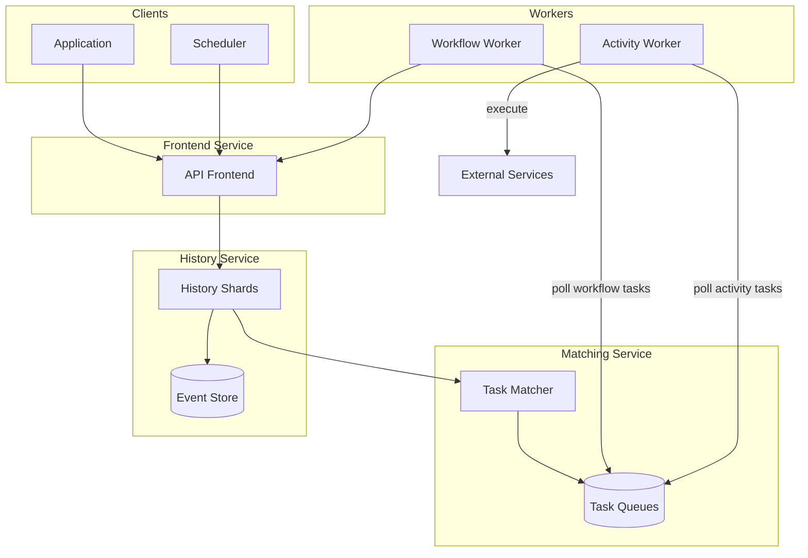
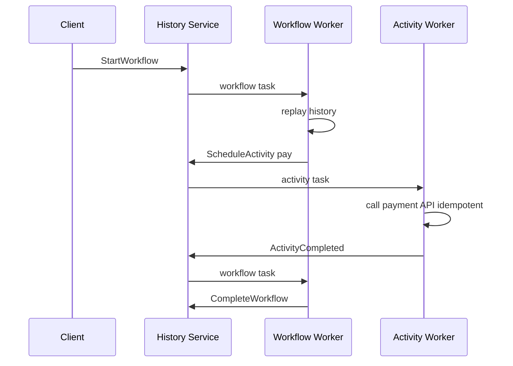
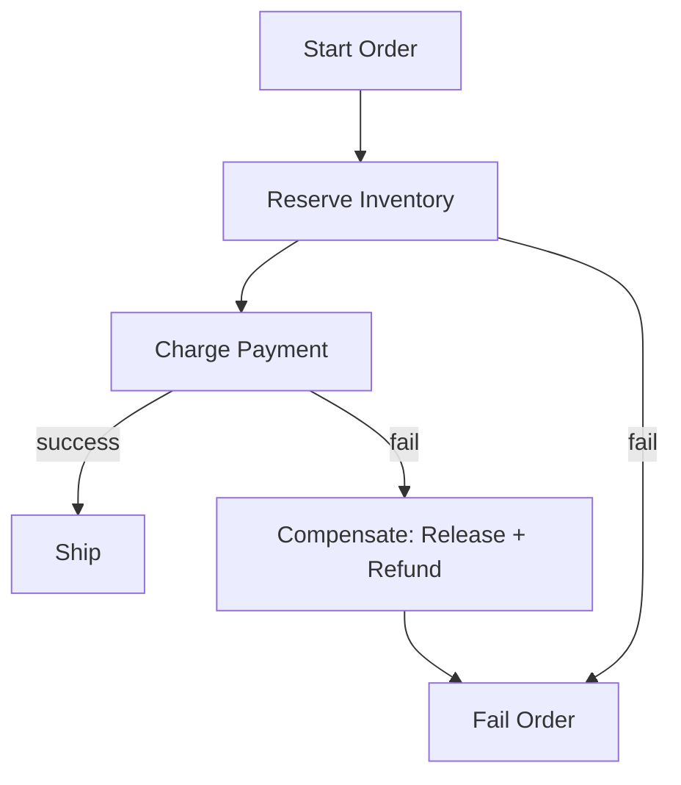

# Workflow Engine

## 1. Executive Summary

A **workflow engine** orchestrates long-running, stateful business processes across distributed services with durability, retries, timers, and human tasks. Principal-level design covers **event sourcing of workflow history**, **deterministic replay**, **activity workers**, **saga compensation**, **versioning**, and **multi-tenant isolation**.

This chapter designs a Temporal/Cadence-class engine executing billions of workflow steps per month with 99.99% durability guarantees and automatic recovery from worker crashes. Event history, at-least-once activity execution with idempotency, and explicit versioning strategy are mandatory interview topics.

## 2. Why This Topic Matters

Microservices need orchestration beyond naive message chains. Architects must explain:

- **Orchestration vs choreography** tradeoffs.
- **Why workflow code must be deterministic** (replay model).
- **Activity vs workflow task** separation.
- **Compensation** in sagas for partial failure.
- **Long timers** (days/weeks) without holding threads.

Failures include duplicate charges, stuck orders, and unrecoverable state from non-deterministic workflow code. Review [Sagas](/docs/transactions/sagas), [Idempotency](/docs/distributed-systems-foundations/idempotency), and [Transactional Outbox](/docs/transactions/transactional-outbox).

## 3. Problems Being Solved

| Problem | Solution |
|---------|----------|
| **Long-running processes** | Durable workflow state |
| **Partial failure** | Retries; saga compensation |
| **Timeouts / timers** | Server-managed clocks |
| **Human approval** | Signal/wait patterns |
| **Visibility** | Workflow history query |
| **Scale workers** | Task queue polling |
| **Version upgrades** | Workflow versioning API |
| **Exactly-once illusion** | Idempotent activities |

## 4. Assumptions and System Model

**Functional:**

- Define workflows as code (order fulfillment, onboarding).
- Activities call external services (payment, email).
- Signals for external events; queries for read-only state.
- Cron/scheduled workflow starts.
- Cancel and terminate workflows.

**Non-functional:**

- Workflow history durable 99.999%.
- Activity task dispatch latency p99 &lt; 500 ms.
- Support workflows running up to 1 year.
- 100K concurrent workflow executions per cluster.
- Multi-tenant namespaces.

| Assumption | Implication |
|------------|-------------|
| **Workflow code deterministic** | No random/time without SDK wrappers |
| **Activities may fail/retry** | Idempotency keys required |
| **At-least-once task delivery** | Duplicate activity execution possible |
| **History grows unbounded** | Compaction/archival policies |
| **Workers stateless** | All state in server history |

## 5. Essential Terminology

| Term | Definition |
|------|------------|
| **Workflow** | Durable function coordinating steps |
| **Activity** | Single unit of side-effecting work |
| **Event history** | Append-only log of workflow events |
| **Replay** | Re-execute workflow code from history |
| **Task queue** | Work distribution to workers |
| **Signal** | External async message to workflow |
| **Query** | Read-only workflow state without mutation |
| **Timer** | Durable sleep until deadline |
| **Saga** | Compensating transactions on failure |
| **Run ID** | Unique execution instance |
| **Continue-as-new** | Reset history for long workflows |
| **Side effect** | Non-deterministic op wrapped for replay |

## 6. Core Mechanism

### 6.1 Architecture



*Figure 1: History service persists events; matching dispatches tasks to stateless workers.*

### 6.2 APIs (conceptual)

```
StartWorkflow(workflow_type, workflow_id, input)
SignalWorkflow(workflow_id, run_id, signal_name, payload)
QueryWorkflow(workflow_id, query_name)
CancelWorkflow(workflow_id)

Worker.poll_task_queue(queue_name) → task
Worker.complete_task(result | failure)
```

### 6.3 Data Model

**Workflow execution:**

```
workflow_id, run_id, namespace, type, status,
start_time, close_time, parent_run_id?
```

**Event history (append-only):**

```
event_id, event_type, timestamp, attributes
Types: WorkflowExecutionStarted, ActivityTaskScheduled,
       ActivityTaskCompleted, TimerFired, SignalReceived...
```

**Task:**

```
task_token, workflow_id, activity_id?, task_queue, attempt
```

Shard by `hash(workflow_id) % num_history_shards`.

### 6.4 Deep Dives

**Workflow execution model:**

1. Client starts workflow; `WorkflowExecutionStarted` event written.
2. Matching enqueues workflow task to worker task queue.
3. Worker polls task; replays history; executes until next yield (activity schedule, timer, wait).
4. Worker returns commands (schedule activity, start timer).
5. History service appends events; may enqueue new tasks.
6. Repeat until workflow completes.

**Deterministic replay:**

- Workflow code re-run from event 1 on each task.
- `workflow.now()` returns recorded time from history.
- Random and external I/O only via activities or `sideEffect()`.
- Non-determinism causes **workflow task failure**—version carefully.



*Figure 2: Event-sourced loop between history service and workers.*

**Activity retries:**

- Exponential backoff: 1s, 2s, 4s… max 5 attempts.
- Non-retryable errors fail workflow (or trigger compensation).
- **Idempotency key** = `workflow_id + activity_id + attempt` passed to payment API.

**Saga compensation pattern:**

```python
# Pseudocode workflow
try:
    reservation = execute_activity(reserve_inventory)
    payment = execute_activity(charge_payment)
except:
    execute_activity(release_inventory, reservation)
    execute_activity(refund_payment, payment)
    raise
```



*Figure 3: Saga forward steps with compensation on payment failure.*

**Versioning:**

- `workflow.GetVersion("change-id", min, max)` branches replay for old runs.
- New deployments must not break open workflows' replay.

**Continue-as-new:**

- Workflows with millions of events (e.g., loop) call `continue_as_new` to truncate history.

## 7. Step-by-Step Walkthrough

### 7.1 Order fulfillment

1. Start `OrderWorkflow(order_id)`.
2. Activity: validate payment (idempotent charge).
3. Activity: reserve inventory.
4. Timer: wait 24h for fraud review window OR signal `approved`.
5. Activity: ship; complete workflow.

### 7.2 Worker crash mid-activity

1. Activity worker dies after payment succeeds but before reporting completion.
2. Activity times out; retry scheduled.
3. Payment API idempotency returns same result; activity completes.
4. Workflow continues—no double charge.

### 7.3 Non-deterministic deploy bug

1. Developer adds `Math.random()` in workflow code.
2. Replay produces different command; workflow task fails permanently.
3. Fix: use `sideEffect()` or move randomness to activity.
4. Version gate for in-flight workflows.

### 7.5 Scheduled workflow cron

1. `BillingWorkflow` starts 1st of month via scheduler service.
2. Each run new `run_id`; `workflow_id` includes `2026-07` for idempotency.
3. Duplicate scheduler tick does not double-bill—start API rejects duplicate workflow_id.

### 7.6 Human task timeout escalation

1. Manager approval signal not received in 7 days.
2. Timer fires; workflow escalates to skip-level manager via activity.
3. Audit trail in event history for compliance.

## 7B. History Size Management

| Workflow type | Events/year | Strategy |
|---------------|-------------|----------|
| Order | ~20 | Keep full history |
| Sensor tick | 1M | Continue-as-new daily |
| Subscription billing | 12 | Archive after close |

Mis-sized histories inflate storage and replay CPU—design event budget per workflow type at authoring time.

## 10A. Worker Scaling Formula

```
Activity tasks/sec = 5000
Avg activity duration = 200 ms
Workers needed = 5000 × 0.2 = 1000 concurrent activity workers
Add 30% headroom → 1300 workers across task queues
```

Workflow tasks lighter—fewer workers; profile separately.


| Phase | Key decisions |
|-------|---------------|
| Requirements | durable orchestration, retries, timers |
| Scale | history shards; task queue workers |
| APIs | start/signal/query/cancel |
| Data | append-only event history |
| Deep dives | replay; idempotent activities |

## 8. Invariants and Guarantees

| Property | Guarantee |
|----------|-----------|
| **Durability** | Accepted events never lost |
| **At-least-once activities** | May run multiple times |
| **Workflow state** | Derived from event history |
| **Ordering** | Events total order per workflow |
| **Idempotent start** | Same workflow_id dedup policy configurable |

## 9. Failure Scenarios

| Scenario | Mitigation |
|----------|------------|
| **History shard loss** | Replicated storage; multi-AZ |
| **Task queue backlog** | Scale workers; split queues |
| **Poison activity** | Max attempts; DLQ alert |
| **Replay nondeterminism** | Versioning; CI replay tests |
| **History size explosion** | Continue-as-new; archival |
| **Clock skew** | Server timestamps authoritative |

## 10. Performance Characteristics

```
100K concurrent workflows × 50 events avg = 5M events active
Event append: 1–5 ms per decision task
Worker poll long-poll reduces empty requests
History shard: 500–1000 RPS write per shard typical
Archival to object store after workflow close
```

## 11. Scalability Limits

| Limit | Mitigation |
|-------|------------|
| Hot workflow_id | Shard by hash distributes |
| Large histories | Continue-as-new |
| Activity fan-out | Parallel activities; batch |
| Matching bottleneck | Partition task queues by domain |
| DB size | Retention + cold archive |

## 12. Operational Considerations

- Metrics: task schedule latency, backlog depth, workflow failure rate, replay errors.
- Alerts: nondeterminism spike; queue age &gt; 5 min.
- Runbooks: reset stuck workflow; patch with versioning.
- Load test worker capacity per task queue.

## 13. Security Considerations

- Namespace isolation per tenant.
- mTLS between workers and frontend.
- Encrypt workflow input/output if PII.
- AuthZ on start/signal APIs.
- Audit admin terminate operations.

## 14. Cost Considerations

Event storage grows with workflow count × steps. Archive closed workflows to S3. Right-size history shards vs over-sharding overhead. Self-hosted Temporal vs managed service ops tradeoff.

## 15. Production Implementations

| System | Notes |
|--------|-------|
| **Temporal** | Cadence fork; widely adopted |
| **Cadence** | Uber-origin workflow engine |
| **AWS Step Functions** | Managed state machines |
| **Apache Airflow** | Batch DAGs—not transactional workflow |
| **Camunda** | BPMN enterprise workflows |

**Distinction:** Temporal/Cadence share replay model; Step Functions JSON ASL is different paradigm.

## 16. Alternatives and Tradeoffs

| Approach | Pros | Cons |
|----------|------|------|
| Choreography (events only) | Loose coupling | Hard to trace; no central state |
| Orchestration (workflow engine) | Visibility; sagas | Operational complexity |
| DB state machine table | Simple | Polling; timer pain |
| Step Functions | Managed | Vendor lock; expressiveness |
| Cron + scripts | Easy start | No durability guarantees |
| Two-phase commit | Strong consistency | Does not scale cross-service |

## 16A. Workflow Boundaries—What NOT to Orchestrate

Avoid workflow engine for:

- Single RPC with no retries needed
- Sub-100ms synchronous request path
- Pure CRUD without multi-step compensation
- High-frequency tick processing (millions/sec)—use stream processor

Use workflow when failure recovery spans minutes to days and human steps exist. Misapplied workflows add latency and ops burden without durability benefit.

## 16B. Disaster Recovery for Workflow State

History store is tier-0 data:

- Replicated across AZ; RPO &lt; 1 min
- Regular backup restore drill quarterly
- Document behavior if history unavailable: queue new starts vs hard fail
- Multi-region: active-passive history with failover runbook

Losing workflow history loses in-flight business processes—same severity as payment ledger loss for order domains.

| "Activities run exactly once" | At-least-once; idempotency required |
| "Any code in workflow" | Must be deterministic |
| "Airflow replaces Temporal" | Different use case |
| "Signals are synchronous RPC" | Async; may arrive before wait |

## 18.1 Human-in-the-Loop at Scale

Workflows involving thousands of approvals (vendor onboarding batch) use child workflows or continue-as-new per batch chunk—never single workflow with 50K signal waits. Pattern: parent fans out 100 child workflows each handling 500 items; parent aggregates completion via signal. Principal architects review fan-out limits in design doc before implementation—history event explosion has taken down production Temporal namespaces in anecdotal industry reports; verify limits against your engine documentation.

## 18. Principal Architect Perspective

- **Idempotency keys** on every activity touching money or inventory.
- **Versioning strategy** before first production workflow—retrofit is painful.
- **Compensation design** in same PR as happy path.
- **Task queue isolation** per team prevents noisy neighbor.
- **Replay tests in CI** catch nondeterminism pre-deploy.

## 19. Architecture Review Exercise

**Scenario:** Order state in Redis with cron pollers checking status.

**Review:** Migrate to workflow engine; durable timers; saga compensation; visibility API.

## 20. Whiteboard Explanation

"Clients start workflows via frontend API. History service appends events to sharded durable store. Workflow workers poll tasks, replay event history deterministically, and submit commands to schedule activities or timers. Activity workers poll separate queues, call external services with idempotency keys, and report results as events. Matching service routes tasks. Signals inject external events. All state is event history—workers are stateless and replaceable. Versioning guards replay compatibility on code changes."

## 21. Interview Questions

1. **Design durable order workflow.** — *Signals:* event history, activities, saga. *Red flags:* DB polling.
2. **Orchestration vs choreography?** — *Signals:* visibility vs coupling. *Follow-up:* when choreo OK.
3. **Why deterministic workflow code?** — *Signals:* replay model.
4. **Activity retry without duplicate charge?** — *Signals:* idempotency key.
5. **Long timer 30 days?** — *Signals:* server timer event, not sleep().
6. **Worker crash handling?** — *Signals:* task timeout, redispatch.
7. **Workflow versioning?** — *Signals:* GetVersion pattern.
8. **Scale history storage?** — *Signals:* sharding, continue-as-new, archive.
9. **Human approval step?** — *Signals:* signal + wait condition.
10. **Query workflow state?** — *Signals:* query API without side effects.
11. **Poison message activity?** — *Signals:* max attempts, DLQ.
12. **Multi-tenant isolation?** — *Signals:* namespace, task queue.
13. **vs Step Functions?** — *Signals:* code-as-workflow vs JSON ASL.
14. **Saga compensation example?** — *Signals:* release inventory on payment fail.

## 21B. Extended Interview Question Deep Dives

**Q15 (Principal):** 2-year subscription billing workflow—history millions of events.

*Strong signals:* Continue-as-new monthly; archive closed periods to object store; query API returns summary not full history by default. *Red flags:* Single run accumulates all events.

**Q16 (Principal):** Regulatory requirement: prove who approved wire transfer 18 months ago.

*Strong signals:* Event history immutable; signal payload includes approver identity; export workflow history for audit; retention policy matches regulation. Link [Architecture Decision Records](/docs/architecture-leadership/architecture-decision-records) for policy storage.

2. **Workflow update patch.** — Server-side migration of running instances.
3. **Event history export for audit.** — Compliance replay.

## 23. Strong Answer Example

**Q:** How handle payment activity that may run twice?

**Outline:** Pass idempotency key derived from workflow_id and activity_id to payment API. Payment service stores key→result mapping; duplicate requests return same transaction ID without re-charging. Workflow engine may deliver activity at-least-once—external service must be idempotent. Log duplicate attempts for audit.

## 24. Weak Answer Example

**Weak:** "Use a cron job every minute to check order status in MySQL."

**Red flags:** No durability, race conditions, timer imprecision, no saga.

## 25. Hands-On Exercise

1. Implement toy workflow with event log and replay.
2. Add activity retry with idempotency map.
3. Simulate worker crash mid-activity.
4. Add signal handler for approval step.
5. **Extension:** Continue-as-new after 1000 iterations.

## 25A. Extended Hands-On Lab

7. Deploy Temporal docker-compose; run sample order saga with intentional payment failure.
8. Record history JSON; modify workflow code; run replay test in CI.
9. Measure task queue backlog vs worker count under 1000 workflows/sec synthetic load.
10. **Principal lab:** Document compensation order for 5-step saga with external legal review.

## 25B. Production Readiness Review Questions

- Are all money-moving activities idempotent with proof in payment service?
- Can support query workflow state without engineer access?
- What is max history size before continue-as-new mandatory?
- Is nondeterminism alert wired to paging?

Workflow bugs are silent until replay fails in production—CI replay is non-negotiable.

2. Why replay?
3. Three saga compensation steps for order?
4. What causes nondeterminism error?

## 27. Flashcards

| Front | Back |
|-------|------|
| Event history | Append-only workflow state log |
| Replay | Re-execute workflow from events |
| Activity | Side-effecting external call unit |
| Signal | Async external workflow message |
| Task queue | Worker poll distribution |
| Idempotency key | Prevents duplicate side effects |
| Continue-as-new | Truncate history for long runs |
| Saga | Forward steps + compensation |
| Timer event | Durable server-managed delay |
| Namespace | Multi-tenant isolation boundary |

## 28. Cheat Sheet

```
REQUIREMENTS: durable workflows, retries, timers, signals
SCALE: history shards; task queue workers
APIs: start, signal, query, cancel
DATA: append-only events; task tokens
ARCH: frontend → history → matching → workers
DEEP: deterministic replay; idempotent activities
RELIABILITY: at-least-once; timeout redispatch
SECURITY: namespace; encrypt PII payloads
OPS: queue backlog; nondeterminism alerts
```

## 17A. Failure Scenario Drill

Deploy introduces `time.Now()` in workflow code—every open workflow nondeterministic failure; order pipeline stuck 48h. Mitigation: replay test in CI; canary worker pool; `workflow.GetVersion` gate. Principal blocks workflow changes without **replay compatibility** review.

## 18.1 Child Workflow Patterns

Parent starts child workflows for each line item—parent close policy `ABANDON` vs `TERMINATE` affects cleanup on parent cancel. Document policy per use case; wrong policy orphans compensating activities.

## 19A. Extended Review Scenario

**Scenario B:** Activity calls external API without idempotency—retry causes triple shipment.

**Review:** Idempotency-Key header; activity wrapper stores completion in side table keyed by workflow+activity id.

## 21A. Additional Interview Questions

15. **Workflow vs cron job?** — *Signals:* cron starts workflow; durable state inside. *Red flags:* cron alone for multi-step money flow.
16. **Maximum history events?** — *Signals:* continue-as-new at 10K–50K events; archive to object store.

## 28A. Principal Interview Deep Dive

### Task queue naming convention

`{domain}-{activity}-{priority}` e.g. `payments-charge-critical` vs `payments-charge-batch`—isolates noisy batch from user-facing latency.

### Signal vs Update (Temporal)

Signal: external event. Update: synchronous validated mutation with response—use sparingly; adds complexity to replay.

### Compensation ordering

Compensate in reverse order of forward steps—LIFO. Payment refund before inventory release if payment succeeded last.

## 28B. Extended BOE Walkthrough

**Interviewer:** "Durable order saga across 5 services."

**Strong candidate:**

"One OrderWorkflow orchestrates: reserve → pay → ship. Each step activity with idempotency key. Failure after pay → compensate refund + release inventory.

History in sharded event store; workers stateless. Timers for fraud hold 24h via server timer event—not thread sleep.

100K concurrent orders: history shards ~500 writes/sec each; scale shards and task queue workers.

Integrate outbox via [Transactional Outbox](/docs/transactions/transactional-outbox) before starting workflow from DB transaction."

## 29. Related Concepts

- [Sagas](/docs/transactions/sagas)
- [Idempotency](/docs/distributed-systems-foundations/idempotency)
- [Transactional Outbox](/docs/transactions/transactional-outbox)
- [Kafka-like Event Platform](/docs/system-design/kafka-like-event-platform)
- [Payment Platform](/docs/system-design/payment-platform)
- [System Design Methodology](/docs/system-design/system-design-methodology)

## 30. References

- Temporal documentation — workflow determinism and replay (official).
- Bernstein, Melnik — Saga paper (academic).
- Kleppmann, *DDIA* — stream processing and derived state.

**Distinction:** Replay model formalized in Temporal docs; saga theory from Bernstein et al.

### 30A. Further Reading Paths

Compare choreography using [Kafka-like Event Platform](/docs/system-design/kafka-like-event-platform) vs orchestration here. Payment flows in [Payment Platform](/docs/system-design/payment-platform) should use workflow + idempotent activities.

### 30B. Workflow Testing Strategy

| Test type | Purpose |
|-----------|---------|
| Unit | Activity logic mocked |
| Replay | Recorded history replay after code change |
| Integration | Test server + real activities in docker |
| Load | Task queue backlog under 10K workflows/sec |

Replay tests mandatory in CI for workflow package changes.

### 30D. Principal Architecture Review Checklist

- [ ] Replay compatibility test in CI for every workflow module change
- [ ] All activities touching external systems use idempotency keys
- [ ] Compensation paths tested—not only happy path integration tests
- [ ] Task queue isolation between batch and interactive workloads
- [ ] History shard capacity model documented with headroom
- [ ] Continue-as-new policy for workflows expected &gt;10K events
- [ ] Namespace RBAC for prod workflow start/signal APIs
- [ ] Runbook: safe terminate vs cancel semantics documented for support

Workflow engines trade simplicity for operational discipline—nondeterminism and missing idempotency cause multi-day incidents.

### 30F. Closing Principal Note

Workflow engines reward teams that treat workflow code as production-critical infrastructure: deterministic, versioned, replay-tested, and paired with idempotent activities.

### 30G. Multi-Cluster and Multi-Region

Large enterprises run separate Temporal namespaces per region for data residency—workflows do not cross region boundaries; hand off via async events on [Kafka-like Event Platform](/docs/system-design/kafka-like-event-platform) with idempotent consumers. Failover is namespace-level DR not active-active workflow migration—plan RPO for in-flight workflows explicitly.

### 30H. Support and Debuggability

Expose read-only workflow query API to customer support with strict RBAC—reduces engineering toil for "where is my order" tickets. Mask PII in query responses. Every workflow type should register human-readable status strings—not only internal state enum codes—for support tooling integration. Budget 2–4 weeks per major workflow for support UI and query handler implementation—often omitted and paid as ongoing toil tax. Workflow documentation should include sequence diagram of activities and compensation paths attached to each PR that introduces new workflow types. Run annual disaster recovery drill restoring history store from backup into isolated namespace and executing sample workflows end-to-end. Measure replay test coverage percentage in CI dashboard—target 100% of workflow packages before each release train. Failed replay tests block deploy same as failing unit tests for services owning workflow definitions. Principal sign-off on any workflow change touching payment or inventory requires attached replay CI green screenshot in change ticket. This single gate prevents more production incidents than adding another workflow worker replica.
