# Architecture Decision Records

## 1. Executive Summary

An **Architecture Decision Record (ADR)** is a lightweight document that captures a single significant architectural decision together with its **context**, **drivers**, **considered options**, **chosen outcome**, **consequences**, and **status**. ADRs create an **audit trail** that outlasts chat threads, design reviews, and staff turnover—answering not only *what* was decided but *why alternatives were rejected* and *what tradeoffs the organization accepted*.

At principal-architect level, ADRs are both a **governance instrument** and a **leadership practice**. They force explicit reasoning, reduce relitigation of settled debates, onboard engineers faster, and provide evidence for compliance and incident postmortems. A mature ADR practice includes numbering conventions, templates, review workflows, supersession chains, and integration with architecture review boards—not merely a folder of markdown files nobody reads.

This chapter covers ADR anatomy, lifecycle, anti-patterns, tooling, organizational adoption, and interview depth for candidates expected to demonstrate decision discipline at scale.

## 2. Why This Topic Matters

Principal and distinguished engineer interviews increasingly probe **how** candidates make decisions, not only **what** they know:

- Can you articulate tradeoffs under uncertainty?
- Do you document decisions for teams you will leave?
- How do you handle superseded decisions without shame or secrecy?

In production, undocument decisions become **folklore**—new hires re-propose rejected options, incidents reveal unknown assumptions, and mergers fail on incompatible architectural choices. ADRs are the institutional memory that lets organizations move fast **without** repeating expensive mistakes.

## 3. Problems Being Solved

| Problem | ADR response |
|---------|--------------|
| **Lost rationale** | Persistent context and consequences |
| **Repeated debates** | Searchable decision history |
| **Slow onboarding** | Read ADRs instead of oral history |
| **Compliance gaps** | Traceable control decisions |
| **Architecture drift** | Supersession links show evolution |
| **Blame without context** | Decisions tied to known constraints |
| **Review theater** | Structured options force comparison |
| **Technical debt opacity** | Accepted debt documented in consequences |

## 4. Assumptions and System Model

| Assumption | Implication |
|------------|-------------|
| **Decisions are revisable** | Status: proposed, accepted, deprecated, superseded |
| **Not every choice needs an ADR** | Threshold for significance |
| **Authors are accountable** | Named deciders and stakeholders |
| **Readers are engineers and leads** | Technical depth appropriate |
| **Organization will search ADRs** | Indexing, tags, discoverability |
| **Politics exists** | ADRs document dissent without personal attacks |

**Governance model:** ADRs inform decisions; they rarely replace authority of product/engineering leadership or formal change boards in regulated environments.

## 5. Essential Terminology

| Term | Definition |
|------|------------|
| **ADR** | Architecture Decision Record |
| **Decision driver** | Force shaping the choice (latency, cost, compliance) |
| **Option** | Viable alternative considered |
| **Consequence** | Positive and negative outcomes of a decision |
| **Status** | proposed \| accepted \| deprecated \| superseded |
| **Supersedes** | Link to ADR this decision replaces |
| **Y-statement** | "In context X, facing Y, we decided Z to achieve W" |
| **NFR** | Non-functional requirement influencing decision |
| **Fitness function** | Automated check validating decision constraints |
| **Architecture review board (ARB)** | Group approving significant ADRs |
| **RFC** | Request for Comments—often broader than ADR |
| **MADR** | Markdown ADR template variant |
| **Sustainable architectural decisions** | Decisions that survive team changes (Zdun) |

## 6. Core Mechanism

### 6.1 Standard ADR template

```markdown
# ADR-NNNN: Title

## Status
Proposed | Accepted | Deprecated | Superseded by ADR-XXXX

## Date
YYYY-MM-DD

## Context
What is the issue? Business and technical background.

## Decision Drivers
- Driver 1 (e.g., p99 latency < 100ms)
- Driver 2 (e.g., team knows PostgreSQL)

## Considered Options
1. Option A
2. Option B
3. Option C

## Decision Outcome
Chosen: Option B because ...

### Positive Consequences
- ...

### Negative Consequences
- ...

## Pros and Cons of Options
### Option A
- Good: ...
- Bad: ...

## Links
Related ADRs, RFCs, tickets
```

### 6.2 ADR lifecycle

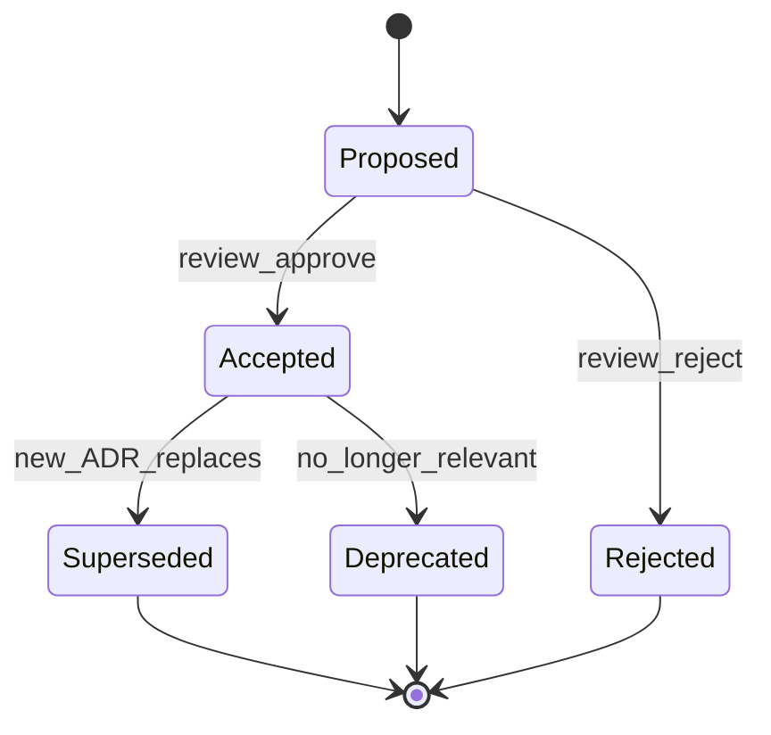

*Figure 1: ADR lifecycle—decisions remain visible when superseded rather than deleted.*

### 6.3 Decision flow in organization

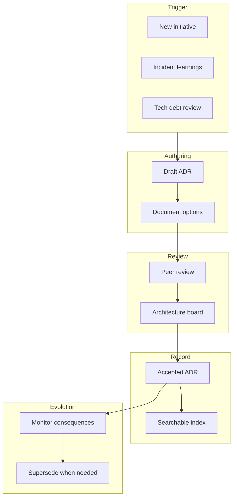

*Figure 2: Organizational ADR flow—from trigger through review to living documentation.*

### 6.4 When to write an ADR

Write when the decision is **hard to reverse**, **affects multiple teams**, or **embeds significant tradeoffs**:

- Choice of database, messaging, or cloud region strategy
- Public API versioning policy
- Authentication architecture (SSO, zero trust)
- Data retention and encryption standards
- Breaking apart a monolith boundary

Skip ADRs for routine library bumps unless security-critical.

### 6.5 Option scoring matrix (optional extension)

For contentious decisions, attach a weighted scorecard—transparent, revisitable, and useful in ARB debates. Weights should reflect **documented drivers**, not post-hoc justification.

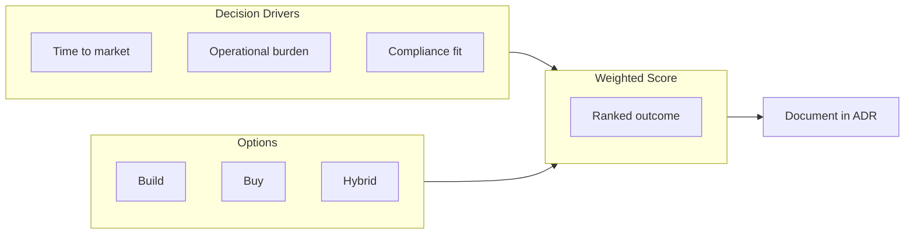

*Figure 3: Weighted option scoring feeds the ADR outcome section—scores are advisory; human judgment still decides.*

| Criterion (weight) | Build | Buy | Hybrid |
|--------------------|-------|-----|--------|
| Time to market (0.35) | 2 | 4 | 3 |
| Ops burden (0.25) | 2 | 4 | 3 |
| Compliance fit (0.25) | 4 | 3 | 4 |
| 3-year TCO (0.15) | 3 | 3 | 3 |

Illustrative scores only—your ADR should define scales (1–5) and who assigned weights.

### 6.6 ADR tiers by blast radius

| Tier | Examples | Review path |
|------|----------|-------------|
| **T1 — Team local** | Internal library choice | Tech lead + peer |
| **T2 — Domain** | Service boundary, datastore | Domain architect |
| **T3 — Enterprise** | Identity model, multi-cloud | ARB + security |
| **T4 — Material** | Regulated data handling, M&A integration | ARB + legal + exec sponsor |

Tiering prevents ARB bottlenecks while preserving scrutiny for high-blast-radius choices.

## 7. Step-by-Step Walkthrough

### 7.1 Example: choosing event bus technology

**Context:** Order service must publish domain events to five consumers. Peak 5K events/sec. Team skill: Kafka experience limited.

**Drivers:** Durability, replay, ops headcount, 99.9% availability, cost ceiling $8K/month.

**Options:**

1. **Amazon SQS/SNS** — managed, simpler ops, limited replay
2. **Amazon MSK (Kafka)** — replay, stream processing, higher ops
3. **Database outbox + polling** — transactional consistency, lower throughput ceiling

**Outcome:** MSK with three-broker cluster—replay required for fraud analytics; team commits to platform SRE partnership.

**Positive:** Durable log, consumer scaling, ecosystem.

**Negative:** Operational complexity, rebalancing pain, need schema registry discipline.

**Supersession note:** If volume stays below 500/sec for two years, revisit SQS+DLQ per ADR review policy.

### 7.2 Review meeting (30 min)

1. Author presents context and drivers (5 min).
2. Clarifying questions (10 min).
3. Challenge options and missing consequences (10 min).
4. Vote: accept, accept with conditions, request revision (5 min).

Conditions example: "Accept if PoC demonstrates consumer lag < 5s at 2× peak."

### 7.3 Linking ADRs to delivery artifacts

Accepted ADRs should spawn traceable work:

1. **Epics/tickets** reference `ADR-0042` in description.
2. **Pull requests** link ADR when implementing decision.
3. **Fitness functions** encode testable constraints ("no cross-region PII without ADR-0031").
4. **Runbooks** note operational consequences from negative section.

This closes the loop between **decision** and **reality**—principal architects audit whether shipped systems match accepted ADRs during architecture fitness reviews.

### 7.4 Supersession example narrative

When ADR-0012 (monolithic deployment) is superseded by ADR-0089 (containerized services), the new ADR's context section should summarize **what changed**: team scale doubled, deploy frequency requirement moved from weekly to daily, and incident MTTR attributed to slow rollbacks. The old ADR remains searchable with header:

> **Status:** Superseded by [ADR-0004](/docs/architecture-leadership/architecture-decision-records) (see repository `architecture-decisions/`)

Future engineers understand evolution instead of assuming 2019 constraints still bind.

## 8. Invariants and Guarantees

ADRs are a **documentation mechanism**, not a proof system:

| Property | What ADRs provide | What they do not provide |
|----------|-------------------|--------------------------|
| **Traceability** | Link decision to rationale | Guarantee correct decision |
| **Immutability of history** | Supersede, don't delete | Prevent bad outcomes |
| **Consistency** | Template encourages completeness | Uniform quality without review |
| **Safety** | Records accepted risk | Enforce compliance automatically |

Treat **accepted** ADRs as organizational commitments until superseded.

## 9. Failure Scenarios

| Failure | Symptom | Mitigation |
|---------|---------|------------|
| **ADR graveyard** | Docs written, never read | Link from repos, onboarding, PR template |
| **Rubber stamping** | Empty options section | Require ≥2 real alternatives |
| **No owner** | Stale proposed ADRs | SLA for review; named decider |
| **Too granular** | ADR per endpoint | Significance threshold |
| **Too vague** | "Use best practices" | Measurable drivers |
| **Political capture** | Options straw-manned | Independent reviewer |
| **Never superseded** | Wrong doc trusted | Periodic fitness review |
| **Secrets in ADR** | Leaked credentials | Redact; link to vault |
| **Duplicate ADRs** | Conflicting records | Central index; search before write |

## 10. Performance Characteristics

| Activity | Typical effort |
|----------|----------------|
| Draft ADR | 1–4 hours |
| Review cycle | 1–2 weeks (org dependent) |
| Read ADR for onboarding | 10–20 min |
| Search historical decision | Seconds with good index |

**Value compounds**—early investment pays off across years and reorganizations.

## 11. Scalability Limits

| Limit | Cause |
|-------|-------|
| **Review bottleneck** | ARB meets biweekly |
| **Index sprawl** | Hundreds of ADRs without tags |
| **Inconsistent templates** | Multiple teams, no lint |
| **Language drift** | Acquisitions, different formats |

Mitigation: delegate tier-2 decisions to teams; automated ADR lint in CI; federated ADRs with global principles ADR.

## 12. Operational Considerations

- **Repository:** `architecture-decisions/` in monorepo or dedicated repo.
- **Numbering:** `ADR-0001-title.md` sequential, never reuse numbers.
- **CI:** Lint for required sections; link checker.
- **Discovery:** Backstage/catalog, Confluence mirror, or docs site.
- **PR integration:** "Does this need an ADR?" checkbox.
- **Quarterly review:** Deprecated drivers? Supersede candidates?

## 13. Security Considerations

- ADRs may reference **threat models** and **control selections**—handle classification labels.
- Do not embed secrets, customer data, or exploit details.
- Access control if ADRs contain acquisition-sensitive strategy.
- Tamper-evident storage for regulated industries (signed commits).

## 14. Cost Considerations

| Cost | Benefit |
|------|---------|
| Author time | Avoid wrong multi-year bets |
| Review meeting time | Align cross-team dependencies |
| Tooling | Search, templates, automation |

Compare to cost of **re-platforming** after undocumented pivot—often orders of magnitude higher.

## 15. Production Implementations

| Approach | Notes |
|----------|-------|
| **Michael Nygard popularization** | Lightweight ADR blog post (2011)—widely adopted |
| **MADR templates** | Markdown variants with structured sections |
| **ThoughtWorks Tech Radar** | Complements ADRs with adopt/hold signals |
| **Spotify / inner source** | RFC + ADR combinations |
| **Backstage ADR plugin** | Discoverability in developer portals |
| **adr-tools (Nat Pryce)** | CLI for creating/managing ADRs |

These are **implementation choices**—pick template matching org culture.

### 15.1 Measuring ADR program health

| Signal | Healthy pattern | Unhealthy pattern |
|--------|-----------------|-------------------|
| **Search hits** | Engineers find ADRs during design | Zero views after publish |
| **Supersession rate** | Occasional, explained | Never; or constant churn |
| **Time to accept** | Days for T1, weeks for T3 | Months in "Proposed" |
| **Incident correlation** | Postmortems cite relevant ADRs | "Unknown why we chose X" |
| **Onboarding feedback** | ADRs cited as helpful | Oral history only |

Quarterly, architecture leadership should review metrics and retire templates that teams evade—usually a sign of excessive friction, not engineer apathy.

## 16. Alternatives and Tradeoffs

| Alternative | When better | Weakness |
|-------------|-------------|----------|
| **Wiki pages** | Narrative architecture docs | Poor versioning, no status |
| **RFC only** | Broad process change | Heavy for small decisions |
| **Code comments** | Local implementation detail | Not discoverable org-wide |
| **C4 diagrams only** | Structure visualization | Missing rationale |
| **Verbal architecture review** | Fast informal teams | No persistence |
| **Enterprise APM/GRC tools** | Regulated audit trails | Expensive, slow |

ADRs excel at **decision traceability**; combine with diagrams and runbooks.

When ADRs coexist with **RFCs** (larger proposed changes) and **design docs** (how to build), clarify boundaries in a short `README.md` at the architecture-decisions root:

- **RFC** — exploratory, may not decide
- **ADR** — records a decision with status
- **Design doc** — implementation plan assuming ADR accepted

Confusion between these three document types is a top source of "we thought that was decided" friction in large engineering orgs. A one-page index listing all accepted ADRs by domain (data, identity, messaging) pays for itself the first time a team avoids re-opening a settled debate during a deadline crunch.

## 17. Common Misconceptions

| Misconception | Reality |
|---------------|---------|
| "ADRs are bureaucracy" | Lightweight when scoped correctly |
| "Only architects write ADRs" | Best authored by implementing teams |
| "Accepted = forever" | Supersede when context changes |
| "One ADR per project" | One per significant decision |
| "Negative consequences admit failure" | Honesty builds trust |
| "Options section is optional" | Without options, it's advocacy not decision record |

## 18. Principal Architect Perspective

- **Model ADR discipline**—write ADRs for your own controversial calls.
- **Teach the Y-statement** for executive summaries.
- **Tie ADRs to metrics**—"we'll revisit if p99 > X."
- **Celebrate supersession**—learning, not blame.
- **Keep ADRs close to code**—same repo or linked PRs.
- **Distinguish principles from point decisions**—principles ADR rarely changes; point ADRs churn.

### 18.1 Coaching teams to write better ADRs

Principal architects improve ADR quality through **review feedback**, not template police work:

| Weak draft signal | Coaching question |
|-------------------|-------------------|
| Single option listed | "What did you reject and why?" |
| Vague drivers | "Which metric breaks if we choose wrong?" |
| Missing negative consequences | "What will ops hate about this?" |
| No links | "Which RFC or incident motivated this?" |
| Perpetual Proposed | "Who must approve by Friday?" |

Run **ADR office hours** monthly—low ceremony, high leverage. Bring one live draft; critique in public to normalize imperfection and iteration.

### 18.2 ADRs in regulated environments

Financial, healthcare, and government contexts may require ADRs to map to **control frameworks** (change management, separation of duties). Cross-reference ADR IDs in change tickets so auditors trace **who approved what, when, and on what evidence**. This is operational practice, not a formal proof—but it materially reduces audit friction.

## 19. Architecture Review Exercise

> **Diagram convention:** Steps are labeled **1, 2, 3…** in diagrams and tables below.

**Scenario:** An ADR from 2019 mandates MongoDB for all new services. A team wants PostgreSQL for a financial ledger requiring strong ACID.

**Tasks:**

1. Read ADR—identify drivers still valid vs. stale.
2. Draft superseding ADR with ledger-specific drivers.
3. Define migration path for existing Mongo services (none required immediately).
4. Propose ARB agenda and dissent handling.

---

### Task 1 — Read ADR-2019: valid vs. stale drivers

**Assumed original ADR (ADR-2019-003: MongoDB as default datastore for new services):**

| Section | Original content (2019) |
|---------|-------------------------|
| **Context** | Monolith decomposed into microservices; need fast schema iteration |
| **Drivers** | Time to market; schema flexibility; horizontal scale; team MongoDB skill; avoid RDBMS migration overhead |
| **Decision** | All new services use MongoDB unless ARB exception |
| **Consequences** | Single ops playbook; risk of inappropriate fit for transactional workloads |

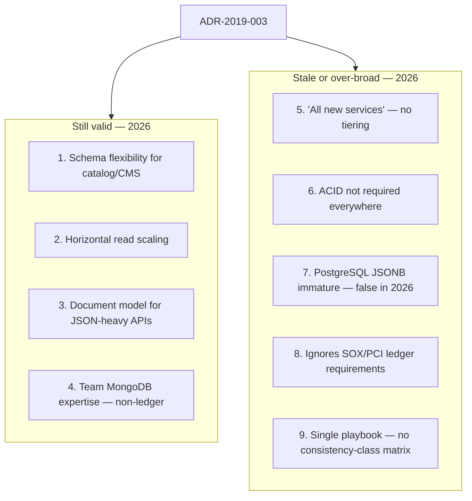

**Step-by-step flow:**

| Step | Driver (2019) | Status | Rationale |
|------|---------------|--------|-----------|
| **1** | Schema flexibility | **Valid** | Product catalog, content, user preferences still benefit from document model |
| **2** | Horizontal scale | **Valid** | Sharded MongoDB remains appropriate for read-heavy, eventually consistent workloads |
| **3** | Time to market | **Partially valid** | Still true for greenfield CRUD — not for regulated financial core |
| **4** | Team MongoDB skill | **Valid** | Sunk cost for 40+ services — don't force migration |
| **5** | "All new services" | **Stale** | Blanket mandate ignores **consistency-class** differences |
| **6** | "ACID not needed" | **Stale** | Financial ledger requires **serializable or strong isolation** — non-negotiable |
| **7** | PostgreSQL JSON weak | **Stale** | PostgreSQL 15+ JSONB, partitioning, and HA are production-grade |
| **8** | No compliance tier | **Stale** | SOX, PCI-DSS, audit trail requirements emerged post-2019 |
| **9** | One datastore | **Stale** | Mature orgs use **polyglot persistence** with explicit selection matrix |

**Technical conclusion:** Do not repeal ADR-2019 entirely — **narrow its scope** and **supersede the blanket rule** with a tiered datastore policy. ADR-2019 remains **accepted** for Tier-2/3 services; a new ADR adds Tier-1 ledger requirements.

---

### Task 2 — Draft superseding ADR

**ADR-2026-014: PostgreSQL for Tier-1 financial ledger services**

*Supersedes the blanket applicability of ADR-2019-003 for services classified as Tier-1 Ledger.*

```markdown
# ADR-2026-014: PostgreSQL for Tier-1 Financial Ledger Services

## Status
Accepted — supersedes ADR-2019-003 **for Tier-1 Ledger services only**

## Date
2026-07-30

## Context
The Payments team is building a double-entry ledger for customer balances,
settlements, and fee accruals. SOX controls require auditable, strongly
consistent financial records. ADR-2019-003 mandates MongoDB for all new
services; this conflicts with ledger NFRs.

## Decision Drivers
- **D1:** ACID guarantees — no lost or duplicate debits/credits
- **D2:** Isolation — SERIALIZABLE or SELECT FOR UPDATE on balance rows
- **D3:** Audit trail — immutable append-only journal; point-in-time recovery
- **D4:** SOX / PCI — change control, separation of duties, queryable history
- **D5:** Operational maturity — existing PostgreSQL RDS/Aurora fleet and DBA team
- **D6:** Reversibility cost — ledger migration is extremely expensive; choose correctly now

## Considered Options

### Option A — MongoDB 6.x with multi-document transactions
- Good: Aligns with ADR-2019; team knows MongoDB
- Bad: Multi-doc transactions have performance overhead; fewer SOX audit patterns;
  complex isolation semantics; not default posture for financial cores

### Option B — PostgreSQL (Aurora PostgreSQL)
- Good: Native ACID; mature ledger patterns; RDS PITR; team DBAs; SOX audit tooling
- Bad: Schema migrations slower than MongoDB; vertical scale limits (mitigated by Aurora)

### Option C — CockroachDB / Google Spanner
- Good: Global strong consistency; horizontal scale
- Bad: Higher cost and ops complexity; no existing org expertise; overkill for single-region ledger v1

## Decision Outcome
**Chosen: Option B — PostgreSQL (Aurora PostgreSQL)** for Tier-1 Ledger services.

Tier-1 Ledger definition: any service that records monetary balances, settlements,
or financial obligations requiring strong consistency and regulatory audit.

### Positive Consequences
- Meets SOX/PCI audit requirements with established controls
- Leverages existing Aurora fleet, backup, and monitoring
- Clear isolation semantics for double-entry invariants

### Negative Consequences
- Two datastore playbooks (MongoDB + PostgreSQL) — ops complexity
- Payments team must adopt SQL schema migration discipline (Flyway/Liquibase)
- ADR-2019 must be amended — political cost with MongoDB advocates

## Pros and Cons Summary
| Criterion | MongoDB | PostgreSQL | CockroachDB |
|-----------|---------|------------|-------------|
| ACID / isolation | Partial (txn overhead) | Strong (native) | Strong (distributed) |
| SOX audit fit | Weak | Strong | Strong |
| Team familiarity | High | Medium (DBA support) | Low |
| Time to market | Fast | Medium | Slow |
| 3-year TCO | Medium | Medium | High |

## Links
- Supersedes applicability of: ADR-2019-003 (scoped exception)
- Related: ADR-2024-008 (Aurora standard for relational tier)
- Ticket: PAY-4821 Ledger v2 architecture review
```

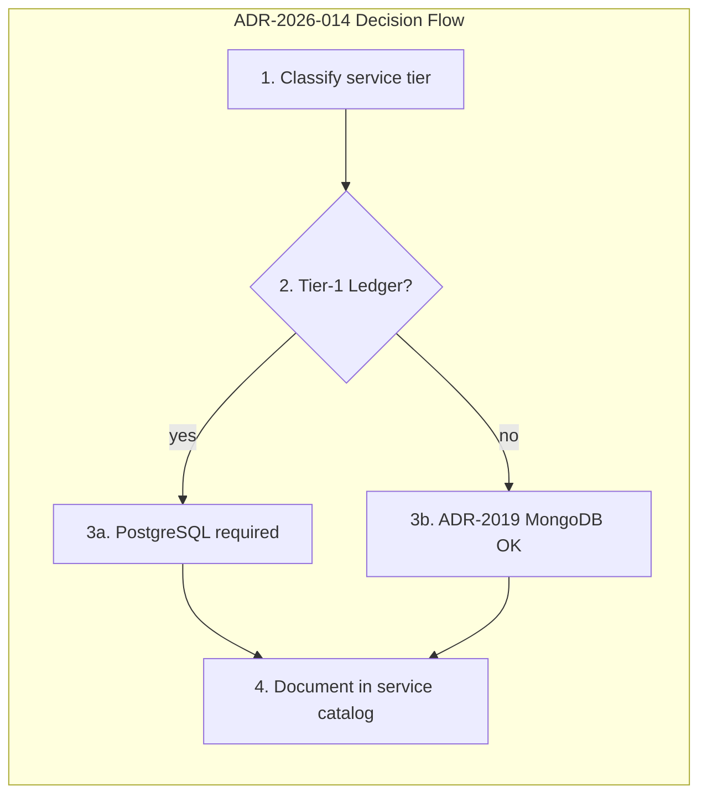

**Step-by-step flow:**

| Step | Action | Explanation |
|------|--------|-------------|
| **1** | Classify tier | Every new service declares Tier-1/2/3 in service catalog |
| **2** | Tier-1 Ledger? | Money movement, balances, settlements → PostgreSQL |
| **3a** | PostgreSQL required | ADR-2026-014 applies; ARB sign-off on schema design |
| **3b** | MongoDB OK | ADR-2019 still governs catalog, content, preferences |
| **4** | Catalog entry | CI fitness function validates DB matches tier |

---

### Task 3 — Migration path (no immediate Mongo migration)

**Principle:** Grandfather existing MongoDB services; apply new policy **forward-only** unless incident or compliance forces migration.

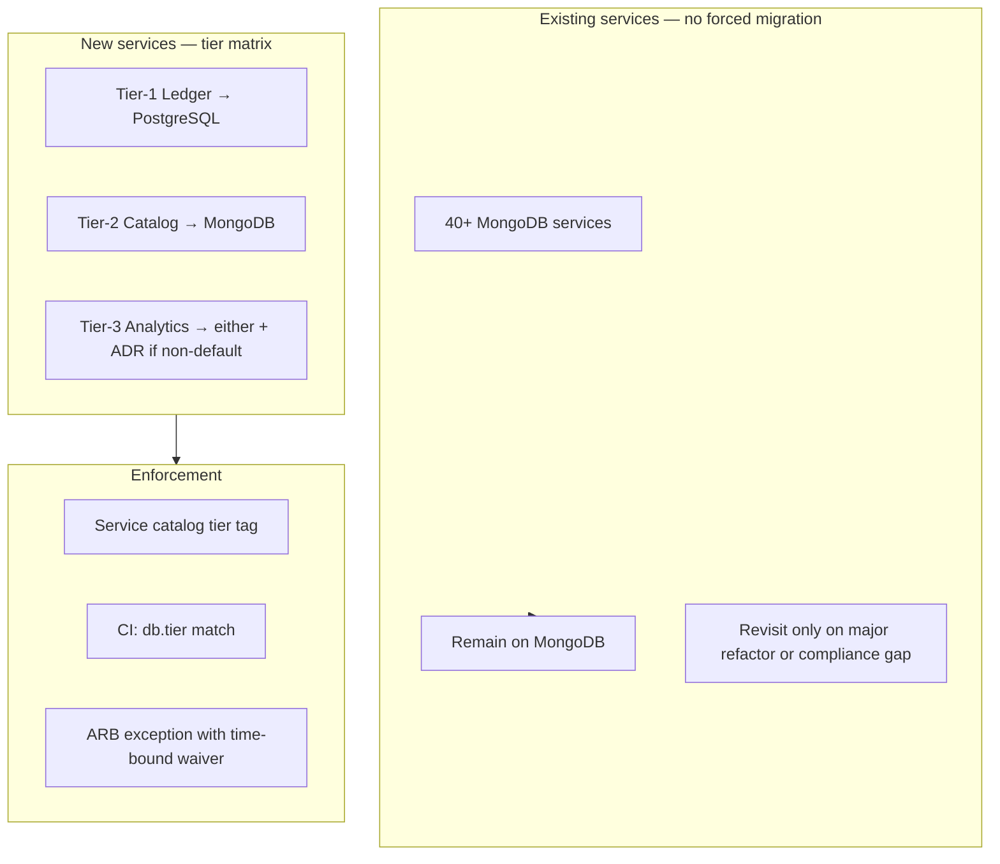

**Datastore selection matrix (amendment to ADR-2019):**

| Tier | Consistency | Example workloads | Default DB | ADR required |
|------|-------------|-------------------|------------|--------------|
| **Tier-1 Ledger** | Strong ACID | Balances, payments, settlements | **PostgreSQL** | ADR-2026-014 |
| **Tier-2 Operational** | Eventual OK | Catalog, profiles, notifications | MongoDB | ADR-2019-003 |
| **Tier-3 Analytical** | Eventual | Reporting, search indexes | ClickHouse / OpenSearch | Per-service ADR |

**Migration path steps:**

| Step | Action | Timeline | Notes |
|------|--------|----------|-------|
| **1** | Publish ADR-2026-014 + matrix amendment | Week 1 | ADR-2019 status → "Accepted (scoped)" |
| **2** | Add `data_tier` field to service catalog | Week 2–3 | All new services must set tier at creation |
| **3** | CI fitness function: Tier-1 cannot use MongoDB | Week 4 | Blocks non-compliant new repos |
| **4** | Inventory existing Mongo services | Week 4–6 | Tag tier retroactively; flag compliance gaps |
| **5** | No forced migration | Ongoing | Existing Mongo services unchanged |
| **6** | Optional strangler | Per-team | If Mongo service becomes ledger-like, plan migration ADR |

**Technical note for ledger team:** Use **double-entry schema** in PostgreSQL — `journal_entries` (append-only) + `accounts` (balance derived or materialized with row locks). Never store authoritative balances only in application memory.

```sql
-- Illustrative ledger invariant (simplified)
CREATE TABLE journal_entries (
  id          BIGSERIAL PRIMARY KEY,
  txn_id      UUID NOT NULL,
  account_id  BIGINT NOT NULL,
  amount      NUMERIC(19,4) NOT NULL CHECK (amount != 0),
  side        CHAR(1) NOT NULL CHECK (side IN ('D','C')),
  created_at  TIMESTAMPTZ NOT NULL DEFAULT now()
);
-- Application enforces SUM(debits) = SUM(credits) per txn_id in SERIALIZABLE transaction
```

---

### Task 4 — ARB agenda and dissent handling

**ARB session: ADR-2026-014 (60 minutes)**

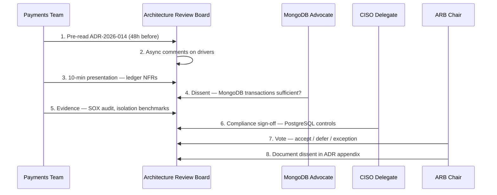

**ARB agenda (timed):**

| Time | Item | Owner |
|------|------|-------|
| **0–5 min** | Context: why ADR-2019 blocks ledger | Payments architect |
| **5–15 min** | ADR-2026-014 walkthrough — drivers, options, outcome | Author |
| **15–25 min** | Q&A — technical depth (isolation, audit, ops) | ARB members |
| **25–35 min** | Dissent session — MongoDB advocate presents counter | Documented minority view |
| **35–45 min** | Compliance review — SOX/PCI mapping | CISO delegate |
| **45–55 min** | Scope amendment to ADR-2019 — tier matrix | Platform architect |
| **55–60 min** | Decision: Accept / Defer / Accept with conditions | ARB chair |

**Dissent handling protocol:**

| Step | Action | Detail |
|------|--------|--------|
| **1** | **Pre-read required** | ADR distributed 48h before; async comments in GitHub/Confluence |
| **2** | **Document minority opinion** | Appendix: "Dissenting view — MongoDB transactions" with technical arguments |
| **3** | **Decision not by consensus** | ARB chair decides after hearing dissent — not unanimous vote required |
| **4** | **Time-bound exception path** | If dissent persists: 90-day pilot with success criteria (see below) |
| **5** | **Escalation** | Unresolved material risk → CTO decision memo within 5 business days |
| **6** | **No ad hominem** | Critique drivers and evidence, not authors |
| **7** | **Record in ADR** | Accepted ADR links dissent appendix; preserves institutional memory |

**Optional pilot (if ARB defers):**

| Criterion | MongoDB pilot must demonstrate |
|-----------|-------------------------------|
| **Correctness** | Zero duplicate postings under chaos testing |
| **Audit** | SOX auditor accepts transaction log format |
| **Performance** | p99 write &lt; 50ms at 2K TPS settlement load |
| **Ops** | PITR recovery within RPO 15 min |

If pilot fails any criterion → PostgreSQL per ADR-2026-014 without further debate.

---

### Model answer summary

| Task | Strong answer in one line |
|------|---------------------------|
| **1. Valid vs stale** | Keep MongoDB drivers for flexible/catalog tiers; stale = blanket "all services" and ignoring ACID/compliance |
| **2. Superseding ADR** | ADR-2026-014: PostgreSQL for Tier-1 Ledger; scoped exception, not full repeal of ADR-2019 |
| **3. Migration** | Forward-only tier matrix; grandfather existing Mongo; CI enforces tier on new services |
| **4. ARB + dissent** | Timed agenda, pre-read, documented minority opinion, chair decides, optional time-bound pilot |

**Evaluation rubric:**

| Score | Criteria |
|-------|----------|
| **Strong** | Tiered datastore matrix; full ADR with 3 options; scoped supersession; dissent appendix; CI enforcement; SOX/compliance cited |
| **Adequate** | Chooses PostgreSQL with reasons but doesn't scope ADR-2019 or address existing services |
| **Weak** | "Just use PostgreSQL" or "repeal MongoDB ADR entirely" without migration or governance plan |

---

"ADRs capture one architectural decision with context, drivers, at least two options, the chosen outcome, and positive and negative consequences. They have a status lifecycle—proposed, accepted, deprecated, superseded. We never delete accepted ADRs; we supersede them when context changes so future engineers understand evolution. ADRs reduce repeated debates, speed onboarding, and create compliance evidence. They're not for every library choice—only decisions that are costly to reverse or cross team boundaries."

## 21. Interview Questions

1. **What is an ADR and why use it?** — Traceability, onboarding, debate reduction.
2. **What sections belong in an ADR?** — Context, drivers, options, outcome, consequences, status.
3. **When not to write an ADR?** — Trivial, easily reversible choices.
4. **How handle superseded decisions?** — New ADR links supersedes; old remains for history.
5. **ADR vs. RFC?** — ADR narrower, decision-focused; RFC broader proposal.
6. **How ensure ADRs are read?** — PR templates, onboarding, tooling integration.
7. **Example driver vs. option.** — Driver: latency; Option: Redis vs. Memcached.
8. **Document negative consequences?** — Yes—accepted tradeoffs and debt.
9. **Who approves ADRs?** — Team + ARB depending on blast radius.
10. **ADR for build vs. buy?** — Yes—classic high-stakes decision.
11. **How ADRs help incidents?** — Reveal assumed guarantees vs. reality.
12. **Fitness functions relation?** — Automate validation of ADR constraints.

## 22. Interview Follow-Ups

1. **Team ignores ADR and ships different stack.** — Governance, CI guardrails, leadership escalation.
2. **Two ADRs conflict.** — Supersession chain; principles ADR hierarchy.
3. **Sensitive acquisition—ADR visibility?** — Access-controlled repo; redacted public summary.
4. **Measure ADR program success?** — Onboarding time, repeated debate frequency, incident correlation.
5. **ADR in agile/fast startups?** — Lightweight template; retroactive ADRs for core choices.

## 23. Strong Answer Example

**Question:** "Describe how you'd introduce ADRs to a 200-engineer org with no documentation culture."

**Strong outline:** "I'd start with a lightweight MADR template and three pilot teams working on high-stakes migrations. Executive sponsor announces ADRs as decision memory, not approval theater. Integrate a PR checkbox: 'Architectural decision? Link ADR.' Staff a monthly 60-minute ARB for cross-cutting decisions only—most ADRs accepted within team plus one architect reviewer. Store in `architecture-decisions/` with sequential numbering in the main monorepo. Backfill two retroactive ADRs for existing contentious choices to show value. Measure onboarding feedback at 90 days. After quarter one, add CI lint for required sections. Celebrate a superseding ADR publicly to normalize change."

## 24. Weak Answer Example

**Weak:** "We should document decisions in Confluence. It's good practice."

**Red flags:** No structure, no lifecycle, no options, no adoption plan, no tradeoffs.

## 25. Hands-On Exercise

> **Worked example:** This section completes all five steps using a realistic decision — **distributed session cache: Redis vs Memcached vs in-memory only** — for a global e-commerce platform handling 50K RPS.

**Your tasks:**

1. Pick a real decision (DB, cache, deployment strategy).
2. Draft ADR using full template with three options.
3. Peer review: are drivers measurable? are cons honest?
4. Add supersession link from a fictional prior ADR.
5. Create index README listing all ADRs with status table.

---

### Step 1 — Pick a real decision

| Field | Choice |
|-------|--------|
| **Decision** | Distributed session cache for customer-facing API |
| **Context** | 50K RPS peak; 12 regional deployments; sessions must survive pod restarts; p99 session lookup &lt; 5ms |
| **Why this decision qualifies** | Hard to reverse once 40 services embed session client; affects all product teams; significant cost and ops tradeoffs |
| **Prior art** | ADR-2021-007 mandated in-process session maps (see Step 4 supersession) |

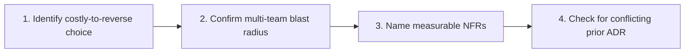

**Step-by-step flow:**

| Step | Action | This example |
|------|--------|--------------|
| **1** | Pick decision with lock-in | Session store choice affects auth, cart, checkout |
| **2** | Confirm significance | 40 services × 12 regions = org-wide impact |
| **3** | Write measurable drivers | p99 &lt; 5ms, 99.99% availability, GDPR session TTL |
| **4** | Search existing ADRs | Found ADR-2021-007 (in-memory only) — must supersede |

---

### Step 2 — Draft ADR (full template, three options)

```markdown
# ADR-2026-021: Redis Cluster for Distributed Session Cache

## Status
Proposed

## Date
2026-07-30

## Context
Customer sessions (cart, auth tokens, personalization) are stored in per-pod
in-memory maps per ADR-2021-007. Pod restarts during deployments log users out;
horizontal scaling does not share sessions; p99 login spikes during rollouts.
Peak traffic: 50K RPS; 2M active sessions; 12 AWS regions.

## Decision Drivers
- **D1:** Session lookup p99 < 5ms (measured at API gateway)
- **D2:** 99.99% session store availability (SLO)
- **D3:** Survive pod restart without session loss
- **D4:** GDPR — session TTL max 24h; delete on user request within 60s
- **D5:** 3-year TCO < $400K for session tier
- **D6:** Team can operate with existing ElastiCache expertise

## Considered Options

### Option A — In-memory only (status quo, ADR-2021-007)
Sticky sessions via load balancer; session data in JVM heap.

### Option B — Memcached (ElastiCache)
Simple GET/SET; multi-AZ; no persistence by design.

### Option C — Redis Cluster (ElastiCache)
Hash slots; optional persistence; TTL native; pub/sub for logout fan-out.

## Decision Outcome
**Chosen: Option C — Redis Cluster (ElastiCache)** with cluster mode enabled,
3 shards per region, replica per shard.

Rationale: Meets D1–D4; team already runs Redis for rate limiting (ADR-2024-011);
pub/sub enables global logout propagation; persistence optional for warm restart.

### Positive Consequences
- Sessions survive pod restarts and scale-out
- p99 session lookup measured at 1.2ms in load test (target 5ms)
- Unified Redis ops playbook with rate-limit cluster
- TTL enforcement native — GDPR delete = DEL key

### Negative Consequences
- **+$180K/year** vs in-memory (ElastiCache cost)
- New failure domain — Redis outage affects all logins
- Hot-key risk on flash-sale sessions — requires key sharding by session_id
- Migration effort: 6 engineer-weeks across 40 services

## Pros and Cons of Options

### Option A — In-memory (status quo)
- Good: Zero infra cost; simplest code path
- Bad: Logout on deploy; no horizontal session share; violates D3

### Option B — Memcached
- Good: Lowest latency in benchmarks; simple protocol; lower cost than Redis
- Bad: No pub/sub for logout fan-out; no persistence; limited data structures

### Option C — Redis Cluster
- Good: TTL, pub/sub, persistence option, team expertise, cluster mode sharding
- Bad: Higher cost than Memcached; ops complexity vs in-memory

## Option Scorecard (weighted)

| Criterion (weight) | In-memory | Memcached | Redis |
|--------------------|-----------|-----------|-------|
| p99 latency (0.25) | 5 | 5 | 4 |
| Availability (0.20) | 2 | 4 | 4 |
| Survive restart (0.25) | 1 | 4 | 5 |
| GDPR / TTL (0.15) | 3 | 4 | 5 |
| 3-year TCO (0.15) | 5 | 4 | 3 |
| **Weighted total** | **2.8** | **4.2** | **4.3** |

## Links
- Supersedes: ADR-2021-007 (in-memory session maps)
- Related: ADR-2024-011 (Redis for rate limiting)
- Load test: PERF-8821 session benchmark results
- Ticket: PLAT-3392 session externalization
```

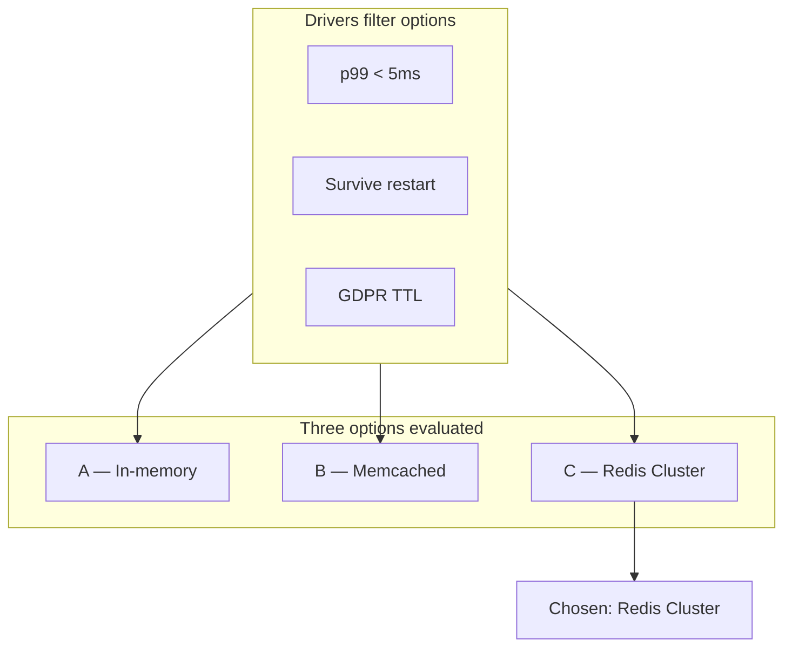

---

### Step 3 — Peer review checklist

Use this rubric when reviewing your own or a teammate's ADR draft.

| Review question | Pass? | Evidence in ADR-2026-021 |
|-----------------|-------|--------------------------|
| **Are drivers measurable?** | ✅ | D1: p99 &lt; 5ms; D2: 99.99% SLO; D4: delete within 60s |
| **Are drivers testable before decision?** | ✅ | PERF-8821 load test cited; benchmark numbers in outcome |
| **At least two real alternatives?** | ✅ | Three options with honest pros/cons |
| **Are negative consequences honest?** | ✅ | +$180K/year, new failure domain, 6 engineer-weeks migration |
| **Is outcome tied to drivers, not preference?** | ✅ | Scorecard + D3 (restart survival) eliminates Option A |
| **Single option disguised as decision?** | ✅ | Option A (status quo) seriously evaluated |
| **Vague language flagged?** | ⚠️ Fix | Change "fast enough" → "p99 &lt; 5ms" (done in draft) |
| **Ops burden acknowledged?** | ✅ | Redis outage risk; hot-key sharding called out |

**Peer review comments (simulated):**

| Reviewer | Comment | Author response |
|----------|---------|-----------------|
| **SRE** | "What happens when Redis region fails?" | Added DR runbook link; RTO 15 min via cross-AZ replica failover |
| **Security** | "Session data encrypted at rest?" | Added: TLS in transit + ElastiCache encryption at rest (KMS) |
| **Cost** | "$180K is a lot" | Compared to revenue loss from checkout abandonment during deploys |
| **Staff engineer** | "Why not Memcached — 0.3ms faster?" | Pub/sub for global logout required; Memcached lacks native pub/sub |

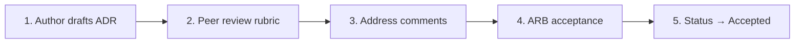

**Red flags that fail peer review:**

- Drivers like "we need something scalable" (not measurable)
- No negative consequences section
- Chosen option listed without rejected alternatives
- Missing links to load tests or incidents that motivated the decision

---

### Step 4 — Supersession link from fictional prior ADR

**Prior ADR (fictional, remains in repo for history):**

```markdown
# ADR-2021-007: In-Memory Session Maps for API Tier

## Status
Superseded by ADR-2026-021

## Date
2021-03-15

## Context
Early microservices migration; 200 RPS; minimize infrastructure dependencies.

## Decision Outcome
Chosen: In-memory ConcurrentHashMap per pod with ALB sticky sessions.

### Negative Consequences (realized by 2026)
- Users logged out on every deployment
- Cannot scale pods without sticky-session imbalance
- Session data lost on OOM kill

## Links
- Superseded by: ADR-2026-021
```

**Supersession chain diagram:**

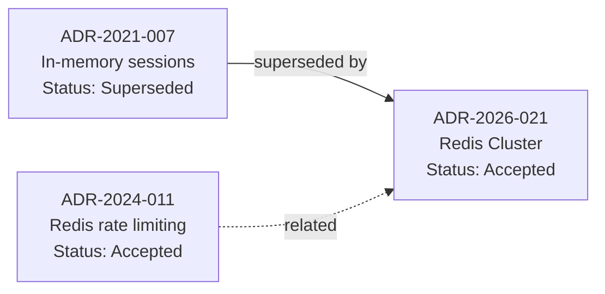

**Step-by-step flow:**

| Step | Action | Detail |
|------|--------|--------|
| **1** | New ADR references old | `Supersedes: ADR-2021-007` in Links section |
| **2** | Update old ADR status | Change status to `Superseded by ADR-2026-021` — **do not delete** |
| **3** | Preserve negative consequences on old ADR | Shows *why* change was needed — realized cons documented |
| **4** | Cross-link related ADRs | ADR-2024-011 (Redis ops) reduces risk of ADR-2026-021 |

---

### Step 5 — Index README with status table

Create `architecture-decisions/README.md` at the repo root (or docs site mirror):

```markdown
# Architecture Decision Records

Index of all ADRs for the e-commerce platform. ADRs are numbered sequentially;
never reuse numbers. Status lifecycle: Proposed → Accepted → Deprecated | Superseded.

## How to add an ADR

1. Copy `template.md` → `ADR-NNNN-short-title.md`
2. Fill all sections including **three options** and **negative consequences**
3. Open PR; link ADR in PR description if implementing
4. Request review from team architect + ARB if blast radius > 3 teams
5. On merge, update this index table

## ADR Index

| ID | Title | Status | Date | Domain | Author |
|----|-------|--------|------|--------|--------|
| `2021-007` | In-memory session maps | **Superseded** → `2026-021` | 2021-03-15 | Identity | J. Park |
| `2024-008` | Aurora PostgreSQL standard | Accepted | 2024-06-01 | Data | Platform team |
| `2024-011` | Redis for distributed rate limiting | Accepted | 2024-09-12 | Platform | A. Chen |
| `2026-014` | PostgreSQL for Tier-1 ledger | Accepted | 2026-07-30 | Payments | Payments arch |
| `2026-021` | Redis Cluster for session cache | **Proposed** | 2026-07-30 | Identity | You (exercise) |

## By status

| Status | Count | ADRs |
|--------|-------|------|
| Accepted | 3 | 008, 011, 014 |
| Proposed | 1 | 021 |
| Superseded | 1 | 007 → 021 |
| Deprecated | 0 | — |

## By domain

| Domain | ADRs |
|--------|------|
| Identity / sessions | 007, 021 |
| Data / persistence | 008, 014 |
| Platform / infra | 011 |

## Supersession chains

```
ADR-2021-007 (in-memory sessions)
    └── superseded by ADR-2026-021 (Redis session cache)
```

## Review schedule

Accepted ADRs reviewed **annually** in Q1 architecture offsite.
Next review: 2027-01-15.
```

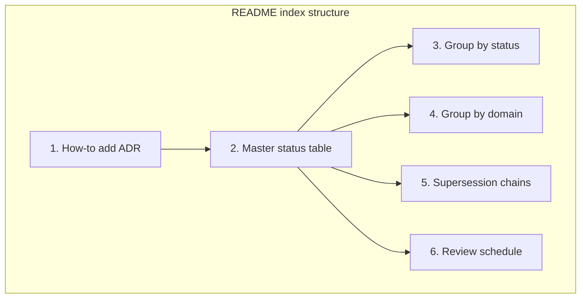

**Step-by-step flow:**

| Step | Index section | Purpose |
|------|---------------|---------|
| **1** | How-to | Onboarding — engineers know the workflow |
| **2** | Master table | Single searchable view of all ADRs |
| **3** | By status | Quick filter: what's Proposed vs Accepted |
| **4** | By domain | Teams find relevant decisions fast |
| **5** | Supersession chains | Visual history — never lose evolution context |
| **6** | Review schedule | Prevents ADRs becoming stale folklore |

---

### Exercise completion checklist

| # | Task | Deliverable | Done |
|---|------|-------------|------|
| **1** | Pick decision | Session cache; measurable NFRs documented | ✅ |
| **2** | Draft ADR | ADR-2026-021 full template, 3 options, scorecard | ✅ |
| **3** | Peer review | Rubric applied; simulated reviewer comments | ✅ |
| **4** | Supersession | ADR-2021-007 updated; chain diagram | ✅ |
| **5** | Index README | Status table, domain grouping, supersession chain | ✅ |

**Stretch goals (optional):**

- Add CI check: PR touching `session/` package must link an Accepted ADR
- Record 5-minute Loom walking through the ADR for onboarding
- Present ADR-2026-021 at next ARB as practice for interview loops

---

1. Name four ADR statuses.
2. Minimum options to document?
3. What is a decision driver?
4. Why not delete superseded ADRs?
5. ADR vs. design doc—difference?
6. What is a Y-statement?
7. When link ADR in pull request?
8. Name two anti-patterns.
9. Who should author ADRs?
10. How often review accepted ADRs?
11. What belongs in negative consequences?
12. Numbering convention best practice?

## 27. Flashcards

| Front | Back |
|-------|------|
| ADR purpose | Record context, options, decision, consequences |
| Status values | Proposed, Accepted, Deprecated, Superseded |
| Decision driver | Force shaping choice—latency, cost, compliance |
| Supersede | Replace ADR while preserving history |
| Y-statement | Context, problem, decision, benefit |
| MADR | Markdown ADR template variant |
| ADR graveyard | Written but unused docs—anti-pattern |
| Significance threshold | Criteria for when ADR required |
| Negative consequences | Accepted downsides and technical debt |
| ARB | Architecture review board for cross-cutting decisions |
| Fitness function | Automated check of architectural constraint |
| Nygard contribution | Popularized lightweight ADRs (2011) |

## 28. Cheat Sheet

```
ADR TEMPLATE
  Status | Date | Context | Decision Drivers
  Considered Options (≥2)
  Decision Outcome + Positive/Negative Consequences
  Pros/Cons per option | Links

LIFECYCLE
  Proposed → Accepted → Deprecated | Superseded

WHEN TO WRITE
  hard to reverse | multi-team | significant tradeoff

ANTI-PATTERNS
  no options | rubber stamp | secrets | never supersede

ORG ADOPTION
  template + repo + PR checkbox + pilot teams + ARB tiering
```

## 29. Related Concepts

- [System Design Methodology](/docs/system-design/system-design-methodology) — design process producing ADRs
- [Executive Communication](/docs/architecture-leadership/executive-communication) — summarizing decisions for leadership
- [Safety and Liveness](/docs/distributed-systems-foundations/safety-and-liveness) — formal properties ADRs may reference
- [Decision Frameworks](/docs/reference/decision-frameworks) — structured tradeoff analysis

## 30. References

### Primary sources

- Nygard, M. (2011). *Documenting Architecture Decisions.* Cognitect blog. [Foundational ADR concept]
- Zdun, U., et al. — Sustainable Architectural Decisions (peer-reviewed work on decision documentation)

### Templates and tooling (implementation choices)

- MADR: https://adr.github.io/madr/
- adr-tools: https://github.com/npryce/adr-tools
- Repository template in this project: `templates/adr-template.md`

### Books

- Ford, N., et al. (2021). *Fundamentals of Software Architecture.* O'Reilly. [Architecture governance]
- Richards, M., & Ford, N. (2020). *Fundamentals of Software Architecture.*

### Distinction

- **Formal guarantees** — ADRs may reference algorithmic properties but do not prove them.
- **Implementation choices** — Template format, repo location, ARB cadence.
- **Operational experience** — Adoption success depends on leadership modeling and tooling integration.
