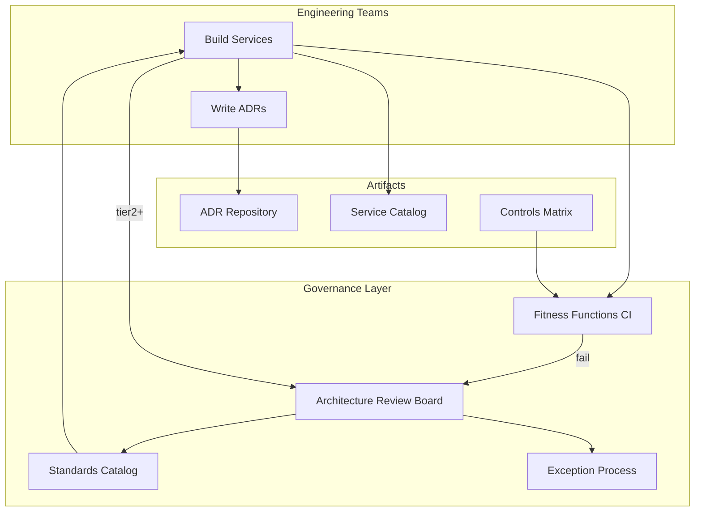
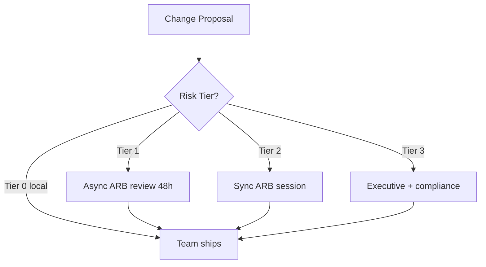
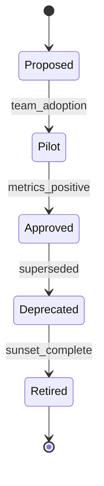

# Architecture Governance

## 1. Executive Summary

**Architecture governance** is the set of processes, standards, and decision rights that ensure systems evolve coherently across teams without becoming a bottleneck or bureaucracy theater. Effective governance balances **guardrails** (non-negotiable security, reliability, compliance baselines) with **team autonomy** (local decisions within boundaries). It includes **architecture review boards (ARBs)**, **standards catalogs**, **ADR workflows**, **fitness functions** (automated architectural checks), and **exception processes** for justified deviations.

Principal architects design governance that **scales with the organization**: lightweight for 50 engineers, federated for 500+, with clear escalation paths. Governance succeeds when teams ship faster *because* standards reduce rework—not when every design waits weeks for committee approval.

This chapter covers governance models, review criteria, anti-patterns (ivory tower, rubber stamp), integration with [Technical Strategy and Roadmaps](/docs/architecture-leadership/technical-strategy-and-roadmaps), and measurable outcomes: reduced incident classes, faster reviews, standards adoption rate.

## 2. Why This Topic Matters

Ungoverned architecture leads to:

- **Incompatible integration patterns** blocking acquisitions and partnerships.
- **Security regressions** from inconsistent auth implementations.
- **Operational nightmares** when every team picks different observability stacks.
- **Review theater** where boards exist but decisions are ignored.

Interviews test whether candidates can design **proportionate governance**—not "central committee approves everything." Follow-ups on exception handling, standards versioning, and relationship to product velocity separate principal-level systems thinking from checklist compliance.

## 3. Problems Being Solved

| Problem | Governance response |
|---------|---------------------|
| **Inconsistent patterns** | Published standards with examples |
| **Late risk discovery** | Tiered review triggers |
| **Tribal knowledge** | ADR repository |
| **Compliance gaps** | Mandatory controls checklist |
| **Review bottlenecks** | Self-service + async review |
| **Standards drift** | Versioned standards + sunset |
| **Shadow IT architecture** | Discovery via service catalog |
| **Blame without standards** | Documented baseline expectations |

## 4. Assumptions and System Model

| Assumption | Implication |
|------------|-------------|
| **Teams want to ship** | Governance must accelerate or neutral |
| **Risk is heterogeneous** | Tiered review depth by blast radius |
| **Standards evolve** | Versioning and migration windows |
| **Exceptions happen** | Time-bound waivers with ADR |
| **Automation scales** | Fitness functions in CI/CD |
| **Politics is real** | Transparent criteria reduce bias |

**Decision rights matrix (example):**

| Decision type | Owner |
|---------------|-------|
| Service internal refactor | Team |
| New external API product | Team + ARB consult |
| New data store technology | ARB approval |
| Cross-cutting platform | Principal architect + platform team |
| Security control waiver | CISO delegate + ADR |

## 5. Essential Terminology

| Term | Definition |
|------|------------|
| **ARB** | Architecture Review Board |
| **Guardrail** | Mandatory constraint (e.g., mTLS internal) |
| **Standard** | Recommended pattern with approved implementations |
| **Fitness function** | Automated architectural compliance check |
| **Exception / waiver** | Documented temporary deviation |
| **Tiered review** | Depth scales with risk classification |
| **Golden path** | Default supported platform approach |
| **Architecture runway** | Pre-approved capacity for initiative class |
| **Service catalog** | Registry of systems and owners |
| **Control framework** | SOC2/ISO mapped technical controls |
| **Principle** | Durable guideline (e.g., "prefer async integration") |
| **Sunset policy** | End-of-life for deprecated standards |

## 6. Core Mechanism

### 6.1 Governance operating model



*Figure 1: Governance—automated guardrails first; human review for high-tier changes.*

### 6.2 Tiered review flow



*Figure 2: Risk-tiered review—most changes never wait for meeting.*

### 6.3 Standards lifecycle



*Figure 3: Standards evolve through pilot evidence—not decree.*

### 6.4 Deep dives

**Review tier criteria (example):**

| Tier | Triggers | SLA |
|------|----------|-----|
| 0 | Internal refactor; no new deps | None |
| 1 | New microservice; standard stack | 48h async |
| 2 | New datastore; public API; PII | 1 week sync |
| 3 | Payment scope; multi-region; acquisition | 2 week + compliance |

**Fitness function examples:**

- OpenAPI breaking-change detector in CI.
- Terraform policy: no public S3 buckets.
- OPA: all K8s deployments have resource limits.
- Dependency allowlist: approved library versions.

**ARB meeting norms:**

- Reviewer prep async; meeting for discussion not first read.
- Decision: approve, approve with conditions, defer, reject with path.
- No design-by-committee—team owns implementation.

## 7. Step-by-Step Walkthrough

### 7.1 Team launches new public API

1. Team completes tier-2 checklist: threat model, SLO, OpenAPI, auth pattern.
2. Submits ADR + design doc to ARB portal.
3. Fitness functions pass in CI (schema, security scan).
4. ARB async review: condition—rate limits via [API Platform](/docs/system-design/api-platform).
5. Team ships; ADR status accepted.

### 7.2 Exception for legacy system

1. Team cannot meet mTLS deadline for monolith.
2. Files exception ADR: risk, compensating controls (network ACL), expiry 6 months.
3. ARB approves time-bound waiver; tracked in dashboard.
4. Renewal requires migration plan or extension justification.

### 7.3 Standard promotion

1. Three teams pilot GraphQL federation successfully.
2. Principal architect proposes standard v1.0 with golden path docs.
3. 90-day migration window for new GraphQL products.
4. Old REST-only guidance deprecated.

### 7.4 Governance failure recovery

1. Teams bypass ARB; production incident from inconsistent retry policy.
2. Postmortem: add fitness function for idempotent consumer pattern.
3. Retroactive ADR; training—not punishment focus.

### 7.5 Post-incident standard update

1. SEV1 from missing circuit breaker on new dependency.
2. Postmortem contributing factor `governance-gap`: no fitness function for outbound HTTP client timeouts.
3. Standards council adds mandatory resilience checklist tier-2+.
4. OPA policy deployed 30 days later—grandfather existing with dated tickets.
5. **Closed loop:** incident → PM → governance → automation—culture and structure aligned.

## 7A. Standards Council Cadence

| Cadence | Activity |
|---------|----------|
| Weekly | ARB office hours |
| Monthly | Exception expiry review |
| Quarterly | Standard deprecation proposals |
| Annually | Governance maturity self-assessment |

## 8. Invariants and Guarantees

| Property | Mechanism |
|----------|-----------|
| **High-risk changes reviewed** | Tier triggers enforced in workflow |
| **Decisions documented** | ADR required tier 1+ |
| **Exceptions expire** | Automated waiver TTL alerts |
| **Standards versioned** | Catalog changelog |
| **No secret standards** | Public internal catalog |

## 9. Failure Scenarios

| Scenario | Mitigation |
|----------|------------|
| ARB bottleneck | Tiering; async default; office hours |
| Rubber-stamp reviews | Random audit; incident correlation |
| Ivory tower standards | Pilot before mandate; team advocates |
| Standards ignored | Fitness functions block deploy |
| Exception becomes permanent | Expiry + escalation to leadership |
| Governance without teeth | Link to deploy gates |
| Over-documentation | Tier 0 exempt from heavy templates |
| Political veto without criteria | Published decision rubric |

## 10. Performance Characteristics

Governance effectiveness metrics:

- **Review SLA adherence:** % within tier SLA.
- **Time-to-first-review:** median hours for tier 1.
- **Standards adoption:** % services on golden path.
- **Exception rate:** trending down over time.
- **Repeat incident class:** same root cause from standard violation.
- **Developer satisfaction:** survey on governance friction (target neutral+).

## 11. Scalability Limits

| Limit | Mitigation |
|-------|------------|
| ARB member bandwidth | Rotate; delegate domain reviewers |
| Standards catalog size | Curate; retire unused |
| Fitness function flakiness | Fix or demote to warning |
| Global org timezones | Follow-the-sun review pods |
| Acquisition integration | Federated governance merge plan |

## 12. Operational Considerations

- Weekly ARB office hours for tier-1 questions.
- Monthly standards council reviews deprecated items.
- Quarterly governance retro with engineering managers.
- Service catalog freshness SLA: new services registered in 7 days.
- Dashboard: open reviews, expiring exceptions, CI policy failures.

## 13. Security Considerations

- Governance embeds [Security Architecture Fundamentals](/docs/security/security-architecture-fundamentals) controls.
- Mandatory threat modeling tier 2+.
- [Zero Trust Architecture](/docs/security/zero-trust-architecture) as organization principle.
- Security exceptions require CISO path—not ARB alone.
- Secrets standards reference [Secrets Management Platform](/docs/system-design/secrets-management-platform).

## 14. Cost Considerations

Governance overhead: ARB member time (~5% for principals). ROI: avoided incidents, faster onboarding via standards, reduced duplicate platform builds. Over-governance costs velocity—measure cycle time impact when adding new gates.

## 15. Production Implementations

| Pattern | Example |
|---------|---------|
| **Lightweight ADR + CI** | Startup scale |
| **Federated ARBs** | Domain boards + central standards |
| **Backstage + TechDocs** | Discoverable standards |
| **OPA/Sentinel policy** | Automated guardrails |
| **AWS/Azure landing zones** | Cloud governance baseline |

## 16. Alternatives and Tradeoffs

| Decision | Tradeoff |
|----------|----------|
| Central vs federated ARB | Consistency vs domain expertise |
| Mandate vs recommend | Compliance vs adoption speed |
| Sync vs async review | Depth vs velocity |
| Heavy vs light templates | Coverage vs friction |
| Fitness function block vs warn | Safety vs developer UX |
| Single vs multi golden path | Simplicity vs use-case fit |

## 17. Common Misconceptions

| Misconception | Reality |
|---------------|---------|
| "Governance = slow" | Tiering and automation accelerate common path |
| "ARB designs systems" | Teams design; ARB reviews risk alignment |
| "Standards never change" | Version and sunset explicitly |
| "Exceptions are failures" | Documented waivers are valid tool |
| "More meetings = better" | Async first |
| "Compliance is governance" | Governance enables velocity within risk bounds |

## 18. Principal Architect Perspective

- **Governance is a product**—measure developer experience.
- **Automate the boring compliance**—reserve humans for judgment calls.
- **Publish decision rubrics**—reduce political friction.
- **Tie standards to strategy pillars**—not personal preference.
- **Incident feedback loop** updates standards—see [Postmortem Culture](/docs/production-failures/postmortem-culture).
- Partner with [Influencing Without Authority](/docs/architecture-leadership/influencing-without-authority) for adoption.

When governance is perceived as punishment, teams route around it with shadow patterns that become the real architecture. The principal architect's job is to make the governed path the fastest path—automation, templates, and golden-path tooling—not longer review meetings.

## 19. Architecture Review Exercise

**Scenario:** ARB requires 40-page design doc for every PR.

**Review:** Tier 0-1 blocked; teams route around governance. Propose tiered templates: 1-pager tier 1, full doc tier 3 only.

## 20. Whiteboard Explanation

"We classify changes by risk tier. Tier zero teams ship freely with automated fitness functions in CI—no public buckets, required health checks, OpenAPI breaking change detection. Tier two new public APIs get async ARB review within forty-eight hours against our standards catalog. Exceptions are time-bound ADRs with compensating controls. Standards graduate from pilot to approved with evidence. ARB doesn't design—it asks if the team addressed integration, security, operations, and strategy alignment. Goal: guardrails enable speed; review focuses on high blast radius only."

## 21. Interview Questions

1. **Design governance for 300 engineers.** — *Signals:* tiering, fitness functions, ARB scope. *Red flags:* approve every change.
2. **ARB vs team autonomy balance?** — *Signals:* guardrails, golden path.
3. **Fitness function examples?** — *Signals:* CI policy, OPA. *Follow-up:* false positives.
4. **Handle standard exception?** — *Signals:* time-bound ADR, compensating controls.
5. **When reject vs conditionally approve?** — *Signals:* risk rubric.
6. **Governance after major incident?** — *Signals:* standard update, not blame.
7. **Federated ARB model?** — *Signals:* domain boards, central standards.
8. **Measure governance success?** — *Signals:* SLA, adoption, incidents.
9. **Standards deprecation?** — *Signals:* sunset window, migration support.
10. **Tier classification for new database?** — *Signals:* tier 2 triggers.
11. **Avoid review theater?** — *Signals:* decisions tracked, blocks real.
12. **Link governance to strategy?** — *Signals:* pillar alignment checklist.

## 22. Interview Follow-Ups

1. **Team ignores ARB conditions.** — Deploy gates; manager escalation.
2. **Two standards conflict.** — Standards council resolution; version bump.
3. **Acquisition brings incompatible patterns.** — Integration governance workstream.

## 23. Strong Answer Example

**Q:** How introduce governance without slowing startups?

**Outline:** Start with automated guardrails only—security scanning, no secrets in git. ADR optional but encouraged. When hitting ~100 engineers or first compliance audit, introduce tier-1 async ARB for new services. Publish 5-page standards catalog not 500. Measure review SLA. Expand tiering as incident patterns emerge. Never require meeting for internal refactors.

## 24. Weak Answer Example

**Weak:** "All designs go to weekly architecture committee for vote."

**Red flags:** Bottleneck, design by committee, no automation, no tiers.

## 25. Hands-On Exercise

1. Define tier 0-3 triggers for fictional e-commerce company.
2. Write 3 fitness functions as pseudo-CI checks.
3. Draft exception ADR template with expiry.
4. Create standards catalog outline: auth, APIs, observability.
5. **Extension:** Map SOC2 controls to fitness functions.
6. **Extension:** Role-play 15-minute ARB review agenda.

## 26. Knowledge Check

1. Guardrail vs standard vs principle?
2. ARB purpose—not designing what?
3. Tier 0 example change?
4. Fitness function benefit?
5. Exception ADR required fields?
6. Golden path meaning?
7. Rubber-stamp anti-pattern?
8. Async vs sync review when?
9. Standards pilot purpose?
10. Service catalog role?
11. Link postmortem to governance?
12. CISO vs ARB for security waiver?

## 26A. Extended Knowledge Check

13. What triggers tier-3 architecture review vs tier-2?
14. How long should standard exceptions last by default?
15. When does fitness function warn vs block?
16. What is governance maturity level 3 vs level 4?
17. How do postmortems update fitness function catalog?
18. Federated ARB escalation timeout to central council?

Default five business days—if domain ARB deadlocks, central council receives pre-read with options and recommended default; executive sponsor assigned if still unresolved after ten days.

## 27. Flashcards

| Front | Back |
|-------|------|
| ARB | Architecture Review Board |
| Guardrail | Mandatory non-negotiable constraint |
| Fitness function | Automated architecture check |
| Tiered review | Risk-scaled review depth |
| Golden path | Default supported approach |
| Exception ADR | Time-bound standard waiver |
| Standards catalog | Published approved patterns |
| Tier 0 | Local team autonomy |
| Pilot standard | Evidence before mandate |
| Sunset policy | Deprecated standard end-of-life |
| Service catalog | System registry with owners |
| Compensating control | Mitigation when standard waived |

## 28. Cheat Sheet

```
MODEL: guardrails + standards + tiered review + exceptions
TIERS: 0 local | 1 async 48h | 2 sync | 3 exec+compliance
AUTOMATE: CI fitness functions before meetings
ARB: review risk alignment—not design for team
ADR: required tier 1+; exceptions time-bound
STANDARDS: propose → pilot → approve → deprecate → retire
METRICS: review SLA, adoption %, exception rate, repeat incidents
ANTI-PATTERNS: 40-page docs, weekly bottleneck, rubber stamp
LINK: strategy pillars, postmortem updates, security controls
```

## 28A. Principal Interview Deep Dive

### Fitness function catalog (starter set)

| Policy | Implementation | Blocks deploy |
|--------|----------------|---------------|
| No public S3 | Terraform Sentinel / OPA | Yes |
| OpenAPI breaking change | oasdiff CI | Yes on major |
| K8s resource limits required | Kyverno | Yes |
| Secrets in git | Gitleaks | Yes |
| mTLS on new gRPC services | Mesh policy lint | Warn → Yes in 90d |

Governance team maintains catalog version changelog—teams subscribe to `#architecture-standards`.

### Exception dashboard fields

| Field | Purpose |
|-------|---------|
| Exception ID | Tracking |
| Standard waived | Which guardrail |
| Owner | Accountable team |
| Expiry date | Auto-escalate if near |
| Compensating control | Risk mitigation |
| Incident correlation | Tag if related SEV |

Executive monthly review: exceptions &gt; 90 days without renewal plan.

### ARB reviewer rubric (score 1–5)

1. **Strategy alignment** — maps to pillar?
2. **Operational readiness** — SLO, runbooks, on-call?
3. **Security** — threat model, data classification?
4. **Integration** — APIs, events, dependencies documented?
5. **Migration/rollback** — reversible deploy?

Score &lt;3 on any dimension → conditional approve with required fixes before prod.

### Federation model for 500+ engineers

| Board | Scope |
|-------|-------|
| Central Standards Council | Cross-cutting standards, exceptions |
| Domain ARB (Payments, Data, etc.) | Tier 1–2 within domain |
| Platform ARB | Shared infrastructure changes |

Escalation: domain deadlock → central council within 5 business days.

### Governance maturity model

| Level | Characteristics |
|-------|-----------------|
| 1 Ad hoc | Hero architects; no catalog |
| 2 Documented | ADRs; inconsistent enforcement |
| 3 Automated | Fitness functions block common violations |
| 4 Measured | Metrics drive standard updates |
| 5 Optimized | Teams propose standards; fast iteration |

Honest assessment in annual strategy—don't claim level 4 with level 2 automation.

## 29. Related Concepts

- [Architecture Decision Records](/docs/architecture-leadership/architecture-decision-records)
- [Technical Strategy and Roadmaps](/docs/architecture-leadership/technical-strategy-and-roadmaps)
- [Influencing Without Authority](/docs/architecture-leadership/influencing-without-authority)
- [Postmortem Culture](/docs/production-failures/postmortem-culture)
- [API Platform](/docs/system-design/api-platform)
- [Zero Trust Architecture](/docs/security/zero-trust-architecture)
- [System Design Methodology](/docs/system-design/system-design-methodology)

## 19A. Extended Review Scenario

**Scenario B:** Team requests exception to skip threat model for "simple CRUD internal admin."

**Review:** Internal admin often has elevated privileges—high value target. Require lightweight threat model (STRIDE one-pager, 2 hours max) not full 40-page doc. Compensating controls: SSO + MFA, IP allowlist, audit logging, no internet exposure. Exception ADR with 12-month expiry. Tier classification: likely tier 2 not tier 0.

## 23A. Additional Strong Answer

**Q:** How introduce fitness functions without blocking all deploys day one?

**Outline:** Phase 1 (month 1): warn-only in CI for top 5 policies—no block. Phase 2: block on critical security (public bucket, secrets in git). Phase 3: expand to API breaking changes and K8s limits. Publish fix guides with each policy. Grandfather existing violations with dated remediation tickets visible on dashboard. Measure developer sentiment bi-weekly—adjust rollout if friction spikes. Goal: 80% auto-compliance before adding net-new policies.

## 28B. Extended BOE Walkthrough (Interview Script)

**Interviewer:** "Teams ignore your architecture standards."

**Strong candidate:**

"Standards without enforcement are suggestions. Diagnose: are standards wrong, unknown, or harder than bespoke?

Start with developer interviews—often golden path is slower than hack. Fix DX first.

Automate: fitness functions in CI—block public S3, secrets in git, breaking OpenAPI. Warn-only month one, then block critical.

Tiered ARB: tier 0 local autonomy; tier 2 new public API async 48h review against catalog.

Publish decision rubric—reduce political veto.

Pilot standards with willing team; social proof at eng all-hand.

Exception ADRs time-bound with compensating controls—dashboard for exec review.

Measure adoption % on golden path quarterly—not documents written.

Connect repeat incidents to standard updates via [Postmortem Culture](/docs/production-failures/postmortem-culture).

Governance is product—optimize for engineer time-to-compliance."

## 30. References

- TOGAF / Zachman — enterprise architecture frameworks (adapt lightly for agile).
- "Building Evolutionary Architectures" — Ford et al. — fitness functions (book).
- NIST SP 800-53 — security control catalog (formal).
- Team Topologies — interaction modes and platform teams.
- Internal industry patterns: Backstage, OPA, Terraform Sentinel docs.

**Distinction:** Compliance frameworks specify controls; governance operating model is organizational implementation choice.

### 30A. Further reading paths

Link governance outputs to [Postmortem Culture](/docs/production-failures/postmortem-culture) action completion, [Failure Analysis Methodology](/docs/production-failures/failure-analysis-methodology) factor tags, and platform standards in [API Platform](/docs/system-design/api-platform). Read "Building Evolutionary Architectures" fitness function chapter before designing CI policy gates.

**Exercise:** Draft tier 0–3 classification for your current organization with five real recent changes as examples. **Interview drill:** facilitate a 10-minute mock ARB review—practice asking probing questions without designing the solution for the team; evaluate against rubric in §28A.

**Capstone:** Build a fitness-function rollout plan for a fictional fintech with PCI deadline in 90 days—sequence policies by risk reduction per engineering hour invested. Present warn-only versus block phases with dates and expected developer friction metrics.

Pair every new standard with a **golden path example repository**—developers adopt standards they can copy-paste faster than writing bespoke code; governance without examples is lecture, not enablement.

Schedule **standards office hours** twice monthly where teams bring designs for informal feedback before formal ARB submission—early course correction reduces review cycle time and builds trust that governance accelerates rather than blocks shipping.

Measure **time-to-first-review** and **conditional approval rate**—if most tier-2 reviews return conditions rather than rejection, standards are clear enough for teams to self-serve and ARB adds value on edge cases only.

Principal architects should personally facilitate at least one tier-2 review per month to stay grounded in delivery friction—governance designed only in conference rooms drifts from production reality within two quarters.

When standards change, publish a **migration guide** with code diffs and office hours—not just an updated PDF that nobody reads until the next incident.
