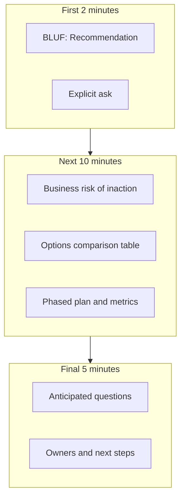
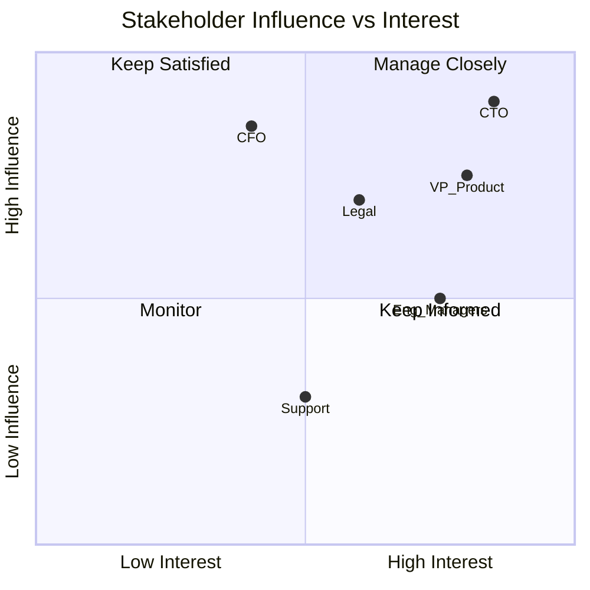
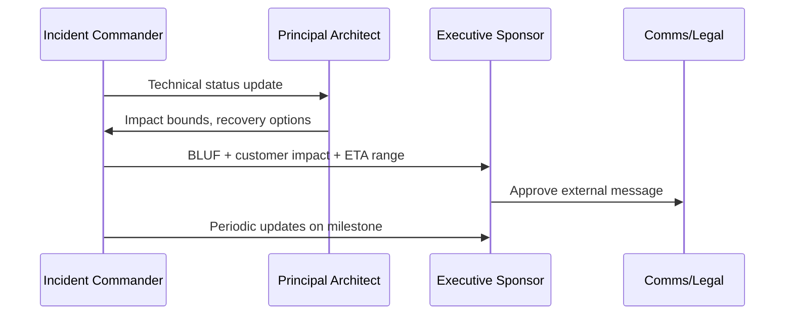

# Executive Communication

## 1. Executive Summary

**Executive communication** is the discipline by which principal architects translate complex technical reality into **decisions executives can fund, defend, and measure**. Executives operate under constraints of **limited time**, **portfolio tradeoffs**, and **accountability to boards and markets**—they need clarity on risk, cost, timeline, and business outcome—not implementation minutiae unless it changes the decision.

Effective executive communication follows a **pyramid structure**: lead with the recommendation and business impact; support with evidence, options, and risks; hold deep technical detail in appendices. It connects architecture to **revenue, cost, risk, speed, and compliance** using language executives already use in planning cycles. It anticipates questions about **worst-case scenarios**, **competitive positioning**, and **organizational capacity** to deliver.

This chapter covers audience analysis, narrative frameworks, visual design for leadership, handling dissent, crisis communication during incidents, and interview scenarios where candidates must explain technical strategy to a simulated CTO or VP Engineering.

## 2. Why This Topic Matters

Principal and distinguished engineer promotions hinge on **organizational impact**, not only technical depth. Interview loops include:

- **System design with executive stakeholder** role-play.
- **Behavioral questions** on influencing without authority.
- **Strategy sessions** on multi-year platform bets.

In production, architects who cannot communicate upward lose funding battles, suffer mandate without resources, or see teams execute literal interpretations of vague direction. Conversely, architects who oversimplify or hide tradeoffs destroy trust when incidents expose gaps.

Executive communication is a **safety property** for organizations: leaders make better bets when they understand real constraints.

## 3. Problems Being Solved

| Problem | Communication response |
|---------|------------------------|
| **Technical opacity** | Business-framed narrative with metrics |
| **Decision paralysis** | Clear recommendation with bounded options |
| **Misaligned incentives** | Tie architecture to OKRs and risk registers |
| **Surprise incidents** | Pre-communicated residual risk and mitigations |
| **Scope creep** | Explicit non-goals and phase gates |
| **Lost funding** | ROI, TCO, opportunity cost articulation |
| **Organizational resistance** | Stakeholder map and coalition building |
| **Overconfidence** | Confidence levels and assumption flags |

Executive communication fails when architects treat it as **translation** ("business people don't get tech") instead of **joint problem solving**. The goal is a shared model of risk and opportunity sufficient for a decision—not dumbing down engineering reality.

## 4. Assumptions and System Model

| Assumption | Implication |
|------------|-------------|
| **Executives have 15–30 min attention** | Front-load conclusion |
| **Different executives care about different metrics** | Customize emphasis |
| **Trust is cumulative** | Accuracy over spin; admit unknowns |
| **Politics is real** | Map allies and blockers |
| **Numbers need context** | Ranges, assumptions, sensitivity |
| **Visuals beat prose** | One idea per slide |
| **Follow-up is where work happens** | Clear asks and owners |

**Audience tiers:** C-suite (outcomes, risk), VP (portfolio, capacity), director (delivery, dependencies), board (governance, material risk).

## 5. Essential Terminology

| Term | Definition |
|------|------------|
| **BLUF** | Bottom Line Up Front—lead with conclusion |
| **Pyramid Principle** | Structured communication from answer to supporting points |
| **OKR** | Objectives and Key Results—alignment framework |
| **TCO** | Total Cost of Ownership—multi-year cost view |
| **ROI** | Return on Investment |
| **Risk register** | Catalog of risks with likelihood, impact, mitigation |
| **Material risk** | Significant enough for board disclosure (context-dependent) |
| **Decision memo** | Written executive briefing with recommendation |
| **Pre-read** | Document sent before meeting for async review |
| **Stakeholder map** | Influence vs. interest grid for actors |
| **Confidence interval** | Range expressing estimate uncertainty |
| **Phase gate** | Milestone requiring approval to proceed |
| **Single-threaded owner** | One accountable leader per initiative |

## 6. Core Mechanism

### 6.1 The ARCH narrative framework

For executive briefings, structure content as:

1. **A**sk — What decision or support do you need today?
2. **R**isk — What happens if we do nothing?
3. **C**hoices — Two to three bounded options (not seven).
4. **H**ow — Phased plan, resources, timeline, metrics.



*Figure 1: Executive briefing flow—conclusion first, evidence second, ask last.*

### 6.2 Stakeholder communication map



*Figure 2: Stakeholder map—tailor depth and frequency by quadrant (illustrative positions).*

### 6.3 Options comparison table (executive format)

| Option | 3-year TCO | Time to value | Risk | Strategic fit |
|--------|------------|---------------|------|---------------|
| **A — Build platform** | High | 18 months | Execution | Full control |
| **B — Buy vendor** | Medium | 6 months | Vendor lock-in | Faster launch |
| **C — Hybrid** | Medium-High | 9 months | Integration | Balanced |

Recommendation row: **Option C** with phase 1 vendor, phase 2 internal abstractions—funds gated on adoption metrics.

### 6.4 Incident executive briefing

During SEV-1, executives need:

- **Customer impact** (who, how many, revenue at risk)
- **Current status** (mitigating, root cause known/unknown)
- **ETA** (confidence level)
- **Communication plan** (customers, regulators)
- **What we need** (policy exception, extra headcount, comms approval)

Avoid blame; assign **single incident commander** voice.

**Residual risk disclosure** belongs in non-incident executive forums too: when recommending a architecture, state what you are **not** mitigating yet (e.g., single-region metadata, manual failover runbook). Executives can accept risk only when it is named.



*Figure 3: Executive incident communication chain—single voice externally, technical depth internally.*

## 7. Step-by-Step Walkthrough

### 7.1 Platform modernization pitch (20 min slot)

**Minute 0–2 (BLUF):** "Recommend approving $2.4M over 18 months to migrate payments off legacy mainframe. Without this, we face regulatory deadline breach in Q3 2027 and $XM/year maintenance. Ask: approve phase 1 ($800K, 6 months) with go/no-go gate on throughput PoC."

**Minute 2–7 (Risk):** Regulatory citation, incident history, talent risk (COBOL retirees), competitive speed to launch new payment methods.

**Minute 7–14 (Choices):** Table comparing full rewrite, strangler migration (recommended), vendor wrap. Highlight strangler reduces big-bang risk; accepts temporary dual-run cost.

**Minute 14–18 (How):** Quarter-by-quarter milestones, team size, dependencies on data platform, KPIs: % traffic migrated, error rate parity, cost trajectory.

**Minute 18–20 (Ask):** Sign-off phase 1; assign executive sponsor; exempt team from interrupt work.

**Appendix:** Architecture diagram, ADR links, detailed BOE.

Pre-meeting tactics that materially improve outcomes:

| Tactic | Purpose |
|--------|---------|
| **48-hour pre-read** | Executives arrive with questions, not cold exposure |
| **1:1 ally review** | Surface objections before group dynamics |
| **Red team slide** | "Why this might fail" builds credibility |
| **Explicit non-goals** | Prevent scope expansion in the room |
| **Decision deadline** | "We need approval by DATE to hit regulatory window" |

### 7.2 Handling hostile CFO question

**CFO:** "Why can't we do this for half the cost?"

**Weak:** Dive into Kubernetes details.

**Strong:** "Half cost is possible if we defer multi-region and accept 99.5% vs. 99.95% availability—that's roughly X hours more downtime per year, which last year correlated with $Y support cost and churn risk. We can present a tiered budget slide with explicit tradeoffs. Which risk profile matches your planning assumptions?"

### 7.3 Tailoring message by executive role

| Role | Lead with | Avoid |
|------|-----------|-------|
| **CEO** | Market risk, customer trust, strategic timing | Protocol names, shard counts |
| **CFO** | TCO, cash timing, unit economics, sensitivity | Unbounded technical debt metaphors |
| **CRO / Sales** | Revenue enablement, deal blockers | Internal team politics |
| **CISO** | Threat model, compliance gaps, residual risk | Hand-waving "we'll encrypt it" |
| **VP Engineering** | Capacity, dependencies, quality tradeoffs | Hiding delivery risk |
| **General Counsel** | Regulatory exposure, data residency | Speculative legal conclusions |

Same initiative, **six different emphasis tracks**—usually six different opening slides, not six different truths.

### 7.4 Written decision memo skeleton

```
Title: Decision — [Initiative] (Date)
Recommendation: [One sentence]
Ask: [Budget / headcount / policy / date]
Business context: [2–3 sentences]
Risk of inaction: [Quantified where possible]
Options: [Table: 2–3 rows]
Plan: [Phases, metrics, gates]
Dependencies: [Teams, vendors]
Open questions: [With owners]
Appendix: [ADRs, diagrams, BOE]
```

Memos outperform decks for **async executive committees** and create durable record alongside ADRs.

## 8. Invariants and Guarantees

Executive communication should uphold:

| Property | Meaning |
|----------|---------|
| **Honesty** | Distinguish facts, estimates, opinions |
| **Clarity** | One recommendation unless explicitly presenting options only |
| **Brevity** | Respect time; append depth |
| **Actionability** | Specific ask with owner and date |
| **Consistency** | Align with ADRs and prior commitments |

**Not guaranteed:** Automatic approval—communication enables informed decision-making.

## 9. Failure Scenarios

| Failure | Consequence | Prevention |
|---------|-------------|------------|
| **Jargon overload** | Lost attention, no decision | Business metrics first |
| **Buried lead** | Executives decide on partial info | BLUF discipline |
| **False precision** | "$1,847,293" without range | Ranges, sensitivity |
| **No ask** | Meeting ends with "interesting" | Explicit decision request |
| **Surprise bad news** | Trust collapse | Early risk escalation |
| **Chart junk** | Credibility loss | One message per visual |
| **Over-delegation upward** | "You decide technical" | Bounded options with recommendation |
| **Ignoring politics** | Blocked in hallway | Stakeholder pre-briefs |
| **Reading slides** | Disengagement | Conversation, not recitation |

## 10. Performance Characteristics

| Format | Typical length | Best for |
|--------|----------------|----------|
| **Elevator pitch** | 30–60 sec | Serendipity, alignment check |
| **Staff meeting update** | 5 min | Progress, blockers |
| **Decision memo** | 2–3 pages | Async exec review |
| **QBR presentation** | 20–30 min | Portfolio review |
| **Board risk item** | 5 min + appendix | Material risk disclosure |

**Latency to decision** decreases with pre-reads sent 48+ hours ahead and clear asks.

## 11. Scalability Limits

| Limit | Mitigation |
|-------|------------|
| **Architect as bottleneck** | Train leads to present with review |
| **Death by deck** | Memo culture for decisions |
| **Inconsistent messaging** | Single source ADR + exec summary |
| **Global exec time zones** | Async decision memos, recorded walkthrough |

## 12. Operational Considerations

- **Calendar discipline:** Pre-brief allies before formal meeting.
- **Decision log:** Link communications to ADRs and OKRs.
- **Feedback loops:** Ask exec assistant what worked.
- **Template library:** Decision memo, QBR, incident exec summary.
- **Rehearsal:** Dry-run with peer playing skeptical CFO.

## 13. Security Considerations

- **Classification:** Mark sensitive decks; don't email unreleased strategy unencrypted.
- **Incident comms:** Coordinate with legal before external statements.
- **Competitive intelligence:** Avoid disclosing roadmap details in wide forums.

## 14. Cost Considerations

Frame architecture costs in **business units executives track**:

- **Run vs. grow** — OpEx maintenance vs. CapEx transformation
- **Unit economics** — Cost per transaction, per customer, per GB
- **Opportunity cost** — What initiatives delay if we fund this
- **Risk cost** — Expected value of downtime, fines, churn

Show **sensitivity:** "If adoption is 50% not 80%, payback extends from 2 to 3.5 years."

## 15. Production Implementations

| Practice | Where seen |
|----------|------------|
| **Amazon 6-pager narrative** | Memo-driven meetings |
| **Google engineering review culture** | Design docs with exec summaries |
| **Netflix context memos** | High freedom, clear context |
| **McKinsey pyramid** | Consulting structure adopted in tech |
| **SAFe lean budgets** | Portfolio funding conversations |

Adapt format to company culture—**implementation choice**, not universal law.

### 15.1 Executive communication in different company stages

| Stage | Exec focus | Architect emphasis |
|-------|------------|-------------------|
| **Startup (< 50 eng)** | Survival, speed | Short verbal + lightweight ADR |
| **Growth (50–500)** | Unit economics, reliability | Decision memos, SLO language |
| **Enterprise (500+)** | Risk, compliance, portfolio | Formal ARB, tiered governance |
| **Public company** | Material disclosure, predictability | Documented residual risk, gates |

The **mechanism** stays constant (BLUF, options, ask); the **ceremony** scales with blast radius and regulatory exposure. Regardless of stage, rehearse the ask aloud before the meeting—if you cannot state it in one sentence, the briefing is not ready for executives.

## 16. Alternatives and Tradeoffs

| Style | Strength | Weakness |
|-------|----------|----------|
| **Slide deck** | Visual, familiar | Tempts bullet dumps |
| **Written memo** | Deep async thinking | Low attendance if long |
| **Whiteboard session** | Interactive | Poor for distributed execs |
| **Dashboard only** | Metrics-rich | Lacks narrative and ask |
| **Demo-driven** | Emotional impact | Can hide scalability gaps |

Principal architects often use **memo + short deck** hybrid.

## 17. Common Misconceptions

| Misconception | Reality |
|---------------|---------|
| "Executives want less truth" | They want clarity and no surprises |
| "Dumb it down" | Simplify, don't distort |
| "They only care about cost" | Risk and speed matter equally |
| "One deck fits all" | Customize per stakeholder |
| "Charisma replaces data" | Short-term win, long-term trust loss |
| "Technical depth impresses" | Depth on demand in appendix |

## 18. Principal Architect Perspective

- **Speak in outcomes, decide in engineering.**
- **Bring recommendations, not open-ended tours.**
- **Quantify risk of inaction**—status quo has cost.
- **Pre-wire decisions** with 1:1s before the room.
- **Document commitments** in ADRs and meeting notes.
- **Develop bench**—your impact scales when others present.

### 18.1 Communication anti-patterns at principal level

| Anti-pattern | Why it fails | Alternative |
|--------------|--------------|-------------|
| **Architecture tourism** | Execs lost in components | Outcome-first narrative |
| **Consensus theater** | No decision | Clear recommendation |
| **Metric without baseline** | Unfalsifiable claims | Before/after or benchmark |
| **Permanent war room voice** | Alarm fatigue | Tiered comms by severity |
| **Surprise in QBR** | Trust erosion | Continuous risk register updates |

Principal architects are judged on **decisions shipped and incidents avoided**, not slides admired.

## 19. Architecture Review Exercise

**Scenario:** You have 10 minutes with CEO unexpectedly asking about multi-cloud strategy after competitor announcement.

**Prepare:**

1. 30-second BLUF on your company's position.
2. Three risks of reactive multi-cloud (cost, talent, security surface).
3. One slide: current state, 12-month recommendation, what you need.
4. Anticipate CEO question on "why not match competitor today?"

## 20. Whiteboard Explanation

"Executive communication starts with what decision you need and your recommendation—bottom line up front. Then explain the business risk of doing nothing, present two or three options with tradeoffs in terms executives care about—cost, time, risk, revenue—not microservice names. Describe a phased plan with metrics and explicit gates. Hold technical depth for appendix and questions. During incidents, give customer impact, status, ETA with confidence, and what you need from leadership—one voice, no jargon. Trust comes from accuracy, appropriate uncertainty, and never surprising executives with material bad news in public forums."

## 21. Interview Questions

1. **Explain microservices migration to non-technical CEO.** — Business outcomes, risk, phases.
2. **How prioritize technical debt vs. features?** — Framework tied to risk and revenue.
3. **Executive asks for impossible deadline.** — Tradeoff menu, scope negotiation.
4. **Communicate post-incident to board.** — Impact, remediation, prevention investment.
5. **Convince CFO to fund observability.** — Incident cost, MTTR reduction, SLO breaches.
6. **Disagree with VP publicly?** — Disagree and commit vs. escalate—judgment.
7. **Structure 20-min architecture review.** — BLUF, options, ask.
8. **When say "I don't know"?** — Confidence, follow-up plan—builds trust.
9. **Stakeholder mapping example.** — Influence/interest, pre-briefs.
10. **Reduce 50-slide deck.** — One message per slide; appendix depth.
11. **OKR alignment for platform team.** — Enable product OKRs with platform KRIs.
12. **Influence without authority.** — Coalitions, pilots, data.

## 22. Interview Follow-Ups

1. **CEO wants microservices because competitor did.** — Diagnose actual pain; phased approach.
2. **Legal blocks your design.** — Engage early; alternative architecture; document residual risk.
3. **Missed deadline—exec angry.** — Own communication gap; revised plan with gates.
4. **Two executives want conflicting outcomes.** — Escalate with written tradeoff memo.
5. **How measure your communication effectiveness?** — Decision velocity, repeat questions, funding outcomes.

## 23. Strong Answer Example

**Question:** "How would you present a $3M observability investment to a skeptical CFO?"

**Strong outline:** "BLUF: recommend $3M over two years to reduce mean time to detect from 45 to under 10 minutes, targeting $XM annual incident cost and Y% churn correlated with outages—assumptions in appendix. Risk of inaction: next major incident during peak season without tracing costs an estimated $Z. Options: (A) status quo patches, (B) full unified stack, (C) phased—tracing first, then SLO platform. Recommend C—$1M year one proves MTTR improvement on checkout path before full rollout. Metrics: incident count, MTTD, SLO attainment, engineer hours on war rooms. Ask: approve year-one budget with Q4 review gate tied to MTTD < 15 min. I'll send a two-page memo tonight; happy to walk finance through sensitivity if adoption is slower."

## 24. Weak Answer Example

**Weak:** "Observability is important. We need Datadog, Prometheus, Grafana, and a tracing mesh. Everyone knows incidents are bad."

**Red flags:** No ask, no numbers, tool list, no tradeoffs, no business framing.

## 25. Hands-On Exercise

1. Take a technical initiative you know; write a 2-page decision memo (BLUF, risk, options, recommendation, ask).
2. Create a 5-slide executive deck from the memo—one idea per slide.
3. Peer plays skeptical CFO for 10 minutes.
4. Revise based on questions you couldn't answer.
5. Record 2-minute elevator version; aim for clarity without slides.

## 26. Knowledge Check

1. What does BLUF stand for?
2. Name four elements of the ARCH framework.
3. What belongs in the first two minutes of an exec briefing?
4. How present options without seeming indecisive?
5. What three things do executives need in SEV-1 updates?
6. TCO vs. OpEx—when use each?
7. What is a pre-read and when send it?
8. Why ranges beat false precision?
9. Stakeholder map quadrants—purpose?
10. Difference between influence and interest?
11. When use memo vs. deck?
12. How link communication to ADRs?

## 27. Flashcards

| Front | Back |
|-------|------|
| BLUF | Bottom Line Up Front—lead with conclusion |
| Pyramid Principle | Answer first, then supporting arguments |
| ARCH framework | Ask, Risk, Choices, How |
| TCO | Total cost of ownership over planning horizon |
| Pre-read | Async document before executive meeting |
| Phase gate | Milestone approval before next funding tranche |
| Stakeholder map | Plot influence vs. interest for tailoring |
| Decision memo | Written exec brief with recommendation |
| SEV-1 exec update | Impact, status, ETA, needs—single voice |
| Opportunity cost | What you forego by choosing this path |
| Confidence range | Express estimate uncertainty honestly |
| Disagree and commit | Escalate privately; support decision publicly |

## 28. Cheat Sheet

```
EXEC BRIEFING (20 min)
  0-2 min   BLUF + explicit ask
  2-7 min   Risk of inaction (business)
  7-14 min  2-3 options table (TCO, time, risk)
  14-18 min Phased plan + metrics + gates
  18-20 min Q&A; confirm next steps

OPTIONS TABLE COLUMNS
  cost | time to value | risk | strategic fit | recommendation

INCIDENT EXEC COMMS
  customer impact | status | ETA (range) | needs | comms plan

AVOID
  jargon first | buried lead | no ask | false precision | surprise
```

## 29. Related Concepts

- [Architecture Decision Records](/docs/architecture-leadership/architecture-decision-records) — documenting decisions referenced in briefings
- [System Design Methodology](/docs/system-design/system-design-methodology) — technical depth behind narratives
- [Reliability and Resilience](/docs/reliability-and-resilience/overview) — SLO language for executives
- [Cost and FinOps](/docs/cost-and-finops/overview) — financial framing
- [Behavioral and Leadership](/docs/behavioral-and-leadership/overview) — influence and conflict

## 30. References

### Communication and management

- Minto, B. (2009). *The Pyramid Principle.* [Structured executive communication]
- Amazon leadership principles — narrative memo culture (company practice)

### Technology leadership

- Fournier, C. (2017). *The Manager's Path.* O'Reilly. [Staff+ communication chapters]
- Larson, W. (2021). *Staff Engineer.* [Influence and alignment]

### Risk and governance

- NIST frameworks for risk communication (adapt to organizational context)

### Distinction

- **Formal guarantees** — SLO/SLA definitions used in executive metrics.
- **Implementation choices** — Memo vs. deck culture per company.
- **Operational experience** — Executive preferences vary; solicit feedback and adapt.
