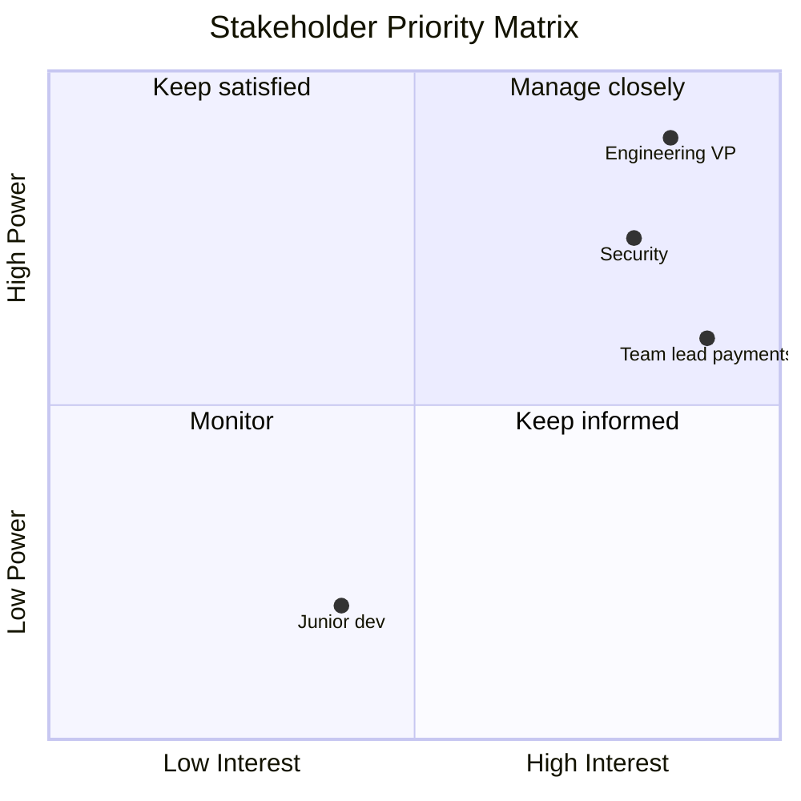
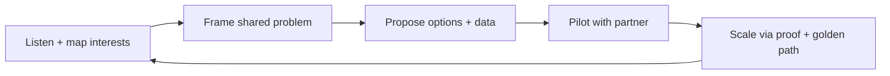
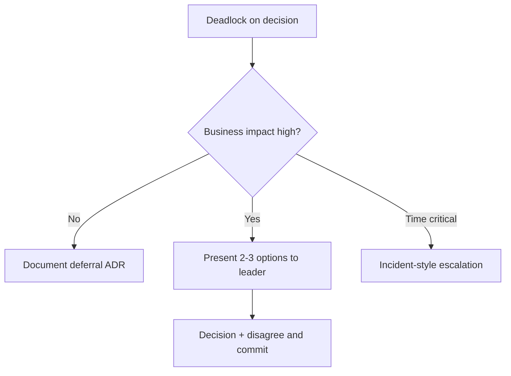

# Influencing Without Authority

## 1. Executive Summary

**Influencing without authority** is the principal architect's core leadership skill: driving technical alignment, quality, and strategic outcomes across teams where you lack direct management control. Success depends on **credibility**, **relationship capital**, **clear articulation of shared interests**, **evidence-based persuasion**, and **negotiation**—not hierarchy, veto power, or winning arguments.

Principal architects operate as **trusted advisors** and **connectors**: they frame problems in terms stakeholders care about (revenue risk, compliance deadline, on-call pain), bring data from incidents and metrics, facilitate decisions rather than dictating them, and accept that **disagree and commit** is sometimes the right end state.

This chapter covers influence models, stakeholder mapping, communication tactics for engineering managers and executives, handling resistance, coalition building for platform adoption, and interview scenarios where candidates must demonstrate organizational navigation—not just system design.

## 2. Why This Topic Matters

The best architecture diagram fails if teams ignore it:

- **Platform teams** with zero adoptive customers waste millions.
- **Security mandates** without empathy breed shadow workarounds.
- **Cross-team migrations** stall without executive air cover and team buy-in.
- **Principal promotion** evaluates leadership scope beyond code.

Interview loops include "tell me about a time you changed someone's mind" and "how did you drive adoption of X without owning the teams?" Weak answers cite title escalation only; strong answers show stakeholder analysis, pilots, metrics, and persistence.

## 3. Problems Being Solved

| Problem | Influence approach |
|---------|-------------------|
| **Team rejects standard** | Understand incentives; co-design |
| **Executive skepticism** | Business-framed evidence |
| **Priority conflict** | Tradeoff facilitation; escalation path |
| **Not invented here** | Pilot with willing partner team |
| **Architecture ignored** | Make golden path easier than bespoke |
| **Slow decision** | Time-box options; default outcome |
| **Post-incident blame** | Blameless learning orientation |
| **Remote/async friction** | Written narratives; pre-reads |

## 4. Assumptions and System Model

| Assumption | Implication |
|------------|-------------|
| **Stakeholders have legitimate goals** | Seek understanding before persuasion |
| **Authority is multidimensional** | Map formal vs informal power |
| **Trust compounds slowly** | Invest before crises |
| **Not every battle is worth winning** | Pick strategic conflicts |
| **Engineers respect craft and data** | Demo + metrics over slides |
| **Executives want options not lectures** | Recommendation + tradeoffs |

**Influence vs manipulation:** Influence aligns actions with organizational good and transparent reasoning; manipulation hides tradeoffs or uses political games without substance.

## 5. Essential Terminology

| Term | Definition |
|------|------------|
| **Stakeholder** | Anyone affected by or able to affect decision |
| **RACI** | Responsible, Accountable, Consulted, Informed |
| **Organizational capital** | Accumulated trust and goodwill |
| **Coalition** | Alliance of teams supporting initiative |
| **Golden path** | Easy default vs forced compliance |
| **Disagree and commit** | Dissent recorded; unified execution |
| **Pre-read** | Document reviewed before meeting |
| **Six-page narrative** | Amazon-style memo for depth |
| **Pilot partner** | Early adopter team for proof |
| **Escalation** | Raise decision when deadlock threatens outcomes |
| **WIIFM** | What's In It For Me—stakeholder lens |
| **Social proof** | Adoption evidence from peer teams |

## 6. Core Mechanism

### 6.1 Stakeholder influence map



*Figure 1: Prioritize high-power high-interest stakeholders for active engagement.*

### 6.2 Influence process loop



*Figure 2: Influence loop—listening precedes framing; pilots beat mandates.*

### 6.3 Escalation decision tree



*Figure 3: Escalate with options prepared—not open-ended complaints.*

### 6.4 Deep dives

**Cialdini principles (ethical application in engineering):**

| Principle | Engineering use |
|-----------|-----------------|
| **Reciprocity** | Help team with their priority first |
| **Social proof** | Reference peer team adoption |
| **Authority** | Cite incident data, benchmarks |
| **Commitment** | Small pilot agreement → expand |
| **Liking** | Build relationships in normal times |
| **Scarcity** | Migration window before forced change |

**Executive communication structure:**

1. **Situation** (2 sentences)
2. **Complication** (risk or opportunity)
3. **Resolution** (recommendation)
4. **Ask** (decision, resources, air cover)
5. **Appendix** (technical depth for questions)

See [Executive Communication](/docs/architecture-leadership/executive-communication).

**Resistance patterns:**

| Resistance | Response |
|------------|----------|
| "Not a priority" | Link to OKR/incident cost |
| "NIH syndrome" | Involve lead in design |
| "Too risky" | Phased rollout + rollback |
| "We tried before" | What changed ADR |
| "Platform too slow" | Fix platform or narrow scope |

## 7. Step-by-Step Walkthrough

### 7.1 Driving API platform adoption

1. Map stakeholders: platform team, 5 product teams, API consumers.
2. Interview pain: inconsistent auth, partner onboarding 6 weeks.
3. Frame: "Shared API edge cuts partner time 50%—pilot with billing team."
4. Build golden path template; billing ships first integration in 2 weeks.
5. Present metrics at eng all-hands; 3 more teams volunteer.
6. [Architecture Governance](/docs/architecture-leadership/architecture-governance) tier-2 requires platform for new public APIs.

### 7.2 Convincing skeptical EM on reliability investment

1. EM focused on feature velocity; team burned by last outage.
2. Principal brings SEV1 timeline: 8 hours downtime = $400K + churn risk.
3. Propose error budget policy linking reliability work to release gates.
4. EM co-authors ADR; gets credit in quarterly review.
5. Disagree-and-commit on deferring one feature for circuit breaker work.

### 7.3 Failed influence—learning

1. Mandated service mesh without pilot; teams bypass with direct calls.
2. Retro: no WIIFM, no golden path DX, no executive sponsor.
3. Reset: voluntary opt-in with observability wins demo.
4. Document lessons in influence playbook.

### 7.4 Cross-org acquisition alignment

1. Acquired company uses different identity stack.
2. Build federation bridge proposal with 18-month convergence roadmap.
3. Workshop with both architects; shared [ADR](/docs/architecture-leadership/architecture-decision-records).
4. Executive sponsor sets integration OKR; neither side "loses."

### 7.5 Cross-timezone influence

1. EU team resists US-mandated platform timeline.
2. Schedule overlap workshops; EU champion co-presents pilot results.
3. Adjust rollout: EU gets extended pilot week with local support.
4. Document cultural adaptation in ADR—not "they were difficult."
5. **Principal:** global influence requires local advocates and timezone respect.

## 7A. Influence Tactics by Stakeholder

| Stakeholder | Primary lever | Avoid |
|-------------|---------------|-------|
| Engineering manager | On-call pain reduction | Public shame |
| Product director | Time-to-market data | Jargon-heavy architecture |
| CFO | Incident cost, FinOps | Technology for its own sake |
| Security | Compliance mapping | Bypassing their review |
| Junior engineers | Golden path DX | Mandates without docs |

## 8. Invariants and Guarantees

| Property | Mechanism |
|----------|-----------|
| **Decisions documented** | ADR even when influence fails |
| **Escalation with options** | Not surprise escalations |
| **Respect for team autonomy** | Influence before mandate |
| **Blameless learning** | Postmortem not witch hunt |
| **Trust preservation** | No public undermining |

## 9. Failure Scenarios

| Scenario | Mitigation |
|----------|------------|
| Architecture astronaut | Stay hands-on; ship pilots |
| Eternal consensus | Time-box; default decision |
| Credit stealing | Celebrate team wins publicly |
| Passive aggression | Direct 1:1; clarify expectations |
| Influence via executive only | Teams comply resentfully—fix root |
| Over-escalation | Exhaust local alignment first |
| Ignoring political reality | Map stakeholders early |
| Winning argument losing relationship | Separate ego from outcome |

## 10. Performance Characteristics

Influence outcomes (qualitative metrics):

- **Platform adoption rate** quarter over quarter.
- **Repeat architecture debates** (should decrease with ADRs).
- **Stakeholder NPS** on architecture partnership.
- **Initiative lead time** from proposal to pilot.
- **Incident recurrence** after recommended fix adopted.

## 11. Scalability Limits

| Limit | Mitigation |
|-------|------------|
| Principal bandwidth | Train staff architects as delegates |
| Remote relationship building | Intentional travel/on-site weeks |
| Large org stakeholder count | Tier engagement by matrix |
| Cultural differences globally | Local champions per region |
| Influence without delivery credibility | Stay technically current |

## 12. Operational Considerations

- Maintain stakeholder map per major initiative; refresh monthly.
- 1:1s with key EMs—not only during crises.
- Written narratives before contentious meetings.
- Celebrate adopter teams publicly.
- Influence retrospective on failed initiatives quarterly.

## 13. Security Considerations

- Security influence requires empathy—help teams meet deadlines with paved road.
- Never shame teams in public forums post-incident.
- Align with security on **shared** messaging for mandates.
- Zero-trust adoption is influence challenge—see [Zero Trust Architecture](/docs/security/zero-trust-architecture).

## 14. Cost Considerations

Influence failures cost real money: duplicate platforms, incidents, delayed enterprise deals. ROI of principal time on relationship building vs repeated failed mandates. Pilot investments are marketing for architecture—budget them.

## 15. Production Implementations

| Pattern | Where seen |
|---------|------------|
| **Platform as product** | Internal developer platforms |
| **Champions network** | Large enterprise transformations |
| **Working groups** | Cross-team standards development |
| **Tech radar socialization** | ThoughtWorks-style adoption |
| **SRE error budget negotiation** | Google-inspired reliability culture |

## 16. Alternatives and Tradeoffs

| Decision | Tradeoff |
|----------|----------|
| Mandate vs persuade | Speed vs sustainable adoption |
| Top-down vs bottom-up | Executive air cover vs grassroots |
| Public memo vs private 1:1 | Transparency vs relationship |
| Pilot one team vs big bang | Proof vs momentum delay |
| Escalate vs accept deferral | Outcome vs relationship |
| Deep expert vs generalist bridge | Credibility domain vs breadth |

## 17. Common Misconceptions

| Misconception | Reality |
|---------------|---------|
| "Influence = politics bad" | Alignment is professional skill |
| "Correct architecture wins" | Adoption is part of architecture |
| "Escalation is failure" | Sometimes required for org good |
| "Executives want detail" | They want decision support |
| "Once convinced, done" | Reinforce with golden path |
| "Authority substitutes influence" | Mandates without buy-in decay |

## 18. Principal Architect Perspective

- **Make the right thing the easy thing.**
- **Listen first**—understand WIIFM before pitching.
- **Bring data** from incidents, not opinions alone.
- **Share credit**—teams adopt what they co-own.
- **Know when to escalate** with options, not complaints.
- **Document dissent** then commit publicly.

Influence compounds over years but can be destroyed in one public Slack thread during an incident. Principal architects model the blameless curiosity they expect in postmortems when engaging skeptics—ask what would make the proposal work for their team before defending the original design.

## 19. Architecture Review Exercise

**Scenario:** Principal publicly criticizes team's design in Slack thread; team disengages from governance.

**Review:** Relationship damage; move to private coaching; apologize; co-create fix. Influence requires trust.

## 20. Whiteboard Explanation

"When I need teams to adopt our API platform, I don't start with standards—I interview three EMs on partner onboarding pain, quantify delay cost, find a willing pilot team, make the golden path faster than custom nginx, publish their success metrics, then align governance to require it only for new external APIs. I map executives who care about enterprise revenue and give them a two-page decision memo with one recommendation. If we deadlock on risk, I escalate with two options and a default—not an open-ended debate."

## 21. Interview Questions

1. **Convince team to adopt your platform.** — *Signals:* pilot, WIIFM, metrics. *Red flags:* mandate only.
2. **Stakeholder disagrees on database choice.** — *Signals:* ADR, criteria, escalate options.
3. **Executive wants risky shortcut.** — *Signals:* risk frame, alternatives, accept if decided.
4. **Influence without escalation example?** — *Signals:* coalition, proof. *Follow-up:* timeline.
5. **Handle public criticism of your proposal?** — *Signals:* curiosity, data, adapt.
6. **Remote influence tactics?** — *Signals:* written narrative, office hours.
7. **When escalate to VP?** — *Signals:* impact, deadlock, prepared options.
8. **Failed influence story?** — *Signals:* learning, humility. *Red flags:* blame others only.
9. **Balance speed vs quality pushback?** — *Signals:* error budget, phased.
10. **NIH syndrome resolution?** — *Signals:* involve skeptics in design.
11. **Cross-team incident blame dynamics?** — *Signals:* blameless, systems fix.
12. **Build organizational capital?** — *Signals:* help others, reliability, follow-through.

## 22. Interview Follow-Ups

1. **Team goes around platform anyway.** — DX investigation; fix or enforce with governance.
2. **Executive overrules your recommendation.** — Disagree and commit; document ADR dissent.
3. **Influence across time zones.** — Async pre-reads; regional champions.

## 23. Strong Answer Example

**Q:** Tell me about driving migration to shared identity platform.

**Outline:** Started with EM interviews—each team maintained own auth, 3 SEV2 incidents from session bugs. Quantified on-call toil. Partnered with willing growth team for 4-week pilot using golden path SDK. Published 40% reduction in auth code and zero session incidents. Presented at eng summit. Security and governance aligned new services to platform. Offered office hours. Didn't mandate legacy migration day one—18-month window with executive OKR. Built trust by fixing 2 SDK bugs within 48h of reports.

## 24. Weak Answer Example

**Weak:** "I told them leadership required it and they had to comply."

**Red flags:** No empathy, no pilot, no metrics, relationship damage, brittle adoption.

## 25. Hands-On Exercise

1. Create stakeholder map for fictional platform rollout.
2. Write 1-page executive memo with SCR (situation-complication-resolution).
3. Draft pilot plan with success metrics and 6-week timeline.
4. Role-play conversation with skeptical EM—script objections and responses.
5. **Extension:** ADR documenting disagree-and-commit scenario.
6. **Extension:** Retro template for failed influence initiative.

## 26. Knowledge Check

1. WIIFM application?
2. Golden path vs mandate?
3. When use social proof?
4. Disagree and commit steps?
5. Stakeholder matrix quadrants?
6. Escalation prerequisites?
7. Pilot partner selection criteria?
8. Blameless postmortem influence tie?
9. Organizational capital examples?
10. Resistance "not priority" response?
11. Executive memo structure?
12. Influence vs manipulation boundary?

## 26A. Extended Knowledge Check

13. What deposit builds organizational capital fastest?
14. When escalate vs accept deferral?
15. How use pre-read in async-first company?
16. STAR story—what makes Result credible?
17. Coalition building—minimum viable partners?
18. How repair influence after public criticism mistake?

Schedule private 1:1 within 24 hours, acknowledge impact on psychological safety, co-create path forward on the technical issue, and offer to credit the team publicly when fix ships—relationship repair precedes the next governance mandate.

## 27. Flashcards

| Front | Back |
|-------|------|
| WIIFM | Stakeholder self-interest lens |
| Golden path | Easy default adoption path |
| Organizational capital | Trust and goodwill reserve |
| Disagree and commit | Dissent then unified execution |
| Pilot partner | Early proof adopter team |
| Stakeholder map | Power vs interest grid |
| Social proof | Peer adoption evidence |
| Pre-read | Doc before decision meeting |
| Coalition | Multi-team support alliance |
| Escalation | Leader decision with options |
| SCR narrative | Situation complication resolution |
| NIH | Not invented here resistance |

## 28. Cheat Sheet

```
LISTEN: map stakeholders + interests before pitching
FRAME: shared problem in their metrics (OKR, incidents, cost)
PROVE: pilot + data + peer social proof
EASE: golden path < bespoke effort
DOCUMENT: ADR + dissent + commit
ESCALATE: high impact deadlock only—with options
AVOID: public shaming, architecture astronaut, endless consensus
METRICS: adoption, lead time, repeat debates, stakeholder feedback
TIES: governance, executive comms, postmortem learning
```

## 28A. Principal Interview Deep Dive

### Stakeholder conversation scripts

**Skeptical EM:** "Platform will slow us down."

Response framework: Acknowledge velocity concern → share peer team pilot metrics (TTFHW −60%) → offer paired engineer for first integration → propose 4-week trial with exit option → document in ADR if trial fails.

**Executive:** "Why can't we buy vendor X instead of build platform?"

Response: TCO 3-year model → portability risk → team already on vendor Y for identity → hybrid: buy edge, build differentiation layer → decision memo by Friday.

### Coalition building timeline

| Week | Action |
|------|--------|
| 1 | Stakeholder interviews (5 EMs) |
| 2 | Problem statement doc circulated |
| 3 | Pilot partner identified |
| 4–6 | Pilot execution |
| 7 | Success metrics presentation |
| 8 | Governance alignment for mandate |

Skipping weeks 1–2 produces mandates that fail—interviewers notice.

### Organizational capital ledger (mental model)

| Deposit | Withdrawal |
|---------|------------|
| Helped team debug prod issue | Publicly criticized design |
| Delivered promised SDK fix | Missed office hours commitment |
| Credited team in exec review | Took credit for junior's work |
| Shared incident learnings openly | Used incident for political gain |

Principal role is long-game—one withdrawal can erase ten deposits.

### Cross-cultural influence notes

Global organizations: influence tactics vary. High-context cultures may require relationship building before direct technical pitch. Document decisions in writing after verbal alignment—async-first companies need stronger written narratives per [Executive Communication](/docs/architecture-leadership/executive-communication).

### Interview story structure (STAR for influence)

- **Situation:** Multi-team API inconsistency blocking enterprise deal.
- **Task:** Unify on API platform without authority over teams.
- **Action:** Stakeholder map, billing pilot, golden path, metrics, governance alignment.
- **Result:** Partner onboarding 6 weeks → 10 days; 4 teams adopted voluntarily before mandate.

Quantify result where possible—vague "improved things" fails principal bar.

## 29. Related Concepts

- [Executive Communication](/docs/architecture-leadership/executive-communication)
- [Architecture Decision Records](/docs/architecture-leadership/architecture-decision-records)
- [Architecture Governance](/docs/architecture-leadership/architecture-governance)
- [Technical Strategy and Roadmaps](/docs/architecture-leadership/technical-strategy-and-roadmaps)
- [Postmortem Culture](/docs/production-failures/postmortem-culture)
- [Platform Engineering and GitOps](/docs/kubernetes-and-platform-engineering/platform-engineering-and-gitops)
- [API Platform](/docs/system-design/api-platform)

## 19A. Extended Review Scenario

**Scenario B:** You publicly Slack-criticize a team's architecture during incident; they stop attending ARB.

**Review:** Influence damage—repair relationship before process. Private apology; offer pairing on fix; facilitate blameless PM. Public criticism rarely justified even if technically right. Organizational capital withdrawal costs quarters to repay. Model behavior expected of staff architects reporting to you.

## 23A. Additional Strong Answer

**Q:** Executive overrules your recommendation to adopt shared platform; how respond?

**Outline:** Document dissent in ADR with risks accepted. Disagree and commit—support executive decision visibly to org. Define success metrics and review date (e.g., 6 months). Prepare contingency if predicted pain materializes—without saying "I told you so." Maintain relationship for next decision. Principal maturity is long-term credibility over winning one argument.

## 28B. Extended BOE Walkthrough (Interview Script)

**Interviewer:** "How get teams to adopt shared platform without authority?"

**Strong candidate:**

"Mandate last—pilots first.

Week 1–2: interview five EMs on pain—quantify partner onboarding weeks, on-call toil.

Find willing pilot team—billing often has external pressure.

Build golden path faster than custom nginx: SDK, terraform module, office hours.

Six-week pilot with success metrics: TTFHW, incident rate, lines of infra code removed.

Present results at all-hands—credit pilot team publicly.

Then align [Architecture Governance](/docs/architecture-leadership/architecture-governance): new public APIs require platform tier-2—not retroactive big bang.

If EM still resists: understand WIIFM gap; escalate with data only if business impact high.

Organizational capital: I helped their SEV2 last month—deposits matter.

Disagree and commit if executive overrules—document ADR dissent, support decision."

## 30. References

- Cialdini, *Influence* — persuasion principles (apply ethically).
- Fisher & Ury, *Getting to Yes* — principled negotiation.
- HBR articles on stakeholder management — organizational dynamics.
- Team Topologies — team interaction and platform adoption.
- Lara Hogan — resources on difficult conversations in engineering management.

**Distinction:** Influence techniques are behavioral; organizational outcomes depend on company culture—adapt tactics to context.

### 30A. Further reading paths

Pair with [Executive Communication](/docs/architecture-leadership/executive-communication) for decision memos, [Technical Strategy and Roadmaps](/docs/architecture-leadership/technical-strategy-and-roadmaps) for initiative sponsorship, and [Platform Engineering and GitOps](/docs/kubernetes-and-platform-engineering/platform-engineering-and-gitops) for platform adoption case studies. Record yourself delivering a 3-minute platform pitch—watch for jargon density and missing WIIFM.

**Exercise:** Write a disagree-and-commit ADR dissent paragraph for a decision you lost—practice intellectual honesty. **Interview drill:** tell a 2-minute story of influencing without authority with quantified outcome; interviewer will interrupt with "what if EM still said no?"—have escalation and pivot ready.

**Capstone:** Role-play three stakeholder types (skeptical EM, impatient CEO, security lead) in one 20-minute session—switch WIIFM framing without changing the underlying technical recommendation. Debrief which tactic worked per persona.

Before any major platform mandate, ask: **"What would make the skeptics right?"**—if the answer reveals real DX gaps, fix the platform before escalating to executive enforcement; mandates without fixes breed shadow systems.

Track **influence outcomes** in a private log: stakeholder, ask, tactic, result, follow-up date—principal architects improve persuasion deliberately over years rather than repeating the same failed pitch patterns.

When influence fails, write a short **retrospective for yourself**: what signal did you miss, what relationship needs repair, and what evidence would have helped—organizational learning applies to architects too.
