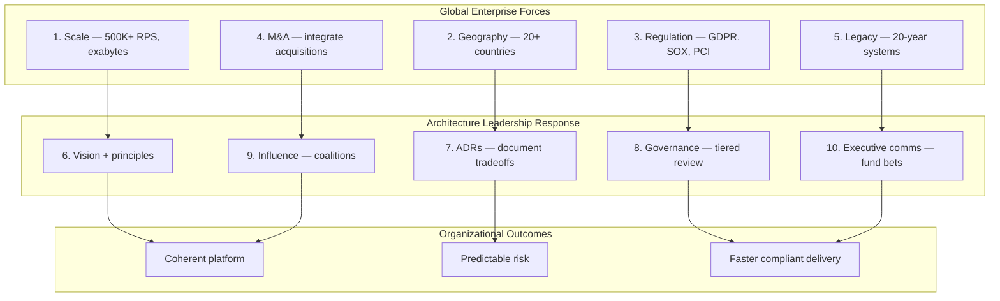
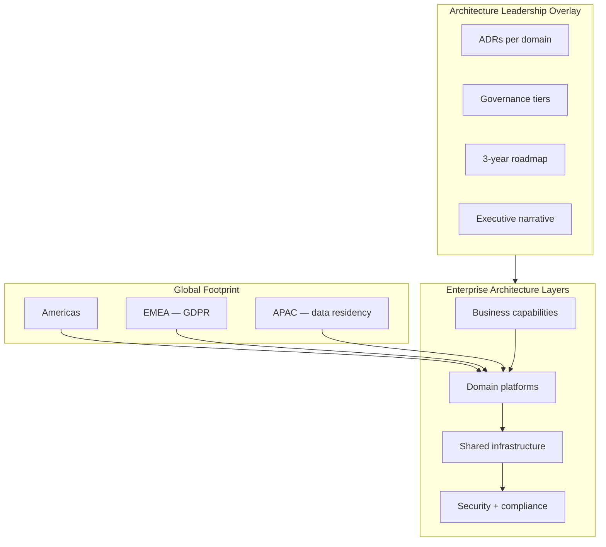
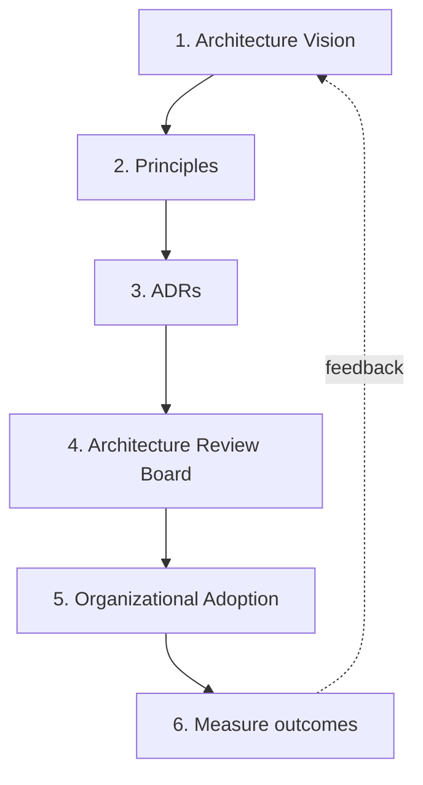

# Architecture Leadership

> **Diagram convention:** Steps are labeled **1, 2, 3…** to show how architecture leadership flows from vision to adoption — especially critical at global enterprise scale.

Architecture leadership is how principal architects **set technical direction**, **govern decisions across hundreds of teams**, and **communicate tradeoffs to executives** — without owning every line of code. In **global enterprises** (10K–100K+ engineers, multi-region operations, regulated industries, serial acquisitions), this discipline is not optional polish; it is the mechanism that prevents architectural entropy, compliance failures, and multi-million-dollar platform rework.

This domain covers **Architecture Decision Records (ADRs)**, **technical strategy and roadmaps**, **governance**, **influencing without authority**, and **executive communication** — the five capabilities that separate a senior engineer who designs services from a principal architect who shapes organizations.

---

## Why Architecture Leadership Matters in Global Enterprises

Global enterprises differ from startups along dimensions that multiply architectural complexity:

| Dimension | Startup (50 engineers) | Global enterprise (5,000+ engineers) |
|-----------|------------------------|--------------------------------------|
| **Teams** | 5–10 squads, one office | 200–2,000 teams across regions |
| **Systems** | One product, one stack | Hundreds of products, decades of legacy |
| **Regulation** | Minimal | GDPR, SOX, HIPAA, PCI, data residency per country |
| **Change velocity** | Ship daily | Quarterly releases + multi-year migrations |
| **Decision rights** | Founder / CTO decides | Federated ARBs, platform councils, CISO veto |
| **Failure cost** | Roll back in minutes | Revenue, regulatory penalty, brand damage at scale |

**Significance:** Without architecture leadership, global enterprises default to **Conway's law at maximum scale** — every business unit optimizes locally, integration becomes impossible, security posture diverges, and platform teams drown in one-off exceptions. Principal architects exist to create **coherence without centralization** — guardrails and golden paths that let teams move fast inside boundaries.

**Step-by-step flow:**

| Step | Enterprise force | Leadership response | Why it matters |
|------|------------------|---------------------|----------------|
| **1** | Massive scale | Vision + principles | Without north star, every team invents its own scaling model |
| **2** | Multi-geography | ADRs with residency context | "Works in us-east-1" ≠ compliant in EU |
| **3** | Regulation | Governance guardrails | Non-negotiable controls (encryption, audit, retention) |
| **4** | M&A integration | Influence across silos | No authority over acquired engineering teams |
| **5** | Legacy debt | Executive-funded roadmaps | Migration requires multi-year investment |
| **6–10** | Combined | Full leadership stack | Vision without governance is slides; governance without influence is ignored |

---

## The Principal Architect Role at Enterprise Scale

At a global enterprise, the principal architect operates at the **intersection of technology, business, and organization** — not as a senior individual contributor with a bigger diagram.

```mermaid
flowchart LR
    subgraph Scope["Principal Architect Scope"]
        P1["1. Multi-team / multi-region"]
        P2["2. 3–5 year horizon"]
        P3["3. $1M–$50M bets"]
        P4["4. No direct reports required"]
    end

    subgraph Activities["Core Activities"]
        A1["Define standards"]
        A2["Run / advise ARB"]
        A3["Write strategy memos"]
        A4["Coach staff engineers"]
        A5["Escalation on material risk"]
    end

    subgraph Stakeholders["Enterprise Stakeholders"]
        S1["CTO / VP Engineering"]
        S2["CISO / Compliance"]
        S3["Product VPs"]
        S4["Platform teams"]
        S5["Acquired company leads"]
    end

    Scope --> Activities
    Activities --> Stakeholders
```

**Step-by-step flow:**

| Step | Responsibility | Global enterprise example |
|------|----------------|---------------------------|
| **1** | Set architectural principles | "All customer PII encrypted at rest; EU data stays in EU regions" |
| **2** | Document decisions (ADRs) | ADR: choose event bus (MSK vs Solace) for 40 business units |
| **3** | Govern without blocking | Tier-1 payments get full ARB review; internal tools get self-certification |
| **4** | Influence without authority | Convince 12 product teams to adopt shared identity platform |
| **5** | Communicate upward | Present $8M multi-region DR program to CFO with RPO/RTO business case |
| **6** | Mentor and multiply | Grow 20 staff engineers who write ADRs and run design reviews |

**What principal architects are NOT (at enterprise scale):**

- The person who reviews every pull request
- A replacement for product management or engineering management
- A "no" function without an alternative golden path
- An ivory-tower standards committee detached from delivery pressure

---

## Global Enterprise Context: Where Leadership Shows Up

| Context | Architectural challenge | Leadership capability required |
|---------|------------------------|-------------------------------|
| **Multi-region deployment** | Data residency, DR, latency | [Technical Strategy](/docs/architecture-leadership/technical-strategy-and-roadmaps) + [Multi-Region Architecture](/docs/cloud-architecture/multi-region-architecture) |
| **Post-acquisition integration** | Duplicate platforms, conflicting stacks | [Influencing Without Authority](/docs/architecture-leadership/influencing-without-authority) + ADRs |
| **Regulatory audit (SOX, PCI)** | Prove controls, trace decisions | [Architecture Governance](/docs/architecture-leadership/architecture-governance) + ADR audit trail |
| **Platform consolidation** | 47 ways to deploy Kafka | Governance golden path + executive funding narrative |
| **AI / LLM rollout** | Data leakage, cost explosion, vendor risk | Executive communication + tiered governance |
| **Incident with board visibility** | Explain blast radius and remediation | [Executive Communication](/docs/architecture-leadership/executive-communication) |
| **50-team dependency** | One API change breaks 50 consumers | Standards versioning + fitness functions in CI |
| **Cost optimization mandate** | $20M cloud spend reduction | TCO analysis + roadmap phasing for exec audience |

**Step-by-step flow:**

| Step | Layer | Principal architect role |
|------|-------|--------------------------|
| **1** | Business capabilities | Map architecture to revenue lines — not technology for its own sake |
| **2** | Domain platforms | One accountable architect per domain (payments, identity, catalog) |
| **3** | Shared infrastructure | Golden paths: approved K8s, messaging, observability stacks |
| **4** | Security + compliance | Mandatory controls; exceptions via time-bound ADR waiver |
| **5** | Regional overlay | EU architect partners ensure residency rules in every ADR |

---

## Architecture Leadership Operating Model

**Step-by-step flow:**

| Step | Artifact | Purpose at global enterprise scale |
|------|----------|-----------------------------------|
| **1** | **Vision** | 3–5 year north star — "single identity platform," "event-driven integration layer" |
| **2** | **Principles** | Non-negotiable rules — security, reliability, data classification |
| **3** | **ADRs** | Durable record of *why* — survives reorganizations and attrition |
| **4** | **ARB** | Tiered review — depth scales with blast radius, not bureaucracy for all |
| **5** | **Adoption** | Golden paths, internal developer portals, fitness functions in CI |
| **6** | **Metrics** | Standards adoption %, review SLA, incident class reduction, migration progress |

*Figure: Architecture leadership — from vision to governed adoption, with feedback loop.*

---

## Significance: What Breaks Without It

| Failure mode | Enterprise symptom | Cost |
|--------------|-------------------|------|
| **No ADRs** | Same debate every 18 months after reorg | Thousands of engineer-hours |
| **No governance** | 12 auth implementations, 8 message buses | Security audit failure, integration debt |
| **No executive communication** | Under-funded platform; surprise outages | Revenue loss, executive turnover |
| **No influence skills** | Mandates ignored by acquired teams | Failed M&A synergy targets |
| **No technical strategy** | Reactive firefighting, no migration path | Legacy system outage takes down payments |

**Interview signal:** Strong candidates describe architecture leadership as **organizational leverage** — one well-governed platform decision affects 50 teams. Weak candidates describe it as "writing docs nobody reads."

---

## Chapters

| Chapter | Focus | Enterprise relevance |
|---------|-------|---------------------|
| [Architecture Decision Records](/docs/architecture-leadership/architecture-decision-records) | Document tradeoffs and rationale | Audit trail for regulators; onboarding across time zones |
| [Technical Strategy and Roadmaps](/docs/architecture-leadership/technical-strategy-and-roadmaps) | Multi-year platform evolution | Fund migrations across fiscal years and business units |
| [Architecture Governance](/docs/architecture-leadership/architecture-governance) | Standards, ARB, fitness functions | Scale review without becoming a bottleneck |
| [Influencing Without Authority](/docs/architecture-leadership/influencing-without-authority) | Coalitions, negotiation, trust | Required when you own no teams in a matrix org |
| [Executive Communication](/docs/architecture-leadership/executive-communication) | C-suite narratives, decision memos | Secure budget for $10M+ platform bets |

---

## Learning Path

### For global enterprise principal interviews

1. **Start with ADRs** — practice writing one for a real tradeoff (build vs buy, cloud vs on-prem, sync vs async). Emphasize *context, decision, consequences*.
2. **Study technical strategy** — connect a 3-year roadmap to business OKRs (cost, risk, speed, compliance).
3. **Cover governance** — design a tiered review model: what needs ARB vs self-service.
4. **Practice influence** — prepare a story where you changed a team's direction without being their manager (essential for M&A and matrix orgs).
5. **Finish with executive communication** — deliver a 5-minute BLUF on a platform investment to a simulated CTO.

### For practitioners already in global enterprises

| Week | Focus | Deliverable |
|------|-------|-------------|
| **1** | Audit current ADR coverage | Gap analysis: which domains have no decision record |
| **2** | Map stakeholder influence grid | Identify blockers for next platform initiative |
| **3** | Draft one-page strategy memo | Tie technical bet to $ impact and risk |
| **4** | Propose one governance tier change | Reduce friction or close a compliance gap |

---

## Global Enterprise Case Patterns

These patterns appear repeatedly at Fortune 500 scale — architecture leadership is how you navigate them:

| Pattern | Situation | Leadership move |
|---------|-----------|-----------------|
| **Federated architecture** | Each BU owns stack | Publish interoperability standards; fund shared platform team |
| **Regulatory cell** | EU data cannot leave region | ADR mandating cell-based deployment; governance waiver process |
| **Strangler migration** | 20-year monolith | Executive-funded roadmap with phased traffic shift |
| **Platform extraction** | 30 teams built own auth | Influence + mandate from CTO; golden path with migration window |
| **Cost crisis** | 15% cloud cut mandated | TCO analysis; deprecate redundant services via governance sunset |
| **AI guardrails** | Every BU calls OpenAI directly | Enterprise LLM gateway ADR + governance + exec risk narrative |

---

## Principal-Level Signals

| Signal | What strong candidates demonstrate |
|--------|-----------------------------------|
| **Organizational scale** | "I shaped 40 teams' integration pattern, not one microservice" |
| **Business fluency** | Connects architecture to revenue, risk, compliance — not just latency |
| **Governance proportionality** | Tiered review, not committee approval for every change |
| **Influence evidence** | Stories of adoption without authority |
| **Executive brevity** | BLUF in 30 seconds; detail in appendix |
| **Global awareness** | Data residency, time zones, cultural communication norms |

**Red flags:** "I'd standardize everything on my favorite stack"; "governance means blocking bad designs"; no examples of influencing peers; cannot explain decision to a non-technical CFO.

---

## Related Domains

- [Behavioral and Leadership](/docs/behavioral-and-leadership/overview) — STAR stories, leadership principles for interview loops
- [Production Failures](/docs/production-failures/overview) — incident narratives that test executive communication
- [Multi-Region Architecture](/docs/cloud-architecture/multi-region-architecture) — technical depth for global deployment decisions
- [Disaster Recovery and Multi-Region](/docs/reliability-and-resilience/disaster-recovery-and-multi-region) — RPO/RTO business cases for executives
- [Company-Specific Preparation](/docs/company-specific-preparation/overview) — enterprise interview patterns (Microsoft, Google, Adobe, Snowflake)

Return to the [Curriculum Overview](/docs/start-here/curriculum-overview) to see how this domain fits the learning path.
